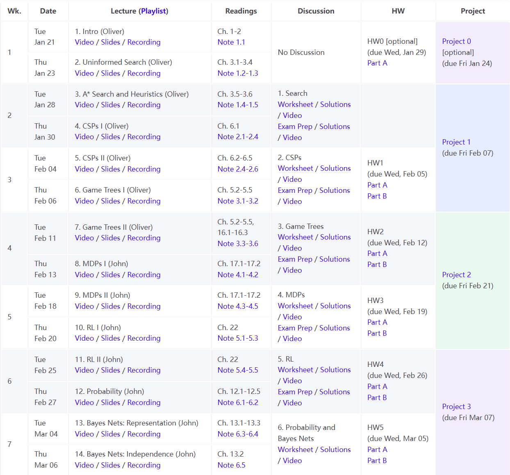
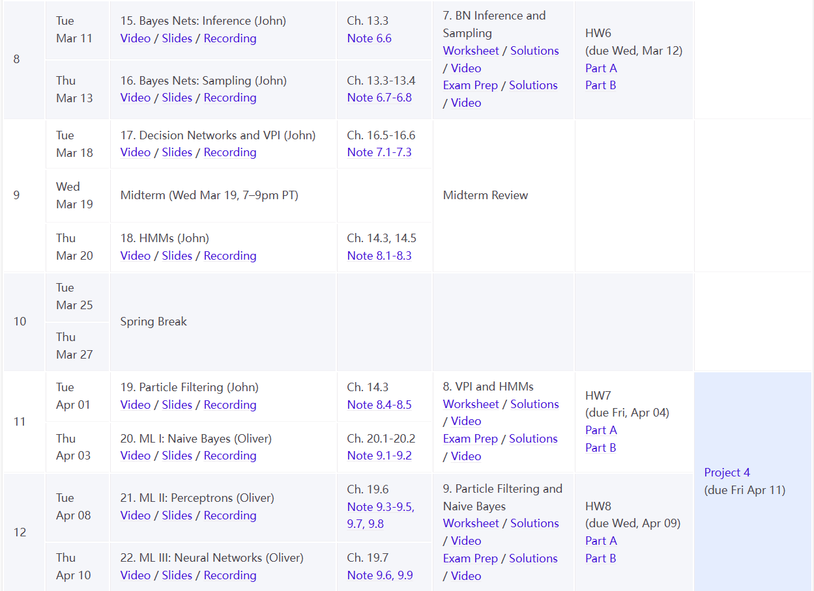
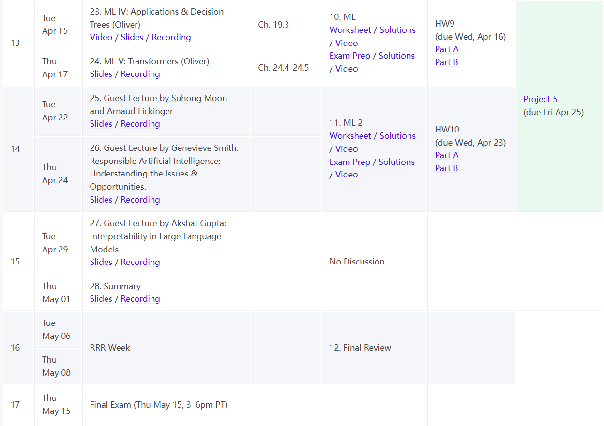

!!! tips

    课程网址：[CS 188 Spring 2025 Introduction to Artificial Intelligence at UC Berkeley](https://inst.eecs.berkeley.edu/~cs188/sp25/)

    Notes地址：[Introduction to Artificial Intelligence](https://inst.eecs.berkeley.edu/~cs188/textbook/)

    这是课程网站存档，虽然不会立刻失效，但是还是要加紧学习，毕竟AI技术迭代太快了。

    课程Calendar:

    

    

    

> 为了个人理解方便，部分pseudocode是按Python的格式写的，如有错误请指正.
>
> 中英混搭是为了个人理解方便，虽然全篇看起来就跟说梦话一样.

