> 基本完全由Claude Sonnet4.6生成.

## Preparations

本地MySQL启动：

```bash
$ sudo service mysql start  # 开启
$ sudo service mysql status # 查看状态
$ sudo service mysql stop   # 关闭
$ sudo mysql -u root -p 	# 登录
```

基本使用：

```sql
-- 查看所有数据库
SHOW DATABASES;

-- 创建一个数据库
CREATE DATABASE mydb;

-- 使用它
USE mydb;

-- 查看所有表
SHOW TABLES;

-- 执行完退出
EXIT;
```

执行文件：

```sql
# 方式一：命令行直接执行
mysql -u root -p mydb < your_query.sql

# 方式二：进入 shell 后执行
mysql> SOURCE /path/to/your_query.sql;
```


## Lec01. Relational Model

* 为什么需要数据库：扁平文件（Flat Files）的问题

    最朴素的数据存储方式是用 CSV/文本文件存储数据（比如一个文件存所有艺术家，一个文件存所有专辑）. 这种方式有三类核心问题：

    | 问题类别       | 具体表现                                                     |
    | -------------- | ------------------------------------------------------------ |
    | **数据完整性** | 如何保证同一个艺术家的信息在多处一致？如何防止非法值（比如字符串存进了年份字段）？ |
    | **实现层面**   | 每次查找都要写循环遍历，程序员负担重；多个程序同时读写同一文件怎么办？ |
    | **持久性**     | 程序崩溃时数据写了一半怎么办？机器挂了数据还在吗？           |

    这就是为什么我们需要 **DBMS（数据库管理系统）**：一个通用的软件层，替我们解决这些问题

* **DBMS** = 让应用程序能够存储和查询数据库中信息的软件. 

    **核心概念区分：**

    - **数据模型（Data Model）**：描述数据的一套抽象概念. 常见的有关系模型、NoSQL（键值/文档/图）、向量模型等. 

    - **Schema（模式）**：用某个数据模型对一批具体数据的描述，定义了数据的结构和约束. 

    

* Relational Model：

    IBM 的 **Ted Codd** 在 1969 年提出关系模型，用来解决"物理层一改，应用就崩"的问题. 

    关系模型定义了三件事：

    1. Structure → 用关系(表)来描述数据，与物理存储无关
    2. Integrity → 数据必须满足约束（如年龄不能为负数）
    3. Manipulation → 声明式 API，只说"我要什么"，不说"怎么找"

    关键概念：

    | 概念                   | 解释                                         |
    | ---------------------- | -------------------------------------------- |
    | **Relation（关系）**   | 一张无序的表，存储实体及其属性的关系         |
    | **Tuple（元组）**      | 表中的一行，即一条记录                       |
    | **Attribute（属性）**  | 表中的一列，有对应的值域（Domain）           |
    | **Primary Key**        | 唯一标识一行的属性（或属性组）               |
    | **Foreign Key**        | 一张表中指向另一张表主键的属性，建立表间关联 |
    | **Constraint（约束）** | 用户定义的、数据库实例必须满足的条件         |
    | **NULL**               | 特殊值，表示该属性未定义                     |

    **关系模型的核心价值：数据独立性(data independence)** 用户/应用只关心高层逻辑，底层物理存储怎么优化是 DBMS 自己的事，且物理层变化不会破坏应用. 

* DML：操作数据的语言

    两类风格：

    - **过程式（Procedural）**：你告诉系统"怎么做"（如用 for 循环扫描记录数）

    - **声明式（Declarative）**：你告诉系统"要什么"（如 `SELECT COUNT(*) FROM artist`），系统自己决定怎么执行——这正是 SQL 的风格

* Relational Model：查询的数学基础

    关系代数是一组**基础操作符**，每个操作符接收一或多个关系作为输入，输出一个新的关系. SQL 的底层语义正是基于关系代数. 

| 操作符               | 符号 | 含义                         | SQL 对应         |
| -------------------- | ---- | ---------------------------- | ---------------- |
| **选择 Select**      | σ    | 按谓词过滤行                 | `WHERE`          |
| **投影 Projection**  | π    | 选取特定列                   | `SELECT 列名`    |
| **并 Union**         | ∪    | 合并两个关系的所有行         | `UNION ALL`      |
| **交 Intersection**  | ∩    | 两个关系中都出现的行         | `INTERSECT`      |
| **差 Difference**    | −    | 在第一个中但不在第二个中的行 | `EXCEPT`         |
| **笛卡尔积 Product** | ×    | 所有行的组合                 | `CROSS JOIN`     |
| **连接 Join**        | ⋈    | 按共同属性相等连接两个关系   | `JOIN ... USING` |

* 关系代数的重要启示：查询优化

    同一个查询结果可以有多种计算顺序，但效率天差地别：

    ```text
    σ(b_id=102)(R ⋈ S)   ← 先 Join 10亿行，再过滤
    R ⋈ (σ(b_id=102)(S)) ← 先把 S 过滤到1行，再 Join ✅ 快得多
    ```

    SQL 是声明式的，你只写"我要 b_id=102 的连接结果"，DBMS 的**查询优化器**负责选择最优执行计划. 这就是关系模型强大的原因

* 其他数据模型

    Notes 1 末尾还介绍了两个现代常见模型：

    - **文档模型（Document Data Model）**：用 JSON/XML 表示层次化的键值对，适合半结构化数据（MongoDB 等）. 但仍有扁平文件时代的很多老问题. 

    - **向量模型（Vector Data Model）**：存储一维数组，支持最近邻搜索（ANN），主要用于 ML embedding 的语义检索（如 pgvector）. 

* 核心脉络：

```
扁平文件(flat file)的缺陷
    ↓
需要 DBMS 来解决完整性/并发/持久性问题
    ↓
早期 DBMS 过程式，物理耦合严重
    ↓
Ted Codd 提出关系模型：声明式 + 数据独立性
    ↓
关系代数给了 DBMS 查询优化的数学基础
    ↓
SQL = 声明式语言，DBMS = 优化执行引擎
```

## Lec02. Modern SQL

### SQL 概述

SQL 是一种 **declarative query language（声明式查询语言）**. 和 C/Fortran 这类 **imperative language（命令式语言）** 不同，你只需要告诉 SQL "我要什么结果"，而不需要说明"怎么去做". 

ZJU Lec 3 和 CMU 15-445 都把 SQL 分成三大类：

| 类别    | 全称                       | 主要命令                               | 中文说明                                                     |
| ------- | -------------------------- | -------------------------------------- | ------------------------------------------------------------ |
| **DDL** | Data Definition Language   | `CREATE`, `ALTER`, `DROP`              | schema definition for tables, indexes, views etc.（定义表结构、索引、视图） |
| **DML** | Data Manipulation Language | `SELECT`, `INSERT`, `UPDATE`, `DELETE` | 操作数据                                                     |
| **DCL** | Data Control Language      | `GRANT`, `REVOKE`                      | Security and Access controls（权限控制）                     |

> 重要区别（CMU 15-445 强调）：关系代数（Relational Algebra）是基于 **set（集合，不允许重复）**，而 SQL 实际上基于 **bag（多重集，允许重复）**，除非你用 `DISTINCT` 去重. 

### DDL — Data Definition Language

* Domain Types（数据类型）

```sql
char(n)          -- Fixed-length string，固定长度字符串
varchar(n)       -- Variable-length string，可变长度
int              -- Integer，整数
numeric(p, d)    -- Fixed-point number，例如 numeric(8,2) = 最多8位，小数2位
float(n)         -- Floating-point，浮点数
date             -- 日期，如 '2007-02-27'
timestamp        -- 日期+时间，如 '2011-03-17 11:18:16'
```

* CREATE TABLE

```sql
CREATE TABLE branch (
    branch_name  char(15)  NOT NULL,
    branch_city  varchar(30),
    assets       numeric(8, 2),
    PRIMARY KEY  (branch_name),
    CHECK        (assets >= 0)
);
```

这里涉及三个 **Integrity Constraints（完整性约束）**：

- `NOT NULL` — 属性不能为空
- `PRIMARY KEY (A1, ..., An)` — 声明主键（自动隐含 NOT NULL）
- `CHECK (P)` — 对属性值加条件限制

* ALTER TABLE / DROP TABLE

```sql
-- 增加属性
ALTER TABLE loan ADD loan_date date;

-- 删除属性（不是所有数据库都支持）
ALTER TABLE branch DROP branch_city;

-- 删除整张表（危险！不可逆！）
DROP TABLE branch;
```

* CREATE INDEX（索引）

```sql
CREATE INDEX b_index ON branch (branch_name);

-- UNIQUE INDEX 相当于声明一个 candidate key（候选键）
CREATE UNIQUE INDEX uni_acnt_index ON account (account_number);
```

------

### Basic Structure of SELECT

ZJU Lec 3 的核心模板：

```sql
SELECT A1, A2, ..., An
FROM   r1, r2, ..., rm
WHERE  P
```

这等价于关系代数（Relational Algebra）表达式：

$$\Pi_{A_1, A_2, ..., A_n}(\sigma_P(r_1 \times r_2 \times ... \times r_m))$$

即：先做 **Cartesian Product（笛卡尔积）**，再用 `WHERE` 做 **Selection（σ 选择）**，最后用 `SELECT` 做 **Projection（π 投影）**. 

SELECT 子句的关键语法：

**DISTINCT（去重）vs ALL（保留重复，默认）：**

```sql
SELECT DISTINCT branch_name FROM loan;  -- 去重（SQL 默认是 bag，这里强制 set）
SELECT ALL branch_name FROM loan;       -- 保留重复（等同不写 ALL）
```

**Rename operation — AS 子句：**

```sql
-- Column rename（列重命名）
SELECT borrower.loan_number AS loan_id, amount
FROM borrower, loan
WHERE borrower.loan_number = loan.loan_number;

-- Tuple variable（元组变量）：用于同一张表的自连接
SELECT DISTINCT T.branch_name
FROM branch AS T, branch AS S
WHERE T.assets > S.assets AND S.branch_city = 'Brooklyn';
```

**String operations（字符串操作）：**

```sql
-- LIKE：模糊匹配，% 匹配任意子串，_ 匹配单个字符
SELECT customer_name FROM customer
WHERE customer_name LIKE '%泽%';

-- Escape character：匹配字面量 %
LIKE 'Main\%' ESCAPE '\';

-- Concatenation（字符串拼接）：||
SELECT '客户名=' || customer_name FROM customer;
```

### Set Operations

```sql
-- UNION：合并并去重（相当于集合的 ∪）
(SELECT customer_name FROM depositor)
UNION
(SELECT customer_name FROM borrower);

-- UNION ALL：合并但保留重复
(SELECT ...) UNION ALL (SELECT ...);

-- INTERSECT：取交集（∩）
(SELECT ...) INTERSECT (SELECT ...);

-- EXCEPT：取差集（−）
(SELECT ...) EXCEPT (SELECT ...);
```

### Aggregate Functions — 聚合函数

CMU 15-445 和 ZJU 的内容高度一致：

| 函数         | 说明                                     |
| ------------ | ---------------------------------------- |
| `AVG(col)`   | 平均值                                   |
| `MIN(col)`   | 最小值                                   |
| `MAX(col)`   | 最大值                                   |
| `SUM(col)`   | 求和                                     |
| `COUNT(col)` | 计数（`COUNT(*)` 统计所有行，包括 null） |

**重要例子（来自 ZJU 银行数据库）：**

```sql
-- Example 1: 每个 branch 的平均账户余额，只保留平均值 > 1200 且在 Brooklyn 的
SELECT A.branch_name, AVG(balance)
FROM account A, branch B
WHERE A.branch_name = B.branch_name AND branch_city = 'Brooklyn'
GROUP BY A.branch_name
HAVING AVG(balance) > 1200;
```

> **WHERE vs HAVING 的区别（重点考点）：**
>
> - `WHERE`：在 grouping 之前过滤 **rows（行）**
> - `HAVING`：在 grouping 之后过滤 **groups（组）**
> - 聚合函数不能直接出现在 `WHERE` 子句中！

### Null Values — 空值处理

这是 SQL 中最容易出错的地方. 

```sql
-- 检测 null
SELECT loan_number FROM loan WHERE amount IS NULL;
-- 注意：WHERE amount = NULL 是错的！= null 永远是 unknown，不是 true

-- 任何与 null 的算术运算结果都是 null
-- 5 + null → null

-- 三值逻辑（Three-valued logic）：true / false / unknown
-- unknown AND true  = unknown
-- unknown OR true   = true      ← 注意！
-- unknown AND false = false     ← 注意！
-- NOT unknown       = unknown
```

聚合函数的 null 行为：**除了 `COUNT(\*)`，其他聚合函数（AVG, SUM, MIN, MAX）会自动忽略 null 值.**

### Nested Subqueries

这是浙大 Lec 3 最重量级的部分之一. 

* `IN` / `NOT IN`

```sql
-- 找有存款也有贷款的客户
SELECT DISTINCT customer_name
FROM borrower
WHERE customer_name IN (SELECT customer_name FROM depositor);

-- 找有贷款但没有存款的客户
SELECT DISTINCT customer_name
FROM borrower
WHERE customer_name NOT IN (SELECT customer_name FROM depositor);
```

* `SOME` / `ALL`（集合比较）

| 操作                | 含义                              |
| ------------------- | --------------------------------- |
| `> SOME (subquery)` | 大于子查询结果中的**某一个**（∃） |
| `> ALL (subquery)`  | 大于子查询结果中的**所有**（∀）   |
| `= SOME`            | 等价于 `IN`                       |
| `<> ALL`            | 等价于 `NOT IN`                   |

```sql
-- 找 assets 比 Brooklyn 某一个 branch 还大的所有 branch
SELECT branch_name FROM branch
WHERE assets > SOME (
    SELECT assets FROM branch WHERE branch_city = 'Brooklyn'
);

-- 找 assets 比 Brooklyn 所有 branch 都大的 branch
SELECT branch_name FROM branch
WHERE assets > ALL (
    SELECT assets FROM branch WHERE branch_city = 'Brooklyn'
);
-- 等价写法（CMU 风格）：
WHERE assets > (SELECT MAX(assets) FROM branch WHERE branch_city = 'Brooklyn')
```

* `EXISTS` / `NOT EXISTS`

```sql
-- exists r ⟺ r ≠ ∅（子查询结果非空则为 true）
-- not exists r ⟺ r = ∅

-- 经典例子：找在 Brooklyn 每一个 branch 都有存款的客户
-- 逻辑：不存在 Brooklyn 的某个 branch，让该客户没有存款账户
SELECT DISTINCT S.customer_name
FROM depositor AS S
WHERE NOT EXISTS (
    (SELECT branch_name FROM branch WHERE branch_city = 'Brooklyn')
    EXCEPT
    (SELECT DISTINCT R.branch_name
     FROM depositor AS T, account AS R
     WHERE T.account_number = R.account_number
       AND S.customer_name = T.customer_name)
);
```

### Views

```sql
-- 创建视图（Create View）
CREATE VIEW all_customer AS
    (SELECT branch_name, customer_name
     FROM depositor, account
     WHERE depositor.account_number = account.account_number)
    UNION
    (SELECT branch_name, customer_name
     FROM borrower, loan
     WHERE borrower.loan_number = loan.loan_number);

-- 使用视图（像普通表一样查询）
SELECT customer_name FROM all_customer
WHERE branch_name = 'Perryridge';

-- 删除视图
DROP VIEW all_customer;
```

**Views 的两大好处（ZJU 强调）：**

1. **Security（安全性）**：隐藏敏感字段，只暴露必要数据
2. **Logical data independence（逻辑数据独立性）**：底层表结构变化时，上层应用可以通过视图保持不变

### WITH clause — 公共表表达式（CTE）

CMU 15-445 称之为 **Common Table Expressions (CTE)**，ZJU 称之为 **With clause（局部视图）**：

```sql
-- 找所有余额最大的账户（ZJU Banking 例子）
WITH max_balance(value) AS (
    SELECT MAX(balance) FROM account
)
SELECT account_number
FROM account, max_balance
WHERE account.balance = max_balance.value;

-- 更复杂的例子：找总余额高于平均总余额的 branch
WITH branch_total(branch_name, a_bra_total) AS (
    SELECT branch_name, SUM(balance)
    FROM account
    GROUP BY branch_name
),
total_avg(value) AS (
    SELECT AVG(a_bra_total) FROM branch_total
)
SELECT branch_name, a_bra_total
FROM branch_total A, total_avg B
WHERE A.a_bra_total >= B.value;
```

CMU 15-445 还介绍了 **Recursive CTE（递归公共表表达式）**，让 SQL 具备图灵完备性：

```sql
-- 打印 1 到 10（CMU 例子）
WITH RECURSIVE cteSource(counter) AS (
    (SELECT 1)
    UNION
    (SELECT counter + 1 FROM cteSource WHERE counter < 10)
)
SELECT * FROM cteSource;
```

### Joined Relations

这是 ZJU Lec 3 末尾的重点，ZJU 的分类非常清晰：

**Join 类型总结（结合 ZJU 表格）：**

| Join type                  | 说明                                     |
| -------------------------- | ---------------------------------------- |
| `NATURAL INNER JOIN`       | 以同名属性等值连接，只输出匹配成功的元组 |
| `NATURAL LEFT OUTER JOIN`  | 左表全部保留，右表不匹配的用 null 填充   |
| `NATURAL RIGHT OUTER JOIN` | 右表全部保留，左表不匹配的用 null 填充   |
| `FULL OUTER JOIN`          | 两边都保留，不匹配的互相用 null 填充     |

**非自然连接（ON condition）：** 保留结果中的重名属性，不自动去重

```sql
-- 例子：loan INNER JOIN borrower ON loan.loan_number = borrower.loan_number
SELECT * FROM loan INNER JOIN borrower
ON loan.loan_number = borrower.loan_number;
-- 结果含两列 loan_number（来自两张表），不合并

-- 用 USING 则只保留一列
SELECT * FROM loan FULL OUTER JOIN borrower USING (loan_number);
```

### Window Functions（窗口函数）

ZJU Lec 3 没有涵盖这部分，但 CMU 15-445 Lecture #02 有详细讲解，属于 Modern SQL 的重要内容：

**Window function** 像聚合函数，但不把行合并成一行——每行都保留，并获得一个基于窗口计算的值. 

```sql
-- ROW_NUMBER：为每行编号（按 cid 分组）
SELECT cid, sid, ROW_NUMBER() OVER (PARTITION BY cid)
FROM enrolled ORDER BY cid;

-- RANK：找每门课第二高成绩的学生
SELECT * FROM (
    SELECT *, RANK() OVER (PARTITION BY cid ORDER BY grade ASC) AS rank
    FROM enrolled
) AS ranking
WHERE ranking.rank = 2;
```

> `PARTITION BY` = 分组（类似 `GROUP BY`，但不合并行）；`ORDER BY` 在 `OVER` 内部控制排名顺序. 

------

> [!NOTE]
>
> 综合例题解析（ZJU Lec 3 末尾例题）
>
> 以下是 ZJU 给出的学生数据库例题，用来综合练习：
>
> ```sql
> student(student-no, student-name, sex, age, dept-name)
> course(course-no, course-name, credit)
> study(student-no, course-no, score)
> ```
>
> **(1) 找学过 'Database System' 的学生姓名，按成绩升序排列：**
>
> ```sql
> SELECT student_name
> FROM student S, study T, course C
> WHERE S.student_no = T.student_no
> AND T.course_no = C.course_no
> AND course_name = 'Database System'
> ORDER BY score ASC;
> ```
>
> **(2) 找 'Database System' 得分最高的学生：**
>
> ```sql
> SELECT student_name
> FROM student S, study T, course C
> WHERE S.student_no = T.student_no
> AND T.course_no = C.course_no
> AND course_name = 'Database System'
> AND T.score >= (
>    SELECT MAX(score)
>    FROM study T2, course C2
>    WHERE T2.course_no = C2.course_no
>      AND course_name = 'Database System'
> );
> ```
>
> **(3) 找平均分最高的课程（Method 2: WITH clause）：**
>
> ```sql
> WITH course_avg(course_no, score_avg) AS (
>  SELECT course_no, AVG(score)
>  FROM study
>  GROUP BY course_no
> )
> SELECT course_name
> FROM course
> WHERE course_no IN (
>  SELECT course_no
>  FROM course_avg
>  WHERE score_avg = (SELECT MAX(score_avg) FROM course_avg)
> );
> ```

------

总结：核心考点

| 主题                | 关键点                                                       |
| ------------------- | ------------------------------------------------------------ |
| **执行顺序**        | `FROM → WHERE → GROUP BY → HAVING → SELECT → DISTINCT → ORDER BY` |
| **HAVING vs WHERE** | `WHERE` 过滤行（分组前），`HAVING` 过滤组（分组后）          |
| **NULL**            | 三值逻辑（true/false/unknown），用 `IS NULL` 而非 `= NULL`   |
| **子查询**          | `IN/NOT IN`，`SOME/ALL`，`EXISTS/NOT EXISTS`，`UNIQUE`       |
| **SOME vs ALL**     | `= SOME` ≡ `IN`；`<> ALL` ≡ `NOT IN`                         |
| **View vs WITH**    | `VIEW` 全局可见，`WITH` 子句局部使用，语义等价               |
| **JOIN 类型**       | `INNER`（只匹配），`OUTER`（保留未匹配行，补 null），`NATURAL`（同名属性等值） |
| **CMU 补充**        | Window Functions（`ROW_NUMBER`,`RANK`），Recursive CTE       |


## Lec03. Storage I

这一讲的核心问题是：**数据库是怎么把数据存在磁盘上的？DBMS 又是怎么管理这些数据的？**

###  Storage Hierarchy

首先理解一个基本事实：不同存储介质的速度差距极大. 

这就是著名的 **Storage Hierarchy**（存储层次结构）：**关键区分：Volatile vs Non-volatile（易失性 vs 非易失性）**

- **Volatile（易失性）**：断电数据就消失 → CPU Registers, Caches, DRAM
- **Non-volatile（非易失性）**：断电数据保留 → SSD, HDD, Network Storage


DBMS 关心的核心问题：**数据库的数据量通常远超 DRAM 容量**，所以必须在磁盘和内存之间高效地移动数据. 

------

### DBMS vs. OS（为什么 DBMS 不信任操作系统？）

你可能会想：操作系统本来就有 Virtual Memory 机制（虚拟内存），为什么 DBMS 不直接用？

答案：**"The operating system is not your friend."**（OS 不是你的朋友）

具体来说，OS 提供了 `mmap`（内存映射文件），可以把磁盘文件直接映射到进程的地址空间，看起来很方便. 但问题在于：

| 问题                        | 说明                                                         |
| --------------------------- | ------------------------------------------------------------ |
| **Page fault 阻塞**         | 如果 `mmap` 碰到 page fault，整个进程被阻塞，DBMS 无法继续处理其他 query |
| **OS 不了解 DBMS 访问模式** | OS 不知道哪些 page 会被访问，做出的换页决策不如 DBMS 自己聪明 |
| **写操作不安全**            | 不能保证 correctness 和 transaction 语义                     |

DBMS 宁愿自己管理：它知道哪些 page 会被用到、什么时候应该换出、怎么保证 durability. 

OS 提供的三个工具（如果必须用的话）：

- `madvise`：告诉 OS 你即将读哪些 page（让 OS 提前预读）
- `mlock`：锁住某段内存，不让 OS 把它换到磁盘
- `msync`：强制把某段内存刷回磁盘

但 CMU 15-445 的建议是：**不要在 DBMS 中用 `mmap`**. 

### File Storage（文件存储）

DBMS 把数据库存成磁盘上的文件. 

- OS 不知道这些文件里装的是什么（它只是看到一堆二进制）
- 有些 DBMS 用**一个大文件**（如 SQLite），有些用**多个文件的层次结构**
- DBMS 用自己的 **proprietary format（私有格式）**，只有该 DBMS 能解读
- **Storage Manager（存储管理器）** 负责管理这些文件，将文件表示为 pages 的集合

------

### Database Pages（数据库页）

DBMS 把文件划分成固定大小的块，叫做 **Page**（页）. 

一个 Page 可以存：tuples（行数据）、indexes（索引）、log records 等. 大多数 DBMS **不把不同类型的数据混在同一个 page 里**. 

**三种不同层面的 Page，注意区分：**

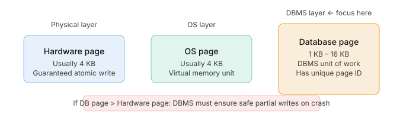

**为什么 Database Page 大小很重要**

- **Read-heavy workload（读密集型）**：倾向用更大的 page（≥1 MB），一次读更多数据，I/O 效率高
- **Write-heavy workload（写密集型）**：倾向用更小的 page（4–16 KB），减少每次写的开销

每个 page 有一个 **unique page ID**. DBMS 内部有一层 **indirection layer（间接层）**，把 page ID 映射到具体的文件路径和 offset（偏移量）. 上层只需说"我要 page #42"，Storage Manager 自己去找对应的文件位置. 

------

### Database Heap（堆文件）

如何在磁盘上组织这些 pages？最常见的方式叫 **Heap File Organization**. 

> **Heap File** = an unordered collection of pages where tuples are stored in random order. （无序的 page 集合，tuple 以任意顺序存储）

为了让 DBMS 能快速找到某个 page，需要一个 **Page Directory（页目录）**：

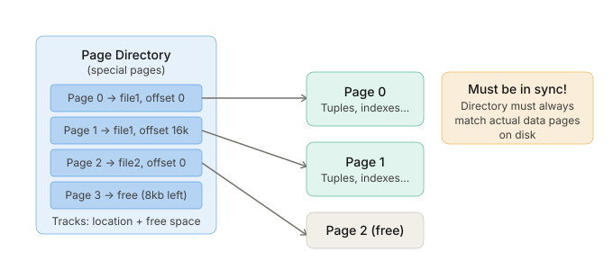

Page Directory 追踪的元数据包括：

- 每个 page 在磁盘上的**位置**（文件路径 + offset）
- 每个 page 的**剩余空闲空间**大小
- 哪些 page 是完全空的（**free/empty pages**）

------

### Page Layout（页面内部结构）

每个 page 内部有两部分：**Header（头部元数据）+ 实际数据**. 

**Header 包含：**

- Page size（页大小）
- Checksum（校验和，用于检测数据损坏）
- DBMS version（版本信息）
- Transaction visibility（事务可见性信息）

数据布局有三种方案，Note 3 重点讲第一种：**Tuple-Oriented（元组导向）**. 

#### Slotted Pages（槽页）——最主流的设计

这是当前 DBMS 中最常用的 tuple 存储方式：


**Slotted Page 的工作原理：**

- **Slot Array（槽数组）** 从 page 头部向右增长，每个 slot 记录对应 tuple 的起始 offset
- **Tuple data** 从 page 尾部向左增长
- **Page is full（满页）**：当 slot array 和 tuple data 相遇时
- 好处：删除 tuple 只需把 slot 标记为无效，不用移动其他 tuple；tuple 在 page 内可以移动（更新 slot 中的 offset 即可），上层只看 slot 号

------

### Record IDs（记录标识符）

DBMS 给每个 tuple 分配一个 **Record ID（RID / tuple ID）**，代表它在数据库中的物理位置. 

最常见的格式：

```
Record ID = (page_id, slot_number)
```

例如：RID = (page #5, slot #3) → 第5页的第3个槽位里的 tuple. 

> ⚠️ 应用层（application）不能依赖这些 ID！因为 DBMS 内部可能移动 tuple（如 compaction），RID 会变. 

------

### Tuple Layout（Tuple 内部结构）

一个 Tuple 本质上就是一段字节序列（sequence of bytes）. DBMS 负责把这些字节解释成有意义的属性值. 

**Tuple 的组成：**


**重要细节：**

- Attributes（属性）按你 `CREATE TABLE` 时定义的顺序存储
- 属性必须 **word aligned（字节对齐）**，所以可能有 padding（填充字节）
- Tuple Header **不存储 schema 信息**（schema 在 system catalog 里另外存）
- 大多数 DBMS 不允许 tuple 超过一个 page 的大小

------

### Data Representation（数据类型的实际存储）

不同数据类型在 DBMS 中的物理存储方式：

| 类型                          | 存储方式                                       | 注意事项             |
| ----------------------------- | ---------------------------------------------- | -------------------- |
| `INTEGER / BIGINT / SMALLINT` | C/C++ native int 格式                          | 直接存               |
| `FLOAT / REAL`                | IEEE-754 浮点数                                | **不精确**，但速度快 |
| `NUMERIC / DECIMAL`           | Fixed-point decimal                            | 任意精度，但较慢     |
| `VARCHAR / TEXT / BLOB`       | 长度前缀 + 数据字节                            | 变长类型             |
| `TIME / DATE / TIMESTAMP`     | 64-bit integer（Unix epoch 以来的毫秒/微秒数） | 统一成整数存储       |

**关于大型数据（Overflow & External Storage）：**

当 VARCHAR/BLOB 数据太大，放不进一个 page 时：

- **Overflow Pages（溢出页）**：用单独的页存超长数据，tuple 内只存一个指向溢出页的 record ID
- **External Value Storage（外部存储）**：部分系统允许把超大 value 存到外部文件（像 BLOB），DBMS 无法保证这些文件的 durability 和 transaction 语义

### Null Data Types（NULL 值的三种存储方式）

NULL 是一个特殊值，不能直接用整数或浮点数表示. DBMS 有三种方法处理：

1. **Null Column Bitmap Header（位图，最主流）**：在 tuple header 里用一个 bitmap，每一位对应一个列，置 1 表示该列为 NULL. Row-store 最常用. 
2. **Special Values（特殊占位符）**：为某个数据类型选一个特殊值表示 NULL，例如用 `INT32_MIN`（即 -2147483648）表示 NULL. Column-store 常用. 
3. **Per-Attribute Null Flag（每属性标记位）**：每个属性旁边存一个 bit 标记是否为 NULL. 缺点是每个 bit 都需要填充对齐，浪费空间，因此不常用. 

整体思路图：


总结：Note 3 的核心考点

| 概念                  | 关键记忆点                                                   |
| --------------------- | ------------------------------------------------------------ |
| **Storage Hierarchy** | 越靠近 CPU 越快越贵越小；DRAM 以下为非易失                   |
| **DBMS vs OS**        | 不用 `mmap`；DBMS 比 OS 更了解自己的访问模式                 |
| **Database Page**     | Fixed-size block, has unique page ID, 1–16 KB                |
| **Three Page Levels** | Hardware page (4KB) / OS page (4KB) / DB page (1-16KB)       |
| **Heap File**         | Unordered collection of pages; managed by page directory     |
| **Slotted Pages**     | Slot array grows →, tuple data grows ←; most common layout   |
| **Record ID**         | = (page_id, slot_number); physical location, app can't rely on it |
| **Tuple Layout**      | Header (visibility + NULL bitmap) + attribute data (ordered, word-aligned) |
| **NULL storage**      | Bitmap header（最主流）/ special value / per-attribute flag  |


## Lec04. Memory & Disk Management

Note 4 的核心问题：**DBMS 如何在有限的内存中高效地管理来自磁盘的 pages？**

### 为什么需要 Buffer Pool？

回顾 Note 3 的问题：磁盘 I/O 非常慢（毫秒级），CPU 运算非常快（纳秒级）.DBMS 不可能每次访问一个 tuple 都去磁盘读一次.

**解决方案：在内存中维护一个 Buffer Pool（缓冲池）**，就像 CPU 的 cache 一样，把常用的 disk pages 缓存在内存中.


Buffer Pool 本质上是 DBMS 在内存里申请的一大块区域，被切分成等大小的 **Frame（帧）**.每个 Frame 可以装一个 page.当 Execution Engine 需要某个 page 时，Buffer Pool Manager 负责：

1. 检查该 page 是否已在某个 frame 里
2. 如果有：直接返回指针（**hit**）
3. 如果没有：从磁盘读入，找一个空 frame 装进去，再返回指针（**miss**）

### Buffer Pool Metadata（缓冲池元数据）

Buffer Pool Manager 需要追踪很多信息，核心数据结构是 **Page Table（页表）**.

> ⚠️ **Page Table vs. Page Directory — 极易混淆，必须分清！**

|                      | **Page Directory**            | **Page Table**                        |
| -------------------- | ----------------------------- | ------------------------------------- |
| **存在哪里**         | 磁盘（disk）上                | 内存（memory）中                      |
| **映射关系**         | page_id → 磁盘上的文件+offset | page_id → buffer pool 中的 frame 位置 |
| **是否需要持久化**   | ✅ 必须，DBMS 重启后要用       | ❌ 不需要，重启后重建                  |
| **在 Note 3 里讲过** | ✅ Yes                         | ❌ No（这是 Note 4 新内容）            |

**Page Table 每个条目还额外记录：**


**三个关键元数据字段的意义：**

**① Dirty Flag（脏页标志）**：某线程修改了 page 内容后，把这个 flag 置 1.在把这个 frame 腾出来（evict）之前，必须先把修改写回磁盘，否则修改就丢失了.

**② Pin / Reference Counter（引用计数）**：记录当前有多少个线程在访问这个 page.线程访问前要 increment，访问完 decrement.只要 pin > 0，这个 page **绝对不能被 evict**.（注意：Pin 不阻止其他线程同时访问这个 page，并发控制靠 latch.）

**③ Access Tracking Info**：追踪谁在什么时候访问过，供 replacement policy 使用.

------

### Locks vs. Latches

Note 4 引入了一个非常容易混淆的概念对：

|                       | **Lock（锁）**                              | **Latch（闩锁）**                         |
| --------------------- | ------------------------------------------- | ----------------------------------------- |
| **保护对象**          | 数据库逻辑内容（tuples、tables、databases） | DBMS 内部数据结构（hash table、内存区域） |
| **持有时间**          | 整个 transaction 期间                       | 只在一个操作的极短时间内                  |
| **是否需要 rollback** | ✅ 需要（事务失败要回滚）                    | ❌ 不需要                                  |
| **对用户可见**        | ✅ 可见（用户可以查询哪些 lock 被持有）      | ❌ 不可见                                  |
| **实现方式**          | 复杂的事务管理机制                          | 简单的 mutex / 条件变量                   |
| **类比**              | 数据库的"大锁"，保护业务逻辑                | 操作系统的 mutex，保护内部结构            |

> 用中文类比：**Lock** 好比给整个图书馆某本书贴"借出"标签（持续时间长，需要办理归还手续）；**Latch** 好比图书馆员工在整理书架时说"等一下"（只占几秒，不用记录）.

------

### Buffer Replacement Policies（页面置换策略）

当 buffer pool 满了，需要 evict 某个 frame 来腾位置放新 page，用什么策略选择哪个 frame 被 evict？

> ⚠️ **前提：被 pin 的 page（pin > 0）不可以被 evict！**

#### LRU（Least Recently Used）

维护每个 page 的**最近一次被访问的时间戳**，每次 evict 时踢掉时间戳最旧的那个.

- 优点：直觉上合理，刚被用过的 page 近期还会用到
- 实现：可用排序队列维护
- 缺点：**时间戳开销大**；有 sequential flooding 问题

#### CLOCK（LRU 的近似算法）

不存时间戳，只给每个 page 一个 **reference bit（引用位）**.所有 frames 组成一个圆形缓冲区，配合一个 "clock hand（时钟指针）"：

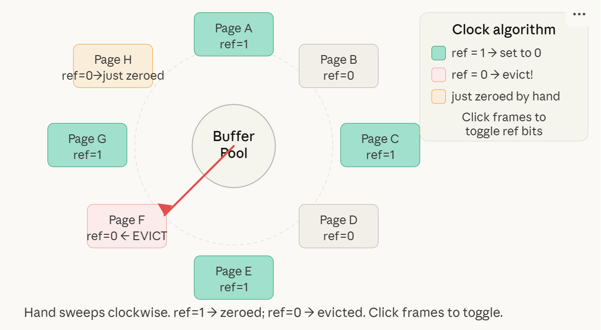

**CLOCK 算法步骤：**

1. 每个 page 有一个 **reference bit**，初始为 0
2. 一个 page 被访问时，把它的 ref bit 设为 1
3. 需要 evict 时，时钟指针顺时针扫描：
    - 遇到 ref = 1 → **把它置 0**，继续扫
    - 遇到 ref = 0 → **evict 这个 page**，把新 page 放进来，指针前进

CLOCK 的优势：不需要存真实时间戳，开销小，是 LRU 的近似.

**会引发的问题：Sequential Flooding（顺序扫描洪泛）.这是LRU 和 CLOCK 都有的弱点.**

> **Sequential Flooding（顺序扫描洪泛）**：做一次全表扫描（sequential scan），会把 buffer pool 里所有"有价值"的 page 都踢走，填满大量"只用一次"的 page.

想象你有 100 个 frame，但要全表扫描一张有 10000 个 page 的表——每读一个新 page，就踢走一个旧 page.扫完后，buffer pool 里全是刚刚读过的、下次几乎不会再用的 pages，而其他查询频繁需要的 pages 全被踢走了.

在这种场景下，**最近用过的 page 反而是最应该被 evict 的**，LRU 的逻辑在这里是反的！

**改进方案：**

**① LRU-K**

不只记最近一次访问时间，而是记**最近 K 次**访问的时间戳，用访问间隔来预测下次访问时间.K 越大越准，但开销越大.还需要维护一个**ghost cache（幽灵缓存）**，记录最近被 evict 的 page 的历史，防止 thrashing（抖动）.

MySQL 的近似实现（类似 LRU-2）：用一个**单链表**，但有两个入口点（old list 和 young list）：

- 访问时 page 已在 old list → 移到 young list 头部
- 访问时 page 不在任何 list → 放入 old list 头部
- Evict 永远从 old list 尾部踢

**② Localization（本地化置换）**

DBMS 按 query / transaction 为单位决定踢哪些 page，而不是全局选择.这样一个 sequential scan 的洪泛只影响它自己的"区域"，不污染整个 buffer pool.

**③ Priority Hints（优先级提示）**

事务在访问 page 时告诉 buffer pool："这个 page 很重要" 或 "这个 page 用完就可以扔".buffer pool 据此调整 eviction 优先级.

**④ ARC（Adaptive Replacement Cache）**

IBM Research 发明的算法，同时考虑 **recency（近期性）** 和 **frequency（频率）**：

- **T1 list（Recency List）**：只被访问过一次的 pages
- **T2 list（Frequency List）**：被访问过至少两次的 pages
- **目标参数 p**：动态调整 T1 和 T2 的大小比例
- 还有对应的两个 **ghost list**（B1, B2），记录最近被 evict 的 page 历史

当 B1 的 miss 多 → 增大 T1（更重视近期性）；当 B2 的 miss 多 → 增大 T2（更重视频率）.这样 ARC 能自适应不同访问模式.

#### **Dirty Pages（脏页处理）**

Evict 一个 page 时有两条路径：


**Background Writing（后台写）**的思路：不要等到 evict 时才慌忙写磁盘.DBMS 有一个后台线程，定期扫描 page table，把脏页悄悄写回磁盘，写完后把 dirty flag 清零.这样 evict 时大多数 page 都是干净的，走 fast path.

### Buffer Pool 的其他用途

Buffer Pool 不只是用来缓存 table data，DBMS 里很多组件都需要内存：

- **Tuple Storage and Indexes**（数据和索引缓存）
- **Sorting and Join Buffers**（排序和 Join 时的临时缓冲区）
- **Query and Dictionary Caches**（查询缓存、数据字典缓存）
- **Maintenance and Log Buffers**（维护任务、Write-Ahead Log 的缓冲）

这些不一定都要通过 Buffer Pool Manager，有些可以直接用 `malloc` 分配内存.

### Disk I/O 与 OS Cache

**Direct I/O（直接 I/O）**：大多数 DBMS 使用 `O_DIRECT` 标志，**绕过 OS 的 filesystem cache**.

原因：OS 有自己的 page cache，如果 DBMS 也有 Buffer Pool，那同一个 page 在内存里就有两份拷贝，既浪费内存，又出现两套 eviction 策略互相打架的问题.

> **PostgreSQL 是例外**，它使用 OS 的 page cache（不用 `O_DIRECT`）.

DBMS 内部维护自己的 **I/O 请求队列**，按优先级排序：

- Sequential I/O vs. Random I/O
- Critical path task vs. Background task
- Table vs. Index vs. Log vs. Ephemeral data
- 事务信息、用户 SLA 等

OS 不了解这些，所以 OS 的 I/O 调度对 DBMS 来说是次优的.

> ⚠️ **Side note**：`fsync` 默认在出错时会静默地把 page 标记为 clean，即使实际上没有成功写到磁盘——这是一个很危险的 bug，在 PostgreSQL 的早期版本中曾造成数据损坏.

Note 4 核心考点：

| 概念                      | 关键记忆点                                                   |
| ------------------------- | ------------------------------------------------------------ |
| **Buffer Pool**           | 内存中的 frame 数组，缓存磁盘 pages                          |
| **Page Table**            | in-memory hash table，page_id → frame；**不需要持久化**      |
| **Page Directory**        | 在磁盘上，page_id → 文件位置；**必须持久化**                 |
| **Dirty Flag**            | 被修改过的 page；evict 前必须写回磁盘                        |
| **Pin Counter**           | > 0 则不可 evict；线程访问前 increment，访问后 decrement     |
| **Lock vs. Latch**        | Lock 保护逻辑数据，持有整个 txn；Latch 保护内部结构，只持有极短时间 |
| **LRU**                   | 踢最久未访问的 page；有 sequential flooding 问题             |
| **CLOCK**                 | LRU 近似；ref bit + 时钟指针，ref=1 则清零，ref=0 则 evict   |
| **Sequential Flooding**   | 全表扫描污染 buffer pool；LRU/CLOCK 都受影响                 |
| **LRU-K / ARC**           | 更好的 replacement 策略；考虑频率+近期性                     |
| **Background Writing**    | 后台定期刷脏页，避免 eviction 时走 slow path                 |
| **Direct I/O (O_DIRECT)** | 绕过 OS page cache，DBMS 自己管                              |


## Lec05. Storage II

内容分两大块：**Buffer Pool 优化**，以及三种**存储模型的深入对比**（Tuple-Oriented、Log-Structured、Index-Organized）.

Note 5 解答的核心问题：**除了基本的 Buffer Pool，还有哪些优化手段？存数据除了 Slotted Page，还有哪些方式，各有什么优缺点？**


### Part 1 — Buffer Pool Optimizations（缓冲池优化）

Note 4 讲了 Buffer Pool 的基础，Note 5 一开头就讲了四种进阶优化.

#### Multiple Buffer Pools（多缓冲池）

不只维护一个大 Buffer Pool，而是针对不同用途分别维护**多个 Buffer Pool**：

- 按数据库分（per-database）
- 按表分（per-table）
- 按 page 类型分（per-page type，如 data page vs. index page）

**好处：**

- 每个 pool 可以使用最适合自己数据访问模式的 replacement policy（本地策略）
- 减少 **latch contention（闩锁竞争）**——多个线程不再争抢同一个 pool 的锁
- 提升 **locality（局部性）**——相关数据聚集在同一个 pool 中

**如何把 page 路由到对应的 pool？两种方式：**

| 方式           | 做法                                                         | 特点                   |
| -------------- | ------------------------------------------------------------ | ---------------------- |
| **Object IDs** | 把 record ID 扩展，附加一个对象标识符；维护 object → pool 的映射 | 精细控制，但有存储开销 |
| **Hashing**    | 直接对 page_id 做哈希，结果决定用哪个 pool                   | 简单均匀，通用性强     |

#### Pre-fetching（预取）

DBMS 根据**查询计划**，提前把即将需要的 pages 读入 buffer pool，而不是等到需要时再去磁盘取.

两种典型场景：

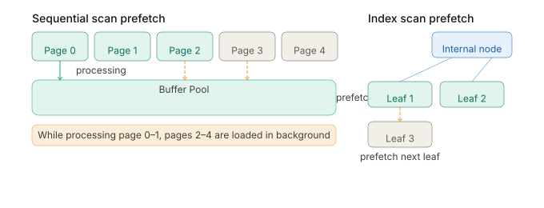注意：预取的是**逻辑上的下一页**（比如索引叶子节点的下一个），不一定是磁盘上物理位置相邻的 page.

#### Scan Sharing（扫描共享 / Synchronized Scans）

**核心思想**：如果两个查询都要全表扫描同一张表，何必各扫一遍？让它们**共享同一个 cursor（游标）**！

具体做法：

1. Query A 开始扫描，cursor 在 page 5
2. Query B 也要扫同一张表，DBMS 把 B 的 cursor **附加到** A 的 cursor 上，从 page 5 开始一起扫
3. B 跟着 A 扫到末尾后，再**回头**扫 page 0–4（它加入时没扫到的部分）
4. DBMS 记录 B 加入的位置，确保 B 扫到了完整的数据

**前提**：SQL 不保证 scan 的顺序，所以 B 拿到数据的顺序不同于从头扫也是合法的.

**Buffer Pool 优化小结：**

这三种优化都体现了同一个核心思想：**DBMS 比 OS 更了解自己的查询计划，所以能做出更好的内存决策（eviction、allocation、pre-fetching）**.

再次强调：**The Operating System is not your friend.**


### Part 2 — 三种存储模型深度对比

Note 3 只讲了 Tuple-Oriented 的基础，Note 5 把三种存储模型全部展开讲清楚.

#### Tuple-Oriented Storage（元组导向存储）

这是 Note 3 讲的经典 Slotted Page 方案，复习一下操作流程：

**读取一个 tuple：**

1. 查 Page Directory → 找到 page 在磁盘的位置
2. 把 page 从磁盘读入 buffer pool
3. 用 slot array 找到 tuple 在 page 内的 offset

**插入一个 tuple：**

1. 查 Page Directory → 找一个有空余 slot 的 page
2. 把 page 读入 buffer pool
3. 检查 slot array 确认空间够
4. 插入数据，更新 slot array

**更新一个 tuple：**

- 如果新值**放得下**原来的空间 → in-place update（原地更新，快）
- 如果新值**放不下** → 把旧值标记删除，像插入新 tuple 一样重新插一份

**三大问题：**

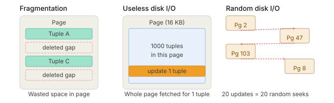

- **Fragmentation（碎片化）**：删除 tuple 留下空洞，page 利用率下降
- **Useless Disk I/O（无效 I/O）**：只改一个 tuple 也要把整个 page（可能 16 KB）都读写一遍
- **Random Disk I/O（随机 I/O）**：更新分散在不同 page 的 20 个 tuple，磁盘要随机跳转 20 次，极慢

这些问题催生了下面的 **Log-Structured Storage**.


#### Log-Structured Storage（日志结构化存储）

**核心思想**：不在原地修改数据，只追加写日志（append-only）.磁盘永远是**顺序写**，彻底消灭 random write.

这个设计基于两个经典论文：**Log-Structured File System (LSFS)** 和 **Log-Structured Merge Tree (LSM Tree)**（RocksDB、Cassandra、LevelDB 都用这个）.

**两个核心数据结构：**

- **MemTable（内存表）**：在内存中维护的有序结构，写入先到这里，速度极快
- **SSTable（Sorted String Table）**：MemTable 满了之后，序列化并按 key 排序，顺序写到磁盘上；SSTable 是**不可变的（immutable）**

**每条日志记录包含：**

- `tuple_id`（唯一标识符）

- 操作类型：`PUT`（插入/更新）或 `DELETE`（删除）

- 对于 PUT：tuple 的实际内容

    

**读取流程：**

1. 先查 MemTable（内存，最新）
2. 没找到 → 从最新的 SSTable 开始往旧的找，在每个 SSTable 内做 **binary search**
3. 找到最近一条 PUT/DELETE 就是答案

这样做**读很慢**（需要查多层）.为了加速，维护一个 **SummaryTable**：

- 每个 SSTable 的 min/max key（可以快速跳过不相关的 SSTable）
- 每层一个 **Bloom filter**（布隆过滤器，O(1) 判断某 key 是否可能存在）

**Compaction（压缩合并）**

随着写入积累，L0 会堆满很多 SSTable，读性能下降.DBMS 周期性地运行 **compaction（压缩）**：用 sort-merge 把多个 SSTable 合并，**只保留每个 key 的最新值**.

两种 compaction 策略：

| 策略                     | 说明                                                         |
| ------------------------ | ------------------------------------------------------------ |
| **Universal Compaction** | 所有 SSTable 在同一个"universal"层，当 size 或 overlap 超过阈值时触发合并 |
| **Level Compaction**     | 分层（L0, L1, L2…）；L0 文件小，合并升级为 L1，L1 再合并升级为 L2；同层 SSTable key 范围不重叠（L0 例外） |

**Log-Structured Storage 的权衡总结：**

| 优点                                    | 缺点                                                         |
| --------------------------------------- | ------------------------------------------------------------ |
| ✅ 写入极快（顺序写）                    | ❌ 读可能慢（多层查找）                                       |
| ✅ 适合 append-only 存储（云存储、HDFS） | ❌ Compaction 开销大                                          |
| ✅ 彻底消除 random write                 | ❌ **Write Amplification**（写放大）：一次逻辑写，compaction 时可能触发多次物理写 |

> **Write Amplification（写放大）**：你写了一条记录，但 compaction 时这条记录可能被读出来、重新排序、写入新 SSTable，反复多次.实际物理写入量 >> 逻辑写入量.

#### Index-Organized Storage（索引组织存储）

前两种方案有一个共同问题：**表本身是无序的**，所以需要额外的 index 来快速定位单个 tuple.

**Index-Organized Storage** 的想法是：直接**把 tuple 数据存在索引结构里**（如 B+ 树的叶子节点），索引和数据合二为一.


**核心特点：**

- DBMS 把 tuple 直接存储为索引数据结构（如 B+ 树）的 **value**
- Leaf node 里存的不是指向 tuple 的指针，而是 **tuple 本身**
- Leaf pages 内部的 tuple 按 key 排序
- Page 内部布局仍然类似 slotted page

**好处**：按 primary key 查找非常高效——走 B+ 树路径直接拿到 tuple，没有额外的一跳.

**MySQL InnoDB** 就是这种方案，它的主键索引叫 **Clustered Index（聚簇索引）**，数据就按主键顺序物理存储在叶子节点里.

---

三种存储模型对比总结:

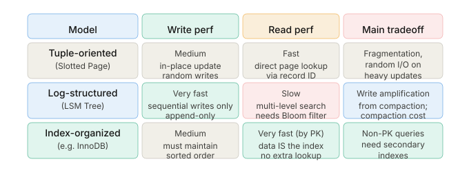总结：Note 5 核心考点

| 概念                      | 关键记忆点                                                   |
| ------------------------- | ------------------------------------------------------------ |
| **Multiple Buffer Pools** | 分池管理，减少 latch contention；路由方式：Object ID 或 Hashing |
| **Pre-fetching**          | 根据查询计划提前读页；sequential scan 和 index scan 都用     |
| **Scan Sharing**          | 多个查询共享一个 cursor；DBMS 记录每个查询加入的位置         |
| **Tuple-Oriented**        | Slotted Page；in-place update；三大问题：碎片化、无效I/O、随机I/O |
| **Log-Structured**        | MemTable (内存) + SSTable (磁盘，immutable，sorted)；只顺序追加写 |
| **LSM Read path**         | MemTable → L0 SSTable → L1 → …；SummaryTable + Bloom filter 加速 |
| **Compaction**            | Sort-merge 合并 SSTable，保留最新值；Universal / Level 两种策略 |
| **Write Amplification**   | 一次逻辑写 → compaction 触发多次物理写                       |
| **Index-Organized**       | Tuple 直接存在 B+ 树叶子节点里；按 key 排序；MySQL InnoDB 就是这样 |

