# Lec 11-16

> 非常推荐[NoughtQ佬的笔记](https://note.noughtq.top/sys/db/11)，是结合了CMU15-445和ZJU-DB的优质笔记.

## Lec 11 Sorting & Aggregation

> 教材对应章节：15.4-15.5
>
> 下面的计算过程中不同出处符号不同，映射关系如下：
>
> * $B \leftrightarrow b_b$: 分配给每个在buffer中的relation的block数量
> * $M \leftrightarrow b_r$：outer relation的block数量
> * $N \leftrightarrow b_s$：inner relation的block数量
> * $m \leftrightarrow n_r$：outer relation的tuple数量
> * $n \leftrightarrow n_s$：inner relation的tuple数量
> * $? \leftrightarrow B$：buffer pool最多具备的page数量

我们即将讨论如何使用DBMS components来执行queries.

operators是以树状排列的，data从leaves向root流动. root node的输出结果就是query的结果.

<center>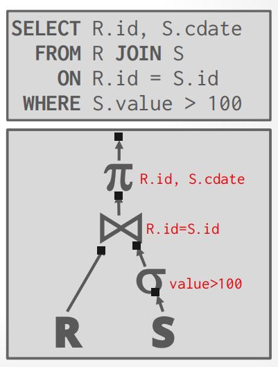</center>

我们不能假定query能直接fit in到memory中，所以需要使用buffer pool 来实现相关的处理算法. 同时，我们希望算法能最大化串行I/O的数量.

Agenda: 

- [ ] Top-N Heap Sort
- [ ] External Merge Sort
- [ ] Aggregations

### Sorting

#### Overview

Relational Model/SQL是unordered，但queries本身经常会调用`ORDER BY`/`DISTINCT`/`GROUP BY`指令，因此我们需要将排序纳入考虑. 需要注意的是，DBMS中的排序是 **In-Memory Sort**.

如果data能恰好被memory容纳，那并不会有什么多余的问题，我们只需要使用标准的排序算法，如VergeSort (针对大部分数据已经排好序了)，QuickSort, TimSort, RadixSort等等算法.

但是如果data不能恰好被memory容纳，我们就得想想别的办法了，需要尽可能考虑reading/writing disk pages的开销.

对于一个给定的`run`（比如`vector<pair<key,value>>`这种形式），排序是基于comparison function和sorting parameters的. 其中Key是用于比较的属性，决定了排序顺序，而Value有两种Materialization Strategy:

* Early Materialization，将完整的tuple和key一起存储和移动，排完序可以直接使用数据，无需再次查找；但是缺点很明显：每条记录数据量太大，排序过程中内存占用很大、移动成本很高.
* Late Materialization，排序的时候只存储 Key + Record ID (记录offset+pointer)，这样可以使排序更加轻量，速度更加快；但是缺点也很明显，排序之后还需要根据Record ID回表查询，消耗了多余I/O.

#### Top-N Heap Sort

如果一条请求包括了`ORDER BY`和`LIMIT`，那么query只需要找到top-$N$元素即可，只需要扫描一次.

```python
select * from enrolled
	order by sid asc
    fetch first 4 rows
    with ties
```

理想的使用`HeapSort`的场景在于，top-$N$元素可以放入memory当中，我们只需要维护一个in-memory sorted priority queue，扫描一遍初始数据就能得到结果：

???+ example "举例"

    === "初始"
    
        <center>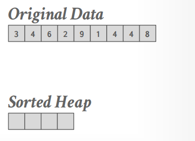</center>
    
    === "状态1"
    
        <center>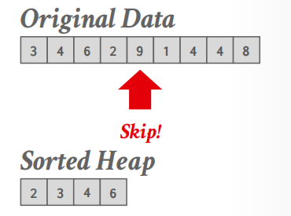</center>
    
    === "状态2"
    
        <center>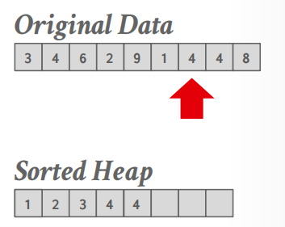</center>
    
    === "最终状态"
    
        <center>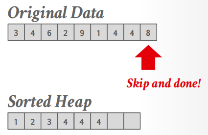</center>

#### External Merge Sort

 是一种分治策略，将data切分成不同的runs，单独排序，再组合成较长的排好序的run.

该策略分成2个phase:

* Sorting: 将fit-in memory的chunks排序，再写回disk的file上.
* Merging: 将已经排好的runs合并成较大的chunks.

##### 2-way external merge sort

Data 被切分成了 $N$ 个page，然而DBMS只有有限的$B$个buffer pool pages来容纳 input 和 output.

在 2-way external merge sort 中，每个pass中最小的排序单元是2，所以：

???+ example "举例"

    === "初始"
    
        <center>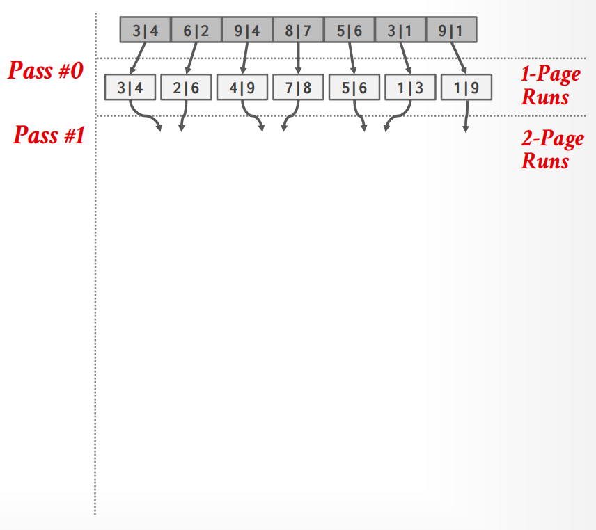</center>
    
    === "状态1"
    
        <center>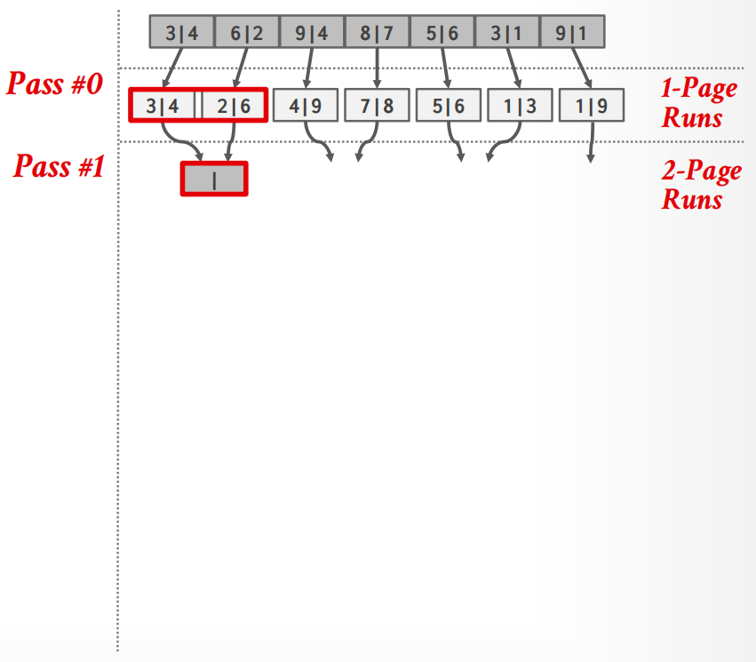</center>
    
    === "状态2"
    
        <center>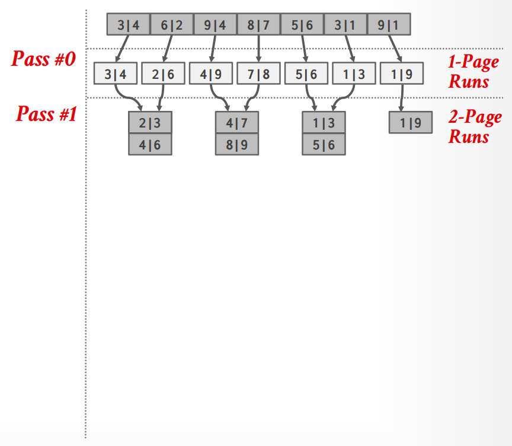</center>
    
    === "最终状态"
    
        <center>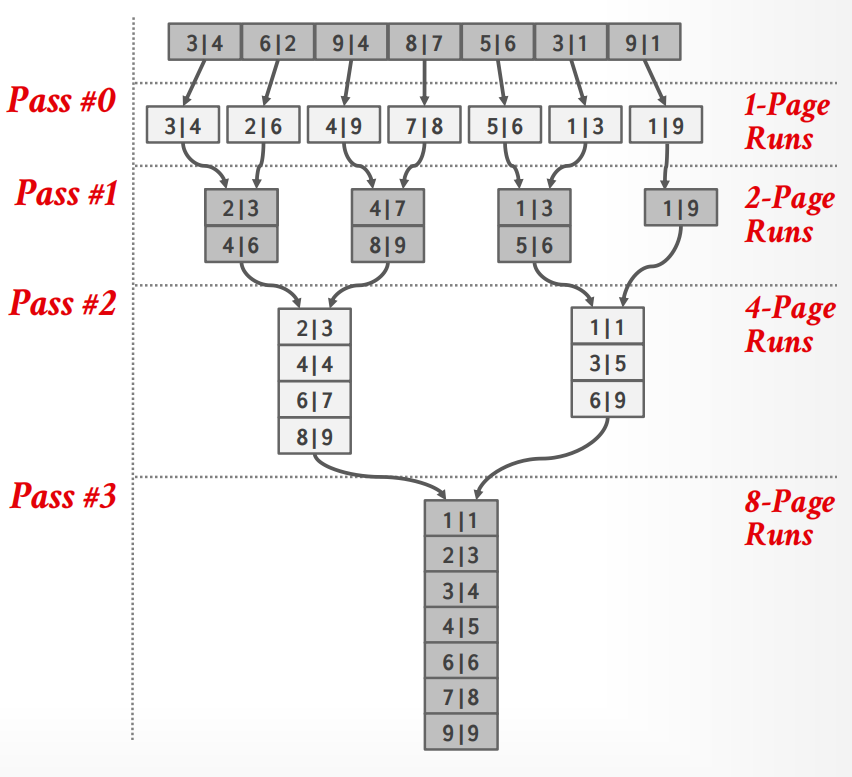</center>

所以开销计算：

> 一共的pass数：$\text{\# of passes}= 1 + \lceil \log_2N \rceil$
>
> 一共的 I/O 开销：$\text{I/O cost}= 2N \times (\text{\# of passes})$

这个算法只需要3个buffer pool pages，但是如果有更多的buffer space且必须限制disk I/O，利用效率就会大大降低.

##### General External Merge Sort

如果一共有$B$个buffer pages，$M$-way merge且一共$N$个元素，我们取$B-1$个是用于存放输入的runs，剩余的1个page用来暂时存放输出的部分结果（在排序过程中只要满了，就写回磁盘并flush，相当于一个临时存放部分数据的地方），则：

> Pass 0: 制造出$\lceil N / B\rceil$个已经排好序的大小为$B$的runs；
>
> Pass 1: 合并$B-1$ 个runs

所以开销计算：

> 一共的pass数：$\text{\# of passes}= 1 + \lceil \log_{B-1} \lceil N/B \rceil \rceil$
>
> 一共的 I/O 开销：$\text{I/O cost}= 2N \times (\text{\# of passes})$

比如$N = 108, B = 5$的配置下，一共需要$1 + \lceil \log_{B-1} \lceil N/B \rceil \rceil = 1 + \lceil\log_4 22\rceil = 4 \text{ passes}$.

---

书上的分析步骤：

> 磁盘访问成本：设$b_r$是包含relation $r$的block数量，$M$是主存中最多可用于排列的位置数（buffer大小）. 
>
> * 第一阶段是生成初始归并段（Run Generation），读取每个relation block再重新写入，一共的block transfer数量是$2b_r$.
>
> * 第二阶段是归并阶段，初始的run数是$\lceil b_r/M \rceil$，.
>
> * 所以总的block transfer数量:
>
>     $$b_r(2\lceil \log _{\lfloor M /b_b \rfloor - 1} (b_r / M)\rceil + 1)$$

#### Double Buffering Optimization

对于 external merge sort 的优化方法之一是，执行当前run的排序时，在background中prefetching下一个run的元素并且存到另一套buffer中.

这样可以降低每一步中的I/O等待时间，可以提升disk的利用率；但是这样把可使用的buffer数直接减半.

<center>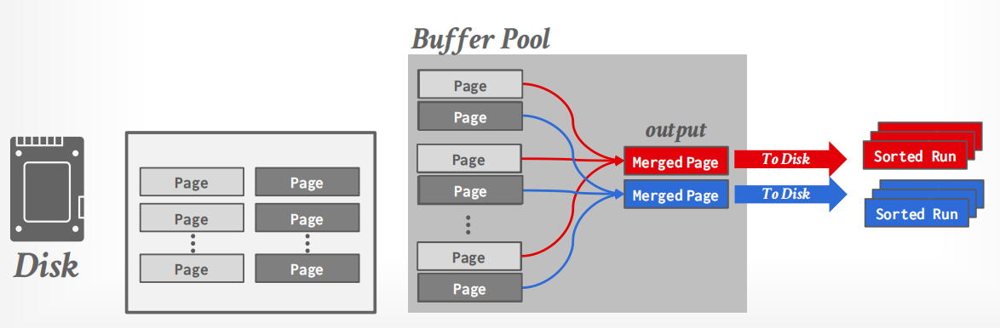</center>

#### Comparison Optimizations

另外的一些常见优化方法是针对**key的比较过程**来优化，目的是降低这个过程的开销.

* Code Specialization:（代码特化） 

    不把比较函数作为函数指针传入，而是针对特定的键类型，直接生成一个hard-coded (硬编码) 的专用排序版本

* Suffix Truncation:（后缀截断）

    对于较长的`VARCHAR`，先比较二进制前缀，如果相同再比较字符串

* Key Normalization：（键规范化）

    将变长属性规范化成为保序的字符串结构.

#### B+ Tree

使用B+树来加速sorting，只需要遍历节点page即可.

一般分成两类：Clustered B+ Tree 和 Unclustered B+ Tree:

* clustered 指的是数据的**物理存储顺序**与索引的键顺序**一致**，叶子节点直接存储完整的数据行. 一张表只能有一个clustered index；

* unclustered 指的是索引顺序和物理存储顺序无关，叶子节点存储的是指向数据行的指针，查找时利用指针跳到对应的数据页. 一张表可以有多个unclustered index.

???+ example "举例"

    === "Clustered B+ Tree"
    
        <center>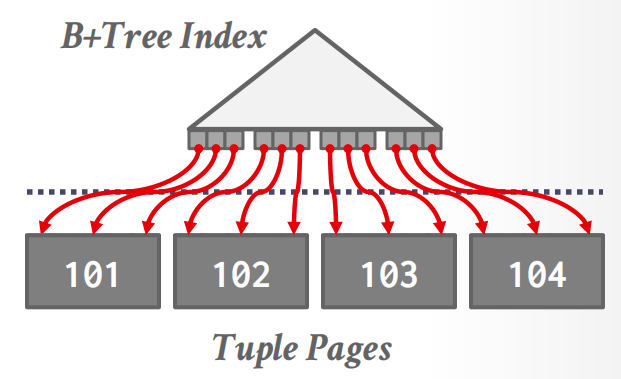</center>
    
    === "Unclustered B+ Tree"
    
        <center>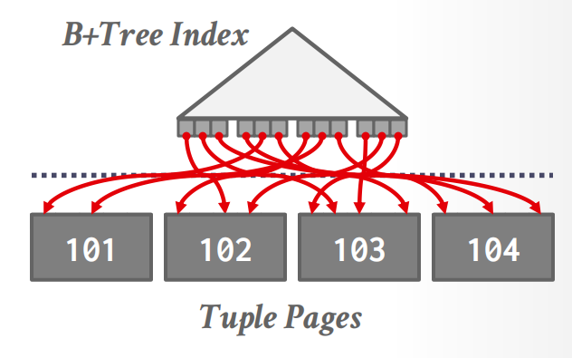</center>

### Aggregation

Aggregation 是将来自多个元组的单个属性值合并为一个标量值.

DBMS 需要一种快速查找具有相同区分属性的元组以便进行分组的方法，有两种实现方案：

* Sorting
* Hashing

```sql
select cid, AVG(s.gpa) from student as s, enrolled as e where s.sid = e.sid
group by cid;
```

如果我们不需要将data进行排序，可以用这两种来替代：

* 用`GROUP BY`来形成group
* 用`DISTINCT`来移除重复

此时Hashing是更加适合的.

#### Hash Aggregate

如果所有block能够fit in memory，那么不会有任何问题，否则DBMS必须将data切分. 

* Phase 1: Partition，用$h_1$将磁盘上的tuples切分成partitions

    如果有$B$个buffer，我们将使用$B-1$个buffer用于partitions，1个用于存放input data.

* Phase 2: Rehash，将phase1得到的buckets通过$h_2$映射回到一个Hash Table中，整理成一个Final Result.

    <center>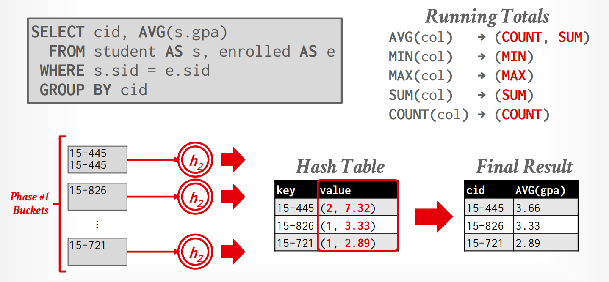</center>

> When we want to insert a new tuple into the hash table as we compute the aggregate:
>
> * If we find a matching **GroupKey**, just update the **RunningVal** appropriately
>
> * Else insert a new **GroupKey** → **RunningVal**

## Lec 12  Join Algorithms

| Name                                       | Block Transfer                                  | Seek                                                         | 情况                                                         |
| ------------------------------------------ | ----------------------------------------------- | ------------------------------------------------------------ | ------------------------------------------------------------ |
| Nested-Loop Join (Worst Case)              | $n_rb_s + b_r$                                  | $n_r+b_r$                                                    | buffer只能容纳其中一个                                       |
| Nested-Loop Join (Best Case)               | $b_r+b_s$                                       | 2                                                            | buffer可以容纳二者                                           |
| Block Nested-Loop Join (Worst Case)        | $b_rb_s+b_r$                                    | $2b_r$                                                       | 缓冲区太小，$r,s$都不能被buffer容纳；对外层关系的每个块，都能 |
| Block Nested-Loop Join (Best Case)         | $b_r+b_s$                                       | 2                                                            | 内层关系可以被内存容纳                                       |
| Index Nested-Loop Join                     | $b_r + C \cdot b_s$                             | -                                                            | seek cost位于$C$这个参数里面，计算很复杂                     |
| Merge Join                                 | $b_r+b_s + \text{sort cost}$                    | $\lceil \dfrac{b_r}{b_b}\rceil+\lceil \dfrac{b_s}{b_b}\rceil$ | 若已排序则无 sort cost；$b_b$为分配的 buffer 块数            |
| Hash Join (without Recursive Partitioning) | $3(b_r+b_s)$                                    | $2(\lceil \dfrac{b_r}{b_b}\rceil+\lceil \dfrac{b_s}{b_b}\rceil)+2$ | 前提是$M > \sqrt{b_s}$，即不需要partition.                   |
| Hash Join (with Recursive Partitioning)    | $4(b_r+b_s) \cdot \lceil \log_{M-1}b_s-1\rceil$ | -                                                            | 需要多轮递归分区，每轮读写各一次；seek cost太过复杂所以省略. |

<center>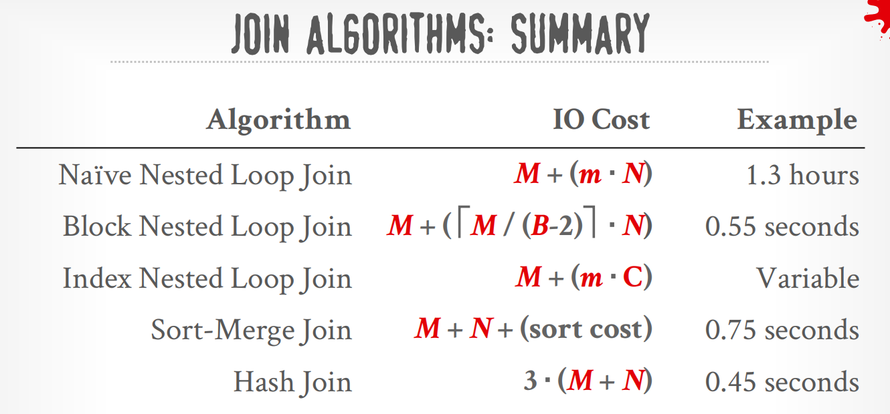</center>

> 教材对应章节：15.4-15.6

我们定义$r\Join_{r.A = s.B} s $为**equi-join**(等值连接).

为了方便叙述举例，接下来用的数据是：

> ***student*(*<u>ID</u>*, *name*, *dept\_name*, *tot\_cred*)**
>
> ***takes*(*<u>ID</u>*, *<u>course\_id</u>*, *<u>sec\_id</u>*, *<u>semester</u>*, *<u>year</u>*, *grade*)**
>
> 考虑：
>
> $$student \Join takes$$
>
> 假设数据配置：
>
> * \# records of *student*: $n_{\text{student}}= 5000$.
> * \# blocks of *student*: $b_{\text{student}}= 100$.
> * \# records of *takes*: $n_{\text{takes}}= 10000$.
> * \# blocks of *takes*: $b_{\text{takes}}= 400$.

### Nested-Loop Join

称$r$是outer relation，$s$是inner relation，通常取$s$是其中较小的会对效率降低有利.

算法实现：

```pseudocode
for tuple t_r in r:
	for tuple t_s in s:
		test pair (t_r, t_s) to see if they satisfy the join condition θ;
		if satisfied:
			add t_r · t_s to the result;
```

tuple数量一共是$n_r \times n_s$. 

<center>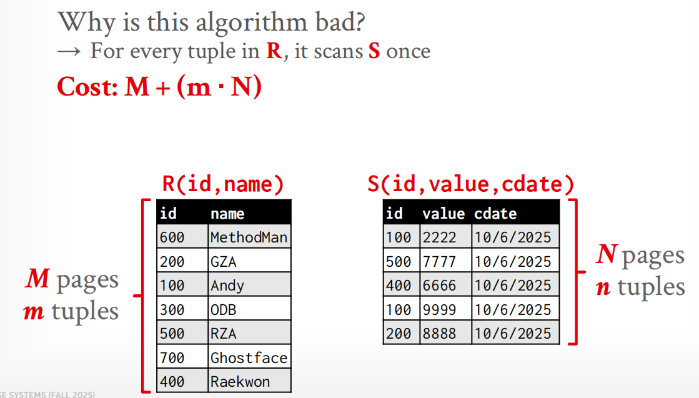</center>

* Worst Case: buffer只能容纳各一个block，由于对outer relation的每个tuple，inner relation每个块都必须扫一遍，而outer relation只需要顺序扫一遍每个block，于是**block transfer一共是$n_r \times b_s + b_r$** .  对于outer relation的每个tuple而言，总共的定位次数是$n_r+b_r$，因为按顺序读入每个块中的每个tuple.

* Best Case: 如果内存恰好能存放这2个relation，则只需要$b_r + b_s$次transfer和2次seek.

### Block Nested-Loop Join

适用于缓冲区太小的情况. 此时$r,s$都不能被buffer容下，于是我们可以按块读取relation，从而节省块的访问数量.

算法实现：

```pseudocode
for block b_r in r:
	for block b_s in s:
		for tuple t_r in b_r:
			for tuple t_s in b_s:
				test pair (t_r, t_s) to see if they satisfy the join condition θ;
				if satisfied:
					add t_r · t_s to the result;
```

<center>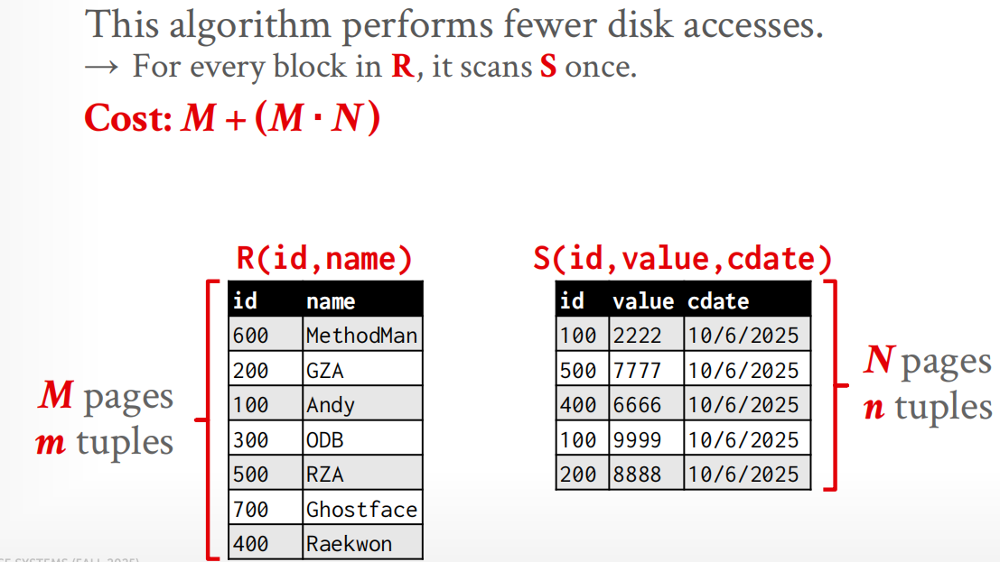</center>

* 如果我们有$B$个可用的buffer，则分配$B-2$个给outer table，1个给inner table，1个给output.

* 在这种情况下，我们一般考虑pages/blocks数量，而不考虑tuples数量;

* Worse Case: 对于外层关系的每个块，只能读取一个内层关系的块，因此需要 $b_r + \lceil \dfrac{b_r}{B-2}\rceil \cdot b_s$ 次block transfer，以及 $2b_r$ 次seek. 不难发现，**将更小的关系作为外层关系**(smaller should be outer)会使运算更为高效.

    举例（$B=3$，最小可运行）：

    ```
    外层 r：只能放 1 块
    内层 s：1 块
    输出：  1 块
    → 对 r 的每一块，都要完整扫描一遍 s
    ```

- Best Case: 当内层关系可被内存容纳时，此时仅需 $b_r + b_s$ 次block transfer 和 2 次seek.

    举例（$B \geq b_s + 2$）：

    ```
    外层 r：1 块
    内层 s：全部装入内存（bs 块）
    输出：  1 块
    → s 只需读一次，r 也只读一次
    ```

### Indexed Nested-Loop Join

我们希望避免sequential scan，因此使用已经存在的index来匹配.

算法实现：

```pseudocode
for tuple r in R:
	for tuple s in Index(r_i = s_j):
		if r and s match:
			emit
```

因为一般使用B+树存储index，树高很小，所以可以近似看成常数$C$，我们认为：

$$\text{block transfer} = b_r + C \cdot b_s$$

### Merge Join

全名是sort-merge join，比较好的使用场景是：

* One or both tables are **already sorted** on join key. (排序已完成，开销就大大降低了)

* Output **must** be sorted on join key （因为这个算法的输出是利用指针来获得的，所以直接就是有序的）

过程：

* Phase 1: Sort ，依据join keys对两张表排序（不需要用external sort）
* Phase 2: Merge，用光标来merge和取出合适tuple（有可能要backtrace）.

算法实现：

```pseudocode
sort R,S on join keys
cursor_r ← r_sorted, cursor_s ← s_sorted
while cursor_r and cursor_s:
	if cursor_r > cursor_s:
    	cursor_s ++
    if cursor_r < cursor_s:
    	cursor_r ++
    	backtrack cursor_s(if necessary)
	elif cursor_r and cursor_s match:
		emit
        cursor_s ++
```

???+ example "举例"

    === "初始"
    
        <center>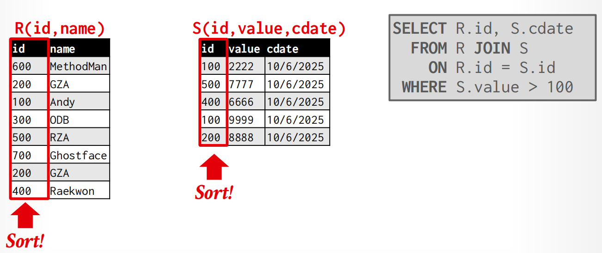</center>
    
    === "状态1"
    
        <center>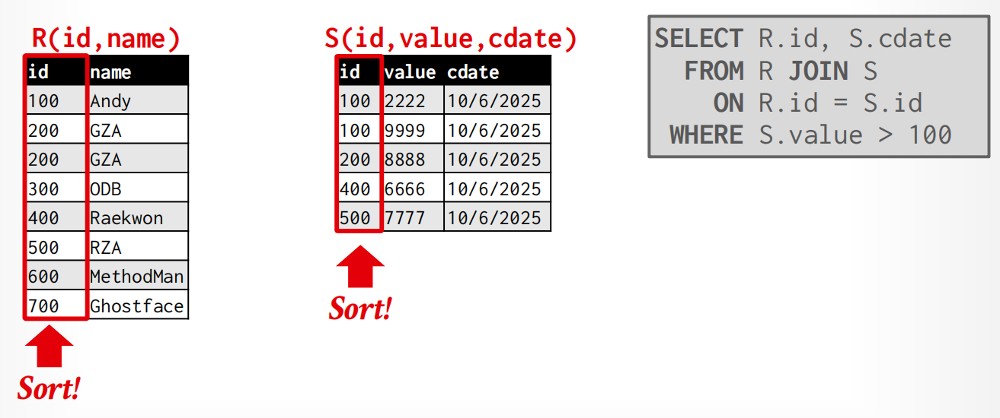</center>
    
    === "状态2"
    
        <center>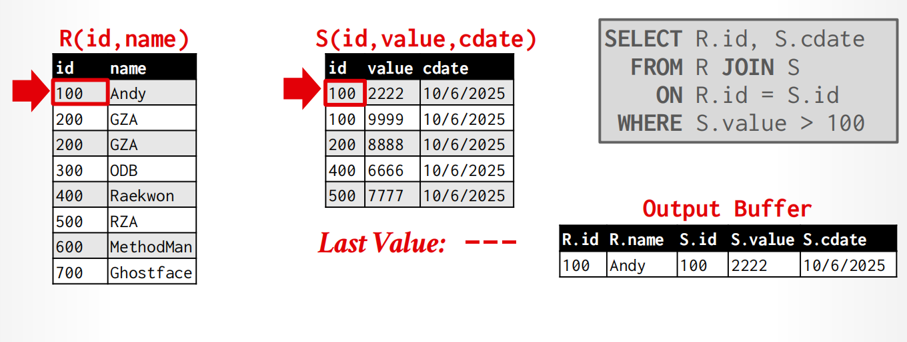</center>
    
    === "状态3"
    
        <center>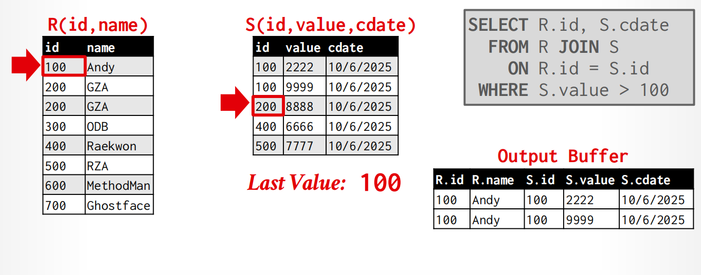</center>
    
    === "状态4"
    
        <center>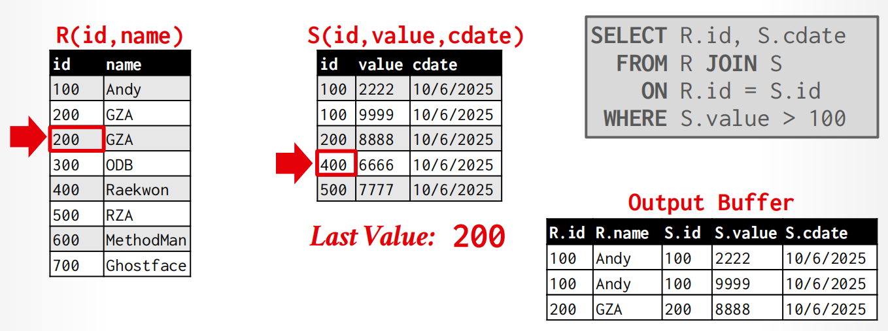</center>
    
    === "状态5"
    
        <center>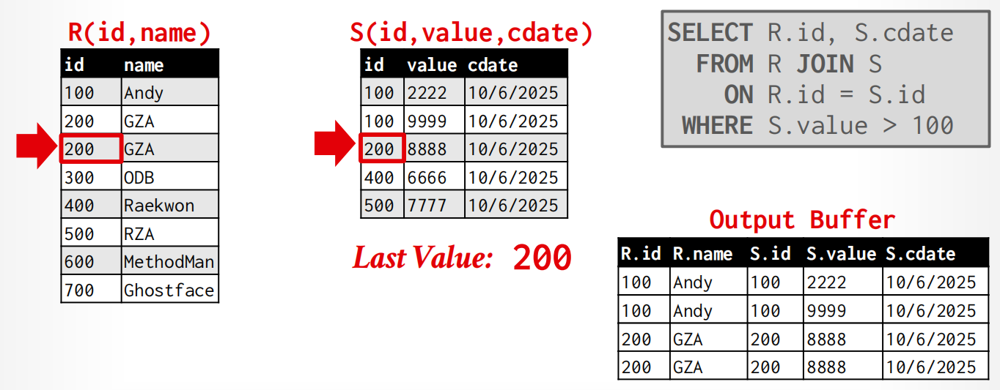</center>
    
    === "状态6"
    
        <center>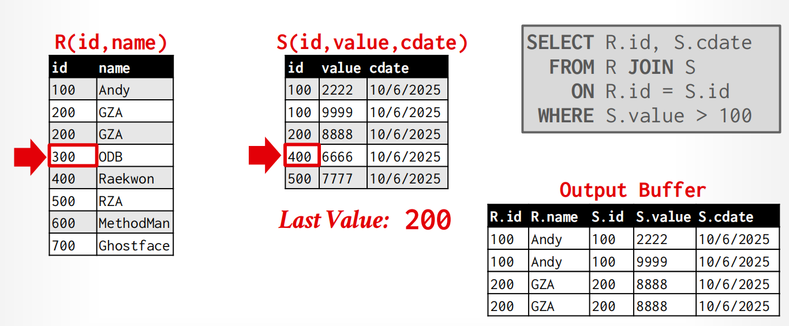</center>
    
    === "最终状态"
    
        <center>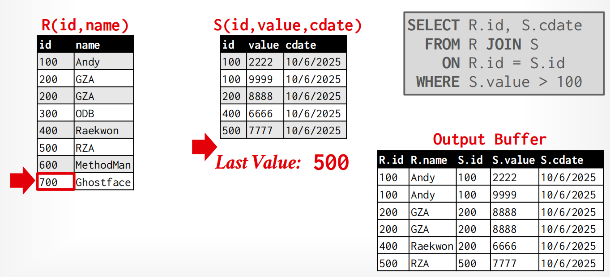</center>

开销计算：

* 对*r*的排序开销：$2b_r (1+\lceil \log_{B-1} \lceil \dfrac {b_r}B\rceil\rceil)$
* 对*s*的排序开销：$2b_s (1+\lceil \log_{B-1} \lceil \dfrac {b_s}B\rceil\rceil)$
* 合并开销：$b_r+b_s$
* 总开销：$\text{Cost} = 2b_r (1+\lceil \log_{B-1} \lceil \dfrac {b_r}B\rceil\rceil) + 2b_s (1+\lceil \log_{B-1} \lceil \dfrac {b_s}B\rceil\rceil) + b_r+b_s$

举个例子：

<center>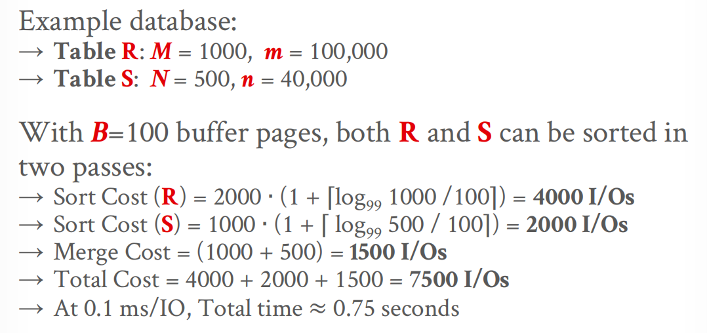</center>

最糟糕的情况下，merging phase 一直在回溯，从而总cost:

$$\text{Cost} = b_r\cdot b_s + \text{sort cost}$$

### Hash Join

如果tuple $r \in R, s \in S$满足了join condition，那么对于连接属性 (join attributes) 而言他们有相同的value. 设这个value被hash映射到的位置是$i$，则*R* 中的元组必须属于 $r_i$，而 $S$ 中的元组必须属于$s_i$. 因此，只需将 $r_i$ 中的 *R* 内元组与 $s_i$ 中的 *S* 内元组进行比较即可.

#### Simple Hash Join

算法过程：

* Phase 1: Build

    扫描outer relation，并使用哈希函数 $h_1$ 对连接属性进行填充，生成哈hash table.

    我们可以使用之前讨论过的任何哈希表，但在实际应用中，Linear Probing 效果最佳.

* Phase 2: Probe

    扫描inner relation，对每个tuple用$h_1$来找到对应的hash table上的位置，并查找匹配的tuple.

算法实现：

```pseudocode
for tuple r in R:
	insert h_1(r) into hash table HT_R
for tuple s in S:
	output, if h_1()
```

???+ example "过程"

    === "Build 开始"
    
        <center>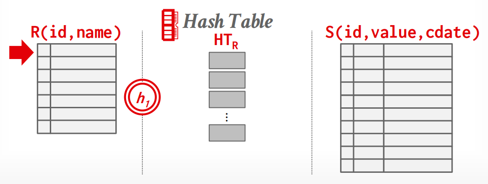</center>
    
    === "Build 结束"
    
        <center>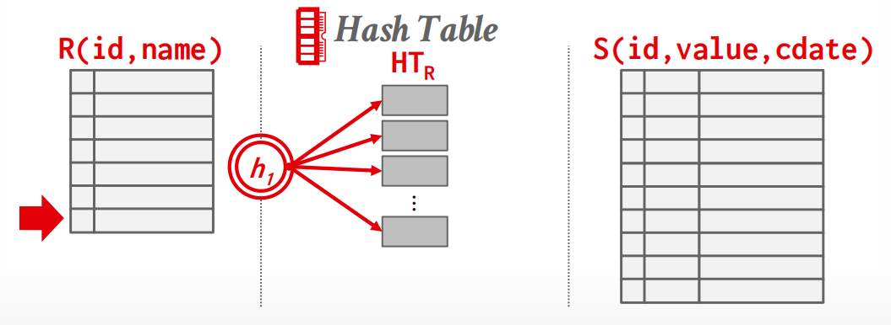</center>
    
    === "Probing 开始"
    
        <center>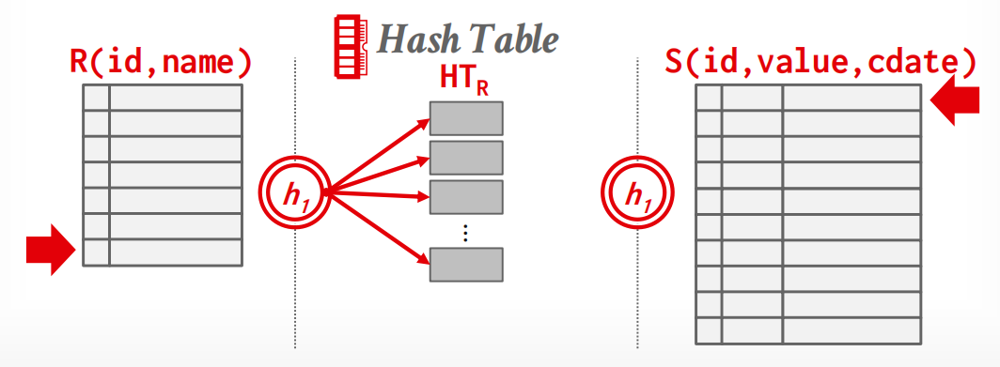</center>
    
    === "Probing 结束"
    
        <center>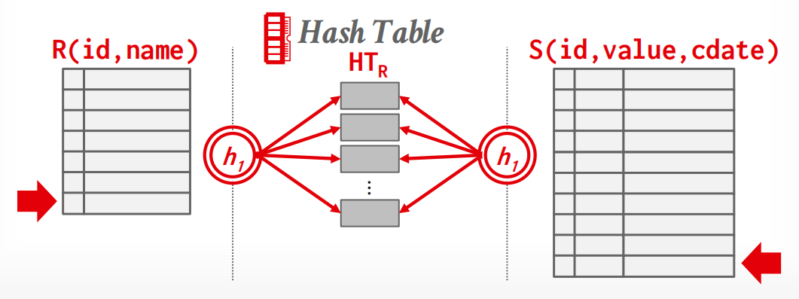</center>

#### Optimize: Probe Filter

我们可以使用Bloom filter来对hash join进行优化，这种技术一般称作侧信道传递 (sideways information passing).

#### Partition Hash Join

如果table不能容纳进memory中，我们呢就会采用partitioned hash join.

分成2个阶段：

* Partition Phase: 根据连接属性对两个表进行哈希处理，生成分区bucket，DBMS将这些分区桶写入磁盘 
* Probe Phase: 针对每个分区 bucket 依次构建哈希表，并比较各表对应分区中的元组

<center>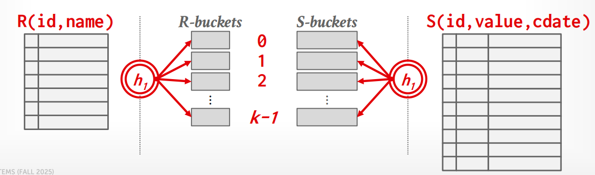</center>

???+ example "过程"

    === "开始"
    
        <center>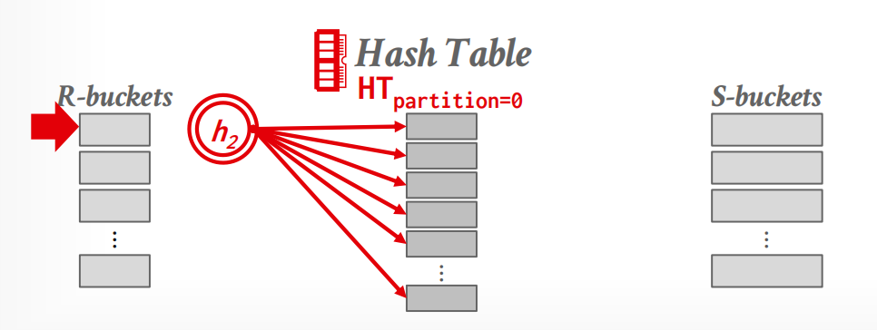</center>
    
    === "状态1"
    
        <center>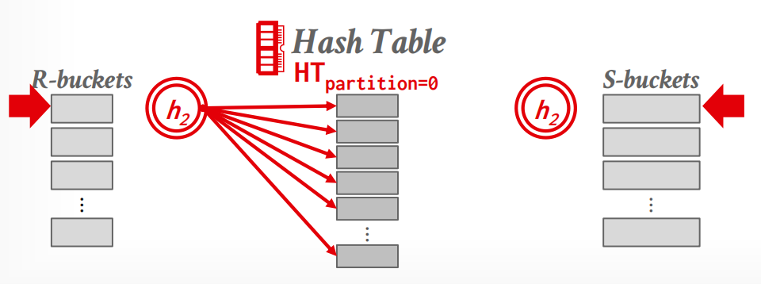</center>
    
    === "状态2"
    
        <center>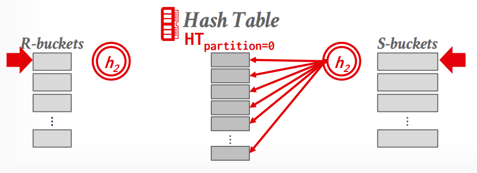</center>
    
    === "结束"
    
        <center>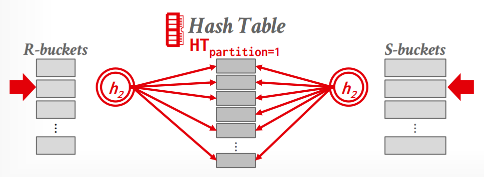</center>

当然，即便如此，仍然有一些 edge case:

* 如果阶段1之后，单个partition仍然无法被放到memory中，我们采取**recursive partitioning**的方法再次分割，并更换hash function.

    ???+ example "过程"

        === "开始"
        
            <center>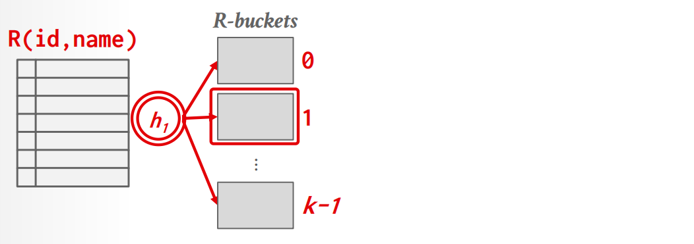</center>
        
        === "状态1：单个partition太大"
        
            <center>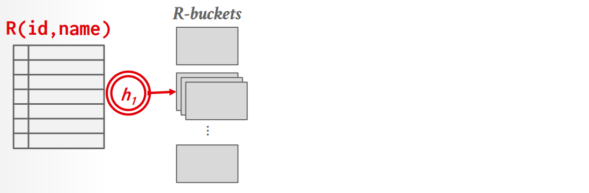</center>
        
        === "状态2：recursive partition"
        
            <center>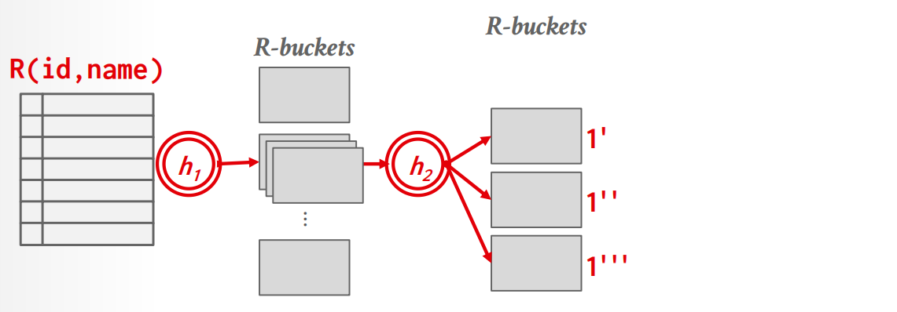</center>
        
        === "状态3"
        
            <center>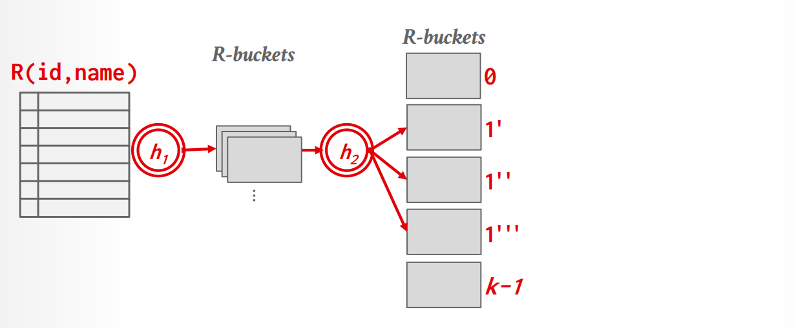</center>
        
        === "状态4：S也对应hash"
        
            <center>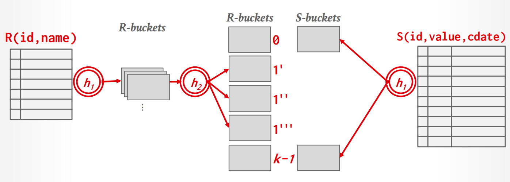</center>
        
        === "结束"
        
            <center>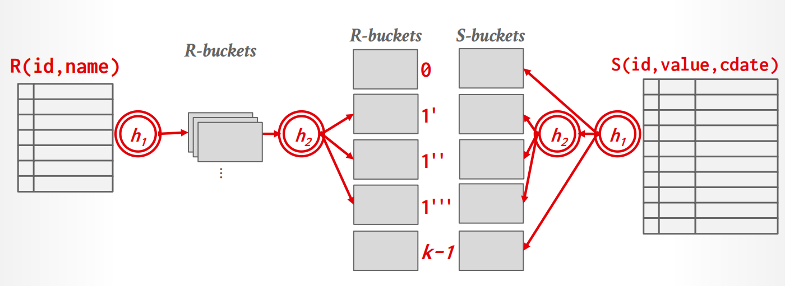</center>

* 如果某个join key有太多匹配的records，以至于无法放到memory中，我们就更换成blocked nested loop join. 这样可以避免random I/O.

开销计算：

* 不使用recursive partitioning: $\text{Cost} = 3(b_r+b_s)$

    - Partition Phase: 对每个input table都需要读+写，因此是$2(b_r+b_s)$次I/O.
    - Probe Phase: 对每个table的bucket进行读取，所以是$b_r+b_s$次I/O.

    举例：

    <center>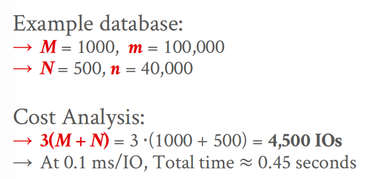</center>

#### Optimize: Hybrid Hash Join

???+ example "过程"

    === "开始"
    
        <center>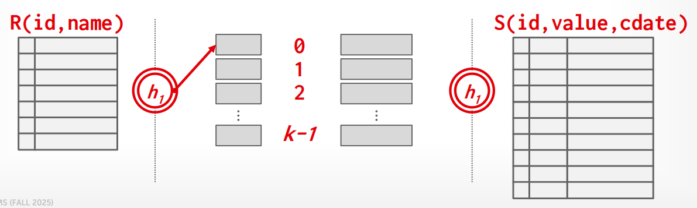</center>
    
    === "状态1"
    
        <center>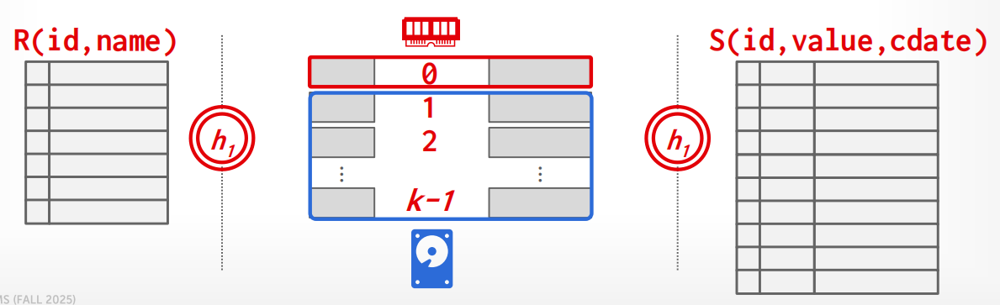</center>
    
    === "状态2"
    
        <center>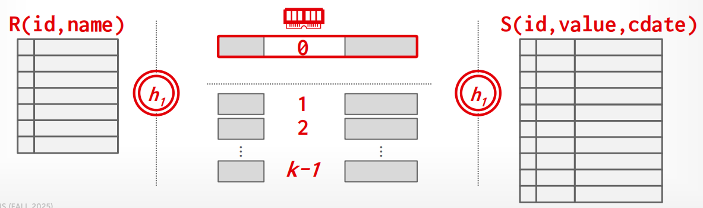</center>
    
    === "结束"
    
        <center>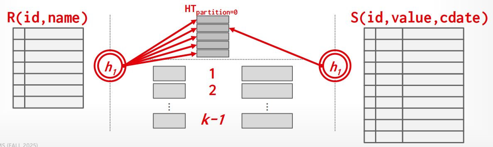</center>

Partition Hash Join 假设内存只有 $B$ 个 buffer page，会把数据分成 $k$ 个分区全部写到磁盘再读回来。但如果内存比 $k$ 还大，就有"浪费"——多出来的内存没有被充分利用. 此时我们考虑利用多余的内存页，将

这节省了第 0 分区的所有读写 I/O，内存越大，能"免费"处理的分区越多，性能越好.

> 一些观察：
>
> <center>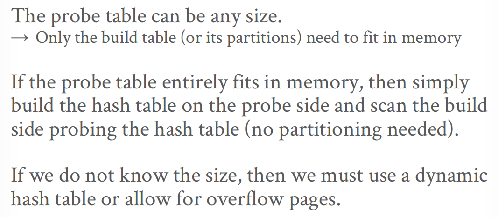</center>

## Lec 13-14 Query Execution

> 教材对应章节： 15.1-15.3, 15.7, 22

Query Execution：

* 一个Query Plan是一个由operator构成的有向图.

    <center>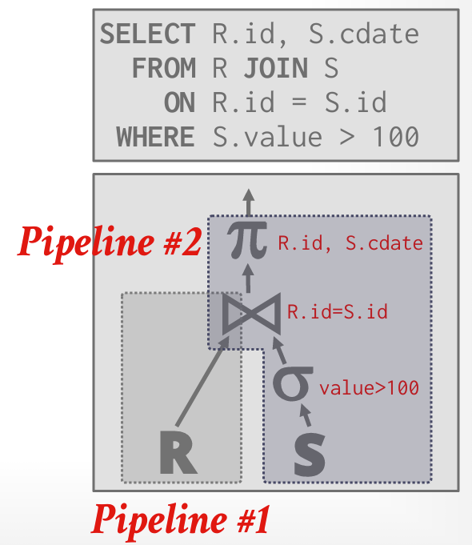</center>

* Pipeline：由operator构成的队列，tuples在这些operator之间连续流动，无需中间存储.

* Pipeline Breaker：只有在其所有子操作均输出完全部元组后才能完成，用于Join（构建侧）、Subquery、order by

Agenda:

- [ ] Processing Model
- [ ] Access Methods
- [ ] Modification Queries
- [ ] Expression Evaluation

### Processing Model

Processing Model 定义了一个系统如何执行一个查询计划，以及如何在各个operator中传递数据

不同的processing model对OLTP和OLAP有不同的性能权衡.

每个processing model有两类执行路径构成：

* Control Flow：DBMS 如何调用一个算子（谁来驱动执行）

* Data Flow： 算子如何输出它的结果（数据怎么往下传）

算子的输出格式：

* NSM (N-ary Storage Model)：整行元组，一次性传递整条记录
* DSM (Decomposition Storage Model)：列子集，适合列存储/分析型查询

Processing Model分成以下3类：

* Iterator Model：最常见，也称 Volcano/Pipeline Model
* Materialization Model：最罕见
* Vectorized / Batch Model：常见

#### Iterator Model

每个operator都实现了`Next()`函数，整个查询树自顶向下拉取数据，可以看成是递归向叶子节点获取数据再向上返回.

3个接口：

| 函数      | 作用                 | 类比                    |
| --------- | -------------------- | ----------------------- |
| `Open()`  | 初始化算子，分配资源 | 构造函数                |
| `Next()`  | 每次返回一条元组     | 迭代器的 `hasNext/next` |
| `Close()` | 释放资源，清理状态   | 析构函数                |

???+ example "过程"

    === "总览"
    
        <center>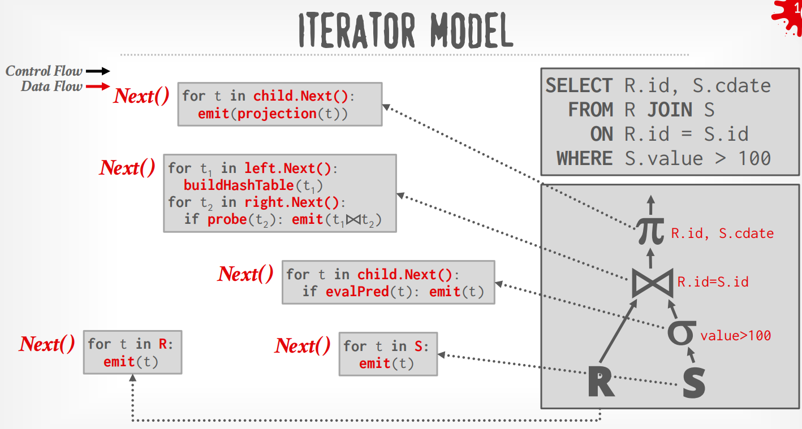</center>
    
    === "pipeline-1起始"
    
        <center>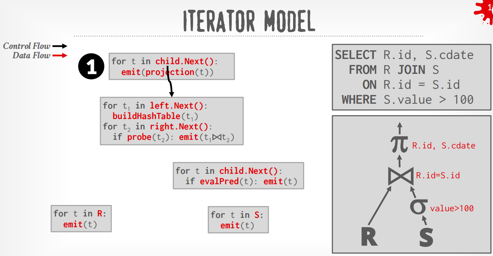</center>
    
    === "pipeline-1"
    
        <center>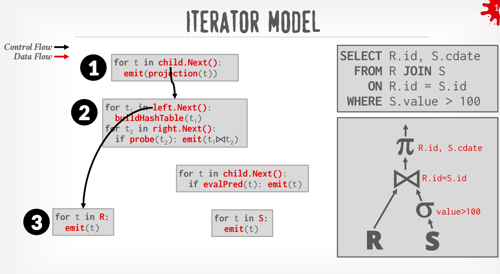</center>
    
    === "pipeline-1回传"
    
        <center></center>
    
    === "pipeline-2"
    
        <center></center>
    
    === "pipeline-2回传"
    
        <center></center>
    
    === "总览1"
    
        <center></center>
    
    === "总览2"
    
        <center></center>

#### Materialization Model

* 每个operator立即把input处理好然后一次性输出.
    * operator会materialize整个output作为单一的结果.
    * DBMS会向下push一些指示（如`LIMIT`）来避免扫描太多的tuple.
    * 可以发送经过materialize的row或者整列数据.

* 输出可以是整个tuple (NSM)，也可以是一列的子集 (DSM)

???+ example "过程"

    === "总览"
    
        <center></center>
    
    === "pipeline-1起始"
    
        <center></center>
    
    === "pipeline-1"
    
        <center></center>
    
    === "pipeline-1回传"
    
        <center></center>
    
    === "pipeline-2"
    
        <center></center>
    
    === "pipeline-2回传"
    
        <center></center>
    
    === "总览1"
    
        <center></center>
    
    === "总览2"
    
        <center></center>

#### Vectorization Model

与Iterator Model类似，每个operator实现了一个`Next()`函数，区别点在于，每个operator输出的是一批tuple而非单个tuple.

???+ example "过程"

    === "总览"
    
        <center></center>
    
    === "状态-1"
    
        <center></center>
    
    === "状态-2"
    
        <center></center>
    
    === "状态-3"
    
        <center></center>

在上述例子中，DBMS通过在根节点调用`Next()`来执行query，从leaf节点拉取数据.

而Plan Processing Direction自然地分成了2种方式：

* Top to Bottom (Pull，最为常见)：从root开始从孩子节点pull数据，用function call来传递tuple (除非是pipeline breaker)

    ???+ example "过程"

        === "状态-1"
    
            <center></center>
    
        === "状态-2"
        
            <center></center>
        
        === "状态-3"
        
            <center></center>
    
        === "状态4"
    
            <center></center>
    
        === "最终"
    
            <center></center>

* Bottom to Top (Push)：从leaf开始将数据push给父节点，**可以做算子融合，即使用for-loop来最小化中间的过程**.

> 下面的expression evaluation暂时略，似乎ZJU不考. 


## Lec 15-16

> 教材对应章节：16
