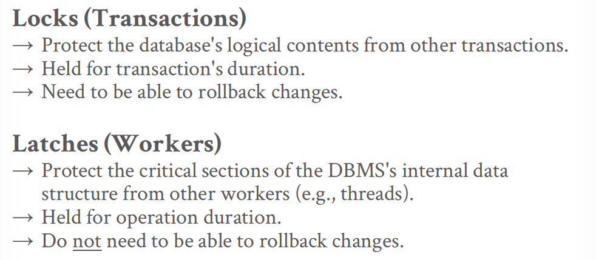

## Lec07: Hash Tables

## Lec08-09: Index & Filters

## Lec10: Index Concurrency Control (索引并发控制)

前面的章节主要关注单线程，但是modern DBMS为了合理利用多核CPU资源，同时降低disk I/O stall，必须要确保多线程(multiple threads)数据取用的安全性. 基于此引入了并发控制(concurrency control) 的概念.

> A **concurrency control** protocol is the method that the DBMS uses to ensure "correct" results for concurrent operations on a shared object.
>
> 这里面的correct主要分成2种：logical correctness 和 physical correctness.

接下来讲解多种Latching in Data Structures.

首先区分latch和lock:

### Test-and-Set Spin Latch

