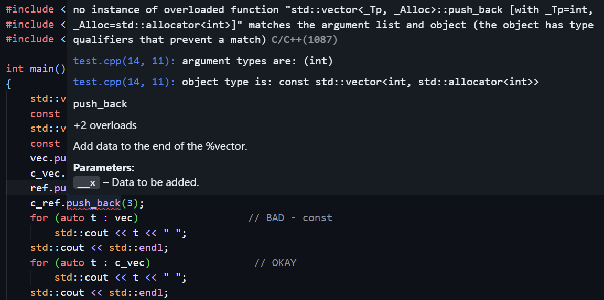
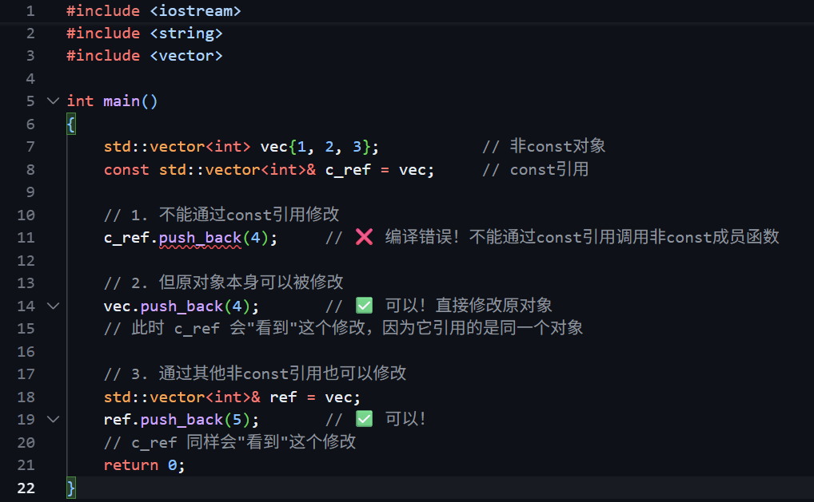

## Streams

### cin/cout

an abstraction for input/output. STreams convert between data and the string representation of data.

`std::cout`和`std::cin`的用法:

Output (`ostream`, `ofstream`): Use `<<` to send data (e.g., `cout`, file output with `ofstream`).
Input (`istream`, `ifstream`): Use `>>` to parse data (e.g., `cin`, file input with `ifstream`).
String Streams (`istringstream`, `ostringstream`): Read/write strings like other streams.

Key Nuances: `std::cin` buffers input; `>>` stops at whitespace.

Think of a `std::istream` as a sequence of characters:

```cpp
#include <iostream>
#include <string>
using namespace std;
int main()
{
    string str;
    int x;
    std::cin >> str >> x;
    // what happens if input is blah blah?
    std::cout << str << x;
}
// once an error is detected, the input stream's fail bit is set, and it will no longer accept input
```

运行结果：

```bash
./test
blah blah # input
blah0
```

`cin`单独使用的时候容易出问题，比如：

??? warning "`cin` errors"

    ```cpp
    // input = 2.17
    cin >> age;  
    cout << "Wage: ";
    cin >> hourlyWage;
    // age = 2, hourlyWage = .17
    ```

所以需要引入新函数：`getline()`

### getline()

To read a whole line, use`std::getline(istream& stream, string& line);`

使用方法以及要点：

`getline(istream& stream, string& line)`takes in both parameters by reference!

```cpp
std::string line;
std::getline(cin, line); //now line has changed!
//input = "Hello World 42!"
std::cout << line << std::endl; 
//should print out "Hello World 42!"
```

需要注意的是，`getline()`与`<<`是不可以混用的，容易造成读取问题.（Don't mix `>>` with `getline`!）：

* `>>` reads up to the next whitespace character and does not go past that whitespace character.
* `getline` reads up to the next delimiter (by default, '\n'), and does go past that delimiter.
* Don't mix the two or bad things will happen!

### file stream

Input File Streams have type `std::ifstream`, and only receives strings using the `>>` operator. (Receives strings from a file and converts it to data of any
type)

需要注意的是，initialize own ofstream object linked to file.

举例：

```cpp
std::ifstream in(“out.txt”); // in is now an ifstream that reads from out.txt
string str;
in >> str; // first word in out.txt goes into str
```

File streams require explicit initialization with filenames.

???+ note "文件流读取代码示例"

    Slides:

    ```cpp
    std::ofstream out("log.txt");
    out << "Error Code: " << 404 << std::endl;
    out.close();
    // 输入文件流
    std::ifstream in("data.txt");
    ```

    以OOP Lab4举例:

    ```cpp
    #include <fstream>
    const char* DATA_FILE = "data.bin";
    struct DiaryEntry{
        std::string date;
        std::string content; 
    }
    using DiaryDB = std::map<std::string, std::string>;

    DiaryDB loadDiary(){
        DiaryDB diary;
        std::ifstream file(DATA_FILE, std::ios::binary); // 以二进制模式打开DATA_FILE路径的文件，此处为'data.bin'.
        
        if (!file.is_open())
            return diary;
        std::string line;
        while (std::getline(file,line)){
            if (line.empty()) continue;
            ...
        }
    }
    ```

### stringstreams

Input stream: `std::istringstream`, give any data type to the istringstream, it'll store it as a string!

Output stream: `std::ostringstream`. make an ostringstream out of a string, read from it word/type by word/type!

The same as the other i/ostreams (应该？我看slides语气比较笃定).

???+ note "举例"

    ostringstreams:

    ```cpp
    string judgementCall(int age, string name, bool lovesCpp){
        std::ostringstream formatter;
        formatter << name <<", age " << age;
        if(lovesCpp) formatter << ", rocks.";
        else formatter << " could be better";
        return formatter.str();
    }
    ```

    istringstreams：

    ```cpp
    #include <iostream>
    #include <string>
    #include <vector>
    #include <sstream> // 在stringstream中必须添加这个头文件.
    struct Student{
        std::string name; int age; std::string mood;
    };
    Student reverseJudgementCall(std::string judgement){
        std::istringstream converter(judgement); // !!!需要用judgement初始化
        std::string fluff; int age; std::string name;

        converter >> name;  // "Frankie"
        converter >> fluff; // "age"
        std::cout << fluff << std::endl;
        converter >> age; // 22
        std::cout << age << std::endl;
        converter >> fluff; // ","
        std::cout << fluff << std::endl;

        std::string cool;
        converter >> cool; // "rocks"

        std::cout << name << " " << fluff << " " << age << std::endl;

        if (cool == "rocks") return Student{name, age, "bliss"};
        else return Student{name, age, "misery"};
    }
    int main(){
        Student student1 = reverseJudgementCall("Frankie age 22, rocks");
        std::cout << student1.name << " " << student1.age << " " << student1.mood << std::endl;
        return 0;
    }
    ```

    结果：

    ```bash
    age
    22
    ,
    Frankie , 22
    Frankie 22 bliss
    ```

## Initialization

初始化pair的三种方法:

```cpp
std::pair<int,string> numSuffix1 = {1,"st"}; //Uniform init
// or
std::pair<int,string> numSuffix2;
numSuffix2.first = 2;
numSuffix2.second = "nd"; //用first和second进行逐一赋值.
// or
std::pair<int,string> numSuffix3 = std::make_pair(3,"rd"); //std::make_pair
```

数组与结构体初始化：

```cpp
// Stanford Vector vs STL vector
Vector<int> stanVec(3, 5);     // {5,5,5}
std::vector<int> stlVec{3, 5}; // {3,5}

// 结构体初始化
struct Point { double x, y; };
Point p1;         // 未初始化，赋随机值
Point p2{3.1, 4}; // 统一初始化
```

Uniform initialization: curly bracket initialization. （使用花括号进行初始化赋值，
可以做到available for all types, immediate initialization on declaration.）

举例：

```cpp
std::vector<int> vec{1,3,5};
std::pair<int, string> numSuffix1{1,"st"};
Student s{"Frankie", "MN", 21}; // less common/nice for primitive types, but possible!
int x{5};
string f{"Frankie"}; //下面两种很少见但可行
```

总结：use uniform initialization to initialize every field of your non-primitive typed variables - but be careful not to use `vec(n, k)`!

> TLDR翻译成中文是不是“太长不看”？

## Using `auto`

auto一般在类型名较长，为了节省脑力时使用：

```cpp
int main() {
    int a, b, c;
    std::cin >> a >> b >> c;
    std::pair<bool, std::pair<double, double>> result = quadratic(a, b, c); //比如这里，会简化成auto result = quadratic(a, b, c);
    bool found = result.first;
    if (found) {
        std::pair<double, double> solutions = result.second; //还有这里，简化成auto solutions = result.second;
        std::cout << solutions.first << solutions.second << endl;
    }else {
        std::cout << “No solutions found!” << endl;
    }
}
```

但是auto不能被滥用，比如：

```cpp
int main() {
   int a, b, c; //万万不可换成auto，会报compile error！
   std::cin >> a >> b >> c;
}
```

还有quadratic函数中的使用（函数功能：The quadratic equation in its standard form is $ax^2 + bx + c = 0$, where $a$ and $b$ are the coefficients, $x$ is the variable, and $c$ is the constant term）：

```cpp
int main() {
    int a, b, c;
    std::cin >> a >> b >> c;
    auto result = quadratic(a, b, c);
    auto found = result.first; //code less clear :/
    if (found) {
        auto solutions = result.second;
        std::cout << solutions.first << solutions.second << endl;
    } else {
        std::cout << “No solutions found!” << endl;
    }
}
```

## Structured binding

Structured binding lets you initialize directly from the contents of a struct.
这样可以一次性按之前的struct初始化多个变量，如：

```cpp
auto p = std::make_pair(“s”, 5);
string a = s.first;
int b = s.second;
```

可以换成：

```cpp
auto p = std::make_pair(“s”, 5);
auto [a, b] = p;
// a is string, b is int
// auto [a, b] = std::make_pair(...);
```

于是先前的quadratic函数调用可以被改写成：

```cpp
int main() {
    auto a, b, c;
    std::cin >> a >> b >> c;
    auto [found, solutions] = quadratic(a, b, c); //quadratic返回自动识别类型的found，solution
    if (found) {
        auto [x1, x2] = solutions;
        std::cout << x1 << “ ” << x2 << endl;
    } else {
        std::cout << “No solutions found!” << endl;
    }
}
```

## Reference

Reference: An alias (another name) for a named variable.

以下2个实例代码可以清晰看出引用符号的作用. 它是对原变量的重命名，实际上还是同一个东西，所做的修改会覆盖原变量.

???+ note "示例"

    1.

    ```cpp
    void changeX(int& x){ //changes to x will persist
        x = 0; 
    }
    void keepX(int x){
        x = 0;
    }
    int a = 100;
    int b = 100;
    changeX(a); //a becomes a reference to x，所以a的修改在函数执行完之后仍然生效.
    keepX(b);   //b becomes a copy of x，相当于把原来的数据拿过来，重新做了一个新的版本.
    cout << a << endl; //0
    cout << b << endl; //100
    ```

    2. 

    ```cpp
    vector<int> original{1, 2};
    vector<int> copy = original;
    vector<int>& ref = original;
    original.push_back(3);
    copy.push_back(4);
    ref.push_back(5);
    cout << original << endl; // {1, 2, 3, 5}
    cout << copy << endl;     // {1, 2, 4}
    cout << ref << endl;      // {1, 2, 3, 5}
    ```

## Code Demo: Reference Bugs

这一小节指出了reference的一些误用：

???+ note "reference-copy bug"

    ```cpp
    void shift(vector<std::pair<int, int>>& nums) {
        for (size_t i = 0; i < nums.size(); ++i) {
            auto [num1, num2] = nums[i]; //This creates a copy of the course
            num1++;
            num2++; //This is updating that same copy!
        }
    }
    ```

    或者这样：

    ```cpp
    void shift(vector<std::pair<int, int>>& nums) {
        for (auto [num1, num2]: nums) {//This creates a copy of the course
            num1++;
            num2++;//This is updating that same copy!
        }
    }
    ```

    都会导致修改无效，因为结构化绑定默认创建的是副本而非引用。正确的做法是使用引用：

    ```cpp
    void shift(vector<std::pair>& nums) {
        for (size_t i = 0; i < nums.size(); ++i) {
            auto& [num1, num2] = nums[i]; // 使用引用
            num1++;
            num2++;
        }
    }
    ```

    或者：

    ```cpp
        void shift(vector<std::pair>& nums) {
            for (auto& [num1, num2]: nums) { // 使用引用
                num1++;
                num2++;
            }
        }
    ```

    这样才能真正修改 `nums` 中的元素.

cpp有两种参数，l-value与r-value.

> l-values can appear on the left or right of an `=`. eg.`x` is an l-value. l-values have names and are not temporary.<br>
> r-values can ONLY appear on the right of an `=`. eg. `3` is an r-value. r-values don't have names and are temporary.

这就会在使用不当的时候导致reference-rvalue error:

???+ note "reference-rvalue error"

    ```cpp
    void shift(vector<std::pair<int, int>>& nums) {
        for (auto& [num1, num2]: nums) {
            num1++;
            num2++;
        }
    }
    shift({{1, 1}}); 
    // {{1, 1}} is an rvalue, it can't be referenced
    ```

    解决问题的方法是先对某个变量进行赋值，然后再调用函数.

    ```cpp
    void shift(vector<pair<int, int>>& nums) {
        for (auto& [num1, num2]: nums) {
            num1++;
            num2++;
        }
    }
    auto my_nums = {{1, 1}};
    shift(my_nums);
    ```

## Bonus: Const and Const References

const indicates a variable can't be modified.

???+ warning "错误用法举例"
    1. 这段代码里面2,4的`push_back()`函数是无法通过编译的，因为const定义下，`push_back()`无法用于修改内部变量值.

    ```cpp
    std::vector<int> vec{1, 2, 3};
    const std::vector<int> c_vec{7, 8};  // a const variable
    std::vector<int>& ref = vec;         // a regular reference
    const std::vector<int>& c_ref = vec;  // a const reference
    vec.push_back(3);    // OKAY
    c_vec.push_back(3);  // BAD - const
    ref.push_back(3);   // OKAY
    c_ref.push_back(3); // BAD - const
    ```

    <center></center>

    2.const定义过后，非const的ref也不能使用了，必须使用const ref.

    ```cpp
    const std::vector<int> c_vec{7, 8};  // a const variable
    // BAD - can't declare non-const ref to const vector
    std::vector<int>& bad_ref = c_vec;

    // fixed
    const std::vector<int>& bad_ref = c_vec;
    ```

???+ note "总结（const & subtleties）"

    ```cpp
    const std::vector<int> c_vec{7, 8};
    std::vector<int>& ref = vec;
    const std::vector<int>& c_ref = vec;
    auto copy = c_ref;         // a non-const copy
    const auto copy = c_ref;   // a const copy
    auto& a_ref = ref;         // a non-const reference
    const auto& c_aref = ref;  // a const reference
    ```

    C++ 中 `const` 和 `auto` 结合使用时的微妙之处：

    1. `auto copy = c_ref;`，其中即使 `c_ref` 是 const 引用，`auto` 推导时会**丢弃顶层 const**，创建一个非 const 的副本，类型推导为：`std::vector<int>`（非 const），是一个新对象，可以自由修改

    2. `const auto copy = c_ref;`，是显式添加 `const`，创建const 副本，类型推导为：`const std::vector<int>`，不可修改

    3. `auto& a_ref = ref;`其中的`auto&` 会保留引用类型，推导为非 const 引用的`std::vector<int>&`，可以通过该引用修改原对象

    4. `const auto& c_aref = ref;`是显式添加 `const`，推导为const引用的`const std::vector<int>&`，不能通过该引用修改原对象

    核心规则：

    * `auto` 会丢弃顶层 const（拷贝时）
    * `auto&` 会保留引用的 const 属性
    * 需要 const 时必须显式写 `const auto` 或 `const auto&`

    一个我之前的疑惑：那么const reference究竟可不可以被修改呢？
    
    答案是，新定义出的变量本身不能被修改，但它引用的对象可能被其他方式修改. 
    
    举个例子：

    ```cpp
    std::vector<int> vec{1, 2, 3};           // 非const对象
    const std::vector<int>& c_ref = vec;     // const引用

    // 1. 不能通过const引用修改
    c_ref.push_back(4);     // ❌ 编译错误！不能通过const引用调用非const成员函数

    // 2. 但原对象本身可以被修改
    vec.push_back(4);       // ✅ 可以！直接修改原对象
    // 此时 c_ref 会"看到"这个修改，因为它引用的是同一个对象

    // 3. 通过其他非const引用也可以修改
    std::vector<int>& ref = vec;
    ref.push_back(5);       // ✅ 可以！
    // c_ref 同样会"看到"这个修改
    ```

    <center></center>
