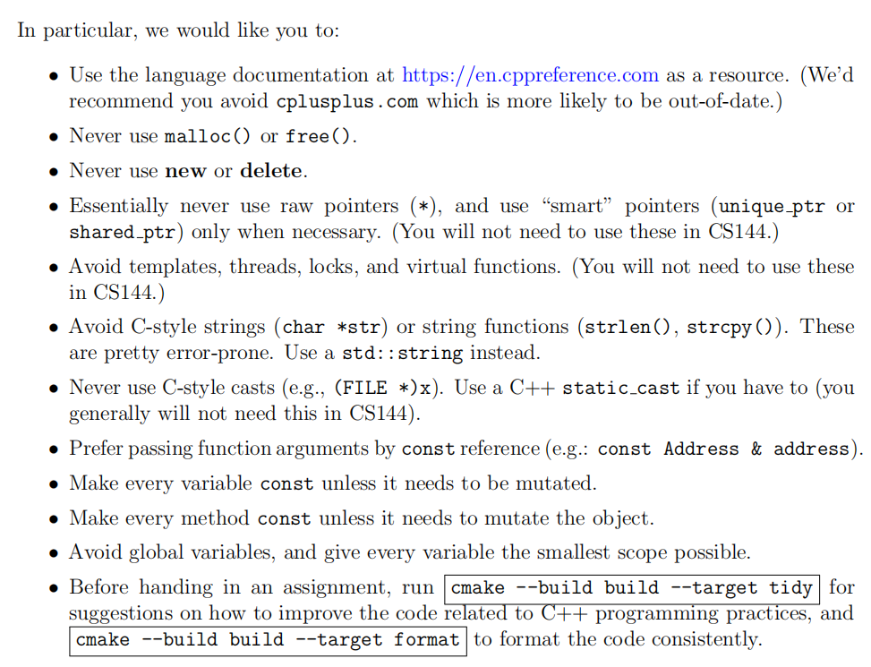

# Checkpoint 0-Networking Warmup

## Networking by Hand

### **Fetch a Web page**

http://cs144.keithw.org/hello 这个网址似乎没有反应，遂作罢.

```bash
cs144-25fa$ telnet cs144.keithw.org http
Trying 104.196.238.229...
^C
```

* `GET /hello HTTP/1.1`+ENTER：告诉服务器URL的path部分
* `HOST: cs144.keithw.org`+ENTER：告诉服务器URL的host部分.
* `Connection: close`+ENTER：告诉服务器我这边已经完成request，它必须在完成所有reply之后直接关闭.

### Send yourself an email

无stanford账号与环境，无法完成.

### Listening and Connecting

先运行`netcat`指令监听9090端口：

```bash
cs144-25fa$ netcat -v -l -p 9090
Listening on 0.0.0.0 9090
```

新开一个窗口来拨号：

```bash
cs144-25fa$ telnet localhost 9090
Trying 127.0.0.1...
Connected to localhost.
Escape character is '^]'.
```

在监听端口可以看到：

```bash
cs144-25fa$ netcat -v -l -p 9090
Listening on 0.0.0.0 9090
Connection received on localhost 43252
```

## Write network program

目标：

* Fetches a Web page over the Internet
* In this lab, you will simply use the operating system’s pre-existing support for the Transmission Control Protocol. You’ll write a program called “webget” that creates a TCP stream socket, connects to a Web server, and fetches a page—much as you did earlier in this lab. In future labs, you’ll implement the other side of this abstraction, by implementing the Transmission Control Protocol yourself to create a reliable byte-stream out of not-so-reliable datagrams.

从网上找备份代码：

```bash
git clone git@github.com:lbollyky/minnow-1.git
```

略去一番操作之后编译：

```bash
cmake -S . -B build
```

* 作用：显式指定源代码位置和build路径

    ```text
    * -S <path-to-source>          = Explicitly specify a source directory.
    * -B <path-to-build>           = Explicitly specify a build directory.
    ```

```bash
cmake --build build
```

* 作用：

    ```text
    --build <dir>                = Build a CMake-generated project binary tree.
    ```

然后是一些C++书写时的约定：

<center></center>

### Writing `webget`

`app/webget.cc`这段代码本身有一些值得研究的地方：

```c++
#include "debug.hh"
#include "socket.hh"

#include <cstdlib>
#include <iostream>
#include <span>
#include <string>

using namespace std;

namespace {
void get_URL( const string& host, const string& path )
{
  debug( "Function called: get_URL( \"{}\", \"{}\" )", host, path );
  debug( "get_URL() function not yet implemented" );
}
} // namespace

int main( int argc, char* argv[] )
{
  try {
    if ( argc <= 0 ) {
      abort(); // For sticklers: don't try to access argv[0] if argc <= 0.
    }

    auto args = span( argv, argc );

    // The program takes two command-line arguments: the hostname and "path" part of the URL.
    // Print the usage message unless there are these two arguments (plus the program name
    // itself, so arg count = 3 in total).
    if ( argc != 3 ) {
      cerr << "Usage: " << args.front() << " HOST PATH\n";
      cerr << "\tExample: " << args.front() << " stanford.edu /class/cs144\n";
      return EXIT_FAILURE;
    }

    // Get the command-line arguments.
    const string host { args[1] };
    const string path { args[2] };

    // Call the student-written function.
    get_URL( host, path );
  } catch ( const exception& e ) {
    cerr << e.what() << "\n";
    return EXIT_FAILURE;
  }

  return EXIT_SUCCESS;
}
```

* `get_URL`用 namespace { ... } 包起来：表示 `namespace { ... }` 是 C++ 的匿名命名空间，放在匿名命名空间里的函数只在文件内部可见，所以 `get_URL` 只能被 `webget.cc` 里的代码调用，其他文件不能链接/访问它.