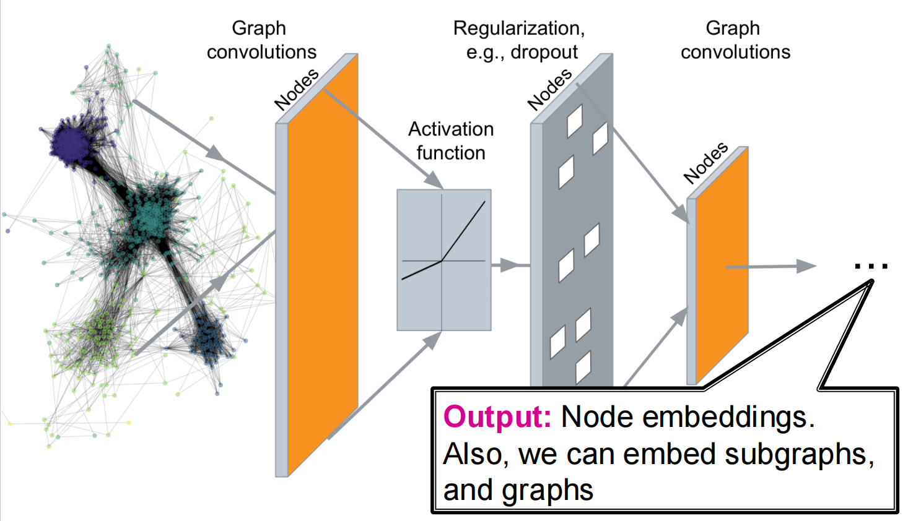
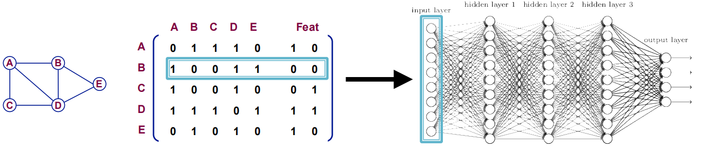
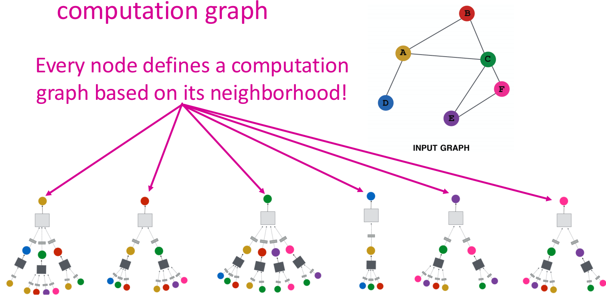

# Lec03-05:GNN

## Introduction

Deep Graph Encoder: $\text{ENC}(v)$是基于图结构的多layer非线性变换，其中所有的deep encoder都可以与上一讲提到的node similarity function相结合.

我们能够依据此完成的任务：

* Node Classification
* Link Prediction
* Community Detection
* Network Similarity

现代的ML Toolbox主要是为了simple sequences & grids设计出来的，但是networks远比这个复杂得多，有着更加复杂的拓扑结构和不确定的size（不像grids一样有空间局部性），没有固定的个节点排列顺序或者具备reference point，并且经常是动态且有多模态特征的.

## Deep Learning for Graphs

### Preliminary

深度学习中我们定义了损失函数

$$\mathcal L = \min\limits_{\Theta} \mathcal L(y, f_{\Theta}(x))$$

其中$f$可以是任何layer, MLP或者neural networks，$x$是输入数据中的小规模抽样

在给定$x$的情况下，forward propagation就是计算出$\mathcal L$，而back propagation是用链式法则计算出$\grad_{\Theta}\mathcal L$.

我们用SGD，迭代多轮优化权重$\Theta$的损失函数$\mathcal L$.

### DL 4 Graphs

在这个部分，我们将分析：

* Local network neighborhoods：如何描述聚合策略，定义computation graphs(计算图).
* Stacking multiple layers：如何描述模型、参数、训练，以及如何拟合模型，并给出一些关于unsupervised learning和supervised learning的例子.

首先定义：我们有图$G$，$V$是节点集合，$A$是邻接矩阵，$X\in \mathbb{R}^{||V| \times m}$是节点特征向量构成的矩阵，$v$是$V$中的节点，$N(v)$是$v$的邻居节点的集合. 节点的特征包括：Social networks (eg. User Profile, User Image), Biological networks (Gene expression profiles, Gene functional information),  指示向量（对节点one-hot编码）.

#### Naive Approach

最简单的方法是直接拼接邻接矩阵和特征，喂给神经网络.

这个做法存在以下问题：

* 参数量是$O(|V|)$，对于不同size的graph适配性不强
* 结果对节点顺序敏感

下面介绍可行的解决方法：

#### Convolutional Networks Approach

Convolutional Networks (卷积网络) 用来解决MLP（Multi-Layer Perceptron，多层感知机）未能处理的顺序敏感问题，为此我们引入一个在所有位置上共享的kernel，并且要求函数$f$满足以下要求之一：

* Permutation Invariant (置换不变)：$f(A,X) = f(PAP^T, PX)$，$P$是任意的permutation matrix (置换矩阵)，这表明换了节点顺序之后，函数输出结果是不变的.
* Permutation Equivariant (置换等变)：$P f(A,X) = f(PAP^T, PX)$，$P$是任意的permutation matrix (置换矩阵)，这表明换了节点顺序之后，函数输出结果与置换矩阵同步改变.

举一些满足的例子：

* $f(A,X) = 1^T X$，表示对所有节点的特征求和，这满足1.置换不变
* $f(A,X) = X$，直接返回特征矩阵，这满足2.置换等变
* $f(A,X) = AX$，聚合邻居特征，这满足2.置换等变

GNN就是由一些满足这二者之一性质的layer聚合起来的，这实现了MLP没能做到的内容.

## Graph Convolutional Networks

一个节点的邻居能够定义一个计算图. 我们希望学习的是，如何通过图中信息的传播路径来得到node features. $\Longrightarrow$ **直觉上，可以用神经网络，让节点从它们的邻居那里聚合信息！**

我们从每个节点出发，从Network Neighborhood中抽出并定义computation graph：

多层Deep Model可以是任意深度的，node $v$ 的 Layer-0 embedding 是它的input feature $X_v$，Layer-k embedding是从节点$v$向外跳了$k$步之后得到的

## GNNs subsume CNNs

