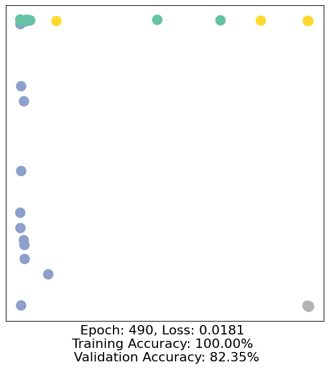

# Colab 0

???+ info "资源"

    [NetworkX](https://networkx.org/documentation/stable/)
    
    [Pytorch Geometric](https://pytorch-geometric.readthedocs.io/en/latest/)

---

## 基础语法

### Graph

```python
G = nx.Graph()   # 无向图
print(G.is_directed())

H = nx.DiGraph() # 有向图

G.graph["Name"] = "Bar"

print(H.is_directed())
print(G.graph)
```

结果：

```python
False
True
{'Name': 'Bar'}
```

### Node

重要的函数：

* `add_node`, `nodes()`, `add_nodes_from`

* `number_of_nodes()`

```python
G.add_node(0, feature = 5, label = 1)

node_0_attr = G.nodes[0]
print("Node 0 has the attributes {}".format(node_0_attr))

# 输出：Node 0 has the attributes {'feature': 5, 'label': 1}
```

查看所有节点的属性 (`data=True`表示显示节点相关的数据，默认`data=False`表示查看有哪些节点)：

```python
G.nodes(data = True)

# 输出：NodeDataView({0: {'feature': 5, 'label': 1}})

G.nodes()

# 输出：NodeView((0,))
```

一次性添加多个节点：

```python
G.add_nodes_from([
    (1, {"feature": 1, "label": 1}),
    (2, {"feature": 2, "label": 2})
])
```

查看所有节点信息：

```python
for n in G.nodes(data=True):
    print(node)
    
num_nodes = G.number_of_nodes()
print("G has {} nodes".format(num_nodes))

# 输出： 
# (0, {'feature': 5, 'label': 1})
# (1, {'feature': 1, 'label': 1})
# (2, {'feature': 2, 'label': 2})
# G has 3 nodes
```

并且提供了可视化的方法.

```python
nx.draw(G, withlabels = True)
```

调用邻居节点：

```python
node_id = 1
for neighbor in G.neighbors(node_id):
    print("Node {} has neighbor {}".format(node_id, neighbor))
    
# 输出：
# Node 1 has neighbor 0
# Node 1 has neighbor 2
```

[PageRank](https://networkx.org/documentation/stable/reference/algorithms/generated/networkx.algorithms.link_analysis.pagerank_alg.pagerank.html#networkx.algorithms.link_analysis.pagerank_alg.pagerank)：

```python
nx.path_graph(num_nodes)

num_nodes = 4
G = nx.DiGraph(nx.path_graph(num_nodes))
nx.draw(G, with_labels = True)

pr = nx.pagerank(G, alpha=0.8)
print(pr)

# {0: 0.17857162031103999,
# 1: 0.32142837968896,
# 2: 0.32142837968896,
# 3: 0.17857162031103999}
```

## PyTorch Geometric Tutorial

 简称PyG包，安装与使用：

```python
import torch
```

依赖安装：

```bash
pip install -q torch-scatter -f https://data.pyg.org/whl/torch-2.4.0+cu121.html
pip install -q torch-sparse -f https://data.pyg.org/whl/torch-2.4.0+cu121.html
pip install -q torch-geometric
```

### Basics

可视化函数：根据传入`h`的类型选择可视化方法，是张量的时候用numpy，是NetworkX图对象的时候选择`spring_layout`算法可视化

```python
import torch
import networkx as nx
import matplotlib.pyplot as plt

def visualize(h, color, epoch=None, loss=None, accuracy=None):
    plt.figure(figsize=(7,7))
    plt.xticks([])
    plt.yticks([])
    
    if torch.is_tensor(h): 
        h = h.detach().cpu().numpy() # 从计算图中分离，转为numpy
        plt.scatter(h[:, 0], h[:, 1], s = 140, c = color, cmap = "Set2") # 取前两维作为 x/y 坐标散点图
        if epoch is not None and loss is not None and accuracy['train'] is not None and accuracy['val'] is not None: # 训练信息完整的情况下，在x轴上额外标注信息
            plt.xlabel((f'Epoch: {epoch}, Loss: {loss.item():.4f} \n'
                        f'Training Accuracy: {accuracy["train"]*100:.2f}% \n'
                        f' Validation Accuracy: {accuracy["val"]*100:.2f}%'),fontsize=16)
    else:
        nx.draw_networkx(h, pos=nx.spring_layout(h, seed=42), with_labels=False,
                         node_color=color, cmap="Set2")
    plt.show()
```

数据集获取：通过`torch_geometric.datasets`来得到，此处使用`KarateClub`数据集.

```python
from torch_geometric.datasets import KarateClub

dataset = KarateClub()
print(f'Dataset: {dataset}:')
print('======================')
print(f'Number of graphs: {len(dataset)}')
print(f'Number of features: {dataset.num_features}')
print(f'Number of classes: {dataset.num_classes}')

# 输出：
'''
Dataset: KarateClub():
======================
Number of graphs: 1
Number of features: 34
Number of classes: 4
'''
```

查看其中一组数据：

```python
data = dataset[0]

print(data)
print('===============================================================')
print(f"Number of nodes: {data.num_nodes}")
print(f"Number of edges: {data.num_edges}")
print(f"Average node degree: {(data.num_edges) / data.num_nodes:.2f}")
print(f'Number of training nodes: {data.train_mask.sum()}')
print(f'Training node label rate: {int(data.train_mask.sum()) / data.num_nodes:.2f}')
print(f'Contains isolated nodes: {data.has_isolated_nodes()}')
print(f'Contains self-loops: {data.has_self_loops()}')
print(f'Is undirected: {data.is_undirected()}')

'''
输出：
Data(x=[34, 34], edge_index=[2, 156], y=[34], train_mask=[34])
===============================================================
Number of nodes: 34
Number of edges: 156
Average node degree: 4.59
Number of training nodes: 4
Training node label rate: 0.12
Contains isolated nodes: False
Contains self-loops: False
Is undirected: True
'''
```

### Data

每一个PyG中的graph都是用`Data`对象来表示的，如：

```python
Data(edge_index=[2,156], x=[34,34], y = [34], train_mask=[34])
print(data)

# 输出：
# print(data)
# Data(x=[34, 34], edge_index=[2, 156], y=[34], train_mask=[34])
```

### Edge Index

我们打印`edge_index`：

```python
from IPython.display import Javascript

display(Javascript('''google.colab.output.setIframeHeight(0, true, {maxHeight:300})'''))

edge_index = data.edge_index
print(edge_index.t())
```

这种表示一般应用在稀疏图中，称 **COO format (coordinate format)**，区别于稠密图常用的邻接矩阵表示法.

## Implementing GNN

最简单的GNN operator之一是GCN layer，在PyG中使用`GCNConv`来实现.

GNN希望将input graph $G = (V, E), \forall v_i \in V, X_i^{(0)}$是其对应特征向量，通过学习得到的函数$f_{G}: V \times \mathbb R^{d_1} \rightarrow \mathbb R^{d_2}$（接收单个node $v_i$和其特征向量，输出对应的embedding向量），从而得到有利于后续任务的节点表示结果.

取前向传播过程中的激活函数为$f(x) = \tanh(x)$，这样可以引入非线性的分类，同时把输出限制在$(-1,1)$，适合嵌入表示.

```python
import torch
from torch.nn import Linear # 普通全连接层，用作最终分类
from torch_geometric.nn import GCNConv # 图卷积层

class GCN(torch.nn.Module):
    def __init__(self):
        super().__init__()
        torch.manual_seed(1234) # 固定随机种子，保证可复现性
        self.conv1 = GCNConv(dataset.num_features, 4) # 34维向量压缩成4维
        self.conv2 = GCNConv(4, 4)
        self.conv3 = GCNConv(4, 2)
        self.classifier = Linear(2, dataset.num_classes)
        
    def forward(self, x, edge_index):
        h = self.conv1(x, edge_index)
        h = h.tanh()
        h = self.conv2(h, edge_index)
        h = h.tanh()
        h = self.conv3(h, edge_index)
        h = h.tanh()
        
        out = self.classifier(h)
        
        return out, h
    
model = GCN()
print(model)
```

输出结果：

```python
GCN(
  (conv1): GCNConv(34, 4)
  (conv2): GCNConv(4, 4)
  (conv3): GCNConv(4, 2)
  (classifier): Linear(in_features=2, out_features=4, bias=True)
)
```

接着进行可视化：

```python
model = GCN()

_, h = model(data.x, data.edge_index)
print(f"Embedding shape: {list(h.shape)}")

visualize(h, color = data.y)
```

### Training

```python
import time
from IPython.display import Javascript  # Restrict height of output cell.
display(Javascript('''google.colab.output.setIframeHeight(0, true, {maxHeight: 430})'''))

model = GCN()
criterion = torch.nn.CrossEntropyLoss()  # Define loss criterion.
optimizer = torch.optim.Adam(model.parameters(), lr=0.01)  # Define optimizer.

def train(data):
    optimizer.zero_grad()  # Clear gradients.
    out, h = model(data.x, data.edge_index)  # Perform a single forward pass.
    loss = criterion(out[data.train_mask], data.y[data.train_mask])  # Compute the loss solely based on the training nodes. 是核心，只用带标签的节点计算损失
    loss.backward()  # Derive gradients.
    optimizer.step()  # Update parameters based on gradients.

    accuracy = {}
    # Calculate training accuracy on our four examples
    predicted_classes = torch.argmax(out[data.train_mask], axis=1) # [0.6, 0.2, 0.7, 0.1] -> 2
    target_classes = data.y[data.train_mask]
    accuracy['train'] = torch.mean(
        torch.where(predicted_classes == target_classes, 1, 0).float())

    # Calculate validation accuracy on the whole graph
    predicted_classes = torch.argmax(out, axis=1)
    target_classes = data.y
    accuracy['val'] = torch.mean(
        torch.where(predicted_classes == target_classes, 1, 0).float()) # 评估泛化能力

    return loss, h, accuracy

for epoch in range(500):
    loss, h, accuracy = train(data)
    # Visualize the node embeddings every 10 epochs
    if epoch % 10 == 0:
        visualize(h, color=data.y, epoch=epoch, loss=loss, accuracy=accuracy)
        time.sleep(0.3)
```

最终的结果图（epoch = 490）：



可以看出确实分成了4个社群，节点坐标是GCN学习得到的2维embedding向量.

```text
绿色（青绿）  →  社群 0
黄色         →  社群 1  
蓝紫色       →  社群 2
灰色         →  社群 3
```

指标上:

```text
Epoch: 490        训练接近尾声
Loss: 0.0181      损失极低，训练集拟合很好
Training Acc: 100%  训练节点全部分对
Val Acc: 82.35%   全图有约18%节点分类错误
```

说明有一点过拟合了.
