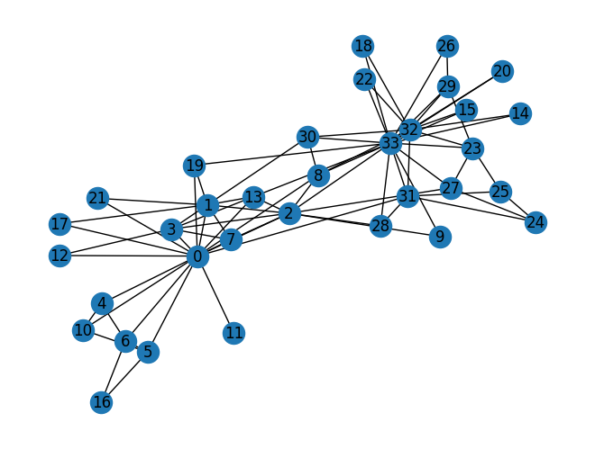

# Colab 1

???+ info "资源"

    [NetworkX](https://networkx.org/documentation/stable/tutorial.html)

---

这个lab是在搭建一个完整的**learning node embeddings**流水线，包括3个步骤：

* Load [Karate Club Network](https://en.wikipedia.org/wiki/Zachary's_karate_club)
* Transform the graph structure into a PyTorch tensor
* Finish the first learning algorithm on graphs: a node embedding model

## Graph Basics

### Setup

导入和查看信息：

```python
import networkx as nx

G = nx.karate_club_garph()
print(type(G))
```

输出：

```bash
/usr/local/lib/python3.12/dist-packages/networkx/classes/graph.py
Base class for undirected graphs.

A Graph stores nodes and edges with optional data, or attributes.

Graphs hold undirected edges.  Self loops are allowed but multiple
(parallel) edges are not.

Nodes can be arbitrary (hashable) Python objects with optional
key/value attributes, except that `None` is not allowed as a node.

Edges are represented as links between nodes with optional
key/value attributes.

Parameters
----------
incoming_graph_data : input graph (optional, default: None)
    Data to initialize graph. If None (default) an empty
    graph is created.  The data can be any format that is supported
    by the to_networkx_graph() function, currently including edge list,
    dict of dicts, dict of lists, NetworkX graph, 2D NumPy array, SciPy
    sparse matrix, or PyGraphviz graph.

attr : keyword arguments, optional (default= no attributes)
    Attributes to add to graph as key=value pairs.

See Also
--------
DiGraph
MultiGraph
MultiDiGraph

Examples
--------
Create an empty graph structure (a "null graph") with no nodes and
no edges.

>>> G = nx.Graph()

G can be grown in several ways.

**Nodes:**

Add one node at a time:

>>> G.add_node(1)

Add the nodes from any container (a list, dict, set or
even the lines from a file or the nodes from another graph).

>>> G.add_nodes_from([2, 3])
>>> G.add_nodes_from(range(100, 110))
>>> H = nx.path_graph(10)
>>> G.add_nodes_from(H)

In addition to strings and integers any hashable Python object
(except None) can represent a node, e.g. a customized node object,
or even another Graph.

>>> G.add_node(H)

**Edges:**

G can also be grown by adding edges.

Add one edge,

>>> G.add_edge(1, 2)

a list of edges,

>>> G.add_edges_from([(1, 2), (1, 3)])

or a collection of edges,

>>> G.add_edges_from(H.edges)

If some edges connect nodes not yet in the graph, the nodes
are added automatically.  There are no errors when adding
nodes or edges that already exist.

**Attributes:**

Each graph, node, and edge can hold key/value attribute pairs
in an associated attribute dictionary (the keys must be hashable).
By default these are empty, but can be added or changed using
add_edge, add_node or direct manipulation of the attribute
dictionaries named graph, node and edge respectively.

>>> G = nx.Graph(day="Friday")
>>> G.graph
{'day': 'Friday'}

Add node attributes using add_node(), add_nodes_from() or G.nodes

>>> G.add_node(1, time="5pm")
>>> G.add_nodes_from([3], time="2pm")
>>> G.nodes[1]
{'time': '5pm'}
>>> G.nodes[1]["room"] = 714  # node must exist already to use G.nodes
>>> del G.nodes[1]["room"]  # remove attribute
>>> list(G.nodes(data=True))
[(1, {'time': '5pm'}), (3, {'time': '2pm'})]

Add edge attributes using add_edge(), add_edges_from(), subscript
notation, or G.edges.

>>> G.add_edge(1, 2, weight=4.7)
>>> G.add_edges_from([(3, 4), (4, 5)], color="red")
>>> G.add_edges_from([(1, 2, {"color": "blue"}), (2, 3, {"weight": 8})])
>>> G[1][2]["weight"] = 4.7
>>> G.edges[1, 2]["weight"] = 4

Warning: we protect the graph data structure by making `G.edges` a
read-only dict-like structure. However, you can assign to attributes
in e.g. `G.edges[1, 2]`. Thus, use 2 sets of brackets to add/change
data attributes: `G.edges[1, 2]['weight'] = 4`
(For multigraphs: `MG.edges[u, v, key][name] = value`).

**Shortcuts:**

Many common graph features allow python syntax to speed reporting.

>>> 1 in G  # check if node in graph
True
>>> [n for n in G if n < 3]  # iterate through nodes
[1, 2]
>>> len(G)  # number of nodes in graph
5

Often the best way to traverse all edges of a graph is via the neighbors.
The neighbors are reported as an adjacency-dict `G.adj` or `G.adjacency()`

>>> for n, nbrsdict in G.adjacency():
...     for nbr, eattr in nbrsdict.items():
...         if "weight" in eattr:
...             # Do something useful with the edges
...             pass

But the edges() method is often more convenient:

>>> for u, v, weight in G.edges.data("weight"):
...     if weight is not None:
...         # Do something useful with the edges
...         pass

**Reporting:**

Simple graph information is obtained using object-attributes and methods.
Reporting typically provides views instead of containers to reduce memory
usage. The views update as the graph is updated similarly to dict-views.
The objects `nodes`, `edges` and `adj` provide access to data attributes
via lookup (e.g. `nodes[n]`, `edges[u, v]`, `adj[u][v]`) and iteration
(e.g. `nodes.items()`, `nodes.data('color')`,
`nodes.data('color', default='blue')` and similarly for `edges`)
Views exist for `nodes`, `edges`, `neighbors()`/`adj` and `degree`.

For details on these and other miscellaneous methods, see below.

**Subclasses (Advanced):**

The Graph class uses a dict-of-dict-of-dict data structure.
The outer dict (node_dict) holds adjacency information keyed by node.
The next dict (adjlist_dict) represents the adjacency information and holds
edge data keyed by neighbor.  The inner dict (edge_attr_dict) represents
the edge data and holds edge attribute values keyed by attribute names.

Each of these three dicts can be replaced in a subclass by a user defined
dict-like object. In general, the dict-like features should be
maintained but extra features can be added. To replace one of the
dicts create a new graph class by changing the class(!) variable
holding the factory for that dict-like structure.

node_dict_factory : function, (default: dict)
    Factory function to be used to create the dict containing node
    attributes, keyed by node id.
    It should require no arguments and return a dict-like object

node_attr_dict_factory: function, (default: dict)
    Factory function to be used to create the node attribute
    dict which holds attribute values keyed by attribute name.
    It should require no arguments and return a dict-like object

adjlist_outer_dict_factory : function, (default: dict)
    Factory function to be used to create the outer-most dict
    in the data structure that holds adjacency info keyed by node.
    It should require no arguments and return a dict-like object.

adjlist_inner_dict_factory : function, (default: dict)
    Factory function to be used to create the adjacency list
    dict which holds edge data keyed by neighbor.
    It should require no arguments and return a dict-like object

edge_attr_dict_factory : function, (default: dict)
    Factory function to be used to create the edge attribute
    dict which holds attribute values keyed by attribute name.
    It should require no arguments and return a dict-like object.

graph_attr_dict_factory : function, (default: dict)
    Factory function to be used to create the graph attribute
    dict which holds attribute values keyed by attribute name.
    It should require no arguments and return a dict-like object.

Typically, if your extension doesn't impact the data structure all
methods will inherit without issue except: `to_directed/to_undirected`.
By default these methods create a DiGraph/Graph class and you probably
want them to create your extension of a DiGraph/Graph. To facilitate
this we define two class variables that you can set in your subclass.

to_directed_class : callable, (default: DiGraph or MultiDiGraph)
    Class to create a new graph structure in the `to_directed` method.
    If `None`, a NetworkX class (DiGraph or MultiDiGraph) is used.

to_undirected_class : callable, (default: Graph or MultiGraph)
    Class to create a new graph structure in the `to_undirected` method.
    If `None`, a NetworkX class (Graph or MultiGraph) is used.

**Subclassing Example**

Create a low memory graph class that effectively disallows edge
attributes by using a single attribute dict for all edges.
This reduces the memory used, but you lose edge attributes.

>>> class ThinGraph(nx.Graph):
...     all_edge_dict = {"weight": 1}
...
...     def single_edge_dict(self):
...         return self.all_edge_dict
...
...     edge_attr_dict_factory = single_edge_dict
>>> G = ThinGraph()
>>> G.add_edge(2, 1)
>>> G[2][1]
{'weight': 1}
>>> G.add_edge(2, 2)
>>> G[2][1] is G[2][2]
True
```

可视化：

```python
nx.draw(G, with_labels = True)
```

结果：



### Q1: average degree

```python
def average_degree(num_edges, num_nodes):
    avg_degree = round(num_edges / num_nodes)
    return avg_degree

num_edges = G.number_of_edges()
num_nodes = G.number_of_nodes()
avg_degree = average_degree(num_edges, num_nodes)
print("Average degree of karate club network is {}".format(avg_degree))

# 输出：
# Average degree of karate club network is 2
```

### Q2: average clustering coefficient

```python
def average_clustering_coefficient(G):
    avg = round(nx.average_clustering(G), 2)
    return avg

avg_cluster_coef = average_clustering_coefficient(G)
print("Average clustering coefficient of karate club network is {}".format(avg_cluster_coef))

# 输出：
# Average clustering coefficient of karate club network is 0.57
```

### Q3: PageRank

```python
```

