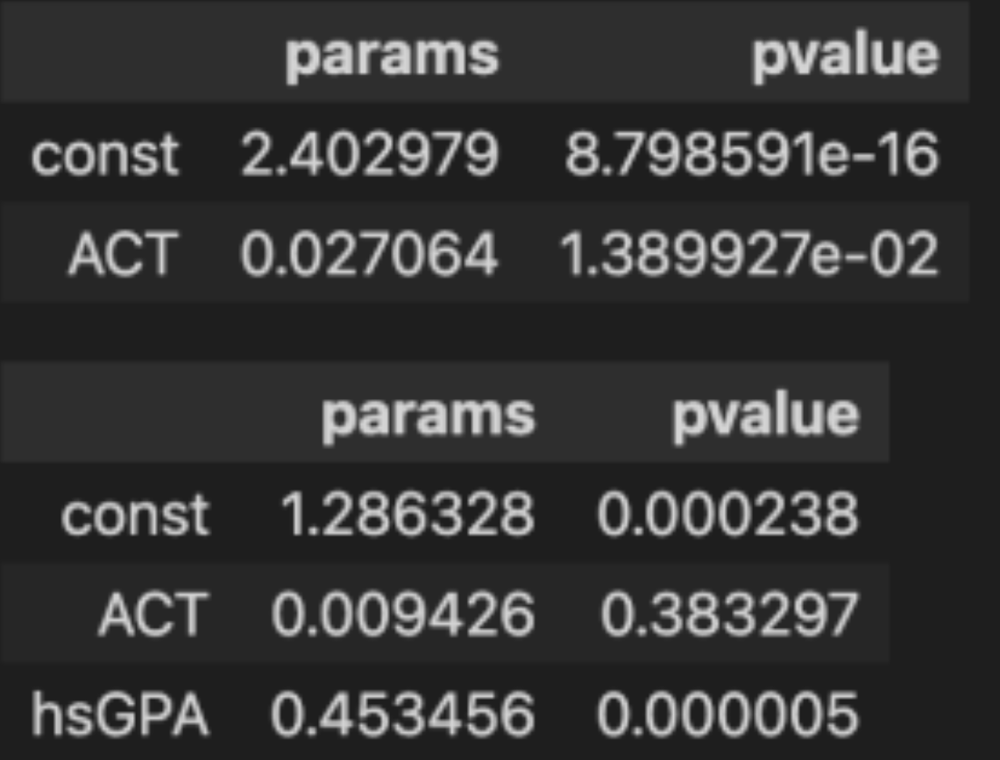
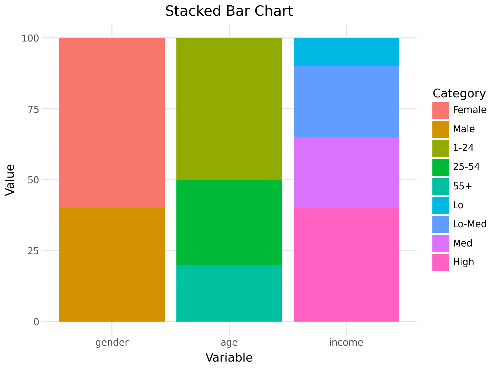
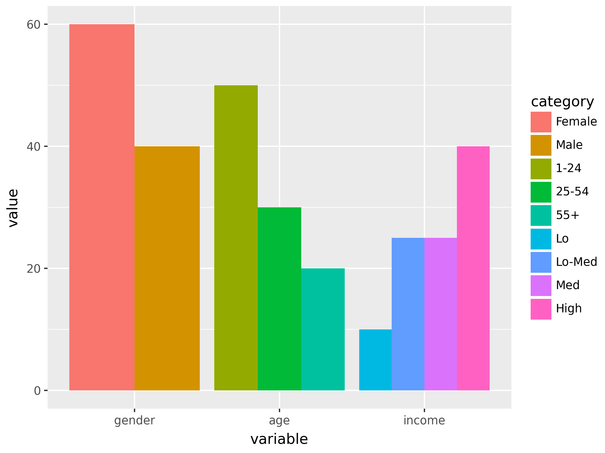

> 本节内容网址：[intro-mathmodel-Chap6: 数据处理与拟合 | Datawhale](https://www.datawhale.cn/learn/content/85/3036)

## 数据与大数据

大数据科学研究的不仅仅是数据分析，它还包括了：

- 数据的获取和存储：包括爬虫、软件定义存储、硬件存储有关背景知识等。
- 数据的处理：包括分布式计算、并行计算、数据流等知识，以及Hadoop、Spark等大数据框架。
- 数据的分析：包括统计学、数据挖掘与机器学习、计算机视觉、自然语言处理等内容，重在挖掘数据中的模式与知识。
- 数据的管理：现代数据库系统及其架构等内容。
- 数据的应用：数据可视化、数据相关软件的开发、报表分析以及如何将数据挖掘得到的结果还原为实际问题的解决方案。

`.csv`,`.tsv`等格式文件可以使用记事本、excel、WPS等打开.

## 数据的预处理

### 基础知识

原始数据通常是混乱的，而数据和特征对最终效果的上限起到重要作用，因此需要进行预处理.

对于表格数据而言，有以下定义：

- 表头：第一行，表示各列数据名称/意义
- 字段：表头中的每一格
- 稀疏：列数超过行数的1/2（有些稀疏），列数是行数的3倍（严重稀疏），或者nan/0的占比很高
- 属性/维：每一列称为一个属性，或者一个维.属性有连续/离散之分，与定义域有关.

### 基于Python的数据处理

#### pandas基础操作

以教材的示例代码来记录pandas用法，顺便复健<del>选考技术知识点</del>.

```python
import pandas as pd
import numpy as np
data = {'animal': ['cat', 'cat', 'snake', 'dog', 'dog', 'cat','snake', 'cat', 'dog', 'dog'],
        'age': [2.5, 3, 0.5, np.nan, 5, 2, 4.5, np.nan, 7, 3],
        'visits': [1, 3, 2, 3, 2, 3, 1, 1, 2, 1],
        'priority': ['yes', 'yes', 'no', 'yes', 'no', 'no', 'no', 'yes', 'no', 'no']}

labels = ['a', 'b', 'c', 'd', 'e', 'f', 'g', 'h', 'i', 'j']
df = pd.DataFrame(data)
```

??? tips "操作举例"
    显示基本信息：
    ```python
    df.describe()  
    '''
    这是打印出来的结果：
                age     visits
    count  8.000000  10.000000
    mean   3.437500   1.900000
    std    2.007797   0.875595
    min    0.500000   1.000000
    25%    2.375000   1.000000
    50%    3.000000   2.000000
    75%    4.625000   2.750000
    max    7.000000   3.000000
    '''
    ```

    基本操作：

    ```python
    df.head(5) # 前5列

    df[['animal', 'age']] # 取出标签是'animal''age'的列
    
    df.loc[[3,4,8],['animal', 'age']] # 取出3,4,8列中标签是是'animal''age'的列
    
    df.loc[df['visits']==3, :] # 列为`visits`中等于3的行

    df.loc[df['age'].isna(),:] # `age`为缺失值的行

    df.loc[(df['animal'] == 'cat') & (df['age'] < 3), :] # `animal` == cat且 `age`<3 的行

    df.loc[(df['age']>=2)&(df['age']<=4), :] # `age` \in [2,4] 的所有数据

    df.index = labels
    df.loc[['f'], ['age']] = 1.5 # 把f行的age改成1.5

    df['visits'].sum() # 对visits列求和

    df.groupby(['animal'])['age'].maen() # 对所有属于animal的元素，计算age的平均值
    ```

#### 特殊情况处理

重复数据：直接删除即可

空缺数据：主要观察缺失率

$$
    \begin{cases}
        \text{大概5%以内}: & \text{问题允许的情况下可以删掉行} \\
        \text{5%-20%}: & \text{可以使用填充、插值的方法处理 eg.常数填充、均值填充} \\
        \text{20%-40%}: & \text{需要用预测方法例如机器学习去填充缺失数据} \\
        \text{>50%}: & \text{条件允许可以把这一列都删掉}
    \end{cases}$$

??? tips "操作举例"

    ```python
    df = pd.DataFrame({'From_To': ['LoNDon_paris', 'MAdrid_miLAN', 'londON_StockhOlm',
                               'Budapest_PaRis', 'Brussels_londOn'],
              'FlightNumber': [10045, np.nan, 10065, np.nan, 10085],
              'RecentDelays': [[23, 47], [], [24, 43, 87], [13], [67, 32]],
                   'Airline': ['KLM(!)', '<Air France> (12)', '(British Airways. )',
                               '12. Air France', '"Swiss Air"']})
    # 线性插值，在等差数列中自动计算并填充缺失的中间值
    df['FlightNumber'] = df['FlightNumber'].interpolate().astype(int)

    # 把1列拆分成2列
    temp = df['From_To'].str.split("_", expand=True)
    temp.columns = ['From', 'To']

    # 将列From和To转化成只有首字母大写的形式。
    temp['From'] = temp['From'].str.capitalize()
    temp['To'] = temp['To'].str.capitalize()

    # 将列From_To从df中去除，并把列From和To添加到df中
    df.drop('From_To', axis=1, inplace=True)
    df[['From', 'To']] = temp

    # 清除列中的特殊字符，用正则匹配只留下字母和空格
    df['Airline'] = df['Airline'].str.extract(r'([a-zA-Z\s]+)', expand=False).str.strip()

    # 在 RecentDelays 列中，值已作为列表输入到 DataFrame 中。我们希望每个第一个值在它自己的列中，每个第二个值在它自己的列中，依此类推。如果没有第 N 个值，则该值应为 NaN。将 Series 列表展开为名为 的 DataFrame delays，重命名列delay_1，delay_2等等，并将不需要的 RecentDelays 列替换df为delays.
    delays = df['RecentDelays'].apply(pd.Series)
    delays.columns = ['delay_%s' % i for i in range(1, len(delays.columns)+1)]
    df = df.drop('RecentDelays', axis=1).join(delays, how='left')

    # 将delay_i列的控制nan都填为自身的平均值
    for i in range(1, 4):
        df[f'delay_{i}'] = df[f'delay_{i}'].fillna(np.mean(df[f'delay_{i}']))

    # 在df中增加一行，值与FlightNumber=10085的行保持一致.
    df = df._append(df.loc[df['FlightNumber'] == 10085, :], ignore_index=True)

    # 对df进行去重，由于df添加了一行的值与FlightNumber=10085的行一样的行，因此去重时需要去掉.
    df = df.drop_duplicates()
    ```

### 数据的规约

可以将量纲影响、数值差异抹去，更加高效地表示数据. 比较常见的是$\min-\max$规约以及$\text{Z-score}$规约.

$\min-\max$规约：

$$x_{new} = \dfrac{x - \min(x)}{\max(x) - \min(x)}$$

这可以消除量纲影响，将所有属性归约到$[0,1]$的范围内，但不能消除异常值（如非常大的值）的影响，仍然会保持有偏状态.

$\text{Z-score}$规约：

$$x_{new} = \dfrac{x-\bar{x}}{\operatorname{std}(x)}$$

这能够对数据的分布进行规约，比如可以将一组原本近似服从正态分布的数据化成标准正态分布.

规约可以组合使用.

## 常见的统计分析模型

??? info "数学原理"
    [推荐的资源网站](https://github.com/Git-Model/Modeling-Universe/tree/main/Data-Story)

大数据的分析思路基于统计分析，与机器学习接近. 但是机器学习侧重“预测未来”，统计分析侧重推导出“为什么”.

### 回归分析 & 分类分析

??? note "回归分析"

    ```python
    import numpy as np
    import pandas as pd
    import matplotlib.pyplot as plt
    from scipy import stats
    import seaborn as sns
    from IPython.display import display
    import statsmodels.api as sm

    # 将数据集导入进gpa1这一指标中.
    gpa1=pd.read_stata('./data/gpa1.dta')

    # 在数据集中提取自变量（ACT为入学考试成绩、hsGPA为高考成绩）
    X1=gpa1.ACT
    X2=gpa1[['ACT','hsGPA']]

    y=gpa1.colGPA  # 提取因变量

    # 为自变量增添截距项
    X1=sm.add_constant(X1)
    X2=sm.add_constant(X2)
    display(X2)

    # 拟合两个模型
    gpa_lm1=sm.OLS(y,X1).fit()  # colGPA = \beta_0 + \beta_1 \times ACT + \epsilon
    gpa_lm2=sm.OLS(y,X2).fit()  # colGPA = \beta_0 + \beta_1 \times ACT + \beta_2 \times hsGPA + \epsilon

    # 输出两个模型的回归系数（params）和显著性检验的p值（pvalue）
    #
    p1=pd.DataFrame(gpa_lm1.pvalues,columns=['pvalue'])
    c1=pd.DataFrame(gpa_lm1.params,columns=['params'])
    p2=pd.DataFrame(gpa_lm2.pvalues,columns=['pvalue'])
    c2=pd.DataFrame(gpa_lm2.params,columns=['params'])
    display(c1.join(p1,how='right'))
    display(c2.join(p2,how='right'))
    ```

    根据数据得到参数结果：

    <center></center>

    > 从模型I可以看到，ACT变量的pvalue为0.01<0.05，说明大学入学考试成绩ACT能显著影响大学GPA；但从模型II可以看到，高考成绩hsGPA的pvalue为0.000005远小于0.05，说明高考成绩hsGPA显著影响大学成绩GPA，但大学入学考试成绩ACT的pvalue为0.38大于0.05，不能说明大学入学考试成绩ACT显著影响大学成绩GPA.

    > 为什么会出现这样矛盾的结论呢？原因有可能是：在没有加入高考成绩hsGPA时，大学入学考试成绩ACT确实能显著影响大学成绩GPA，但是加入高考成绩hsGPA后，有可能高考成绩hsGPA高的同学大学入学考试也高分，这两者的相关性较高，显得“大学入学考试成绩ACT并不是那么重要”了.

??? tips "分类分析"

    ST(Special Treatment)是对财务情况不佳而投资前景未知的上市公司股票的标记，可以保护投资者利益.
    现在希望调查被ST的原因，因此考察ARA/ASSET/……等指标.

    ```python
    import pandas as pd
    import numpy as np
    import statsmodels.api as sm
    from scipy import stats

    ST=pd.read_csv('./data/ST.csv') # 读取数据
    ST.head() # 查看数据前几行

    st_logit=sm.formula.logit('ST~ARA+ASSET+ATO+ROA+GROWTH+LEV+SHARE',  # 使用公式接口建立Logistic回归模型：
                                                                        # ST = f(ARA, ASSET, ATO, ROA, GROWTH, LEV, SHARE)，括号内的都是参数
    data=ST).fit()
    print(st_logit.summary()) # 输出各变量的系数、显著性检验、模型拟合优度等统计信息，帮助判断哪些财务指标是企业被ST的重要预警信号
    ```

    与回归分析类似，一般认为，p值小于0.05的自变量是显著的，也就是说，有统计学证据表明该变量会影响因变量为1的概率.

### 假设检验

假设检验的本质：根据样本信息与已知信息，对一个描述总体性质的命题进行“是或否”的检验与回答（假设检验验证的不是样本本身的性质，而是样本所在总体的性质）

作用：

* 对数据进行探索性的信息挖掘，给予选择模型时充分且客观的依据；
* 能在建模完成后，通过特定的假设检验验证模型的有效性.

假设检验可分成参数假设检验和非参数假设检验，若假设是关于总体的一个参数或者参数的集合，则该假设检验就是参数假设检验；反之为非参数假设检验 eg. 正态检验.

### 随机过程与随机模拟

主要使用simpy来做仿真. 缺少的数学理论知识可以在前面的info框中找到.

??? note1 "案例1"

    统计一天中车辆经过的数量.

    通过一周的简单调查，得到每天的每个小时平均车辆数：[30, 20, 10, 6, 8, 20, 40, 100, 250, 200, 100, 65, 100, 120, 100, 120, 200, 220, 240, 180, 150, 100, 50, 40]，利用平均车辆数进行仿真。

    ```python
    import simpy
    import numpy as np

    class Road_Crossing:
        def __init__(self, env):
            self.road_crossing_container = simpy.Container(env, capacity = 1e8, init = 0)

    def come_across(env, road_crossing, lmd):
        while True:
            body_time = np.random.exponential(1.0/(lmd/60))  # 经过指数分布的时间后，泊松过程记录数+1
            yield env.timeout(body_time)  # 经过body_time个时间
            yield road_crossing.road_crossing_container.put(1)

    hours = 24  # 一天24h
    minutes = 60  # 一个小时60min
    days = 3   # 模拟3天
    lmd_ls = [30, 20, 10, 6, 8, 20, 40, 100, 250, 200, 100, 65, 100, 120, 100, 120, 200, 220, 240, 180, 150, 100, 50, 40]   # 每隔小时平均通过车辆数
    car_sum = []  # 存储每一天的通过路口的车辆数之和
    print('仿真开始：')
    for day in range(days):
        day_car_sum = 0   # 记录每天的通过车辆数之和
        for hour, lmd in enumerate(lmd_ls):
            env = simpy.Environment()
            road_crossing = Road_Crossing(env)
            come_across_process = env.process(come_across(env, road_crossing, lmd))
            env.run(until = 60)  # 每次仿真60min
            if hour % 4 == 0:
                print("第"+str(day+1)+"天，第"+str(hour+1)+"时的车辆数：", road_crossing.road_crossing_container.level)
            day_car_sum += road_crossing.road_crossing_container.level
        car_sum.append(day_car_sum)
    print("每天通过交通路口的的车辆数之和为：", car_sum)
    ```

??? tips "案例2"

    仿真“每日的商店营业额”这一复合泊松过程，计算每天商业的营业额.

    ```python
    import simpy
    import numpy as np

    class Store_Money:
        def __init__(self, env):
            self.store_money_container = simpy.Container(env, capacity = 1e8, init = 0)

    def buy(env, store_money, lmd, avg_money):
        while True:
            body_time = np.random.exponential(1.0/(lmd/60))  # 经过指数分布的时间后，泊松过程记录数+1
            yield env.timeout(body_time)
            money = np.random.poisson(lam=avg_money)
            yield store_money.store_money_container.put(money)

    hours = 24  # 一天24h
    minutes = 60  # 一个小时60min
    days = 3   # 模拟3天
    avg_money = 10
    lmd_ls = [10, 5, 3, 6, 8, 10, 20, 40, 100, 80, 40, 50, 100, 120, 30, 30, 60, 80, 100, 150, 70, 20, 20, 10]   # 每个小时平均进入商店的人数
    money_sum = []  # 存储每一天的商店营业额总和
    print('仿真开始：')
    for day in range(days):
        day_money_sum = 0   # 记录每天的营业额之和
        for hour, lmd in enumerate(lmd_ls):
            env = simpy.Environment()
            store_money = Store_Money(env)
            store_money_process = env.process(buy(env, store_money, lmd, avg_money))
            env.run(until = 60)  # 每次仿真60min
            if hour % 4 == 0:
                print("第"+str(day+1)+"天，第"+str(hour+1)+"时的营业额：", store_money.store_money_container.level)
            day_money_sum += store_money.store_money_container.level
        money_sum.append(day_money_sum)
    print("每天商店的的营业额之和为：", money_sum)
    ```

??? tips "状态转移预测"

    疾病的预测，计算此时是无症状期（状态2）的人在10次转移之后，处于各状态的概率.

    ```python
    import numpy as np
    def get_years_dist(p0, P, N):
    P1 = P
    for i in range(N):
        P1 = np.matmul(P1, P)
    return np.matmul(p0, P1)

    p0 = np.array([0, 1, 0, 0])
    P = np.array([
        [10.0/80, 62.0/80, 5.0/80, 3.0/80],
        [0, 140.0/290, 93.0/290, 57.0/290],
        [0, 0, 180.0/220, 40.0/220],
        [0, 0, 0, 1]
    ])
    N = 10
    print(str(N)+"期转移后，状态分布为：", np.round(get_years_dist(p0, P, N), 4))
    ```

## 数据可视化

### 3个数据可视化工具

可视化和数据可视化其实都旨在使用图表去表达观点，而数据可视化更加强调使用可视化的图表去表达数据中的信息，如数据分析中的结论.

数据可视化分成分析过程中大哥数据可视化、结果表达中的数据可视化.

一个好的数据可视化图表应该满足以下条件：

* 信息全面无歧义

* 图标表达的信息多而全面

* 通俗易懂，不过分专业

举例：(源代码需要使用Jupyter Notebook显示，这里进行了VSCode的修改)

??? tips "可视化样例1"

    ```python
    import numpy as np
    import pandas as pd
    import matplotlib.pyplot as plt
    import matplotlib
    matplotlib.use('TkAgg')  # VSCode 中推荐使用 TkAgg 后端
    plt.rcParams['font.sans-serif'] = ['SimHei', 'Songti SC', 'STFangsong']
    plt.rcParams['axes.unicode_minus'] = False

    from plotnine import *

    # 创建数据
    df = pd.DataFrame({
        'variable': ['gender', 'gender', 'age', 'age', 'age', 'income', 'income', 'income', 'income'],
        'category': ['Female', 'Male', '1-24', '25-54', '55+', 'Lo', 'Lo-Med', 'Med', 'High'],
        'value': [60, 40, 50, 30, 20, 10, 25, 25, 40],
    })

    # 设置分类顺序
    df['variable'] = pd.Categorical(df['variable'], categories=['gender', 'age', 'income'])
    df['category'] = pd.Categorical(df['category'], categories=df['category'])

    # 绘制堆叠柱状图
    p = (
        ggplot(df, aes(x='variable', y='value', fill='category')) +
        geom_col() +
        theme_minimal() +
        labs(title='Stacked Bar Chart', x='Variable', y='Value', fill='Category')
    )

    q = (
        ggplot(df, aes(x='variable', y='value', fill='category'))+
        geom_col(stat='identity', position='dodge')
    )
    # 保存为文件
    p.save('chart1.png', dpi=300)
    print("图表已保存为 chart1.png")
    q.save('chart2.png', dpi=300)
    print("图表已保存为 chart2.png")
    ```

打印出的效果：

堆叠柱状图：
<center></center>

柱状图：
<center></center>

#### matplotlib

引入：

```python
import matplotlib.pyplot as plt
```

操作举例：

```python
import numpy as np
x = np.linspace(-2*np.pi, 2*np.pi, 100)
y = np.sin(x)
import matplotlib.pyplot as plt

plt.figure(figsize=(8,6))
plt.scatter(x=x,y=y)
plt.xlabel('x')
plt.ylabel('y')
plt.title('y = sin(x)')
plt.show()
```

#### seaborn

主要用于统计分析绘图，基于matplotlib进行了更高级的API封装，是对其的补充，调用也更方便.

```python
import pandas as pd
import numpy as np
import matplotlib.pyplot as plt
import seaborn as sns

x = np.linspace(-10, 10, 100)
y = 2 * x + 1 + np.random.randn(100)
df = pd.DataFrame({'x':x, 'y':y})
# 准备数据
x = np.linspace(-10, 10, 100)
y = 2 * x + 1 + np.random.randn(100)
df = pd.DataFrame({'x':x, 'y':y})

# 使用Seaborn绘制带有拟合直线效果的散点图
sns.lmplot(x = "x", y = "y", data = df)
```

（对源文档进行了修正，seaborn新版本中lmplot模块进行了修改，原来文档的写法已经过时，会报错）

#### plotnine

ggplot2是来自R语言的数据可视化包，plotnine就来源于此，是其在Python上面的移植版.

Plotnine的绘图逻辑是一句话一个图层，正因如此，少量代码可以处理复杂的图标.

```python
p1 = (
    ggplot(mpg, aes(x='displ', y='hwy', color='drv'))     # 设置数据映射图层，数据集使用mpg，x数据使用mpg['displ']，y数据使用mpg['hwy']，颜色映射使用mog['drv']
    + geom_point()       # 绘制散点图图层
    + geom_smooth(method='lm')        # 绘制平滑线图层
    + labs(x='displacement', y='horsepower')     # 绘制x、y标签图层
)
print(p1)   # 展示p1图像
```

### 基本图表Quick Start

类别型图表：柱状图、横向柱状图、堆叠柱状图、极坐标的柱状图、词云、雷达图、桑基图

大概就是对着[链接](https://www.datawhale.cn/learn/content/85/3138)自己看.

## 插值模型

是处理缺失值/数据填充的方法.

### 线性插值法

给定数据点$(x_k,y_k)$,$x_{k+1},y_{k+1}$，对其中的点进行填充.根据点斜式，解析式为：

$$L_1(x) = y_k + \dfrac{y_{k+1}-y_k}{x_{k+1}-x_k}(x-x_k)$$

于是插值代码：

```python
import numpy as np
import scipy.interpolate as spi

x = np.arange(-2*np.pi, 2*np.pi, 1) # 在[-2\pi,2\pi]范围内，以步长1生成x坐标
y = np.sin(x)                       # 计算对应的正弦函数值
new_x = np.arange(-2*np.pi, 2*np.pi, 0.1) # 生成更密集的x值（步长0.1）用于插值
ipo1 = spi.splrep(x,y,k = 1)        # 创建1次样条（即线性插值）的表示
ly1 = spi.splev(new_x,ipo1)         # 在新的x坐标点上计算插值结果
```

### 三次样条插值

将两个点之间的填充方法设置成用三次多项式$lk$拟合.

$$a_ix_i^3+b_ix_i^2+c_ix_i+d_i=a_{i+1}x_{i+1}^3+b_{i+1}x_{i+1}^2+c_{i+1}x_{i+1}+d_{i+1}$$

$$\Longrightarrow 3a_ix_i^2+2b_ix_i+c_i=3a_{i+1}x_{i+1}^2+2b_{i+1}x_{i+1}+c_{i+1}$$

$$\Longrightarrow 6a_ix_i+2b_i=6a_{i+1}x_{i+1}+2b_{i+1}$$

通过解上述三个式子联立而得的方程，得到系数.

```python
ipo3 = spi.splrep(X, Y, k=3)  # 样本点导入，生成参数
iy3 = spi.splev(new_x, ipo3)  # 根据观测点和样条参数，生成插值
```

### 拉格朗日插值

Lagrange插值公式：

$${l_k}(x) = \prod\limits_{i = 0,i \ne k}^n {\dfrac{{x - {x_i}}}{{{x_k} - {x_i}}}}$$

实现代码：

```python
def lagrange(x0,y0,x):
    y=[]
    for k in range(len(x)):
        s=0
        for i in range(len(y0)):
           t=y0[i]
           for j in range(len(y0)):
              if i!=j:
                t*=(x[k]-x0[j])/(x0[i]-x0[j])
           s+=t
        y.append(s)
    return y
```
