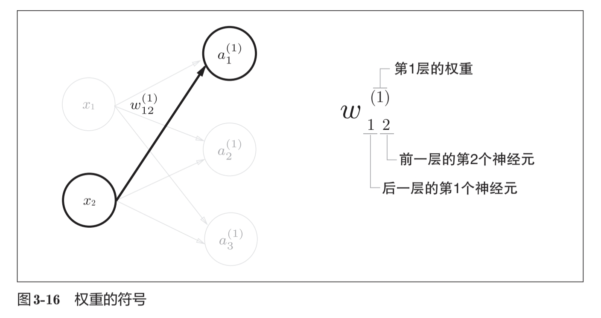
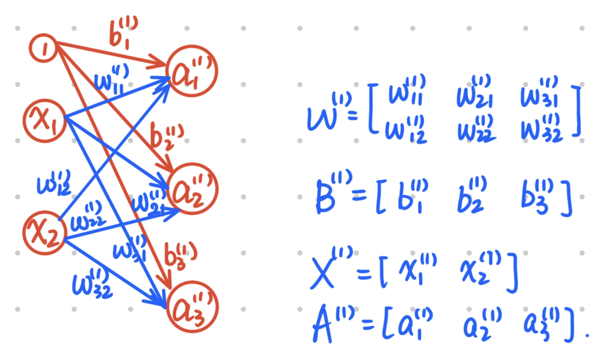

# Chap3-神经网络

## Notes

结构：输入层-中间层（隐藏层）-输出层

激活函数：

$$h(x) = \begin{cases} 0 & (x \leq 0) \\ 1 & (x > 0)\end{cases}$$

可以将感知机改写成：

$$a = b + w_1x_1+ w_2x_2, \quad y = h(a)$$

---

将感知机的激活函数从阶跃变成连续函数，就进入了神经网络.

如：sigmoid函数

$$h(x) = \dfrac{1}{1+ \exp(-x)}$$

```python
def sigmoid(x):
    return 1 / (1 + np.exp(-x))
```

---

阶跃函数的numpy下python实现：

```python
def step_function(x): 		# x = np.array([-1.0, 1.0, 2.9])
	y = x > 0 		 	   # 对每个元素进行判断，生成bool数组np.array([False, True, True])
    return y.astype(np.int) # 类型转换，把 False 变成 0，True 变成 1, 返回 np.array([0, 1, 1])
```

进一步地，

```python
def step_function(x):
    return np.array(x > 0, dtype = np.int)
```

绘图：

```python
import numpy as np
import matplotlib.pylab as plt

def step_function(x):
    return np.array(x > 0, dtype = np.int)

x = np.arange(-5.0, 5.0, 0.1)
y = step_function(x)

plt.plot(x, y)
plt.ylim(-0.1, 1.1) # y轴范围从 -0.1 到 1.1
plt.show()
```

---

ReLU (Rectified Linear Unit)函数：

$$h(x) = \begin{cases} x & (x > 0) \\ 0 & (x \leq 0)\end{cases}$$

```python
def relu(x):
    return np.maximum(0,x)
```

---

多维数组运算：

```python
>>> import numpy as np
>>> A = np.array([1,2,3,4])
>>> print(A)
[1 2 3 4]
>>> np.ndim(A)
1
>>> A.shape
(4,)
>>> A.shape[0]
4
```

`ndim`返回列数. `shape[0]`返回行数，`shape[1]`返回列数.

```python
>>> B = np.array([[1,2], [3,4], [5,6]])
>>> print(B)
[[1 2]
 [3 4]
 [5 6]]
>>> np.ndim(B)
2
>>> B.shape
(3, 2)
>>> B.shape[0]
3
```

---

矩阵乘法实现：

```python
>>> A = np.array([[1,2], [3,4]])
>>> A.shape
(2, 2)
>>> B = np.array([[5,6], [7,8]])
>>> B.shape
(2, 2)
>>> np.dot(A,B)
array([[19, 22],
       [43, 50]])
```

乘法成立的充分必要条件：`np.ndim(A) = A.shape[1] = B.shape[0]`

---

三层神经网络前向处理（从输入到输出）实现：



$$a_1^{(1)} = w_{11}^{(1)}x_1 + w_{12}^{(1)}x_2 + b_{1}^{(1)}$$

加权和写法：

$$A^{(1)} = XW^{(1)} + B^{(1)}$$



```python
X = np.array([1.0, 0.5])
W1 = np.array([[0.1, 0.3, 0.5], [0.2, 0.4, 0.6]])
B1 = np.array([0.1, 0.2, 0.3])

A1 = np.dot(X, W1) + B1
Z1 = sigmoid(A1)

W2 = np.array([[0.1, 0.4], [0.2, 0.5], [0.3, 0.6]])
B2 = np.array([0.1, 0.2])

A2 = np.dot(Z1, W2) + B2
Z2 = sigmoid(A2)

def identity_function(x):
    return x

W3 = np.array([[0.1, 0.3], [0.2, 0.4]])
B3 = np.array([0.1, 0.2])
A3 = np.dot(Z2, W3) + B3

Y =  identity_function(A3)
```

在输出层的激活函数用$\sigma$表示，而不是$h()$.

整理实现：

```python
def init_network():
    network = {}
    network['W1'] = np.array([[0.1, 0.3, 0.5], [0.2, 0.4, 0.6]])
    network['B1'] = np.array([0.1, 0.2, 0.3])
    network['W2'] = np.array([[0.1, 0.4], [0.2, 0.5], [0.3, 0.6]])
    network['B2'] = np.array([0.1, 0.2])
    network['W3'] = np.array([[0.1, 0.3], [0.2, 0.4]])
    network['B3'] = np.array([0.1, 0.2])
    return network

def forward(network, x):
    W1, W2, W3 = network['W1'], network['W2'], network['W3']
    B1, B2, B3 = network['B1'], network['B2'], network['B3']
    
    a1 = np.dot(x, W1) + B1
    z1 = sigmoid(a1)
    a2 = np.dot(z1, W2) + B2
    z2 = sigmoid(a2)
    a3 = np.dot(z2, W3) + B3
    z3 = identity_function(a3)
    
    return y

network = init_network()
x = np.array([1.0,0.5])
y = forward(network, x)
print(y)
```

---

输出层可以用softmax函数来设计.

$$y_k = \dfrac{\exp(a_k)}{\sum\limits_{i = 1}^n \exp(a_i)}$$

```python
def softmax(a):
    exp_a = np.exp(a)
    sum_exp_a = np.sum(exp_a)
    y = exp_a / sum_exp_a
    
    return y
```

当某些数太大的时候，会造成溢出，其改进方法是：

$$\begin{aligned} y_k = \dfrac{\exp(a_k)}{\sum\limits_{i = 1}^n \exp(a_i)} = \dfrac{C \exp(a_k)}{C \sum\limits_{i = 1}^n \exp(a_i)} \\ = \dfrac{\exp(a_k+ \log C)}{\sum\limits_{i = 1}^n \exp(a_i + \log C)} \\ = \dfrac{\exp(a_k + C')}{\sum\limits_{i = 1}^n \exp(a_i + C')}\end{aligned}$$

举例：

```python
>>> a = np.array([1010, 1000, 990])
>>> np.exp(a) / np.sum(np.exp(a))
<stdin>:1: RuntimeWarning: overflow encountered in exp
<stdin>:1: RuntimeWarning: invalid value encountered in true_divide
array([nan, nan, nan])
>>> c = np.max(a)
>>> c
1010
>>> a = a-c
>>> np.exp(a) / np.sum(np.exp(a))
array([9.99954600e-01, 4.53978686e-05, 2.06106005e-09])
```

所以可以对softmax进行防溢出改进：

```python
def softmax(a):
    c = np.max(a)
    exp_a = np.exp(a-c)
    sum_exp_a = np.sum(exp_a)
    y = exp_a / sum_exp_a
    
    return y
```

---

## MNIST数据集：手写数字识别

