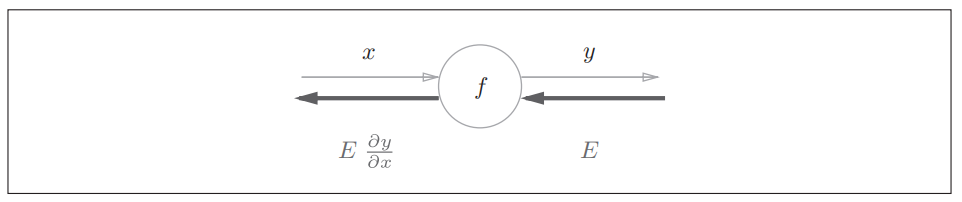
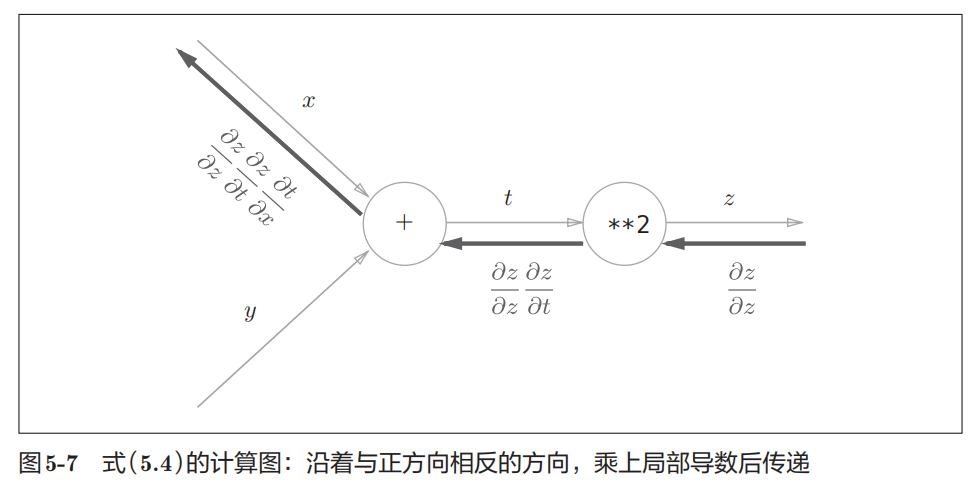
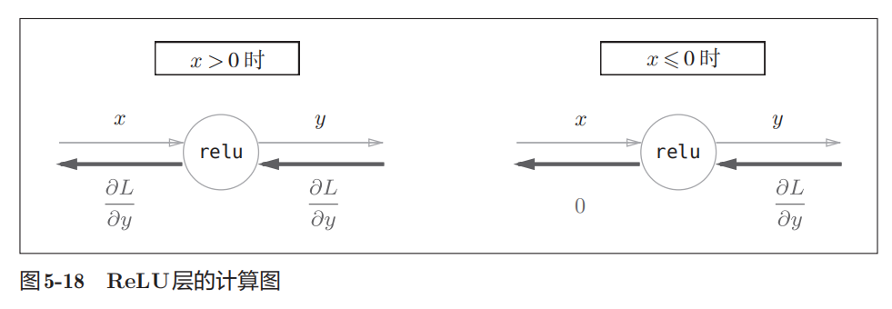
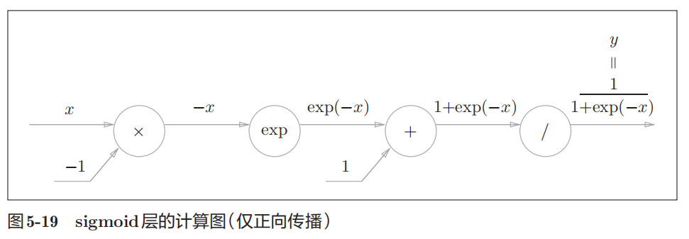
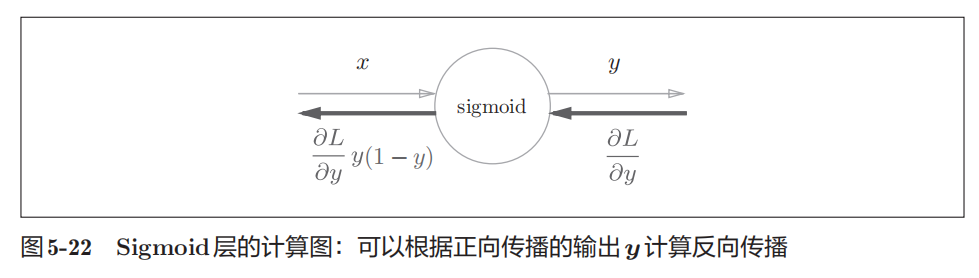
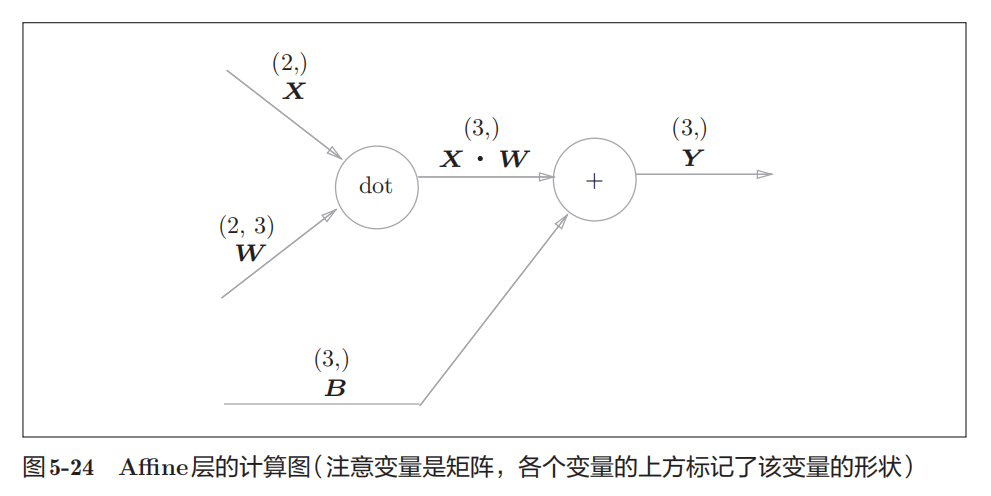
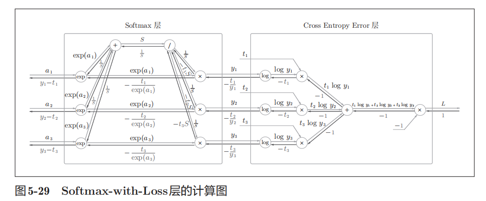

# Chap5-误差反向传播法

## 理论基础：计算图原理





从结果处开始，设置最初为$\dfrac{\partial z}{\partial z}$，之后每走一层就加一层局部偏导.

## 代码实现

简单的加法层与乘法层：

```python
class AddLayer:
    def __init__(self):
        pass
    def forward(self, x, y):
        self.x = x
        self.y = y
        out = x + y
        return out
    def backward(self, out):
        dx = dout * 1
        dy = dout * 1
        
        return dx, dy
```

```python
class MulLayer:
    def __init__(self):
        self.x = None
        self.y = None
    def forward(self, x, y):
        self.x = x
        self.y = y
        out = x*y
        return out
    def backward(self, out):
        dx = dout * self.y
        dy = dout * self.x
        
        return dx, dy
```

---

ReLU层计算图：



```python
class ReLU:
    def __init__(self):
        self.mask = None
        
    def forward(self, x):
        self.mask = (x <= 0)
        out = x.copy()
        out[self.mask] = 0
    	return out
    
    def backward(self, out):
        dout[self.mask] = 0
        dx = dout
        return dx
```

变量mask是由True/False构成的NumPy数组，它会把正向传播时的输入x的元素中小于等于0的地方保存为True，其他地方（大于0的元素）保存为False.

---

Sigmoid层计算图：





可以一步步推算出来结果是$\dfrac{\partial L}{\partial y}y(1-y)$.

```python
class Sigmoid:
    def __init__(self):
        self.out = None
        
    def forward(self, x):
        out = 1 / (1 + np.exp(-x))
        self.out = out
        return out
    
    def backward(self, dout):
        dx = dout * (1.0 - self.out) * self.out
        return dx
```

---

神经网络的正向传播中进行的矩阵的乘积运算在几何学领域被称为“仿射变换”，因此将进行仿射变换的处理实现为“Affine层”.



$$Y = X\cdot W + B \Longrightarrow \dfrac{\partial L}{\partial X} = \dfrac{\partial L}{\partial Y} \dfrac{\partial Y}{\partial X} = \dfrac{\partial L}{\partial Y} W^T, \qquad \dfrac{\partial L}{\partial W} = \dfrac{\partial L}{\partial Y} \dfrac{\partial Y}{\partial W} = X^T \dfrac{\partial L}{\partial Y} $$

```python
class Affine:
    def __init__(self, W, b):
 		self.W = W
 		self.b = b
         self.x = None
         self.dW = None
         self.db = None
 	def forward(self, x):
 		self.x = x
 		out = np.dot(x, self.W) + self.b
 		return out
 	def backward(self, dout):
         dx = np.dot(dout, self.W.T)
         self.dW = np.dot(self.x.T, dout)
         self.db = np.sum(dout, axis=0)
         return dx
```

---

Softmax-with-Loss层（包括Softmax和Cross Entropy Error层）：



```python
class SoftmaxWithLoss:
 	def __init__(self):
         self.loss = None # 损失
         self.y = None # softmax的输出
         self.t = None # 监督数据（one-hot vector）
 	def forward(self, x, t):
         self.t = t
         self.y = softmax(x)
         self.loss = cross_entropy_error(self.y, self.t)
         return self.loss
 	def backward(self, dout=1):
         batch_size = self.t.shape[0]
         dx = (self.y - self.t) / batch_size
         return dx
```

---

确认数值微分求出的梯度结果和误差反向传播法求出的结果是否一致（严格地讲，是非常相近）的操作称为梯度确认（gradient check）.

