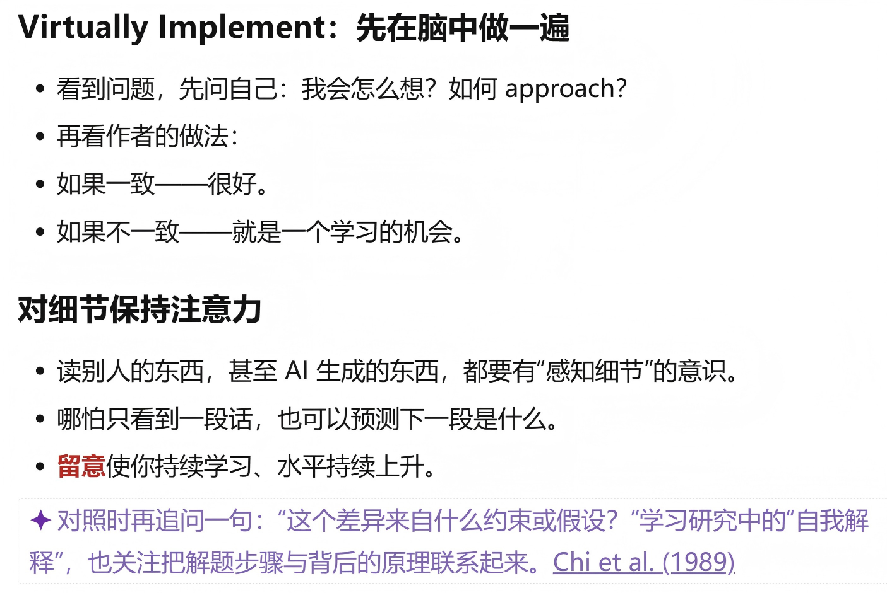
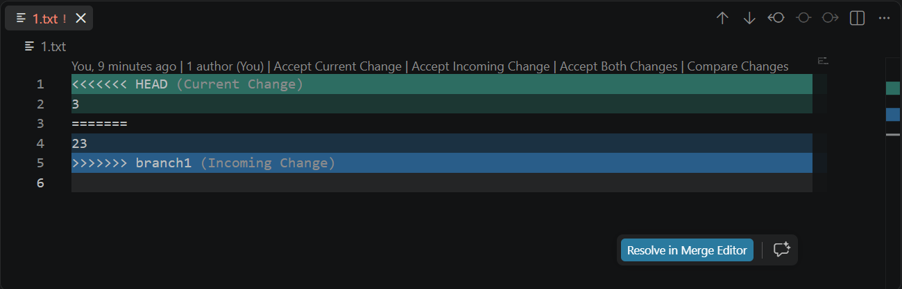
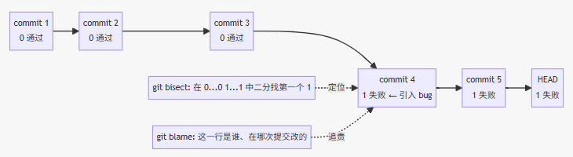
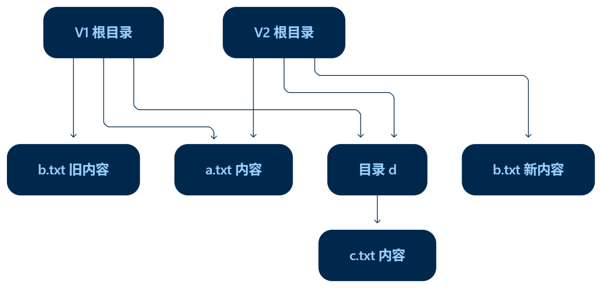

> 课程资源：
>
> * 课程回放：[软件仓库管理[03-Raw/26生成式软件工程/NJU]](https://www.bilibili.com/video/BV1kybV6DE47)
>
> * 讲义：[Lec3: 版本管理-Yanyan's Wiki](https://jyywiki.cn/GSE/2026/lect3.md)
> * Slides：[第 3 讲 · 版本管理](https://jyywiki.cn/GSE/2026/slides3.html)
>
> 这节课实际上教的是Git的额外知识，整理前一半由人工完成，后一半由 Claude Sonnet 5.0 Medium 生成.
>

很难完全讲出在近两年学习中获得的糟糕的体验和血泪. 学校给的课程是如此的艰涩，以至于看到jyy老师的slides会瞳孔放大. 

## 开场白

> “上课耽误学习”的本质：课外的信息量、信息密度巨大，但我们从未教过**如何用好**
>
> **把一次浏览变成一个具体问题：这个项目里的哪一个细节，是我自己做时不会想到的？**

<center></center>

## Git 入门与实践

`git rebase`是什么：

`git merge`冲突以后会观察到什么：

我采用了以下的简化流程来复现这个说法：

```bash
# 新建文件夹
git init
touch 1.txt
echo -n '123' > 1.txt
git add .
git commit -m "Init: 1.txt with 1" # master分支

git checkout -b branch1
git branch # 确认已经切换到branch1分支

echo -n '23' > 1.txt
git add .
git commit -m "Modify: br1 1.txt with 2"

git checkout master
echo -n '3' > 1.txt
git add .
git commit -m "Modify: master 1.txt with 3"

git merge branch1
```

此时终端显示：

```bash
Auto-merging 1.txt
CONFLICT (content): Merge conflict in 1.txt
Automatic merge failed; fix conflicts and then commit the result.
```

VSCode显示：

<center></center>

> jyy：如果你们用 IDE 的话还可以看到上面会多出一些按钮，叫 `Accept Incoming Change`，你就可以在 IDE 里自己决定谁进谁出；完了以后再做一个 commit 把它 resolve 掉. 
>
> 你只需要一点注意力. 其实只要有一两次，你就会有一个印象：至少能说出“两边冲突的代码都会显示在一起”. 比较吃惊的是大家都答得不好，那肯定是：**第一，没有用过**（大家没有开发过；当然就算用 agent 开发你也很容易遇到 conflict，比如你让 agent 在不同分支开发）；**第二，没有留意**. 所以比较重要的是：多用一用，以及试图拥有更好的注意力. 

Best Practice的来源是，**在任何时候学习**，碰到新东西的时候追问一下.

`git bisect`：在提交历史上做二分查找，便于定位在哪个commit出了错误

`git blame`：会告诉你每一行代码都是在哪一次提交、哪一个地方改的

上面的`1.txt`展示成：

```bash
$ git blame -b 1.txt
00000000 (Not Committed Yet 2026-09-10 15:57:47 +0800 1) <<<<<<< HEAD
00000000 (Not Committed Yet 2026-09-10 15:57:47 +0800 2) 3
00000000 (Not Committed Yet 2026-09-10 15:57:47 +0800 3) =======
00000000 (Not Committed Yet 2026-09-10 15:57:47 +0800 4) 23
00000000 (Not Committed Yet 2026-09-10 15:57:47 +0800 5) >>>>>>> branch1
```

<center></center>

hook：在某个事件发生时，自动执行你预先设置的一段程序

因此可以考虑给项目加一段自动检查，执行 `git commit` 时触发检查，通过后才会继续提交.

一个简单的 Git Hook 可以写在 `.git/hooks/pre-commit` 中：

```bash
#!/bin/sh

echo "Checking Correctness with Hook."
npm run lint || exit 1
```

Hook 本身不负责判断代码好坏，它只是触发检查；真正的检查由 lint、测试等程序完成. 假设项目已经配置了 `npm run lint`，再给脚本执行权限：

```bash
chmod +x .git/hooks/pre-commit
```

以后提交时就会自动执行它.


## 学习Git

Git是一个持久化的数据结构，其底层数据结构是`blob/tree/commit`.


<center></center>


一些其它Best Practice：

* [Conventional Commits](https://www.conventionalcommits.org/en/v1.0.0-beta/)里面要求：`fix(parser): accept repeated spaces between arguments`，即 **类型 + 范围 + 行为变化**，人可以浏览，工具可以分类、生成 changelog.

- **Diff 留下"改了什么"，Message 留下"为什么改"**：光写 `fix` 只说明修了 bug，说不清触发条件、设计理由；后人要判断"这段代码能不能删"，靠的是 message 里的理由和 issue 链接，不是 diff 本身. 

*  给自己留退路（个人层面的习惯）

    - 及时 commit：实验前先打检查点，因为只在工作区（未提交）的修改，Git 是救不回来的. 

    - 误操作后：先保护现场，再查 `reflog`；注意远端 clone 不包含未提交的文件. 

* **把探索整理成别人能接手的变化（面向协作）**

    - 发布/合并前按"一个意图"拆分提交，把修复和对应测试放一起，格式化之类的顺手改动另开提交. 

    - 整理后的提交要能独立构建、能测试，这样 review、revert、bisect 才有可靠的最小单位. 

* **稳定团队共同依赖的东西（面向项目规则）**

    - 不擅自改写别人已经依赖的历史（改写等于把整理成本转嫁给协作者），修错一般用追加提交而不是 rebase 别人已拉取的分支. 

    - 约定好分支模型和发布流程（谁负责合并、怎么回移补丁、何时打 tag），让交接可预期. 

    - 用 Hooks + CI 把约定落到可执行的机制上：本地尽早给反馈，服务端把住合入门槛，同步上游代码后要重新测试组合结果. 

    - 把 issue、commit、review 三者串起来，形成"为什么改 → 改了什么 → 怎么验收"的完整链条. 

这一整套实践本质上都是在降低（后人理解历史的）丢失成本、理解成本和协作协调成本，具体用什么 workflow 因项目而异.

给 Agent 设计一套原生版本控制系统"的思路大致分五步：

**1. 项目的本质：由 Atomic Change 推进的快照**

- 人无法处理"一团混沌"，必须把工作分解成可理解、可审计的小任务，这样出问题能 bisect，冲突能解决；有些项目还要求 linear history，方便追溯和 cherry-pick/blame。
- AI-native 场景下这条法则依然成立：**一个 change 对应一个意图**，才能单独解释、验证、撤销——不因为模型能力变强就该放弃这个约束。

**2. 现有实践：把"单线程讨论 + 有限并发"用在人机协作上**

- 架构设计阶段单线程、反复和高智力模型讨论直到收敛，把设计落到文档、规则、示例（比如测试要做到什么程度）；操作系统、编译原理、数据库这些人类积累的好设计仍然要学，架构先定好接口和不变量，后续任务才有独立行动的边界。
- 实现阶段用有限并发（≤3 个 terminal）+ 立即反馈：`AGENTS.md` 明确协作规则（如 linear history），人脑负责布置不冲突的任务，不管 AI 产出质量如何都要立即检查、视觉验收。

**3. 思想实验：如果代码产能暴涨，现有方式会撑不住**

- 如果 Agent 能 1000 倍更快地生产代码，Git"为人设计"的使用方式可能跟不上：生成只要一分钟，人工验收却要一小时，积压的其实是"等待判断的变更"；而且即使改的是不同文件，也可能同时改变了同一个接口约定，冲突不再只是文本层面的。
- 于是提出要**从零设计一个 Agent VCS**：核心是快照、变更、以及一个 change algebra——系统要能回答"哪些变更能组合、哪些必须排队、哪些需要重新验证"，思路类似数据库处理事务：让 Agent 提交"基于某个版本的修改"，由系统控制它何时生效。

**4. 具体机制：MVCC + Change Algebra**

- 图示流程：同一快照 $S_0$ 上，Agent A、B 各自生成变更 $\Delta_A$、$\Delta_B$ → 读取当前 HEAD 组合成候选 $C$ → 按规格/测试/不变量验证 → 短锁/CAS 检查 HEAD 是否仍为原版本 → 通过则发布新快照，不通过则打回 Agent 重新读取/重组/重验。
- **MVCC** 管理多个并发版本；**change algebra** 描述变更如何组合——可交换的变更需满足 $\Delta_B(\Delta_A(S)) = \Delta_A(\Delta_B(S))$，但组合结果仍必须满足项目的不变量（不是随便换序都行）。
- 这是一种设计设想：生成和测试在锁外进行（不阻塞并发），只对验证过的确切版本做原子发布；一旦版本已变就重新组合验证。类比参考 PostgreSQL 的并发控制。

**5. 一种可能性：用"大步历史"换取极致的正确性保障**

- Agent 通过 lock/unlock 获取快照，完成修改验证后再进入主线；锁只保护"取版本"和"发布"两个瞬间，实际工作都在独立快照里进行，不占锁。
- 分工明确：人负责定义意图、不变量、验收标准；Agent 生成候选变更；系统依据验证结果决定是否准入。人只看有意义的"大步历史"，机器则保留细粒度操作和验证证据，供后续定位、重放、回退。
- 由此引出一个更激进的设想——"出什么问题修好就行"：既然没有 Agent 会被开除或坐牢，"审计"这件事的意义可能也要转变。这个设想能否成立，关键在于：**错误能否在造成不可逆后果前被发现，修复是否足够便宜**。测试全绿只说明"通过了已有的验收条件"，验证越强、恢复代价越低，才越敢放手让 Agent 大步前进；审计的重心也可能从"人复查每一步"转向"系统凭什么接受这个变更？还缺什么约束？"


