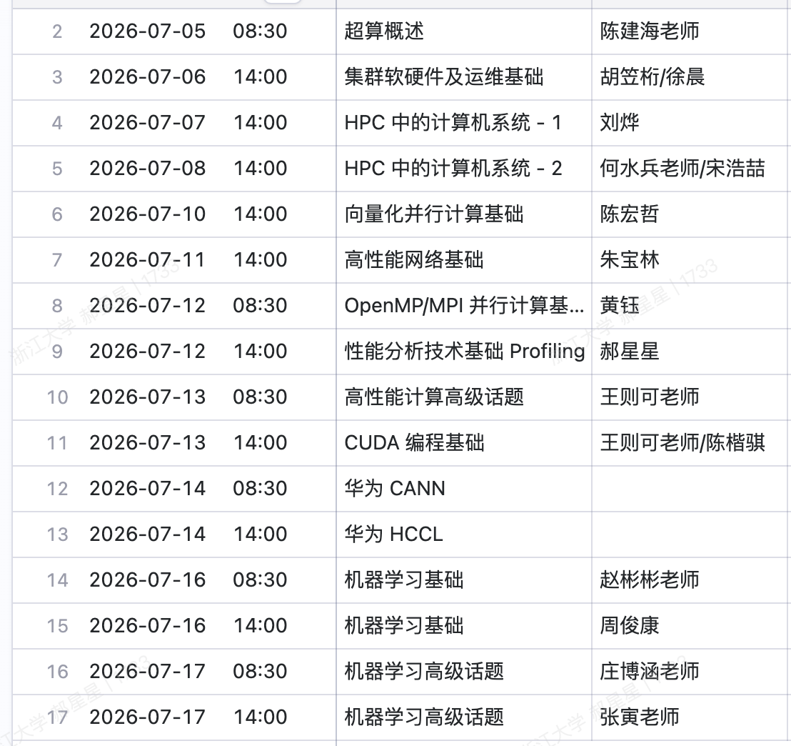

???+ info "课程信息"

    浙江大学HPC101短学期，大二我才着手修读.
    
    [课程实验文档](https://hpc101.zjusct.io/lab)
    
    预修要求：C程序设计基础，编程基础要好，对系统要感兴趣，有一定的linux操作基础更好（肯学也可以）
    
    课程目标内容：学习超算系统有关概念与原理，并行编程技术入门，OpenMP并行编程基础，运维基本操作技能（系统安装配置，Linux shell编程），认识世界超算比赛，培养超算能力和选拔超算竞赛人才。
    
    课程日历：
    
    

    
    参考书目：
    
    * 并行程序设计导论 [An Introduction to Parallel Programming]，机械工业出版社
    * CUDA C编程权威指南，机械工业出版社
    * 深入理解计算机系统，电子工业出版社
    * 深度学习（花书），人民邮电出版社
    
    参考资料：
    
    * [The Missing Semester of Your CS Education](https://missing.csail.mit.edu/)

???+ info "评分标准"

    * 课堂表现（10%）
    * 个人实验（65%）：每年有所变化
        * 实验一：简单集群系统安装配置
        * 实验二：向量化编程
        * 实验三：CUDA矩阵乘法与NVIDIA NSight Profile工具
        * 实验四：并行编程实践科学计算应用性能调优与Intel VTune的实践
        * 实验五：机器学习系统
    * 团队大作业（25%）
        分组大作业：参加 华为、PAC等 HPC类竞赛；答辩展示：答辩效果ppt与技术讲解
