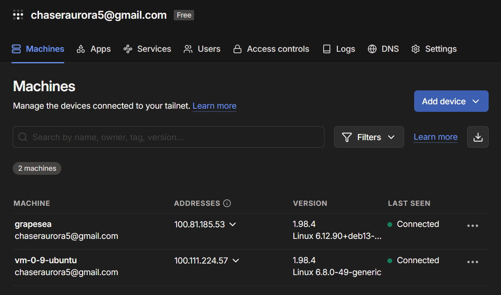
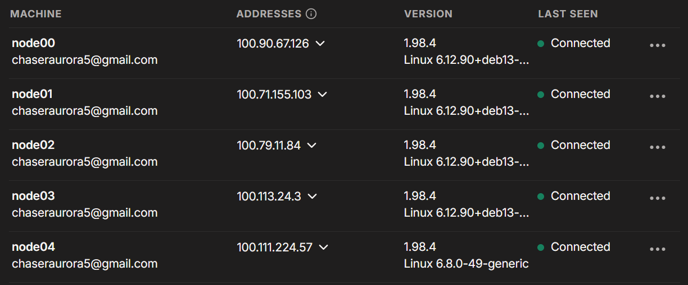
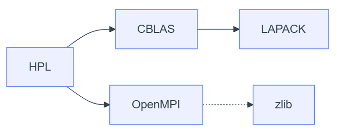
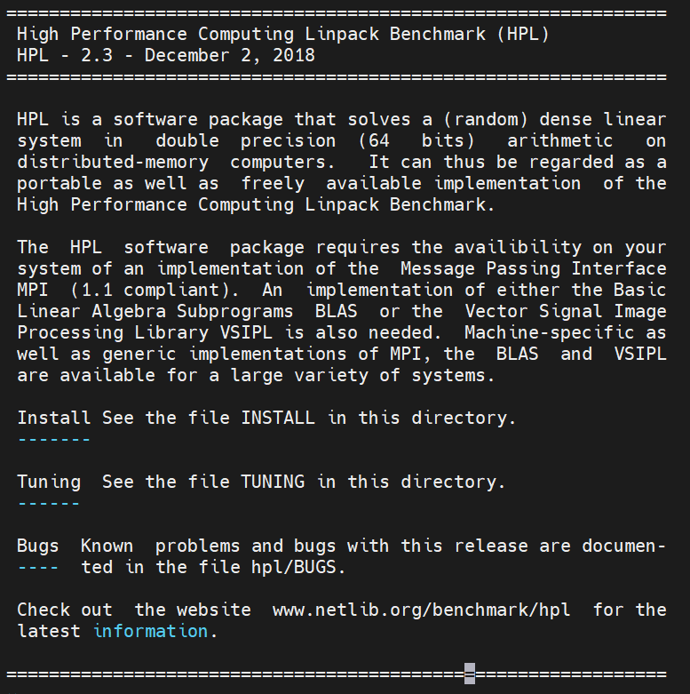
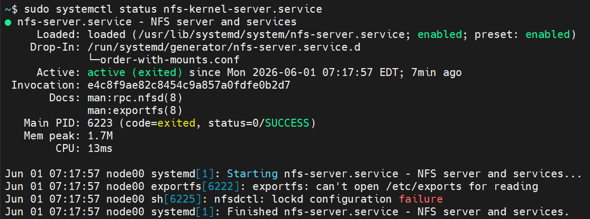
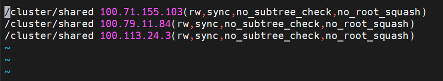
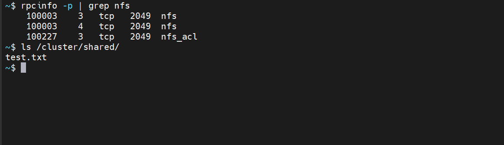
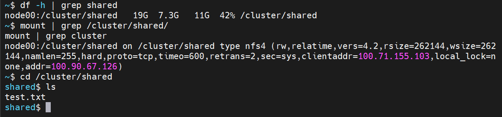
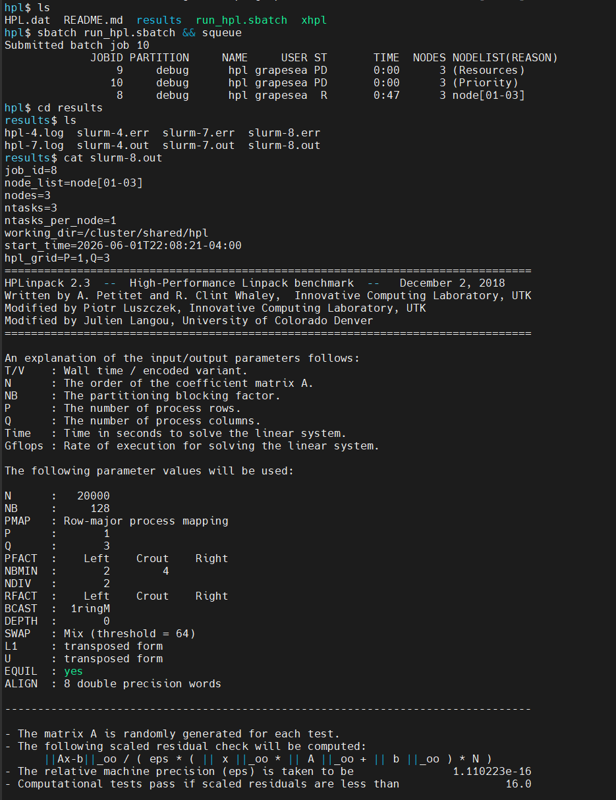
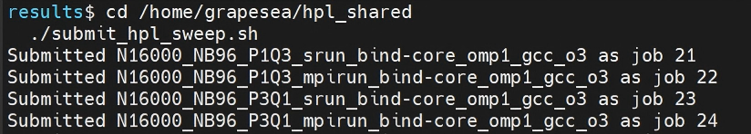

# Lab 1: Simple Cluster Building

<center>Grapesea</center>

[TOC]

> * [Lab1: 简单集群搭建](https://hpc101.zjusct.io/lab/Lab1-MiniCluster/)
> * Q:请简要说明本次实验中 AI Agent 的使用情况，包括所采用的 Agent 平台（或模型服务提供方）、使用的客户端/IDE，以及其在实验中的具体辅助作用:
> * A: Codex/Claude Code，其中Codex为ChatGPT 5.4-high，Claude Code为Deepseek-v4-Flash/Pro. 我也混合使用Claude-Sonnet-4.6-Medium / ChatGPT-Thinking / Deepseek-V4-Pro/Flash联网模式来做小的问答.

本实验是简单集群搭建. 计算机集群是指将多台计算机连在一起通过网络协同工作，以完成一些大规模的计算任务 $\Longrightarrow$ 并行计算思想.

## 从源代码构建Linux应用-Angband

```bash
~$ cd Angband-4.2.5
~/Angband-4.2.5$ ls
acinclude.m4    config.guess  CONTRIBUTING.md  m4         run-tests    tests
aclocal.m4      config.sub    docs             Makefile   screenshots  utils
changes.txt     configure     install-sh       mk         scripts      version
CMakeLists.txt  configure.ac  lib              README.md  src
~/Angband-4.2.5$ vim README.md
```

显示如下：

<center></center>

编译并启动Angband：（这里直接按教程安装的话前端是不会出现的，会报错. 我选择直接在终端中显示，因此多安装了一个`sudo apt install libncurses-dev`）

```bash
$ ./configure --with-no-install
$ make
$ src/angband
```

显示如下：

<center></center>

（嗯？怎么做完1.1的时候1.2也顺便做完了？那看来不是我的环境和教程不一致，而是顺序不一样）

> `ncurses` 库是一个用于在 UNIX-like 系统上进行文本界面操作的库. 它提供了一套 API，使得开发者能够在终端上创建和管理文本界面应用程序，包括窗口、菜单、对话框、文本输入等功能. Angband 使用了了 `ncurses` 库来实现游戏界面. 但这个库不会被包含在 Angband 的源代码中，也没有默认包含在系统中，因此我们需要手动安装. 
>
> 我们解决了一个简单的依赖问题：Angband -> ncurses. 在 HPC 应用中，实际的依赖关系极其复杂. 

自动化构建工具是指在自动化软件构建过程的工具，主要功能有：编译链接、依赖管理、代码检查、单元测试、打包和部署.

常用的Autotools有两种：

* GNU Autotools

    ```bash
    ./configure
    make
    make install
    ```

* CMake

    ```bash
    cmake -B build
    cmake --build build
    ```

## 集群环境搭建

首先需要在主节点上生成ssh密钥对，此处我重新生成了一次：

```bash
grapesea@grapesea:~/codingspace/.ssh$ ssh-keygen -t ed25519
Generating public/private ed25519 key pair.
Enter file in which to save the key (/home/grapesea/.ssh/id_ed25519): /home/grapesea/codingspace/.ssh/cluster_id_ed25519
/home/grapesea/codingspace/.ssh/cluster_id_ed25519 already exists.
Overwrite (y/n)? y
Enter passphrase for "/home/grapesea/codingspace/.ssh/cluster_id_ed25519" (empty for no passphrase):
Enter same passphrase again:
Your identification has been saved in /home/grapesea/codingspace/.ssh/cluster_id_ed25519
Your public key has been saved in /home/grapesea/codingspace/.ssh/cluster_id_ed25519.pub
The key fingerprint is:
SHA256:xxxxxxxxxxxxxxxxxxxxxxxxxxxxxxxxxxxxxxxxx grapesea@grapesea
The key's randomart image is:
+--[ED25519 256]--+
|         ...o.   |
|        o..+.    |
|       ...o  o . |
|       .    o o  |
|      o S .. . o |
|     . E O o. o  |
|. . . .o@ =.     |
|oo =..oo*o.      |
|..*=+o=Bo+       |
+----[SHA256]-----+
```

现在：

```bash
$ ssh-copy-id -i ~/codingspace/.ssh/cluster_id_ed25519.pub grapesea@192.168.159.128
/usr/bin/ssh-copy-id: INFO: Source of key(s) to be installed: "/home/grapesea/codingspace/.ssh/cluster_id_ed25519.pub"
/usr/bin/ssh-copy-id: INFO: attempting to log in with the new key(s), to filter out any that are already installed
/usr/bin/ssh-copy-id: INFO: 1 key(s) remain to be installed -- if you are prompted now it is to install the new keys

Number of key(s) added: 1

Now try logging into the machine, with: "ssh -i /home/grapesea/codingspace/.ssh/cluster_id_ed25519 'grapesea@192.168.159.128'"
and check to make sure that only the key(s) you wanted were added.

$ ssh -i /home/grapesea/codingspace/.ssh/cluster_id_ed25519 'grapesea@192.168.159.128'
```

我安装OpenMPI是按照这个方法进行的：

* 首先从[官网](https://www.open-mpi.org/software/ompi/v5.0/)下载对应软件包，选择了5.0.9的版本，然后配置：

    ```bash
    tar xf openmpi-5.0.9.tar.bz2
    ./configure --prefix=$HOME/openmpi 2>&1 | tee config.out
    ```

    看到了一长串输出，最后的一段是：

    ```bash
    Miscellaneous
    -----------------------
    Atomics: GCC built-in style atomics
    Fault Tolerance support: mpi
    HTML docs and man pages: installing packaged docs
    hwloc: internal
    libevent: internal
    Open UCC: no
    pmix: internal
    PRRTE: internal
    Threading Package: pthreads
    
    Transports
    -----------------------
    Cisco usNIC: no
    Cray uGNI (Gemini/Aries): no
    Intel Omnipath (PSM2): no (not found)
    Open UCX: no
    OpenFabrics OFI Libfabric: no (not found)
    Portals4: no (not found)
    Shared memory/copy in+copy out: yes
    Shared memory/Linux CMA: yes
    Shared memory/Linux KNEM: no
    Shared memory/XPMEM: no
    TCP: yes
    
    Accelerators
    -----------------------
    CUDA support: no
    ROCm support: no
    
    OMPIO File Systems
    -----------------------
    DDN Infinite Memory Engine: no
    Generic Unix FS: yes
    IBM Spectrum Scale/GPFS: no (not found)
    Lustre: no (not found)
    PVFS2/OrangeFS: no
    ```

* 编译和安装：

    ```bash
    make -j$(nproc) 2>&1 | tee make.out
    make install 2>&1 | tee install.out
    ```

* 环境变量配置：

    ```bash
    export PATH=$HOME/openmpi/bin:$PATH
    export LD_LIBRARY_PATH=$HOME/openmpi/lib:$LD_LIBRARY_PATH
    
    echo 'export PATH=$HOME/openmpi/bin:$PATH' >> ~/.bashrc
    echo 'export LD_LIBRARY_PATH=$HOME/openmpi/lib:$LD_LIBRARY_PATH' >> ~/.bashrc
    source ~/.bashrc
    ```

* 验证安装和配置：

    ```bash
    $ mpirun --version
    mpirun (Open MPI) 5.0.9
    $ mpirun -n 2 mpi-hello-world
    ```

    让Claude-4.6-Sonnet写了一段测试程序：

    ```c
    #include <mpi.h>
    #include <stdio.h>
    
    int main(int argc, char *argv[]) {
        MPI_Init(&argc, &argv);
    
        int world_size, world_rank;
        MPI_Comm_size(MPI_COMM_WORLD, &world_size);
        MPI_Comm_rank(MPI_COMM_WORLD, &world_rank);
    
        char processor_name[MPI_MAX_PROCESSOR_NAME];
        int name_len;
        MPI_Get_processor_name(processor_name, &name_len);
    
        printf("Hello from rank %d out of %d on %s\n", world_rank, world_size, processor_name);
    
        MPI_Finalize();
        return 0;
    }
    ```

    编译和运行：

    ```bash
    $ mpicc ~/mpi-hello-world.c -o ~/mpi-hello-world
    $ mpirun -n 2 ~/mpi-hello-world
    
    # 输出似乎顺序是可以变化的：
    Hello from rank 1 out of 2 on grapesea
    Hello from rank 0 out of 2 on grapesea
    # 或者
    Hello from rank 0 out of 2 on grapesea
    Hello from rank 1 out of 2 on grapesea
    ```

这里我遇到了一段warning：

```bash
--------------------------------------------------------------------------
PMIx was unable to find a usable compression library
on the system. We will therefore be unable to compress
large data streams. This may result in longer-than-normal
startup times and larger memory footprints. We will
continue, but strongly recommend installing zlib or
a comparable compression library for better user experience.

You can suppress this warning by adding "pcompress_base_silence_warning=1"
to your PMIx MCA default parameter file, or by adding
"PMIX_MCA_pcompress_base_silence_warning=1" to your environment.
--------------------------------------------------------------------------
```

这是因为压缩依赖没有安装，只需要：

```bash
sudo apt install zlib1g-dev
```

接下来处理连通性，文档有[10.1. Quick start:](https://docs.open-mpi.org/en/main/launching-apps/quickstart.html), [10.6. Launching with SSH](https://docs.open-mpi.org/en/main/launching-apps/ssh.html).

实验中需要测试完成的ssh节点：

```bash
ssh remotenode which ompi_info
ssh remotenode ompi_info
```

我使用了自己的腾讯云服务器`ubuntu@101.34.74.93`作为远程节点worker1.

> 添加ssh公钥：
>
> ```bash
> ssh-copy-id -i ~/openmpi/.ssh/cluster_id_ed25519.pub ubuntu@101.34.74.93
> ```
>
> 测试：
>
> ```bash
> ssh -i /home/grapesea/openmpi/.ssh/cluster_id_ed25519 'ubuntu@101.34.74.93'
> Last login: Sun May 31 15:46:08 2026 from 124.160.20.41
> ubuntu@VM-0-9-ubuntu:~$
> ```
>
> 本机配置：（这是在使用tailscale之后修改的配置）
>
> ```text
>   GNU nano 8.4                               /home/grapesea/.ssh/config
> Host 100.111.224.57
>     User ubuntu
>     IdentityFile ~/openmpi/.ssh/cluster_id_ed25519
> 
> Host 100.81.185.53
>     User grapesea
>     IdentityFile ~/openmpi/.ssh/cluster_id_ed25519
> 
> Host localhost
>     User grapesea
>     IdentityFile ~/openmpi/.ssh/cluster_id_ed25519
> ```
>
> 测试：
>
> ```bash
> ssh ubuntu@100.111.224.57  # 正常来讲，不必输密码就能进去
> 
> # 检查关键目录和文件权限
> ls -la ~ | grep .ssh
> ls -la ~/.ssh/
> cat ~/.ssh/authorized_keys
> 
> # 权限必须严格，否则 SSH 会拒绝
> chmod 700 ~/.ssh
> chmod 600 ~/.ssh/authorized_keys
> ```

给`mpirun`指定节点和进程数：

```
localhost slots=4
101.34.74.93 slots=4
```

指定工作路径：使用`--wdir`来指定工作路径.

在上面的子节点配置中，由于我的子节点是腾讯云服务器，跟本地虚拟机不在同一个网络里，无法直接通信，因此在最后调试：

```bash
# 本地虚拟机
$ mpirun --hostfile ~/openmpi/hostfile -np 8 \
  --prefix /home/ubuntu/openmpi \
  hostname
Abort is in progress...hit ctrl-c again to forcibly terminate
# 进程始终不停止.

# 远程服务器
ubuntu@VM-0-9-ubuntu:~/.ssh$ ssh worker1 "ping -c 2 192.168.159.128"
ssh: Could not resolve hostname worker1: Temporary failure in name resolution
```

这个解决方法有很多（我搜索到可以用Tailscale），但是HPC101使用ZJU集群的话应该可以规避这个问题吧(?)，在后面的报告中，因为虚拟机和远程服务器的理想环境配置与实际的原有配置差异过大，我不得不放弃自己的远程服务器.

> 似乎这样就行了：
>
> ```bash
> # 两台机器都执行
> curl -fsSL https://tailscale.com/install.sh | sh
> sudo tailscale up
> ```
>
> 会提示登录，开启之后得到的结果是：
>
> <center></center>
>
> 此时要把自己的配置修改掉. 具体而言，需要修改主节点上的`~/.ssh/config`（已经改成了最上面所示的配置）和`~/openmpi/hostfile`的ip地址:
>
> ```
> 100.81.185.53 slots=2
> 100.111.224.57 slots=2
> ```
>
> 然后我还遇到另一个逆天问题：远程服务器是没办法修改用户名的，而我也不愿意把`grapesea`改成`ubuntu`这么丑陋平淡的用户名，所以链接又失败了，需要在主节点做一个符号链接：
>
> ```bash
> openmpi$ sudo mkdir -p /home/ubuntu
> sudo ln -s /home/grapesea/openmpi /home/ubuntu/openmpi
> ```
>
> 验证成果：
>
> ```bash
> openmpi$ mpirun --hostfile ~/openmpi/hostfile -np 4 \
>   --prefix /home/ubuntu/openmpi \
>   hostname
> --------------------------------------------------------------------------
> A request was made to bind that would require binding
> processes to more cpus than are available in your allocation:
> 
>    Application:     hostname
>    #processes:      4
>    Mapping policy:  BYCORE
>    Binding policy:  CORE
> 
> You can override this protection by adding the "overload-allowed"
> option to your binding directive.
> --------------------------------------------------------------------------
> ```

刚刚下载openmpi的时候就要求两台服务器使用相同的mpirun配置路径，接下来的共享文件系统就提到了如何共享文件. 牢方法大概指的就是我scp传递文件的方法吧，

- 共享文件系统和复制文件有什么区别？

    最好出现在同一路径下，这样不需要手动指定路径

- 共享文件系统为什么通常要求各节点使用相同的挂载路径？

    共享文件系统是让多个节点通过网络访问同一份数据，根据一致性模型/策略不同

- 共享文件系统通过什么方式来检查用户的一致性？

    Linux 文件权限最终依赖数字 UID/GID来判断文件归于哪个用户.

知识讲解里面提到了[Slurm](https://slurm.schedmd.com/quickstart.html)作业调度系统，这是一种作业调度系统，能控制多个用户对节点的访问，进行任务调度、提供队列. 

> | 组件              | 职责                                                         | 类比                               |
> | :---------------- | :----------------------------------------------------------- | :--------------------------------- |
> | **MPI** (OpenMPI) | 进程间通信：让不同机器上的程序能互相发送/接收数据            | 快递员（负责送货）                 |
> | **Slurm**         | 资源调度：决定哪些节点运行任务、何时运行、分配多少资源       | 物流调度中心（决定谁来送、送到哪） |
> | **NFS**           | 共享文件系统：让所有节点看到同一份文件（可执行文件、输入数据、输出结果） | 共享仓库（所有人取同一份货）       |
>
> Slurm相较于mpirun更加正式，不需要写hostfile：
>
> | 方式          | 命令                                      | 适用场景               | 说明                         |
> | :------------ | :---------------------------------------- | :--------------------- | :--------------------------- |
> | 直接 `mpirun` | `mpirun --hostfile hostfile -np 4 ./xhpl` | 调试、测试、小规模验证 | 手动指定节点，不依赖 Slurm   |
> | 通过 Slurm    | `sbatch run.slurm` 或 `srun ./xhpl`       | 正式运行、批量作业     | Slurm 自动分配资源并调用 MPI |
>
> 基础概念：
>
> - 节点（node）：一台可以参与计算的机器，例如 `node02`. 
> - 分区（partition）：一组节点构成的队列. 
> - 作业（job）：用户提交给 Slurm 的一次计算请求. 
> - 作业步骤（step）：作业内部的一次实际运行，例如一个 `srun hostname` 或一个 MPI 程序启动
>
> 以及常用命令：
>
> - `sinfo`：查看分区和节点状态. 
> - `srun`：直接启动一个并行任务，常用于快速测试或交互式运行. 
> - `sbatch`：提交批处理脚本，让作业进入队列并由 Slurm 调度运行. 
> - `squeue`：查看当前排队或运行中的作业. 
> - `sacct`：查看历史作业记录. 是否可用取决于是否配置了 accounting


## 集群概况

### 节点情况

跟前面的部分数据不同，有所改动（重新生成机器码，重置了tailscale提供的ip地址）

| 节点 (用户名)     | 角色                 | IP地址*                          | CPU / 内存     | 主要服务                     |
| ----------------- | -------------------- | -------------------------------- | -------------- | ---------------------------- |
| node00 (grapesea) | 控制节点(虚拟机)     | 192.168.159.128 / 100.90.67.126  | 2核** / 1.9GiB | NFS server, Slurm controller |
| node01 (grapesea) | 计算节点(虚拟机克隆) | 192.168.159.129 / 100.71.155.103 | 2核 / 1.9GiB   | NFS client, Slurm compute    |
| node02 (grapesea) | 计算节点(虚拟机克隆) | 192.168.159.130 / 100.79.11.84   | 2核 / 1.9GiB   | NFS client, Slurm compute    |
| node03 (grapesea) | 计算节点(虚拟机克隆) | 192.168.159.131 / 100.113.24.3   | 2核 / 1.9GiB   | NFS client, Slurm compute    |

*此处的第二个IP地址是经过tailscale内网穿透服务处理过的，为了使远程服务器ubuntu和本机grapesea置于同一网络内. （虽然后来远程服务器的网络我配不好，删除掉了）

**实际在slurm配置中可用的仅为1核，下同.

### 实验环境概况

宿主机:

```
Architecture:             x86_64
  CPU op-mode(s):         32-bit, 64-bit
  Address sizes:          39 bits physical, 48 bits virtual
  Byte Order:             Little Endian
CPU(s):                   32
  On-line CPU(s) list:    0-31
Vendor ID:                GenuineIntel
  Model name:             13th Gen Intel(R) Core(TM) i9-13900HX
    CPU family:           6
    Model:                183
    Thread(s) per core:   2
    Core(s) per socket:   16
    Socket(s):            1
    Stepping:             1
    BogoMIPS:             4838.39
cpu cores       : 16
model name      : 13th Gen Intel(R) Core(TM) i9-13900HX
siblings        : 32
               total        used        free      shared  buff/cache   available
Mem:           3.8Gi       1.0Gi       2.7Gi       2.5Mi       295Mi       2.8Gi
Swap:          1.0Gi       735Mi       288Mi
```

操作系统版本：(WSL)

```
Linux Grapesea 6.6.87.2-microsoft-standard-WSL2
```

操作系统版本：(VMWare Workstation 的 Debian)

```
Debian GNU/Linux 13 (trixie)

CPU(s):                                  2
Model name:                              13th Gen Intel(R) Core(TM) i9-13900HX
Thread(s) per core:                      1
Core(s) per socket:                      1
Socket(s):                               2
```

网络配置：

虚拟机和WSL通过NAT接通本地网络，本地使用Clash Verge常开全局代理，设置一般是局域网连接、DNS覆写，端口一般设置成混合配置的7897端口.

### 节点间连接情况

首先为了方便(?存疑，可能不是特别方便)，我仍然使用tailscale处理从节点.

处理过程：

```bash
# 删除旧的 machine-id
sudo rm /etc/machine-id
sudo rm /var/lib/dbus/machine-id

# 重新生成唯一 machine-id
sudo systemd-machine-id-setup

# 确认已生成新的 ID
cat /etc/machine-id

# 同步 dbus 的 machine-id
sudo ln -sf /etc/machine-id /var/lib/dbus/machine-id

# 先退出旧的 tailscale 登录
sudo tailscale down
sudo tailscale logout

# 清除旧状态
sudo systemctl stop tailscaled
sudo rm -rf /var/lib/tailscale
sudo rm -rf /var/lib/tailscale/tailscaled.state
sudo rm -rf /var/lib/tailscale/*.conf

# 重启 tailscaled
sudo systemctl start tailscaled

# 每台机器独立登录获取新 IP
sudo tailscale up
```

分别验证完就可以得到：（忽略node04，后面不会用到它，是远程服务器配置失败的遗留问题）

<center></center>

然后修改`/etc/hosts`的配置：

```bash
$ sudo tee /etc/hosts <<EOF
127.0.0.1       localhost
::1             localhost ip6-localhost ip6-loopback

# Tailscale 集群节点
100.90.67.126   node00
100.71.155.103  node01
100.79.11.84    node02
100.113.24.3    node03
EOF
```

在node01上测试能否连通：

```bash
~$ ping -c 2 node02
ping -c 2 node03

PING node02 (100.79.11.84) 56(84) bytes of data.
64 bytes from node02 (100.79.11.84): icmp_seq=1 ttl=64 time=150 ms
64 bytes from node02 (100.79.11.84): icmp_seq=2 ttl=64 time=1.32 ms

--- node02 ping statistics ---
2 packets transmitted, 2 received, 0% packet loss, time 1001ms
rtt min/avg/max/mdev = 1.324/75.885/150.447/74.561 ms
PING node03 (100.113.24.3) 56(84) bytes of data.
64 bytes from node03 (100.113.24.3): icmp_seq=1 ttl=64 time=155 ms
64 bytes from node03 (100.113.24.3): icmp_seq=2 ttl=64 time=2.02 ms

--- node03 ping statistics ---
2 packets transmitted, 2 received, 0% packet loss, time 1001ms
rtt min/avg/max/mdev = 2.017/78.270/154.524/76.253 ms

~$ ssh grapesea@node02 hostname
node02
~$ ssh grapesea@node03 hostname
node03
```

更改`~/.ssh/config`的内容：

```bash
Host node00
    HostName 100.90.67.126
    User grapesea
    IdentityFile ~/openmpi/.ssh/cluster_id_ed25519

Host node01
    HostName 100.71.155.103
    User grapesea
    IdentityFile ~/openmpi/.ssh/cluster_id_ed25519

Host node02
    HostName 100.79.11.84
    User grapesea
    IdentityFile ~/openmpi/.ssh/cluster_id_ed25519

Host node03
    HostName 100.113.24.3
    User grapesea
    IdentityFile ~/openmpi/.ssh/cluster_id_ed25519
```

`~/openmpi/hostfile`中改成：

```
100.90.67.126 slots=2
100.71.155.103 slots=2
100.79.11.84 slots=2
100.113.24.3 slots=2
```

最后测试：

```bash
~$ mpirun --hostfile ~/openmpi/hostfile -np 8 \
--prefix /home/ubuntu/openmpi \
hostname
node00
node00
node01
node03
node02
node03
node02
node01
```

## 任务1：从源码构建OpenMPI, BLAS和HPL

搬一下架构图：

<center></center>

### OpenMPI

参见上面的第2节，我在那个位置已经动手配完了.

### CBLAS, BLAS

> BLAS是 Basic Linear Algebra Subprograms 的缩写，是一组用于实现基本线性代数运算的函数库.

下载2个压缩包：

```bash
wget https://raw.githubusercontent.com/ZJUSCT/HPC101/main/src/lab1/CBLAS.tgz
wget https://raw.githubusercontent.com/ZJUSCT/HPC101/main/src/lab1/blas-3.12.0.tgz
```

BLAS的构建：

```bash
$ tar -xzf blas-3.12.0.tgz
$ cd BLAS-3.12.0
$ gfortran -O3 -c *.f # 编译所有 .f 文件为目标文件
$ ar rcs libblas.a *.o # 打包成静态库
$ ls -lh libblas.a # 验证
```

将它安装到openmpi目录下：

```bash
cp libblas.a ~/openmpi/lib/
```

对于CBLAS，首先查看有哪些Makefile文件：

```bash
$ tar -tzf CBLAS.tgz | head -30
CBLAS/
CBLAS/examples/
CBLAS/include/
CBLAS/lib/
CBLAS/Makefile
CBLAS/Makefile.ALPHA
CBLAS/Makefile.HPPA
CBLAS/Makefile.in
CBLAS/Makefile.LINUX
CBLAS/Makefile.SGI64
CBLAS/Makefile.SUN4
CBLAS/Makefile.SUN4SOL2
CBLAS/README
CBLAS/src/
CBLAS/testing/
CBLAS/testing/auxiliary.c
CBLAS/testing/c_c2chke.c
CBLAS/testing/c_c3chke.c
CBLAS/testing/c_cblas1.c
CBLAS/testing/c_cblas2.c
CBLAS/testing/c_cblas3.c
CBLAS/testing/c_cblat1.f
CBLAS/testing/c_cblat2.f
CBLAS/testing/c_cblat3.f
CBLAS/testing/c_d2chke.c
CBLAS/testing/c_d3chke.c
CBLAS/testing/c_dblas1.c
CBLAS/testing/c_dblas2.c
CBLAS/testing/c_dblas3.c
CBLAS/testing/c_dblat1.f
~$ tar -xzf CBLAS.tgz
cd CBLAS
```

将Linux配置文件复制进去：

```bash
cp Makefile.LINUX Makefile.in
cat Makefile.in
```

这是为了查看Makefile里面的关键变量，需要将libblas.a路径填到`makefile.in`中去

```bash
$ sudo apt install libblas-dev gfortran -y
$ find /usr -name "libblas.a" 2>/dev/null
```

编译：

```bash
make -j$(nproc)
```

将库添加到OpenMPI目录下方便使用：

```bash
CBLAS$ cp ~/CBLAS/lib/cblas_LINUX.a ~/openmpi/lib/
CBLAS$ cp ~/CBLAS/include/cblas.h ~/openmpi/include/
CBLAS$ ls ~/openmpi/lib/cblas_LINUX.a
CBLAS$ ls ~/openmpi/include/cblas.h
/home/grapesea/openmpi/lib/cblas_LINUX.a
/home/grapesea/openmpi/include/cblas.h
```

现在两个线性代数运算单元都构建成功了，跟文档中提到的生成两个`.a`文件匹配（`cblas_LINUX.a`, `libblas.a`）. 

### HPL

> HPL(high performance Linpack）是评测计算系统性能的程序，支持大规模并行超级计算系统。其报告的每秒浮点运算次数（floating-point operations per second，简称 FLOPS）是世界超级计算机 Top500 列表排名的依据。

进入官网[HPL Software](https://netlib.org/benchmark/hpl/software.html)查看最新版本并使用`wget`下载：

```bash
$ wget https://netlib.org/benchmark/hpl/hpl-2.3.tar.gz
$ tar -zxvf hpl-2.3.tar.gz # 解压缩
```

查看README：

```bash
$ cd hpl-2.3
$ vim README
```

<center></center>

我建了`Makefile.Linux`来作为Makefile（直接复制了`Makefile.Linux_PII_CBLAS`），出现了跟文档一样的报错：

```bash
make[1]: Leaving directory '/home/test/hpl/hpl-2.3'
make -f Make.top build_src arch=Linux_PII_CBLAS
make[1]: Entering directory '/home/test/hpl/hpl-2.3'
( cd src/auxil/Linux_PII_CBLAS; make )
make[2]: Entering directory '/home/test/hpl/hpl-2.3/src/auxil/Linux_PII_CBLAS'
Makefile:47: Make.inc: No such file or directory
make[2]: *** No rule to make target 'Make.inc'.  Stop.
make[2]: Leaving directory '/home/test/hpl/hpl-2.3/src/auxil/Linux_PII_CBLAS'
make[1]: *** [Make.top:54: build_src] Error 2
make[1]: Leaving directory '/home/test/hpl/hpl-2.3'
make: *** [Make.top:54: build] Error 2
```

我改动的地方是：

```makefile
Arch 		= Linux

TOPdir		= $(HOME)/hpl-2.3

MPdir        = /home/grapesea/openmpi
MPinc        = -I$(MPdir)/include
MPlib        = $(MPdir)/lib/libmpi.so

LAdir		= $(HOME)/BLAS-3.12.0
LAlib        = $(MPdir)/lib/cblas_LINUX.a $(MPdir)/lib/libblas.a

CC           = /home/grapesea/openmpi/bin/mpicc
CCFLAGS      = $(HPL_DEFS) $(MPinc) -fomit-frame-pointer -O3 -funroll-loops

LINKER       = /usr/bin/gfortran
```

此时编译生成的可执行文件在`bin/Linux`下.

```bash
hpl-2.3$ ls bin/Linux
HPL.dat  Make.inc  xhpl
```

这样Task 1就算成功了.

## 任务2：配置 NFS 共享目录

> Slurm 是高性能计算集群中常见的作业调度系统，在真实集群中，用户通常通过 Slurm 申请节点和 CPU 资源，由调度器决定作业何时、在哪里运行.

在node00上面：

```bash
sudo apt install -y nfs-kernel-server
sudo mkdir -p /cluster/shared
sudo chown grapesea:grapesea /cluster/shared
sudo chmod 755 /cluster/shared
sudo tee /etc/exports <<EOF
/cluster/shared 100.71.155.103(rw,sync,no_subtree_check,no_root_squash)
/cluster/shared 100.79.11.84(rw,sync,no_subtree_check,no_root_squash)
/cluster/shared 100.113.24.3(rw,sync,no_subtree_check,no_root_squash)
EOF
sudo exportfs -ra
sudo systemctl enable nfs-kernel-server --now
sudo exportfs -v
```

在node[01-03]上面：

```bash
sudo apt install -y nfs-common
sudo mkdir -p /cluster/shared
sudo mount node00:/cluster/shared /cluster/shared
df -h | grep cluster # 手动挂载指令
```

并且还可以配置开机自动挂载：

```bash
sudo tee -a /etc/fstab <<EOF
node00:/cluster/shared  /cluster/shared  nfs  defaults,_netdev  0  0
EOF
```

在主节点node00上面验证共享是否正常：

```bash
echo "NFS test from node00 - $(date)" > /cluster/shared/test.txt
ssh node01 "cat /cluster/shared/test.txt"
ssh node02 "cat /cluster/shared/test.txt"
ssh node03 "cat /cluster/shared/test.txt"

ssh node01 "echo 'written from node01' >> /cluster/shared/test.txt"
cat /cluster/shared/test.txt
```

输出：

```bash
NFS test from node00 - Mon Jun  1 07:20:26 AM EDT 2026
NFS test from node00 - Mon Jun  1 07:20:26 AM EDT 2026
NFS test from node00 - Mon Jun  1 07:20:26 AM EDT 2026
NFS test from node00 - Mon Jun  1 07:20:26 AM EDT 2026
written from node01
```

这表明配置成功了.

按照实验要求额外测试一些东西：

主节点node00:

<center></center>

```bash
$ vim /etc/exports
```

看到：

<center></center>

验证node00的NFS服务正常运行：

<center></center>

在node01上面进行验证：

<center></center>

## 任务3：配置 Slurm 作业调度系统

4个节点上都安装：

```bash
sudo apt install -y slurm-wlm slurmd slurmctld munge
```

在node00上面配置Munge密钥：

```bash
sudo create-munge-key
sudo cat /etc/munge/munge.key
```

此时失败了，但是munge又是正常运行的，搜了一下发现Debian安装 munge 时已自动生成了密钥，不需要手动创建，因此直接下一步分发节点：

```bash
for node in node01 node02 node03; do
    sudo scp /etc/munge/munge.key ${node}:/tmp/munge.key
    ssh $node "sudo mv /tmp/munge.key /etc/munge/munge.key && \
               sudo chown munge:munge /etc/munge/munge.key && \
               sudo chmod 400 /etc/munge/munge.key && \
               sudo systemctl enable munge --now"
done
```

这里不知道为什么又出错了，要我输入`root@node01`的密码，然而直接测试跨节点解密又是正确的：

```bash
~$ for node in node01 node02 node03; do
    echo -n "$node: "
    ssh $node "munge -n | unmunge" | grep STATUS
done
node01: STATUS:          Success (0)
node02: STATUS:          Success (0)
node03: STATUS:          Success (0)
~$ for node in node01 node02 node03; do
    echo -n "$node: "
    ssh $node "id grapesea"
done
node01: uid=1000(grapesea) gid=1000(grapesea) groups=1000(grapesea),24(cdrom),25(floppy),27(sudo),29(audio),30(dip),44(video),46(plugdev),100(users),101(netdev),102(scanner),106(bluetooth),108(lpadmin)
node02: uid=1000(grapesea) gid=1000(grapesea) groups=1000(grapesea),24(cdrom),25(floppy),27(sudo),29(audio),30(dip),44(video),46(plugdev),100(users),101(netdev),102(scanner),106(bluetooth),108(lpadmin)
node03: uid=1000(grapesea) gid=1000(grapesea) groups=1000(grapesea),24(cdrom),25(floppy),27(sudo),29(audio),30(dip),44(video),46(plugdev),100(users),101(netdev),102(scanner),106(bluetooth),108(lpadmin)
```

新建配置：

```bash
~$ sudo mkdir -p /etc/slurm
ls /etc/slurm/
plugstack.conf  plugstack.conf.d
~$ nproc
# 在 node01-03 上也确认
for node in node01 node02 node03; do
    echo -n "$node: "
    ssh $node "nproc"
done
2
node01: 2
node02: 2
node03: 2
```

好，下面的事情就很诡异了，我调了很多次配置都没成功，一直看到一直修不好的配置报错是：

```bash
Job for slurmctld.service failed because a fatal signal was delivered causing the control process to dump core.
See "systemctl status slurmctld.service" and "journalctl -xeu slurmctld.service" for details.
× slurmctld.service - Slurm controller daemon
     Loaded: loaded (/usr/lib/systemd/system/slurmctld.service; enabled; preset: enabled)
     Active: failed (Result: core-dump) since Mon 2026-06-01 09:32:39 EDT; 20ms ago
 Invocation: 562a5aa8f46e45309933870583548d43
       Docs: man:slurmctld(8)
    Process: 12971 ExecStart=/usr/sbin/slurmctld --systemd $SLURMCTLD_OPTIONS (code=dumped, signal=ABRT)
   Main PID: 12971 (code=dumped, signal=ABRT)
   Mem peak: 4.5M
        CPU: 28ms
```

这里的service启动失败问题手动修了5h没修好，只能让codex来做了.

经过一大通测试，Munge 认证链路坏了，而且 Slurm 发出来的 credential 有问题，排查了半天发现：

```bash
systemd -> slurmctld
```

链接有问题，并且slurmd的环境也缺了一堆. 我遇到的抽象问题包括但不限于，CPU识别rmpi出错；各个节点的slurm启动时间不同导致校验出错；CPU核数与配置到集群中的数矛盾导致表格显示`STATE=INVAL` etc.

拷打了一段时间的Codex终于看到：

```bash
~$ sinfo # 在node00上
PARTITION AVAIL  TIMELIMIT  NODES  STATE NODELIST
debug*       up   infinite      3   idle node[01-03]
```

`STATE=idle`，所以成功了！

在配完下一部分之后：

<center></center>

让伟大的Codex总结一下：

> 这次配置过程里，问题基本分成三类：脚本问题、权限/分发问题、节点注册参数不匹配问题. 
>
> 脚本和服务启动问题
>
>   - 一开始系统其实已经装了 slurmctld、slurmd、munge，不是“没安装”，而是控制器没正常拉起来. 
>     
>   - 最早的 `slurm_setup_node00.sh` 用了 `slurmctld -t` 做配置校验，但你这台机器的 Slurm 24.11不支持这个参数，所以脚本在第 5 步直接失败了. 后面把这一步改掉了. 
>     
>   - 之后又遇到 certmgr plugin only allowed on slurmctld and slurmd，原因不是配置内容错，而是脚本直接调用了 `/usr/sbin/slurmctld-wlm`. 这个名字会让插件判断异常. 改成调用 `/usr/sbin/slurmctld` 后解决. 
>     
>   - 再往后出现 Address already in use，是因为之前前台调试启动留下了 slurmctld -D 进程，占住了 6817 端口. 后来把脚本改成先清理残留调试进程，再由 systemctl restart slurmctld 正式启动. 
>     
>   - slurmctld 真正启动时一度 `core dump`，根因是 slurm.conf 里的运行路径和 Debian 默认方式不一致. 后来把 `SlurmUser=slurm StateSaveLocation=/var/lib/slurm/slurmctld`、`SlurmdSpoolDir=/var/lib/slurm/slurmd`、PidFile 路径等改成 Debian 包的默认约定，控制器才稳定启动. 
>
> 权限和文件分发问题
>
>   - 分发 `slurm_setup_compute.sh` 和 `slurm.conf` 没问题，但 `scp /etc/munge/munge.key` 失败了，因为这个文件只有 root 可读. 这个问题的处理方式是改用 `sudo scp`，或者先以 root 复制一份临时文件再传到从节点. . 
>
>   - `scontrol reconfigure` 和 `scontrol update` 早期报 Invalid user id，原因是用普通用户执行了管理员操作. 解决方式是改成 `sudo scontrol ...` .
>
> 节点注册失败问题
>
>   - 控制器起来以后，`sinfo` 里节点状态是 `unk*`，这说明 slurmd 还没注册. 把 munge.key 和 slurm.conf 分发到从节点，并在从节点启动 munge 和 slurmd 后，节点开始能注册. 
>     
>   - 注册后节点变成 `INVALID_REG`，并且 Reason 明确写着 `Low socket*core*thread count, Low CPUs`. 这说明不是网络问题，而是 slurm.conf 中写的硬件拓扑和从节点实际上报上来的值不一致. 
>     
>   - 一开始我们按 show nodes 中的表象把节点写成了 `Sockets=2, CPUs=2`，但这仍然不对. 最后通过在从节点运行 `sudo /usr/sbin/slurmd -C`，拿到了 Slurm 自己推荐的真实配置：`CPUs=1 Boards=1 SocketsPerBoard=1 CoresPerSocket=1 ThreadsPerCore=1 RealMemory=1935`. 
>     
>   - 这说明前面的节点定义确实“写大了”. 解决方式就是按 `slurmd -C` 的输出原样回填到 `slurm.conf`，然后重新分发配置、重启 slurmctld 和各节点的 slurmd，再 `UNDRAIN` 节点. 
>
> 过程里的几个关键结论
>
>   - node00 不在 `NodeName=` 列表里，所以控制节点不应该强行启动slurmd. 脚本后来也改成了自动判断，node00 只起 slurmctld. 
>     
>   - munge 从一开始就是关键前置条件. 只有 `munge -n | unmunge` 验证通过后，Slurm 组件之间的认证才算正常. 
>     
>   - 真正可靠的节点硬件配置可以直接用每台从节点上的 `sudo /usr/sbin/slurmd -C` 作为判断. 

## 任务4：使用 Slurm 提交 HPL

### 基础配置

这部分我没时间认真做了，给Codex读了一下环境，以下是结果和我过程中发现错误的分析：

本环节涉及到的文件在共享目录`/cluster/shared/hpl/`下，包含`xhpl`, `HPL.dat`, `run_hpl.sbatch`, `README.md`, `results/slurm-7.out`.

以下是常用的运行指令：

```bash
$ squeue # node00, 查看任务队列
$ sinfo  # node00, 查看节点状态
$ scontrol show nodes # 更多信息
```

上面的指令输出大致可以是这样：

```bash
$ squeue
             JOBID PARTITION     NAME     USER ST       TIME  NODES NODELIST(REASON)
                10     debug      hpl grapesea PD       0:00      3 (Resources)
                 9     debug      hpl grapesea  R      10:01      3 node[01-03]
                 
$ sinfo
PARTITION AVAIL  TIMELIMIT  NODES  STATE NODELIST
debug*       up   infinite      3  alloc node[01-03]

$ scontrol show nodes
NodeName=node01 Arch=x86_64 CoresPerSocket=1
   CPUAlloc=1 CPUEfctv=1 CPUTot=1 CPULoad=1.00
   AvailableFeatures=(null)
   ActiveFeatures=(null)
   Gres=(null)
   NodeAddr=100.71.155.103 NodeHostName=node01 Version=24.11.5
   OS=Linux 6.12.90+deb13-amd64 #1 SMP PREEMPT_DYNAMIC Debian 6.12.90-1 (2026-05-22)
   RealMemory=1800 AllocMem=0 FreeMem=76 Sockets=1 Boards=1
   State=ALLOCATED ThreadsPerCore=1 TmpDisk=0 Weight=1 Owner=N/A MCS_label=N/A
   Partitions=debug
   BootTime=2026-06-01T12:43:42 SlurmdStartTime=2026-06-01T12:57:03
   LastBusyTime=2026-06-01T22:28:27 ResumeAfterTime=None
   CfgTRES=cpu=1,mem=1800M,billing=1
   AllocTRES=cpu=1
   CurrentWatts=0 AveWatts=0


NodeName=node02 Arch=x86_64 CoresPerSocket=1
   CPUAlloc=1 CPUEfctv=1 CPUTot=1 CPULoad=1.00
   AvailableFeatures=(null)
   ActiveFeatures=(null)
   Gres=(null)
   NodeAddr=100.79.11.84 NodeHostName=node02 Version=24.11.5
   OS=Linux 6.12.90+deb13-amd64 #1 SMP PREEMPT_DYNAMIC Debian 6.12.90-1 (2026-05-22)
   RealMemory=1800 AllocMem=0 FreeMem=106 Sockets=1 Boards=1
   State=ALLOCATED ThreadsPerCore=1 TmpDisk=0 Weight=1 Owner=N/A MCS_label=N/A
   Partitions=debug
   BootTime=2026-06-01T12:43:38 SlurmdStartTime=2026-06-01T12:57:03
   LastBusyTime=2026-06-01T22:28:27 ResumeAfterTime=None
   CfgTRES=cpu=1,mem=1800M,billing=1
   AllocTRES=cpu=1
   CurrentWatts=0 AveWatts=0


NodeName=node03 Arch=x86_64 CoresPerSocket=1
   CPUAlloc=1 CPUEfctv=1 CPUTot=1 CPULoad=1.03
   AvailableFeatures=(null)
   ActiveFeatures=(null)
   Gres=(null)
   NodeAddr=100.113.24.3 NodeHostName=node03 Version=24.11.5
   OS=Linux 6.12.90+deb13-amd64 #1 SMP PREEMPT_DYNAMIC Debian 6.12.90-1 (2026-05-22)
   RealMemory=1800 AllocMem=0 FreeMem=83 Sockets=1 Boards=1
   State=ALLOCATED ThreadsPerCore=1 TmpDisk=0 Weight=1 Owner=N/A MCS_label=N/A
   Partitions=debug
   BootTime=2026-06-01T12:47:08 SlurmdStartTime=2026-06-01T12:57:03
   LastBusyTime=2026-06-01T22:28:25 ResumeAfterTime=None
   CfgTRES=cpu=1,mem=1800M,billing=1
   AllocTRES=cpu=1
   CurrentWatts=0 AveWatts=0
```

其中`squeue`中的状态参数含义：

* `R`：Running，运行中

  - `PD`：Pending，排队中
  - `CG`：Completing，快结束，正在清理
  - `CD`：Completed，已完成
  - `F`：Failed，失败
  - `CA`：Cancelled，被取消
  - `TO`：Timeout，超时

提交作业：

```bash
# 查看.sbatch文件的配置
hpl$ cat run_hpl.sbatch
#!/bin/bash
#SBATCH --job-name=hpl
#SBATCH --partition=debug
#SBATCH --nodes=3
#SBATCH --ntasks-per-node=1
#SBATCH --cpus-per-task=1
#SBATCH --time=00:20:00
#SBATCH --output=/cluster/shared/hpl/results/slurm-%j.out
#SBATCH --error=/cluster/shared/hpl/results/slurm-%j.err
#SBATCH --chdir=/cluster/shared/hpl

set -euo pipefail

export PATH=/home/grapesea/openmpi/bin:$PATH
export LD_LIBRARY_PATH=/home/grapesea/openmpi/lib:${LD_LIBRARY_PATH:-}
export PMIX_MCA_psec=native

echo "job_id=${SLURM_JOB_ID}"
echo "node_list=${SLURM_JOB_NODELIST}"
echo "nodes=${SLURM_JOB_NUM_NODES}"
echo "ntasks=${SLURM_NTASKS}"
echo "ntasks_per_node=${SLURM_NTASKS_PER_NODE}"
echo "working_dir=$(pwd)"
echo "start_time=$(date -Is)"
echo "hpl_grid=P=1,Q=3"

srun --mpi=pmix -n "${SLURM_NTASKS}" ./xhpl

echo "end_time=$(date -Is)"

hpl$ sbatch run_hpl.sbatch
Submitted batch job 14
```

`HPL.dat`的配置：

```
HPLinpack benchmark input file
Innovative Computing Laboratory, University of Tennessee
HPL.out      output file name (if any)
6            device out (6=stdout,7=stderr,file)
1            # of problems sizes (N)
20000        Ns
1            # of NBs
128          NBs
0            PMAP process mapping (0=Row-,1=Column-major)
1            # of process grids (P x Q)
1            Ps
3            Qs
16.0         threshold
...
```

查看 `/cluster/shared/hpl/results/slurm-7.out` 中的 HPL 结果：

  - `N=20000`，即矩阵规模是$N\times N$的.
  - `NB=128`，指的是分块大小，即block size
  - `P=1`，网格的行数
  - `Q=3`，网格的列数
  - `Time=371.39 s`
  - `Gflops=1.4362e+01`，即约 14.362 Gflops
  - 残差检查 PASSED

$P,Q$ 和 Slurm 任务数的关系是：$P \times Q = MPI \text{进程总数} = Slurm \text{总任务数}$

用了 3 个节点、每节点 1 个任务，所以总任务数是 3 个；因此 `HPL.dat` 设为 $P=1, Q=3$.

### 性能调优

我实现了$N$的大小尝试、$P,Q$参数切换、编译参数的更换.

<center></center>

#### 调整 HPL.dat 参数

- 调整问题规模 N 以充分利用内存

    我目前每个节点的总内存不是很大，并且slurm可用的均为单核，所以如果向>20000调整需要谨慎，防止oom.

    一次性脚本：

    ```bash
    nano HPL.dat
    sbatch run_hpl.sbatch
    squeue
    cd results
    ls
    cd ..
    ```

    * N=2000: 在`slurm-15.out`中
    * N=4000: 在`slurm-16.out`中
    * N=8000: 在`slurm-17.out`中
    * N=12000: 在`slurm-18.out`中，此时运行已经有点慢了
    * N=16000: 在`slurm-19.out`中
    * N=20000:baseline，取`slurm-7.out`的数据
    * N=24000:在`slurm-20.out`中

    到N=12000以后的epoch时，单个进程就需要20min以上，等待了很久.

    | N     | 完成的测试组合数 | 最佳时间 / s | 最佳性能 / GFLOPS |
    | ----- | ---------------- | ------------ | ----------------- |
    | 2000  | 18               | 0.33         | 16.38             |
    | 4000  | 18               | 2.33         | 18.32             |
    | 8000  | 18               | 18.22        | 18.74             |
    | 12000 | 16               | 65.98        | 17.46             |
    | 16000 | 6                | 147.12       | 18.56             |
    | 20000 | 2                | 360.27       | 14.81             |
    | 24000 | 1                | 1023.4       | 9.01              |

    从中可以看到，最佳性能随$N$的增大呈现先上升后下降的趋势，在$N=8000$时达到最高；同时，`run_hpl.sbatch` 我设置的时限为 20 分钟，因此从 $N=12000$ 开始，部分作业已经无法完整跑完，`slurm-18.err`、`slurm-19.err` 和 `slurm-20.err` 中都出现了 `DUE TO TIME LIMIT`. 综合来看，当前环境下 $N=8000$ 左右是更合适的取值.

- 调整 $P\times Q$ 进程网格布局以匹配集群拓扑

    我一开始选择的是$P\times Q = 1\times 3$，这个似乎也只能尝试$3\times1$的搭配，但是按照[实验文档FAQ第1条](https://hpc101.zjusct.io/lab/Lab1-MiniCluster/#常见问题-faq)的意思，并非好选择.

#### 编译优化

编译参数设置，在`gcc`编译器下我开了`-O3`优化.

#### 调度系统选择

比较了`srun`（slurm原生调度系统）和`mpirun`，最终提交脚本采用的是 Slurm 原生的：

  ```bash
srun --mpi=pmix -n "${SLURM_NTASKS}" ./xhpl
  ```

在 Slurm 环境中，srun 可以直接继承作业申请到的节点与任务信息，配置更直接，也更不容易出现资源映射不一致的问题，因此更适合作为正式提交方式。另一方面，从结果文件还能看到，早期作业`slurm-4.err`曾出现 PMIx 的 munge 组件告警；后续脚本中通过设置：

```bash
 export PMIX_MCA_psec=native
```

规避了这一问题，之后的提交过程更加稳定。因此，本实验最终选择 `srun` 作为正式调度方式，而不是额外再用 mpirun 手动管理进程分发.

## Bonus

没时间了，跑步进入期末补天模式，前面的区域以后再来探索吧.
