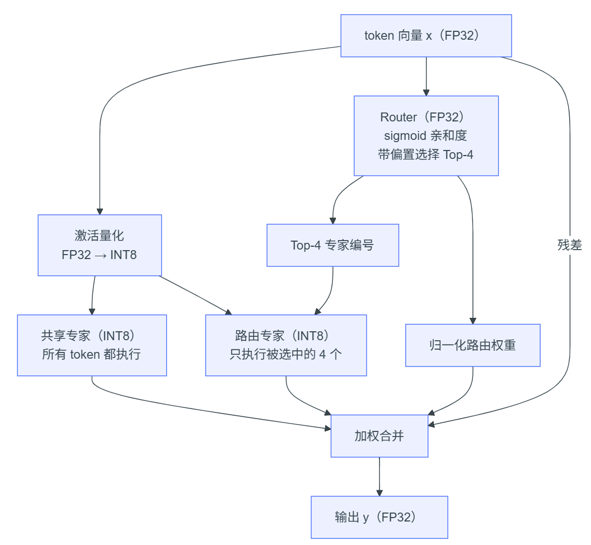
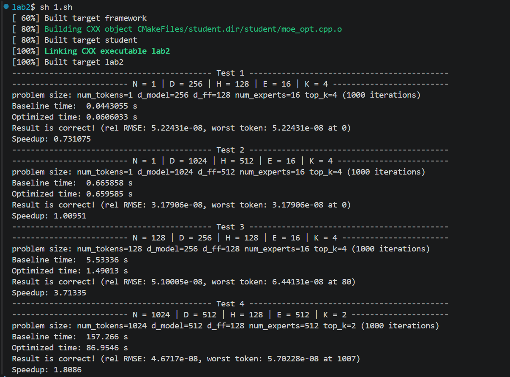
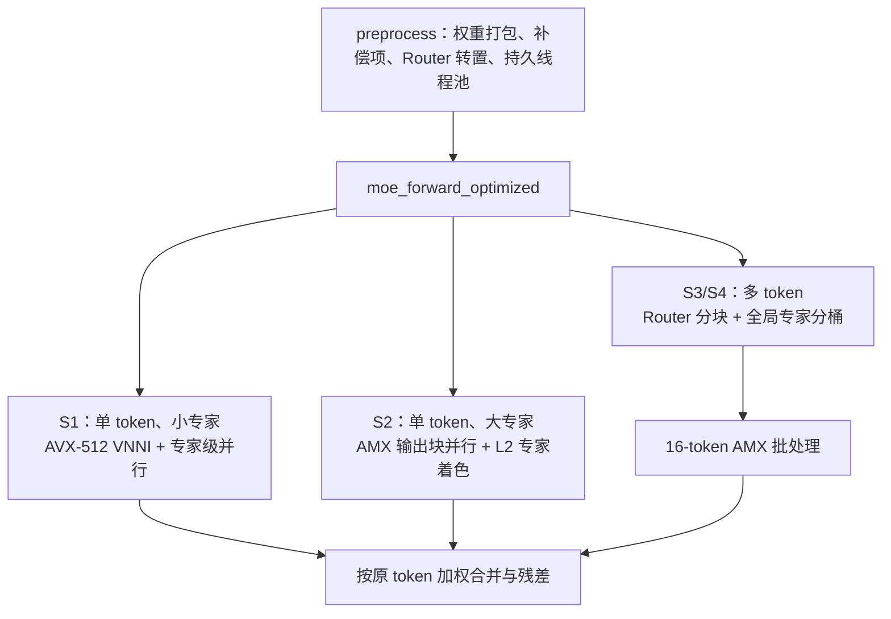
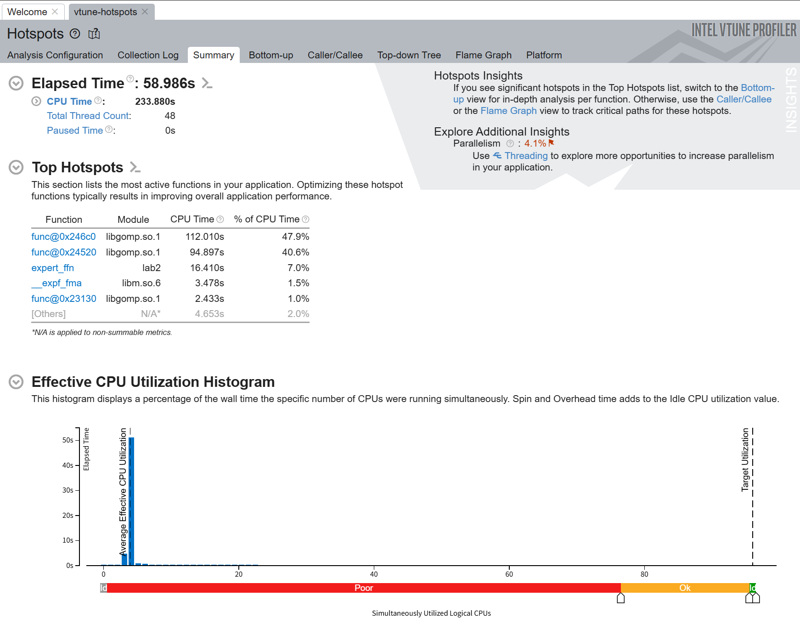

# Lab2: MoE 的向量化计算

[TOC]


## 环境配置

用`degit`拉取部分资源：

```bash
npx degit ZJUSCT/HPC101/src/lab2 lab2
```

连接集群：

```bash
ssh -p 443 h3240104505+test+hpc101@clusters.zju.edu.cn
```

运行方法：

```bash
cd src/lab2
cmake -B build
cmake --build build
./build/lab2 128 256 128 16 4      # N D H E K
./build/lab2 1 1024 512 16 4 2000  # 可选第 6 个参数指定迭代次数
./build/lab2 128 256 128 16 4 2000 --benchmark  # 测试模式，跳过 baseline 循环
```

我直接写成一整个脚本：

```bash
#!/bin/bash
cmake -B build
cmake --build build
echo "------------------------------------------- Test 1 -------------------------------------------"
echo "------------------------- N = 1 | D = 256 | H = 128 | E = 16 | K = 4 -------------------------"
./build/lab2 1 256 128 16 4
echo "------------------------------------------- Test 2 -------------------------------------------"
echo "------------------------- N = 1 | D = 1024 | H = 512 | E = 16 | K = 4 ------------------------"
./build/lab2 1 1024 512 16 4
echo "------------------------------------------- Test 3 -------------------------------------------"
echo "------------------------- N = 128 | D = 256 | H = 128 | E = 16 | K = 4 -----------------------"
./build/lab2 128 256 128 16 4      # N D H E K
echo "------------------------------------------- Test 4 -------------------------------------------"
echo "------------------------- N = 1024 | D = 512 | H = 128 | E = 512 | K = 2 ---------------------"
./build/lab2 1024 512 128 512 2 
```


## MoE过程笔记

首先明确一下数学推导的参数与代码中传入的参数的对应关系：

| 参数名 | 传入名        | 含义                                             |
| ------ | ------------- | ------------------------------------------------ |
| $N$    | `num_tokens`  | 输入的token数                                    |
| $D$    | `d_model`     | 每个token输入和输出的向量长度                    |
| $H$    | `d_ff`        | 每个expert内部的SwiGLU中间层长度                 |
| $E$    | `num_experts` | 路由的expert数量                                 |
| $K$    | `top_k`       | 每个token选择的路由expert数量（根据排名选$K$个） |

实验文档给的流程图：

<center></center>

单个token进行MoE的过程：


所以我感觉接下来的并行优化可以从以下的几个角度着手


## 多种方法的尝试

### token间并行（DLP）+OpenMP

首先对于`num_tokens>0`的情况，由于token间独立，所以可以考虑直接并行处理：

```c++
void moe_forward_optimized(const float* x, const MoEWeights& w, float* y,
                           int num_tokens) {
    if (num_tokens > 1){
      #pragma omp parallel for schedule(static)
      for (int t = 0; t < num_tokens; ++t) {
          const float* xt = x + (size_t)t * w.d_model;
          float* yt = y + (size_t)t * w.d_model;
          moe_forward(xt, w, yt, 1);
      } 
    } else{
      moe_forward(x, w, y, 1);
    }
}
```

此时可以达到接近于4的speedup：

```bash
lab2$ ./build/lab2 128 256 128 16 4
problem size: num_tokens=128 d_model=256 d_ff=128 num_experts=16 top_k=4 (1000 iterations)
Baseline time:  5.90171 s
Optimized time: 1.63443 s
Result is correct! (rel RMSE: 0, worst token: 0 at -1)
Speedup: 3.61086
```

如果应用OpenMP来做循环上的优化，在除了`top_k`和`num_experts`循环数的地方加上声明：

```c++
#pragma omp parallel for schedule(static)
```

可以用并行优化掉一些循环依赖，从而做到：

<center></center>

可以看出在`num_tokens=1`的场景下加速不明显甚至有负优化.

### 矩阵运算优化

我把这部分的优化放在了自己github仓库的`lab2` branch中.

实际上做的是，将所有输入的token看成是一整个矩阵，大小为$N\times D$，使用AMX这个矩阵扩展来处理矩阵运算：

```cpp
```


### 权重预处理优化


### 分场景优化

在前面已经将权重的预处理进行了优化，现在考虑对不同场景进行策略选择，我是用``作为区分的：

```cpp
```

这样

（Mermaid画的）




#### VTune分析

将S3指令的结果放进Intel VTune GUI中查看：

```bash
vtune -collect hotspots -result-dir vtune-hotspots --   ./build/lab2 128 256 128 16 4 2000 --benchmark
```


<center></center>
