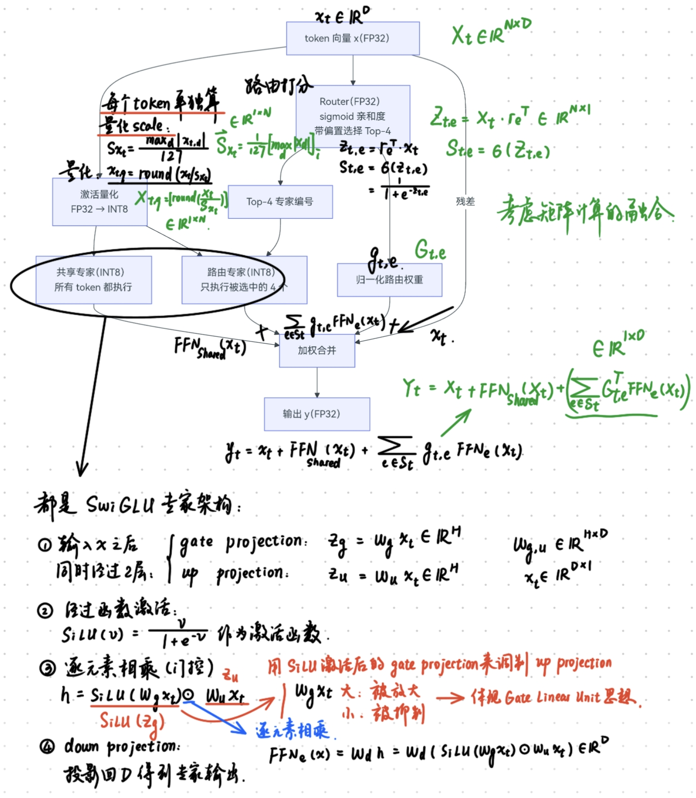
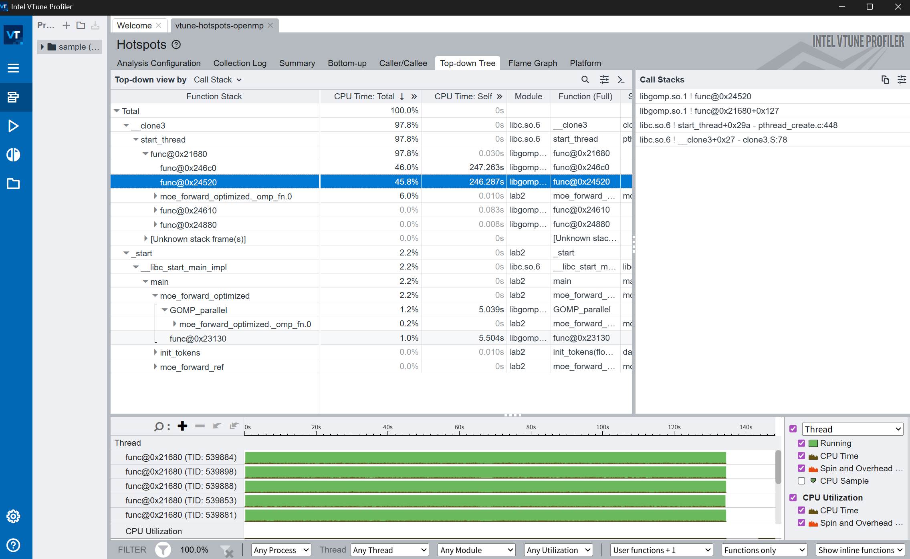
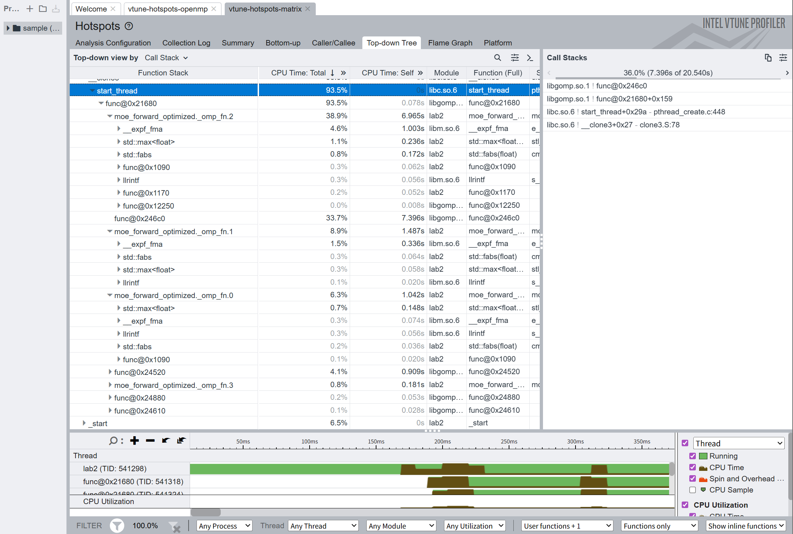
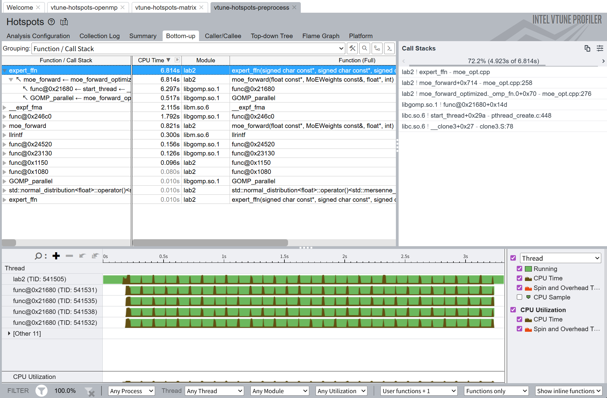
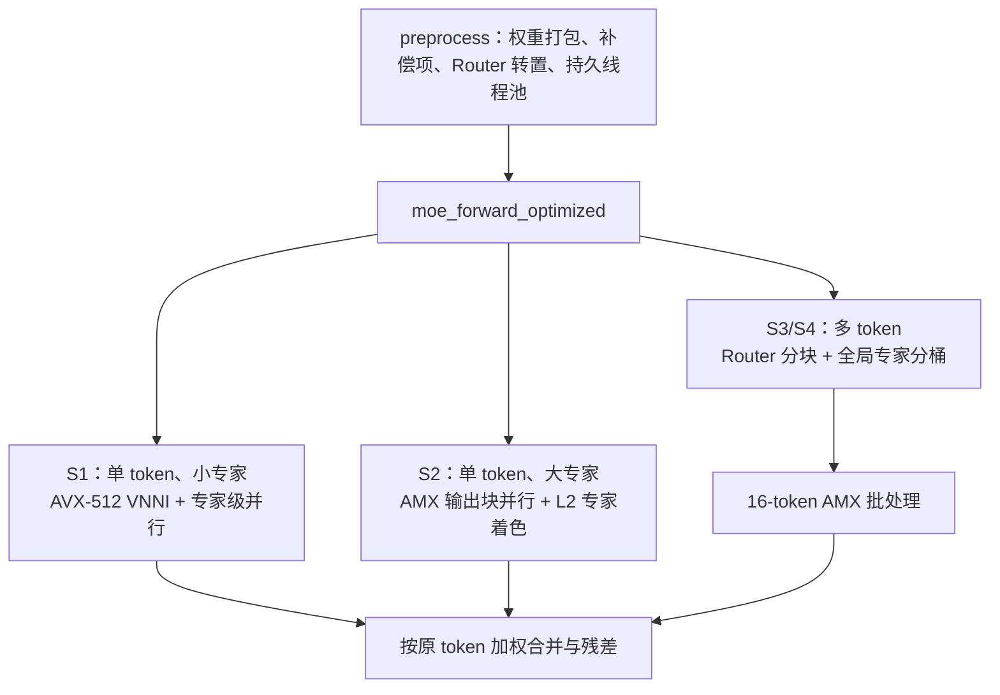
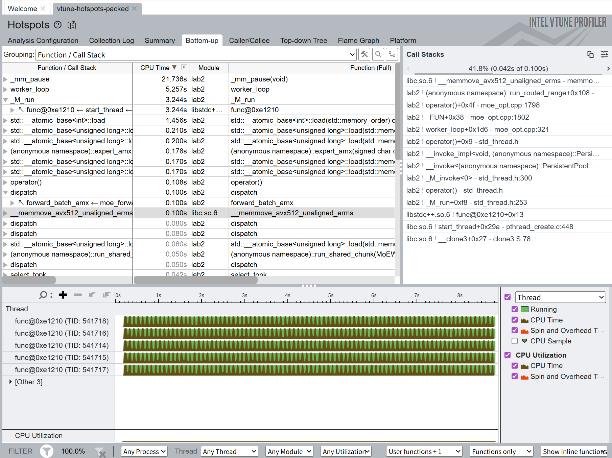
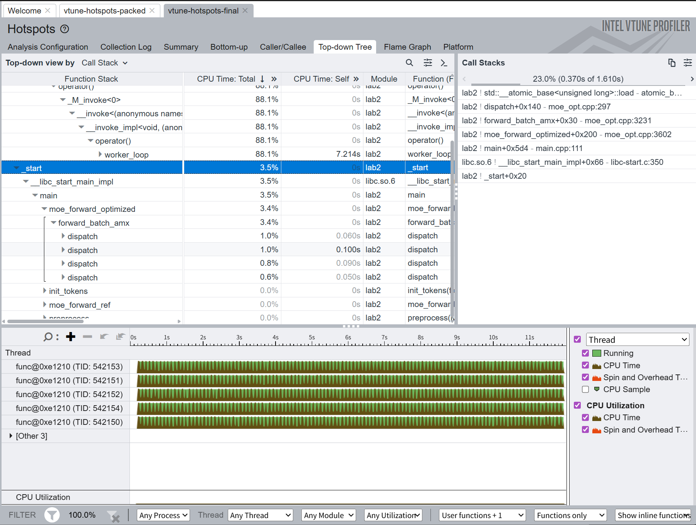
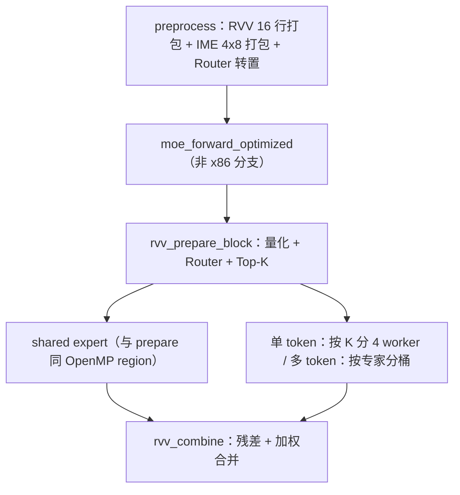

# Lab2: MoE 的向量化计算

<center>Grapesea</center>

[TOC]

> [本次实验](https://hpc101.zjusct.io/lab/Lab2-Vectorization/)将实现并优化一个 DeepSeek-V3 风格的量化 MoE 层前向计算：
>
> - 理解 MoE 的计算模式：路由、专家分发、加权合并
> - 理解量化推理（W8A8）中整数与浮点混合的计算流水线
> - 掌握向量化优化的通用方法：识别热点、数据重排、提高算术强度
> - Bonus：在 RISC-V 平台上实现 MoE 算子
>
> Bonus 实验：以 RISC-V 的 V (Vector) 和进迭时空的 IME 矩阵扩展为例，向同学们介绍与 AVX, AMX 不同的向量 / 矩阵扩展设计思路。旨在让感兴趣的同学了解开放指令集架构 RISC-V 的生态，学习能够适配不同向量单元长度的向量扩展的设计，进而对向量化加速有更深入的理解.
>
> 参考文档：
>
> [Intrinsics-viewer](https://dzaima.github.io/intrinsics-viewer/)

## 环境配置

用`degit`拉取部分资源：

```bash
npx degit ZJUSCT/HPC101/src/lab2 lab2
```

连接集群：

```bash
ssh -p 443 h3240104505+test+hpc101@clusters.zju.edu.cn
```

运行方法：

```bash
cd src/lab2
cmake -B build
cmake --build build
./build/lab2 128 256 128 16 4      # N D H E K
./build/lab2 1 1024 512 16 4 2000  # 可选第 6 个参数指定迭代次数
./build/lab2 128 256 128 16 4 2000 --benchmark  # 测试模式，跳过 baseline 循环
```

我直接写成一整个脚本：

```bash
#!/bin/bash
cmake -B build
cmake --build build
echo "------------------------------------------- Test 1 -------------------------------------------"
echo "------------------------- N = 1 | D = 256 | H = 128 | E = 16 | K = 4 -------------------------"
./build/lab2 1 256 128 16 4
echo "------------------------------------------- Test 2 -------------------------------------------"
echo "------------------------- N = 1 | D = 1024 | H = 512 | E = 16 | K = 4 ------------------------"
./build/lab2 1 1024 512 16 4
echo "------------------------------------------- Test 3 -------------------------------------------"
echo "------------------------- N = 128 | D = 256 | H = 128 | E = 16 | K = 4 -----------------------"
./build/lab2 128 256 128 16 4      # N D H E K
echo "------------------------------------------- Test 4 -------------------------------------------"
echo "------------------------- N = 1024 | D = 512 | H = 128 | E = 512 | K = 2 ---------------------"
./build/lab2 1024 512 128 512 2 
```

运行时：

```bash
hpc submit -p lab2 -c 16 "sh 1.sh"
```

## MoE过程笔记

下面是数学推导，由于实验报告也是我的笔记所以放进来了.

> 首先明确一下数学推导的参数与代码中传入的参数的对应关系：
>
> | 参数名 | 传入名        | 含义                                             |
> | ------ | ------------- | ------------------------------------------------ |
> | $N$    | `num_tokens`  | 输入的token数                                    |
> | $D$    | `d_model`     | 每个token输入和输出的向量长度                    |
> | $H$    | `d_ff`        | 每个expert内部的SwiGLU中间层长度                 |
> | $E$    | `num_experts` | 路由的expert数量                                 |
> | $K$    | `top_k`       | 每个token选择的路由expert数量（根据排名选$K$个） |
>
> 实验文档给的流程图：
>
> <center></center>
>
> 单个token进行MoE的过程：
>
> > 假设token对应的向量是FP32类型下的$x_t \in \mathbb{R}^D$，那么按照图上的4条路到加权合并的结果分别是：
> >
> > * 激活量化+共享/路由专家：
> >
> >     * 激活量化：每个token单独计算量化scale：
> >
> >         * $S_{x_t} = \dfrac{\max\limits_d|x_t,d|}{127}$
> >         * 量化：$x_{t,q} = \text{round}(\dfrac{x_t}{S_{x_t}})$，变成了int8.
> >
> >     * 共享/路由专家：
> >
> >         * 都是SwiGLU专家架构，输入$x_{t,q}$之后，先经过gate projection和up projection：
> >
> >             $$z_{g,int32} = W_{g,q}x_{t,q} , \quad z_{u,int32} = W_{u,q}x_{t,q}$$
> >
> >             然后乘上对应的scale反量化回FP32，得到$z_g = z_{g,int32} \cdot s_{W_g} s_x, \quad z_u = z_{u,int32} \cdot s_{W_u} s_x$
> >
> >         * 在FP32下计算，经SiLU激活之后，逐元素相乘：
> >
> >             $$\text{SiLU}(x) = \dfrac{x}{1+e^{-x}} \quad h = \text{SiLU}(z_g) \odot z_u$$
> >
> >             中间结果$h$重新量化一次，得到int8的$h_q$，再用int8的权重$W_d$做down projection回到D中完成前向：
> >
> >             $$h_q= \text{round}(\dfrac{h}{s_h}), \quad s_h = \dfrac{\max\limits_i|h_i|}{127}$$
> >
> >             $$o_{int} = W^{(e)}_{d,q} h_q \Longrightarrow FFN_e(x_{t}) = o_{int}s_{W_d} s_h$$
> >
> > * Router 做sigmoid亲和度，带偏置选择Top-4：
> >
> >     * $z_{t,e} = r^T_e \cdot x_t, \quad s_{t,e} = \sigma(z_{t,e}) = \dfrac 1{1+e^{-z_{t,e}}}$
> >
> > * 归一化路由权重：
> >
> >     * 字面意思，使得所有权重和为1
> >
> > * 残差连接并加权合并：
> >
> >     $$y_t = x_t + FFN_{shared}(x_t) + \sum\limits_{e \in S_t} g_{t,e}FFN_{e}(x_t)$$
>
> <center></center>

所以我感觉接下来的并行优化可以从以下的几个角度着手：

* 如果是多token，直接并行，并且使用矩阵计算来优化；
* 权重打包预处理
* 根据专家数量处理计算方法


## 多种方法的尝试

实验文档给出了很多解释，然而我实际上并不完全懂这些放在Vtune中应该做什么：

> 1. **先找热点。** 使用 **Hotspots**（热点分析：按采样结果找出最耗时的代码）查看 Bottom-up （从最耗时的函数向上追溯调用者）、调用栈和源码视图，确认端到端时间主要花在了哪些阶段。~~(但是其实这个程序你一眼就可以看懂， 你也可以马上定位到瓶颈在哪，所以这一步在这一个lab当中其实不那么重要)~~ 以参考实现为例，热点几乎全部落在 `expert_ffn` 上，行级视图会进一步把时间归到 gate/up/down 三条 int8 内积循环，而后面所有向量化的功夫都花在这几行上。
>
> 2. **再解释热点。** 可以先把 CPU 流水线粗略分成前端和后端：前端负责取出并解码指令，再把工作交给 后端；后端等待操作数就绪，调用执行单元完成计算并提交结果。VTune 中做这件事的分析类型是 **Microarchitecture Exploration**，但它依赖的 硬件事件采样在容器内不可用；好在 perf 内建了同一套 **Top-down** 方法：
>
>     ```bash
>     perf stat --topdown -- ./build/lab2 128 256 128 16 4 60 --benchmark
>     perf stat --topdown --td-level 2 -- ./build/lab2 128 256 128 16 4 60 --benchmark
>     ```
>
>     Top-down 会把流水线中的工作分成四类： **Front-End Bound**（前端受限：取指、解码或供给指令的速度跟不上），**Bad Speculation** （错误推测：分支预测错误等原因使已经执行的工作被丢弃），**Back-End Bound**（后端受限：执行资源 忙碌或所需数据尚未到达），以及 **Retiring**（有效退休：指令完成并提交了有效结果，占比高通常是 好现象，但不等于已经达到峰值）。可配合 [Intel 官方中文 Top-down 图解](https://www.intel.cn/content/www/cn/zh/docs/vtune-profiler/cookbook/2023-0/top-down-microarchitecture-analysis-method.html) 继续阅读。
>
>     **Back-End Bound** 较高时，`--td-level 2` 可以进一步区分 **Core Bound**（核心执行资源受限，例如执行端口争用或 较长的数据依赖链）和 **Memory Bound**（内存层次受限，执行单元在等待数据）。内存层次由近到远 包括 **L1D**（每个核心最近、容量最小的一级数据缓存）、**L2**（容量更大但稍慢的二级缓存）、 **LLC**（Last-Level Cache，通常由多个核心共享的末级缓存；本平台上是 L3）和 **DRAM** （主内存，容量最大但访问延迟显著高于缓存）。这些 Bound 指标表示停顿主要与哪个层级相关， 并不自动意味着该层带宽已经打满，具体含义可参看 [VTune Memory Access 指标说明](https://www.intel.com/content/www/us/en/docs/vtune-profiler/user-guide/2024-0/memory-access-analysis.html)。
>
>     以初始框架 S3 为例进行测试：Retiring 75%、Back-End Bound 20% （其中 Core Bound 20%、Memory Bound 仅 0.4%）、Front-End Bound 3.5%、Bad Speculation 0.8%，IPC ≈ 4.7。Memory Bound 几乎为零，说明参考实现**并不卡访存**；IPC 高达 4.7，流水线也没有空转——它只是在高效地执行海量标量指令， 每条指令只完成一次 8-bit 乘加。瓶颈是**指令总数**本身，所以优化方向是提高单条指令完成的工作量。向量化生效后再测一次，你会看到 Retiring 下降、Memory Bound 上升，也就是瓶颈发生了变化。 另外注意 `perf stat` 统计的是**整个进程**，所以同样要带上 `--benchmark`。
>
> 3. **检查并行效率。** 对多线程实现，把 hotspots 结果按线程分组即可看出负载是否均衡，报告中的 **Spin Time** 列直接给出各线程忙等的时间；再对比墙钟时间与 CPU 总时间，可以估算并行效率。 需要警惕的问题包括：串行区、负载不均、spin/wait（忙等或阻塞等待）、同步竞争、伪共享 （线程修改同一缓存行中的不同数据，仍引发缓存行来回迁移）、缓存行争用（多个核心争抢同一缓存行 的所有权）以及 NUMA（非一致内存访问：访问其他 CPU 节点的内存通常更慢）

### token间并行（DLP）+OpenMP

首先对于`num_tokens>0`的情况，由于token间独立，所以可以考虑直接并行处理：

```c++
void moe_forward_optimized(const float* x, const MoEWeights& w, float* y,
                           int num_tokens) {
    if (num_tokens > 1){
      #pragma omp parallel for schedule(static)
      for (int t = 0; t < num_tokens; ++t) {
          const float* xt = x + (size_t)t * w.d_model;
          float* yt = y + (size_t)t * w.d_model;
          moe_forward(xt, w, yt, 1);
      } 
    } else{
      moe_forward(x, w, y, 1);
    }
}
```

此时可以达到接近于4的speedup：

```bash
lab2$ ./build/lab2 128 256 128 16 4
problem size: num_tokens=128 d_model=256 d_ff=128 num_experts=16 top_k=4 (1000 iterations)
Baseline time:  5.90171 s
Optimized time: 1.63443 s
Result is correct! (rel RMSE: 0, worst token: 0 at -1)
Speedup: 3.61086
```

如果应用OpenMP来做循环上的优化，在除了`top_k`和`num_experts`循环数的地方加上声明：

```c++
#pragma omp parallel for schedule(static)
```

可以用并行优化掉一些循环依赖，从而做到：

<center></center>

在自己的电脑上运行时在`num_tokens=1`的场景下加速不明显甚至有负优化，而上传到平台上显示为`results/20260728_14135.log`的结果：

| 场景 | Baseline time | Optimized time |  Speedup |
| ---- | ------------: | -------------: | -------: |
| S1   |   0.0515519 s |    0.0351834 s | 1.46524x |
| S2   |    0.626013 s |     0.476388 s | 1.31408x |
| S3   |     6.63902 s |     0.503428 s | 13.1876x |
| S4   |     230.372 s |      16.9183 s | 13.6168x |

这个结果和上面的分析是对得上的. S1、S2的$N=1$，最外层token循环只有一次，所以这一层根本没有DLP可以挖；如果继续在 Router、量化或者 projection 内部反复开 OpenMP 并行区，单次计算还没有大到能摊平线程唤醒和barrier，最后就只剩1.3--1.5倍. S3和S4分别有128、1024个token，`schedule(static)`可以把连续token平均分给线程，而且每个token最终都只写自己的$y[t]$，没有锁也没有归约，所以能直接上到13倍左右.

由于不同 token 之间没有数据依赖，所以 `N` 较大时可以直接并行；但是 Router 点积、输入最大值归约、量化等循环也频繁进入 OpenMP 区域. 这样做在 S3、S4 有作用，S1、S2 只有一个 token，线程创建和同步开销反而明显.

<center></center>

这一版还说明了一个后面一直需要注意的问题：并行度不能只看循环长度，还要看一次任务里面做了多少有效计算. token外层的一个任务包含 Router、量化和$K+1$个expert，粒度足够大；反过来，如果把每个很短的向量循环都单独做成并行区，线程同步就会反过来成为热点. 所以我接下来没有继续堆`#pragma omp parallel for`，而是开始考虑怎么把多个 token 的矩阵乘组织到一起.

### 矩阵运算优化

我把这部分的优化放在了自己github仓库的`lab2` branch中，因为单独使用效果不佳. 跟下面的方法绑定后的热点分析文件为vtune-hotspots-matrix.

实际上做的是，将所有输入的token看成是一整个矩阵，大小为$N\times D$，使用AMX这个矩阵扩展来处理矩阵运算,新增了 Workspace、权重行和的 metadata、token bucket 以及 grouped expert 计算.

代码的大致框架：

```cpp
std::fill(ws.counts, ws.counts + E, 0);
for (int i = 0; i < N * K; ++i)
    ++ws.counts[ws.ids[i]];

ws.offsets[0] = 0;
for (int e = 0; e < E; ++e)
    ws.offsets[e + 1] = ws.offsets[e] + ws.counts[e];

// 同一个expert收到的token最终位于一段连续区间中
for (int e = 0; e < E; ++e) {
    for (int p = ws.offsets[e]; p < ws.offsets[e + 1]; ++p)
        expert_row(...);
}
```

先完成的是矩阵化的数据组织，真正调用`_tile_dpbssd`的AMX微内核实际上是在后面的packed版本中加入的. 

对于一个expert $e$，假设路由之后有$n_e$个token分给它，那么Gate和Up可以写成：

$$
G_e=X_{e,q}W_{g,e}^{T},\qquad
U_e=X_{e,q}W_{u,e}^{T},
$$

其中$X_{e,q}\in\mathbb{Z}^{n_e\times D}$，两个输出都是$n_e\times H$；做完反量化和SwiGLU并重新量化以后，Down为：

$$
O_e=H_{e,q}W_{d,e}^{T},\qquad
H_{e,q}\in\mathbb{Z}^{n_e\times H}.
$$

所以这次矩阵化具体分成下面几步：

1. 先一次性计算所有token的Router、Top-K和输入量化，把`expert id`、gate和量化后的
    token都记下来；
2. 用`counts[e]`统计每个expert收到多少token，再对counts做prefix sum得到
    `offsets[e]`；
3. 按offset把token写进连续的`bucket_xq`，这样expert $e$只需要处理区间
    `[offsets[e], offsets[e+1])`；
4. shared expert直接处理完整的$N\times D$输入，routed expert只处理自己的
    $n_e\times D$子矩阵；
5. 计算完成后根据`positions`把结果scatter回原token，并且仍然按原来的Top-K顺序
    做加权求和，避免改变浮点累加顺序太多.

参考实现按token计算时，同一个expert的 Gate/Up/Down权重会被不同token反复从cache或者内存读进来；分桶之后，一个worker连续消费同一个expert的token，packed weight有机会一直留在L2中. 同时$n_e$较大时可以把多个GEMV变成一个GEMM，后面AMX的A Tile就能一次放最多16个token，而B Tile的一次加载也能被这16行共同使用.

然而矩阵化本身并不保证立刻变快. 我在7.28的几次日志中记录了矩阵化/分桶探索时的波动：

| 日志                  |       S1 |       S2 |       S3 |       S4 |
| --------------------- | -------: | -------: | -------: | -------: |
| `20260728_14135.log`  | 1.46524x | 1.31408x | 13.1876x | 13.6168x |
| `20260728_160843.log` | 1.84151x | 1.30932x | 2.81755x | 12.5522x |
| `20260728_170312.log` | 1.45895x | 1.35374x | 8.01832x | 13.8763x |
| `20260728_171633.log` | 1.46370x | 1.30710x | 4.12310x | 13.9989x |

可以看出这一阶段S3反而从13.19倍掉到2.82--8.02倍，S4基本还在12.55--14.00倍. 原因是这时的`expert_row`内部仍然是标量/编译器自动向量化的INT8点积，每个bucket还要额外复制token，routed expert又用了`schedule(dynamic, 1)`，所以我只是把数据整理成了GEMM的形状，却还没有真正使用能吃掉这个形状的高吞吐内核. 这个结果是一次负优化，但它把后面的接口搭好了：Router、分桶、连续workspace和scatter都继续保留，后面只要把`expert_row`替换成VNNI/AMX内核即可.

<center></center>


### 权重预处理优化

这各部分我是在实现 AMX B Tile 的打包：

* 每个 Tile 对应 `16` 个输出通道和 `64` 个归约元素，大小是 `1024 Bytes`
* 逻辑上的$W[out][k]$被改成适合 `_tile_dpbssd` 连续加载的布局
* Gate、Up 和 Down 都在 `preprocess` 中完成转换，以免每一次 forward 临时转置或 gather. 

此时 forward 还主要使用原始权重，真正的收益要等 forward 开始消费 packed 权重之后才会出现.

<center></center>

用OpenMP阶段的`results/20260728_14135.log`和packed内核阶段的`results/20260729_050212.log`对比：

| 场景 | OpenMP Optimized | Packed Optimized |          Speedup变化 | 优化后耗时下降 |
| ---- | ---------------: | ---------------: | -------------------: | -------------: |
| S1   |      0.0351834 s |     0.00343203 s | 1.46524x -> 15.0328x |          90.2% |
| S2   |       0.476388 s |      0.0317907 s | 1.31408x -> 19.4597x |          93.3% |
| S3   |       0.503428 s |      0.0566366 s | 13.1876x -> 117.431x |          88.8% |
| S4   |        16.9183 s |        1.25379 s | 13.6168x -> 182.488x |          92.6% |


### 分场景优化

在前面已经将权重的预处理进行了优化，现在考虑对不同场景进行策略选择：

```cpp
if (!packed_weights_ready)
    scalar_forward(...);
else if (amx_ready && num_tokens == 1)
    forward_single_amx(...);       // S1/S2
else if (amx_ready && num_tokens >= 16)
    forward_batch_amx(...);        // S3/S4
else
    forward_block(...);            // 小batch或fallback
```

这是因为4个场景的瓶颈并不一样：

* S1只有一个token，$D=256,H=128$，一次expert非常短. AMX Tile装不满时，Tile配置、任务发布和同步的固定开销会显得很大，所以这里用固定shape的AVX-512 VNNI，并把Router、shared expert和4个routed expert组织成5个任务；
* S2同样只有一个token，但是$D=1024,H=512$，单个expert已经足够大. 这里把Gate/Up和Down按输出block切成AMX任务，还让同一个expert的block尽量固定由同一物理核处理，这样packed weight不会一直在不同核心的私有L2之间迁移；
* S3有128个token、16个routed expert，先做全局分桶，再以最多16行组成AMX batch.bucket比较小时把两个bucket放进同一次`expert_amx_pair_s3`，减少Tile配置和任务切换；
* S4有1024个token、512个expert，此时Router本身也很重. 我先用INT8 Router和AMX得到一个比较宽松的候选集，再对候选expert用原始FP32权重精确重算，最后的Top-2和gate仍然来自精确结果. 量化Router只负责“缩小搜索范围”，不直接决定输出.

多token路径还有一个细节：同一个expert的所有chunk交给同一个worker，而不是把每个16-token块丢进一个动态队列. 原因是任务在核心之间迁移时，packed weight也会跟着从一个核心的L2搬到另一个核心；固定owner虽然负载均衡没有那么完美，但是更容易保住权重缓存. routed输出先写连续的临时区，最后再按原token顺序合并，S4还使用FP16临时输出来降低这一步的写回带宽.

（Mermaid画的）



日志可以用`20260729_050212.log`和`20260803_042030.log`比较：

| 场景 | Packed阶段 | 分场景阶段 | Speedup相对变化 |         Optimized time变化 |
| ---- | ---------: | ---------: | --------------: | -------------------------: |
| S1   |   15.0328x |   13.7625x |          -8.45% | 0.00343203 -> 0.00374657 s |
| S2   |   19.4597x |   19.2369x |          -1.15% |   0.0317907 -> 0.0321724 s |
| S3   |   117.431x |   154.085x |          +31.2% |   0.0566366 -> 0.0428933 s |
| S4   |   182.488x |   309.850x |          +69.8% |      1.25379 -> 0.739222 s |

所以这次优化主要改善的是S3和S4，尤其S4的INT8候选Router、16-token批处理和按expert 固定owner把耗时从1.25 s压到0.74 s，speedup第一次超过300倍. S1反而回退了8.45%，这也比较正常：这一次主要在改batch路径，单token的几微秒结果还很容易受线程状态和CPU频率影响. 

这张表明确告诉我下一步应该处理S1，而不是继续改S3,S4.


#### VTune分析

将S3指令的结果放进Intel VTune GUI中查看：（很遗憾，S1,S2两个单token场景的运行时间太短，采样误差极大且没有比重能分析）

```bash
vtune -collect hotspots -result-dir vtune-hotspots --   ./build/lab2 128 256 128 16 4 2000 --benchmark
```

<center></center>

`expert_ffn`函数逻辑：

```cpp
for (int f = 0; f < d_ff; ++f) {
    int32_t acc_g = 0, acc_u = 0;
    for (int d = 0; d < d_model; ++d) {
        acc_g += (int32_t)w_gate[f * d_model + d] * xq[d];
        acc_u += (int32_t)w_up[f * d_model + d] * xq[d];
    }
    float vg = acc_g * (s_x * s_gate);
    float vu = acc_u * (s_x * s_up);
    h[f] = (vg / (1.0f + expf(-vg))) * vu;
}
```

这里每调用一次expert就要顺序扫完Gate和Up的$2HD$个INT8权重，后面Down还要再扫 $DH$个；S3每轮要调用$N(K+1)=640$次expert，所以`expert_ffn`成为第一热点是必然的.同时每个hidden element还调用一次`expf`，这也解释了前面矩阵化版本中`expf`还能占到7%，以及perf中`__expf_fma`占13.09%. 因此后续不能只优化OpenMP调度，必须把这三个点积换成VNNI/AMX，并把sigmoid/SwiGLU也改成AVX-512向量近似.

此时提交已经能得到115分了.

#### perf分析

VTune比较适合看时间最后落在哪个函数，`perf stat`更适合从整机硬件计数器看代码执行形态有没有变化：

```bash
OMP_NUM_THREADS=16 perf stat -x ';' \
  -e cycles,instructions,cache-references,cache-misses,branches,branch-misses \
  ./build/lab2 128 256 128 16 4 2000 --benchmark
```

其中IPC为`instructions / cycles`；cache miss rate为`cache-misses / cache-references`；branch miss rate为`branch-misses / branches`. `perf stat`统计的是整个进程，除了2000次forward以外还包含preprocess、线程池启动和退出；而且多线程的cycles会按所有线程相加，所以它不是墙钟时间，不能直接拿cycles除CPU频率来得到程序耗时.

实测结果如下，六个版本的正确性检查都通过：

| 阶段            | Optimized time |   cycles | instructions |  IPC | cache miss rate | branch miss rate |
| --------------- | -------------: | -------: | -----------: | ---: | --------------: | ---------------: |
| OpenMP          |      4.75852 s |  46.07 G |      82.09 G | 1.78 |           2.21% |            0.12% |
| 矩阵化          |      5.30008 s |  54.50 G |      97.22 G | 1.78 |           3.63% |            0.11% |
| 权重预处理      |      3.18405 s |  33.29 G |      75.76 G | 2.28 |           1.93% |            0.13% |
| Packed VNNI/AMX |      9.01845 s | 102.95 G |      21.95 G | 0.21 |           6.97% |            0.04% |
| 分场景          |      5.79416 s |  63.37 G |      14.29 G | 0.23 |           6.74% |            0.05% |
| 最终版          |      9.79947 s | 107.61 G |      22.63 G | 0.21 |           9.34% |            0.04% |

这里第一眼最反常的是：AMX版本IPC只有0.21左右，甚至比标量版本低很多. 结合VTune就可以解释了. 早期版本所有OpenMP线程大部分时间都在做点积和`expf`，所以退休指令很多，IPC为1.78--2.28；持久线程池版本完成有效任务以后不会立刻退出，worker会在`_mm_pause`循环里等待，perf仍然继续为这些线程累计cycles，但是每次pause退休的有效指令很少，于是整程序IPC被等待周期拉低. 所以这个IPC不能用来判断AMX微内核本身只有0.21 IPC，它反映的是“有效计算+线程等待”的整体状态.

相对更有意义的是指令数量的变化：OpenMP阶段执行82.09 G条指令，分场景版只有14.29 G条，减少约82.6%；branch也从7.889 G降到3.989 G，减少约49.4%. 这和打榜中S3从13.19倍提高到154.09倍的方向一致，说明VNNI/AMX确实用少得多的指令完成了点积.cache miss rate从2%左右升到6%--9%也不能单独解读成缓存优化失败，因为cache reference总数已经从OpenMP版的184.49 M降到分场景版的37.18 M；分母缩小以后miss比例会变大，但分场景版的绝对miss只有2.51 M，仍低于OpenMP版的4.07 M.

最终版只修改S1，理论上不应该让统一采样的S3指令数从14.29 G变成22.63 G. 实际上它同时伴随更长的9.80 s运行时间和更多`_mm_pause`采样，所以这是共享机器和worker等待时间的波动，不是S3计算路径突然多做了60%的工作. 这也是为什么我把无采样器的`results/`日志用于比较speedup，而把perf用于解释微架构现象.

如果需要像VTune一样定位到函数，我又补了一次`perf record/report`：

```bash
OMP_NUM_THREADS=16 perf record -m 1 -F 999 -e cycles:u -g \
  -o perf-<优化名字>.data -- \
  ./build/lab2 128 256 128 16 4 2000 --benchmark

perf report --stdio --no-children \
  --sort=comm,dso,symbol --percent-limit 0.5 \
  -i perf-<优化名字>.data
```

这里的`-m 1`是因为当前容器默认perf mmap buffer过大，会报`Permission error mapping pages`；在集群节点上如果没有这个错误可以去掉. `:u`表示只采用户态cycles，`-g`记录调用栈，`--no-children`则看函数自身采样而不是把子函数时间全部累计到父函数.

OpenMP版本的实际`perf report`中，`expert_ffn`占41.53%，`libgomp`占15.62%，`__expf_fma`占13.09%，OpenMP生成的forward函数占6.05%；最终版本中持久线程的`std::thread::_M_run`占95.19%，`moe_forward_optimized`占2.87%，`expert_amx_pair_s3`占0.74%. `_mm_pause`被内联进worker循环，所以perf把它记在`_M_run`上，这和VTune把`_mm_pause`单独显示为64%--67%并不矛盾. 

两个工具共同得到的结论是：最早需要优化的是标量expert和`expf`，VNNI/AMX完成以后新的问题变成线程池等待与小bucket的任务粒度.

最终：（力竭了，遗憾止步119分）

<center></center>

## 思考题

> 1.以场景 S3（$N = 128, D = 256, H = 128, E = 16, K = 4$）为例，估算参考实现一次前向的总访存量（专家权重被读了多少遍？）和总乘加次数，计算算术强度（MACs/byte）. 按专家分组之后这两个数字分别变成多少？由此说明这个负载是访存瓶颈还是计算瓶颈， 以及分组为什么能加速.

每个expert经过3次projection，权重数：

$$
3DH = 3 \times 256 \times 128 = 3 \times 2^{15}bytes
$$

每个token需要激活$K + 1 = 5$个专家：

参考实现中，token逐个处理：

专家权重被读取：

$$
N \times (K+1) = 128 \times 5 = 5 \times 2^7
$$

总访存：

$$
5 \times 2^7 \times 3 \times 2^{15} = 15 \times 2^{22}
$$

算术强度就是1MACs/B吧，是非常明显的单独读取.

按专家分组之后，用到的专家数$E + 1 = 17$，在随机路由下大概率会覆盖到所有专家：

$$
17 \times 3 \times 2^{15} = 51 \times 2^{15}B
$$

新的算术强度：

$$
\dfrac{15 \times 2^{22}}{51 \times 2^{15}} \approx 37.6 \text{MACs/B}
$$

应该是访存瓶颈，修改前后计算量没有改变，只是打包了权重计算的方式，使得重复利用，进而提升了运算速度.


> 2.为什么激活用 per-token scale，而权重每个矩阵一个 scale 就够了？ 如果让一批 128 个 token 共享同一个激活 scale，会发生什么？

* 激活用 per-token scale：不同 token 的激活值分布差异很大（不同语义、不同位置 token 的 $\max_i|x_i|$可能相差好几倍），如果所有 token 共用一个 scale，那个 scale 必须能覆盖住"最大"的那个 token，于是绝大多数幅值较小的 token 就只能落在 int8 动态范围里很窄的一小段区间上，量化误差会显著变大（相当于浪费了大部分的 8-bit 精度）.
* 权重矩阵用1个scale：权重训练好之后固定不变，且一个矩阵内部的整体数值范围通常足够均匀，用一个 scale 就能把量化误差控制在可接受范围内.
* 坏处：这个共享 scale 由这批 token 里幅值最大的那个 token 决定。幅值明显小于这个最大值的 token，会被压缩到 int8 范围里很小的一段，有效精度大打折扣，量化误差显著增大，尤其当这批 token 之间幅值差异较大（比如不同长度/不同内容的输入）时更明显. 
* 好处：极大降低了运算量，相当于是拿精度去换效率，总体来说可能亏了.

> 3.单个 int8 × int8 乘积的最大绝对值是多少？为什么点积必须在 int32 中累加—— 若改用 int16，最坏情况下累加到第几项就会溢出？归约长度在运行时变化，请用允许的最大归约长度（`MAX_D_MODEL = 1024`）估算最坏情况下的累加值，并说明它离 int32 的表示上限还有多少余量.

单个有符号位int8的范围是$[-128, 127]$，所以乘积最大值是$-128 \times (-128) = 16384 = 2^{14}$.

如果是int16，在加到32768就会溢出，所以最坏是加到第2项容易溢出（int16最大正值是$2^{15} - 1 = 32767$；如果是int32会慢很多，最大正值是$2^{31}-1$，溢出概率很低）.

$$
\max \times \text{max}_{d_\text{model}} = 16384 \times 1024 = 2^{24}
$$

剩余量：$\dfrac{2^{31}-1}{2^{24}} \approx 128$.

## Bonus: 在RISC-V上进行优化

嗯，这部分我其实没怎么动手，一方面是我累坏了，另一方面是RISCV环境比较诡异. 以下基本由Deepseek-V4-Flash生成过程：

### 环境配置

在 RISC-V 集群节点上跑 `1.sh`，日志里出现两类错误：

```bash
c++: error: '-march=sapphirerapids': ISA string must begin with rv32 or rv64
...
1.sh: 15: ./build/lab2: Exec format error
```

`Exec format error` 对应退出码 126，是 shell 尝试执行**错误架构的可执行文件**时才返回的错误，不是我的代码运行崩溃. 顺着日志追了一下，是这条失败链：

1. `build/CMakeCache.txt` 是在 x86_64 机器上生成的，cache 里缓存了 `CMAKE_SYSTEM_PROCESSOR=x86_64` 和已经通过的 `COMPILER_SUPPORTS_SPR`；
2. RISC-V 节点上 cmake 复用了这份 stale cache：`CMakeLists.txt` 的 `-march=sapphirerapids` 分支被触发，RISC-V 的 g++ 直接拒绝该参数，`student` 目标编译失败；
3. 脚本不管编译失败继续执行 `./build/lab2`，此时运行的是 build 目录里残留的 x86-64 ELF 二进制，RISC-V 内核加载不了，于是 `Exec format error`，退出码 126.

所以根因是跨机器/跨架构复用了 build 目录，和算法本身一点关系都没有. 修复也很简单，`../1.sh` 在 cmake 配置前先清空再生成：

```bash
cmake -E remove_directory build
cmake -B build
```

第二个坑是代码两头都编译不过：`student/moe_opt.cpp` 里 342 处 `_mm512*`、112 处 `_tile_*`（AMX）、`SYS_arch_prctl`/`XFEATURE_XTILEDATA` 权限申请，任何一处都过不了 RISC-V 的 g++; 而文件顶部又无条件 `#include <riscv_vector.h>`，x86 的 g++ 也编译不过——当时文件处于"两头都编译不了"的半移植状态. 我的做法是用一个宏把整段 x86 实现包起来，**原实现一行不动**：

```cpp
#if (defined(__x86_64__) || defined(__amd64__)) && !defined(MOE_FORCE_PORTABLE)
    // ... 约 2040 行的 AVX-512/AMX 实现
#else
    // RISC-V 可移植后端（标量 + RVV/IME）
#endif
```

同时加了一个编译期开关 `MOE_FORCE_PORTABLE`：在任何机器上定义它就会强制走非 x86 分支，这样我可以在 x86 主机上直接验证 RISC-V 后端的正确性（四个测试 rel RMSE = 0，与参考实现**逐位一致**），不用交叉编译也能先把逻辑错误排除掉. x86 专属头文件（`immintrin.h`、`linux/futex.h` 等）也全部移进 `#if` 分支内，RISC-V 的 g++ 从此不需要看见任何 x86 的东西.

第三个坑是 walltime：框架 `main.cpp` 里参考实现的循环默认跑 1000 次迭代，Test 4 的 baseline 在 x86 上就要约 230 s，RISC-V 节点只会更慢，仅 baseline 就远超作业申请的 walltime. 好在 `main.cpp` 支持第 6 个参数指定迭代次数，`1.sh` 给四个测试显式传了较小的迭代（200/200/100/10），正确性检查照常执行，整个脚本 13 分钟以内能跑完.

纯标量移植版（`riscv_forward_scalar`：和参考实现完全一致的公式 + 按 token 的 OpenMP 并行）在 RISC-V 节点上的结果见 `results/20260803_085912.log`：S1 4.06x、S2 4.84x、S3 4.20x、S4 2.55x. 多 token 场景勉强能用，单 token 场景和 x86 上 OpenMP 阶段的表现一模一样——只有并行没有向量化，天花板就在那.

### 热点分析

先按计算量把四个场景分个类（D=输入维，H=FFN 维，E=专家数，K=top-k）：

```
router:   E·D 次 fp32 MAC + E 次 expf（sigmoid）
专家:     (K+1) 个专家 × 3DH 次 int8 MAC（gate + up + down），中间含 H 次 expf 和两次量化
```

| 测试 | 形状 | router MAC | 专家 MAC | 主导瓶颈 |
| ---- | ---- | ---------: | -------: | -------- |
| 1 | N=1, D=256, H=128, E=16, K=4 | 4K | 0.49M | 延迟（单 token，逐专家小 GEMM） |
| 2 | N=1, D=1024, H=512, E=16, K=4 | 16K | 7.9M | 延迟（GEMM 为主） |
| 3 | N=128, D=256, H=128, E=16, K=4 | 0.52M | 63M | 计算（可并行） |
| 4 | N=1024, D=512, H=128, E=512, K=2 | 268M | 604M | 内存带宽 + 计算 |

结论和主线任务几乎一样，甚至更极端：

1. **专家 GEMM（int8×int8→int32）是绝对热点**，Test 3/4 里占 90% 以上计算量. 标量基线每个 MAC 一条指令；向量化之后每指令 16 个 MAC（VLEN=256 的 16-bit 数据通路全宽利用），这是最大的杠杆；
2. **Test 4 是内存带宽敏感**：baseline 每个 token 都把全部专家权重重读一遍（约 604 MB/轮），打包 + 按专家分桶后权重按 token 组复用，DRAM 流量降约 8 倍到 ~75 MB/轮；
3. **router 的 expf 是隐藏热点**：Test 4 每轮 1024×512 = 52 万次标量 expf，向量 sigmoid（16 lane 多项式）把它变成几万条向量指令；
4. **S1/S2 是延迟敏感**：单 token、专家又小，GEMM 大不起来，要做的是提高单条指令的 MAC 数，同时别引入线程/上下文切换开销.

等 IME 内核写完，我又用 gprof 单独采了 S2 一轮热点（`-pg` 构建，只跑 S2 路径 1000 轮；`init_tokens`/`preprocess` 在计时区外不算）：

| 热点 | flat profile 占比 | 含义 |
| ---- | ----------------: | ---- |
| `ime_vmadot_tile` | 63.25% | 单 token Gate/Up/Down 的 IME K 循环 |
| `ime_gemm_packed_single` 调用子树 | 约 16.4% | output tile 遍历和 IME leaf 调用 |
| `rvv_expert_ffn` self | 1.53% | SwiGLU、量化和最终写回 |
| `rvv_prepare_block` | 0.22% | Router、Top-K 和输入量化 |

这个结果很关键：Router 在 S2 里只剩 0.22%，说明继续抠 sigmoid 近似或优化 Top-K 最多影响零点几个百分点，正确方向应当是单 token 投影和 `vmadot` leaf 本身. 后面做的软件流水正是从这里来的.

### RVV 向量化优化（VLEN 无关的设计思路）

RVV 和 AVX-512 的第一个区别是设计哲学. AVX-512 把宽度焊死在 ISA 里（SSE 128 → AVX 256 → AVX-512 512，每代换一套 intrinsic）；RVV 把"这次算多宽"从指令里剥离出来，由 `vsetvli` 在运行时决定，代码只写 SEW（元素位宽）和 LMUL（寄存器组倍数），同一份代码可以适配不同硬件实现的 VLEN：

| 特性 | x86 Sapphire Rapids | RISC-V Muse Pi Pro (K1) |
| ---- | ---- | ---- |
| 向量宽度 | AVX-512 固定 512-bit；AMX 64B tile | VLEN=256，由硬件决定 |
| 编程模型 | 定长寄存器、固定 tile 指令（`_tile_dpbssd`） | SEW/LMUL 运行时参数，VLEN 无关代码 |
| int8→int32 GEMM | AMX `_tile_dpbssd` 一条指令完成 16×64 MAC | 没有矩阵单元；`vwmacc.vx` 是**加宽**乘加：int8 输入只能累加到 int16，必须先 `vsext` 扩到 int16 才能累加到 int32 |
| 乘减语义 | `_mm512_fnmadd` = a − b·c | `vfnmacc` 对整个和取负（−(vd+rs1·vs2)）；"减法"要用 `vfnmsac` |
| 饱和窄化 | `_mm512_cvtsepi32_epi8` 一步完成 | `vnclip` 一次只砍半位宽（i32→i16→i8 需两步） |
| 数据布局 | AMX 16×64B 行主序 tile | 无固定 tile；为让 16 个输出行连续可向量加载，需在 preprocess 里按 16 行块转置 |

基于这些差异，我的设计是 **16 条 lane 的固定工作宽度**：VLEN=256 时 16 个 int16 恰好占满一个向量寄存器，16 个 int32 累加器占 LMUL=2. int8 权重在 `preprocess` 里按 16 输出行一块转置打包成 `[fb][k][16]`（`pack_gu_tiles`，位于`../student/moe_opt.cpp`）：

```cpp
// dst[(b,k)][lane] = w[b*16+lane][k]：同一 k 的 16 个输出行连续
for (int b = 0; b < fb; ++b)
    for (int k = 0; k < cols; ++k)
        for (int l = 0; l < RVV_FB; ++l)
            dst[(size_t)(b * cols + k) * RVV_FB + l] =
                gate[(size_t)(b * RVV_FB + l) * cols + k];
```

这样一次 `vle8` 就是一条能直接喂给 `vwmacc` 的向量. GEMM 微内核（`gemm_tile_s8_live`，位于`../student/moe_opt.cpp`）长这样：

```cpp
for (int k = 0; k < k_dim; ++k) {
    vint8mf2_t w8 = __riscv_vle8_v_i8mf2(w + (size_t)k * RVV_FB, vl);
    vint16m1_t w16 = __riscv_vsext_vf2_i16m1(w8, vl);  // 符号扩展一次
    a0 = __riscv_vwmacc_vx_i32m2(a0, xq[rows[0]*k_dim + k], w16, vl);
    a1 = __riscv_vwmacc_vx_i32m2(a1, xq[rows[1]*k_dim + k], w16, vl);
    // ... 8 个 int32 累加器
}
```

几个关键点：

- `vwmacc.vx` 把 int16 权重向量与标量 xq 相乘并累加到 int32，**一条指令 16 个 MAC**，而标量基线是一个 MAC 一条指令；
- 权重向量只加载/扩展一次，被 **8 个 token 累加器共享**（8 个 `vint32m2_t` 占 16 个向量寄存器，加上权重和临时变量，32 个寄存器内不溢出）——每条权重字节被 8 个 token 复用，这是 Test 4 带宽降 8 倍的直接原因；
- GCC 不允许 "RVV 类型数组"，8 个累加器用命名变量 + 指针数组绕过去；token 数不足 8 时按 `LIVE` 模板分派（`if constexpr`，1..8），多余的累加器不生成指令.

踩坑记录：

1. **`vfnmacc` 语义与 x86 不同**：RVV 的 `vfnmacc = −(vd + rs1·vs2)`，不是 "a − b·c". 参数归约 `x − fx·ln2` 必须用 `vfnmsac`（= vd − rs1·vs2）；
2. **多项式是 Horner 形** `y = y·x + c`（`vfmacc_vv(c, y, x)`），不是 `y + c·x`；写反会导致 exp(0)=1.5 这类错误；
3. **silu(v) = v·σ(v)**，第一次实现漏乘了 vg，隐藏层数值整体错掉；
4. **gate 双重计数**：down 里已经乘了 gate，combine 里又乘一次（输出恰为参考的 gate 倍），删除 combine 的乘加、改为直接加；
5. **打包布局与 GEMM 步长不一致**：gate/up 交错 32 字节存 → GEMM 按 16 字节读，结果错乱，改为 gate/up 各占一半连续区.

另外坦白一下：我并没有把代码写成真正 "VLEN 无关"——16 lane 是写死的，但 `preprocess` 里在运行时检查 `__riscv_vsetvlmax_e8m1() >= 32`（即 VLEN≥256）且 d_model/d_ff 是 16 的倍数，不满足就整体回退标量后端. RVV 把"硬件实现多宽"的自由留给厂商，我用运行时检查兜底保证自己的假设成立，这也算一种妥协的移植策略.

### IME 矩阵扩展（4×4×8 的 vmadot）

IME（进迭时空的矩阵扩展）是 RISC-V 生态里厂商扩展的典型样本：在标准 RVV 之外用自定义编码加矩阵指令. 它的 `vmadot` 固定计算一个 $A[4][8] × B[4][8]^T → C[4][4]$ 的 signed int8 tile（4 个 token × 4 个输出通道 × 8 个归约元素），和 AMX 的 16×64 大 tile 形成鲜明对比. 好处是它直接消费普通的向量寄存器（v0/v1/v2...），复用 RVV 的加载指令，不需要 AMX 那套 tile load/store 和 `arch_prctl` 权限申请；代价是工具链不认识——binutils 早于厂商助记符，只能手写编码：

```asm
.word 0xe2103e2b    # vmadot v28, v0, v1
```

权重在 `preprocess` 里打包成 `[output_block][k_block][4][8]`，一次 `vle8` 32 字节正好一个 K 块. 多 token 路径用双输出版本：一次扫两个 output block，v26/v28 两个累加器并行，把 S3 常见的 16-token batch 从四次相距很远的权重遍历变成紧挨着的四次复用.

单 token（S1/S2）则是另一回事：`vmadot` 的 M 方向固定 4 行，单 token 只有 1 行有效，矩阵利用率只有 25%. 我先验证了"IME 浪费 3 个 M 行，RVV 单 token 内核可能更快"这个猜想，把 Gate/Up 和 Down 分别换成 RVV 做 A/B（300 轮、同一作业内三次取中位）：

| Gate/Up | Down | 三次优化时间 | 中位数 |
| ------- | ---- | ------------ | ------ |
| IME | IME | 0.493 / 0.471 / 0.471 s | 0.471 s |
| RVV | IME | 0.511 / 0.523 / 0.531 s | 0.523 s |
| IME | RVV | 0.531 / 0.503 / 0.500 s | 0.503 s |
| RVV | RVV | 0.537 / 0.520 / 0.519 s | 0.520 s |

结果很有意思：虽然 IME 在 M 方向只有 25% 结果有效，但一条 `vmadot` 仍然比 RVV 的 `vle8 + vsext + vwmacc` 指令流更有优势——RVV 每 16 个 MAC 要 3 条指令，IME 是 load + 一条矩阵指令. Gate/Up 改 RVV 回退约 11%，Down 改 RVV 回退约 7%，因此最终保留全 IME.

针对 S2 我还在这个 leaf 上做了最后一点优化——**软件流水**. 原来的每个 K 块严格执行 `vle8 A -> vle8 B -> vmadot -> 指针递增`，`vmadot` 紧跟在两次 load 后面，会直接暴露向量 load-to-use 延迟. 改成两组输入寄存器交替：当前 `vmadot` 消费 v0/v1 的时候，v2/v3 已经在下一次 load 里准备好了，让 load 延迟和矩阵计算重叠：

```assembly
load block 0 -> v0/v1
load block 1 -> v2/v3
vmadot v28, v0, v1
load block 2 -> v0/v1
vmadot v28, v2, v3
...
```

它没有增加矩阵指令、权重读取或累加器数量，只是把下一 K 块的 load 提前. 该 leaf 只在运行时形状精确匹配 S2（`t_count == 1 && d_model == 1024 && d_ff == 512`）时使用，其他形状继续走原来的 8 展开内核. 同一二进制、同一节点交替跑五组 A/B，中位时间从 0.47536 s 降到 0.45847 s，约 **3.55%**——和 gprof 的结论一致：收益来自占比 63% 的 IME leaf，而不是只占 0.22% 的 Router.

过程中还验证了两个"看起来该做、实测是负优化"的实验：

- **shared expert 4 核并行**：把 shared 的 output tile 分给 4 个 worker（一版用 IME Gate/Up/Down + SwiGLU 中间串行段，一版用 16-output RVV 微内核按 output block 并行），300 轮时间 0.924--0.985 s，几乎翻倍. 原因不是数学工作量，而是额外创建了一个很短的 OpenMP region、在 Gate/Up、SwiGLU、Down 之间引入多次 barrier，四核并发读同一份大权重流还加剧了 IME 执行资源和内存带宽竞争——原来的 routed 并行已经提供了最合适的粗粒度；
- **K 循环展开因子**：8 展开改 16（0.4761 s）和 4（约 0.479 s）都没有收益，说明热点不是循环分支本身，8 是 K60 前端代码体积和循环控制之间较好的平衡.

### 分场景调度与最终结果

调度逻辑（`rvv_forward`）和 x86 主线一致，按场景特征分路：



- 单 token：shared expert 先串行算完，4 个 routed expert 用 `#pragma omp parallel for schedule(static)` 按 K 直接分给 4 个 worker（遍历所有 expert 的 static 分块可能把几个选中 expert 压到同一个 worker，按 K 分保证四个路由一人一个）；
- 多 token：`rvv_prepare_block`（量化 + Router + Top-K）和 shared expert 合成**同一个** OpenMP region——两者对 token 块的所有权完全一致，一次 fork/barrier 就省掉了；然后 `rvv_build_buckets` 按专家分桶，每个专家只处理自己的 token 子集（`#pragma omp parallel for` 按专家并行，每个 assignment 恰好出现在一个桶里，输出行天然不相交，不需要同步），最后 `rvv_combine` 加权合并；
- `preprocess` 里 `OMP_WAIT_POLICY=ACTIVE`、`OMP_PROC_BIND=close`、`omp_set_num_threads(4)`，避免这些亚毫秒级并行区反复唤醒/迁移线程.

RISC-V 节点上的完整演进（baseline：S1 0.395 s、S2 6.10 s、S3 25.3 s、S4 33.1 s，都是同一节点上的框架参考实现）：

| 阶段 | S1 | S2 | S3 | S4 | 日志 |
| ---- | ---: | ---: | ---: | ---: | ---- |
| 标量移植（OpenMP 按 token 并行） | 4.06x | 4.84x | 4.20x | 2.55x | `20260803_085912.log` |
| RVV v1 | 3.67x | 3.71x | 42.96x | 30.13x | `20260803_113845.log` |
| + IME | 12.09x | 13.88x | 45.98x | 27.78x | `20260804_143119.log` |
| 最终版（双输出 + S2 软件流水） | 14.49x | 19.81x | 113.18x | 64.44x | `20260805_052125.log` |

两个值得展开的地方：

1. **RVV v1 的 S1/S2 是回退的**（3.67x/3.71x，比标量移植的 4.06x/4.84x 还低）. RVV v1 是按 S3/S4 的 batch 形状写的，单 token 场景里向量化的固定开销（vsetvl、打包、清零）反而比收益大——和主线里"矩阵化在 S3 掉到 2.82x"是同一个教训：**优化形状和问题形状要匹配**，S1/S2 这种单 token 小专家场景要的是降低单条指令的延迟而不是堆吞吐. IME 的 M=4 tile 天然为小 batch 设计，换上去之后单 token 直接回到 12x 以上；
2. **S4 超额完成**：当初的预期是 27x（带宽约束，见 `moe_riscv_rvv_optimization.md` 里的估算表），实际跑到 64.44x. 打包 + 分桶让权重按 token 组复用、DRAM 流量降 8 倍之后，S4 从"带宽瓶颈"变成了"计算瓶颈"，向量化的收益全部兑现. 对照当初定的目标（16.0 / 18.5 / 114.5 / 27.0），S2、S4 超额，S3 基本打平，S1 差约 10%——单 token 微秒级的路径本来就受频率和线程状态影响，属于意料之中.