# Lab 3: GDN Prefill前向优化

<center>Grapesea</center>

[TOC]

> [LLM推理优化基础知识](https://blogs.erix025.me/EfficientAI/sct-llm-talk/sct-llm-talk/)  [从零开始的 GDN 推导 - Eric025's Blog](https://blogs.erix025.me/EfficientAI/GDN_from_scratch/)
>
> 涉及论文：
>
> * [[2412.06464] Gated Delta Networks: Improving Mamba2 with Delta Rule](https://arxiv.org/abs/2412.06464)
> * [[2406.06484] Parallelizing Linear Transformers with the Delta Rule over Sequence Length](https://arxiv.org/abs/2406.06484)
> * [[2312.06635] Gated Linear Attention Transformers with Hardware-Efficient Training](https://arxiv.org/abs/2312.06635)
>
> [TileLang Documentation](https://tilelang.com/)
>
> [Nsight Compute Documentation — NsightCompute 13.3 documentation](https://archive.docs.nvidia.com/nsight-compute/2026.2/)
>
> [Python Profiling: NVIDIA Nsight Tools Feature Spotlight](https://www.youtube.com/watch?v=aQ1NYoRvp7o)
>
> [User Guide — Nsight Systems](https://docs.nvidia.com/nsight-systems/UserGuide/index.html#profiling-from-the-gui)性能评测包含两种计时区间：
>
> - **forward 端到端时间**：从 `raw_g` 开始，包含 `g_cumsum`、$A$、$U$、$W$、$S$ 和 $O$ 的全部计算，以及中间结果读写和 kernel launch 的开销。**这部分时间仅供参考与其他实现对比，最终评分不以此为准**。
> - **核心计算时间**：只统计学生函数内 $U$、$W$、$S$ 和 $O$ 的计算，不包括 `g_cumsum` 和 的预处理。学生函数内的张量分配、数据转换和 kernel launch 均包含在内。 **这部分时间将作为最终评分的主要依据**。
>
> 正确性评测和性能评测都会在多组不同的输入 shape 下进行。最终的性能分数是各组 shape 的加权平均。
>
> FlashQLA 将作为本实验的主要性能基线，同时也会给出 FLA 和 FlashInfer 在相同 case 下的结果作为 参考。性能分根据多个 case 上的综合表现计算，而不是由某一个 case 的最快结果决定。未通过正确性检查、运行出错或超时的 case 不计性能分

## 理论学习与拆解

### 理论推导

Prefill是指在Auto Regression Model Reasoning中，一次性处理prompt中的所有token，并生成各层后续decode所需状态的过程.

Gated DeltaNet这里的数学推导着实复杂，我研究了几个小时，把实验文档没写的细节也补充进来：

> 对于逐token的更新，GDN的状态转移过程如下：
>
> 记GDN的每个head在 $t$ 时刻维护的状态矩阵是$S_t \in \mathbb{R}^{d_k\times d_v}$，参数$\alpha_t$表示旧状态保留度，$\beta_t$表示当前key的关联修改度，当前的value矩阵是$v_t$，预期状态矩阵是$\overline{S_t} = \alpha_tS_{t-1}$.
>
> 而实际的更新公式：
>
> $$
> S_t = \overline{S_t} + \beta_tk_t^T(v_t-k_t\overline{S_t})，\text{其中}\beta_t \in (0,1)
> $$
>
> 带入$\overline{S_t}$后展开，得到在逐token的情形下更新法则如下：
>
> $$
> S_t = \alpha_t (I-\beta_tk_tk_t^T)S_{t-1} + \beta_tk_tv_t^T \quad \alpha_t = \exp(\text{raw}\_g_t)
> $$
> 记此时输出为$o_t$，得到：
> $$
> o_t = \dfrac1{\sqrt{d_k}}q_t^TS_t
> $$

在后面的推导中需要经常利用Tensor维度来做一些小trick，所以先列一下在Python代码里的参数对应接口形状：

$B$表示`batch_size`，$T$表示`num_tokens`，

| 参数                                    | 形状                 | 类型 |
| --------------------------------------- | -------------------- | ---- |
| $\alpha_t, \beta_t , g^{\text{cumsum}}$ | [B, T, $H_v$]        | FP32 |
| $q_t, k_t$                              | [B, T, $H_q$, 128]   | BF16 |
| $v_t$                                   | [B, T, $H_v$, 128]   | BF16 |
| $A$                                     | [B, T, $H_v$, 64]    | BF16 |
| $S_j$                                   | [B, $H_v$, 128, 128] | FP32 |

> 把括号展开：$S_t=\alpha_tS_{t-1}+k_t\underbrace{\big[\beta_t v_t^\top-\alpha_t\beta_t k_t^\top S_{t-1}\big]}_{=:w_t^\top}$，令 $w_t=\beta_t\big(v_t-\alpha_t k_t^\top S_{t-1}\big)$，即
>
> $$
> S_t=\alpha_tS_{t-1}+k_t w_t^T
> $$
>
> $w_t$ 就是代码里的 `v_new`.
>
> 上面的过程中有几步乘法交换，因为$\alpha_t, \beta_t$都是相对低维度的，所以能够成立.
>
> 至此不难看出，整个方程计算上的效率问题在于， $w_t$ 依赖 $S_{t-1}$，而 $S_{t-1}$ 又依赖 $w_1,\dots,w_{t-1}$，形成了一条长度为 $T$ 的依赖链，必须串行.  引入chunk-wise 来优化的目标是把这条依赖链拆成 $\lceil T/C\rceil$ 个**跨 chunk 串行**（只传一个 $d_k\times d_v$ 的 state）、**chunk 内完全并行**（矩阵乘法）的步骤. 
>
> 同时，chunk 内长度 $\ell\le C=64$ 的串行依赖部分被转化成一个 $\ell\times\ell$ 的三角形线性方程组求解，于是产生表格里的矩阵 $A$ .
>
> 设 chunk 内局部时间 $r=1,\dots,\ell$，$S_0=S_{[c]}$（上一 chunk 传入的 state）.
>
> 定义**局部累计衰减参数** $\gamma_r=\exp(g^{\text{cumsum}}_r)=\prod\limits_{j\le r}\alpha_j$（$g^{\text{cumsum}}=\log\gamma_r$，每个 chunk 下标从 0 重新开始），于是原方程可以转换成：
>
> $$
>S_r=\gamma_r S_0+\sum_{1 \le j\le r}\frac{\gamma_r}{\gamma_j}k_j w_j^T \tag{1}
> $$
> 
> > 证明：此处我们用第一数学归纳法就能证明. 
>>
> > 首先可以看出，$\gamma_i$的下标从1开始.
> >
> > 1. 当$r = 1$时，$\gamma_1 = r_1$，$\sum\limits_{1 \leq j \leq 1} \dfrac{\gamma_1}{\gamma_j}k_jw_j^T = k_1w_1^T =  k_1\beta_1(v_1-\alpha_1k_1^TS_0)$，这是显然成立的；
> >
> > 2. 设$r\leq k$时都成立，则：
> >
> >     $$
> >     S_k = \gamma_kS_0 + \sum\limits_{1 \leq j \leq k}\dfrac{\gamma_k}{\gamma_j}k_jw_j^T
> >     $$
> >
> >     从而考虑$S_{t+1}$：
> >
> >     $$
> >     \begin{align*}
> >     S_{t+1} 
> >     &= \alpha_{t+1}S_t+k_{t+1} w_{t+1}^T \\
> >     &= \alpha_{t+1}(\gamma_kS_0 + \sum\limits_{1 \leq j \leq k}\dfrac{\gamma_k}{\gamma_j}k_jw_j^T) + k_{t+1} w_{t+1}^T \\
> >     &= (\alpha_{t+1}\gamma_k)S_0 +  \sum\limits_{1 \leq j \leq k}\dfrac{\alpha_{t+1}\gamma_k}{\gamma_j}k_jw_j^T + k_{t+1} w_{t+1}^T \\
> >     &= \gamma_{k+1}S_0 + \sum\limits_{1 \leq j \leq k+1}\dfrac{\gamma_{k+1}}{\gamma_j}k_jw_j^T
> >     \end{align*}
> >     $$
> >
> >     从而对$r = k+1$也成立，证毕.
> 
> 代入 $w_r=\beta_r(v_r-\alpha_r k_r^T S_{r-1})$，把 $S_{r-1}$ 用$(1)$展开，得到
>
> $$
>w_r=\textcolor{red}{\beta_r v_r}-\textcolor{blue}{\beta_r\gamma_r k_r^T S_0}-\textcolor{green}{\beta_r\gamma_r\sum_{j \leq r-1}\dfrac{1}{\gamma_j}(k_r^T\cdot k_j)w_j^T} \tag{2}
> $$
> 
> **利用行堆叠把$(2)$写成矩阵形式**：
>$$
> \underbrace{\Big[I+\mathrm{StrictLower}\big(B\Gamma KK^T\Gamma^{-1}\big)\Big]}_{M}\hat W = BV-B\Gamma K S_0 \tag{3}
>$$
> 
> > 行堆叠：顾名思义，把每个张量看成“行”来排列，叠成一个更高维度的张量，这样就能并行计算了. 我们先假设$\beta_r$堆叠出的4维张量是$B = \operatorname{diag}(\beta_1, \cdots, \beta_m)$，$\gamma_r$堆叠出的张量是$\Gamma = \operatorname{diag}(\gamma_1, \cdots, \gamma_m)$，$w_j$按行堆叠形成$\hat{W}$.
> >
>> 在$(2)$这个式子中，红色部分$\textcolor{red}{\beta_r v_r}$和蓝色部分$\textcolor{blue}{\beta_r\gamma_r k_r^\top S_0}$显然是可以直接堆叠的，行与行之间独立；然而绿色部分$\textcolor{green}{\beta_r\gamma_r\sum\limits_{j \leq r-1}\dfrac{1}{\gamma_j}(k_r^T\cdot k_j)w_j^T}$比较麻烦，因为涉及到各个行的累加.
> >
> > 考虑矩阵$G = K\cdot K^T$，则$k_r^T\cdot k_j$是$G$的$(r,j)$项；$\dfrac1{\gamma_j}$是$\Gamma^{-1}$的第 $j$ 列，起到缩放作用. 于是我们可以看出，求和后堆叠得到的结果是：
> >
> > $$
> > B\Gamma \cdot \text{StrictLower}(KK^T\Gamma^{-1}) \cdot \hat{W}
> > $$
> >
> > $\text{StrictLower}$表示下三角矩阵. 由于下三角矩阵右乘其他矩阵仍然得到下三角矩阵，所以：
> >
> > $$
> > B\Gamma \cdot \text{StrictLower}(KK^T\Gamma^{-1})\cdot \hat{W} = \text{StrictLower}(B\Gamma KK^T\Gamma^{-1})\cdot \hat{W}
> > $$
> >
> > 所以$(2)$可以在堆叠后化成：
> >
> > $$
> > \hat{W} = BV - B\Gamma KS_0 - B\Gamma\text{StrictLower}(KK^T\Gamma^{-1})\hat{W}
> > $$
> >
> > 移项即得$(3)$.
> 
> $M$ 是对角线恒为 1 的下三角矩阵，所以一定可逆，于是令 $A=M^{-1}$，代入化简得：
> 
>$$
> \hat W = A(BV) - A(B\Gamma K)S_0 = \underbrace{ABV}_{U} - \underbrace{AB\Gamma K}_{W}\cdot S_{[c]} = U-WS_{[c]}
>$$
> 
> 现在考虑跨chunk的递推，在 ansatz 里取 $r=\ell$（chunk 末尾），所以有：
> 
>$$
> S_{[c+1]}=S_\ell=\gamma_\ell S_{[c]}+\gamma_\ell K^\top\Gamma^{-1}(U-WS_{[c]})
>$$
> 
> 这个就是最终结果.

再看看代码里面的变量对应关系：（显然，这是codex总结的）

> | 数学符号                                                     | 含义                 | 代码变量                                                     | 出现位置                                                     |
> | ------------------------------------------------------------ | -------------------- | ------------------------------------------------------------ | ------------------------------------------------------------ |
> | $\gamma_r=\exp(g^{\text{cumsum}}_r)$                         | chunk 内累计衰减     | `gc` / `exp(gc)` / `exp(gc_i-gc_j)`                          | `g_cumsum` 输入，逐 chunk 清零                               |
> | $\beta_r$                                                    | delta rule 写入强度  | `bc`（即 `beta`）                                            | 输入                                                         |
> | $M=I+\mathrm{StrictLower}(B\Gamma KK^\top\Gamma^{-1})$       | 分块 KKT 矩阵        | `matrix`（`torch_kkt_solve` 内部）                           | —                                                            |
> | $A=M^{-1}$                                                   | KKT 逆矩阵（下三角） | `Ac` / 接口里的 `A`                                          | `torch_kkt_solve` 产出，**在核心计时区间之外算好、作为输入传入** |
> | $S_{[c]}$                                                    | chunk 起始 state     | `state`（循环变量）                                          | 初值来自 `initial_state` 或全零                              |
> | $U=ABV$                                                      |                      | `u`                                                          | `einsum("bhij,bhjv->bhiv", Ac, vc*bc)`                       |
> | $W=AB\Gamma K$                                               |                      | `w`                                                          | `einsum("bhij,bhjd->bhid", Ac, kc*bc*exp(gc))`               |
> | $\hat W=U-WS_{[c]}$（每 token 的 delta 写入量）              |                      | `v_new`                                                      | `u - w@state`                                                |
> | $S_{[c+1]}=\gamma_\ell S_{[c]}+\gamma_\ell K^\top\Gamma^{-1}\hat W$ | 跨 chunk 递推        | `state = exp(g_last)*state + einsum(kc*exp(g_last-gc), v_new)` | 用差值 exp 隐式实现 $\Gamma^{-1}$，避免显式构造              |
> | $O_{[c]}=\tfrac1{\sqrt{d_k}}[\Gamma QS_{[c]}+\Gamma\mathrm{Lower}(QK^\top)\Gamma^{-1}\hat W]$ | chunk 输出           | `output_from_state + output_in_chunk`                        | 同上，`decay=tril(exp(gc_i-gc_j))` 一步实现 $\Gamma,(\cdot),\Gamma^{-1}$ 且带因果 mask |
>
> 需要注意的是$\Gamma$ 或 $\Gamma^{-1}$这两个对角阵实际实现不需要显式构造，而是始终用 `exp(gc_i - gc_j)` 来代替 $\gamma_i/\gamma_j$.
>
> 这样做的好处是指数的自变量恒 $\le 0$（因为衰减是单调递减的），避免了单独算 $1/\gamma_j$ 时可能出现的数值爆炸.

拉取文件夹：

```bash
npx degit ZJUSCT/HPC101/src/lab3 lab3
```

可以看到已经封装好了`chunk_local_cumsum`和`kkt_solve`函数，因此`run.py`中只需要导入，不计入时间：

```python
from preprocessing.tilelang_cumsum import chunk_local_cumsum
from preprocessing.tilelang_kkt_solve import kkt_solve
```

参考代码实现的过程：

- `torch_chunk_local_cumsum`：实现 $g^{\text{cumsum}}_r=\sum\limits_{j=1}^r\text{raw}\_g_j$，每 64 个 token 重新从 0 累加——对应"chunk 内的门控前缀和".
- `torch_kkt_solve`：先做 `_expand_qk_heads`（GVA 展开：把 $H_q$ 个 key head 沿 head 维 `repeat_interleave` 成 $H_v$ 份，等价于"每个 query/key head 连续对应 $G=H_v/H_q$ 个 value head"），再构造 $M$、用 `torch.linalg.solve_triangular`解出 $A$ (接口表里预先算好、直接作为 `A` 传入的部分).
- **`torch_gdn_prefill_forward`**：按 chunk 顺序循环，chunk 内用矩阵乘法并行算出 $W,U,\hat W$（`v_new`）、输出 $O$，再把 state 递推到下一个 chunk. 这部分可以算出$U,W,S,O$.

### 便捷脚本

我把要用到的内容整合到一个`3.sh`脚本中：

```bash
#!/bin/bash
#HPC --partition=lab3
#HPC --cpu=8
#HPC --mem=32Gi
#HPC --time=5m

NAME="${NAME:-default_name}"
DATE=$(date +%Y%m%d_%H%M%S)
mkdir -p results
exec > "results/${DATE}.log" 2>&1

python evaluation/run.py --reference-benchmarks

nsys profile --trace=cuda,nvtx,osrt --sample=none --cpuctxsw=none --stats=true --force-overwrite=true -o ${NAME} python run.py --case parallel_gva
nsys stats --report cuda_gpu_kern_sum --report cuda_api_sum --report cuda_gpu_mem_time_sum --force-export=true --format table ${NAME}.nsys-rep
```

最后提交：

```bash
hpc submit -p lab3 -t 5m -e NAME=<想填什么填什么> "3.sh"
```


## 优化过程

首先跑一下没有优化的版本，是完全基于上面的数学推导得出的：

```bash
hpc submit -p lab3 "python run.py"
```

结果：

<center>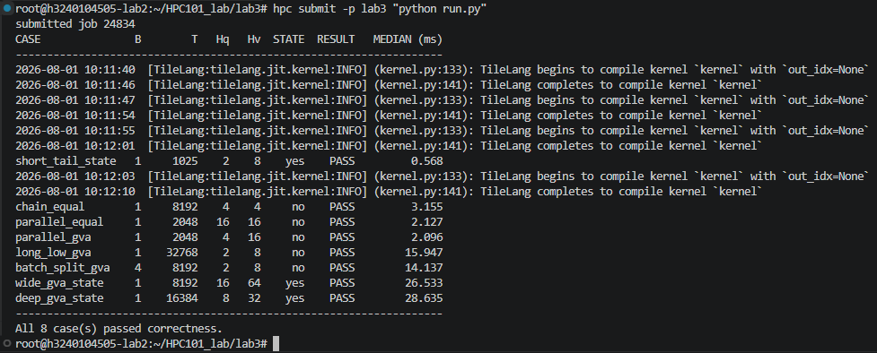</center>

可以看到跟开源的实现差距还是挺大的，比如跑了一下benckmark甚至超时了：

````bash
hpc submit -p lab3 "python run.py --reference-benchmarks"
````

结果：

<center>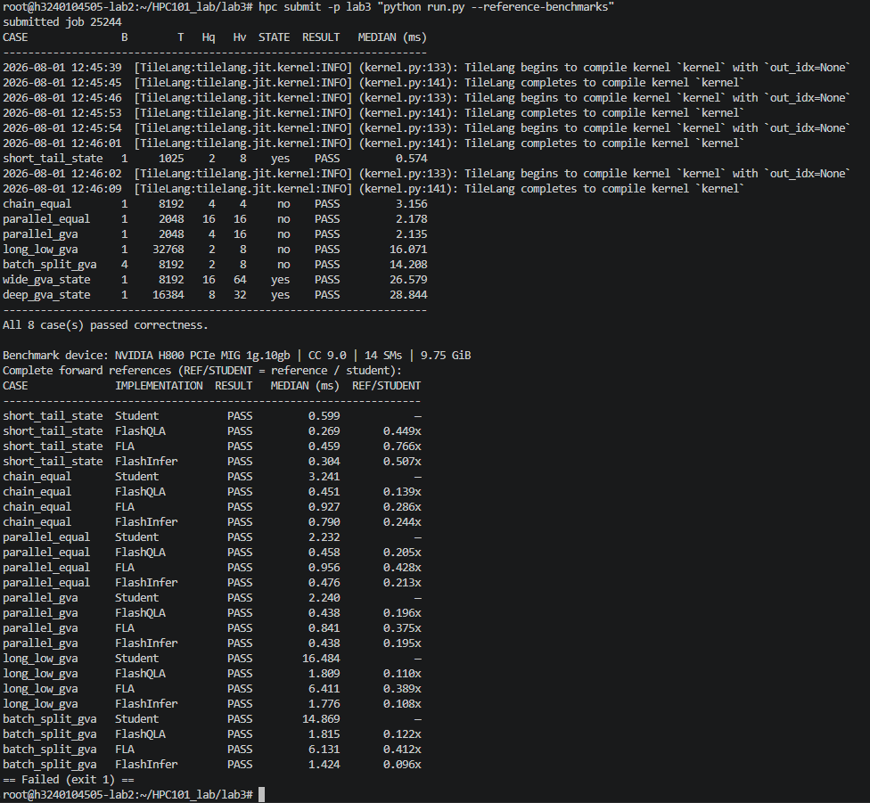</center>

可以看出即使与其中最慢的FLA相比，也慢了不少. 此时跟评分表格相比差距极大，预测只能拿

现在先定位一下hotspot找找方向，命名为`baseline`：

```bash
hpc submit -p lab3 -t 5m "nsys profile --trace=cuda,nvtx,osrt --sample=none --cpuctxsw=none --stats=true --force-overwrite=true -o baseline python run.py --case parallel_gva"
```

得到结果后在本地查看：

```bash
nsys stats --report cuda_gpu_kern_sum --report cuda_api_sum --report cuda_gpu_mem_time_sum --force-export=true --format table baseline.nsys-rep
```

<center>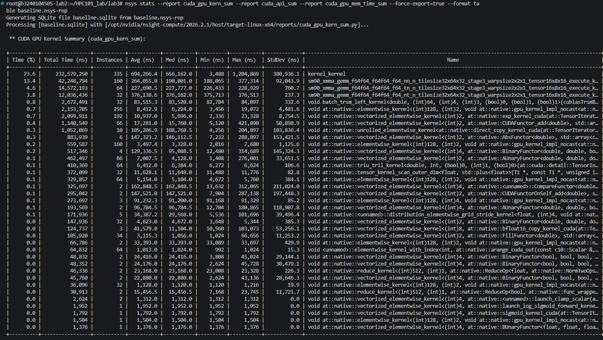</center>

<center>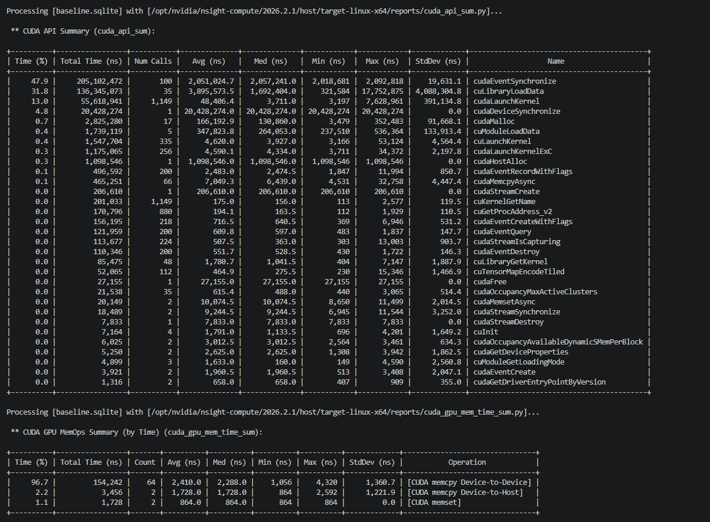</center>

在GUI中也查看一下：

<center>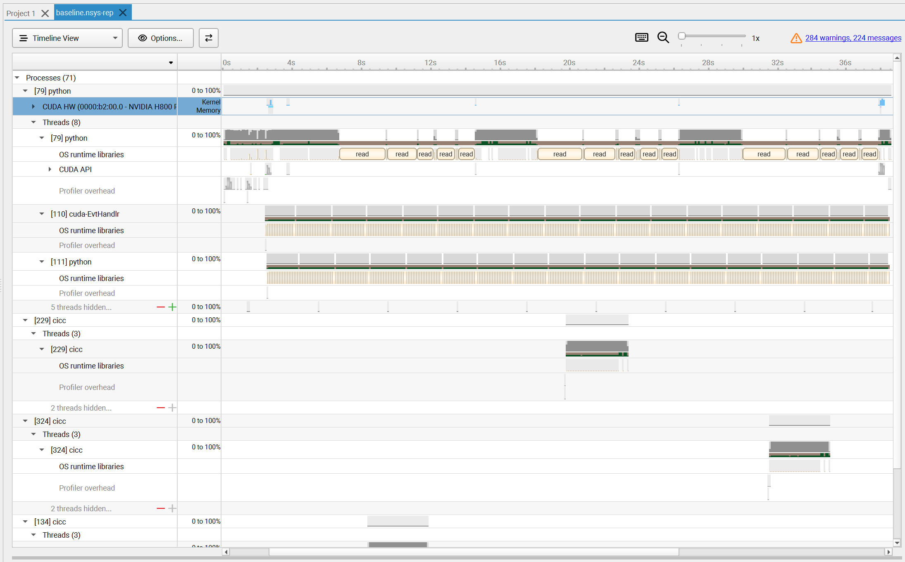</center>

可以得到几个信息：

* CUDA这一行几乎是空的，只有几个很短的蓝色小竖条(kernel 执行)，这说明在 GPU 上跑的计算时间极短；
* 灰色方块是 CPU busy 区间,呈现出"忙一段、停一段"的间歇模式；
* OS runtime libraries 行里密集的 `read`大量反复出现，贯穿整个 timeline，表明每次调用都在做 cache 查找或重复 IO，而不是命中缓存直接跑，所以效率很低下.


三个 TileLang kernel 在上面都会打包显示为 kernel_kernel，合计占 GPU kernel 时间 73.6%，具体来看的话，有`chunk_state`, `chunk_ouput`和`W/U`三种kernel：

``````bash
nsys stats --report cuda_gpu_kern_gb_sum --force-export=true --format table baseline.nsys-rep
``````

结果提取出来是这样的：

| Time (%) | Total Time (ns) | Instances | Avg (ns) | Med (ns) | Min (ns) | Max (ns) | StdDev (ns) | GridXYZ | BlockXYZ | Name |
| -------- | --------------- | --------- | -------- | -------- | -------- | -------- | ----------- | ------- | -------- | ---- |
| 41.5 | 131,076,074 | 111  | 1,180,865.5 | 1,186,086.0 | 1,156,773 | 1,204,869 | 13,566.5 | 2   16    1 | 128    1    1 | kernel_kernel |
| 23.0 | 72,800,456 | 111  | 655,860.0 | 656,163.0 | 641,539 | 670,723 | 7,519.9 | 2  512    1 | 128    1    1 | kernel_kernel |
| 9.1  | 28,699,232 | 112  | 256,243.1 | 257,073.0 | 89,473 | 265,825 | 16,135.7 | 512    1    1 | 128    1    1 | kernel_kernel |

从代码给出的形状上看，依次就是`chunk_state`, `chunk_ouput`和`W/U`三种kernel：

```python
with T.Kernel(total_chunks * H, threads=128) as (block,): # W/U
...
with T.Kernel(
            HEAD_DIM_V // BLOCK_DIM,
            batch_size * H,
            threads=128,
        ) as (bv, bbh):  # chunk_state
...
with T.Kernel(
            HEAD_DIM_V // BLOCK_DIM,
            total_chunks * H,
            threads=128,
        ) as (bv, block): # chunk_output
```

所以接下来着重优化`chunk_state`这个kernel，然后再考虑`chunk_output`和`W/U`这两个kernel.

这里有个问题是，一开始直接使用ncu会导致超时，不得不先尝试nsys profile. 唉，这个分区的最大运行时长不能调大一点吗？

（使用`--clock-control none`是为了防止ncu在MIG情况下锁掉时钟分区的报错）

```bash
hpc submit -p lab3 "ncu --clock-control none -o baseline python run.py"
```

然而还是跑不完，刚要开始分析kernel信息的时候就停止了，哎.

### 等价数学变换

> 所有分析内容写成了`aftermath`开头的文件，比如`aftermath.nsys-rep`.

肉眼可见的优化是把W/U的计算合并起来，即：

$$
U = ABV, W = AB\Gamma K, \hat{W} = U - WS_0 \Longrightarrow \hat W = AB(V - \Gamma KS_0)
$$

这样矩阵乘法次数从6次降低到4次，目测可以提升很多效率.

#### Profiling变化

观察一下修改之后的用时，可以发现比baseline确实快了一些，并且超过评分标准的60分线了：

<center>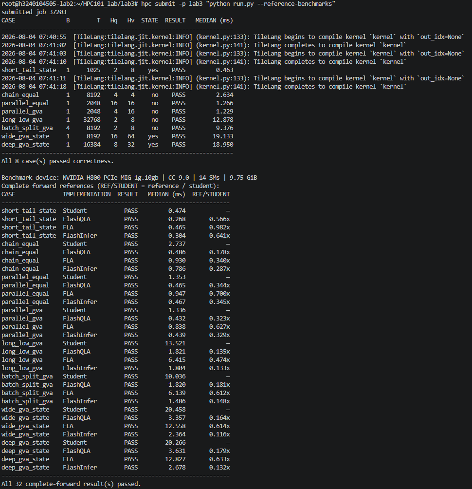</center>

hotspot:

<center>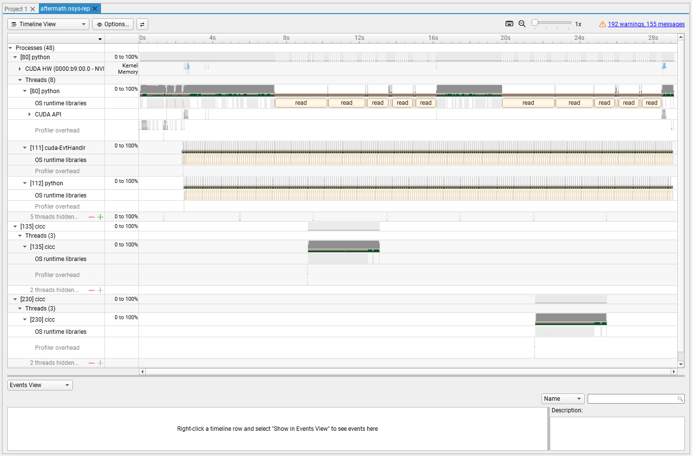</center>

看起来跟前面的没什么区别.

### Kernel Fusion

上面的过程其实也相当于做了一个kernel fusion，把W/U放到了final_state的残差计算过程中，变成了现在的`_tilelang_residual_state`, `_tilelang_chunk_output`两个核中.

Residual state负责计算$\hat W$和$S_{[c+1]}$，Output负责计算$O_{[c]}$.

由于$O_{[c]}$的计算过程可以看出它只依赖于$S_{[c]}$，所以可以考虑融合成1个kernel：

<center>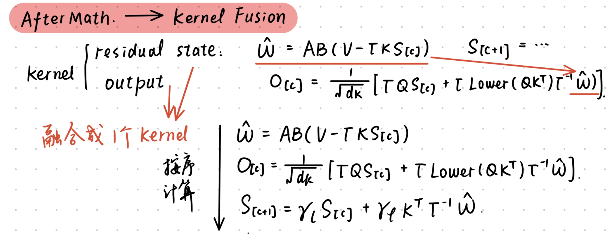</center>

性能又好了一点，但增加得有限. 看起来纯数学的手段是不太够的，需要对I/O和内存管理做出一些处理才行.

<center>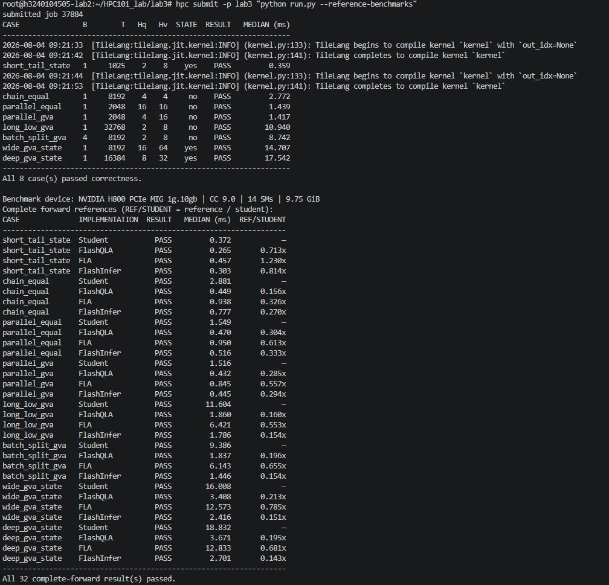</center>

### Shared Memory

引入这个优化主要是因为我看到上面的Nsys界面上read memory太多了，即cache miss penalty过大，效率极低.


完成kernel fusion之后，$S_{[c]}$和$\hat W$已经不用在HBM里来回写了，但是还有一个比较明显的问题：`BLOCK_DIM=64`时，同一个value head要用两个CTA处理. 这两个CTA虽然负责不同的value列，却会各自完整读取一次$Q,K,A,\Gamma,B$，还会把同一个$QK^T$算两遍.

所以这里的思路是：把`BLOCK_DIM`从64扩大到128，让一个CTA直接负责完整的$d_v=128$，线程数相应从128增加到256. 这样$Q,K,A$和gate每个chunk只需要从global memory加载一次，然后放在shared memory中给后面的多个GEMM反复使用：

<center>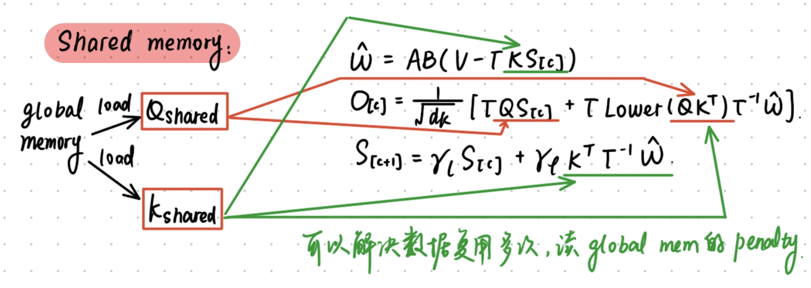</center>

这里shared memory的作用是明确让同一个CTA拥有整个chunk需要的数据. 数据从HBM读进来一次后，后面的$QS_{[c]}$、$KS_{[c]}$、$QK^T$和state update都直接读取shared memory，不再重新发global load.（也有点像多级cache，总之思路都是复用数据来降低penalty）

按照$C=64,d_k=d_v=128$计算，原来两个64-wide CTA读取$Q,K,A,V,g,\beta$大约需要：

$$
32+32+16+16+0.5+0.5=97\text{ KiB/chunk/head}.
$$

合成一个128-wide CTA后变为：

$$
16+16+8+16+0.25+0.25=56.5\text{ KiB/chunk/head},
$$

所以主要输入的逻辑global read降低了大约：

$$
\frac{97-56.5}{97}\approx41.8\%.
$$

当然这个数是代码层面的逻辑读取量，不一定等于真正的DRAM流量，因为原来的第二次读取有可能命中L2；不过即使命中L2，重复的load指令、L2 transaction和global-to-shared copy仍然存在.

shared memory本身的分配也很奇怪，容易压低occupancy. 这里利用不同中间量的生命周期不会重叠，复用两块buffer：

* `residual_shared`依次保存$V\rightarrow B(V-\Gamma KS_{[c]})\rightarrow\hat W\rightarrow\gamma_\ell\Gamma^{-1}\hat W\rightarrow O_{[c]}$的写回暂存；
* `a_shared`先保存$A$，在$A\cdot residual$完成后再覆盖成$\Gamma\mathrm{Lower}(QK^T)\Gamma^{-1}$.

这样不需要额外的`value_shared`和`output_shared`，整个CTA的shared memory大约是：

| Buffer | 大小 |
| ------ | ----: |
| `state_shared[128,128]` | 32 KiB |
| `q_shared[64,128]` | 16 KiB |
| `k_shared[64,128]` | 16 KiB |
| `residual_shared[64,128]` | 16 KiB |
| `a_shared[64,64]` | 8 KiB |
| gate、beta和decay | 1 KiB |
| 合计 | 约89 KiB |

另外`g_cumsum`也只从global memory读取一次，先写进`gate_shared`，$\gamma_r=\exp(g_r^{\text{cumsum}})$以及后续的gate ratio都从这份shared copy计算.

修改后所有case都能通过，`parallel_gva`在`warmup=10,repetitions=100`下从fused-64的1.467 ms降低到fused-128的1.036 ms，大约提升了29.4%. 这个提升不全来自内存，因为$QK^T$也从两次变成了一次；但是从数据流上看，减少重复global read确实是这一步优化的核心.

在这里我提交了第一次OJ，想看看hidden cases的情况，得到了71分：

```json
{
  "cases": [
    {
      "label": "short_tail_state",
      "medianMs": 0.283856,
      "public": true,
      "score": 104.3819,
      "status": "PASS"
    },
    {
      "label": "chain_equal",
      "medianMs": 1.98024,
      "public": true,
      "score": 62.7908,
      "status": "PASS"
    },
    {
      "label": "parallel_equal",
      "medianMs": 1.033248,
      "public": true,
      "score": 67.1702,
      "status": "PASS"
    },
    {
      "label": "parallel_gva",
      "medianMs": 1.032272,
      "public": true,
      "score": 66.3477,
      "status": "PASS"
    },
    {
      "label": "long_low_gva",
      "medianMs": 8.143728,
      "public": true,
      "score": 62.3805,
      "status": "PASS"
    },
    {
      "label": "batch_split_gva",
      "medianMs": 6.070896,
      "public": true,
      "score": 62.5861,
      "status": "PASS"
    },
    {
      "label": "wide_gva_state",
      "medianMs": 10.353328,
      "public": true,
      "score": 62.5189,
      "status": "PASS"
    },
    {
      "label": "deep_gva_state",
      "medianMs": 12.254304,
      "public": true,
      "score": 62.2979,
      "status": "PASS"
    },
    {
      "label": "hidden-1",
      "medianMs": 0.254704,
      "public": false,
      "score": 107.1726,
      "status": "PASS"
    },
    {
      "label": "hidden-2",
      "medianMs": 1.994544,
      "public": false,
      "score": 62.7467,
      "status": "PASS"
    },
    {
      "label": "hidden-3",
      "medianMs": 1.05008,
      "public": false,
      "score": 66.0585,
      "status": "PASS"
    },
    {
      "label": "hidden-4",
      "medianMs": 8.14968,
      "public": false,
      "score": 62.3766,
      "status": "PASS"
    }
  ],
  "commandError": null,
  "hiddenScore": 74.5886,
  "p120": 2,
  "publicScore": 68.8092,
  "repetitions": 100,
  "sourceRevision": "02dc5ef-r2",
  "summary": "Lab 3 score 71/120",
  "warmup": 10,
  "weights": {
    "hidden": 0.4,
    "public": 0.6
  }
}
```

累死了，接着继续尝试一下. 看看Vtune，虽然说把read阶段合二为一从而大大降低了运行时间，但明显的性能瓶颈在除了short_tail之外的其它样例上. Vtune中 OS runtime libraries 行具有大量密集的短 tick，Profiler overhead行也有碎片化标记，以及 CUDA HW 行只有少量相对稀疏的蓝色 kernel 区间，这表明单线程寄存器负担过重了：

<center>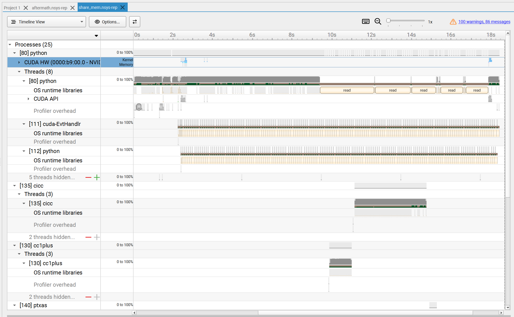</center>


### warp specialization

warp，即线束，是thread下更小的一个单位，为了减轻进程的交叠引入的.

kernel fusion和share_mem之后每个CTA同时有几个比较大的FP32 fragment：`state_fragment[128,128]`、`value_fragment[64,128]`、`output_fragment[64,128]`和`scores_fragment[64,64]`. 在256 threads下，粗略平均到每个线程分别是64、32、32和16个FP32值，还没有算编译器临时变量，所以寄存器压力比较大.

先把$QS_{[c]}$向后移动，在score写进shared memory以后再计算：

$$
KS_{[c]}\rightarrow\hat W\rightarrow QK^T\rightarrow QS_{[c]}\rightarrow O_{[c]}\rightarrow S_{[c+1]}.
$$

这不改变

$$
O_{[c]}=\mathrm{scale}\left(\Gamma QS_{[c]}+\Gamma\mathrm{Lower}(QK^T)\Gamma^{-1}\hat W\right),
$$

因为$QS_{[c]}$仍然在state update以前计算，只是让`scores_fragment`和`output_fragment`的生命周期不再重叠. 从结果上看，`parallel_gva`仍为1.036 ms，说明只改变代码顺序还不够，唉.

接着我试了一下把一个CTA的线程数从256增加到512. 这里没有手写producer/consumer warp group，所以严格来说不是完整的warp-specialized pipeline；它的直接作用是把fragment分摊给更多线程，并把单CTA从8 warps增加到16 warps. shared memory仍然约89 KiB，没有增加新的buffer.

所有case均通过. `warmup=1,repetitions=2`的结果如下：

| Case | 256 threads (ms) | 512 threads (ms) | 延迟下降 |
|---|---:|---:|---:|
| `short_tail_state` | 0.301 | 0.252 | 16.3% |
| `chain_equal` | 1.992 | 1.577 | 20.8% |
| `parallel_equal` | 1.043 | 0.836 | 19.8% |
| `parallel_gva` | 1.039 | 0.831 | 20.0% |
| `long_low_gva` | 8.049 | 6.393 | 20.6% |
| `batch_split_gva` | 6.199 | 4.885 | 21.2% |
| `wide_gva_state` | 10.615 | 8.426 | 20.6% |
| `deep_gva_state` | 12.560 | 9.909 | 21.1% |

`parallel_gva`在`warmup=10,repetitions=100`下复测两次为0.815 ms和0.822 ms，相比256-thread版本的1.036 ms大约降低20.9%，即约1.26倍加速.

另外逐个试了几种组合：1024 threads为0.925 ms，额外warp的同步开销反而更大；384 threads因为fragment布局不满足要求而编译失败；BF16 $\hat W$回载、`gate_last` shared复用和warp-specialization pass都没有稳定收益. 所以最后保留512 threads，不保留这些组合.

warp specialization后的运行日志放在了`results/20260806_163613.log`下，修改后运行得到的热点对应`cta.nsys-rep`和`cta.sqlite`两份文件，此时OJ上可以拿到74分，进步不大，好麻烦.

对应的比较与热点图：

```text
Benchmark device: NVIDIA H800 PCIe MIG 1g.10gb | CC 9.0 | 14 SMs | 9.75 GiB
Complete forward references (REF/STUDENT = reference / student):
CASE              IMPLEMENTATION  RESULT   MEDIAN (ms)  REF/STUDENT
-------------------------------------------------------------------
short_tail_state  Student           PASS         0.250            —
short_tail_state  FlashQLA          PASS         0.270       1.081x
short_tail_state  FLA               PASS         0.458       1.837x
short_tail_state  FlashInfer        PASS         0.301       1.206x
chain_equal       Student           PASS         1.651            —
chain_equal       FlashQLA          PASS         0.460       0.278x
chain_equal       FLA               PASS         0.939       0.569x
chain_equal       FlashInfer        PASS         0.783       0.475x
parallel_equal    Student           PASS         0.936            —
parallel_equal    FlashQLA          PASS         0.461       0.492x
parallel_equal    FLA               PASS         0.943       1.007x
parallel_equal    FlashInfer        PASS         0.468       0.499x
parallel_gva      Student           PASS         0.942            —
parallel_gva      FlashQLA          PASS         0.435       0.462x
parallel_gva      FLA               PASS         0.840       0.892x
parallel_gva      FlashInfer        PASS         0.441       0.468x
long_low_gva      Student           PASS         7.206            —
long_low_gva      FlashQLA          PASS         1.831       0.254x
long_low_gva      FLA               PASS         6.422       0.891x
long_low_gva      FlashInfer        PASS         1.786       0.248x
batch_split_gva   Student           PASS         5.463            —
batch_split_gva   FlashQLA          PASS         1.813       0.332x
batch_split_gva   FLA               PASS         6.145       1.125x
batch_split_gva   FlashInfer        PASS         1.434       0.262x
wide_gva_state    Student           PASS         9.402            —
wide_gva_state    FlashQLA          PASS         3.340       0.355x
wide_gva_state    FLA               PASS        12.530       1.333x
wide_gva_state    FlashInfer        PASS         2.332       0.248x
deep_gva_state    Student           PASS        10.843            —
deep_gva_state    FlashQLA          PASS         3.627       0.334x
deep_gva_state    FLA               PASS        12.812       1.182x
deep_gva_state    FlashInfer        PASS         2.675       0.247x
-------------------------------------------------------------------
```

<center>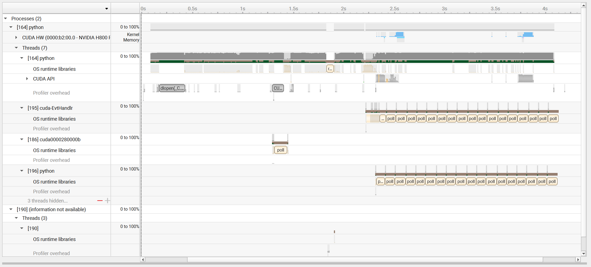</center>

现在的主要问题是：

* `CUDA HW (Kernel/Memory)` 行几乎是空的，只有在约 1.5s、2.4-2.5s、3.7-3.9s 附近才出现几个稀疏的蓝色小方块. 也就是说，在这 4 秒里，GPU 真正在跑 kernel 或做内存拷贝的时间占比非常低，绝大部分时间 GPU 是空闲的.

* `CUDA API` 行只在 2.3-2.5s、3.5-3.7s 左右出现密集的小柱状簇，说明 CPU 端只在很窄的时间窗口里集中发起了一批 API 调用（大概率是一串小 kernel launch / memcpy），其余时间几乎没有 CUDA API 调用.

* 主线程 `[164] python` 的 `OS runtime libraries` 行几乎从头到尾都密密麻麻地打点，且出现了较多"CUDA 驱动/运行时懒加载"开销.

* `[195] cuda-EvtHandler` 和 `[196] python` 两个辅助线程从 ~1.4s 开始，几乎不间断地重复执行 `poll`（一长串挨着的 `poll` block），一直持续到 4s 窗口结束。`[186] cuda0000280000b` 线程也在 1s 附近短暂 `poll` 了一下.

所以下面我先做的优化主要是：

* （命名为`blocking`）把设备的调度策略从默认的 spin 改成 blocking：
      cudaSetDeviceFlags(cudaDeviceScheduleBlockingSync)，让 CPU 线程在等待时让出核心不空转；
* （命名为`warmup`） warm-up 隔离初始化开销（只影响第一个iter）；
* （命名为`polling`）关闭忙轮询、改阻塞同步（减少 CPU 空转，猜测对多线程/多进程场景有效）

嗯，但是没什么很好的效果，先记下来：

#### Hopper warp specialization

前面的512-thread版本只是增加线程数，几个阶段仍由同一批线程串行完成. 最后参考FlashQLA的Hopper实现，把一个CTA的16个warp分成四组：

* 0--127线程维护$S_{[c]}$；
* 128--255线程计算$\hat W$；
* 256--383线程计算$O_{[c]}$；
* 384--511线程负责TMA加载和写回.

$Q,K,V,A,g,\beta$使用两组shared buffer做ping-pong. producer加载第$c+1$个chunk时，其余warp group可以继续计算第$c$个chunk；named barrier只在真正的数据依赖处同步. 数学过程仍然是：

$$
\begin{aligned}
R_{[c]}&=V_{[c]}-\Gamma_{[c]}K_{[c]}S_{[c]},\\
\hat W_{[c]}&=A_{[c]}B_{[c]}R_{[c]},\\
O_{[c]}&=\mathrm{scale}\left(\Gamma_{[c]}Q_{[c]}S_{[c]}
+\Gamma_{[c]}\mathrm{Lower}(Q_{[c]}K_{[c]}^T)\Gamma_{[c]}^{-1}\hat W_{[c]}\right),\\
S_{[c+1]}&=\gamma_\ell S_{[c]}
+K_{[c]}^T\left(\gamma_\ell\Gamma_{[c]}^{-1}\hat W_{[c]}\right).
\end{aligned}
$$

这里是让加载、state、value和output四条流水线重叠. 

#### 消除$A$的中间转换

一开始的warp-specialized kernel把$\beta$吸收到$A$的列中：

$$
\hat W_{[c]}
=\left(A_{[c]}\odot\beta_{\mathrm{col}}\right)
\left(V_{[c]}-\Gamma_{[c]}K_{[c]}S_{[c]}\right).
$$

因为$B_{[c]}=\mathrm{diag}(\beta)$，所以它和下面的写法完全等价：

$$
\left(A_{[c]}\odot\beta_{\mathrm{col}}\right)R_{[c]}
=A_{[c]}B_{[c]}R_{[c]}.
$$

但是前一种写法需要output warp group先把$A$从BF16 shared memory读到一个$64\times64$的FP32 fragment，逐列乘$\beta$，再写回shared memory，value warp group才能继续GEMM. 这会增加4096个FP32 fragment元素、一次shared memory往返和一个跨warp barrier.

因此最后恢复成原公式的计算顺序：先逐行计算$B_{[c]}R_{[c]}$，再直接使用预处理给出的$A_{[c]}$做GEMM：

$$
R_{[c]}\longrightarrow B_{[c]}R_{[c]}
\longrightarrow A_{[c]}B_{[c]}R_{[c]}=\hat W_{[c]}.
$$

这样只增加$64\times128$次逐元素乘法，但删掉了更昂贵的$A$转换、FP32 fragment和同步. `wide_gva_state`由2.488 ms降到约2.17 ms，`deep_gva_state`由2.820 ms降到约2.45 ms.

然而，但从结果上看，没什么很大的改进：

```text
Benchmark device: NVIDIA H800 PCIe MIG 1g.10gb | CC 9.0 | 14 SMs | 9.75 GiB
Complete forward references (REF/STUDENT = reference / student):
CASE              IMPLEMENTATION  RESULT   MEDIAN (ms)  REF/STUDENT
-------------------------------------------------------------------
short_tail_state  Student           PASS         0.252            —
short_tail_state  FlashQLA          PASS         0.276       1.094x
short_tail_state  FLA               PASS         0.470       1.866x
short_tail_state  FlashInfer        PASS         0.303       1.204x
chain_equal       Student           PASS         1.787            —
chain_equal       FlashQLA          PASS         0.461       0.258x
chain_equal       FLA               PASS         0.936       0.524x
chain_equal       FlashInfer        PASS         0.785       0.439x
parallel_equal    Student           PASS         0.993            —
parallel_equal    FlashQLA          PASS         0.462       0.465x
parallel_equal    FLA               PASS         0.952       0.959x
parallel_equal    FlashInfer        PASS         0.473       0.476x
parallel_gva      Student           PASS         0.995            —
parallel_gva      FlashQLA          PASS         0.438       0.441x
parallel_gva      FLA               PASS         0.845       0.849x
parallel_gva      FlashInfer        PASS         0.442       0.445x
long_low_gva      Student           PASS         7.351            —
long_low_gva      FlashQLA          PASS         1.828       0.249x
long_low_gva      FLA               PASS         6.433       0.875x
long_low_gva      FlashInfer        PASS         1.803       0.245x
batch_split_gva   Student           PASS         5.758            —
batch_split_gva   FlashQLA          PASS         1.818       0.316x
batch_split_gva   FLA               PASS         6.157       1.069x
batch_split_gva   FlashInfer        PASS         1.445       0.251x
wide_gva_state    Student           PASS         9.470            —
wide_gva_state    FlashQLA          PASS         3.361       0.355x
wide_gva_state    FLA               PASS        12.582       1.329x
wide_gva_state    FlashInfer        PASS         2.364       0.250x
deep_gva_state    Student           PASS        10.897            —
deep_gva_state    FlashQLA          PASS         3.639       0.334x
deep_gva_state    FLA               PASS        12.824       1.177x
deep_gva_state    FlashInfer        PASS         2.677       0.246x
-------------------------------------------------------------------
```

热点图：

<center>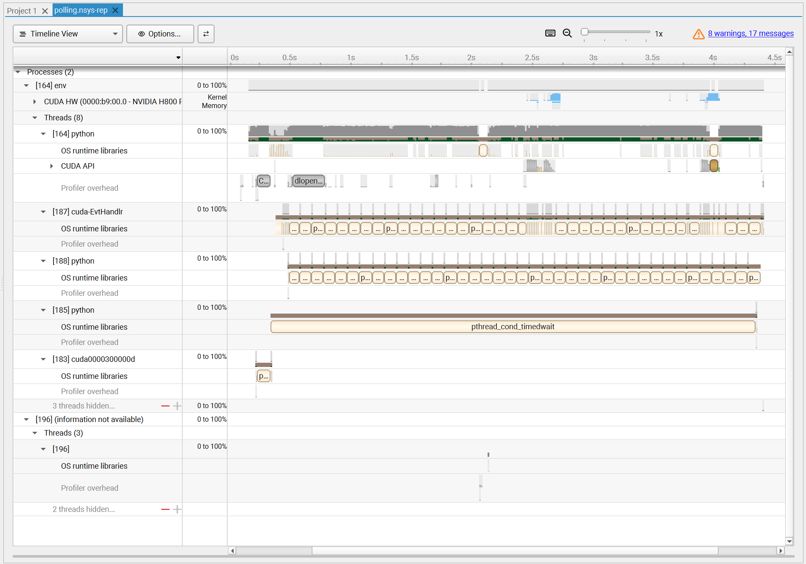</center>

### Double Buffer

根据上面的热点，最终不再继续做局部删指令，而是把一个CTA拆成四个固定warp group，并给$Q,K,V,A,g,\beta$建立double buffer：

```text
TMA producer: load chunk_[c+1]
state group : maintain S_[c] and S_[c+1]
value group : compute R_[c] and W_hat_[c]
output group: compute QK^T, QS_[c] and O_[c]
```

这样把“单CTA内所有阶段由同一批线程串行执行”的热点改成producer/consumer重叠. 初版正式10/100结果为：

| Case | 普通512线程 (ms) | warp-specialized (ms) |
|---|---:|---:|
| `short_tail_state` | 0.231 | 0.114 |
| `chain_equal` | 1.543 | 0.454 |
| `parallel_equal` | 0.820 | 0.292 |
| `parallel_gva` | 0.816 | 0.259 |
| `long_low_gva` | 6.152 | 1.691 |
| `batch_split_gva` | 4.713 | 1.335 |
| `wide_gva_state` | 8.182 | 2.488 |
| `deep_gva_state` | 9.635 | 2.820 |

这时7/8个case超过100分检查点，剩余热点集中在`wide_gva_state`：它有64个value head，重复执行每chunk的$A$转换和跨warp同步；`deep_gva_state`也因为chunk最多而对每chunk固定开销敏感.

因此最后消除：

$$
(A\odot\beta_{\mathrm{col}})R
$$

所需的FP32 `a_fragment`、shared回写和barrier，恢复成：

$$
A(BR).
$$

这一步直接针对每个chunk、每个value head都会发生的同步热点，实测效果很好，在OJ上达到了111分.

热点图：

<center>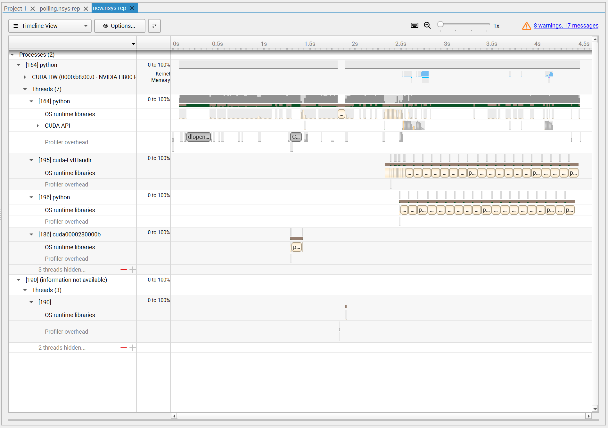</center>

### (失败) Host侧尝试

Host侧优化的尝试是失败的，一开始我以为 nsys的OS runtime曾显示大量`poll`、`read`和CPU busy区间，可以做一下优化.

但隔离warm-up后，正式100次调用的核心仍是同一个GPU kernel. 因此又分别测试：

| 尝试 | 观测 | 决定 |
|---|---|---|
| `cudaDeviceScheduleBlockingSync` | 脚本median 0.834 ms，kernel median 0.804 ms；CPU出现`sem_wait`，GPU时间不变 | 仅保留为profile选项 |
| warm-up后再开始capture | 脚本median 0.833 ms，kernel median 0.803 ms；排除JIT和初始化 | 保留为测量方法，不改student路径 |
| 批量提交后统一同步，关闭逐次polling | 同步点减少，但median退化到约0.859 ms | 不采用 |

所以CPU等待是profile可读性和多进程CPU占用的热点，不是student GPU kernel得分的主要热点. 

---

到目前为止已经是112分了，接下来尝试：

### 拆分`bar_finish`

当前`bar_finish`的同步过程当前一个CTA有四组参与chunk流水的线程：

```text
state group : 0--127
value group : 128--255
output group: 256--383
store group : 480--511
```

`bar_finish`的`arrive_count=416`，正好要求上面四组线程全部到达：

$$
128+128+128+32=416.
$$

当前每个chunk末尾的过程可以画成：

<center>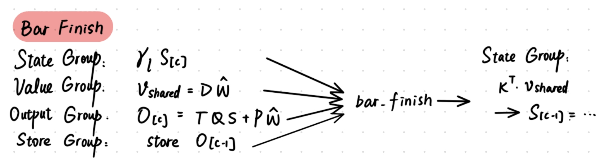</center>

也就是说，state group先计算$\gamma_\ell S_{[c]}$，然后在`bar_finish`等待value、output和store三组全部结束，最后才执行：

$$
S_{[c+1]}
=\gamma_\ell S_{[c]}
+K_{[c]}^T\left(\gamma_\ell\Gamma_{[c]}^{-1}\hat W_{[c]}\right).
$$

记：

$$
D_{[c]}=\gamma_\ell\Gamma_{[c]}^{-1},
\qquad
\hat W^{\mathrm{decay}}_{[c]}=D_{[c]}\hat W_{[c]}.
$$

则state update实际只需要：

$$
K_{[c]},\quad
\hat W^{\mathrm{decay}}_{[c]},\quad
\gamma_\ell S_{[c]}.
$$

它不依赖$O_{[c]}$的最终GEMM，也不依赖$O_{[c-1]}$是否已经写回global memory. 因此让state group等待整个`bar_finish`包含了两个不必要的依赖：output GEMM完成和上一个output写回完成.

考虑新增一个只负责“decayed value已经生成”的named barrier：

```python
bar_decay_ready = T.alloc_barrier(arrive_count=128)
```

value group完成下面的shared-memory写入后立刻通知state group：

```python
for row, dim_v in T.Parallel(CHUNK_SIZE, block_dv):
    value_fragment[row, dim_v] *= gate_decay_shared[row]
T.copy(value_fragment, value_decay_shared)
T.barrier_arrive(bar_decay_ready)
```

state group不再参与`bar_finish`，而是等待`bar_decay_ready`：

```python
T.barrier_wait(bar_decay_ready, chunk % 2)
T.gemm(
    k_shared[chunk % 2, :, :],
    value_decay_shared,
    state_fragment,
    transpose_A=True,
    clear_accum=False,
)
```

修改后的数据流变成：

<center>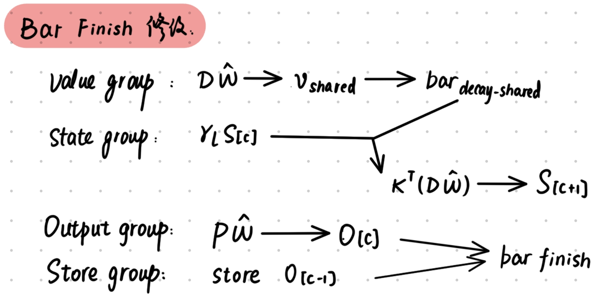</center>

这样state GEMM可以和output GEMM以及上一个chunk的output store重叠.

state group退出`bar_finish`后，原barrier只剩：

$$
128\text{(value)}+128\text{(output)}+32\text{(store)}=288,
$$

所以需要同时把：

```python
bar_finish = T.alloc_barrier(arrive_count=416)
```

改成：

```python
bar_finish = T.alloc_barrier(arrive_count=288)
```

`bar_start`仍保持416，因为进入下一个chunk以前，state、value、output和store四组仍需要在同一个chunk phase上对齐.

新的偏序关系为：

$$
\begin{aligned}
S_{[c]}&\longrightarrow state\_shared
\longrightarrow QS_{[c]},KS_{[c]},\\
\hat W_{[c]}&\longrightarrow D\hat W_{[c]}
\longrightarrow S_{[c+1]},\\
\hat W_{[c]}&\longrightarrow O_{[c]},\\
S_{[c+1]}\text{完成}&\longrightarrow data\_free
\longrightarrow \text{覆盖chunk buffer}.
\end{aligned}
$$

数学依赖没有改变，因此理论上是可行的.

从运行结果上看，稍稍提升了一点，达到了113分，可以看出在state较长较宽的样例点上表现没那么好：

```json
{
  "cases": [
    {
      "label": "short_tail_state",
      "medianMs": 0.098816,
      "public": true,
      "score": 120,
      "status": "PASS"
    },
    {
      "label": "chain_equal",
      "medianMs": 0.283888,
      "public": true,
      "score": 115.0696,
      "status": "PASS"
    },
    {
      "label": "parallel_equal",
      "medianMs": 0.268064,
      "public": true,
      "score": 118.1449,
      "status": "PASS"
    },
    {
      "label": "parallel_gva",
      "medianMs": 0.22816,
      "public": true,
      "score": 120,
      "status": "PASS"
    },
    {
      "label": "long_low_gva",
      "medianMs": 1.400816,
      "public": true,
      "score": 106.539,
      "status": "PASS"
    },
    {
      "label": "batch_split_gva",
      "medianMs": 1.181264,
      "public": true,
      "score": 105.9405,
      "status": "PASS"
    },
    {
      "label": "wide_gva_state",
      "medianMs": 2.17944,
      "public": true,
      "score": 102.2686,
      "status": "PASS"
    },
    {
      "label": "deep_gva_state",
      "medianMs": 2.438736,
      "public": true,
      "score": 103.2178,
      "status": "PASS"
    },
    {
      "label": "hidden-1",
      "medianMs": 0.100064,
      "public": false,
      "score": 120,
      "status": "PASS"
    },
    {
      "label": "hidden-2",
      "medianMs": 0.293152,
      "public": false,
      "score": 113.9614,
      "status": "PASS"
    },
    {
      "label": "hidden-3",
      "medianMs": 0.236256,
      "public": false,
      "score": 120,
      "status": "PASS"
    },
    {
      "label": "hidden-4",
      "medianMs": 1.463008,
      "public": false,
      "score": 105.4109,
      "status": "PASS"
    }
  ],
  "commandError": null,
  "hiddenScore": 114.8431,
  "p120": 2,
  "publicScore": 111.3976,
  "repetitions": 100,
  "sourceRevision": "02dc5ef-r2",
  "summary": "Lab 3 score 113/120",
  "warmup": 10,
  "weights": {
    "hidden": 0.4,
    "public": 0.6
  }
}
```

### (未完成)插桩与热点定位

emm，这段是Claude 5.0 Sonnet教我的，似乎是叫这个名字.

上面的优化完了之后得到这个热点图：

<center>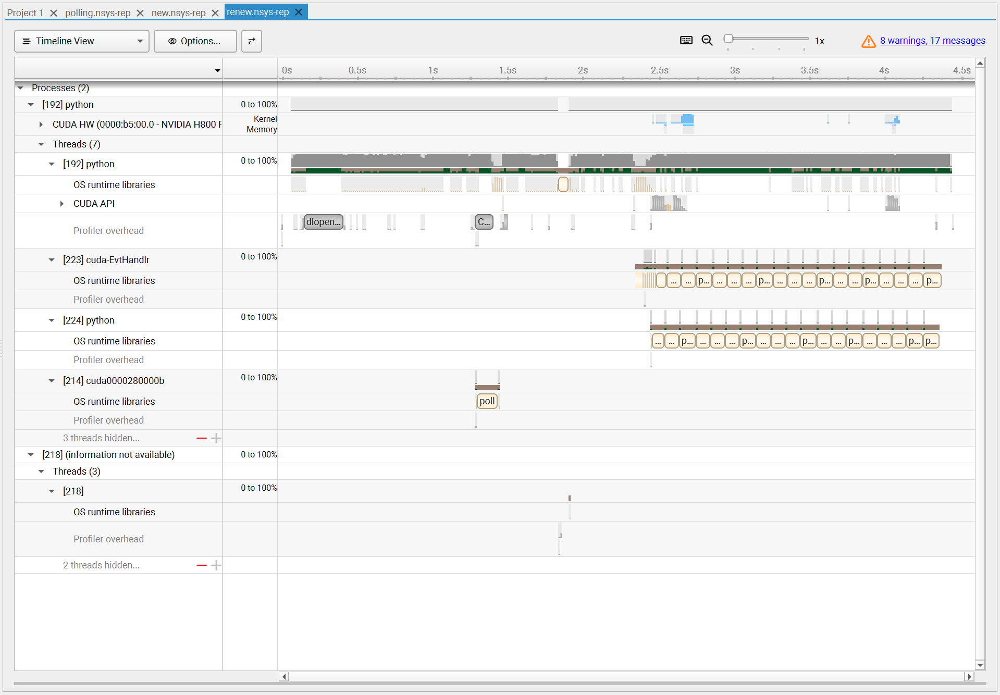</center>

Claude建议我：

* 用 NVTX 标注把 0~2.3s 这段 CPU 活动打上范围标签，或者直接在 Python 代码里加 profiling（`cProfile`/`py-spy`），确认这 2.3 秒具体花在哪个函数上；

- 如果是一次性的初始化/编译开销，同样可以靠 warm-up 挪出计时窗口；如果打榜本身就是测"从进程启动到结束"的总时长（不允许 warm-up 隔离），那就必须真正压缩这段准备时间本身（比如预编译、缓存、减少 import 开销、提前触发懒加载）；
- 之后再看 2.3s~4.5s 之间三段 kernel 执行之间的间隔能不能进一步压缩或重叠——这才是能实际反映在榜单分数上的改动

但是我也没啥力气继续搞了，113分收手了，等后面有空再看.
