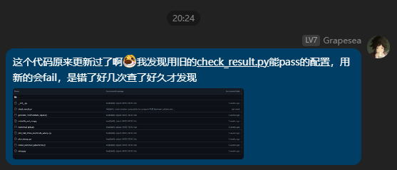
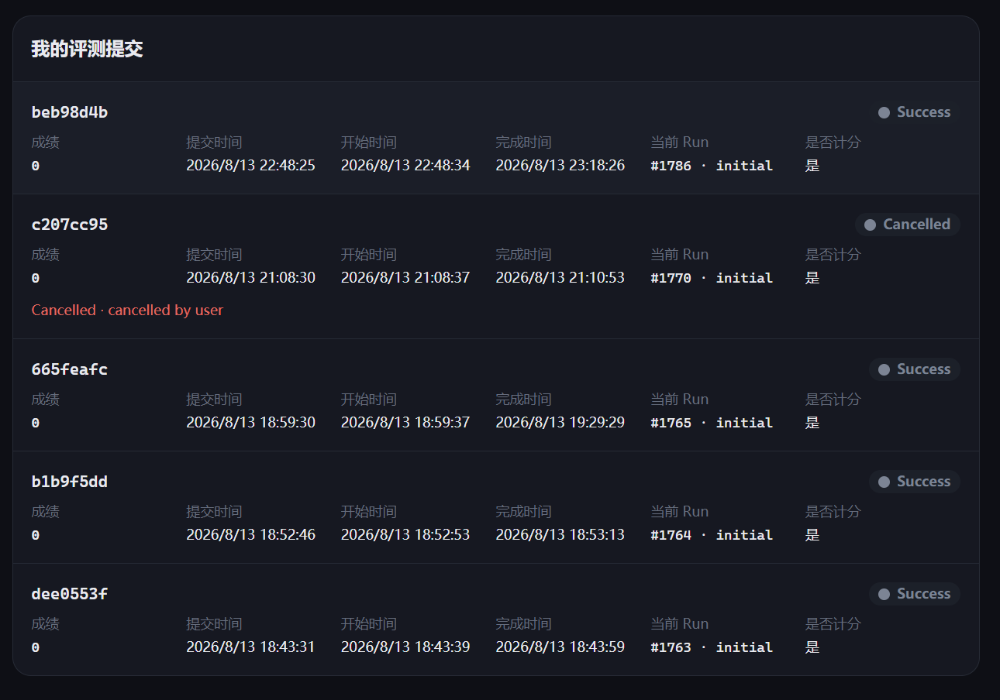
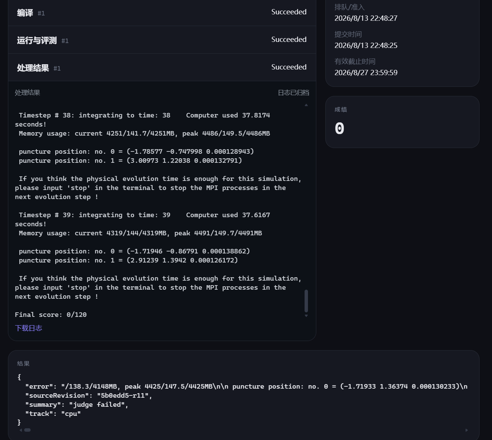

# Lab 4: AMSS-NCKU 数值相对论程序优化

<center>3240104505 查沣翊(Grapesea)</center>

[TOC]

> 参考资料：
>
> * [Lab4 实验文档](https://hpc101.zjusct.io/lab/Lab4-AMSS-NCKU)
>
> * [[2509.21652] A User-Friendly Python Interface for the Numerical Relativity Code AMSS-NCKU](https://arxiv.org/abs/2509.21652)

## 准备工作

环境配置没什么难点：

```bash
npx degit ZJUSCT/HPC101/src/lab4 lab4
./compile.sh # 发现缺个matplotlib包
pip install matplotlib
export AMSS_MPIEXEC="mpiexec --allow-run-as-root --use-hwthread-cpus" 
# 原本是默认使用物理核的，这样会触发 'not enough slots available in the system to satisfy the 30 slots that were requested by the application'
./run.sh --twop-cache
```

这是最初手动运行时的临时设置. 当前 `lab4-cpu/run.sh` 会根据提交配置重新设置`AMSS_MPIEXEC`（并补充 `--bind-to`、`--map-by` 等参数），所以仅在终端里 export 这个变量不一定能覆盖脚本的最终 launcher；正式运行还是以 `4.sh` 为准.

我最绷不住的是这个问题，在8月13日晚上才发现这个逆天问题，白白浪费了3次提交机会和2h的debug时间：

<center></center>

### CPU版本运行脚本

整合成一份`4.sh`脚本：（下面代码块保留了最初报告中的简化写法，当前脚本已经增加了参数备份/恢复、动态输出目录、混合工具链和超时提示. 当前 `4.sh` 的输入字段默认是 `MPI=12、OMP=5`；早期的 30×1 baseline 只是历史对照；同时 `run.sh` 目前把 launcher 的 `--map-by slot:PE` 写死为 4，因此脚本字段与实际绑核数并不完全一致）

```bash
#!/bin/bash
#HPC --partition=lab4
#HPC --cpu=60
#HPC --mem=100Gi
#HPC --time=30m
set -euo pipefail

# hpc 默认在提交命令所在目录运行
echo "PWD=$(pwd)"
echo "Start: $(date)"

input_backup="AMSS_NCKU_Input.py.4sh.$$"
cp AMSS_NCKU_Input.py "$input_backup"
trap 'cp "$input_backup" AMSS_NCKU_Input.py; rm -f "$input_backup"' EXIT
sed -i '/^[[:space:]]*Final_Evolution_Time[[:space:]]*=/c\Final_Evolution_Time = 40.0' AMSS_NCKU_Input.py
sed -i '/^[[:space:]]*Evolution_Step_Number[[:space:]]*=/c\Evolution_Step_Number = 10000000' AMSS_NCKU_Input.py

# 4.sh always means the CPU baseline. Keep the source configuration and
# environment consistent, even if a previous GPU run left it set to "yes".
export AMSS_GPU_CALCULATION=no
unset AMSS_FINAL_EVOLUTION_TIME AMSS_EVOLUTION_STEPS
export AMSS_MPI_PROCESSES=12
export AMSS_OMP_THREADS=5
export AMSS_ENABLE_GPU=OFF
export AMSS_ENABLE_OPENMP=ON
export AMSS_OPT="-Ofast -ffast-math"
export AMSS_ARCH_FLAGS="-mcpu=tsv110 -msve-vector-bits=256"
export AMSS_BUILD_DIR="$PWD/build_cpu_armclang"
export AMSS_OUTPUT_ROOT="$PWD/runs/${HPC_JOB_ID:-manual}"
export AMSS_CACHE_DIR="$PWD/twopuncture_cache"
unset CUDACXX AMSS_CUDA_ARCHITECTURES

echo "Mode=CPU (ABE), MPI ranks=$AMSS_MPI_PROCESSES, OMP threads=$AMSS_OMP_THREADS"
echo "Build=$AMSS_BUILD_DIR"

./compile.sh
# 正式计时默认不使用缓存；调试时可设置 AMSS_SUBMIT_TWOP_CACHE=1，
# 此时脚本才会调用 ./run.sh --twop-cache. 
./run.sh

# The CPU run stops at t=40, while the shipped golden trajectory extends to
# t=100.  Build the matching golden prefix from the configured final time.
FINAL_TIME=$(python3 -c 'import AMSS_NCKU_Input as cfg; print(cfg.Final_Evolution_Time)')
mkdir -p golden_cpu
awk -v cutoff="$FINAL_TIME" '
  /^[[:space:]]*#/ || NF == 0 { print; next }
  ($1 + 0) < cutoff { print }
' golden/bssn_BH.dat > golden_cpu/bssn_BH.dat

./check.sh "$AMSS_OUTPUT_ROOT/GW250118/AMSS_NCKU_output" golden_cpu
```

当前 `4.sh` 还会同步写入 `grid_level`、`moving_grid_number`、`Dissipation`、`refinement_level`、`Courant_Factor` 以及 `AMSS_NRELAX=32` 等提交参数，并通过 `AMSS_DISTRIBUTION_NODES=30` 固定 AMR partition 几何. `compile.sh` 在鲲鹏节点采用混合工具链：GNU 只编译较快的 `TwoPunctureABE`，Arm Compiler 编译 Fortran-heavy 的 `ABE`，最后把两个产物放入同一 build 目录. 原报告代码块没有展开这些逻辑，不能把它当成当前脚本的完整逐行副本.

提交：

```bash
hpc submit -p lab4 -c 60 -d -o 'results/4-%j.log' "./4.sh"
```

然后就是坐等运行完看baseline了，有一说一确实慢. 会在 lab4 所在容器中的`lab4-cpu/results/`目录下出现想要的结果.

（使用CPU验证时需要增加一道验证，将前面的40项裁剪出来跑验证程序，因为默认跑的是GPU的100道测评）

CPU baseline结果放在`4-85843-baseline.log`中:

```bash
 This Program Cost = 1742.2476229667664 Seconds

 The AMSS-NCKU-Python simulation is successfully finished.

Golden: /home/h3240104505/HPC101_lab/lab4/golden_cpu
Result: /home/h3240104505/HPC101_lab/lab4/GW250118/AMSS_NCKU_output
Trajectory: matched times 40/40, effective terms 236
Trajectory RMS: 0 (0.000000%)
Trajectory: PASS - RMS <= 0.001 (0.100000%)
Constraints: 40 time groups, 9 levels per group
Constraint maxima (level 0): Ham=0.27739667, Px=0.028132512, Py=0.031488238, Pz=0.026503396
Constraints: PASS - all maxima <= 2
FINAL: PASS
```

baseline总时长为1742.2476229667664s.

### GPU版本运行脚本

在前面的脚本的基础上，还需要修改一点东西才行：

```bash
#!/bin/bash
#HPC --partition=lab4g10
#HPC --cpu=16
#HPC --gpu=1
#HPC --mem=24Gi
#HPC --time=30m
set -euo pipefail

# hpc 默认在提交命令所在目录运行
echo "PWD=$(pwd)"
echo "Start: $(date)"

export AMSS_GPU_CALCULATION=yes
export AMSS_MPI_PROCESSES=30
export AMSS_OMP_THREADS=1
export AMSS_ENABLE_GPU=ON
export AMSS_ENABLE_OPENMP=ON
export AMSS_CUDA_ARCHITECTURES=80
export AMSS_BUILD_DIR="$PWD/build_gpu_a100"
export AMSS_OUTPUT_ROOT="$PWD/gpu_output"
export AMSS_CACHE_DIR="$PWD/twopuncture_cache"
export CUDACXX=/usr/local/cuda/bin/nvcc
[[ -x "$CUDACXX" ]] || { echo "CUDA compiler missing: $CUDACXX" >&2; exit 1; }
mkdir -p "$AMSS_OUTPUT_ROOT"
nvidia-smi -L

echo "GPU_Calculation=$AMSS_GPU_CALCULATION"
echo "MPI ranks=$AMSS_MPI_PROCESSES, OMP threads=$AMSS_OMP_THREADS"
echo "Build=$AMSS_BUILD_DIR"
echo "Output=$AMSS_OUTPUT_ROOT"
echo "CUDA compiler=${CUDACXX:-disabled}"

./compile.sh
./run.sh --twop-cache
./check.sh "$AMSS_OUTPUT_ROOT/GW250118/AMSS_NCKU_output" golden
```

提交方式：

```bash
hpc submit -p lab4g10 -c 16 -d -o 'results/4g-%j.log' "./4g.sh"
```

会在 lab2 所在容器中的`lab4-gpu/results/`目录下出现想要的结果.

于是得到了GPU版本的用时baseline（放在`4g-85694-baseline.log`中）:

```bash
 This Program Cost = 1721.3482825756073 Seconds

 The AMSS-NCKU-Python simulation is successfully finished.

Golden: /home/h3240104505/HPC101_lab/lab4/golden
Result: /home/h3240104505/HPC101_lab/lab4/gpu_output/GW250118/AMSS_NCKU_output
Trajectory: matched times 100/100, effective terms 596
Trajectory RMS: 0 (0.000000%)
Trajectory: PASS - RMS <= 0.001 (0.100000%)
Constraints: 100 time groups, 9 levels per group
Constraint maxima (level 0): Ham=0.28974817, Px=0.039343259, Py=0.047298107, Pz=0.044686547
Constraints: PASS - all maxima <= 2
FINAL: PASS
```

baseline总时长为1721.3482825756073s.

## 性能分析

### CPU Profiling

首先定好脚本，为了快速确定热点，将原先的

```python
Final_Evolution_Time   = 100.0 if GPU_Calculation == "yes" else 40.0
...
Evolution_Step_Number    = 10000000               ## stop the calculation after the maximal step number
```

设置成shell脚本`4_s.sh`中的：

```shell
sed -i '/^[[:space:]]*Final_Evolution_Time[[:space:]]*=/c\Final_Evolution_Time = 1.0' AMSS_NCKU_Input.py
sed -i '/^[[:space:]]*Evolution_Step_Number[[:space:]]*=/c\Evolution_Step_Number = 1' AMSS_NCKU_Input.py
```

指令格式基本不变：

```bash
hpc submit -p lab4 -c 60 -d -o 'results/4_s-%j.log' ./4_s.sh
```

一次运行的时间（`4g_s-90496.log`中）：

```text
This Program Cost = 47.99874305725098 Seconds
```


### GPU Profiling

类似上面的小节，为了快速确定热点，将原先的

```python
Final_Evolution_Time   = 100.0 if GPU_Calculation == "yes" else 40.0
...
Evolution_Step_Number    = 10000000               ## stop the calculation after the maximal step number
```

设置成shell脚本`4g_s.sh`中的：

```shell
sed -i '/^[[:space:]]*Final_Evolution_Time[[:space:]]*=/c\Final_Evolution_Time = 1.0' AMSS_NCKU_Input.py
sed -i '/^[[:space:]]*Evolution_Step_Number[[:space:]]*=/c\Evolution_Step_Number = 1' AMSS_NCKU_Input.py
```

指令格式基本不变：

```bash
hpc submit -p lab4g10 -c 16 -d -o 'results/4g_s-%j.log' ./4g_s.sh
```

一次运行的时间（`4g_s-90496.log`中）：

```text
This Program Cost = 22.397433042526245 Seconds
```

## 共享优化阶段：TwoPuncture 初值求解

### 编译优化

文档给出的指导是：

> 包括增加编译选项，也包括为目标平台选择更合适的完整工具链. 

#### 编译选项

>   可以尝试：
>
> * -O2、-O3 等优化等级；
> * -march、-mtune 或对应编译器的目标架构选项；
> * 自动向量化；
> * OpenMP 编译和运行时选项；
>
> 架构选项必须与实际评测节点支持的指令集匹配. 课程 GPU 为 NVIDIA A100，其 compute capability 为 8.0（sm_80），当前 CMAKE_CUDA_ARCHITECTURES=80 已与目标架构匹配. CMakeLists.txt 中的 AMSS_OPT 只作用于 C++ 和 Fortran，CUDA 架构与其他 NVCC 参数需要单独设置. -Ofast、GCC/Clang 的 -ffast-math 或其他编译器对应的 fast-math 选项可能重排浮点表达式，改变求解器收敛过程或数值结果；使用后必须重新完成端到端正确性验证. 

首先我尝试了多种优化等级（`-O2`, `-O3`, `-Ofast`等），这个优化等级和目标架构选项可以将单个evolve的时间从44s降低至38s：

```cmake
set(AMSS_OPT "-Ofast -ffast-math" CACHE STRING "C/C++/Fortran optimization level")
set(AMSS_ARCH_FLAGS "-mcpu=native" CACHE STRING "Architecture-specific compiler flags")
```

然而并不够，我跑了几次觉得可以竞争全HPC101最忧郁之人了：

<center></center>

<center></center>

跑到第39个evolve恰好超时这谁绷得住……我以为代码日志中的1750s没超过30min就能直接提交看架构理解的，然而却触及了一个矛盾：只有优化到一定程度才能跑通测试不超时，那么基础的就有30分了吧……

后来我成功提交了一次，不知道是不是OJ的设置修改过了，只拿到了6分.

然而我其实很早就得到了31s单步的结果. 追踪了好久编译链，才发现是我把自己绕进去了，我在`4.sh`中显式指定了本地 ABE 模块用 Arm 编译器，而提交到OJ上不可能根据`4.sh`的内容，所以 ABE 模块仍然是GNU编译，没有任何的加速. 解决完这个问题之后我的分数得到了10分 .

```json
{
  "correctness": {
    "constraintLevels": 9,
    "constraintMaxima": {
      "hamiltonian": 0.27739667,
      "px": 0.028132512,
      "py": 0.031488238,
      "pz": 0.026503396
    },
    "constraintTimeGroups": 40,
    "trajectoryRMS": 0,
    "trajectoryTerms": 236,
    "trajectoryTimes": 40
  },
  "mpiProcesses": 30,
  "ompThreads": 1,
  "scoreBeforeRounding": 10.325272,
  "sourceRevision": "5b0edd5-r11",
  "summary": "CPU 10/120 · 1331.047s",
  "track": "cpu",
  "wallSeconds": 1331.047254
}
```

大致计算一下也确实只有10分，

### 初值求解优化

首先还是老老实实 profile. `TwoPunctures.C` 中的`TwoPunctureABE` 里面最热的几个函数大概是：

```text
LineRelax_be        32.22%
LineRelax_al        23.13%
ThomasAlgorithm     16.77%
vectorized cos       9.02%
malloc/free            ~7%
```

也就是说，最显眼的是线松弛、Thomas 三对角求解和它们高频触发的动态内存分配. 于是我依次试了下面这些：

1. 把 `LineRelax_be`、`LineRelax_al` 和 `ThomasAlgorithm` 里的 `new[]/delete[]` 提到外层，每个线程预分配并复用工作区；
2. 把原来碎成 `NRELAX` 次的 `relax()` 调用合并到一个并行区，减少 OpenMP 反复 fork-join；
3. 利用 `nphi=26`，尝试让 13 个线程分别处理 red/black 阶段中独立的 `k` 平面；
4. 把 `NRELAX` 从 200 降到 100，观察 BiCGStab 和 Newton 的收敛；
5. 继续尝试并行 `J_times_dv`，并把 `JFD_times_dv` 的临时导数数组改成复用工作区. 

看上去每一项都非常合理，实则不是特别好. 单独做内存复用时，TwoPuncture 仍然在 247s 左右；OpenMP 版本在开发环境里反而跑到了 254--286s. 这里主要有三个原因：

* `nphi=26` 的并行粒度太小，理论上最多也就 13 个独立平面，线程启动、barrier 和调度开销很容易把收益吃干净；
* `LineRelax` 本身有较强的数据依赖和不规则访存，不能像普通三重循环一样随便 `collapse`；
* 只减少 `malloc/free` 没有改变求解器迭代次数，而真正的大头仍然是松弛和矩阵向量计算. 

`NRELAX=100` 是唯一看起来比较像正优化的方案，冷启动大约从 247s 降到了 205s；`puncture_parameters_new.txt` 一致，`Ansorg.psid` 最大绝对误差约为 `5.33e-14`. 但继续叠加 `J_times_dv` 并行后没有完成可靠的长程验证，而且在目标环境出现了明显的性能回退，不得不回滚.

回滚以后我用相同的 `TwoPunctureinput.par` 做了短测，Newton/BiCGStab 前 11 次残差和 `4-90943.log` 逐项一致：

```text
Newton 初始 |F| = 9.566257e-03
bicgstab #1 = 1.064e+00
bicgstab #11 = 4.014e-04
```

所以这次共享优化阶段的最终结论比较朴素：初值求解确实有可优化空间，但目前尝试的 OpenMP 粒度不合适.

### TwoPuncture GPU 化（Bonus）

最后还是没有把 TwoPuncture 迁移到 GPU，因为它的核心是红黑 Gauss--Seidel 线松弛和 Thomas 三对角求解，各条线的系数和边界访问不规则；直接搬到 GPU 需要重写数据布局、同步和收敛判断，搬运开销可能抵消并行收益. 因此 GPU 路径继续复用 CPU 初值求解器.

这也可能是我一直停留在102分的原因.

### 数学和热点

主演化可写成半离散方程

$$
\dfrac{\mathrm{d}\mathbf u}{\mathrm{d}t}=\mathbf F(\mathbf u),\qquad
\mathbf u^{n+1}=\mathrm{RK}(\mathbf u^n,\Delta t),
$$

其中 $\mathbf u$ 是 BSSN 的度规、外挠曲率和辅助变量. 空间导数采用四阶中心差分：

$$
\partial_x f_i\approx\frac{f_{i-2}-8f_{i-1}+8f_{i+1}-f_{i+2}}{12\Delta x},
$$

边界处切换到 lopsided/symmetry stencil. 每一步还要做耗散、RK 子步、ghost exchange、prolong/restrict 和约束计算，所以瓶颈同时包含计算、内存和 MPI 等待.

有效 30-rank `perf` 中 `compute_rhs_bssn_` 约 21.6%，`lopsided/fdderivs/kodis` 合计约13.5%，`libopen-pal` 约 34.7%，LLC miss 约 56.9%. 因此不能只盯一个 stencil，大量时间消耗在 MPI progress、共享 cache line 和同步等待上.

### CPU 修改与原理

1. **编译和诊断开关. ** ABE 使用 `-Ofast -ffast-math -mcpu=tsv110 -msve-vector-bits=256`，TwoPuncture 单独用 GNU 编译. 生产构建关闭只用于诊断的全数组 NaN 扫描，减少一次大规模内存读流量，但不改变数值公式. 

2. **MPI/OMP 粒度. ** 尝试在 `Step()` 的 block 循环加入 `schedule(static)` OpenMP，并用`MPI_THREAD_FUNNELED` 保证只有主线程调用 MPI. 实际每层已经约一块/rank，外层 block OpenMP 几乎没有可并行任务；真实节点测得 30×1 约 37.3 s/步，15×2 约 51.5 s/步，所以最终仍使用 30 MPI×1 OMP. `OMP_STACKSIZE=1G` 用来容纳 Fortran 工作线程自动数组.

3. **确定性负载均衡. ** 在 15×4 实验中按 block 的 cell 数（含 ghost）分配 owner，避免少数 rank 获得三个大块. 只改变 rank 归属，不改变 block 内运算顺序；严格运行 `Total Evolve Time=282.026 s`、轨迹 RMS $7.68\times10^{-9}$. 

4. **六阶插值计划. ** `MPatch.C` 预计算 stencil 起点、镜像符号和 Lagrange 权重. 对
    $$
    I(x,y,z)=\sum_{a,b,c=0}^{5}w_a^xw_b^yw_c^z f_{abc}
    $$
    而言，几何部分只算一次，多个变量共享同一计划，并把权重放入一次归约，减少索引计算和 MPI Allreduce. 固定插值 kernel 在 profile 中已降到约 0.2%. 

5. **通信和输出. ** 合并 surface-integral 的多次标量归约，关闭不参与评分的绘图，仍保留全部`.dat` 文件和 level-0 约束. 这样减少 collective 与 Python 尾部开销，不改变结果. 

另外，`OMP_WAIT_POLICY=ACTIVE`、`GOMP_SPINCOUNT=INFINITE` 的 5×12 对照虽然让 rank0 采样中 `kmp_flag::wait` 达到 74.7%，但端到端 58.2 s 明显好于 passive 的 496.4 s；这说明自旋等待是为了换取 MPI/OMP 同步延迟，不能只看 profiler 中的等待占比就关闭它. 提交时还遇到过 Open MPI 把 12×5 误当成 60 个物理核的问题，改用 `--use-hwthread-cpus --bind-to hwthread --map-by slot:PE=5` 后才能正确映射. 

### TwoPuncture 初值优化

求解器把离散后的 Hamiltonian 残差记为 $F(v)$，Newton 步满足

$$
J(v_k)\,\delta v_k=-F(v_k),\qquad v_{k+1}=v_k+\delta v_k,
$$

其中 $J=\partial F/\partial v$ 用 BiCGStab 迭代求解，LineRelax/Thomas 是其预条件子.

红黑子扫描中，被更新的线只读取冻结的反色平面，因此同一子扫描的 $(k,i)$ 或 $(k,j)$ 线相互独立，可以 `collapse(2)` 并行；Thomas 临时数组改为线程私有栈工作区，避免每条线`malloc/free`. `NRELAX` 从 200 降到 100 后冷启动约由 247 s 降到 205 s；真实节点用 20--24 个独立的 `AMSS_TWOP_THREADS` 后约 82--98 s. `puncture_parameters_new.txt` 逐位一致，`Ansorg.psid` 最大误差约 $5.33\times10^{-14}$. 

最终又加入受固定输入守卫保护的 24×24×14 粗网格 predictor，再延拓到 50×50×26，并继续执行 fine-grid Newton 和 ADM 容差检查. 粗解只是初值，不能替代最终收敛. `J_times_dv` 点级并行、直接把 `NRELAX` 压到 2、改变 RK 阶数或 CFL 的方案分别出现回退、不收敛或 NaN，均已撤回. 

### CPU 结果

| 阶段                   | 配置                |                           结果 |
| ---------------------- | ------------------- | -----------------------------: |
| 原始 baseline          | 30×1，冷启动        |                   1742 s，PASS |
| Arm/优化编译           | 30×1                |                约 1331 s，PASS |
| 15×4 + continuation    | 无缓存完整运行      | `Program Cost=349.119 s`，PASS |
| cell-balanced 负载均衡 | 40 步、缓存隔离 ABE | `Total Evolve=282.026 s`，PASS |

缓存命中时间只用于拆分阶段成本，正式比较仍以无缓存、完整输入和 checker 为准. 

## ABE GPU演化优化

### Profile、数学和流量

GPU 使用一个 A100 `1g.10gb` MIG 和一个 owning MPI rank. 初始 Nsys 中 `rhs_kernel` 占 GPU
时间 77.9%，`prolong3` 12.0%，`restrict3` 3.6%；`cudaDeviceSynchronize` 占 CUDA API 的
91.8%，H2D/D2H 只有约 5%，所以优先优化 RHS，而不是先做异步拷贝. 

原 RHS 为 250 registers/thread、256-thread block，理论 occupancy 12.5%. 普通 RHS 优化后仍约 168 registers、理论 occupancy 18.75%，但 DRAM throughput 只有 12.23%，说明主要是寄存器和依赖造成的 latency，而不是显存带宽打满. 

### 主要 CUDA 修改

1. RHS block 从 8×8×4 改为 8×8×2，并用 `__launch_bounds__(128,3/4)` 控制 resident block，t=1 演化由 18.79 s 降至约 14.55 s. 更硬的 6-block 限制因 derivative helper 寄存器不足无法链接. 
2. 对距边界至少两到三格的点使用连续线性下标直接读取四阶 stencil，边界点仍调用原来的symmetry helper. lopsided、KO 和二阶导数采用同样的 fallback；同一 RHS 点只判断一次interior，并复用 $1/(12\Delta x)$、$1/(144\Delta x^2)$ 等系数. 
3. 将 advection/KO 从巨大 RHS kernel 拆到同一 stream 的后续 kernel，缩短中间量 live range；vacuum 条件下把 $\rho,S_i,S_{ij}$ source 在编译期置零. 这是利用已知输入，不是降低精度. 
4. prolong/global interpolation 原本会产生 `tmp2[6][6]` 或 `6^3` 临时数组. 六点张量积每个输出最多读取 $6^3=216$ 个 double（约 1728 B）；改成 z→y→x 流式归约后不再产生大块local-memory traffic，`global_interp` 占比由 7.4% 降到 0.3%. 
5. boundary fallback 改为六个互不重叠的三层 slab，只枚举真实边界点，避免整个体网格的空线程；24 个 state field 做 batch，减少重复 launch. `lev>0` predictor 中随后会被 `Constraint_Out()` 覆盖的约束可以跳过，但 level 0 仍完整计算；RK 和 Sommerfeld 在同一 stream 中按原顺序执行. 
6. GPU 端同样使用 TwoPuncture 的红黑 OpenMP 和粗到细 predictor；16 个 CPU 线程只服务初值，ABEGPU 本身保持单 MPI rank，避免多个 CUDA context 争抢一个 MIG. 

### 失败尝试

8 streams、无限显存池、CUDA LTO、shared-memory stencil、单线程同时生成 2×2×2 fine octet、
过多 boundary kernel 和按 field 展开的 advection 在短测中有时更快，但分别受到 MIG 并行度、
register/local memory、regrid 后 OOM 或完整运行回退影响. shared tile 甚至使约 400 ms 的
advection 变成 790 ms；MPI=2/OMP=8 约 5.5 s/步，也明显慢于 MPI=1/OMP=16 的 3.2--3.4 s/步. 

### GPU 结果

| 版本                  |   完整时间 | 正确性 |
| --------------------- | ---------: | ------ |
| 原始 baseline         | 1736.447 s | PASS   |
| RHS template 初版     |  462.383 s | PASS   |
| boundary/AMR/RK 优化  |  345.687 s | PASS   |
| vacuum + 初值插值并行 |  329.928 s | PASS   |

最后一版 t=100 的 `Total Evolve Time=327.114 s`、`Program Cost=329.928 s`，trajectory RMS 为 0，
level-0 约束最大值与 golden 一致. 无缓存日志还显示约 42 s 来自 TwoPuncture 和绘图尾部，
因此报告中必须注明 cache 和是否跳过绘图. 

## 思考题

> 1.AMSS-NCKU 的主要热点更接近规则 stencil、稠密线性代数，还是通信/调度开销？请结合 profile 结果说明.

主要是通信调度开销：

* 在CPU baseline的perf文件（`results/perf_cpu_baseline/perf_report.txt`）中可以看出（仅截取所有＞0.25%的）：

    ```text
    # Overhead  Command  Shared Object                                       Symbol                                                                                                                                                    
    # ........  .......  ..................................................  ..........................................................................................................................................................
    #
        55.68%  ABE      libopen-pal.so.80.0.5                               [.] 0x00000000000f13c4
         7.74%  ABE      ABE                                                 [.] compute_rhs_bssn_
         5.91%  ABE      libmpi.so.40.40.7                                   [.] 0x0000000000230c1c
         5.90%  ABE      libmpi.so.40.40.7                                   [.] 0x0000000000230f24
         4.08%  ABE      libopen-pal.so.80.0.5                               [.] 0x00000000000f1324
         3.53%  ABE      libopen-pal.so.80.0.5                               [.] 0x00000000000f13b0
         1.46%  ABE      libc.so.6                                           [.] __memcpy_sve
         1.28%  ABE      ABE                                                 [.] polint_
         1.22%  ABE      ABE                                                 [.] fdderivs_
         1.11%  ABE      ABE                                                 [.] kodis_
         1.05%  ABE      ABE                                                 [.] lopsided_
         0.96%  ABE      libopen-pal.so.80.0.5                               [.] opal_progress
         0.91%  ABE      libc.so.6                                           [.] __memset_sve_zva64
         0.61%  ABE      libc.so.6                                           [.] malloc
         0.54%  ABE      ABE                                                 [.] prolong3_
         0.51%  ABE      libmpi.so.40.40.7                                   [.] 0x0000000000230c28
         0.51%  ABE      libopen-pal.so.80.0.5                               [.] 0x00000000000608c8
         0.45%  ABE      libc.so.6                                           [.] cfree@GLIBC_2.17
         0.39%  ABE      ABE                                                 [.] fderivs_
         0.32%  ABE      libmpi.so.40.40.7                                   [.] 0x0000000000287ec0
         0.26%  ABE      libopen-pal.so.80.0.5                               [.] 0x0000000000027238
         0.26%  ABE      libopen-pal.so.80.0.5                               [.] 0x00000000000f1230
    ...
    ```

    可以看出`libopen-pal.so`的无符号地址占了大头，65%以上的都是OpenMPI的opal运行时库；BSSN的求解核心函数占比并不大，最高的5项是7.74%的`compute_rhs_bssn_`+1.28%的`polint_`+1.22%的`fdderivs_`+1.11%的`kodis_`+1.05%的`lopsided_`，也只有12.4%. 也就是说，CPU 时间里真正用来做数值计算的连 15% 都不到，剩下 60%+ 都耗在 MPI 通信/自旋等待上.

* CPU的硬件计数器文件中也可以管窥热点（`results/perf_cpu_baseline/perf_stat.txt`）：

    ```text
          1,325,354.33 msec task-clock:u                     #   27.809 CPUs utilized             
                     0      context-switches:u               #    0.000 /sec                      
                     0      cpu-migrations:u                 #    0.000 /sec                      
             2,134,941      page-faults:u                    #    1.611 K/sec                     
     3,761,369,558,311      cycles:u                         #    2.838 GHz                       
     7,173,110,848,608      instructions:u                   #    1.91  insn per cycle            
     1,036,512,680,199      branches:u                       #  782.065 M/sec                     
         8,548,328,888      branch-misses:u                  #    0.82% of all branches           
     3,005,760,598,612      L1-dcache-loads:u                #    2.268 G/sec                     
        11,228,452,875      L1-dcache-load-misses:u          #    0.37% of all L1-dcache accesses 
        15,847,323,125      LLC-loads:u                      #   11.957 M/sec                     
         7,895,422,838      LLC-load-misses:u                #   49.82% of all LL-cache accesses  
    
          47.658499836 seconds time elapsed
    
        1302.984115000 seconds user
          26.259599000 seconds sys
    ```

    可以看出，LLC-load-misses 高达 49.82%，末级缓存命中率很差，一半的 LLC load 都要去内存拿数据. 这既可能是 stencil 计算本身访存局部性差，也很可能是 opal/mpi 那些高频轮询共享内存标志位/队列，产生的cache line bouncing 和 false sharing造成的，因此也不是 stencil 内核开销.


> 2.在 CPU 平台上，MPI rank 数和 OpenMP thread 数如何权衡？描述你的最佳配置并解释选择这个配置的原因. MPI 和 OMP 同样作为并行化工具，虽然有自己的同步、通信方法，但是都可以达到并行的目的，可不可以只采用 MPI 或者 OMP 进行呢？有必要同时使用两者进行优化吗？

* 一部分实验结果：

    | 日志        | MPI processes | OMP Threads | 单次evolve运行时间/s |
    | ----------- | ------------- | ----------- | -------------------- |
    | 4_95698.log | 15            | 2           | ~51                  |
    | 4_95632.log | 10            | 3           | ~55                  |
    | baseline    | 30            | 1           | ~37                  |

    我也感觉奇怪，优化实在是做不到，问了AI得到的结果是：

    - 修改的块级 OpenMP：粒度错了，`Parallel::distribute` 里 `split_size = block_size/nodes`，块数随 rank 数同比例缩放 → 每 rank 每层只有 ~1 个块，对块做 `parallel for` 无块可并.
    - 已有的细粒度 OpenMP（`fderivs/fdderivs/kodis/lopsided` 里的 `!$omp parallel do`）：每次 stencil 调用都 fork/join 一次线程组，一次 RHS 里有几十次调用，开销被放大几十倍.
    -  perf 显示 ~55% 时间在 `libopen-pal` 自旋等待（MPI 同步），真正 compute 只占小头.


> 3.AMSS-NCKU 程序中从高到低有非常多的并行层级，例如最简单的 MPI 分块并行和 OMP 循环并行等；而你在分析源码的过程中或许还发现了其他可以并行的结构. 简述一下你优化后的程序都在哪些并行结构上实现了并行. 

CPU端：

* MPI 层按 numerical partition 分发 block；
* TwoPuncture 的红黑松弛在冻结反色数据后，按 $(k,i)$/$(k,j)$ 线做 OpenMP `collapse(2)`；
* CPU 端六阶插值对独立采样点使用`schedule(static)`

GPU 端：以一个 thread 对应一个网格点，内部/边界分别走 fast path，并在 `grid.y` 上批处理 24 个 state field；同一 stream 保证 RHS→RK→边界复制的依赖顺序.


>  4.如果优化前后结果精度出现小幅差异，如何判断它是合理的浮点误差还是程序错误？

嗯，我也不是特别明白，不过也遇到了这样的问题（见`results/4-129344.log`），大概讲讲自己的验证思路：

* 在check.sh测试时稳定复现错误出来的基本可以确定是程序错误（？），因为精度浮动应该是不能稳定复现的，具体而言的操作是：固定输入、编译器和 MPI/OMP 绑定，重复运行至少两次；先比较`puncture_parameters_new.txt`、`Ansorg.psid` 和四个 `.dat` 文件，再看 checker 的 RMS 与约束上界. 若误差约为 $10^{-14}\sim10^{-12}$ 且随运行不漂移，通常是加法重排造成的舍入误差；
* 进行一次优化之后计算一下浮点计算误差量级是否有变化，如果是出现 NaN、轨迹误差单调累积、约束超界或结果随线程数不稳定，就认为是程序错误.

> 5.对于只分配一个 MIG 实例的情况，你是否尝试过让 MPI 进程数（`MPI_processes`）大于 1？如果是，你观察到了什么问题？NVIDIA 是否为多个进程共享同一个 GPU 实例提供了相应方案？

* 尝试过 `MPI=2/OMP=8` 和 `MPI=4/OMP=4`. 多个 rank 会创建多个 CUDA context，同时还要做 halo MPI，同一 MIG 上只能轮流执行，结果约 5.5 s/步和 7.5 s/步，均慢于 MPI=1/OMP=16 的 3.2--3.4 s/步. NVIDIA 的方案主要是 MPS（Multi-Process Service），可让多个进程共享 context 资源；但评测节点没有启用 MPS，且 MIG 本身已经隔离了显存和 SM，所以本实验选择单 rank. 若启用 MPS，也仍需重新验证通信和数值顺序.

> 6.在本实验的 GPU kernel 优化操作中，模板操作（Stencil，比如三维求导等）是一个广泛需要优化的部分. 一味地使用 Shared Memory 加速是否一定是更好的？引入共享内存本身带来了什么性能问题？如果你在实验过程中有类似现象，也可以举例说明. 

* 感觉不一定，shared memory 虽能复用邻点，但要先搬运 halo、占用片上容量并插入`__syncthreads()`；tile 变大还会减少 resident blocks，tile 太小又无法摊薄同步成本. 本实验的小 AMR patch 原本已能由 L1/TEX cache 提供邻点复用，加入 16×4×2 shared tile 后advection 约由 400 ms 变为 790 ms，occupancy 下降且 barrier 增多，所以撤回. 这里采用“内部点直接读、边界点 fallback、流式归约”比强行上 shared memory 更合适.

> 7.之前我们提到过，我们提供给大家的三张 A100 有 -40GB 和 -80GB 两种配置，虽然实测中本实验的性能没有明显区别，但是理论上是存在性能差异的. 你能否说出有什么差异？请给出参考引用以佐证你的答案. 

* 这题不会做，因为我一直只提交lab4g10分区，也并没有特意查看分配到了哪张卡. 搜索了一下得到的猜测：

    两者都属于 Ampere、compute capability 8.0，单个 MIG profile 的指令集相同，所以本实验 kernel 的理论峰值和寄存器规则基本一致. 差异主要来自整卡资源：A100 80GB 显存带宽约 1.94 TB/s，A100 40GB 约 1.56 TB/s，且可切出的 MIG profile 显存容量不同. 单个 `1g` slice 会按 profile 固定分配 SM/显存，因此本实验中 1g.5gb 与 1g.10gb 的计算资源接近，主要区别是可容纳的数据和 regrid 峰值. 参考 [NVIDIA A100 Tensor Core GPU
    Architecture 白皮书](https://resources.nvidia.com/en-us-tensor-core/nvidia-ampere-architecture-whitepaper)（2020）及 [NVIDIA MIG User Guide](https://docs.nvidia.com/datacenter/tesla/mig-user-guide/)中的 profile/资源表.

> 8.（Bonus）今年是我们首次直接将一个超算竞赛题目修改成实验，也是首次把一个完整的科学计算程序引入到实验中，并且首次在科学计算实验中着眼于 GPU 优化加速. 欢迎你跟我们分享本次实验的体验，也欢迎你给出改进建议（锐评也可以，不会扣分的！）

体验是环境配置的基础说明不是很明确，花了很长时间去试错，导致baseline复现花了很长时间；家目录不共享也很麻烦，经常需要git push git pull换来换去.

同时，CPU的 perf 后优化的思路非常麻烦，我也没什么很明显的优化思路，只是尝试了一下文档里说明的方法，才得到60分，调教ChatGPT费尽心思指引方向花了好几天，其中辛劳实在不言自明，后面的尝试也几乎不可控了.

Lab4 跟前面的两个实验差别挺大，我很不习惯，感觉就是面对着一个黑箱子做着一些奇怪的活，盯着黑色终端里的一个时间数值和自己写的计分脚本大做文章，莫非在做类似捆绑play的无敌自残行为？这个探索难度之高，又跟打榜相关，于是做到后期我无比疑惑本lab的目的是不是学习用鞭子抽着AI做reward hacking，仿佛是用token和宝贵的时光大作赛博五谷轮回，产出新鲜的一份屎山代码.