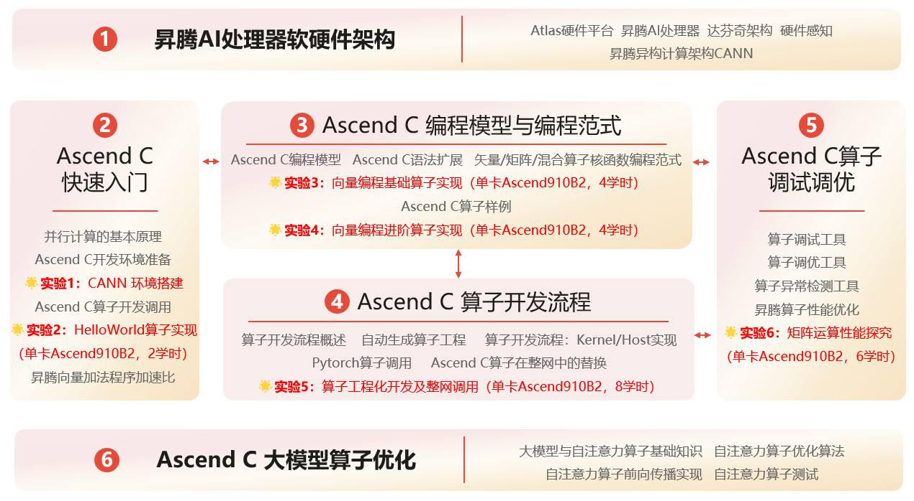

# 华为ICT Ascend C 异构并行程序设计

> [Ascend C概述与学习路径--昇腾社区](https://www.hiascend.com/document/detail/zh/CANNCommunityEdition/910beta3/programug/Ascendcopdevg/docs/guide/入门教程/Ascend-C概述与学习路径.md)
>
> [课程详情](https://e.huawei.com/cn/talent/outPage/#/sxz-course/home?courseId=kBTMLZaV7PcKWw2kvnrYjpnYYu4&pageType=learn&operate=1)
>
> 

