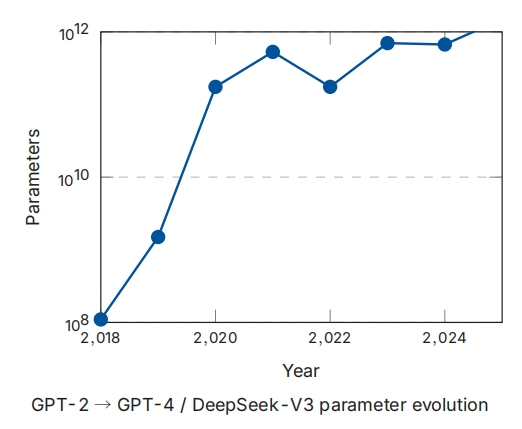
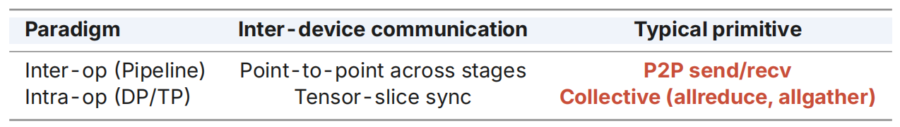
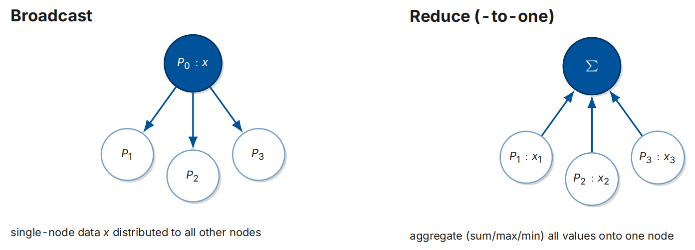
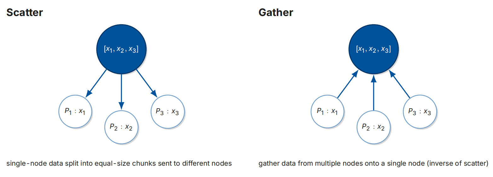
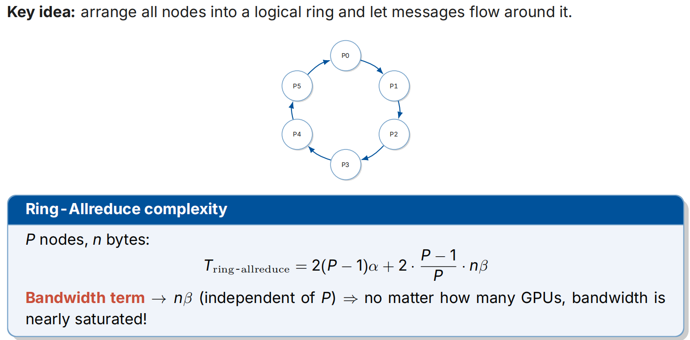
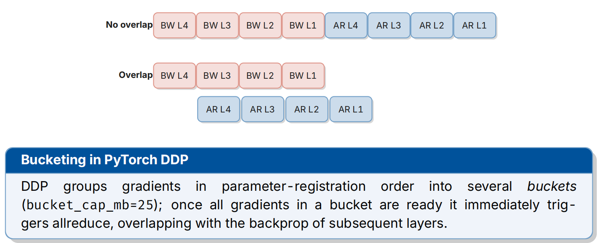

# 11-1.分布式训练

## Why We Need Parallelism & Taxonomy

当前的趋势是：

* 摩尔定律渐渐失效，每个GPU的计算与内存涨势（per-GPU compute/memory）正在减缓

* 每4-6个月，LLM的参数翻倍：GPT-2 (1.5B) → GPT-3 (175B) → GPT-4 / DeepSeek-V3 (671B)
* 内存的需求涨幅远高于每个GPU的内存涨幅

从中可以看出，原先的单个GPU已经不足以容纳一个当前的LLM，因此需要引入**分布式训练（distributed training）**.

modern LLM training包含以下6个并行维度：

* **DP**(Data)：the input *batch* (each GPU holds a full model copy)
* **PP**(Pipeline)：*layers* across GPUs (vertical, inter-op)
* **TP**(Tensor)：*tensors* within a layer (horizontal, intra-op)
* **SP**(Sequence)：LayerNorm/Dropout activations along the *sequence*
* **CP**(Context)：KV / attention along the *sequence* (long context)
* **EP**(Expert)：*experts* across GPUs (MoE)

Parallelsm分成2种：

* **算子间并行（Inter-operator Parallelism）**: different operators (layers) on different devices — 对应 Pipeline

* **算子内并行（Intra-operator Parallelism）**: 用单一运算符切分 —— 对应 Tensor / Data / Sequence / Context / Expert Parallelism

* **Inter-op** splits *across* operators (= PP); **Intra-op** splits *within* operators (= DP/TP/SP/CP/EP)

## Collective Communication

### Communication Model

Communication Model 一共有2种：

* P2P (Point-to-Point)：2个process直接交换信息
* Collective：多个process之间联合通信，成本较高，可以从多个P2P来构建

* 无容错机制：单个挂起进程即可阻塞整个计算集群

* 主流实现方案包括：NCCL（NVIDIA）、MPI、Gloo

**Inter-op 是 P2P**，因为只需要相邻阶段的信息互通；**Intra-op 是Collective**，因为每次操作期间均需同步整个张量 .

### Collective Communication Primitives

#### Broadcast 和 Reduce 机制

它们经常被看做是逆运算，尽管Reduce里面包含的aggregate函数并不是可逆的.

#### Scatter 和 Gather 机制

* Scatter：源节点具有$[x_1,x_2,x_3]$，分发给$P_1$的信息是$x_1$，分发给$P_2$的信息是$x_2$，分发给$P_3$的信息是$x_3$.
* Gather：$P_1$的信息是$x_1$，$P_2$的信息是$x_2$，$P_3$的信息是$x_3$，聚合到根节点形成$[x_1,x_2,x_3]$.

#### Allgather / Reduce-Scatter / Allreduce 机制

这3个是在上面基础上组合出来的，真正用于分布式训练.

* Allgather：每个process各自持有共享的$x_i$，操作后每个process都有$[x_1, \cdots, x_N]$，也就是Gather + Broadcast，是在DP种最常见的范式
* Reduce-Scatter：每个process都有$[x_i^{(1)}, \cdots, x_i^{(N)}]$，操作后 process $k\quad (k = 1, \cdots, N)$的结果各自是$\sum\limits_{i}x_i^{(k)}$，也就是 Reduce + Scatter，是 ZeRO 的关键operator.
* Allreduce：操作后每个process都有$\sum\limits_{i}x_i$，也就是 Reduce + Broadcast 或者 **Reduce-Scatter + Allgather (mathematical foundation of Ring-Allreduce and ZeRO optimizations)**，是 DDP backprop 核心op.

### **Communication Cost Model** 

此处介绍的是LogP / Hockney Model，内容：

> 每次P2P传输的时间可以被近似看成：
> $$
> T = \alpha + n \beta, \quad \beta = \dfrac1B
> $$
> 其中$\alpha$是 fixed setup overhead（固定配置开销），$B$是 link bandwidth（链路带宽），$n$是message size（消息大小，单位为Bytes）.

基于2种现实情况可以做一些近似：

* **Small messages:**$\alpha \gg n \beta$，说明配置开销占主导， 因此目标是降低通信的数量（minimize number of communications (hops)），常用算法是MST.
* **Large messages:**$\alpha \ll n \beta$，说明带宽占主导， 因此目标是最大化聚合操作的带宽，此时就会用到 Ring Algorithm.

在实践中，NCCL 会自动根据message size and topology (NVLink / IB / PCIe)（信息大小和拓扑结构）来选取合适的结构：*Tree/Chain (small)* *→* *Ring (large)* *→* *bidirectional Ring / hierarchical Ring (huge)*.

### Ring Algorithm

核心思想：把所有节点（$P_0, P_1, \cdots, P_5$）排成一个**逻辑环**，每个节点只和它的下一个邻居通信，数据沿着环单向流动，从而避免了所有节点互相通信（All-to-All）带来的巨大通信压力.

算法通常分两个阶段：

1. **Scatter-Reduce**：每个节点把自己的数据切成 $P$ 份，然后进行 $P-1$ 轮传输，每轮把一块数据传给下一个邻居并累加. 轮完之后，每个节点手里都有一块"完整规约好"的数据.
2. **All-Gather**：再进行 $P-1$ 轮传输，把每个节点手里那块"规约好"的数据传播给所有其他节点，最终每个节点都拿到完整的规约结果.

所以总共需要 $2(P-1)$ 轮通信.

开销计算：
$$
T_{\text{ring-allreduce}}=2(P−1) \alpha +2 \dfrac{P}{P−1} \cdot n \beta
$$
其中的Bandwidth term是$2 \dfrac{P}{P−1} \cdot n \beta$，不管有多少个GPU这一项都会饱和.

### Communication-Computation Overlap

Observation：反向传播（backprop）计算和梯度的 Allreduce 通信可以同时进行.

- 反向传播是从最后一层（L4）往前算到第一层（L1）;
- 一旦某一层（比如 L4）的梯度算完了，就不需要等其他层算完，可以**立刻开始传输这一层的梯度**;
- 与此同时，GPU 可以继续计算前一层（L3）的梯度.

也就是说，通信和计算可以并行.

在PyTorch DDP中的实现依赖于bucketing（分桶）：

* 一般设置`bucket_cap_mb=25`，按这个限制将梯度按照参数注册顺序（与backprop顺序同）来切分成桶
* 当某个bucket里所有梯度都计算完成后，DDP 立刻触发这个桶的 Allreduce 通信
* 这个通信过程会和**后续层**（更靠前的层）的反向传播计算**重叠**进行

## Data Parallelism

