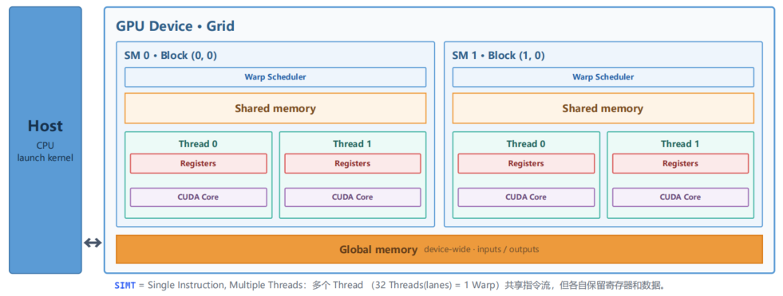

# 10.GPU Programming

## SIMT GPU Architecture

SIMT = Single Instruction Multiple Threads（1个thread = 32个warp），所以 1 个Warp 里的 32 个线程会**同步执行同一条指令**，但每个线程操作的是自己寄存器里的不同数据.

SIMT GPU架构图：

图中最左侧的HOST(CPU)负责启动kernel，本身不参加计算；GPU Device中的每个Grid对应一个CPU启动的kernel；每个Grid中有许多Block.

每个block内部具有的组件：

* Warp Scheduler: 负责调度线程束（warp）的执行顺序，决定哪些线程什么时候跑
* Shared Memory：同一个 Block 内所有线程共享的一块低延迟内存，用于线程间协作和数据交换
* Thread x: Block 内的线程，每个线程有自己独立的 Registers和执行单元 CUDA Core

Global Memory 位于GPU芯片外层，属于**显存**，是整个设备中所有block都能访问的内存，用于Kernel的输入输出数据. 比 Shared Memory 慢很多,但容量大得多

## Tensor Core: From Volta to Blackwell

## Data Movement and Layout

## Tiled GEMM in TileLang

