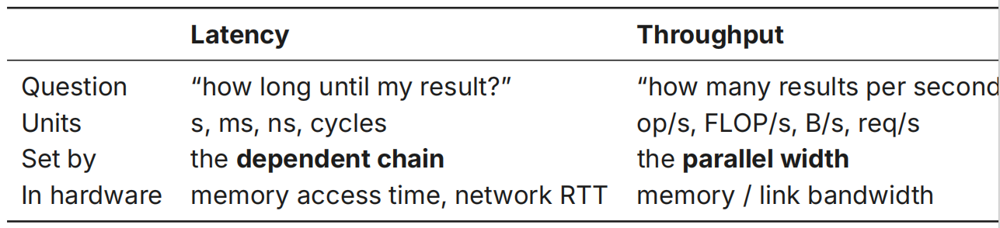
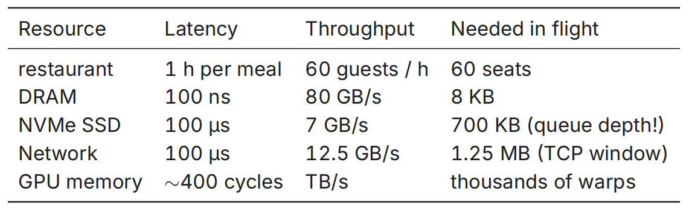
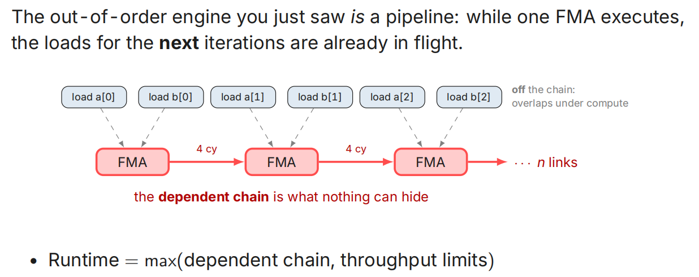
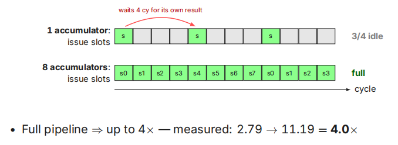
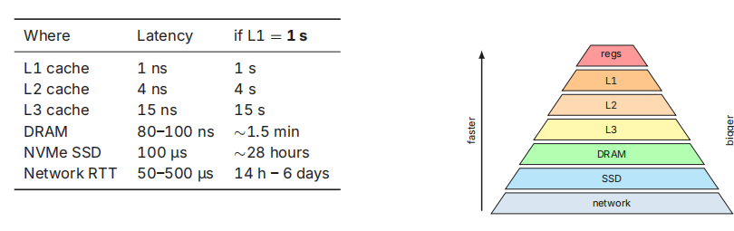
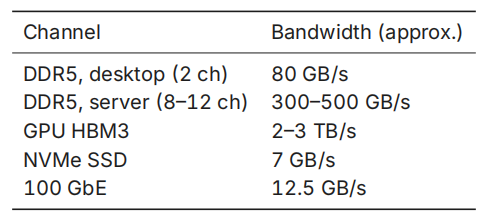

# 8.Performance Profiling

> 2026.7.12，原标题为 **Introduction to Profiling**: Latency, Throughput, and How to Measure Them

这节课贯穿始终的问题是：为什么下面的两段矩阵加法代码效率天差地别？以及，如何做到如此大的优化？

> A. **0.53** GFLOP/s
>
> ```cpp
> for (long i = 0; i < n; i++)
> 	for (long j = 0; j < n; j++)
> 		for (long k = 0; k < n; k++)
> 			C[i * n + j] += A[i * n + k] * B[k * n + j];
> ```
>
> B. **3,170** GFLOP/s，接近6000的speedup!
>
> ```cpp
> cblas_dgemm(CblasRowMajor, CblasNoTrans, CblasNoTrans, n, n, n,
> 		   1.0, A, n, B, n, 0.0, C, n);
> ```

## What is Performance

衡量一个系统的快慢有两个指标：

* Latency：一个operation花费的时间
* Throughput：单位时间内完成的操作数

举个例子，玩FPS时你希望自己每次鼠标点击的延迟能够降低到20ms，这就是Latency；整个服务器能够支持2w玩家同时在线团战，这就是Throughput.

一个耳熟能详的场景是，一辆载满了硬盘的大卡车，此时可以说它具有**enormous** throughput, **terrible** latency.

<center></center>

在这两个参数的基础上，要考察硬件的瞬时承载能力，我们引入了Little's Law：

$$
\text{in-flight} = \text{Throughput} \times \text{Latency}
$$

这可以用一个KFC餐厅来建模理解. 假设每个顾客平均要在店里面吃1h疯狂星期四再离开，且每小时会进来60个顾客，那么所需要的椅子数自然就是

$$
60 \text{guests}/h \times 1h = 60
$$

实际上，Little's Law几乎遍布体系结构的各个地方：

<center></center>

在流水线CPU中，我们做到的事就是，提升Throughput，保持Latency，从而获得了更大的in-flight. 课程中采用的AMX架构也做到了这件事：当一个FMA开始执行时，对下一次iteration的装载已经开始：

<center></center>

Dependency Chain (依赖链)是不会撒谎的，会将完整的运行过程揭露出来.

接下来我们考察以下例子：

```c++
for (long i = 0; i < n; i++) s += a[i] * b[i]; // one chain

for (long i = 0; i < n; i += 8) { // eight chains
    s0 += a[i] * b[i]; s1 += a[i + 1] * b[i + 1];
    /* ... */ s7 += a[i + 7] * b[i + 7];
}
```

上下2种的编译有非常大的速度差距：

```bash
$ gcc {flags} dot1v8.c 			 		1 acc 8 accs
    -O2 						 		2.79 8.48
    -O3 -march=native 			  		 2.79 11.19
    -O2 -ffast-math 			  		 5.56 9.49
    -O3 -march=native -ffast-math  		  11.13 17.88
```

究其原因，FMA单元是一个流水线，Latency = 4cycles，但是每个cycle可以进行一个新的独立op：

<center></center>

我们已经学习过，层次图上越往上，体积越小且latency越少：

<center></center>

而如果从Bandwidth角度来看Memory数据：

<center></center>


## Measuring the Machine


## Profiling the Program
