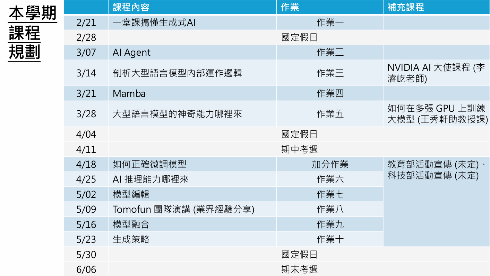

???+ notes "课程信息"

    [网站](https://speech.ee.ntu.edu.tw/~hylee/ml/2025-spring.php)

    

    > 本課程真實的名字：通用AI模型時代下的機器學習
    >
    > 課程核心：在已經有通用AI模型的情況下，如何持續訓練這些通用模型
    >
    > 課程特色：最前沿的技術；全新的上課內容、全新的作業