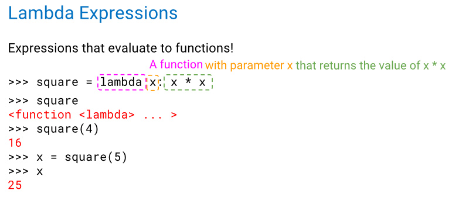

> 记录了lec1-6的零碎内容.

??? tips "hw与lab运行方式"

    lab-Test:

    ```wsl
    $ python ok -q q1 -u # 或者q2, q3, etc.
    ```

    lab/hw-Problem:

    测试全部：

    ```wsl
    $ python ok --local
    ```

    测试单个函数：

    ```wsl
    $ python ok -q <func name> --local
    ```

* `and`/`or`: 如果第一个为`False`/`True`则短路，否则直接返回后者.

* lambda expression: 
    <center></center>
    
* When is the return expression of a lambda expression executed?
    **When the function returned by the lambda expression is called.**

* Which of the following statements describes a difference between a def statement and a lambda expression?
    **A lambda expression does not automatically bind the function object that it returns to an intrinsic name.**

* 写出这段程序的输出：
    ```python
    >>> b = lambda x: lambda: x
    >>> c = b(88)
    >>> c
    <function <lambda>.<locals>.<lambda> at 0x7866b5acca40>
    >>> c()
    88
    ```

    实际上，这是一种嵌套式的调用，改写成def如下：
    ```python
    >>> def f(x):
    ...     def g(y):
    ...         return x
    ```

* lambda函数的调用传参：
    ```python
    >>> higher_order_lambda = lambda f: lambda x: f(x)
    >>> g = lambda x: x * x
    >>> higher_order_lambda(2)(g)
    ? Error
    >>> higher_order_lambda(g)(2)
    ? 4
    ```

* 参数传递的遮蔽
    ```python
    >>> a = lambda x: x * 2 + 1
    >>> def b(b, x):
    ...     return b(x + a(x))
    >>> x = 3
    >>> b(a, x)
    21
    ```

    在函数内部，参数 b 会遮蔽（shadow）外部的函数名 b，因此相当于调用了2次函数a，导致结果上是嵌套函数.

* lab02的最后一个任务：
    ```python
    def minimal_root(n, f):
        """
        Return the smallest k such that k is a root of f with 0 <= k <= n.
        If no such k exists, return n + 1

        >>> minimal_root(6, lambda x: x) # f(0) = 0
        0
        >>> minimal_root(6, lambda x: x * x - 5 * x + 6) # f(2) = 0, f(3) = 0
        2
        >>> minimal_root(6, lambda x: x * x + 1) # no roots
        7
        """
        # return next((k for k in range(n+1) if f(k) == 0), n+1)
        return n+1 if (product_of_trigger(n,f) == 1) else minimal_root(n-1,f)
    ```