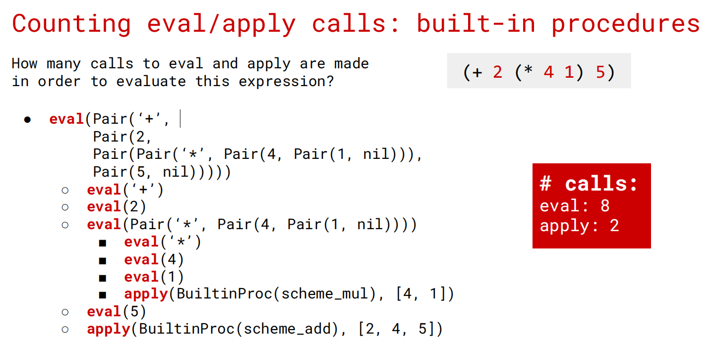
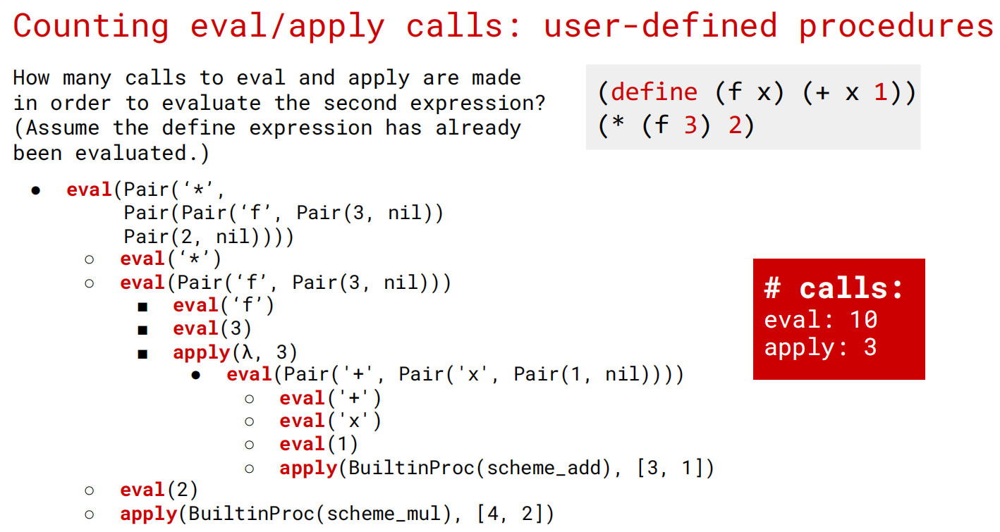

## 特殊函数：`str`, `__repr__`

When we define a class in Python, __str__ and __repr__ are both built-in methods for the class.

We can call those methods using the global built-in functions str(obj) or repr(obj) instead of dot notation, obj.__repr__() or obj.__str__().

In addition, the print() function calls the __str__ method of the object, while simply calling the object in interactive mode calls the __repr__ method.

Here's an example:

```python
class Rational:

    def __init__(self, numerator, denominator):
        self.numerator = numerator
        self.denominator = denominator

    def __str__(self):
        return f'{self.numerator}/{self.denominator}'

    def __repr__(self):
        return f'Rational({self.numerator},{self.denominator})'
```

```bash
>>> a = Rational(1, 2)
>>> str(a)
'1/2'
>>> repr(a)
'Rational(1,2)'
>>> print(a)
1/2
>>> a
Rational(1,2)
```

In lab01 we have learnt that, when dealing with string values, print and return behaves differently for the same string. For example:

```bash
>>> def using_print():
...     print('hello')
...
>>> def using_return():
...     return 'hello'
...
>>> using_print()
hello
>>> using_return()
'hello'
```

For using_print('hello'), print will first call the __str__ method of its argument (str('hello')) to obtain its human-readable form. When the resulting human-readable form 'hello' is obtained, print displays its contents to the terminal, which is hello.

For using_return('hello'), this expression evaluates to a string value, which is 'hello'. Since we are in the interactive mode, Python will call the __repr__ method of 'hello' (repr('hello')) to obtain its computer-readable form for debugging and development. When the resulting computer-readable form "'hello'" is obtained (note the number of quotes appeared), Python displays the contents of the resulting string to the terminal, which gives 'hello'.

Simply put, print(x) displays the contents of str(x), whereas evaluating x in the interactive terminal is roughly equivalent to print(repr(x)).

## Linked List / Tree (OOP)

需要积累lab7中用于简化的reverse语法以及sort的关键字传入参数.

???+ tips "lab7"

    ```python
    """ Lab 07: Special Method, Linked Lists and Mutable Trees """
    
    # ANSWER QUESTION q1
    
    # ANSWER QUESTION q2
    
    # ANSWER QUESTION q3
    
    #####################
    # Required Problems #
    #####################
    
    class Complex:
        """Complex Number.
    
        >>> a = Complex(1, 2)
        >>> a
        Complex(real=1, imaginary=2)
        >>> print(a)
        1 + 2i
        >>> b = Complex(-1, -2)
        >>> b
        Complex(real=-1, imaginary=-2)
        >>> print(b)
        -1 - 2i
        >>> print(a + b)
        0
        >>> print(a * b)
        3 - 4i
        >>> print(a)
        1 + 2i
        >>> print(b)
        -1 - 2i
        """
        def __init__(self, real, imaginary):
            self.real = real
            self.imaginary = imaginary
        
        def __add__(self, other):
            t = Complex(self.real, self.imaginary)
            t.real += other.real
            t.imaginary += other.imaginary
            return t
    
        def __mul__(self, other):
            t = Complex(0,0)
            t.real = self.real * other.real - self.imaginary * other.imaginary
            t.imaginary = self.imaginary * other.real + other.imaginary * self.real
            return t
        
        def __repr__(self):
            return f"Complex(real={self.real}, imaginary={self.imaginary})"
            
        def __str__(self):
            if self.real == 0 & self.imaginary == 0:
                return "0"
            elif self.real == 0:
                return f"{self.imaginary}i"
            elif self.imaginary == 0:
                return f"{self.real}"
            else:
                res = f"{self.real}"
                if self.imaginary > 0:
                    res += (f" + {self.imaginary}i")
                else:
                    res += (f" - {-self.imaginary}i")
            return res
    
    def store_digits(n):
        """Stores the digits of a positive number n in a linked list.
    
        >>> s = store_digits(0)
        >>> s
        Link(0)
        >>> store_digits(2345)
        Link(2, Link(3, Link(4, Link(5))))
        >>> store_digits(8760)
        Link(8, Link(7, Link(6, Link(0))))
        """
        digits = str(n)
        res = Link.empty
        for i in reversed(digits): # link需要倒序进行append
            res = Link(int(i), res)
        
        return res


    def convert(link):
        """Convert a linked list to a Python list.
    
        >>> l = Link(Link(Link(1, Link(Link(2, Link(3)), Link(4))), Link(5)))
        >>> print(l)
        <<<1 <2 3> 4> 5>>
        >>> convert(l)
        [[[1, [2, 3], 4], 5]]
        >>> type(convert(l)) is list
        True
        """
        res = []
        if link == Link.empty:
            return res
        
        if isinstance(link.first, Link): # 跟样例一致，first是Link，所以递归处理；否则直接添加
            res.append(convert(link.first))
        else:
            res.append(link.first)
            
        if link.rest != Link.empty:
            res.extend(convert(link.rest))
        
        return res
    
    def cumulative_mul(t):
        """Mutates t so that each node's label becomes the product of all labels in
        the corresponding subtree rooted at t.
    
        >>> t = Tree(1, [Tree(3, [Tree(5)]), Tree(7)])
        >>> cumulative_mul(t)
        >>> t
        Tree(105, [Tree(15, [Tree(5)]), Tree(7)])
        """
        if t.is_leaf():
            return t
        for b in t.branches:
            cumulative_mul(b)
            t.label *= b.label
        # return t      令人困惑的是样例点不让我返回t，注释掉这行才能过
​        
​    def prune(t, n):
​        """Prune the tree mutatively, keeping only the n branches
​        of each node with the smallest label.
​    
​        >>> t1 = Tree(6)
​        >>> prune(t1, 2)
​        >>> t1
​        Tree(6)
​        >>> t2 = Tree(6, [Tree(3), Tree(4)])
​        >>> prune(t2, 1)
​        >>> t2
​        Tree(6, [Tree(3)])
​        >>> t3 = Tree(6, [Tree(1), Tree(3, [Tree(1), Tree(2), Tree(3)]), Tree(5, [Tree(3), Tree(4)])])
​        >>> prune(t3, 2)
​        >>> t3
​        Tree(6, [Tree(1), Tree(3, [Tree(1), Tree(2)])])
​        """
​        if t.is_leaf():
​            return
​        t.branches.sort(key=lambda x: x.label) # 按照label排序, 这里用按照key=label排序的语法
​        t.branches = t.branches[:n] # 只保留前n个
​        for b in t.branches:
​            prune(b, n)


    #####################
    #        ADT        #
    #####################
    
    class Link:
        """A linked list.
    
        >>> s = Link(1)
        >>> s.first
        1
        >>> s.rest is Link.empty
        True
        >>> s = Link(2, Link(3, Link(4)))
        >>> s.first = 5
        >>> s.rest.first = 6
        >>> s.rest.rest = Link.empty
        >>> s                                    # Displays the contents of repr(s)
        Link(5, Link(6))
        >>> s.rest = Link(7, Link(Link(8, Link(9))))
        >>> s
        Link(5, Link(7, Link(Link(8, Link(9)))))
        >>> print(s)                             # Prints str(s)
        <5 7 <8 9>>
        """
        empty = ()
    
        def __init__(self, first, rest=empty):
            assert rest is Link.empty or isinstance(rest, Link)
            self.first = first
            self.rest = rest
    
        def __repr__(self):
            if self.rest is not Link.empty:
                rest_repr = ', ' + repr(self.rest)
            else:
                rest_repr = ''
            return 'Link(' + repr(self.first) + rest_repr + ')'
    
        def __str__(self):
            string = '<'
            while self.rest is not Link.empty:
                string += str(self.first) + ' '
                self = self.rest
            return string + str(self.first) + '>'
    ```
    
    ```python
    class Tree:
        """
        >>> t = Tree(3, [Tree(2, [Tree(5)]), Tree(4)])
        >>> t.label
        3
        >>> t.branches[0].label
        2
        >>> t.branches[1].is_leaf()
        True
        """
    
        def __init__(self, label, branches=[]):
            for b in branches:
                assert isinstance(b, Tree)
            self.label = label
            self.branches = list(branches)
    
        def is_leaf(self):
            return not self.branches
    
        def __repr__(self):
            if self.branches:
                branch_str = ', ' + repr(self.branches)
            else:
                branch_str = ''
            return 'Tree({0}{1})'.format(self.label, branch_str)
    
        def __str__(self):
            def print_tree(t, indent=0):
                tree_str = '  ' * indent + str(t.label) + "\n"
                for b in t.branches:
                    tree_str += print_tree(b, indent + 1)
                return tree_str
    
            return print_tree(self).rstrip()
    ```

## Class attribute v.s. Instance attribute

The statement "all instances of a class share the same values of the data attributes in the class" is True only for class attributes, but False for instance attributes.

Class attributes 直接在class体内定义，在任何实例中共享. **Changing a class attribute affects all instances that have not overridden it. 并且改变class attribute之后所有实例的这个变量都会被修改.**

Instance attributes, 一般在方法内定义（如`__init__`中）. Each object gets its own copy of these attributes, so changes affect only that specific instance.

举例：

```python
class Person:
   # Class attribute (shared)
   species = "Homo sapiens"
   def __init__(self, name):
       # Instance attribute (unique per object)
       self.name = name
# Instances
p1 = Person("Alice")
p2 = Person("Bob")
# Accessing shared class attribute
print(p1.species) # Homo sapiens
print(p2.species) # Homo sapiens
# Modifying class attribute
Person.species = "Human"
print(p1.species) # Human
print(p2.species) # Human
# Modifying instance attribute
p1.name = "Alicia"
print(p1.name) # Alicia
print(p2.name) # Bob
```

## Scheme

???+ info "资料"

    To run a Scheme program interactively, type `python scheme -i <file.scm>`.
    
    You may find it useful to try [code.cs61a.org/scheme](https://code.cs61a.org/scheme) when working through problems, as it can draw environment and box-and-pointer diagrams and it lets you walk your code step-by-step (similar to Python Tutor).

Scheme 是 Lisp 的一种方言. 而其母语言Lisp被评价为：

> "The greatest single programming language ever designed."
>
> -Alan Kay, co-inventor of Smalltalk and OOP

### Scheme表达式的两种类型：

1. **原子表达式（Atomic Expressions）**

    - 自求值：数字（3, 5.5, -10）、布尔值（#t, #f）

    - 符号：绑定到值的名称（+, modulo, list, x）

2. **组合表达式（Combinations）**

    语法格式：`(<operator> <operand1> <operand2> …)`

    分为两类：

    - **调用表达式**（Call Expressions）

    - **特殊形式**（Special Forms）

### 调用表达式：

**求值规则：**

1. 求值操作符，得到一个过程
2. 从左到右求值所有操作数
3. 将过程应用于参数

**示例：**

```scheme
(quotient 10 2)          ; 结果：5
(+ (* 3 4) 5)            ; 先算 3*4=12，再算 12+5=17
```

### 特殊形式表达式：

1. **define - 定义变量或函数**

    **定义变量：**

    ```scheme
    (define x (+ 3 4))       ; x绑定到7
    ```

    **定义函数：**

    ```scheme
    (define (square x) (* x x))
    ```

2. **if - 条件控制**

    语法：`(if <predicate> <if-true> <if-false>)`

    **关键点：** 只有 `#f` 是假值，其他所有值（包括0）都是真值！

    ```scheme
    (if #t 3 5)              ; 结果：3
    (if 0 (+ 1 0) (/ 1 0))   ; 结果：1（0是真值！）
    ```

3. **lambda - 匿名函数**

    语法：`(lambda (<param1> <param2> …) <body>)`

    ```scheme
    ((lambda (x) (* x x)) 5)  ; 结果：25
    ```

    **等价写法：**

    ```scheme
    ; 这两种写法完全等价
    (define (plus4 x) (+ x 4))
    (define plus4 (lambda (x) (+ x 4)))
    ```

### 实例分析

例1：阶乘函数

```scheme
(define (fact n)
  (if (<= n 1)
      1
      (* n (fact (- n 1)))))
```

- 基础情况：$n≤1$ 时返回 1
- 递归情况：返回 n × fact(n-1)

例2：计数函数

```scheme
(define (count-up n)
  (define (counter k)
    (print k)
    (if (< k n)
        (counter (+ k 1))))
  (counter 1))
```

使用辅助函数 `counter` 来跟踪当前数字

### 重要特点

1. **没有迭代结构** - 必须使用递归
2. **前缀表示法** - 操作符在前：`(+ 1 2)` 而非 `1 + 2`
3. **隐式返回** - 函数体最后一个表达式的值自动返回
4. **括号驱动** - 所有操作都用括号包裹

### 练习

```scheme
(define x 5)                        ; x
(lambda (x y) (print 2))            ; (lambda (x y) (print 2))
((lambda (x) (print x)) 1)          ; 打印1，无返回值
(define f (lambda () #f))           ; f
(if f x (+ x 1))                    ; 5（f本身是真值）
(if (f) (print 5) 6)                ; 6（f()返回#f）
(+ (if 1 2 3) (if 4 5 6))          ; 7（2+5）
```

### Tail Recursion

> [Resource: hw08-2](https://sicp.pascal-lab.net/2025/homework/hw08/2_1.html)

## Scheme More

### 对（Pairs）和列表（Lists）

1. **对（Pairs）的基础**

    **核心操作**：`cons`：构造对；`car`：获取第一个元素；`cdr`：获取第二个元素

    **示例**：

    ```scheme
    scm> (define x (cons 1 (cons 3 nil)))
    x
    scm> x
    (1 3)
    scm> (car x)
    1
    scm> (cdr x)
    (3)
    ```

    

2. **列表（Lists）**

    Scheme 中的序列只有一种：**链表**，用多个 `cons` 表达式创建，`nil` 表示空列表

    **示例**：

    ```scheme
    scm> (cons 1 (cons 2 nil))
    (1 2)
    
    scm> (define x (cons 1 (cons 2 nil)))
    scm> x
    (1 2)
    
    scm> (car x)
    1
    
    scm> (cdr x)
    (2)
    
    scm> (cons 1 (cons 2 (cons 3 (cons 4 nil))))
    (1 2 3 4)

------

### 符号编程（Symbolic Programming）

核心问题：**符号通常引用值，那么如何直接引用符号本身？**

1. **不使用引号**

```scheme
scm> (define a 1)
scm> (define b 2)
scm> (list a b)
(1 2)  ; 看不到 a 和 b 本身！
```

2. **使用引号（Quotation）**

    **单引号 `'` 是特殊形式**：表示表达式本身就是值，不进行求值。

    ```scheme
    scm> (list 'a 'b)
    (a b)  ; 现在得到符号本身
    
    scm> (list 'a b)
    (a 2)  ; 'a 是符号，b 被求值
    ```

    **等价形式**：

    ```scheme
    'a      ≡  (quote a)
    '(a b)  ≡  (quote (a b))
    ```

3. **对组合表达式使用引号**

    **引号可以应用于整个列表**：

    ```scheme
    scm> '(a b c)
    (a b c)
    
    scm> (car '(a b c))
    a
    
    scm> (cdr '(a b c))
    (b c)
    ```

**理解**：

- `'(a b c)` 创建一个包含三个符号的列表
- 不会对 `a`、`b`、`c` 求值
- 列表本身就是值

### 尾递归（Tail Recursion）

1. **Python 中的递归 vs 迭代**

    递归版本（非尾递归）

    ```python
    def rfactorial(n):
        if n == 0:
            return 1
        else:
            return n * rfactorial(n - 1)
    ```

    - **乘法操作**：n 次

    - **栈帧数量**：n 个

2. 迭代版本

    ```python
    def ifactorial(n):
        total = 1
        while n > 0:
            total *= n
            n -= 1
        return total
    ```

    - **乘法操作**：n 次

    - **栈帧数量**：1 个（常数）

2. **尾递归的定义**

    **尾上下文（Tail Context）**：表达式是函数调用中**最后一步**求值的，求值后不再执行其他操作

    **尾调用（Tail Call）**：在尾上下文中的函数调用

    **尾递归（Tail Recursive）**：尾调用调用自身，支持尾调用优化的语言中，只会使用**常数个栈帧**

3. **识别尾上下文**：判断哪些表达式在尾上下文中

    ```scheme
    (and expr1 expr2 expr3)
    ; expr3 在尾上下文（最后求值）
    ; expr1, expr2 不在（可能短路）
    
    (if expr1 expr2 expr3)
    ; expr2 和 expr3 在尾上下文
    ; expr1 不在（需要先求值判断）
    
    (+ expr1 expr2)
    ; 都不在（求值后还要相加）
    
    ((lambda (expr1) expr1) expr2)
    ; lambda 的 body 中的 expr1 在尾上下文
    ; expr2 不在（需要先求值作为参数）
    ```

4. **非尾递归 vs 尾递归**

    非尾递归阶乘

    ```scheme
    (define (fact n)
      (if (= n 0)
          1
          (* n (fact (- n 1)))))  ; 递归后还要乘 n
    ```

    **执行过程**（计算 `(fact 4)`）：

    ```text
    f1: fact, n: 4, rv: ?
      f2: fact, n: 3, rv: ?
        f3: fact, n: 2, rv: ?
          f4: fact, n: 1, rv: ?
            f5: fact, n: 0, rv: 1
          rv: 1
        rv: 2
      rv: 6
    rv: 24
    ```

    需要保持所有帧，因为每个调用返回后还要执行乘法！

    尾递归阶乘

    ```scheme
    (define (fact n)
      (define (fact-tail n result)
        (if (<= n 1)
            result
            (fact-tail (- n 1) (* n result))))  ; 最后一步就是递归调用
      (fact-tail n 1))
    ```

    **执行过程**（计算 `(fact 4)`）：

    ```text
    f1: fact-tail, n: 4, result: 1
      → 调用 (fact-tail 3 4)
      
    f2: fact-tail, n: 3, result: 4
      → 调用 (fact-tail 2 12)
      
    f3: fact-tail, n: 2, result: 12
      → 调用 (fact-tail 1 24)
      
    f4: fact-tail, n: 1, result: 24
      → 返回 24
    ```

    **关键**：栈帧数量固定，不随输入增长！

5. **编写尾递归函数的步骤**

    步骤 1：识别非尾递归调用，找出不在尾上下文的递归调用，尾上下文包括：

    - lambda 函数体的最后一个子表达式

    - `if` 的 consequent 和 alternative（如果 if 本身在尾上下文）

    - `and`、`or`、`begin`、`let` 的最后一个子表达式

        步骤 2：创建辅助函数，使用累加器参数来保存中间计算结果

6. **示例：链表长度**

    非尾递归版本

    ```scheme
    (define (length lst) 
      (if (null? lst)
          0
          (+ 1 (length (cdr lst)))))  ; 递归后还要加 1
    ```

    尾递归版本

    ```scheme
    (define (length-tail lst)
      (define (helper lst count)
        (if (null? lst)
            count
            (helper (cdr lst) (+ count 1))))  ; 累积在参数中
      (helper lst 0))
    ```

    **测试**：

    ```scheme
    scm> (length '())
    0
    scm> (length '(1 2 (3 4)))
    3
    ```

    

## Interpreter (解释器)

是一个执行translation这一步骤的工具，将编程语言转化成01串.

Interpreter涉及两种语言：

1. **The language being interpreted/implemented.** 被解释/实现的语言（lab09中需要实现的是PyCombinator）

2. **The underlying implementation language.** 底层实现语言（lab09中使用的是Python来实现PyCombinator）

底层语言不必与被实现语言不同。实际上，在lab09中是使用 Python 来实现一个 Python 的小版本（PyCombinator）.这种思想被称为元循环求值.

完成以下三件事（称作REPL，即Read-Eval-Print Loop）：

1. read，即读取所有的输入
2. evaluate，将input变成computer readable，再evaluate the result
3. print the result for the user

组合图：

```text
         +-------------------------------- Loop -----------+
         |                                                 |
         |  +-------+   +--------+   +-------+   +-------+ |
Input ---+->| Lexer |-->| Parser |-->| Eval  |-->| Print |-+--> Output
         |  +-------+   +--------+   +-------+   +-------+ |
         |                              ^  |               |
         |                              |  v               |
         ^                           +-------+             v
         |                           | Apply |             |
         |    REPL                   +-------+             |
         +-------------------------------------------------+

```

### Read

有两个部件用于分析input：

* Lexical Analysis (Lexer，即词法分析器): 将input 变成一堆token，如literals, names, keywords, delimiters

* Syntactic Analysis (Parser，即语法分析器): 将这些token变成expr呈现（指定某种语言）

在Scheme解释器中，用Python的`Pair`对象来表示Scheme的链表

### Eval

eval和apply相互递归调用

Eval的规则：

- 自求值表达式（数字、布尔）→ 直接返回自身
- 符号 → 在当前环境中查找，找不到就去父帧，直到全局帧
- 调用表达式 → 先 eval 运算符，再 eval 各操作数，最后 apply

两种过程的 Apply：

- 内置过程（如 `+`、`list`）：直接调用对应的 Python 函数

- 用户定义过程

    （lambda）：

    1. 新建一个帧，父帧 = 该过程定义时的帧
    2. 将形参绑定到实参
    3. 在新帧中求值函数体

帧（Frame）由 `bindings`（字典）和 `parent`（父帧）组成，形成一条查找链。

举例：





## Macro

假设现在想写 `(double (print 2))`，即让 `(print 2)` 执行两次，此时用普通函数不行，因为调用函数前，参数已经被求值了（print 只会执行一次）.

**宏的解决方案：**

```scheme
(define-macro (twice expr)
  (list 'begin expr expr))
```

调用 `(twice (print 2))` 时，宏不对 `(print 2)` 求值，而是直接将其作为数据传入，返回 `(begin (print 2) (print 2))`，再对这个新表达式求值.


求值顺序：

| 步骤 | 普通函数             | 宏                             |
| ---- | -------------------- | ------------------------------ |
| 1    | 求值运算符           | 求值运算符                     |
| 2    | **对操作数求值**     | **不求值操作数，直接传入**     |
| 3    | apply 到求值后的参数 | apply 到原始表达式，得到新代码 |
| 4    | —                    | **在原环境中求值返回的代码**   |

### 准引用（Quasiquote）

写宏时频繁用 `list` 来构造代码很繁琐，**准引用**提供了更简洁的写法：

- `（反引号）= quasiquote，整体作为字面量
- `,`（逗号）= unquote，插入该位置被求值的结果

>  一句话总结： **' = 全部原样；  ` = 大部分原样，,expr 会被求值并插入。**

```scheme
scm> +
#[+]

scm> list
#[list]

scm> (define-macro (f x) (car x))
f

scm> (f (2 3 4)) ; type SchemeError for error, or Nothing for nothing
2

scm> (f (+ 2 3))
#[+]

scm> (define x 2000)
x

scm> (f (x y z))
2000

scm> (f (list 2 3 4))
#[list]

scm> (f (quote (2 3 4)))
SchemeError

scm> (define quote 7000)
quote

scm> (f (quote (2 3 4)))
7000

scm> (define-macro (g x) (+ x 2))
g

scm> (g 2) ; Note '2 = 2
4

scm> (g (+ 2 3))
SchemeError

scm> (define-macro (h x) (list '+ x 2))
h

scm> (h (+ 2 3))
7 
; 解释：自动带入展开，得到 (+ (+ 2 3) 2) ，求出来就是7

scm> (define-macro (if-else-5 condition consequent) `(if ,condition ,consequent 5))
if-else-5

scm> (if-else-5 #t 2)
2
; 解释：if(condition): consequence else: 5

scm> (if-else-5 #f 3)
5

scm> (if-else-5 #t (/ 1 0))
SchemeError

scm> (if-else-5 #f (/ 1 0))
5

scm> (if-else-5 (= 1 1) 2)
2

scm> '(1 x 3)
(1 x 3)

scm> (define x 2)
2

scm> `(1 x 3)
(1 x 3) ; 不会变，x = 2 不会被代入进去

scm> `(1 ,x 3) ; Note ,2 = 2
(1 2 3) ; 会变，,x被自动取为2了
;; (x前面加了逗号就是取出对应值，否则看作不变的字母；如果x出现在运算中则自动视为数字)

scm> '(1 ,x 3)
(1 (unquote x) 3) ; 解释：'会阻止所有的求值，把后面的东西都当成字面量，所以 ,x 是 unquote x

scm> `(,1 x 3)
(1 x 3)

scm> `,(+ 1 x 3)
6

scm> `(1 (,x) 3)
(1 (2) 3)

scm> `(1 ,(+ x 2) 3)
(1 4 3)

scm> (define y 3)
y

scm> `(x ,(* y x) y)
(x 6 y)
; x y都是字面量，但算式会求出值

scm> `(1 ,(cons x (list y 4)) 5)
(1 (2 3 4) 5)
```

## SQL

一些简单的SQL语法.

### 创建

```sql
CREATE TABLE parents AS
	SELECT "delano" AS parent, "herbert" AS child UNION
    SELECT "abraham", "barack" UNION
    SELECT "abraham", "clinton" UNION
    SELECT "fillmore", "abraham" UNION
    SELECT "fillmore", "delano" UNION
    SELECT "fillmore", "grover" UNION
    SELECT "eisenhower", "fillmore";
```

### 选择

格式：

```sql
SELECT [列名/表达式] FROM [表名] WHERE [条件] ORDER BY [列名] ASC/DESC LIMIT [数量];
```

* `ORDER BY`是 排序（ASC 升序，DESC 降序）

* `LIMIT`：限制返回行数

`SELECT`也支持算术运算：

```sql
SELECT table, single + 2 * couple AS total FROM restaurant;
```

多表连接（`JOIN`）：

把多张表用逗号放在 FROM 后面，SQL 会产生所有行的**笛卡尔积**（每张表的每行互相组合）

```sql
SELECT parent FROM parents, dogs 
WHERE child = name AND fur = "curly";
```

`WHERE child = name` 就是**连接条件**，把两张表中有意义的行对应起来

自连接与别名 (Aliasing)：

```sql
SELECT a.child AS first, b.child AS second 
FROM parents AS a, parents AS b 
WHERE a.parent = b.parent AND a.child < b.child;
```

`a.child < b.child` 是为了去除重复的兄弟对（比如 (barack, clinton) 和 (clinton, barack) 只保留一个）

字符串拼接：用`||`拼接字符串

```sql
SELECT name || "dog" FROM dogs;
-- 输出：abraham dog, barack dog, ...
```


### 聚合函数（Aggregation）

对一组行进行处理，而不是逐行处理：

```sql
SELECT AVG(age) AS avg_age FROM dogs;
SELECT COUNT(*) AS count FROM dogs
```

| 函数         | 作用   |
| ------------ | ------ |
| `MAX(col)`   | 最大值 |
| `MIN(col)`   | 最小值 |
| `AVG(col)`   | 平均值 |
| `COUNT(col)` | 计数   |
| `SUM(col)`   | 求和   |

!：这两个是算术函数，不是聚合函数：

| `POWER(num1, num2)` | 求幂   |
| ------------------- | ------ |
| `SQRT(number)`      | 开根号 |

### 分组（`GROUP BY`）

按某一列的值对行进行分组，再对每个组进行聚合：

```sql
SELECT fur, AVG(age) AS avg_age FROM dogs GROUP BY fur;
```

各种毛发类型各一行，显示改组的平均年龄（fur是条件，可以被任意表达式取代）.

### `HAVING`过滤

`WHERE`过滤行，`HAVING`过滤组：

```sql
SELECT fur, AVG(age) AS avg_age 
FROM dogs 
GROUP BY fur 
HAVING COUNT(*) > 1;
```

只保留狗数量超过 1 只的毛发类型。

完整的 SELECT 子句顺序是：

`SELECT → FROM → WHERE → GROUP BY → HAVING → ORDER BY → LIMIT`

### 增改删除

空表创建：

```sql
CREATE TABLE dogs(name, fur, phrase DEFAULT 'woof');
```

删除表（`DROP`）：

```sql
DROP TABLE IF EXISTS dogs;
```

插入行（`INSERT`）：（没有指定的列使用默认值）

```sql
INSERT INTO dogs(name, fur) VALUES('fillmore', 'curly');
```

更新行（`UPDATE` `SET`）：

```sql
UPDATE dogs SET phrase = 'WOOF' WHERE fur = 'curly';
```

删除行（`DELETE`）：

```sql
DELETE FROM dogs WHERE fur = 'curly' AND phrase = 'WOOF';
```

## Project 04: Scheme Interpreter

task5:

```scheme
>>> expr = Pair(Pair('+', Pair('x', Pair(2, nil))), nil)
>>> do_quote_form(expr, global_frame) # Make sure to use Pair notation
? Pair('+', Pair('x', Pair(2, nil)))

scm> (cdr '(1 2))
? (2)

scm> (cons 'car '('(4 2)))
? (car (quote (4 2))
; '(4 2)化成 quote (4 2), '(quote (4 2))化成
```

task9:

```scheme
scm> (define outer-func (lambda (x y)
....   (define inner (lambda (z x)
....     (+ x (* y 2) (* z 3))))
....   inner))
? outer-func
-- OK! --

scm> ((outer-func 1 2) 1 10)
? 17
```

先接受`x = 1, y = 2`，但外层的 `x=1` 被内层 `x` **遮蔽**，不再有用，只捕获了`y = 2`，然后计算出x = 10传入

task12:

```scheme
scm> (define (zero) 0)
zero
```

这里的`zero`是一个无参数函数，因此返回函数名字.

task13:

```scheme
scm> (cond ((= 1 1))
....       ((= 4 4) 'huh)
....       (else 'no))
? #t
```

只有条件没有结果的时候，如果条件为真，则返回真，后面的部分不执行.

eg.

```scheme
(cond ((= 1 1)))           ; => #t   （返回条件本身）
(cond ((= 1 1) 'yes))      ; => yes  （返回指定的值）
(cond ((+ 1 1)))            ; => 2   （返回条件本身，这里是 2）
```

```scheme
(cond ((print-and-false 'cond1))
       ((print-and-false 'cond2))
       ((print-and-true 'cond3))
       ((print-and-false 'cond4)))
cond1
cond2
cond3
#t
```

let是临时的binding，在let其他地方调用到x时输出的是全局的x：

```scheme
scm> (define x 5)
x
scm> (define y 'bye)
y
scm> (let ((x 42)
           (y (* x 10)))  ; this x refers to the global value of x, not 42
       (list x y))
(42 50)
scm> (list x y)
(5 bye)
```

