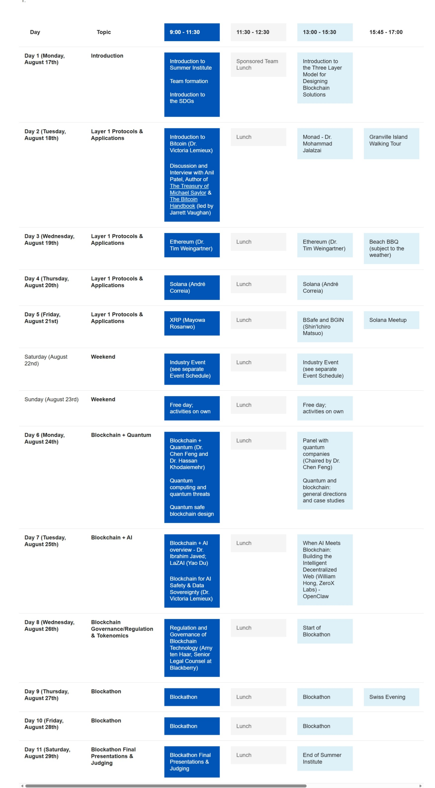

# UBC Blockchain Summer Institute 2026

依托 University of British Columbia 的 [Blockchain@UBC](https://blockchain.ubc.ca/) 实验室进行的暑期交流活动，为浙江大学计算机学院统一组织前往.

???+ info "课程信息"

    [官方网站](https://blockchain.ubc.ca/education-programs/blockchainubc-summer-institute/summer-institute-2026)

    课程日历：

    

