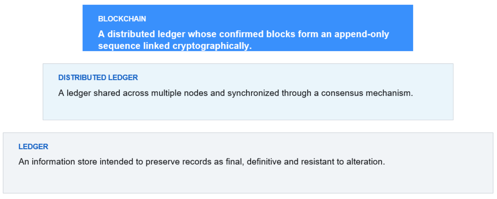

# Introduction & Foundations of Blockchain

> Dr. Victoria Lemieux
>
> Feel free to ask questions.

## Intro to Blockchain Technology

在进入区块链的阐述之前，首先需要明确几个概念：

> * ledger: 或许可翻译成“账本”，定义是 An information store intended to preserve records as final, definitive and resistant as alteration.
>
> * distributed system: 
>
>     

ISO 22739是国际间对区块链做的规范，它将 blockchain 置于 ledger concepts 的层次中.

## 

