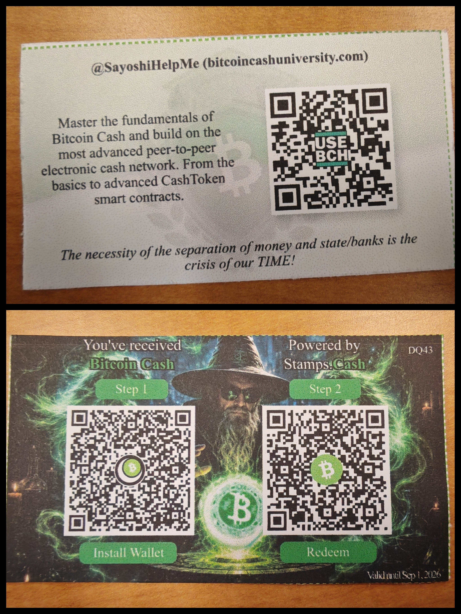

# Bitcoin

> Original Paper: 

## Bitcoin Through the 3-Layer Model

## UTXO Smart Contracts on Bitcoin Cash

一个很有意思的Engineer，slides上是宝可梦一类的小动物搭配着bitcoin，虽然他讲了什么我完全没听懂（），只大概知道讲了点BCH的东西. 末了他还发了张小广告卡片.

## From HotStuff to Fast-HotStuff to MonadBFT

> 论文地址：
>
> * [PODC 2019] HotStuff: BFT Consensus in the Lens of Blockchain: https://arxiv.org/abs/1803.05069
>
> * [IEEE TDSC, 2023] Fast-HotStuff: https://arxiv.org/abs/2010.11454
>
> * [DISC 2026] MonadBFT: https://arxiv.org/abs/2502.20692

下午的talk实则是基于上面的3篇论文展开的，talker 是 Fast-HotStuff 和 MonadBFT 的一作 Mohammad Mussadiq Jalalzai.

说实话我没听懂，这个太高深了而我也不是做这个方向的.