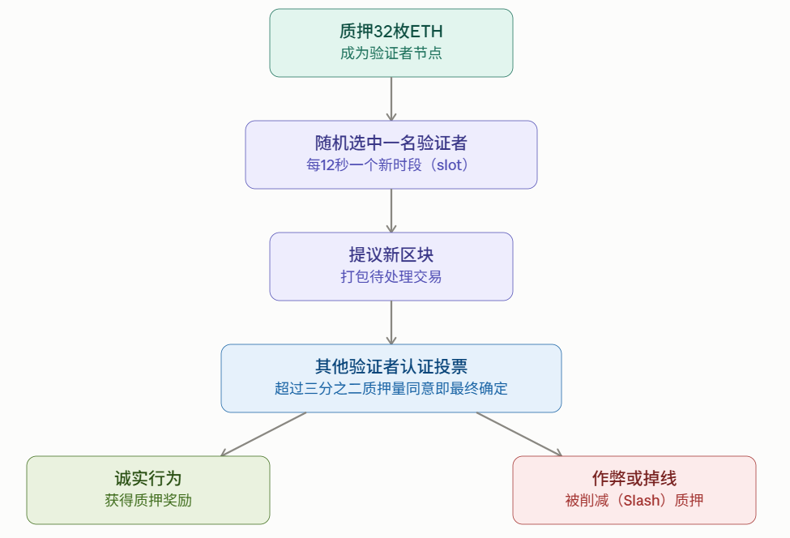

# Ethereum & Smart Contract

> Prof. Tim Weingärtner, HSLU
>
> 参考资料：
>
> * [Ethereum Overview - CTF Wiki](https://ctf-wiki.org/blockchain/ethereum/introduction/)
> * [Ethereum 以太坊 - 鹤翔万里的笔记本](https://note.tonycrane.cc/ctf/blockchain/eth/)
> * [如果你想知道什么是 NFT，看这篇就够了 - 知乎](https://zhuanlan.zhihu.com/p/448054686)

## Ethereum

区块链的特点：

* **Immutable（不可篡改性）**
    数据一旦被写入区块链，就无法被修改或删除.这是因为每个区块都包含前一个区块的哈希值，一旦改动其中任何一条记录，都会导致后续所有区块的哈希值发生变化，从而被网络立即察觉.

- **Transparent（透明性）**
  所有交易记录对网络中的所有参与者都是公开可见的，任何人都可以查询和验证.这种公开性使得区块链的运作过程不依赖于对某个中心机构的信任.

- **Pseudonymous（匿名性 / 化名性）**
  用户在区块链上是通过地址（一串字符）来标识身份的，而不是直接使用真实姓名或身份信息.严格来说这不是完全的"匿名"（anonymous），而是"化名"，因为如果某个地址与现实身份产生关联，其历史交易记录仍然可以被追溯.

- **Distributed（分布式性）**
  区块链数据并非存储在单一的中央服务器上，而是同时复制并保存在网络中众多的节点上.这种架构避免了单点故障，也防止了任何单一方对整个系统的控制.

- **Consensual（共识性）**
  网络中的所有节点需要通过某种共识机制（例如工作量证明PoW或权益证明PoS）就交易和区块的有效性达成一致.只有获得多数节点认可的记录才会被写入链上，从而保证了整个账本的一致性和可信度.

- **Programmable / Automated（可编程性 / 自动化性）**
  区块链支持在其上运行智能合约，也就是能够自动执行的程序代码.一旦预设条件被满足，合约就会自动执行相应操作，无需人工干预，也无需依赖第三方中介.

以太坊的构想由 Vitalik Buterin 于2013年提出，愿景是打造一个支持去中心化应用(dApps)的区块链平台，其核心特点是内置图灵完备的编程语言.

2014年，团队扩充了多位联合创始人，包括Gavin Wood、Charles Hoskinson、Anthony Di Iorio、Mihai Alisie和Joseph Lubin. 同年7月，以太坊开展了首次代币发行(ICO)，筹集了约1800万美元. 2015年7月30日，以太坊主网正式上线. 此后，以太坊迎来了“以太坊2.0”升级，将共识机制从工作量证明 (Proof-of-Work) 转变为权益证明 (Proof-of-Stake).

Ethereum与比特币不同的点在于：

* 比特币是计算器，以太坊是计算机

    - 比特币的脚本功能非常有限，只能用来验证条件是否成立.

    - 以太坊引入了图灵完备的虚拟机——EVM（以太坊虚拟机）.

    - 任何可确定性计算的程序，理论上都能在EVM上运行.


* EVM运行智能合约

    - 合约是永久存储在区块链上的程序.

    - 每一个以太坊节点都会执行每一份合约，且计算结果必须一致.

    - 这种共享执行机制创造了无需信任、可验证的计算环境.


Nick Szabo在1994年提出了智能合约的定义：**"智能合约是一种能够执行合约条款的计算机化交易协议."**

智能合约的核心特征包括：

- 本质上是一段计算机程序.
- 内容需要预先制定、提前定义好.
- 存储、复制并执行于区块链或分布式账本之上.
- 具有防篡改、不可更改的特性.
- 能够自我执行，并由可数字化验证的事件或条件来强制履行.
- 相当于双方或多方之间具有法律效力的协议或行为.
- 可以直接托管资产，并控制资产的转移.

账户、交易与区块（Accounts, Transactions, and Blocks）

**两种账户类型**

- 外部账户（EOA）：由私钥控制.
- 合约账户：由其自身的智能合约代码控制.

**一笔交易**

- 交易由外部账户发起，并用私钥签名，同时需要指定gas上限和gas价格.
- 交易可以用于转账ETH、部署合约，或调用某个函数.

**一个区块**

- 区块是由提议节点每隔约12秒打包验证的一批交易.
- 每个区块都引用上一个区块，从而形成一条链.

**图示说明：**

- 外部账户（Externally Owned Account）：拥有一个地址，账户状态包含余额（Balance）、随机数（Nonce）、代码哈希（CodeHash）和存储根（Storage Root）.
- 合约账户（Contract Based Account）：同样拥有地址和账户状态（余额、存储根、代码哈希、随机数），并分别关联着存储（Storage）和代码（Code）两部分数据.

以太坊地址（Ethereum Addresses）的生成遵循以下步骤：

1. **地址格式**：一个以`0x`开头的42位字母数字字符串.
2. **私钥生成**：随机生成一个256位的数字，例如`a54ae3c1b77bf0b704b3f1c8e7cd453b70e18cc1e5d1d2c76da4ad9f9a76b4d2`.
3. **公钥生成**：利用ECDSA算法，从私钥推导出对应的公钥.
4. **Keccak-256哈希运算**：对公钥进行Keccak-256哈希（SHA-3的一个变种），得到一个256位的哈希值.
5. **提取地址**：取该哈希值的最后20字节（160位）作为地址主体.
6. **添加前缀**：在提取出的字符串前加上"0x"前缀，最终得到完整的以太坊地址.

代码：（`web3.py`库）

```python
```


权益证明（Proof of Stake）是 Trustless Consensus，无需依赖银行等中央权威机构. 

节点按照如下方法根据正确的链达成一致：

- 验证者必须质押32枚ETH作为抵押品，才能参与网络.
- 系统会随机选出一位验证者来提议每一个新区块.
- 其他验证者则对该区块的有效性进行认证（投票）.

激励与惩罚机制：

- 表现正确的验证者可以获得质押奖励（包括发行奖励和交易费）.
- 作弊或掉线的验证者会受到削减（slash）或其他形式的处罚.

经济安全性：想要攻击整条链，攻击者需要掌握超过33%的质押ETH，这在经济上是极其昂贵和不划算的.

<center></center>

Gas是计算工作量的单位，

- EVM上的每一项操作都需要消耗固定数量的gas.
- 一笔简单的ETH转账恰好需要消耗21,000个gas单位.
- 复杂的DeFi交互操作，则可能消耗高达数百万的gas单位.

费用计算公式（EIP-1559）

- 手续费 = 消耗的gas数量 × （基础费用 + 优先小费）.
- 基础费用由协议自动设定，并会被直接销毁（从总供应量中移除）.
- 优先小费则会支付给将你的交易打包进区块的验证者.
- 网络需求越高，基础费用就越高，这本质上是一种市场调节机制.

## Smart Contract实践

讲了Remix这个IDE的一些使用，虽然我已经不能集中注意力跟着做了:)

