# Blockchain & Quantum

## Quantum Computing

> 什么玩意怎么是普物……
>
> Hassan Khodaiemehr, UBC Okanagan.

??? tips "Workshop Agenda"

    * Section 1: Quantum computing and quantum threats
    
        * History of quantum computing, Overview of quantum mechanics principles
        * Key concepts: qubits, superposition, entanglement, and measurement
        * Definition and purpose of quantum error correction
        * Experiments and Commercial Status
    
    * Section 2: Quantum-safe blockchain design
    
        * NIST PQC status, blockchain attack surface, migration
        * Case study: NIROPoK post-quantum sidechain on Ethereum

### Section 1: Quantum Computing and Quantum Threats

#### History of Quantum Computing

Shor 的个人timeline：

* **1994**：Shor提出了多项式时间的**因数分解算法**（Shor's Algorithm）
* **1994**：学界普遍认为，即使算法可行，quantum states太脆弱，实际中不可能实现
* **1995**：Shor提出了 **quantum error correcting code**，回应了"脆弱"的质疑
* **1996**：Shor提出了 **Fault-tolerant quantum computation**，证明了容错计算的可行性

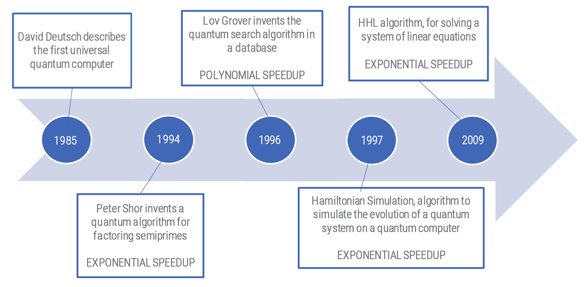

#### Shor 算法与非对称加密

Shor's algorithm 能够攻破用于保护private key的所有问题，包括对semi-prime numbers的因数分解，属于具备指数级加速的量子算法类别.

* 现实中的困难：Summit（截至2018年最强的超算）每秒可执行$2\times10^{17}$次运算，如果要蛮力破解，需要完成约$3\times10^{28}$次运算，耗时约4700年.
* 但如果Summit能运行Shor算法，分解一个300位数字仅需1.5纳秒——这就是量子加速的恐怖之处

#### Overview of Quantum Mechanics Principles

理解量子计算需要知道几个量子力学的基础原理：

1. 叠加原理（Superposition）
2. 量子纠缠（Entanglement）
3. 隧穿效应（Tunneling Effect）

两次量子革命：

* 第一次量子革命（1960s-1970s起）：核心思想是**利用量子力学去支配一整个原子系统的行为**，是理论验证之后的"exploitation phase"
* 第二次量子革命：核心思想升级为**利用量子力学去支配单个量子对象的行为**，由此诞生了Quantum Technologies（量子计算是其中之一）

**量子计算机的想法起源**：一般归功于物理学家 Richard P. Feynman（1982），他设想用能表现出量子行为的对象（而非经典的bit）作为计算基础；随后 Deutsch、Benioff 等人接力发展了这一概念.

#### Key Concepts: Qubits, Superposition, Entanglement, Measurement

* **叠加原理**：量子对象不只处于单一状态，而是同时处于所有可能状态的叠加；一旦受到显著扰动（如测量），叠加态就会**坍缩（collapse）**为经典态
* **测量（Measurement）**：宏观世界对微观世界的"侵入"，测量必然会扰动量子态使其坍缩，这是我们（宏观世界的人类）唯一能识别的状态类别
* **量子纠缠（Entanglement）**：两个量子粒子无论相距多远，都可以被绑定在一起——观测其中一个会同时影响另一个的坍缩结果（可以相同也可以相反）
* **隧穿效应（Tunneling）**：量子粒子能够穿越经典力学中本不可能穿越的能量壁垒（类比：一个球穿墙而过而不是被弹回）

**Qubit（量子比特）**：

* 经典计算的基本逻辑单元是 bit（只有0/1两个状态）
* Qubit 是 bit 的量子等价物，可以用原子、囚禁离子，或者在特定条件下表现出量子行为的宏观对象来实现
* 由所选的物理系统决定什么是0态、什么是1态（例如超导 qubit 的电流方向，或者原子的自旋）

#### Quantum Mechanics 数学工具

要理解Qubit的操作，需要一点点线性代数与量子力学形式化工具：

* **Dirac Notation**（狄拉克符号）：表示向量的写法，如$|0\rangle, |1\rangle$
* Inner (dot) Product / Outer (tensor) Product
* Matrix-Vector Multiplication
* Tensor product between matrices
* Unitary Matrices（酉矩阵）

> :framed_picture: 原PPT第28页有对应每个概念的公式截图，建议逐条对照插入.

###### Bloch Sphere（布洛赫球）

一个qubit的状态可以写成经典态$|0\rangle, |1\rangle$的线性组合（即**superposition**）：

$$|\psi\rangle = \alpha|0\rangle + \beta|1\rangle$$

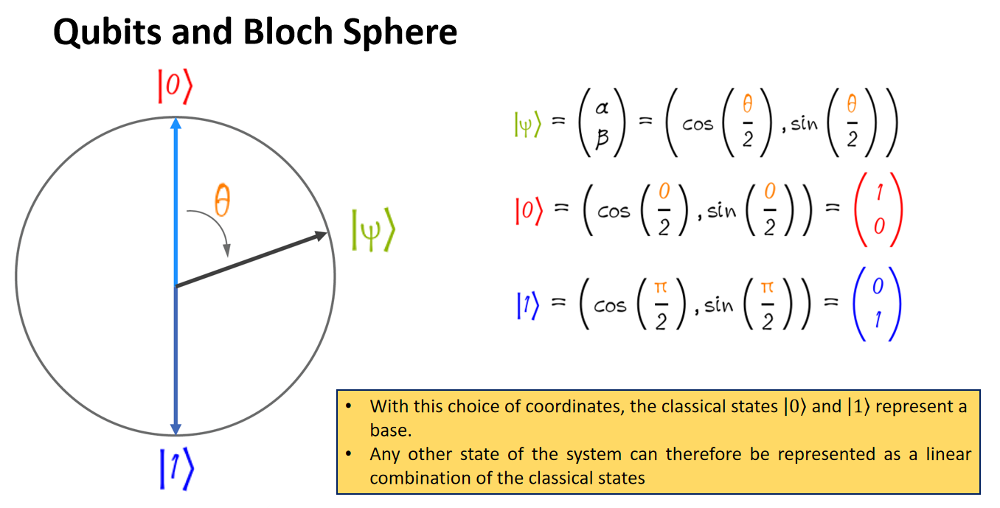

* **Superposition**：这种"坐标"写法能直观展示qubit坐标与叠加原理的关系
* **测量（wave function collapse）**：叠加态在数学上可以表示，但永远无法被直接观测到；测量会摧毁叠加态，强迫qubit坍缩为两个经典值之一
* $\alpha, \beta$ 被称为**amplitude（振幅）**，与观测到qubit处于对应经典态的**概率**直接相关（$|\alpha|^2 + |\beta|^2 = 1$）

满足的变量关系：
$$
\begin{align}
|\psi \rangle = \alpha \cdot |0\rangle + \beta \cdot |1\rangle \\
P(|\psi \rangle = |0 \rangle) = \alpha^2 \\
P(|\psi \rangle = |1 \rangle) = \beta^2 \\
\alpha^2 + \beta^2 = 1 \\

\end{align}
$$

###### 多Qubit系统（Multi Qubits System）

* 一个多qubit系统的wave function可以由各个qubit的wave function通过外积（outer product / tensor product）组合得到
* **逆命题不成立**：并非所有多qubit系统的wave function都能被分解成单个qubit wave function的张量积——这正是纠缠态的数学特征

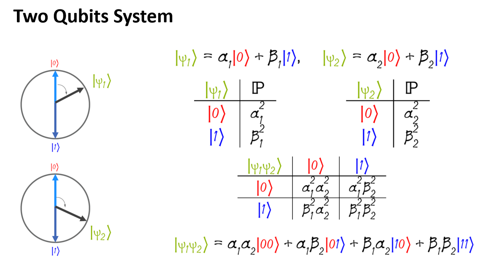

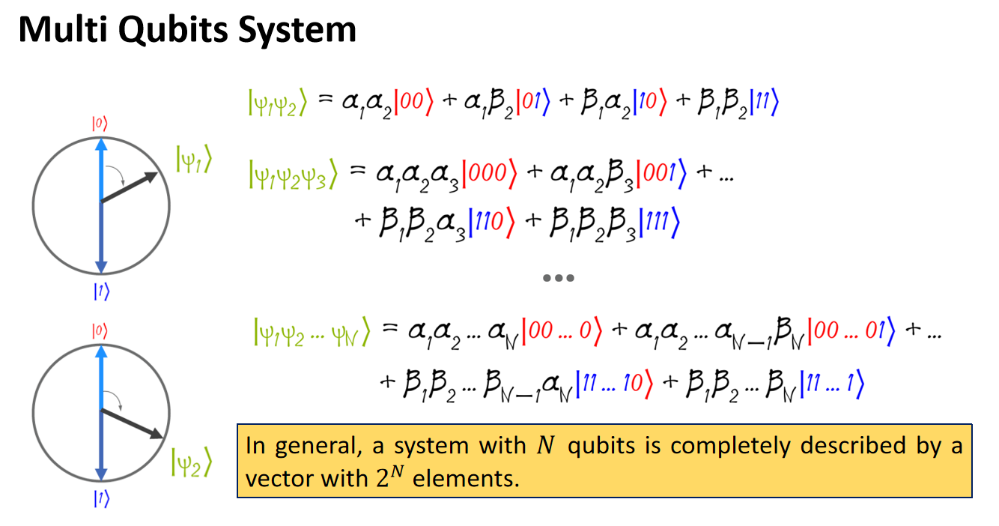

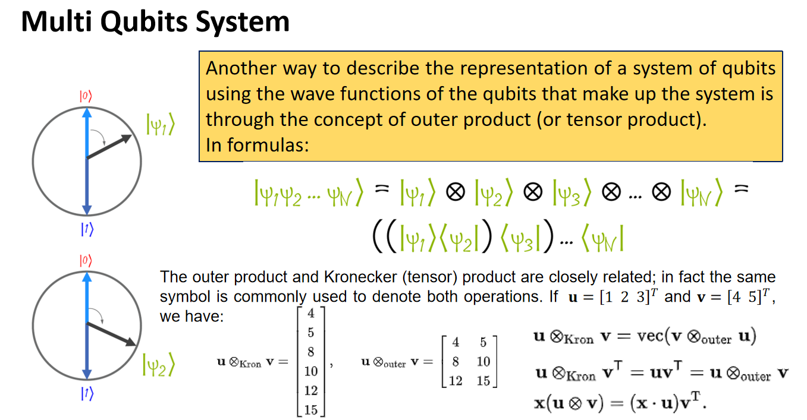

#### Quantum Gates（量子门）

从Classical bit manipulation（NOT, AND, OR等逻辑门）过渡到Quantum Gates.

* **X (NOT) Gate**：翻转qubit的经典态，变换矩阵：
    $$
    \begin{bmatrix} 0 & 1 \\ 1 & 0\end{bmatrix}
    $$

* **Hadamard Gate (H)**：创建叠加态，是构造量子算法的核心门，变换矩阵：
    $$
    \dfrac{1}{\sqrt2}\begin{bmatrix} 1 & 1 \\ 1 & -1\end{bmatrix}
    $$
    
* **Single Qubit Quantum Gates**：X, Y, Z, H, S, T等，变换矩阵：
    $$
    \begin{aligned} 
    X = \begin{bmatrix} 0 & 1 \\ 1 & 0\end{bmatrix} \\
    Z = \begin{bmatrix} 1 & 0 \\ 0 & -1\end{bmatrix} \\
    H = \dfrac1{\sqrt2}\begin{bmatrix} 1 & 1 \\ 1 & -1\end{bmatrix} \\
    T = \begin{bmatrix} 1 & 0 \\ 0 & e^{i\pi /4}\end{bmatrix}
    \end{aligned}
    $$

* **Two-qubit Gates**：
  
    * **SWAP Gate**：交换两个qubit的状态
    
        
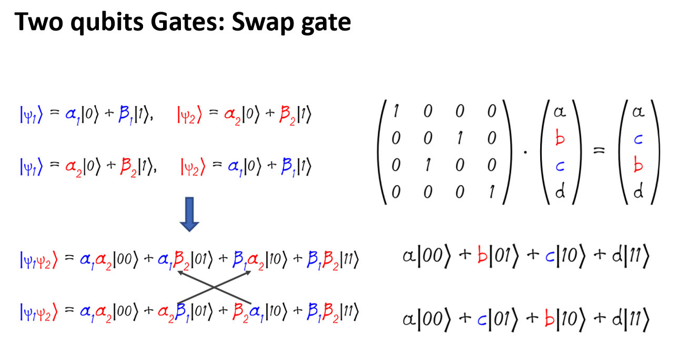

    
    * **CNOT (Controlled NOT) Gate**：entanglement创建的核心门
    
        
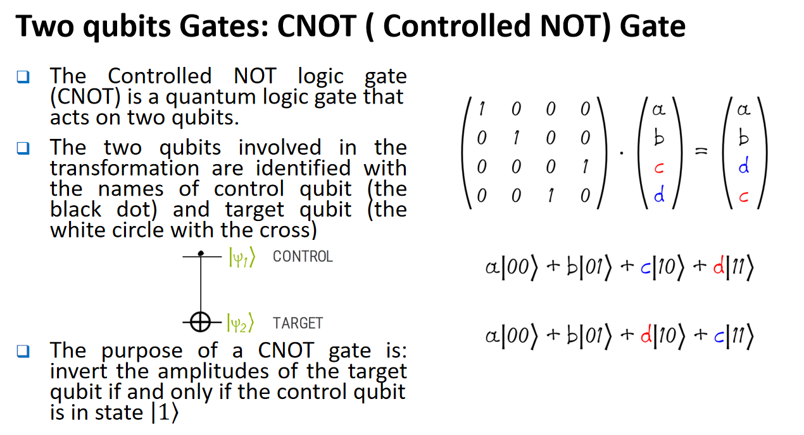

    
        
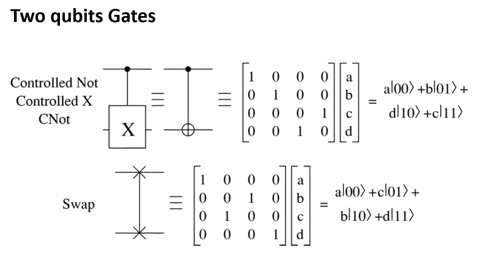

**Quantum Circuit（量子电路）**的定义：

* 是作用在一组qubit系统上的一系列quantum gates
* **depth（深度）**：从input（或preparation）到output（或测量门）沿qubit wire向前推进的最长路径
* 同一层（level）上的gates同时作用于整个系统，顺序是从左到右
* 惯例上，系统总是从全部qubit处于经典态$|0\rangle$开始

**Combine Quantum Gates（组合量子门）**：

* 如果要构造作用在多qubit系统上的矩阵，只需找出**同一层级**上所有作用中的gate（空位用单位矩阵$I$填充），再将它们从上到下做**张量积（Tensor Product）**
* 例：只对第一个qubit施加Hadamard门，而系统由多个qubit的wave function的张量积表示时，需要用 $H \otimes I \otimes \cdots$ 的形式来反映

**Alternative Controlled Gates（另一种构造受控门的方法）**：

* CNOT门可以理解为："若第一个qubit是0，什么都不做；若是1，则施加X门"
* **Reverse CNOT**：交换control/target角色，即"若第二个qubit是0，什么都不做；若是1，则对第一个qubit施加X门"
* 该思路可以推广，构造任意的**generic controlled gate**（当满足特定条件时才应用某个门）

#### Quantum Parallelism 与 Deutsch(-Jozsa) 算法

**Quantum Parallelism**：利用叠加原理，量子电路能够对所有可能的输入**同时**进行计算，这是量子算法能够指数级加速的物理基础.

**Deutsch–Jozsa Algorithm**（Deutsch 1992年提出，1998年由Cleve/Ekert/Macchiavello/Mosca改进）：

* 是一个**确定性**的量子算法
* 虽然实用价值有限，但是**首批展示了比任何经典确定性算法都具备指数级加速**的量子算法之一
* 通过Hadamard门制造叠加，判断函数$f$是**constant（常函数）**还是**balanced（平衡函数）**：

$$f(0)\oplus f(1)=0 \iff \text{测得 } |0\rangle \text{（f为常函数）}$$

$$f(0)\oplus f(1)=1 \iff \text{测得 } |1\rangle \text{（f为平衡函数）}$$

只需**一次**查询即可判断，而经典算法最坏情况需要2次查询.

#### 一些基础数学补充

* **Ket / Bra**：$|\psi\rangle$（ket）与$\langle\psi|$（bra）分别表示向量与其共轭转置，是Dirac notation的核心记号（命名者：Paul Dirac；Bloch Sphere命名者是物理学家 Felix Bloch）
* **Tensor / Kronecker Product**：从1个qubit推广到$N$个qubit系统的组合方式
* **Pauli Matrices（泡利矩阵）**：描述量子误差的基本单位
    * **Bit-flip errors**（对应$X$矩阵）
    * **Phase-flip errors**（对应$Z$矩阵）
    * 二者组合（对应$Y$矩阵）
* **Hadamard Gate**：数学上$H$能够**交换bit-flip和phase-flip误差**（这个性质是后续量子纠错的关键）

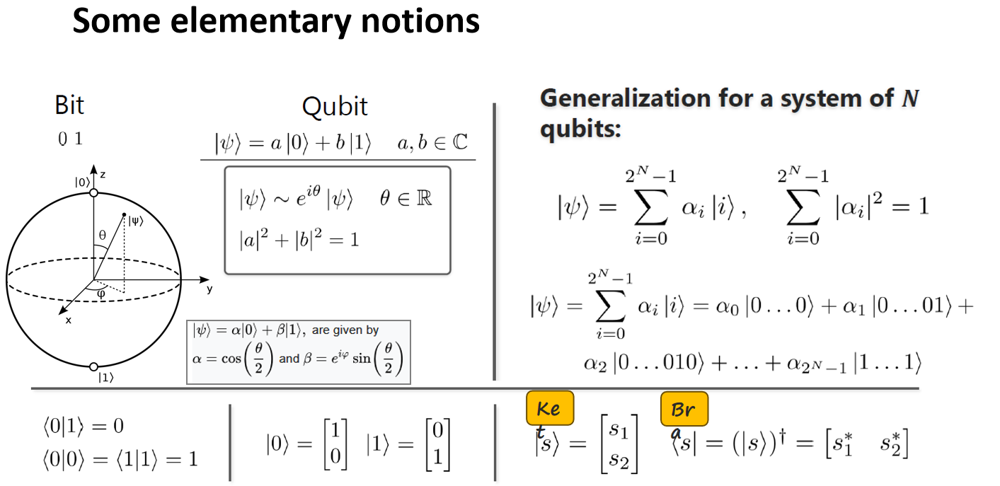

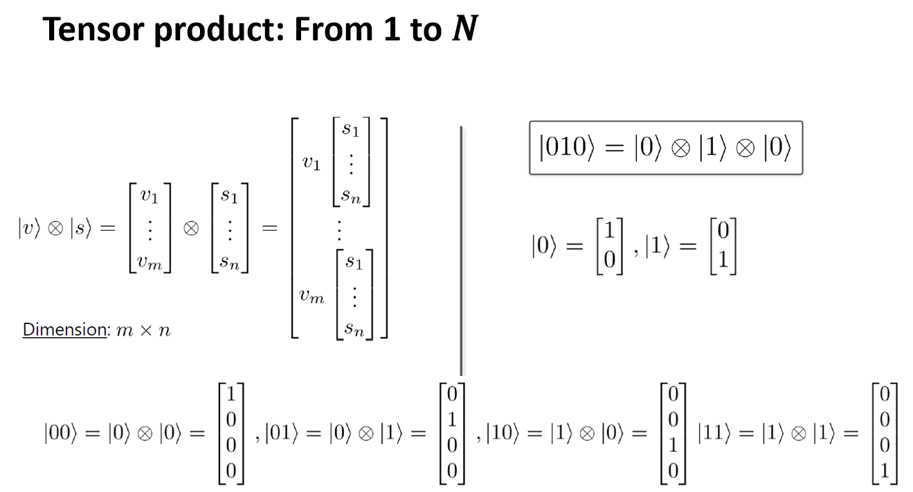

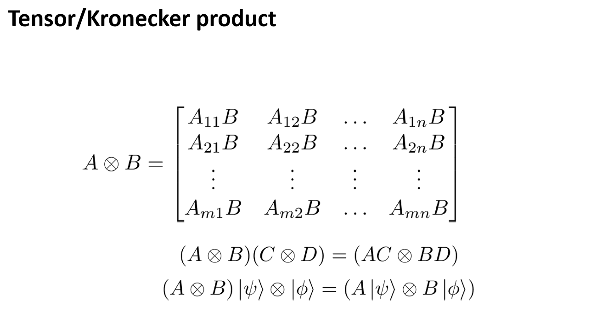

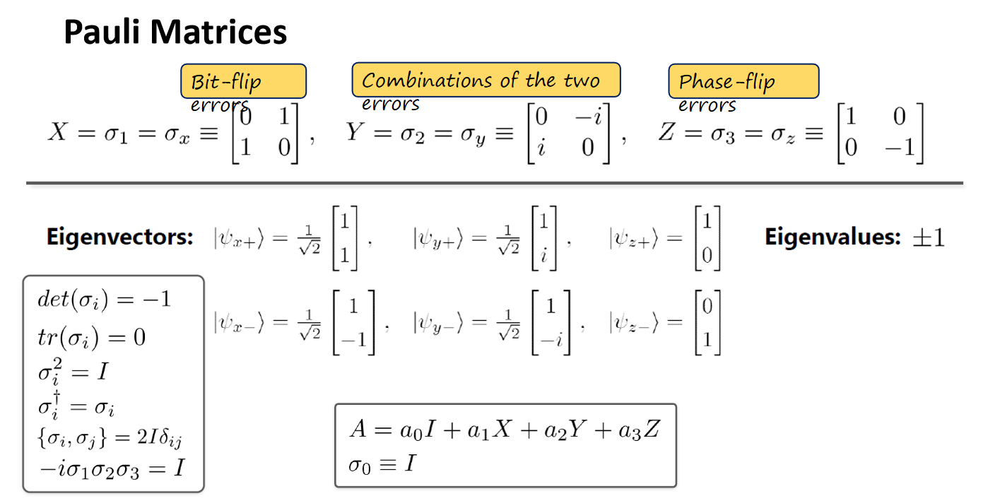

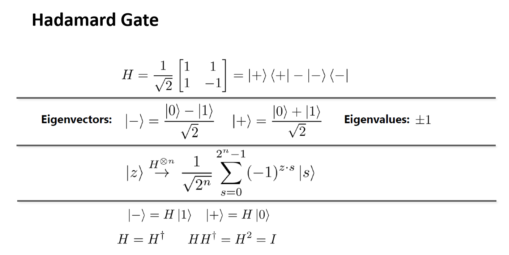

#### Quantum Error Correction（量子纠错）

##### 复习：经典纠错码

经典纠错码用于：在有噪声的信道中传输信息，或在有噪声的介质中存储信息."有噪声"意味着bit状态可能（通常不可预测地）发生翻转.

一个简单的噪声模型是 binary symmetric channel：每个bit独立地以概率$\varepsilon$翻转.

**3-bit repetition code（3比特重复码）**：

* Encode：每个bit $b$ 编码为 $bbb$
* Decode：接收到 $b_1b_2b_3$ 后取多数（majority）
* 有效错误概率降低为 $3\varepsilon^2 - 2\varepsilon^3$

| $\varepsilon$ | $3\varepsilon^2-2\varepsilon^3$ | 错误率降低倍数 |
| ------------- | ------------------------------- | -------------- |
| 0.10          | 0.009                           | 11             |
| 0.01          | 0.0001                          | 100            |
| 0.001         | 0.000001                        | 1000           |

代价：消息长度变为原来的3倍（**rate = 1/3**）.

**一般理论**：

* Encoding: $E:\{0,1\}^n \to \{0,1\}^m$，Decoding: $D:\{0,1\}^m \to \{0,1\}^n$
* **Rate（码率）** $= n/m$
* 惊人事实：对任意常数 $\varepsilon < 1/2$，存在**常数码率**就能使编码的错误概率任意小
* Rate 是噪声水平$\varepsilon$的函数 $R(\varepsilon)$：对给定的$\varepsilon$，能达到的码率上限是$R(\varepsilon)$，超过它在理论上是不可能的

##### Quantum Repetition Code 为什么行不通？

朴素想法：把经典重复码直接套用到量子态上，即把 $\alpha|0\rangle+\beta|1\rangle$ 编码成 $\alpha|000\rangle+\beta|111\rangle$（形如$(\alpha|0\rangle+\beta|1\rangle)^{\otimes 3}$）——但这是错的！

**这会违反 No-Cloning Theorem（不可克隆定理）**：未知量子态不可能被精确复制.

##### Barriers to Quantum Error Correction（量子纠错的四大障碍）

1. 测量误差会摧毁叠加态（Measurement of error destroys superpositions）
2. No-cloning定理阻止了简单的重复编码
3. 必须同时纠正多种类型的误差（bit flip 和 phase flip）
4. 如何纠正**连续**的误差与**退相干（decoherence）**？

**解决障碍1：测量误差 (Error) 而非测量数据 (Data)**

* 用一个电路，引入辅助qubit（ancilla qubits），得到**error syndrome**（错误症状），而不直接测量数据本身
* 第1个syndrome bit表示"状态的前两位是否相同"，第2个表示"后两位是否相同"
* 例如：syndrome = 11 意味着第二个qubit与其他不同，可以直接施加 X 操作纠正，且**syndrome不依赖于$\alpha,\beta$**——这意味着我们了解了错误信息，却没有了解数据本身，从而**保留了叠加态**！

**解决障碍2：Redundancy, Not Repetition（冗余而非重复）**

编码 $|0\rangle+|1\rangle \to |000\rangle+|111\rangle$（相当于$(|0\rangle+|1\rangle)^{\otimes 3}$）并**不**违反no-cloning定理，因为我们只在**计算基（computational basis）下重复了状态**；叠加态本身是"展开的（spread out，冗余的）"，而不是被复制的.

**解决障碍3：同时纠正 bit-flip 与 phase-flip**

* **Hadamard变换 $H$ 能够交换bit-flip误差和phase-flip误差**
* 重复码在标准基下能纠正bit-flip，那么**在Hadamard基下的重复码就能纠正phase-flip**
* 结合两种编码 $\Longrightarrow$ **Shor's 9-qubit code**："inner"部分纠正任意单qubit X-error，"outer"部分纠正任意单qubit Z-error
* 进一步可证明：该编码事实上能纠正**任意的单qubit酉误差 $U$**（因为任意$U$都可以分解为$I, X, Y, Z$的线性组合）
* Shor 9-qubit code 甚至能从任意**2-qubit erasure error（已知位置的擦除错误）**中恢复数据

**解决障碍4：连续误差与容错计算（Fault-Tolerant Computing）**

* **Threshold Theorem（阈值定理）**：如果物理误差率 $\varepsilon$ 足够小，那么通过增加编码规模（code size），逻辑误差率可以被压到任意小；对每个固定的$\varepsilon$，能进行的最大计算规模是有限常数，但当$\varepsilon$低于阈值时，规模可以任意扩大
* 做法：在计算开始就用QEC code编码数据，之后所有门操作都作用在编码后的数据上，并定期执行**纠错步骤**（这些纠错操作本身也可能出错，因此要格外小心）
* **7-qubit CSS code**：H和CNOT门可以**transversally（横向地）**直接作用在编码数据上（无需先解码），这一性质对容错计算至关重要
* 递归地嵌套编码，容错能力会越来越强

> :framed_picture: 原PPT第86-109页是QEC完整推导（含error syndrome电路、Shor 9-qubit code结构图、threshold theorem示意），建议保留至少第87-88页（syndrome电路）、103页（9-qubit code结构图）、109页（transversal gates示意）.

#### Experiments and Commercial Status（实验与商业现状）

**为什么现在的量子计算机还无法运行最强大的算法？**

答案：目前的量子计算机更像是**高级原型机**而非量产设备.

**Building a Quantum Computer：四大挑战**

1. **Number of Qubits（qubit数量）**：目前最强的通用（general purpose）量子计算机模型也不超过一百qubit左右，对于universal quantum computer而言远远不够，但设备规模在持续增长
2. **Connectivity of Qubits（连通性）**：数学上量子门可以作用在任意两个qubit之间，但物理实现中若两个qubit没有连接，就必须通过**quantum compilation（量子编译）**改造电路来适配
3. **Coherence Time（相干时间）**：叠加态极其脆弱，需要尽量隔绝噪声；qubit本身也会产生噪声（这也是难以做大芯片的原因之一），需要改进qubit本身的技术
4. **Operations on Qubits（门操作）**：并非所有门都可用；门操作耗时不是瞬时的；门操作本身有误差（gate fidelity）——而完成电路的可用时间是有限的（受限于叠加态能维持多久）

**Essential Quantum Gate Operations 小结**：

* Quantum gates是作用在qubit上的**酉变换（unitary transformations）**
* Hadamard (H)：创建叠加；Pauli-X/Y/Z：bit flip / bit-phase flip / phase flip；CNOT：创建纠缠；Phase gates (S, T) 与 SWAP gate

**Impact of Errors on Gates（误差对不同门的影响）**：

| Error Type     | Single-Qubit Gates (H, X, Z)     | Two-Qubit Gates (CNOT)           |
| -------------- | -------------------------------- | -------------------------------- |
| Bit-Flip       | 直接改变状态，容易检测           | 破坏纠缠，同时影响两个qubit      |
| Phase-Flip     | 改变相位，对叠加态影响显著       | 破坏纠缠，影响态间的相对相位     |
| Bit-Phase Flip | bit与phase变化的复杂组合         | 对纠缠的影响非常复杂             |
| Depolarizing   | 三种误差的概率混合，降低fidelity | 混合误差，同时降低纠缠与fidelity |

其中：H门对phase-flip最敏感（因为它创建叠加），也受bit-flip影响；Pauli-X门主要对bit-flip敏感；Pauli-Z门主要对phase-flip敏感；CNOT门对control/target qubit上的bit-flip和phase-flip都敏感.

**Evaluating the Error Performance of QECCs（评估QECC性能的指标）**：

* **Threshold（阈值）**：容错量子计算下，能通过增大编码规模使逻辑误差率任意小的最大物理误差率
* **Overhead（开销）**：编码单个logical qubit所需的物理qubit数比例，越低越好
* **Encoding/Decoding Complexity**：编解码过程的计算复杂度，越低越好
* **Fidelity（保真度）**：理想态与实际态之间的重叠程度，衡量纠错后状态保留的准确性（通过比较理想态与实际态的密度矩阵计算）

**Structure of Quantum Codes（量子编码的结构分类）**：

* **Stabilizer Codes**（由stabilizer群定义）：
    * Discrete Variables: Shor Code, Steane Code, Reed-Solomon Codes
    * Continuous Variables: GKP Codes (Gottesman-Kitaev-Preskill), Cat Codes
* **Non-Stabilizer Codes**（更复杂，不完全基于stabilizer）：Topological Codes（如Surface Codes）、Color Codes

### Section 2: Quantum-Safe Blockchain Design

#### Quantum Threats 概览

两种量子算法对应两种截然不同的失效模式（two algorithms, two failure modes）：

|          | Shor（灾难性/catastrophic）         | Grover（渐进性/graceful）                  |
| -------- | ----------------------------------- | ------------------------------------------ |
| 攻击对象 | 非对称密码（离散对数、因数分解）    | 对称密码/哈希函数（暴力搜索）              |
| 效果     | 直接破解ECC/RSA签名，从公钥恢复私钥 | 二次方加速暴力破解，**将哈希安全位数减半** |
| 缓解方式 | 无法缓解，必须整体替换算法          | 用更长的输出即可缓解                       |

**What Is Q-Day？** 指量子计算机强大到足以在实用时间内破解经典公钥密码（RSA, ECC, DH）的那一刻.

* **Q-Day 之后**：TLS证书可被伪造、代码签名可被伪造、区块链签名可被伪造、VPN/加密通信可被破解、软件更新可被冒充、身份认证体系崩溃
* **Q-Day 之前**：**Harvest-Now, Decrypt-Later（先窃取，后解密）**攻击已经在发生——今天被窃取的加密数据，可以在Q-Day到来后被解密

**Shor's 和 Grover's 算法对区块链的系统性冲击**：

* Shor's算法直接破解广泛使用的非对称密码，威胁区块链的数字签名与资产安全
* Grover's算法使对称密码（哈希函数）安全等级减半，影响共识公平性（如PoW的难度与nonce搜索）
* 区块链的设计因素（公钥暴露、共识协议）会**放大**量子算法带来的风险

**受影响的NIST标准**：SP 800-56A (Diffie-Hellman, ECDH)、SP 800-56B (RSA encryption)、FIPS 186 (RSA/DSA/ECDSA签名)均易受large-scale quantum computer攻击；对称密码（AES, SHA）也会受Grover算法影响，但影响没那么剧烈.

#### Post-Quantum Cryptography (PQC) 与 NIST 标准化历程

**PQC定义**：需要找到对**经典和量子计算机**都安全的密码算法，即"quantum resistant cryptography".

**NIST PQC Security Levels（安全等级）**：

| Level | Security Description              |
| ----- | --------------------------------- |
| I     | 至少与AES-128的穷举密钥搜索一样难 |
| II    | 至少与SHA-256的抗碰撞性一样难     |
| III   | 至少与AES-192的穷举密钥搜索一样难 |
| IV    | 至少与SHA-384的抗碰撞性一样难     |
| V     | 至少与AES-256的穷举密钥搜索一样难 |

**NIST PQC 历史时间线**：

| Year   | Event                               | Description                                      |
| ------ | ----------------------------------- | ------------------------------------------------ |
| 2016   | NISTIR 8105                         | PQC需求与研究的奠基性报告                        |
| 2016   | Call for Proposals                  | PQC算法竞赛启动                                  |
| 2017   | Round 1                             | 69个提案被接受                                   |
| 2019   | Round 2                             | 26个算法晋级                                     |
| 2020   | Round 3                             | 7个finalist，8个alternate                        |
| 2022   | 算法选定                            | 选定 Kyber, CRYSTALS-Dilithium, SPHINCS+, Falcon |
| 2024   | FIPS 203                            | ML-KEM（基于Kyber）标准发布                      |
| 2024   | FIPS 204                            | ML-DSA（基于Dilithium）标准发布                  |
| 2024   | FIPS 205                            | SLH-DSA（基于SPHINCS+）标准发布                  |
| 2024   | NIST IR 8547（草案）                | PQC迁移指南                                      |
| Future | FIPS 206（Falcon）/ FIPS 207（HQC） | 待标准化                                         |

**Harvest-Now, Decrypt-Later 与长期保密性**：

* 具备长保密期需求的数据（政府、医疗、金融记录等）面临的风险最高，因为PKI等基础设施更换周期长达数十年
* 组织需要盘点自己的密码资产、按风险排序、逐步适配PQC算法
* **关键点**：数据不需要"今天就被破解"才算今天处于风险中——只要它需要长期保密、使用了量子脆弱算法、或公钥已经暴露（如区块链交易中很常见），就可能在未来被追溯性破解

**NIST IR 8547：算法弃用时间线**：

* 易受量子攻击的算法：Diffie-Hellman, ECDH, RSA, ECDSA, EdDSA
* 对应PQC替代方案：ML-KEM（密钥建立）、ML-DSA / SLH-DSA（数字签名）
* **112-bit安全等级的算法：2030年后deprecated，2035年后disallowed**；更强的经典公钥算法也将在2035年后disallowed
* 迁移的时间线取决于用例，优先照顾需要长期保密和大型基础设施的系统

**Next Steps 与 2035 迁移目标**：完成FIPS 206标准化、更新密钥管理相关指南（支持KDF种子、安全私钥导出）、推动全行业协作以实现2035年的PQC迁移目标.

#### Blockchain 量子攻击面：攻击分类学

论文提出的核心洞见：**攻击可行性更取决于执行所需的时间窗口，而非单纯的算力/qubit数量**.由此划分出三种攻击类别：

**On-Spend Attacks（花费中攻击）**：

* 攻击流程：用户广播交易 → 交易暴露公钥与签名 → 攻击者必须在交易被最终确认前恢复私钥 → 发布伪造交易转移资金
* 时间窗口极短：Solana ~400ms，Ethereum ~12s，Bitcoin ~10min（平均出块时间）
* 危害极大：立即造成盗窃，无法回滚

**At-Rest Attacks（静态资产攻击）**：

* 目标：长期暴露公钥的资产（如被重用的比特币地址、legacy P2PK输出、休眠钱包、丢失的私钥）
* 攻击者不受时间约束，可能有数天到数年的时间
* 论文估计：**约200-300万枚BTC**最终可能面临暴露风险，因此这被认为是**最可能率先发生**的量子攻击

**On-Setup Attacks（协议建立时攻击）**：

* 论文认为这是**最危险但讨论最少**的攻击类别
* 攻击一次性针对协议的固定参数（如某些zk-proof系统的trusted setup "toxic waste"，Data Availability Sampling机制），一次性的量子计算就能推导出后门，之后无需再次动用量子资源即可持续利用
* Bitcoin对此免疫（无trusted setup），但许多现代系统（zk-rollups, L2, 隐私协议）并不免疫
* 危害：完全隐蔽、极难检测、系统性而非逐钱包地危害

**三种攻击类型对比**：

| Dimension            | On-Spend                 | At-Rest                      | On-Setup                     |
| -------------------- | ------------------------ | ---------------------------- | ---------------------------- |
| 攻击时机             | 交易广播/结算期间        | 密钥长期暴露后任意时刻       | 协议初始化/参数生成阶段      |
| 可用时间             | 极短（毫秒到分钟）       | 极长（数天到数年）           | 一次性离线计算               |
| 攻击目标             | 活跃用户交易             | 休眠钱包/重用地址/被遗弃资产 | 协议级公共参数               |
| 首次实际发生的可能性 | 较低（需要极先进硬件）   | **最高**（最现实的首个攻击） | 频率低但影响极大             |
| 影响范围             | 单个受害者               | 单个受害者                   | 系统级，波及大量用户         |
| PQC能否完全解决      | 基本可以（针对未来交易） | 不能（旧密钥仍暴露）         | 部分可以（取决于协议重设计） |
| 一句话总结           | 速度就是一切             | 暴露时长就是一切             | 一次突破可摧毁整个系统       |

**Fast-Clock vs Slow-Clock 量子计算机**：这是容易被忽视的关键区分——很多讨论只关注qubit数量和算法复杂度，但**wall-clock time（实际耗时）决定了哪种攻击会先出现**.Fast-clock设备（如超导）能实现时间敏感型攻击（如攻破实时交易），slow-clock设备则足以支撑耐心型攻击（长期暴露密钥的静态资产攻击）.

**Executive Summary（数据来源：Google Quantum AI whitepaper, 2026-03-30）**：

* Google估计破解secp256k1的ECDLP需要约1,200-1,450个logical qubit和约7000-9000万个Toffoli门
* 在超导"fast-clock"硬件上，这可能在少于50万个physical qubit的条件下实现**分钟级**的攻击
* 这使得部分链上的"on-spend"攻击（在结算窗口内破解密钥）具备现实可行性
* 缓解措施必须现在开始：减少公钥暴露、加固mempool、规划完整的PQC迁移

#### Bitcoin vs Ethereum：架构差异下的量子风险

**Bitcoin**：

* 核心依赖 **ECDSA over secp256k1**；单个有效签名即可证明所有权，私钥一旦泄露即造成立即且不可逆的盗窃
* Bitcoin并不总是暴露公钥（这是部分防御）：公钥仅在**输出被花费时**、**legacy P2PK输出**、以及**地址重用**时才可见
* 量子攻击评估：
    * **At-Rest攻击是主要风险**：针对老旧、重用或休眠的密钥，攻击者有无限时间；论文估计约200-300万BTC最终可能暴露，是Bitcoin最现实的首个量子攻击
    * **On-Spend攻击**需要在~10分钟窗口内破解密钥，只有极快的量子计算机才能做到，被视为较远期的风险
    * **On-Setup攻击**：Bitcoin基本免疫（无trusted setup，无全局密钥参数）
    * PoW本身不会被量子计算严重破坏，Grover算法不会使Bitcoin挖矿失效

**Ethereum（风险更高）**：

* **Account Model**导致公钥总是可见，没有像Bitcoin那样的hash隐藏机制，使at-rest攻击更容易
* **Proof-of-Stake**下validator需要持续签名消息，一旦validator密钥被攻破，可能扰乱共识、造成validator被接管、触发slashing或链的不稳定

**Final Comparison**：

| Aspect    | Bitcoin              | Ethereum                       |
| --------- | -------------------- | ------------------------------ |
| 主要风险  | 休眠/重用密钥        | 密钥 + 共识 + 协议参数         |
| 短期缓解  | 密钥卫生（避免重用） | 密钥轮换 + Account Abstraction |
| 复杂度    | 较低                 | 非常高                         |
| 治理风险  | 中等                 | 关键                           |
| PQC紧迫性 | 较高（但相对靠后）   | 非常高（更紧迫）               |

**哪些区块链最脆弱？** 短出块时间、快速终结性（fast finality）、高交易吞吐、频繁的签名暴露，都会**增加**脆弱性——共识越快，防御者的反应窗口就越小.因此Ethereum与快速终结的PoS链风险更高，Bitcoin及长出块间隔的PoW链相对风险较低.

#### 迁移路径：Crypto-Agility 与 混合签名

**Crypto-agility blueprint（协议层设计模式）**：

* 用**算法标识符**（version tag / OID）嵌入在签名payload中，来选择verifier逻辑：ECDSA (v1 legacy) → ML-DSA (v2 PQ) → FN-DSA (v3 PQ)
* 避免在共识关键逻辑中硬编码单一签名方案，而是通过一层抽象（`Verify_Signature()`）来分发
* 设计支持**多算法并存**（迁移窗口期内混合/并行验证）
* 类似以太坊的系统中，应把认证逻辑下推到可升级的**account abstraction**，而不是固定的EOA规则

**Hybrid Signature Payload（向后兼容的混合签名结构）**：

* 结构：Legacy Sig (ECDSA slot) + Alg ID (PQC marker) + PQC Sig (ML-DSA / FN-DSA)
* Legacy节点/浏览器仍能在标准字段中看到经典签名；量子感知节点额外验证扩展字段中的PQC签名
* 关键协议风险：
    * **State bloat**：PQC签名体积更大，增加带宽/存储/手续费
    * **Fork hazard**：若PQC校验是共识关键，但legacy节点不检查，则需要协调好共识规则（可选/非共识关键 vs. 协调硬分叉强制生效）
    * **Explorer UX**：区块浏览器需要更新工具才能正确展示PQC数据，否则显示为不透明的blob

**近期缓解措施（Near-Term Mitigations，完整PQC迁移之前）**：

* 减少公钥暴露：避免地址/密钥重用，缩短密钥可见时间
* Mempool防护：private mempool、commit-reveal、交易中继改造
* 运维层面盘点所有量子脆弱组件（钱包、validator、multisig、桥）
* 现在就开始规划PQC升级（治理与协调需要数年时间）

**PQC Migration（终局，但落地困难）**：用PQC方案替换基于ECDLP的签名；挑战在于更高的带宽/算力开销、共识协调、漫长的推出周期；已有部分链的早期PQC部署/实验证明技术可行性；建议采用**纵深防御**（interim mitigations + 分阶段PQC推出）.

**Dormant Assets & Policy（休眠资产与治理问题）**：休眠资产无法主动升级，可能成为量子可恢复的目标；相关白皮书讨论了"digital salvage"等政策应对与国家安全担忧；若无政策约束，salvage可能落入犯罪/敌对行为体手中，冲击市场稳定；社区的协议选择（销毁/不作为等）可能与法律框架产生交叉.

**Recommended Next Steps（Checklist）**：

1. **Assess**：盘点ECC的使用位置（钱包、validator、admin key、桥、setup）
2. **Mitigate**：减少密钥暴露 + 加固mempool以应对on-spend威胁
3. **Plan**：设计PQC升级路径与治理时间表
4. **Communicate**：发布有据可查的风险评估，避免制造恐慌（FUD）
5. **Policy**：就休眠资产与可接受的恢复规则展开讨论

> 核心信息：**现在就开始迁移——等待才是高风险选项.**

#### ECDSA/EdDSA 依赖现状与 PQ 方案对比

**对ECDSA/EdDSA的依赖**：ECDSA与EdDSA是绝大多数区块链使用的主要数字签名方案；Shor算法能够通过恢复私钥破解这些方案，使签名可被量子计算机伪造；链上暴露的公钥使得休眠账户、冷钱包、被遗弃资产始终处于风险中；从ECDSA/EdDSA迁移走需要协调的升级和用户配合，对区块链安全构成系统性风险.

**NIST finalist 后量子签名方案对比**（原PPT第166页图）：

* **Dilithium**：速度最快，但签名体积较大
* **FALCON**：签名紧凑，但实现难度更高
* **SPHINCS+**：安全假设最保守（仅依赖哈希函数），但overhead巨大

> 这解释了为什么PQC没有一个"即插即用"的drop-in replacement——三者在速度/体积/安全假设之间各有取舍.

**Post-quantum blockchain projects（现有项目）**：论文Table 42表明，PQ区块链在技术上已经可行，但采用率有限——瓶颈不在密码学的可用性，而在**可扩展性、互操作性、迁移成本**.

**代表性项目**：

* **QRL**：hash-based signatures (XMSS)
* **Algorand**：PQ readiness研究
* **Cardano (Ouroboros)**：PQ共识研究
* **Komodo**：集成Dilithium
* **Bitcoin-PQ**：XMSS + PQ PoW
* **PQFabric / Abelian**：基于lattice的签名

**共同点**：都运行在经典硬件上，大多依赖后量子密码学而非量子网络（**没有基于QKD的系统**）.

#### 为什么PQC是唯一现实可行的近期方案

PQC（而非量子密码学QKD）是未来十年内对真实世界区块链**唯一可部署**的防御方案：

* NIST PQC标准已经定稿
* PQC运行在经典硬件上，无需特殊基础设施
* QKD需要专用基础设施，存在距离/信任/成本约束，且未被主要安全机构背书用于通用系统

**State of the Art: Quantum-Safe Blockchains in 2026**——三种现有路径：

| 方案                      | 描述                       | 状态             |
| ------------------------- | -------------------------- | ---------------- |
| Post-Quantum Blockchains  | 经典区块链 + PQ密码学      | ✅ 今天即可部署   |
| Hybrid Blockchains        | 经典 + PQ + 有限的量子组件 | ⚠️ 过渡期，实验性 |
| Fully Quantum Blockchains | 理论性，需要大量基础设施   | ❌ 不现实         |

**Design Principles for the Quantum-Safe Blockchain Era（设计原则）**：

* 应支持：crypto-agility（可随时间更换算法）、hybrid & opt-in PQ部署、PQ-native共识研究、存储高效的签名聚合、治理感知的迁移方案
* 不可行：flag-day式（一刀切）协议切换、短期内的fully quantum blockchain

**Reality, Limits, and Next Steps 总览**：

| ✅ 今天可以做到                       | ❌ 目前做不到                                  |
| ------------------------------------ | --------------------------------------------- |
| PQC（NIST已标准化，可部署）          | 全量子区块链（无可扩展的量子基础设施）        |
| 混合与渐进式迁移                     | 瞬时全局迁移（休眠钱包、智能合约问题）        |
| 哈希加固（如SHA-512）                | ECDSA的drop-in替代（存储/带宽剧增）           |
| PQ加固的经典共识（PoW/PoS + PQ签名） | 抗密钥泄露的共识（PoS/BFT若不重新设计会崩溃） |
| 早期采用领域：医疗、身份、IoT        |                                               |

> **Core Takeaway**：量子计算已经从遥远的理论威胁，转变为近期的工程与治理问题——尤其是对依赖椭圆曲线密码学的加密货币而言，延迟迁移会显著提高系统性风险.算法与纠错技术的进步正在降低所需资源，可能已经把时间线提前了几年.完整的PQC迁移在技术上可行，但在物流与政治层面困难，很可能需要数年而非数月才能完成——这正是紧迫性所在.

### Case Study: NIROPoK-based Post-Quantum Sidechain on Ethereum

#### Post-Quantum Blockchain 概念回顾

Post-quantum blockchain 指的是融合了能抵御量子计算机潜在威胁的密码学技术的区块链.

#### Components of Post-Quantum Blockchain

**Post-Quantum 数字签名算法**（5大类）：

* **Lattice-Based Cryptography**：基于lattice问题（如LWE, Ring-LWE）的困难性
* **Code-Based Cryptography**：基于纠错码，如McEliece密码系统
* **Hash-Based Signatures**：利用哈希函数构造签名，如Merkle signature scheme
* **Multivariate Quadratic Equations**：基于有限域上多元二次方程组求解的困难性
* **Supersingular Elliptic Curve Isogeny (SIDH)**：基于超奇异椭圆曲线间同源映射查找的困难性

**其他必须同步量子抗性化的组件**：

* Quantum-Resistant Consensus Mechanisms（改造共识算法使其在量子对手下依然安全高效）
* Quantum-Resistant Key Management（后量子密钥交换机制）
* 其余所有组件：Zero-Knowledge Proof Systems、Commitment Schemes、Smart Contracts、Multi-Party Schemes……

#### 研究动机

* 继Bitcoin之后，**Ethereum**是使用最广泛的区块链，因智能合约能力与庞大的dApp生态而流行
* Ethereum由于使用**ECDSA**以及**PoS共识机制**，对量子攻击**高度脆弱**
* 现有的量子抗性方案：
    * L1方案，如 **Abelian**（基于lattice）
    * **PQFabric**：混合签名的permissioned区块链，同时对经典和量子攻击安全
    * **SodsBC**：基于哈希密码学的permissioned区块链
    * **Starknet**：基于ZK-STARK和哈希函数的部分量子抗性Rollup
* **研究空白（Gap）**：以太坊上的**permissionless（无需许可）量子抗性侧链**方案仍然缺失

#### Proposed Framework（NIROPoK 框架）

**组件**：

* **NIROPoK**（Quantum-resistant Non-Interactive Random Oracle Proof of Knowledge）方案
* **ZK-SNARKs**（Zero-Knowledge Succinct Non-Interactive Arguments of Knowledge）
* **QPoS**（Quantum-resistant Proof-of-Stake mechanism）
* **Post-quantum bridge**：基于Dilithium数字签名方案

**目标**：确保侧链对量子威胁具备稳健防御，并提升以太坊主链交易的量子安全性.

##### 补充：Zero-Knowledge Proofs 基础

ZKP是一种密码学协议，prover可以在**不透露除声明真实性以外任何额外信息**的前提下，让verifier相信某个声明为真.

三大性质：

* **Completeness（完备性）**：若声明为真，verifier一定会被说服
* **Soundness（可靠性）**：若声明为假，任何prover都无法说服verifier
* **Zero-Knowledge（零知识）**：verifier除了声明的真实性之外，学不到任何其他信息

应用：身份认证协议、安全多方计算、区块链技术.（示例：Interactive Zero-Knowledge Proof of Knowledge, ZKPoK）

##### Quantum-Resistant PoS Mechanism（QPoS）

**设计**：

* 结合hash-chain与stake值
* 通过public seed获得随机性与安全性
* 用multi-hash-chain方法绑定validator

**优点**：抗量子攻击；公平且安全的区块验证流程.

##### Post-Quantum Bridge

**功能**：

* 在主链与侧链之间完成资产转移
* 使用**Dilithium**进行数字签名
* 保证通信的量子抗性
* 与现有以太坊基础设施无缝交互

#### 架构总览

侧链与以太坊之间的交互流程大致为：

* Sequencer负责打包处理与Ethereum相关的交易，压缩后的交易数据（Compressed Tx Data）通过一组attestor验证，并生成**Compact Certificates的ZKP**
* 状态数据（state data）通过智能合约calldata发布到以太坊上，由Sidechain's verifying Smart Contract 与 Sidechain's main Smart Contract 共同处理
* **Quantum PoS**：基于stake选出Leader与Sequencer，产出New Block，并更新State database
* **Post-Quantum Bridge Wallet** 使用 **CRYSTALS-Dilithium** 作为后量子数字签名方案

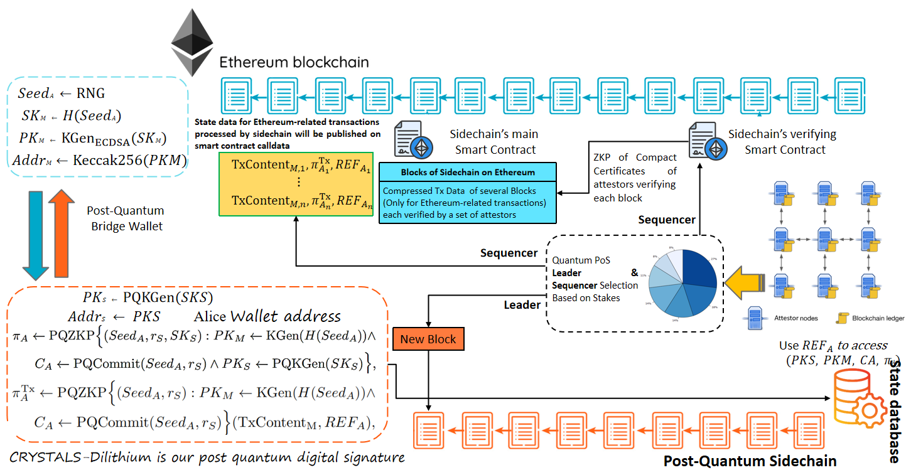

## Post Quantum Hands-on

实操课程.