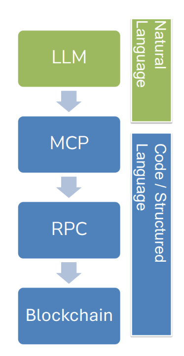

# Blockchain & AI

## MCP

当前Web3下的Blockchain有以下的问题：

- Web3开发虽然功能强大，但过程相当复杂. 

- 其中很多步骤都是重复性的，而且容易出错. 
- 处理ABI、发起RPC调用、完成部署、进行调试，这些环节都非常耗时.

因此，我们考虑将LLM引入进来，结合MCP技术，希望达成学习更快、原型开发更快、失误更少的效果，让智能合约开发变得更简单、更快速、更易上手：

* 大语言模型（LLM）可以帮助自动生成代码、解释错误信息，并与区块链进行交互. 
* 模型上下文协议（MCP）能够为LLM提供受控的工具访问能力

MCP是一种用于连接LLM与各类工具的标准协议，它为LLM提供受控的访问权限，具体涵盖以下几类资源：  

- 文件与目录.  
- RPC接口端点.  
- 智能合约编译器.  
- 区块链节点.  
- 定义API. 

**安全性**：MCP基于权限控制，并在沙箱环境中运行，因此是安全的.

**LLM通过MCP进行通信：** 

* 用户或AI代理使用自然语言指令与LLM进行交互. 
* MCP会提供一份结构化的可用工具说明，其中包括暴露给LLM的函数、参数和功能. 
* 随后，LLM会生成传统代码（如JavaScript、Python、shell命令或RPC调用），这些代码由MCP通过其连接的工具来执行. 

**重要注意事项：** 

- 私钥绝不能存储在MCP代码内部，也绝不能暴露给LLM. 

- 签名操作应当交由安全的外部工具来处理，例如MetaMask、硬件钱包，或专门的签名服务. 

- MCP可以安全地发起只读的区块链调用，或者转发来自安全组件的已签名交易.

整个流程可以理解为一个层层传递的过程： 

1. **LLM**：用户使用自然语言与LLM交互（自然语言层）. 
2. **MCP**：LLM生成的指令经由MCP转化为结构化描述（代码/结构化语言层的起点）. 
3. **RPC**：MCP将请求转换为具体的RPC调用. 
4. **Blockchain**：最终RPC调用作用于区块链，完成读取或交易操作. 

可以看出，从"自然语言"到"代码/结构化语言"，整个流程实现了用户意图到区块链操作的层层转译，而私钥签名这一敏感环节则始终被隔离在这条链路之外，由外部安全工具独立处理，从而保障了整体架构的安全性.

## AI Safety, is blockchain the answer?

