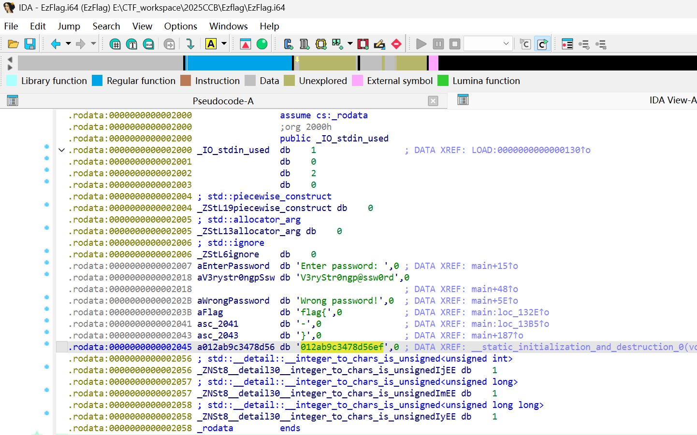

## Crypto

### ECDSA

并不需要看其它文件中的东西，明文已经给出来了. 很奇怪的题目：

```python
from hashlib import sha512
from ecdsa import NIST521p
from hashlib import md5

seed_string = b"Welcome to this challenge!"
digest_int = int.from_bytes(sha512(seed_string).digest(), "big")
curve_order = NIST521p.order
prikey = digest_int % curve_order
res = md5(str(prikey).encode()).hexdigest()

flag = "flag{" + res + "}"
print(flag)
```

`flag{581bdf717b780c3cd8282e5a4d50f3a0}`

### EzFlag

一道跟逆向(弱)相关的题目.

下载下来之后丢进IDA中，转成pseudocode之后找到main函数：

```c
int __fastcall main(int argc, const char **argv, const char **envp)
{
  __int64 v3; // rax
  __int64 v4; // rax
  _BYTE v6[32]; // [rsp+0h] [rbp-50h] BYREF
  _BYTE v7[12]; // [rsp+20h] [rbp-30h] BYREF
  int v8; // [rsp+2Ch] [rbp-24h] BYREF
  char v9; // [rsp+33h] [rbp-1Dh]
  int i; // [rsp+34h] [rbp-1Ch]
  unsigned __int64 start; // [rsp+38h] [rbp-18h]

  std::string::basic_string(v6, argv, envp);
  std::operator<<<std::char_traits<char>>(&std::cout, "Enter password: ");
  std::getline<char,std::char_traits<char>,std::allocator<char>>(&std::cin, v6);
  if ( (unsigned __int8)std::operator!=<char>(v6, "V3ryStr0ngp@ssw0rd") )
  {
    v3 = std::operator<<<std::char_traits<char>>(&std::cout, "Wrong password!");
    std::ostream::operator<<(v3, &std::endl<char,std::char_traits<char>>);
  }
  else
  {
    std::operator<<<std::char_traits<char>>(&std::cout, "flag{");
    std::ostream::flush((std::ostream *)&std::cout);
    start = 1;
    for ( i = 0; i <= 31; ++i )
    {
      v9 = f(start);
      std::operator<<<std::char_traits<char>>(&std::cout, (unsigned int)v9);
      std::ostream::flush((std::ostream *)&std::cout);
      if ( i == 7 || i == 12 || i == 17 || i == 22 )
      {
        std::operator<<<std::char_traits<char>>(&std::cout, "-");
        std::ostream::flush((std::ostream *)&std::cout);
      }
      start *= 8LL;
      start += i + 64;
      v8 = 1;
      std::chrono::duration<long,std::ratio<1l,1l>>::duration<int,void>(v7, &v8);
      std::this_thread::sleep_for<long,std::ratio<1l,1l>>(v7);
    }
    v4 = std::operator<<<std::char_traits<char>>(&std::cout, "}");
    std::ostream::operator<<(v4, &std::endl<char,std::char_traits<char>>);
  }
  std::string::~string(v6);
  return 0;
}
```

比较有用的是这些：

```c
std::operator<<<std::char_traits<char>>(&std::cout, "flag{");
std::ostream::flush((std::ostream *)&std::cout);
start = 1;
for ( i = 0; i <= 31; ++i )
  {
    v9 = f(start);
    std::operator<<<std::char_traits<char>>(&std::cout, (unsigned int)v9); //print v9
    std::ostream::flush((std::ostream *)&std::cout);
    if ( i == 7 || i == 12 || i == 17 || i == 22 )
      std::operator<<<std::char_traits<char>>(&std::cout, "-");
    start *= 8LL;
    start += i + 64;
    v8 = 1;
  }
v4 = std::operator<<<std::char_traits<char>>(&std::cout, "}");
```

以及main函数中调用过的f函数：

```c
__int64 __fastcall f(unsigned __int64 a1)
{
  __int64 v2; // [rsp+10h] [rbp-20h]
  unsigned __int64 i; // [rsp+18h] [rbp-18h]
  __int64 v4; // [rsp+20h] [rbp-10h]
  __int64 v5; // [rsp+28h] [rbp-8h]

  v5 = 0;
  v4 = 1;
  for ( i = 0; i < a1; ++i )
  {
    v2 = v4;
    v4 = ((_BYTE)v5 + (_BYTE)v4) & 0xF;
    v5 = v2;
  }
  return *(unsigned __int8 *)std::string::operator[](&K, v5);
}
```

并且找到K字符串：

<center></center>

所以可以书写payload：

```python
from Crypto.Util.number import long_to_bytes, bytes_to_long

flag = "flag{"
KEY = "012ab9c3478d56ef"

def f(start):
    v5 = 0
    v4 = 1
    for _ in range(start % 24):
        v2 = v4
        v4 = ((v5 + v4) & 0xF) 
        v5 = v2
    print(KEY[v5])
    return KEY[v5]

start = 1
for i in range(32):
    res = f(start)
    flag += res
    if i in (22, 7, 12, 17):
        flag += '-'
    
    start <<= 3
    start %= 0x10000000000000000 # 防止overflow
    start += (i + 64)
    print(start)
    print(flag)

flag += "}"
print(flag)
```

值得注意的有2点：

1. 参数`start`如果按照题目给的代码直接进行迭代是很难跑得动的，后面start数量级很巨大，所以需要引入%24降低运算量；
2. `start`在运算中可能会溢出，导致flag前半部分正确而后半部分错误.


### RSA_NestingDoll

生成素数 `get_smooth_prime` 的逻辑.

对于外层模数 $n = p \times q \times r \times s$，其中的每一个素数（以 $p$ 为例）都是这样构造的：

$$p - 1 = \underbrace{2 \times (\text{很多小素数})}_{\text{Smooth Part (平滑部分)}} \times \underbrace{p_1}_{\text{Large Part (内层素数)}} \times \text{调整项}$$

其中Smooth Part: 由很多 20 bits 左右的小素数相乘得到，**$p_1$**: 是内层模数 $n_1$ 的因子之一 ($n_1 = p_1 q_1 r_1 s_1$)，这是一个 512 bits 的大素数

Pollard's $p-1$ 算法依赖于费马小定理，核心思想是构造一个由大量小素数乘积组成的数 $E$（通常是 $B!$ 或者 $\text{lcm}(1 \dots B)$）. 如果 $p-1$ 是 B-smooth 的（即 $p-1$ 的所有质因子都小于界限 $B$），那么 $p-1$ 就会整除 $E$. 

于是：

$$E = k \times (p-1) \Longrightarrow a^E = (a^{p-1})^k \equiv 1^k \equiv 1 \pmod p$$

这意味着 $a^E - 1$ 是 $p$ 的倍数. 此时计算 $\text{gcd}(a^E - 1, n)$ 就可以把 $p$ 求出来. 

但在本题中标准的 Pollard $p-1$ 会失败，因为 $p-1$包含了一个巨大的因子 $p_1$ (512 bits). 如果设定的界限 $B$ 小于 $p_1$，那么构造的指数 $E$ 里就不包含 $p_1$，导致 $p-1 \nmid E$，于是 $a^E \not\equiv 1 \pmod p$.

所以引入$n_1$ 作为“补丁”. 虽然我们无法生成包含 $p_1$ 的指数，但我们知道 $n_1 = p_1 \cdot q_1 \cdot r_1 \cdot s_1$，这意味着 $n_1$ 本身已经包含了 $p_1$ 因子.

构造 $E' = E_{\text{smooth}} \times n_1$ 其中 $E_{\text{smooth}}$ 是代码中通过 `p_val = next(primes)` 循环累乘出来的部分，它包含了 $p-1$ 中所有的“平滑部分”（小素数）.

数学推导如下：

$$\begin{cases}p-1 = \text{Smooth Part} \times p_1 \\ E' = E_{\text{smooth}} \times n_1 = E_{\text{smooth}} \times (p_1 \cdot q_1 \cdot r_1 \cdot s_1) \end{cases}$$

$E_{\text{smooth}}$ 覆盖了 $p-1$ 的 `Smooth_Part`，$n_1$ 中的 $p_1$ 覆盖了 $p-1$ 的 `Large Part` ，所以 $p-1$ 整除 $E'$. 

因此$a^{E_{\text{smooth}} \cdot n_1} \equiv 1 \pmod p$.

```python
import gmpy2
import math
from Crypto.Util.number import long_to_bytes

n1 = 16141229822582999941795528434053604024130834376743380417543848154510567941426284503974843508505293632858944676904777719167211264225017879544879766461905421764911145115313698529148118556481569662427943129906246669392285465962009760415398277861235401144473728421924300182818519451863668543279964773812681294700932779276119980976088388578080667457572761731749115242478798767995746571783659904107470270861418250270529189065684265364754871076595202944616294213418165898411332609375456093386942710433731450591144173543437880652898520275020008888364820928962186107055633582315448537508963579549702813766809204496344017389879
n = 484831124108275939341366810506193994531550055695853253298115538101629337644848848341479419438032232339003236906071864005366050185096955712484824249228197577223248353640366078747360090084446361275032026781246854700074896711976487694783856878403247312312487197243272330518861346981470353394149785086635163868023866817552387681890963052199983782800993485245670437818180617561464964987316161927118605512017355921555464359512280368738197370963036482455976503266489446554327046948670215814974461717020804892983665655107351050779151227099827044949961517305345415735355361979690945791766389892262659146088374064423340675969505766640604405056526597458482705651442368165084488267428304515239897907407899916127394598273176618290300112450670040922567688605072749116061905175316975711341960774150260004939250949738836358264952590189482518415728072191137713935386026127881564386427069721229262845412925923228235712893710368875996153516581760868562584742909664286792076869106489090142359608727406720798822550560161176676501888507397207863998129261472631954482761264406483807145805232317147769145985955267206369675711834485845321043623959730914679051434102698588945009836642922614296598336035078421463808774940679339890140690147375340294139027290793
ciphertext = 657984921229942454933933403447729006306657607710326864301226455143743298424203173231485254106370042482797921667656700155904329772383820736458855765136793243316671212869426397954684784861721375098512569633961083815312918123032774700110069081262242921985864796328969423527821139281310369981972743866271594590344539579191695406770264993187783060116166611986577690957583312376226071223036478908520539670631359415937784254986105845218988574365136837803183282535335170744088822352494742132919629693849729766426397683869482842748401000853783134170305075124230522253670782186531697976487673160305610021244587265868919495629
e = 65537

def solve():
    factors_n1 = set()

    def get_primes(limit):
        yield 2
        for i in range(3, limit, 2):
            is_prime = True
            for j in range(3, int(i**0.5) + 1, 2):
                if i % j == 0:
                    is_prime = False
                    break
            if is_prime:
                yield i
    a = 2
    curr_n = n 
    B = 100000000
    interval = 500 

    primes = get_primes(B)

    idx = 0
    while len(factors_n1) < 3 and curr_n > 1:
        E = 1
        for _ in range(interval):
            p_val = next(primes)
            E *= p_val
        
        idx += interval
        a = pow(a, E, curr_n) 
        po = pow(a, n1, curr_n)
        g = math.gcd(po - 1, curr_n)

        if g > 1:
            p1_candidate = math.gcd(g - 1, n1)
                
            if p1_candidate > 1:
                if p1_candidate not in factors_n1:
                    factors_n1.add(p1_candidate)
                    print(f"Found n1 factor: {p1_candidate}")
            curr_n //= g
            a %= curr_n 
                
        if idx % 50000 == 0:
            print(f"Count: {idx}")
                
        if len(factors_n1) == 3:
            print("All factors found")
            break

    final_factors = list(factors_n1)
    
    if len(final_factors) == 3:
        product_3 = final_factors[0] * final_factors[1] * final_factors[2]
        factor_4 = n1 // product_3
        final_factors.append(factor_4)
        print(f"Calculated 4th factor: {factor_4}")
    
    if len(final_factors) != 4:
        print(f"Failed to find all factors. Found: {len(final_factors)}")
        return

    phi = 1
    for f in final_factors:
        phi *= (f - 1)
    
    d = gmpy2.invert(e, phi)
    m = pow(ciphertext, d, n1)
    flag = long_to_bytes(m)
    print(f"{flag}")
    
solve()
```

