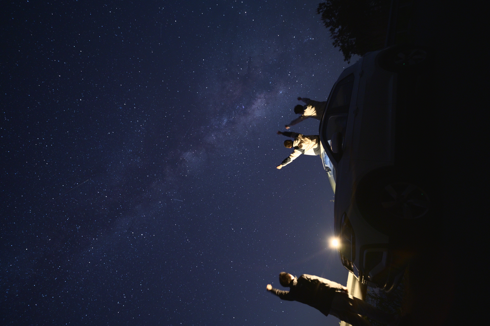
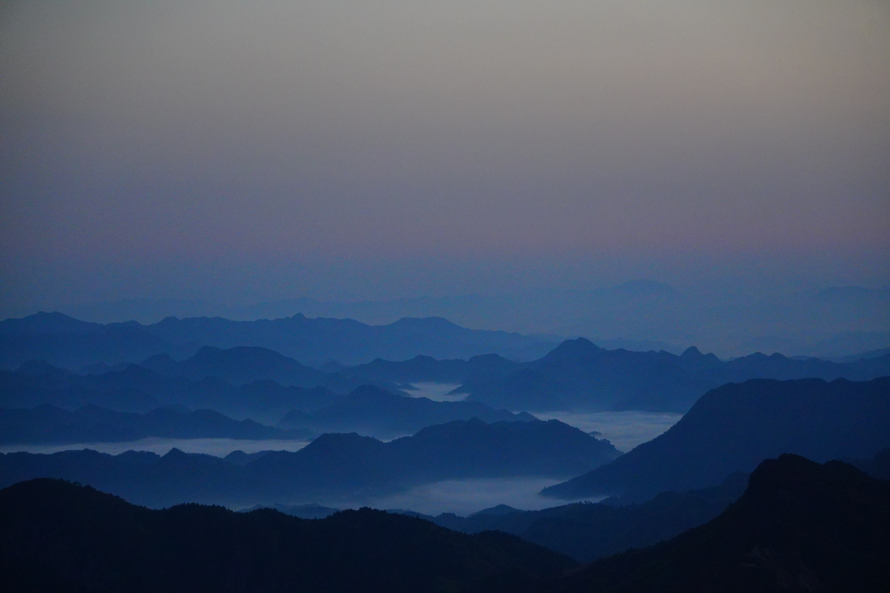
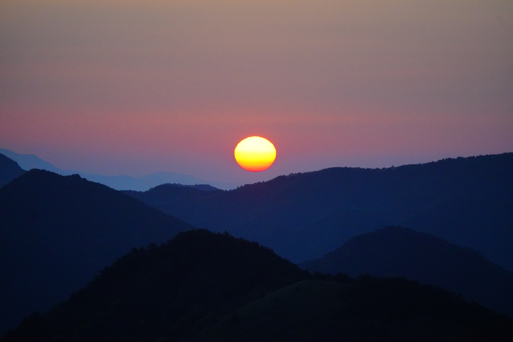
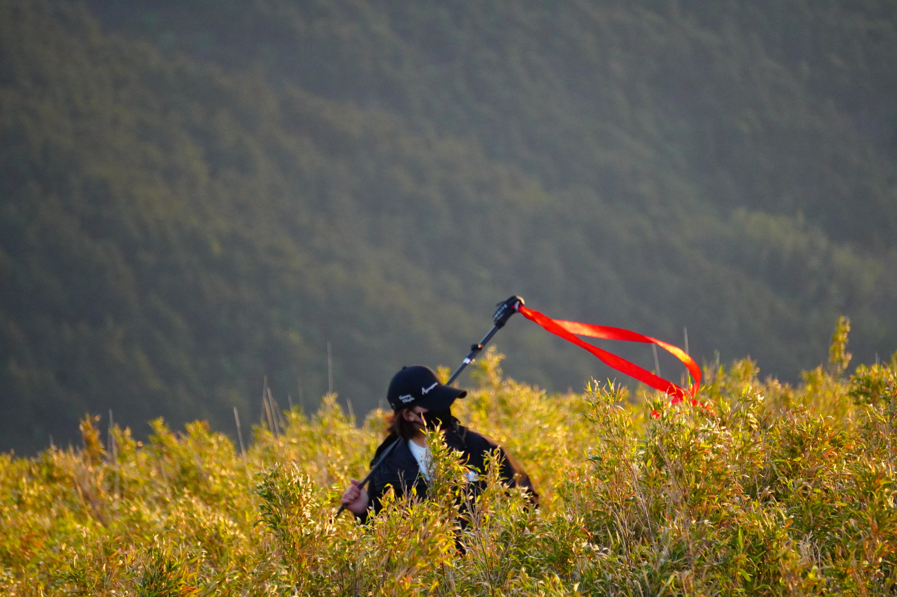
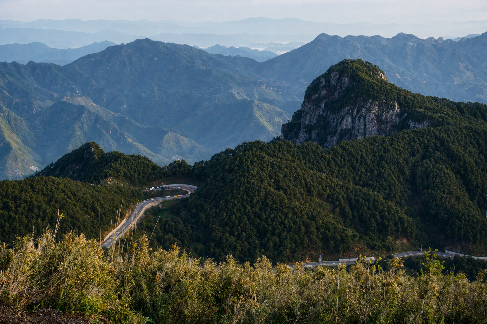
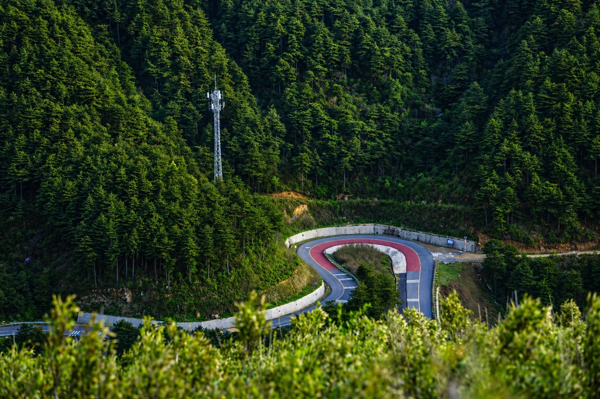
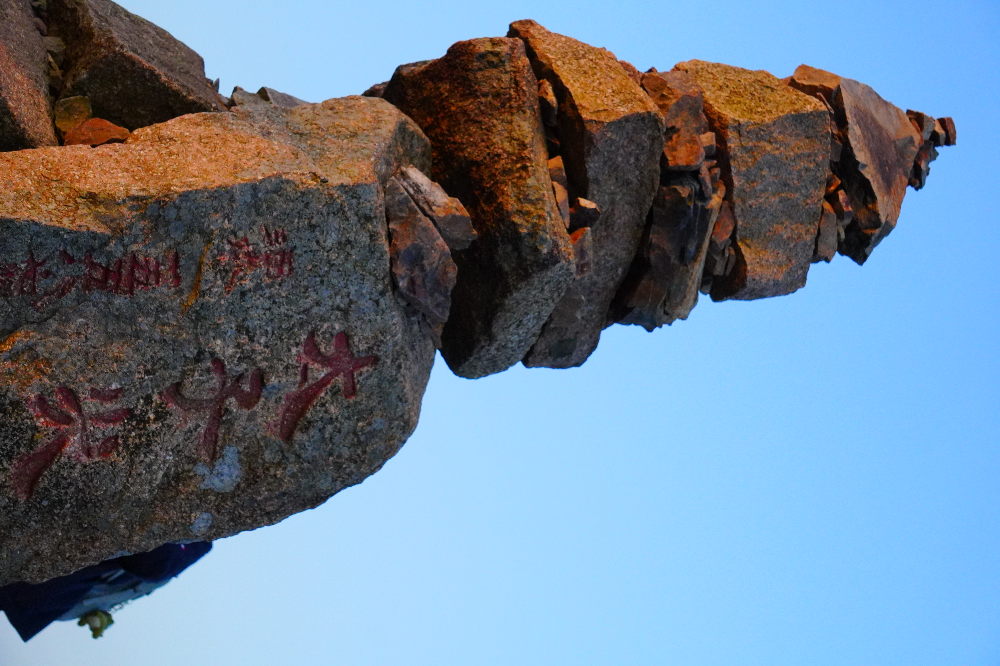
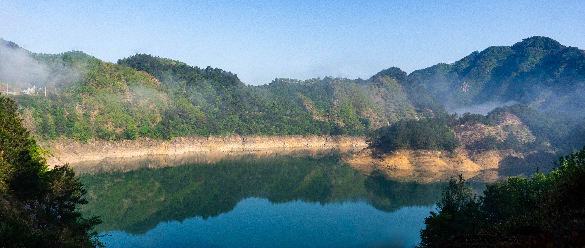

# 银河凝结成冰——临安太子尖

在4.25，4.26两天临时起意自驾去了太子尖，于是浅浅记录一下行程。这大概是我准备最不充分但印象最为深刻的一场旅行了。

**4.24晚** 我正在被某门课作业折磨得快丧失理智的时候，朋友P在微信上问我要不要拼车去太子尖。在我对临安极浅的印象中，太子尖去年年底刚失火，现在人应该不多；且登山看日出并不需要太多的准备，正好也特别想在五一附近出门逛逛，于是欣然同意，约定了4.25晚出发。我并没意识到夜晚山顶大风和晨雾可能使人失温的严重性，只是买了面包咖啡，给相机充满了电，带上三脚架和新的内存卡就出发了。事实证明，厚的衣服还是需要准备的，4月末凌晨登山完全是城区冬季的感觉。

**4.25晚** 与P和新朋友Z会合，发现是租车自驾（内心：还好我也有驾照能开一段）。P先开城区一带，等到临安服务区后Z来，一路上还挺愉快。回程的时候，P开了下山路，我开了一段惊险的村道，从龙岗镇回杭州的高速由Z来。太子尖虽然说是在临安，实际上是在浙皖边界，进山也需要很长的时间。

临安的山区道路在夜间很险，我未必敢独自来。即使开了远光灯，可见的范围仍然只有10米左右，基本上是龟速爬行上山。一路上处处是急弯和坡，会车的远光灯使坐在副驾上的我有点揪心。开到离太子尖20公里的时候，我们在一个驿站稍微停留了一会，这时候星空可见度已经不错——裸眼可以看到北斗七星，只可惜月亮实在是过于“耀眼”，在夜间拍摄时造成了一点干扰。小驿站旁边的溪流水很急，轰隆的声响在夜晚相当惊心动魄。

随着海拔的爬升和夜色渐深，我们的车速越来越慢。路上几公里才能遇到村庄的行人或者车，日光下原本稀松平常的照壁、白色平房在此刻显得非常阴森。偶尔直面大货车的远光时，我感觉几乎要失明了。就这么慢慢挪到驿站，看到“离太子尖驿站3km”等等一系列路牌，才逐渐宽慰下来。

太子尖驿站在我们到达的晚上10点钟时，还是一片黑暗。小店打烊，玻璃上写着“肉包子 6元 // 烤肠 10元”，断了电的冰柜塞满饮料。灯光几乎全部由道路右边停着的一排车贡献，卖咖啡的卷帘餐车点着黄色灯。路边帐篷随处生长，还能看到两辆房车。在一些转弯处，也能看到架着充电的相机闪着红色绿色的光指着天空。我们好奇地看着一台对着星空的相机（抱歉我实在是不甚了解型号），两个驴友警惕地走过来，看我们也带着相机才没说什么。简单交流了几句，黑衣服的笑笑“发抖了就下来，清凉峰之前10°C都有人冻死”。我确实御寒准备不足，于是接下来Z和P在挪动车子找银拱拍摄点时，一直躺在副驾驶座眯着眼睛保存体力，准备挨到既定出发的3点钟。

**4.26凌晨** Z拍完了银拱，我也醒了过来。半梦半醒间，我做出的判断像在梦游呓语，譬如将电线的反光误认为是山下的激光。Z用延时给三人拍了一张可以说是人生照片的合影：银河群星下，坐在车顶双手上举。稍显仓促，但是足够难忘。这个时候，我最大的感想是《熊出没》一首主题曲里面的“银河已凝结成冰”。远处的云海也有点起来了，但是整体上还是神秘莫测，向路边的悬崖下面望去几乎全黑，只有隐隐流动的乳白色绕在对面的群山之间。

即使只是坐在车顶上2分钟，我就被冻得不行了，马上又钻回了车里面。还好驿站可以租军大衣，于是抛掉重物，慢慢往山上走。

山上雾气很重，一半是木头台阶，另一半是嵌着各种石头的土坡。土壤很湿很实，没多久鞋尖也湿了。路完全看不清，手电也仅仅只能照到眼前的5-6级台阶，一步步抹黑上去。泥坑和石头很滑，风刮得头稍微有点晕，不过只用了半小时就登上了顶，不算特别累。手电在路上照到005，007的路牌，开始以为是进度条，后来知道应该是报警坐标。

山顶上也有两顶帐篷，估计是为了拍日出直接选择山顶过夜的人。蓝调时刻来得很快，山下的城镇点点灯光连成了一张网（对焦全靠这些光点），这时候我才掏出三脚架支起来，拉大感光度以拍出山峦层层叠叠的状态。

原图直出，噪点太多反而很有画的质感（自吹）

太子尖顶的平台并不是很大，稍远处有一个观景台，视野很开阔。等到天基本全亮的时候，才看清楚远处的盘山公路。太阳从山的缺口爬上来，光线极度柔和，洒在坡上连绵不断的过腰黄色野草上（不知道是什么植物，不过站在里面拍人像估计很出片），肉眼看可以分辨出四层红黄。

原图直出

抓拍了路人小姐姐，对焦不是很准

太子尖的“最高点”实际上是堆叠了半米高的石头，我们合照的时候也有驴友往上堆了几块。风很大，等太阳完全升起后我们立刻下了山。我们的车几乎出了太子尖一带时，雾拦住前路，才知道错过了云海最盛的黄金时段。

**4.26 上午** 下山的路相对好开很多，视野很好，从山腰抓拍飘带似的公路色彩层次极好，只是我刚开始开的时候起了雾，能见度下降让人稍微心惊胆战了一点。我们花了一个小时到达了龙岗镇，沿途遇到了好几处天造般的景象。

为了抹掉电线，山的边缘有点修残了

所谓“浙西天路”确实难开，几乎是时时刻刻都在转弯和上下坡。更为神奇的是，时常出现一段限速60，开了500m马上变成限速40，一会又降到30，我希望我不会吃到超速罚单……

龙岗镇可以一路高速回到紫金港，1h就回来了，相当舒畅。虽说感觉还有很多剩余的体力，不过还是老实地补了一下午的觉。

今天修了几张图之后，剩余的偷懒直接喂给ChatGPT大人了，感觉再过几年说不定会有职业级摄影后期AI，不需要人来做蒙版、调色、去污点等等耗时的活也能获得奖项级的后期体验了。