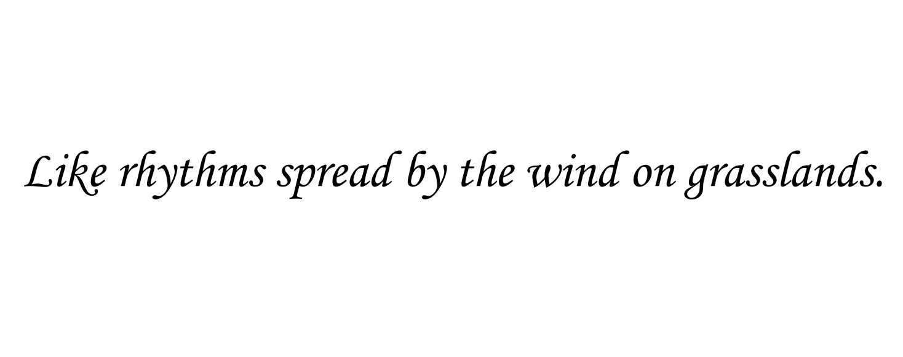

> 岁月悠悠。时间毫不间歇地流逝着。人们落生在这个世界上，最早意识到的是包围着自己的空间。这空间有着长度、宽度和高度，其中充满了各异的形态、色彩与音响……而后人们便意识到还有着一种与空间并存的东西，那便是摸不着、握不牢、拦不住的时间。在所存在的空间里度过着不断流逝的时间，这便构成了我们的生活，于是乎喜、怒、哀、乐，于是乎生、死、歌、哭……

> ……

> 鼓楼在前，红墙灰瓦。钟楼在后，灰墙青瓦。

> ——刘心武《钟鼓楼》

本站点放置的是学习笔记，已经与[原先的博客](https://github.com/Grapesea/MyBlog)分离。

十八岁的寒风几近吹散我的锐气，但是阴差阳错地跨过关口挡住了那一波冲击。

2025年，北风又从今夜开始吹起。

