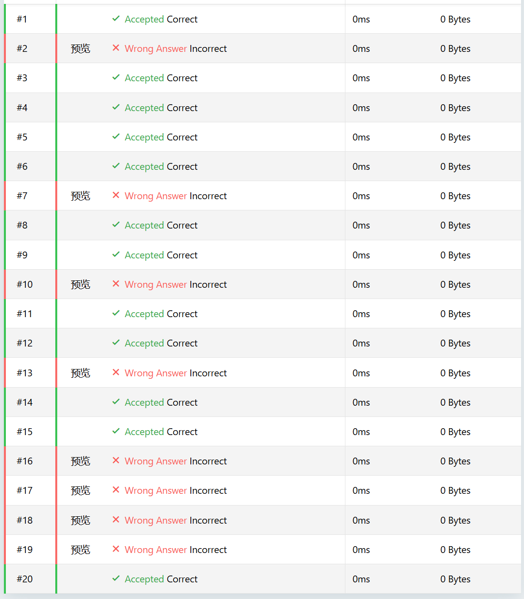
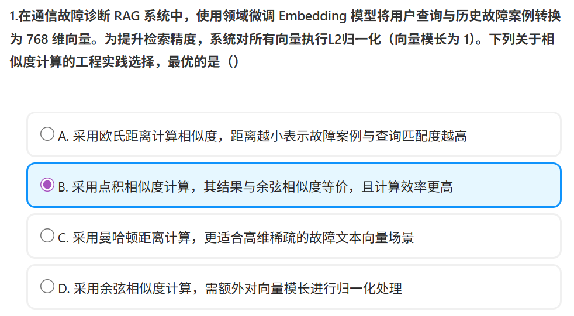

# AI岗机考-20260513

> [题库链接 - CodeFun2000](https://codefun2000.com/p/P4937)

结果：78/120

根据已有的两次自主练习来看（上一次是[20260509](https://codefun2000.com/p/P4904)，得72分），有些题目虽然不懂，但是可以排除法做出；有些题目几乎是无法做对的.

答案：B

D是错的，因为已经归一化，不需要额外处理

