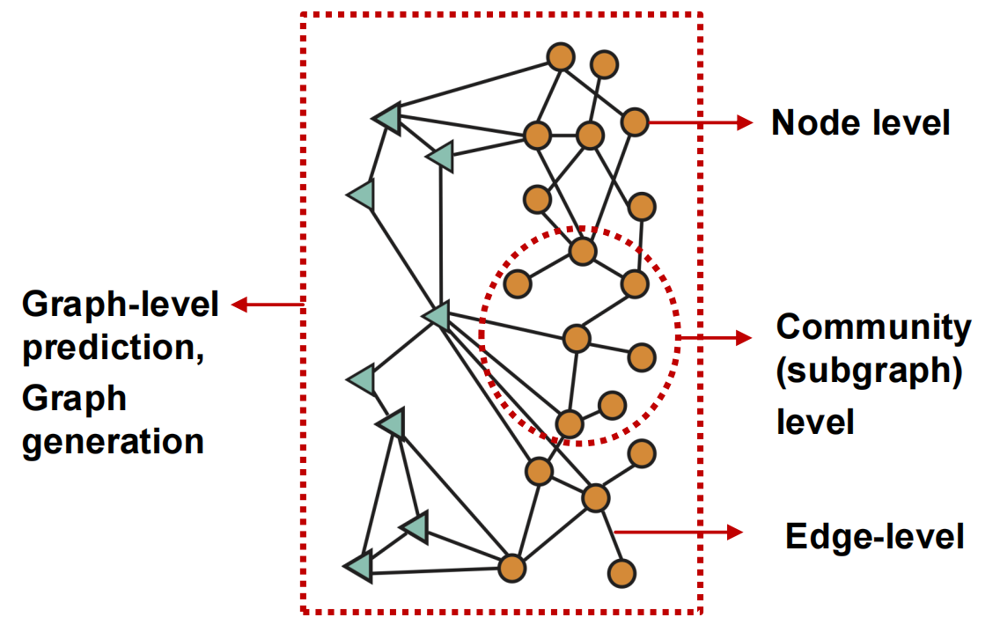
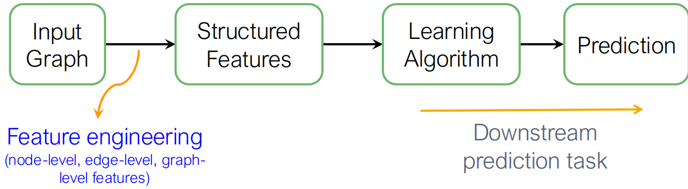
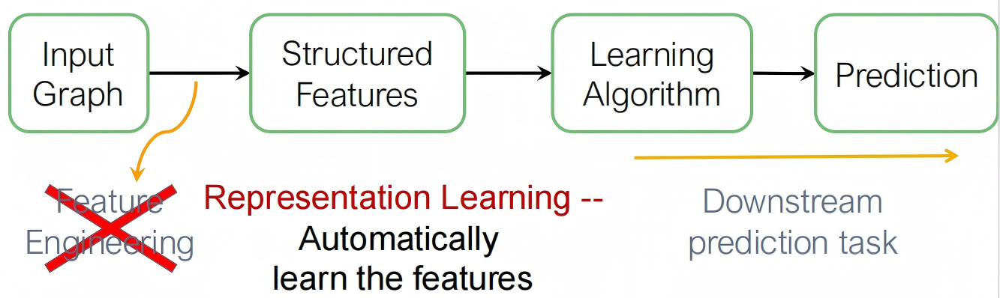
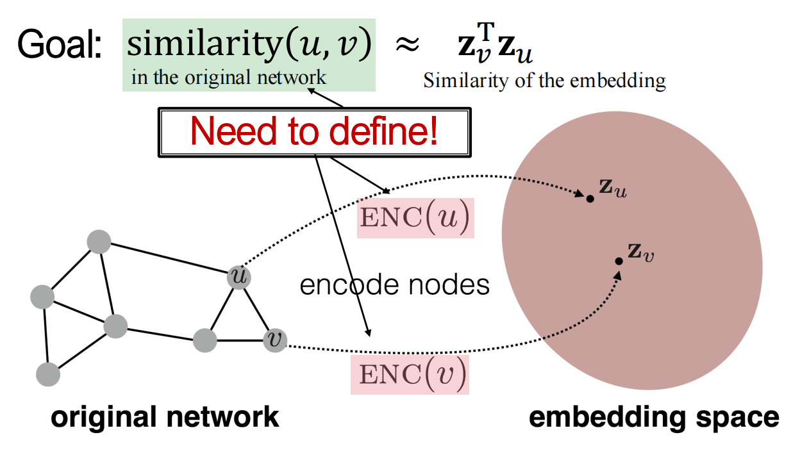
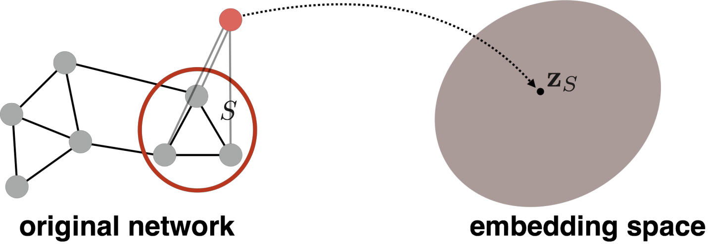
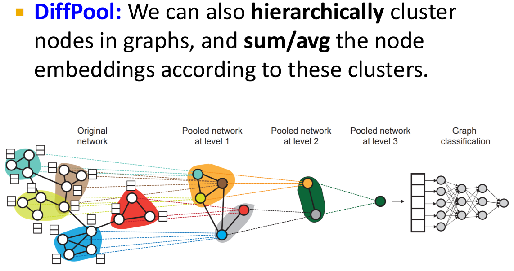
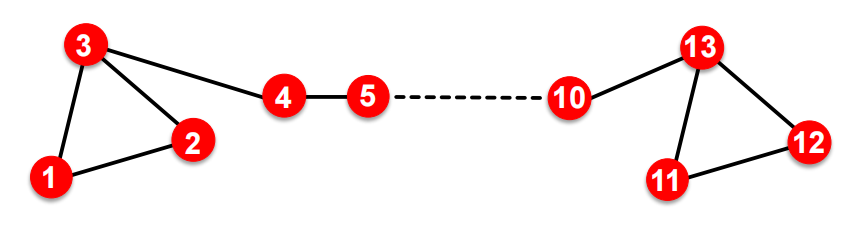

# Lec01-02:Introduction&Node Embedding

## Graph Introduction

### Choice of Graph Representation

A heterogeneous graph (异质图) is defined as $G = (V,E,R,T)$. 

其中$V: \text{(nodes with types) } v_i \in V$，$E: \text{(edges with relation types) }(v_i, r, v_j)\in E$，节点类型 $T(v_i)$，关系类型 $r \in R$.

---

Bipartite Graph (二分图)：可以将节点分成2个disjoint sets $U,V$，其中每一条边都连接了$U$和$V$中的一个点.

### Applications of Graph ML

Tasks可以被分成许多种类：

* Node-Level Prediction：如Node Classification, Protein Fold (AlphaFold)
* Link-Level Prediction：如预测new/missing/unknown links的推荐系统算法、药物副作用
* Graph-Level Prediction：如交通路况预测（将Road Segments视作Node, Connectivity between road segments视作Edge）中的到达时间预测、药物发明（将Atoms视作Node,  将Chemical bonds视作Edge）、物理仿真（ 将Particles视作Node, Interaction between particles 视作 Edges，预测系统的下一步情况 $\Longrightarrow$ 天气预测）

## Node Embeddings

### Recap

传统的ML将feature映射到label中，但是Graph ML减轻了对每次 feature engineering 的需求量.

Traditional ML

Graph ML

我们希望用Graph ML做到有效的task-independent feature learning！

### Embedding

引入 embedding 能把图中的每个节点映射成一个低维向量，让“图中的相似性”变成“向量空间中的距离或相似度”.这样可以编码 network 信息，并用于一些 downstream prediction.

#### Encoder and Decoder

现在有一个无向图$G(V, E, R, T)$，设$A$是其对应的01邻接矩阵. 为了简化，这里没有引入 node features 以及节点的额外信息. 我们的目标是将节点encode，使得embedding space中节点的相似度跟graph中节点的相似度是接近的.

计算相似度：$\text{similarity}(u,v) \approx \vec{z}_v^T\vec{z}_u$

Encoder我们定义为$ENC(v) = \vec{z}_v$，接受input graph中的node $v$，输出$d$-dimension embedding.

Decoder我们定义为embedding之间的相似度，即$\vec{z}_u, \vec{z}_v \mapsto \text{similarity}(u,v)$.

最为简单的一种encoding方式是，**将encoder理解成一种embedding的"查找"**：我们认为存在一个矩阵$\mathbf{Z} \in \mathbb{R}^{d \times |V|}$，使得$\forall v \in V, ENC(v) = \vec{z}_v = \mathbf{Z}\cdot v$.

而最简单的decoding方式是：$\text{similarity}(u,v) = \vec{z}_v^T\vec{z}_u$

> 这样的处理有很明显的缺陷：不能处理没见过的新节点，也不使用节点的特征；参数数量＝node 数量，因此大规模数据下$Z$的规模无法控制.

如何定义node similarity是极其重要的，此处先引入基于**random walks**的节点相似性定义，以及如何根据这种相似性优化 node embeddings.

#### Random Walk Approaches

Random walk指的是，在无向图$G$中给定一个出发点$P$，随机选择它的一个neighbor并移动，不断重复这一步骤，得到的sequence就称为一个random walk.

定义概率$P(v|\vec{z}_u)$，表示从$u$节点通过random walk到$v$节点的可能性.

Sigmoid, Softmax这两个曾经学过的非线性函数可以用于产生预测概率.

于是我们可以认为$\vec{z}_v^T\vec{z}_u$近似表示$u,v$同时在一个random walk中出现的概率.

使用Random walks的好处主要有两个，既有可解释性（expressivity），if random walk starting from node $u$ visits $v$ with high probability, $u$ and $v$ are similar (high-order multi-hop information)；又是高效率的，我们只需要考虑同时出现在random walks上的节点对就行了.

**Unsupervised Feature Learning**(无监督表示学习)：我们定义$N_R(u)$是节点$u$在某种 random walk 策略$R$下获得的相邻节点的集合（称neighborhood）.

优化的表示学习：Given node 𝑢, we want to learn feature representations that are predictive of the nodes in its random walk neighborhood $N_R(u)$.

我们取一段较短的定长random walk线路作为**上下文窗口**.

定义损失函数$\mathcal{L}$:

$$\mathcal{L} = \sum\limits_{u \in V} \sum\limits_{v \in N_R(u)} -\log (\dfrac{\exp(z_u^Tz_v)}{\sum\limits_{n \in V}\exp(z_u^Tz_n)})$$

前面的双重$\Sigma$表示：遍历图中所有节点$u$，对$u$，遍历它的random walks上的所有邻居节点$v$.

后面的函数是Softmax的变形，将所有候选节点的分数变成概率.

但是这样的定义成本太高，需要$O(|V|^2)$时间复杂度. 于是我们引入了Negative Sampling(负采样)方法：（$\sigma$是Sigmoid函数，$\sigma(x) = \dfrac1{1+e^{-x}}$）

$$\log (\dfrac{\exp(z_u^Tz_v)}{\sum\limits_{n \in V}\exp(z_u^Tz_n)}) \approx \log(\sigma(z_u^Tz_v)) + \sum\limits_{i=1}^k \log (\sigma(-z_u^Tz_{n_i})), n_i \sim P_V$$

随机梯度下降（Stochastic Gradient Descent）：当我们获得了objective loss function之后，可以使用梯度下降来进一步最小化损失函数，此处记$\eta$为学习率：

$$z_u \leftarrow z_u - \eta \dfrac{\partial \mathcal L}{\partial z_u}$$

SGD最大的优点是不需要对所有sample一起求梯度，而是对每个单独的训练案例求梯度.

过程：

* 对所有node $u$随机初始化$z_u$;
* 不断迭代 $\mathcal L ^{(u)} = \sum\limits_{v \in N_R(u)} -\log (P(v|z_u))$ 直到收敛：
    * 取节点$u$，对其他所有节点$v$计算梯度$\dfrac{\partial \mathcal L ^{(u)}}{\partial z_v}$;
    * 对于所有的$v$，更新$z_v \leftarrow z_v - \eta \dfrac{\partial \mathcal L ^{(u)}}{\partial z_v}$.

## 论文阅读：Node2vec

参见[论文阅读：Node2vec](./papers/node2vec.md)部分.

需要注意的是，任何一种方法不可能在所有情况下都成功，比如[某些方法](https://arxiv.org/abs/1705.02801)能够在link prediction上优于node2vec. 尽管node2vec在node classification上表现不错并且泛化性较优.

## Embedding Entire Graphs

我们希望将一个subgraph或者整个图$G$进行embedding处理. 设结果是$z_G$.

主要任务是：

* 区分 toxic 和 non-toxic molecules
* 识别anomalous graph

[方法1](https://arxiv.org/abs/1509.09292)：（Simple but effective）直接对整个 graph 跑一次标准的 embedding ，然后直接加起来作为结果

$$z_G = \sum\limits_{v\in G} z_v$$

[方法2](https://arxiv.org/abs/1511.05493)：引入虚拟节点来**替代**子图，再跑一次标准embedding

> Preview: Hierarchical Embedding
>
> 

## Matrix Factorization and Node Embeddings

### Matrix Factorization

之前我们提出了起到lookup作用的embedding matrix $\mathbf{Z}$，我们现在希望，对于我们认定是similar的node pair $(u,v)$，将$z_v^T z_u$最大化.

最简单的node similarity定义是，只要被一条边连接就认为是similar.

这相当于直接令$z_v^T z_u = A_{u,v}$，其中$A$是$G$的邻接矩阵，进一步就能得到

$$\mathbf Z^T \mathbf Z = A$$

---

LADR中提到过，直接进行这一分解是很困难的，但是我们可以将其转换成一个最优化问题来处理，即求出使得

$$\min\limits_{\mathbf Z} \|A - \mathbf Z^T\mathbf Z\|_2$$

最小的$\mathbf Z$来完成近似求解.

---

DeepWalk有更为复杂的node similarity定义，在数学上等价于矩阵分解下面的表达式：

$$\log (vol(G)(\dfrac1T\sum\limits_{r=1}^T(D^{-1}A)^r)D^{-1})-\log b$$

其中 $vol(G) = \sum\limits_i\sum\limits_jA_{i,j}$表示图的大小，$T = |N_R(u)|$表示上下文窗口大小，$r$表示走$r$步，$D := D_{u,u} = \deg(u)$表示对角矩阵，$b$表示负样本的数量.

Node2vec也可以被转化成（较复杂的）矩阵分解问题.

---

### Node Embedding的用途

* **Clustering/community detection**：可以对节点直接做聚类
* **Node classification**：基于embedding结果进行标签预测
* **Link Prediction**：基于$(z_i,z_j)$预测是否存在$(i,j)$这条边（需要用到二元算子，详见Node2vec论文）
* **Graph classification**：聚合所有节点得到$z_G = \text{AGG}\{z_1,z_2,\cdots,z_n\}$并进行sum/avg/virtual node等处理，再用分类器去预测图的标签.

## Limitations

* Transductive(可直推) but not inductive(可归纳)：基于matrix factorization和random walks的node embedding不可以获取不在图内的节点的信息，也不可以应用于新的图（如果新添加一个节点，DeepWalk和node2vec方法需要重跑所有结点的结果才行）

* Cannot capture structural similarity:  这是DeepWalk和node2vec的共同问题，例如以下的结构中虽然1和11是结构近似的，但是却有着完全不同的 embedding 结果

    

* Cannot utilize node, edge and graph features：对一些特征的使用不足

于是我们自然而然过渡到下一节：**Deep Representation Learning and Graph Neural Networks**.

