# Lec03-05:GNN

## Introduction

Deep Graph Encoder: $\text{ENC}(v)$是基于图结构的多layer非线性变换，其中所有的deep encoder都可以与上一讲提到的node similarity function相结合.

我们能够依据此完成的任务：

* Node Classification
* Link Prediction
* Community Detection
* Network Similarity

现代的ML Toolbox主要是为了simple sequences & grids设计出来的，但是networks远比这个复杂得多，有着更加复杂的拓扑结构和不确定的size（不像grids一样有空间局部性），没有固定的个节点排列顺序或者具备reference point，并且经常是动态且有多模态特征的.

## Deep Learning for Graphs

### Preliminary

深度学习中我们定义了损失函数

$$\mathcal L = \min\limits_{\Theta} \mathcal L(y, f_{\Theta}(x))$$

其中$f$可以是任何layer, MLP或者neural networks，$x$是输入数据中的小规模抽样

在给定$x$的情况下，forward propagation就是计算出$\mathcal L$，而back propagation是用链式法则计算出$\nabla_{\Theta}\mathcal L$.

我们用SGD，迭代多轮优化权重$\Theta$的损失函数$\mathcal L$.

### DL 4 Graphs

在这个部分，我们将分析：

* Local network neighborhoods：如何描述聚合策略，定义computation graphs(计算图).
* Stacking multiple layers：如何描述模型、参数、训练，以及如何拟合模型，并给出一些关于unsupervised learning和supervised learning的例子.

首先定义：我们有图$G$，$V$是节点集合，$A$是邻接矩阵，$X\in \mathbb{R}^{||V| \times m}$是节点特征向量构成的矩阵，$v$是$V$中的节点，$N(v)$是$v$的邻居节点的集合. 节点的特征包括：Social networks (eg. User Profile, User Image), Biological networks (Gene expression profiles, Gene functional information),  指示向量（对节点one-hot编码）.

#### Naive Approach

最简单的方法是直接拼接邻接矩阵和特征，喂给神经网络.

这个做法存在以下问题：

* 参数量是$O(|V|)$，对于不同size的graph适配性不强
* 结果对节点顺序敏感

下面介绍可行的解决方法：

#### Convolutional Networks Approach

Convolutional Networks (卷积网络) 用来解决MLP（Multi-Layer Perceptron，多层感知机）未能处理的顺序敏感问题，为此我们引入一个在所有位置上共享的kernel，并且要求函数$f$满足以下要求之一：

* Permutation Invariant (置换不变)：$f(A,X) = f(PAP^T, PX)$，$P$是任意的permutation matrix (置换矩阵)，这表明换了节点顺序之后，函数输出结果是不变的.
* Permutation Equivariant (置换等变)：$P f(A,X) = f(PAP^T, PX)$，$P$是任意的permutation matrix (置换矩阵)，这表明换了节点顺序之后，函数输出结果与置换矩阵同步改变.

举一些满足的例子：

* $f(A,X) = 1^T X$，表示对所有节点的特征求和，这满足1.置换不变
* $f(A,X) = X$，直接返回特征矩阵，这满足2.置换等变
* $f(A,X) = AX$，聚合邻居特征，这满足2.置换等变

GNN就是由一些满足这二者之一性质的layer聚合起来的，这实现了MLP没能做到的内容.

## Graph Convolutional Networks

一个节点的邻居能够定义一个计算图. 我们希望学习的是，如何通过图中信息的传播路径来得到node features. $\Longrightarrow$ **直觉上，可以用神经网络，让节点从它们的邻居那里聚合信息！**

我们从每个节点出发，从Network Neighborhood中抽出并定义computation graph：

多层Deep Model可以是任意深度，node $v$ 的 Layer-0 embedding 是它的input feature $X_v$，Layer-k embedding是从节点$v$向外跳了$k$步之后得到的.

Neighborhood Aggregation：

### Basic Approach

基础的想法是，将neighbors的信息进行平均，应用一个神经网络.

对每一个节点$v \in G$：

* 初始化: $h_v^0 = X_v$;
* 迭代：$h_v^{k+1} = \sigma(W_k\sum\limits_{u \in N(v)} \dfrac{h_u^{(k)}}{|N(v)|} + B_kh_v^{(k)}), \quad \forall k \in \{0, \cdots, K-1\}$，其中$\sigma$是非线性的激活函数，如ReLU/Sigmoid函数，$h_v^{(k)}$是$v$在第$k$层的embedding，$\sum\limits_{u \in N(v)} \dfrac{h_u^{(k)}}{|N(v)|}$是对前一层embedding的neighbor信息作平均，$K$是总共的层数;
* 寄存最终结果：$z_v = h_v^{(K)}$.

需要注意的是，此处的求和是一种Permutation Invariant (置换不变)的计算方法. 所以**对于某个固定节点，其 embedding 的计算结果与邻居的排列顺序无关 $\textcolor{red}{\text{(Permutation Invariant)}}$**.

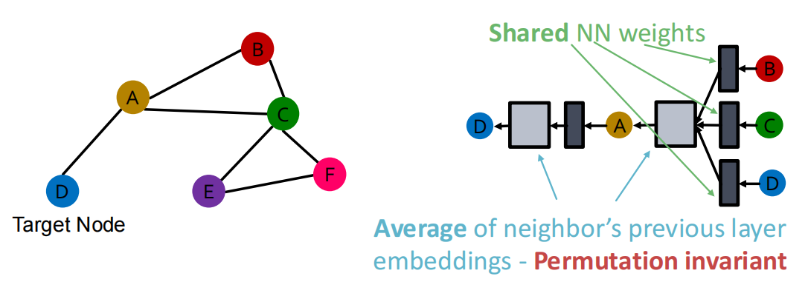

**而对于整张图中的node来说，GCN是$\textcolor{red}{\text{Permutation Equivariant}}$**，这可以理解成，只是对节点的命名做了线性变换，过渡矩阵是$Z$，使得先前的排列$A$变成后面的排列$A'$为：$A' = ZA$，这样结果上也相当于做了乘以$Z$的线性变换.

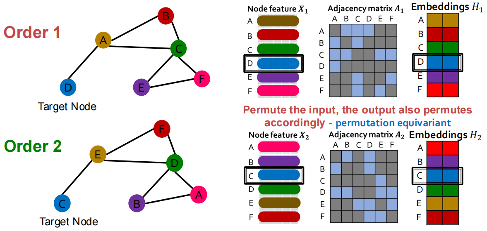

### Training the Model

训练GCN来生成embedding，首先需要定义一个loss function.

现在我们重新看这个生成过程：

> 对每一个节点$v \in G$：
>
> * 初始化: $h_v^0 = X_v$;
> * 迭代：$h_v^{k+1} = \sigma(\textcolor{red}{W_k}\sum\limits_{u \in N(v)} \dfrac{h_u^{(k)}}{|N(v)|} + \textcolor{red}{B_k}h_v^{(k)}), \quad \forall k \in \{0, \cdots, K-1\}$，其中$\sigma$是非线性的激活函数，如ReLU/Sigmoid函数，$h_v^{(k)}$是$v$在第$k$层的embedding，$\sum\limits_{u \in N(v)} \dfrac{h_u^{(k)}}{|N(v)|}$是对前一层embedding的neighbor信息作平均，$K$是总共的层数;
> * 寄存最终结果：$z_v = h_v^{(K)}$.

其中标红的矩阵$W_k, B_k$是trainable weight matrices：

*  $W_k$是描述neighborhood aggregation的weight matrix
*  $B_k$是描述transforming hidden vector of self的weight matrix

我们如果用矩阵来表达这个过程，可以这样思考：

* 首先将一些聚合的操作看成是 sparse matrix operations，令隐藏状态矩阵$H^{(k)} = [h_1^{(k)}, \cdots, h_{|V|}^{(k)}]^T$是一个由各隐藏层的embedding构成的$|V| \times d$ 矩阵

* 于是从邻接矩阵$A$中抽取出$A_{v,:}$来表示$v$的邻居关系（选择改行），可以将$\sum\limits_{u \in N(v)} \dfrac{h_u^{(k)}}{|N(v)|}$化成$\dfrac{A_{v,:}H^{(k)}}{|N(v)|}$. 令$D = \operatorname{diag}(\deg(v_1), \deg(v_2), \cdots,\deg(v_{|V|}))$，即$D_{v,v} = \deg(v) = |N(v)|$，则$\dfrac{A_{v,:}H^{(k)}}{|N(v)|}$可以进一步化成$D^{-1}AH^{k}$，那么原式可以看成：

    $$H^{(k+1)} = \sigma(\textcolor{red}{\tilde{A}H^{(k)}W_k^T} + \textcolor{blue}{H^{(k)}B_k^T})$$

    其中$\tilde{A} = D^{-1}A$，红色是neighborhood aggregation, 蓝色是self transformation.

* 实际上，这表明此处可以使用较高效的稀疏矩阵乘法（$\tilde A$是sparse matrix），但是要注意的是，在聚合函数较复杂的时候，并不是所有的GNN都能被简单表示成一个矩阵，如attention或者动态权重下.

训练GNN：

* 首先根据输入的$G$和node embedding function，得到embedding $z_v$;

    * 监督设置：有初始node label，我们直接考虑最小化损失$\mathcal{L}$:

        $$\min\limits_{\Theta}\mathcal L (y, f_{\Theta}(z_v))$$

        其中$y$是node label，$\mathcal L$ 依赖 $y$ 给出（如果是实数则定义成L2均方误差；如果是分类label则定义成交叉熵）

    * 无监督设置：没有初始node label，直接使用图结构作为监督！

* Supervised: 直接根据监督任务来训练，如对节点进行classification：

    
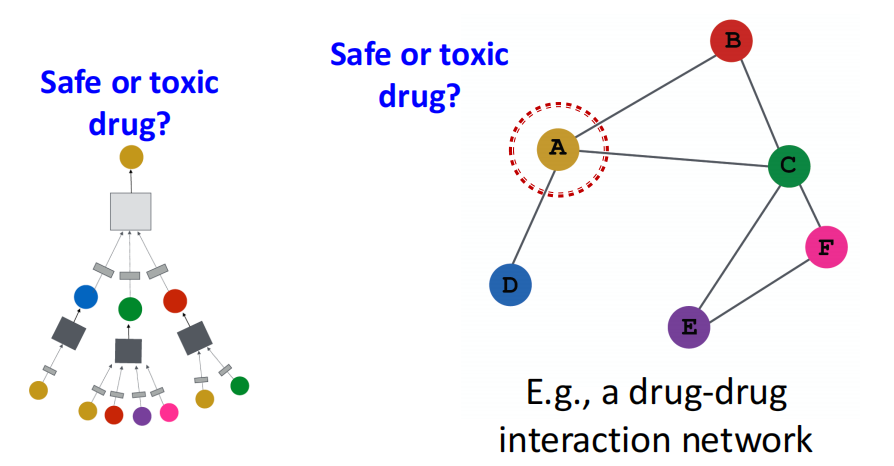

    使用交叉熵loss

    $$\mathcal L = -\sum\limits_{v \in V} [y_v \log(\sigma(z_v^T\theta)) + (1-y_v)\log(1-\sigma(z_v^T\theta))]$$

    其中$z_v$是节点embedding，$y_v$是节点**真实**的label，$\theta$是分类权重，$\sigma$是Sigmoid函数.

* Unsupervised: 仍然考虑相似的节点应该有相似的嵌入向量这一思想，取损失函数：

    $$\min\limits_\Theta \mathcal{L} = \sum\limits_{z_u, z_v} \text{CE}(y_{u,v},\ \text{DEC}(z_u, z_v))$$

    其中 $y_{u,v} = 1$： $u$ 和 $v$ **相似**为1，否则 0；$z_u = f_\Theta(u)$是节点 $u$ 经GNN Encoder 后的嵌入向量；$\text{DEC}(\cdot, \cdot)$：Decoder，此处用点积来衡量相似度.

    定义交叉熵损失 CE

    $$\text{CE}(\mathbf{y},\ f(\mathbf{x})) = -\sum\limits_{i=1}^{C} y_i \log f_\Theta(\mathbf{x})_i$$

    其中$y_i$是第 $i$ 个类別的**真实值**（one-hot 向量中的元素）；$f_\Theta(\mathbf{x})_i$是模型对第 $i$ 个类別的**预测概率**.

    loss越低，预测就越接近one-hot编码的真实标签.

### Model Design

整体流程：

* 定义neighborhood聚合函数
* 定义embedding的损失函数
* 根据一个小的节点集训练出一部分node的embedding
* 获得所有点的embedding

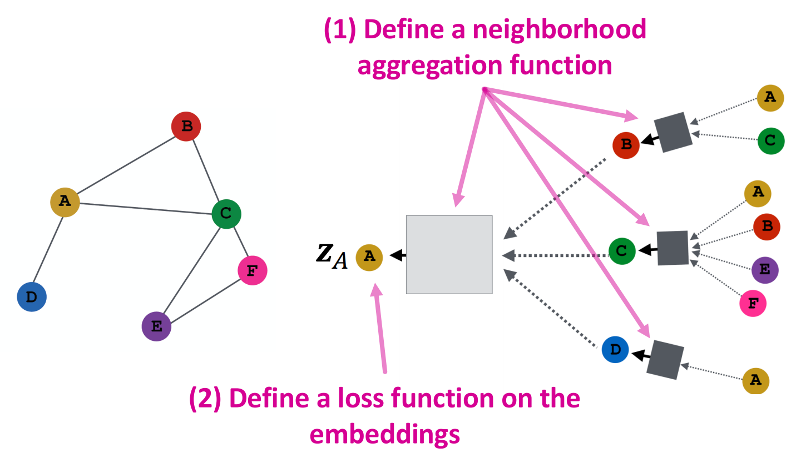

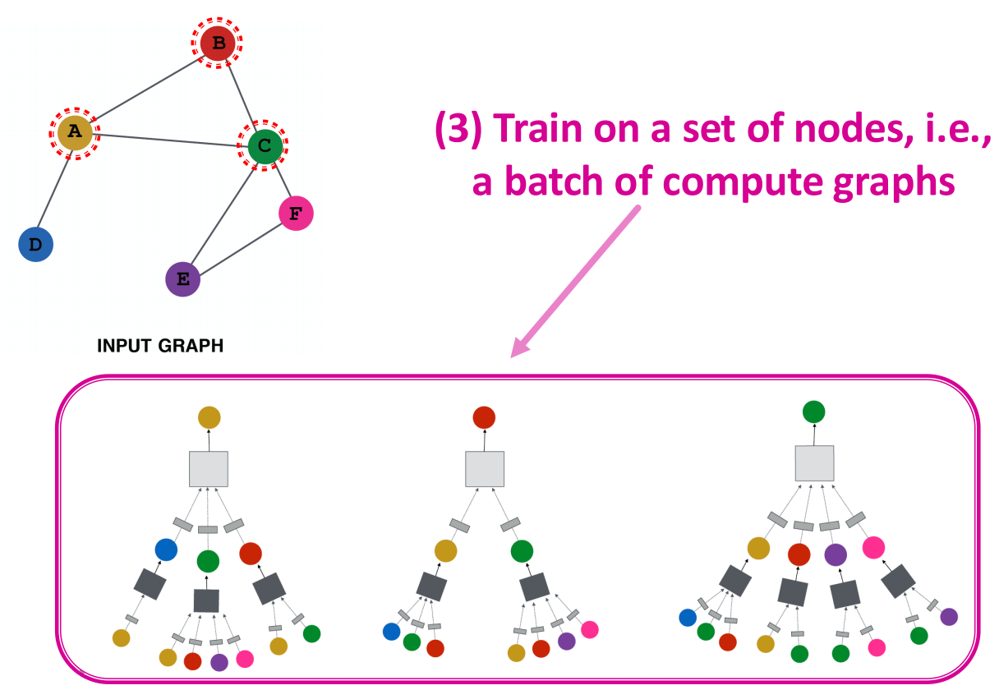

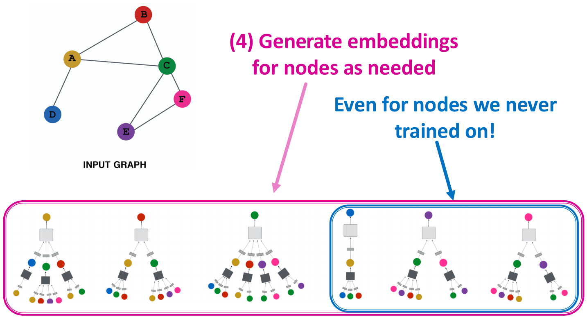

上面的第4步指出，整个图具备inductive capability，也就是说，针对所有node，聚合参数是共享的.

model parameters是$O(|V|)$的，所以我们能将embedding泛化到没有训练过的nodes上面

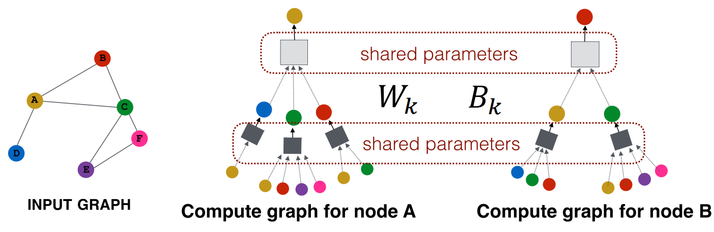

进一步地，我们甚至还能泛化到全新的图上，如train on protein interaction graph from model organism A and generate embeddings on newly collected data about organism B.

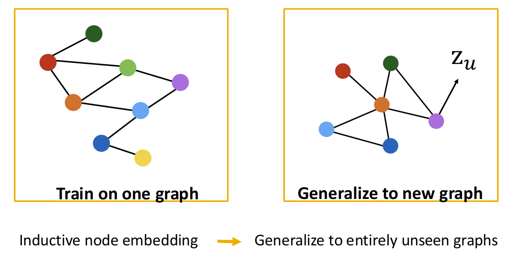

还可以在原图的基础上添加一个新的节点并预测性质：

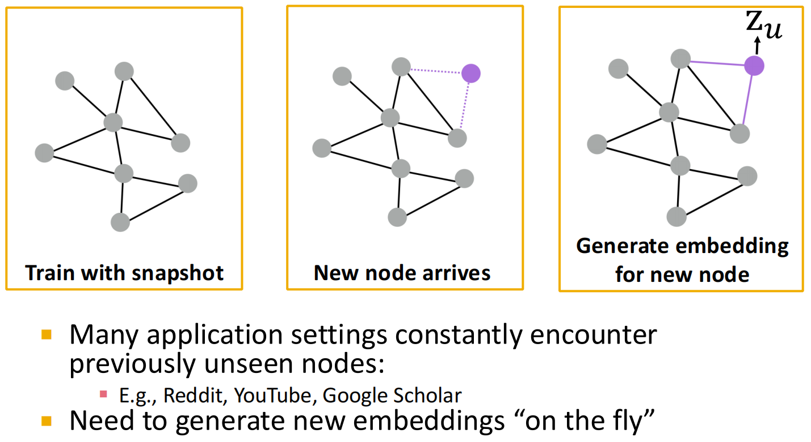

## GNNs subsume CNNs

那么，图神经网络（GNN）与卷积神经网络（CNN）等主流架构相比有什么优势呢？

### v.s. CNNs

我们以$3\times 3$ filter 的卷积神经网络为例，其embedding训练的迭代公式：

$$h_v^{(l+1)} = \sigma(\sum\limits_{u \in N(v) \cup \{v\}}W_l^uh_u^{(l)}), \quad \forall l \in \{0, \cdots,L-1\}$$

其中$L$是总共要训的层数.

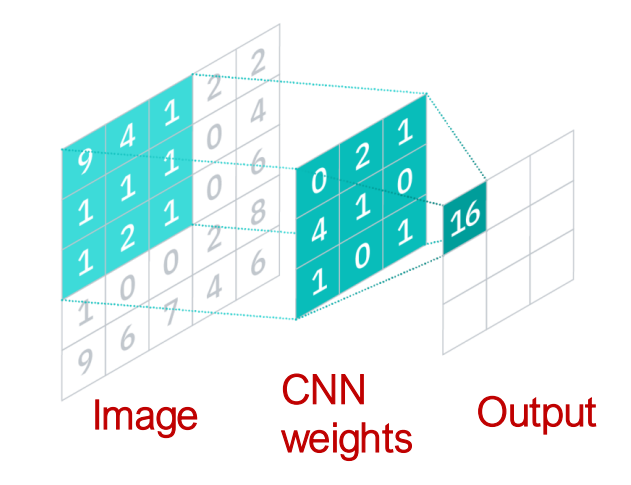

这样，$N(v)$实际上是$v$附近的8个节点.

而GNN的优势在于通用性，能够处理任意的图结构，即邻居数量是不固定的，也就是说，CNN可以被视作特殊的GNN.

同时，CNN不满足permutation invariant和equivariant，改变节点顺序会让输出结果彻底改变.

### Transformer

transformer几乎是最为有名和应用最广的架构了，其核心组件是self-attention机制，概括为：**Every token/word attends to all the other tokens/words via matrix calculation.**

概括地讲，attention机制的定义是：Given a set of vector **values** ,and a vector **query**, **attention** is a technique to compute a weighted sum of the values, dependent on the query.

每一个token/word都有value vector和query vector，其中value vector用于表示这个token/word，而query vector用于计算出attention score（在权重和中的权重）.

**Transformer 层可以被视作特殊的GNN，基于一个"fully-connected word graph".**

## A General GNN Framework

在前面的基础上，着手搭建一个GNN Framework.

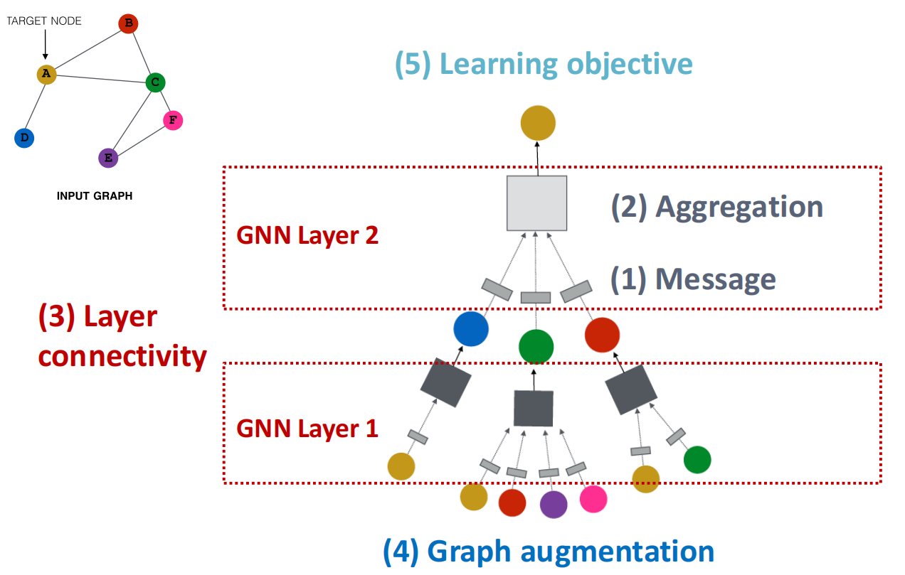

GNN的基本处理单位是GNN layer，逻辑上讲，每一层都通过以下2个步骤来更新节点表示：

* $\textcolor{red}{(1)}$ Message: 每个邻居节点会生成一份“消息”并发送给目标节点这通常涉及对邻居节点特征的变换
* $\textcolor{red}{(2)}$ Aggregation: 目标节点收集所有来自邻居的消息，并通过函数将它们融合成一个单一的向量

GNN的变体（GCN, GraphSAGE, GAT）本质上是在这一个层级上采用了不同的 Message & Aggregation方案.

单层GNN只能捕获每个节点邻居的信息，如果想要获得更远的上下文就需要 $\textcolor{red}{(3)}$ 连接多个层级：

* Stack layers sequentially: 按顺序排列GNN层
* Skip Connections: 为了防止网络中的梯度消失或者信息丢失，可以引入跨层的直接连接.

输入的graph需要经过 $\textcolor{red}{(4)}$ Graph Augmentation 处理得到computational graph，有2种增强方法：

* Graph Feature Augmentation
* Graph Structure Augmentation

最后我们到达 $\textcolor{red}{(5)}$ Learning Objective (学习)的步骤. 我们将会从以下两个角度考虑训练：

* **Supervised/Unsupervised objectives**
* **Node/Edge/Graph level objectives**

这将会在后续提及.

## A GNN Layer

GNN layer的核心idea是，将一个vector集合压缩成单个vector. 步骤包括Message和Aggregation.

1. Message: 每个节点给自己创建消息，并发送给其他节点，消息函数公式表示为$m_u^{(l)} = MSG^{(l)}(h_u^{(l-1)})$，比较常见的有$m_u^{(l)} = W^{(l)}h_u^{(l-1)}$，即使用线性层进行计算，将节点特征与权重矩阵$W^{(l)}$相乘.
2. Aggregation: 将来自邻居的消息合并到目标节点中，通用公式表示为$h_v^{(l)} = AGG^{(l)}(\{m_u^{(l)}, u \in N(v)\})$，常见的有Sum, Mean, Max.

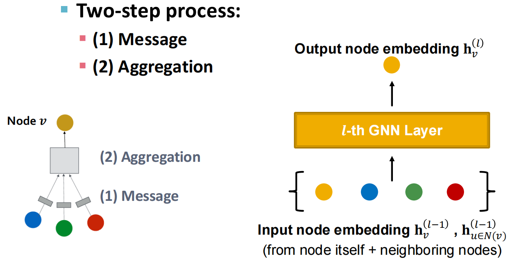

但是这样会存在问题：仅仅聚合邻居的消息可能会导致节点$v$自身的消息丢失，因为$h_v^{(l)}$的计算不直接依赖于上一层的$h_v^{(l-1)}$.

于是我们着手处理Self-Information. 解决的方法是，在计算$h_v^{(l)}$时显式包含节点自身的信息$h_v^{(l-1)}$.

修正的函数表示为：

$$h_v^{(l)} = CONCAT(AGG(\{m_u^{(l)}, u \in N(v)\}), m_v^{(l)})$$

将这二者合并，于是可以得到：

$$\begin{aligned} m_u^{(l)} = MSG^{(l)}(h_u^{(l-1)}), u \in \{N(v) \cup v\} \\  h_v^{(l)} = AGG^{(l)}(\{m_u^{(l)}, u \in N(v)\}, m_v^{(l)}) \end{aligned}$$

同时，我们还可以引入非线性激活函数来增强模型表达能力，常见的有：

* ReLU: $\text{ReLU}(x_i) = \max(x_i,0)$
* Sigmoid: $\text{Sigmoid}(x_i) = \dfrac1{1+e^{-x_i}}$，**这仅仅在需要限制embedding范围时使用**
* Parametric ReLU: $\text{PReLU}(x_i) = \max(x_i,0) + a_i \min(x_i, 0)$，其中$a_i$是可训练的参数. 经验上看，效果比ReLU好.

> 下面介绍一些Classical GNN Layers.

### GCN

回忆GCN的表达式：

$$h_v^{(l)} = \sigma(\sum\limits_{u \in N(v)} W^{(l)} \dfrac{h_u^{(l-1)}}{|N(v)|})$$

我们可以用Message + Aggregation的视角看待：

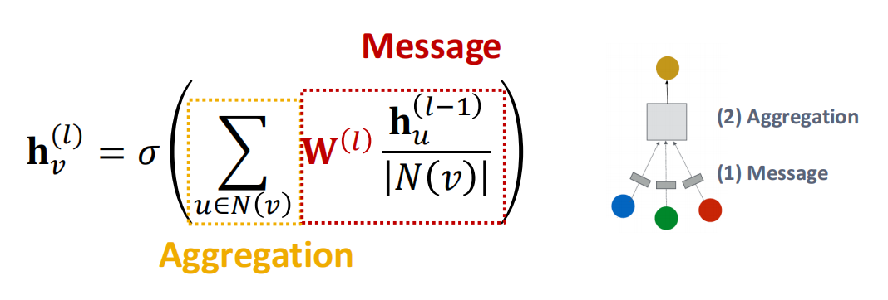

也就是说，Message 是对每个节点$v$，$m_u^{(l)} = \dfrac1{|N(v)|} W^{(l)}h_u^{(l-1)}$，Aggregation是对每个从邻居传来的消息做Sum，再使用激活函数.

### GraphSAGE

公式：

$$h_v^{(l)} = \sigma\big(W^{(l)} \cdot \text{CONCAT}(h_v^{(l-1)}, \text{AGG}(\{h_u^{(l-1)}, \forall u \in N(v)\}))\big)$$

这种layer使用了2-stage aggregation：

* Stage 1: Aggregate from node neighbor:

    $$h_{N(v)}^{(l)} \leftarrow AGG(\{h_u^{(l-1)}, \forall u \in N(v)\})$$

* Stage 2: Further aggregate over the node itself:

    $$h_{v}^{(l)} \leftarrow \sigma\Big(W^{(l)}\cdot CONCAT(h_v^{(l-1)}, h_{N(v)}^{(l)})\Big)$$

    Message阶段已经包括在了$AGG(\cdot)$这个函数.

GraphSAGE Neighbor Aggregation主要有三种策略：

* Mean Aggregator (均值聚合)：

    公式为$AGG = \dfrac1{|N(v)|} \sum\limits_{u \in N(v)}h_u^{(l-1)}$

    这样是较为简单和高效的，但是没有考虑节点顺序和特定邻居的权重.

* Pooling Aggregator (池化聚合)：

    公式为$AGG = Mean(\{MLP(h_u^{(l-1)}), \forall u \in N(v)\})$

    先对每个邻居节点的向量通过一个小的神经网络（MLP）变换，再对变换后的向量取平均或最大值. 

    这可以学习邻居特征的非线性组合，提供更强的表达能力.

* LSTM Aggregator (LSTM，即Long Short-Term Memory聚合)：

    公式为$AGG = LSTM([h_u^{(l-1)}, \forall u \in \pi(N(v))])$

    将邻居节点向量按某种顺序排列（该变换记为$\pi$），并使用LSTM处理序列信息.

    这可以学习到邻居节点的顺序信息，当然比前两种机制更加复杂

GraphSAGE L2 Normalization 是对所有节点的embedding做长度归一化，让所有向量的L2范数变成1.

公式：

$$h_v^{(l)} \leftarrow \dfrac{h_v^{(l)}}{\|h_v^{(l)}\|_2}, \forall v \in V$$

其中$\|u\|_2 = \sqrt{\sum\limits_i u_i^2}$就是向量的范数.

归一化主要是为了统一尺度，保持方向信息.

### GAT

GAT全称是Graph Attention Networks，其公式是：

$$h_v ^{(l)} = \sigma(\sum\limits_{u \in N(v)}\alpha_{vu}W^{(l)}h_u^{(l-1)}) = \sigma(\sum\limits_{u \in N(v)}\alpha_{vu}m_u^{(l)})$$

其中$\alpha_{vu} = \dfrac1{|N(v)|}$是节点$u$向$v$信息传递的weighting factor，因此可以直接从图的结构来显式定义出所有的$\alpha_{vu}$，同时将所有的$u \in N(v)$赋了相同的权重.

并不是所有的邻居都具备相同的importance，$\alpha_{vu}$需要关注input data的重要部分并清除掉剩余的部分. 至于哪部分是重要的，需要结合context，从训练中习得.

我们如何才能比简单的neighborhood aggregation做得更好？如何习得weighting factor $\alpha_{vu}$ ？我们的目标于是转变成，为每个结点的邻居都设置不同的任意重要性.

>  Idea: 用以下的attention strategy，为每个节点计算出embedding $h_v^{(l)}$ ：
>
> * Nodes attend over their neighborhoods’ message （节点负责管理其所在邻域的消息传递）
> * Implicitly specifying different weights to different nodes in a neighborhood （隐式给邻域内的节点分配不同权重）

为了衡量邻居节点$u$对目标节点$v$的重要性，我们首先计算一个原始得分$e_{vu}$：

$$e_{vu} = a\Big( W^{(l)}h_u^{(l-1)}, W^{(l)}h_v^{(l-1)}\Big) = a\Big( m_u^{(l)}, m_v^{(l)}\Big)$$

$e_{vu}$表示了$u$的message对$v$节点的重要性. 比如这张图里$e_{AB} = a\Big( W^{(l)}h_A^{(l-1)}, W^{(l)}h_B^{(l-1)}\Big) = a\Big(m_A^{(l)}, m_B^{(l)}\Big)$.

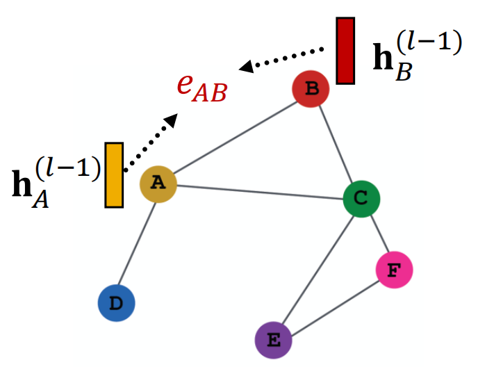

然后我们对其进行一步处理，使用Softmax函数将$e_{vu}$转成最终attention weight $\alpha_{vu}$，即：

$$\alpha_{vu} = \dfrac{exp(e_{vu})}{\sum\limits_{k \in N(v)}exp(e_{vk})}$$

最后，根据学习到的权重对邻居进行加权求和，通过一个激活函数$\sigma$处理：

$$h_v^{(l)} = \sigma\Big( \sum\limits_{u \in N(v)}\alpha_{vu} W^{(l)}h_u^{(l-1)}\Big)$$

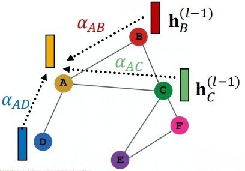

比如上图中的$h_A^{(l)}$可以这样得到：

$$h_A^{(l)} = \sigma(\textcolor{red}{\alpha_{AB}W^{(l)}h_B^{(l-1)}} + \textcolor{green}{\alpha_{AC}W^{(l)}h_C^{(l-1)}} + \textcolor{blue}{\alpha_{AD}W^{(l)}h_D^{(l-1)}})$$

现在我们思考attention mechanism $a$的形式是什么. 实际上这种方法**对$a$的选择不做限定**，比如可以使用一层简单的 single-layer neural network.

$a$具有可训练的参数（即Linear Layer中的weights）. $a$中的参数被联合地训练：以端到端的方式，同时学习参数及其权重矩阵（即神经网络的其他参数$W^{(l)}$）.

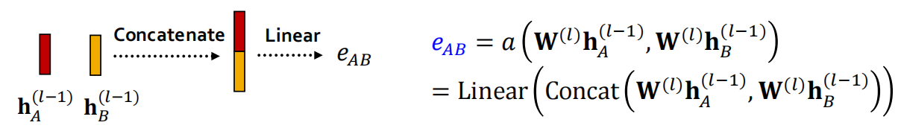

为了使学习过程更稳定，GAT 借鉴了 Transformer 中的**Multi-head attention (多头机制)**：

- **并行计算**：独立训练 $K$ 个不同的注意力机制（即 $K$ 组不同的 $\mathbf{W}$ 和 $a$）:

    $$\begin{aligned} h_v^{(l)}[1] = \sigma(\sum\limits_{u \in N(v)} \alpha_{vu}^1W^{(l)}h_u^{(l-1)}) \\ h_v^{(l)}[2] = \sigma(\sum\limits_{u \in N(v)} \alpha_{vu}^2W^{(l)}h_u^{(l-1)}) \\ h_v^{(l)}[3] = \sigma(\sum\limits_{u \in N(v)} \alpha_{vu}^3W^{(l)}h_u^{(l-1)}) \\ \cdots \\ h_v^{(l)}[K] = \sigma(\sum\limits_{u \in N(v)} \alpha_{vu}^KW^{(l)}h_u^{(l-1)})\end{aligned}$$

- **聚合输出**：将 $K$ 个head得到的结果进行拼接（Concatenation）或平均（Summation）：

    $$h_v^{(l)} = AGG(h_v^{(l)}[1], h_v^{(l)}[2], \cdots, h_v^{(l)}[K])$$

GAT的主要优点：

* Key Benefit: 允许为同一个邻域内的不同节点分配完全不同的权重$\alpha_{vu}$
* Computatioally Efficient: 注意力系数的计算可以在图中所有的边上**并行化**
* Storage Efficient: 只需要存储节点和边，计算复杂度与图的规模呈线性关系 $O(V+E)$; 固定了参数的数量，与graph的大小无关.
* Localized: 只关注局部邻域，不需要知道全局图结构
* Inductive Capability (归纳推理能力): 是一个共享的edge-wise mechanism，所以不依赖于graph的全局特征.

## GNN Layers in Practice

实践中，上述的GNN layer是极佳的起点，有时候添加一个general GNN layer就能获得更好的性能. 我们可以将现代的DL modules纳入layer中：

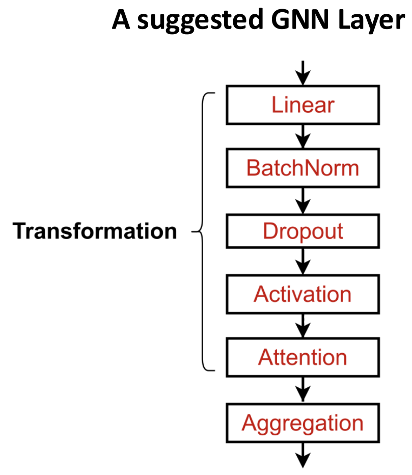

在上图中我们纳入的DL modules包括：

* Batch Normalization: 这可以使NN的训练变得stable.
* Dropout: 可以防止overfitting (过拟合).
* Attention/Gating: 可以控制一条信息的importance

### Batch Normalization

Goal：Stabilize neural networks training

Idea: 给定一批inputs（node embeddings, $X \in \mathbb{R}^{N \times D}$，共$N$个node embedding），将这些embedding处理成**均值为0、方差为单位方差1**的情形.

我们设Trainable parameters为$\gamma, \beta \in \mathbb R^D$，输出是正则化结果$Y \in \mathbb R ^{N \times D}$，处理步骤如下：

* 计算出均值与方差

    $$\mu _j = \dfrac1N \sum\limits_{i = 1}^N X_{i,j}, \quad \sigma^2_j = \dfrac1N\sum\limits_{i=1}^N (X_{i,j}-\mu_j)^2$$

* 正则化处理：

    $$\widehat X_{i,j} = \dfrac{X_{i,j} - \mu_j}{\sqrt{\sigma^2_j + \epsilon}}, \quad Y_{i,j} = \gamma_j \widehat{X}_{i,j} + \beta_{j}$$

这其中的原理已经在概统课程中详细学习过了，是很显然的.

### Dropout

Goal: 正规化NN，防止overfitting.

Idea: 在training过程中，以$p$的概率随机将一些neuron设置成0；在testing过程中，使用所有的neuron来计算结果.

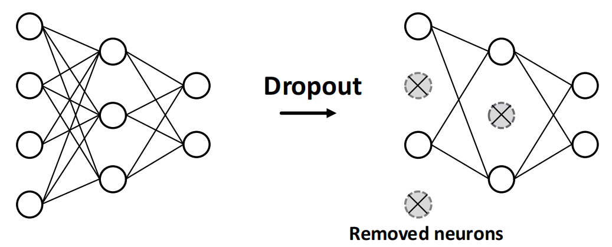

在GNN中，Dropout应用在线性层的message function里面.

>  eg. $m_u^{(l)} = W^{(l)}h_u^{(l-1)}$
>
> 
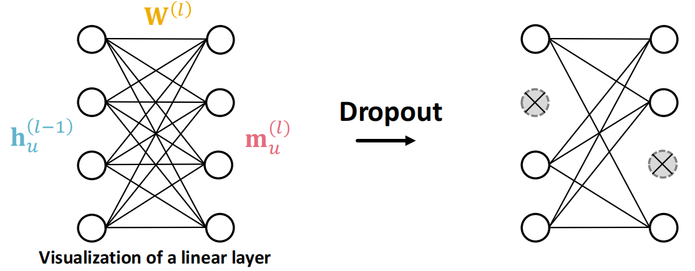

>
> 推荐材料：[GraphGym](https://github.com/snap-stanford/GraphGym)，可以designing and evaluating GNN.

## Stacking Layers of a GNN

这一节解决的是将GNN layer连接成一整个GNN的方法，也就是[Part 5](#a-general-gnn-framework)中提到的$\textcolor{red}{(3) \text{ Connectivity}}$问题.

标准的连接步骤：

* Stack layers sequentially
* Ways of adding skip connections

我们设初始的node feature是$X_v$，经过 $L$ 个 GNN layers 后输出 $h_v^{(L)}$ ：

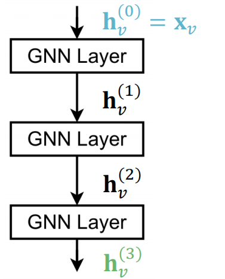

如果放入了太多的layer，会导向**over-smoothing problem**：所有的node embeddings都会收敛于同一个值. 

我们引入Receptive field (感知域) 的概念来解释这个问题：

感知域是指决定某个节点最终特征表示（Embedding）的**邻居节点集合**，那么$K$-layer GNN 等于 K-hop neighborhood，层数越大，范围就越大，直到几乎铺满整张图 $\Longrightarrow$ 这就导致了节点的感知域很接近，造成embedding异常接近 (如下图).

在GNN中，我们引入 node embedding 本就是希望对节点尽量做差异化的处理，因此这会非常糟糕！

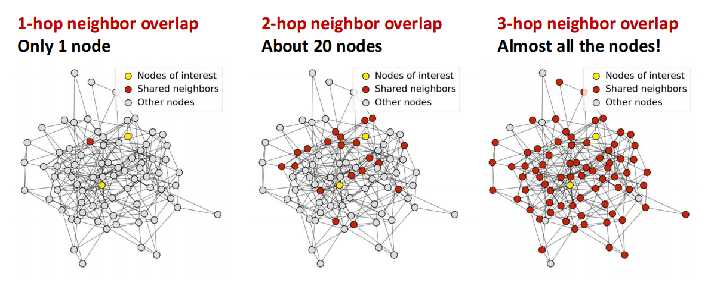

我们从中吸取的教训1是，**不能过度添加GNN layers，一定要分析必要的receptive field **！

那么，如果GNN layer选取的$L$很小时，该怎么提升它的表达力？

* 方法1：在单个 GNN layer 内提升expressive power ，我们可以用DNN来替代 aggregation / transformation.

* 方法2：添加不传递信息的layer，比如可以添加 MLP layers 作为 pre-processing layers (E.g., when nodes represent images/text) 和 post-processing layers (E.g., graph classification, knowledge graphs)

    
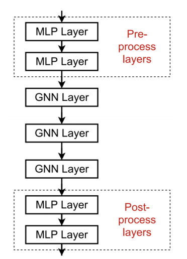

教训2是，在问题中仍然需要多层GNN layer的情况下，添加 skip connection .

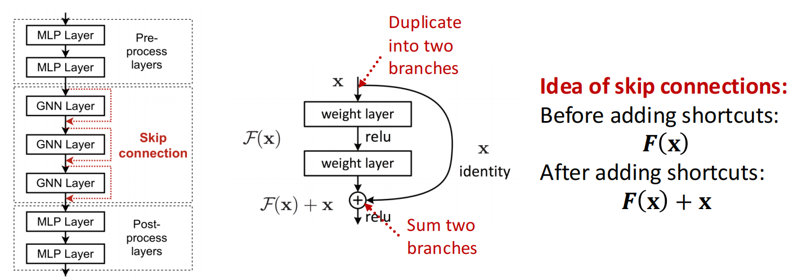

我们可以通过**在GNN中添加shortcuts**，增加前期的 layer 在最终 node embedding 上的影响权重.

$$F(x) \leftarrow F(x) + x$$

从直觉上讲，[skip connection](https://arxiv.org/abs/1605.06431) **自动实现了deep GNN 和 shallow GNN 的混搭**，$N$个skip connection导致会出现 $2^N$条可能的path，每条路径上的node是$1\sim N$个节点不等.

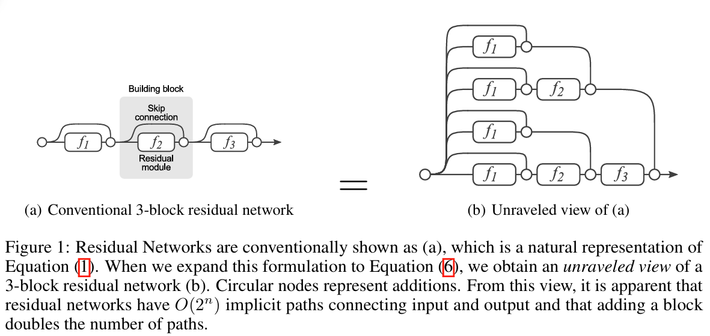

前文所提到的 standard GCN layer 的公式是：

$$h_v^{(l)} = \sigma\Big( \textcolor{red}{\sum\limits_{u \in N(v)} W^{(l)} \dfrac{h_u^{(l-1)}}{|N(v)|}}\Big)$$

$\textcolor{red}{红色}$部分就是我们的$\textcolor{red}{F(x)}$.

而GCN layer with skip connection则是：

$$h_v^{(l)} = \sigma\Big( \textcolor{red}{\sum\limits_{u \in N(v)} W^{(l)} \dfrac{h_u^{(l-1)}}{|N(v)|}} + \textcolor{blue}{h_v^{(l-1)}}\Big)$$

$\textcolor{blue}{蓝色}$部分是我们添加进去的$\textcolor{blue}{x}$.

---

当然，也有其他的方案，比如直接跳到最后一个layer上，最后一个layer直接聚合前面所有layer的node embedding信息.

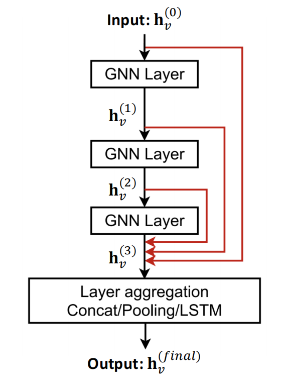

> 至此我们来到了激动人心的GNN: III部分.
>
> Course Project的目标是： create long-lasting resources for your technical profiles + broader graph ML community
>
> 一共支持3种project类型：
>
> * Real-world applications of GNNs
> * Tutorial on PyG functionality
> *  Implementation of cutting-edge research

## GNN Training

这部分主要讲解GNN Augmentation and Training, Graph Manipulation in GNN.

我们先前虽然指出了raw input graph $\neq$ computational graph，但是操作过程中仍然是当作等价来操作的. 打破等价假设的原因是，input graph和optimal computational graph恰好匹配的情形是较少的，更多的时候是很多特殊的情况：

* Feature Level：input graph有时缺少特征，所以需要做feature augmentation
* Structure Level：分以下几种特殊情况讨论
    * too sparse，会导致 inefficient message passing
    * too dense，消息传递的成本太高
    * too large，那么很难将computational graph适配到GPU上

### Graph Manipulation Approaches

Graph Feature Manipulation 针对input graph有时缺少特征，所以需要做feature augmentation的情形.

Graph Structure Manipulation 针对上述的三种情形，分别解决：

* too sparse，会导致 inefficient message passing
* too dense，消息传递的成本太高
* too large，那么很难将computational graph适配到GPU上

#### Feature Augmentation on Graphs

引入这个的原因1是，input graph 不具备 node features，这主要是因为我们一般只有邻接矩阵的信息. 

 标准的方法：

* Assign constant values to nodes

    
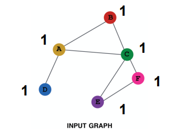

* Assign unique IDs to nodes，将 IDs 转成one-hot编码：

    
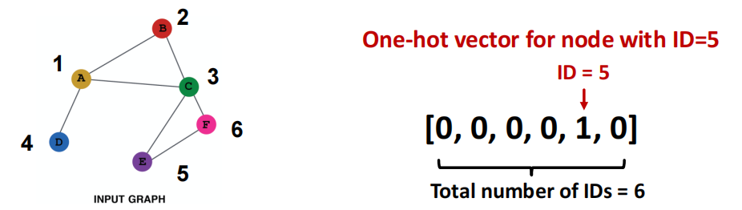

对比：

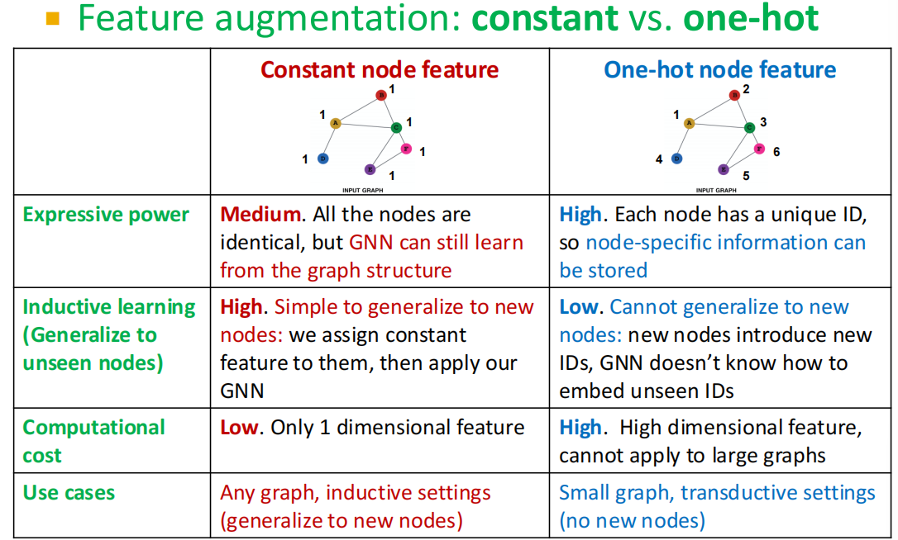

原因2是，有一些结构很难通过GNN学习.

eg. Cycle count feature, GNN不能学习到$v_1$所在的cycle的长度. 这主要是因为$v_1$不能区分它处于什么图中，每个结点的度数都是2，下面的2种图的computational graph都是相同的binary tree.

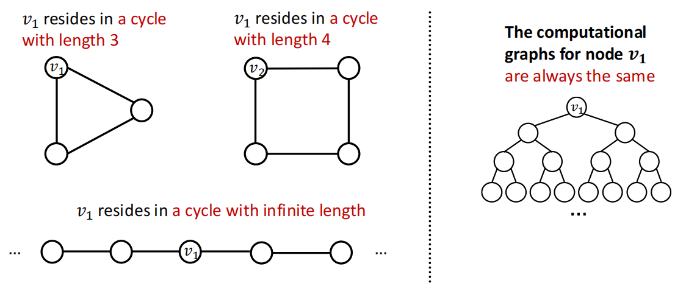
 

解决方法：使用cycle count作为augmented node features.

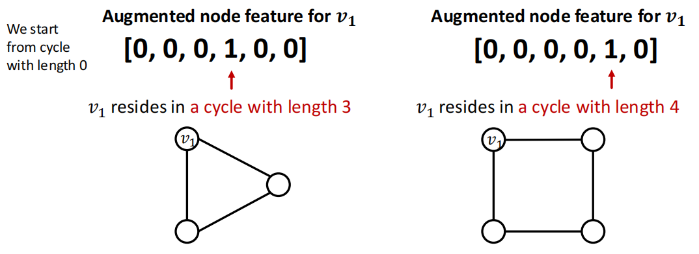
 

#### Structure Manipulation

Motivation: 我们希望augment sparse graphs

* Add virtual nodes

    virtual node 将连接图中的所有节点，使得图中所有所有节点的distance变成2. 这样极大地提升了稀疏图中的message passing.

    
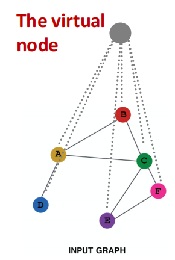
 

* Node Neighborhood Sampling

    前面的方法都是，所有的neighbors都被用于消息传递，但是这样就会遇到问题：当graph是dense/large时，nodes具备较大的degree.

    
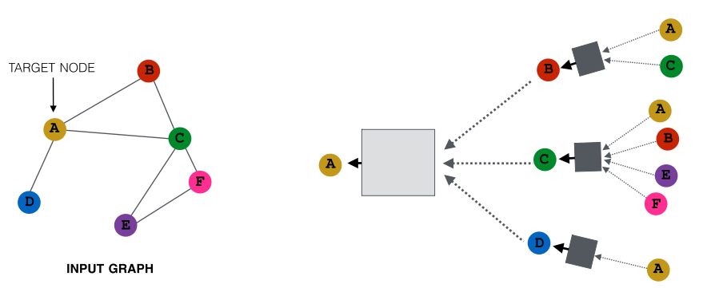

    于是我们尝试的新idea是，**通过随机抽取一个节点的neighborhood来传递消息.** 比如，在下图中，只把B和D定成neighbors:

    
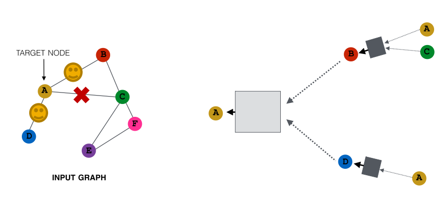

    下一次取样的时候，可以选择不同的neighbors：

    
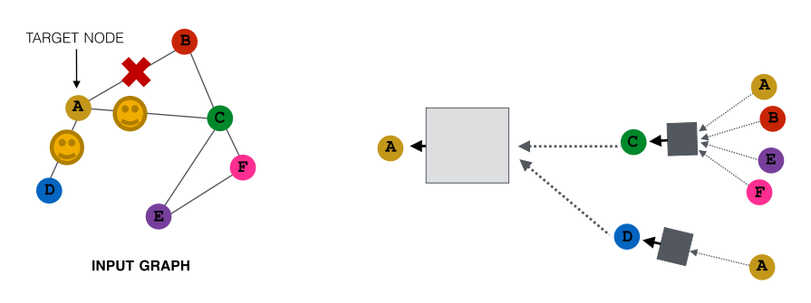

    我们期待这样处理下的 embedding 与将 所有节点 都视作neighbors的处理的embedding接近，以获得极大降低computational cost的优势，而实践中这确实也具有很好的效果.

### Predictions with GNNs

在[先前](#a-general-gnn-framework)的$\textcolor{red}{(5)}$ Learning Objective步骤之后，我们需要考虑的是如何训练一个GNN.

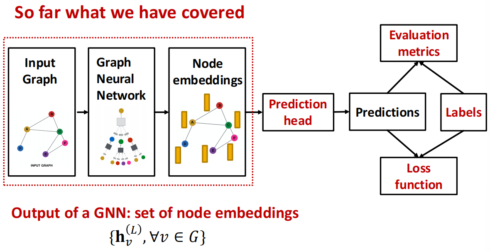

Different prediction heads:

* Node-level tasks
* Edge-level tasks
* Graph-level tasks

每个task level需要不同的prediction heads：

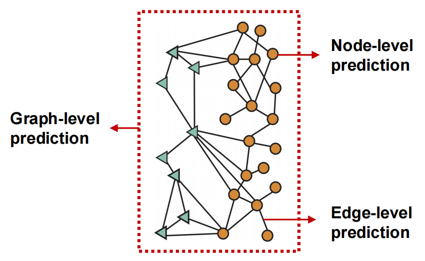

#### Node-Level Prediction

我们可以直接用node embedding来做出 Node-Level Prediction. 

在 GNN 处理之后，我们有$d$维embedding $\{h_v^{(l)} \in \mathbb{R}^d, \forall v \in G\}$. 假设我们需要进行k-way prediction（如在$k$类中做出分类，或者在$k$个targets中做regression） ，只要令：

$$\widehat y_v = \text{Head}_{node}(h_v^{(l)}) = W^{(l)}h_v^{(L)}$$

其中$W^{(H)} \in \mathbb{R}^{k\times d}$是将$h_v^{L} \in \mathbb R^d$映射到$\widehat y_v\in \mathbb R^k$的矩阵，这样我们能计算出最终的loss.

#### Edge-Level Prediction

使用成对的node embeddings来做出相关的预测.

假设我们希望做出$k$-way prediction，即：

$$\widehat y_{uv} = \text{Head}_{edge}(h_u^{(L)}, h_v^{(L)})$$

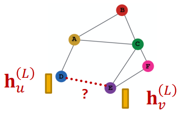

这里$\text{Head}_{edge}$的选取一般有几种方法：

* Concatenation + Linear：我们已经在graph attention中看过这个操作了，通过直接拼接＋线性处理得到最终的$\widehat y_{uv}$

    $$\widehat y_{uv} = \text{Linear}(\text{Concat}(h_u^{(L)}, h_v^{(L)}))$$

    这里的$\text{Linear}(\cdot)$是将拼接得到的$2d$维向量映射到了$k-\dim$ embedding，使得k-way prediction成立

* Dot Product: 这个操作仅限于1-way prediction (比如存在性的预测)，公式是：

    $$\widehat y_{uv} = (h_u^{(L)})^T h_v^{(L)}$$

    如果想要应用到k-way prediction，那么，跟multi-head attention类似，我们可以假定$W^{(1)}, \cdots,W^{(k)}$是可训练的，有：

    $$\widehat y_{uv}^{(1)} = (h_u^{(L)})^T W^{(1)}h_v^{(L)} \\ \widehat y_{uv}^{(2)} = (h_u^{(L)})^T W^{(2)}h_v^{(L)} \\ \cdots \\\widehat y_{uv}^{(k)} = (h_u^{(L)})^T W^{(k)}h_v^{(L)}$$

    最终得到$\widehat y_{uv} = \text{Concat}(\widehat y^{(1)}_{uv}, \cdots, \widehat y^{(k)}_{uv}) \in \mathbb R^k$

#### Graph-Level Prediction

使用所有的node embedding来做出prediction.

假设我们希望做出k-way prediction，只需要:

$$\widehat y_G = \text{Head}_{graph} (\{h_v^{(l)} \in \mathbb R^d, \forall v \in G\})$$

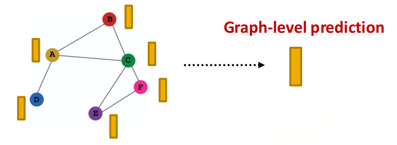

实际上，$\text{Head}_{graph} ( \cdot )$与一个GNN layer中的$\text{AGG}(\cdot)$近似.

$\text{Head}_{\text{graph}}(\{\mathbf{h}_v^{(L)} \in \mathbb{R}^d, \forall v \in G\})$的选择有以下几种：

* Global mean pooling：

    $$\widehat{\mathbf{y}}_G = \text{Mean}(\{\mathbf{h}_v^{(L)} \in \mathbb{R}^d, \forall v \in G\})$$

* Global max pooling：

    $$\widehat{\mathbf{y}}_G = \text{Max}(\{\mathbf{h}_v^{(L)} \in \mathbb{R}^d, \forall v \in G\})$$

* Global sum pooling：

    $$\widehat{\mathbf{y}}_G = \text{Sum}(\{\mathbf{h}_v^{(L)} \in \mathbb{R}^d, \forall v \in G\})$$

这些操作对小图来讲是很有效的，但是我们希望这也对大图有效. 

>  对大图失效的原因解释:
>
> Global pooling 会丢失信息，假设我们现在用 **1维** 的向量来表示Node embeddings，图 $G_1$ 的节点特征集合：$\{-1, -2, 0, 1, 2\}$，图 $G_2$ 的节点特征集合：$\{-10, -20, 0, 10, 20\}$. 很明显，这两张图的节点数值差异巨大，这意味着它们的**拓扑结构或节点属性应该完全不同**，但用$\text{Sum} $处理完之后结果是一样的，都是0.

于是我们引入 Add Virtual Super Node 的方法， 将 virtual node 与图中所有 node 相连接，这样的好处是可以让 GNN 学习到将整个input graph进行encode的方法.

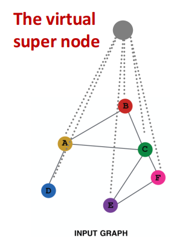

### Ground-truth

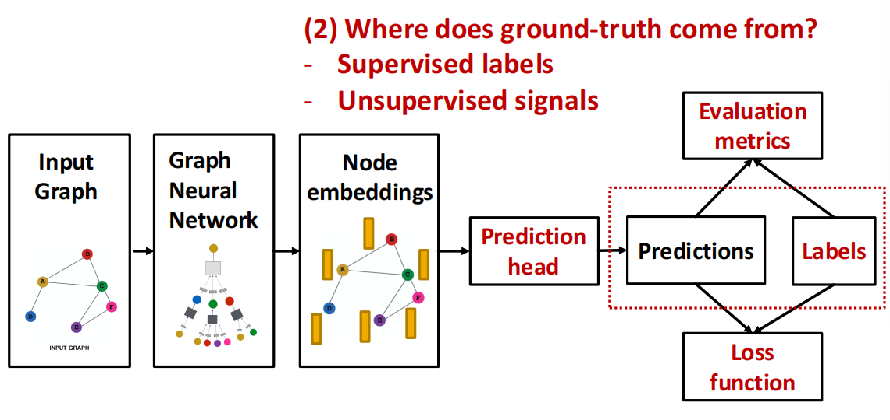

这里列出了2个来源，并着重做区分:

* supervised labels：Supervised labels来自外部数据源，用于补充图本身结构无法反馈的信息，比如Node Label $y_v$ ，Edge Label $y_{uv}$，Graph Label $y_G$. 而且最好将自己的task简化成以上三种signal；
* unsupervised signals：有时候我们只具有一个graph，没有任何外部标签，这样就只能分析图本身结构了. 于是我们使用self-supervised learning，根据三种level的信息：Node-level $y_v$，Edge-level $y_{uv}$和Graph-level $y_G$来训练自身.

### Compute Final Loss

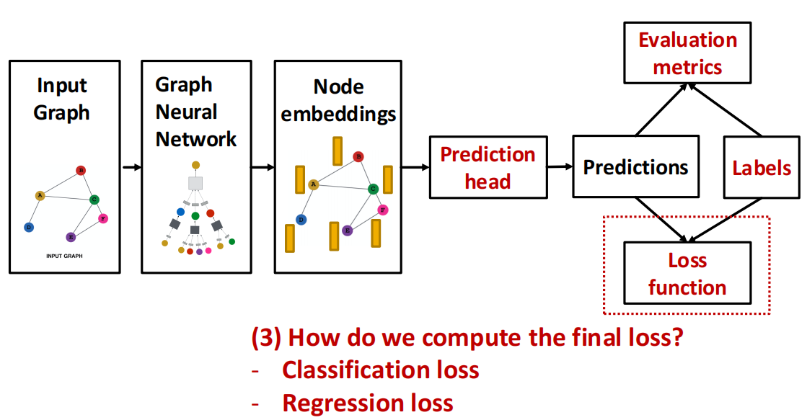

GNN Training的初始设置：我们有$N$个数据点，每个数据点可以是一个node/edge/graph，表示方法：

* Node-Level: prediction $\widehat y_v^{(i)}$，标签是$y_v^{(i)}$;
* Edge-Level: prediction $\widehat y_{uv}^{(i)}$，标签是$y_{uv}^{(i)}$;
* Graph-Level: prediction $\widehat y_G^{(i)}$标签是$y_G^{(i)}$.

我们使用prediction $\widehat y^{(i)}$, label $y^{(i)}$来指代所有level下的情况.

* Classification：label $y^{(i)}$ 具有离散的value，比如作node分类
* Regression：label $y^{(i)}$ 具有连续的value，比如预测分子图的药物相似性

GNN是可以被应用到上面的两种setting中的，区别是loss function和evaluation metrics.

#### Classification Loss

Cross Entropy (交叉熵) 在分类任务中经常被使用，比如在 k-way prediction中，对于第$i$个数据点，有：

$$\text{CE}(y^{(i)},\widehat y^{(i)}) = -\sum\limits_{j=1}^Ky_j^{(i)} \log (\widehat y_j^{(i)})$$

其中$y^{(i)} \in \mathbb R^K$是one-hot label encoding，$\widehat y^{(i)} \in \mathbb R^K$是基于Softmax处理之后的prediction.

将所有的N个样本的交叉熵加在一起，能得到最终的loss，是：

$$Loss = \sum\limits_{i=1}^N \text{CE}(y^{(i)}, \widehat y^{(i)})$$

#### Regression Loss

我们经常使用 Mean Squared Error (均方误差) ，即 L2 loss，来处理回归任务.

对于data point $i$，k-way regression的计算方法如下：

$$\text{MSE}(y^{(i)}. \widehat y^{(i)}) = \sum\limits_{j=1}^K(y_j^{(i)} - \widehat y^{(i)}_j)^2$$

其中$y^{(i)} \in \mathbb R^K$是Real valued vector of targets，$\widehat y^{(i)} \in \mathbb R^K$是Real valued vector of predictions.

将所有的N个样本的MSE加在一起，能得到最终的loss，是：

$$Loss = \sum\limits_{i=1}^N \text{MSE}(y^{(i)}, \widehat y^{(i)})$$

### Measure the success of a GNN

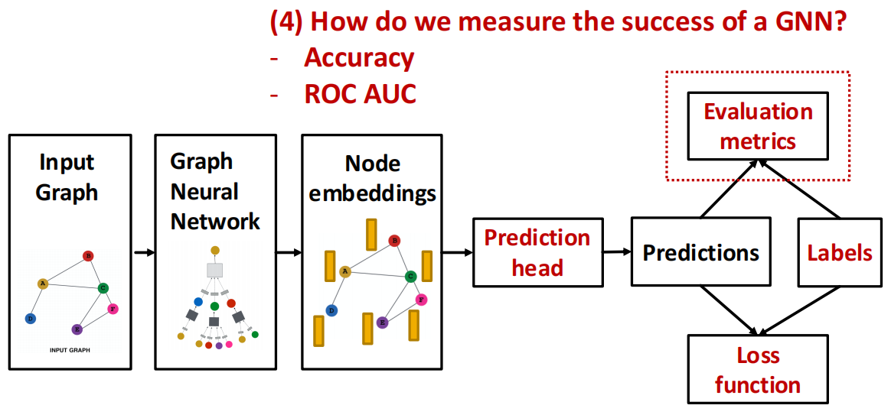

对于GNN我们也可以使用sklearn来做评估.

假设我们希望对$N$个data points作prediction，设置任务评价指标的方法有：

* Regression:

    * Root mean square error (RMSE, 均方根误差)：

        $$\sqrt{\sum\limits_{i=1}^N\dfrac{(y^{(i)} - \widehat y^{(i)})^2}{N}}$$

        中间有一个**平方**的操作，如果某个样本预测得极其不准（存在局部的巨大极端值），平方后这个错误就会被无限放大因此，**RMSE 对异常值（Outliers）非常敏感**.

    * Mean absolute error (MAE，平均绝对误差)：

        $$\dfrac{\sum\limits_{i=1}^N|y^{(i)} - \widehat y^{(i)}|}{N}$$

        它对所有样本的误差一视同仁，不会刻意放大极端误差相比 RMSE，**MAE 更加稳健（Robust），能更直观地反映平均误差水平**.

* Classification: 分类任务实际上主要分成2种场景

    * Multi-class Classification: 直接报告准确率，用$1[\cdot]$作为指示函数，如果括号内条件满足时为1，否则为0.

        $$\dfrac{1[\text{argmax}(\widehat y^{(i)}) = y^{(i)}]}{N}$$

    * Binary Classification: 主要考虑Acc, Precision, Recall, F1-Score等对分类阈值（一般设置成0.5）敏感的指标，以及对阈值不敏感的指标（如ROC AUC）.

        首先分清4种情况：TP表示True positive, TN表示True Negative, FP表示False Positive, FN表示False Negative.

        指标计算：

        $$\begin{aligned} accuracy = \dfrac{TP+TN}{TP+TN+FP+FN} = \dfrac{TP+TN}{|dataset|}\\ Precision = \dfrac{TP}{TP+FP} \\ Recall = \dfrac{TP}{TP+FN} \\ F1-Score = \dfrac{2P*R}{P+R}\end{aligned}$$

        基于上面的acc等4个指标我们可以做出confusion matrix：

        
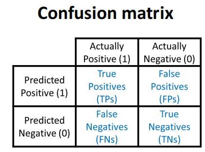

        而ROC AUC (Area Under the ROC Curve) 指的是ROC 曲线下方的**面积**，因为坐标轴最大是1，所以面积最大就是1. 

        选择这个指标主要是为了处理极端数据集，如极度不平衡（比如 99% 是正常用户，1% 是黑客），Accuracy 会失效（全猜正常就能拿 99% 准确率），但 **AUC 依然能准确反映模型到底有没有区分“好人”和“坏人”的能力**.

        
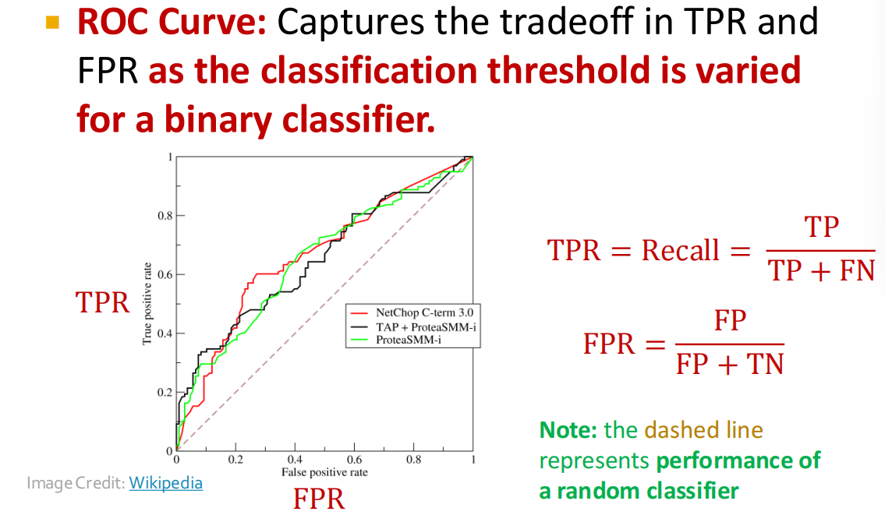

### Dataset Split

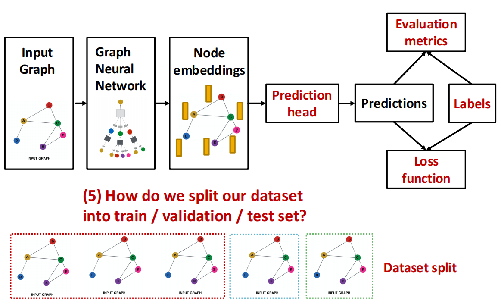

我们一次性将数据集split，分成：

* Training set: 训练集，优化GNN参数
* Validation set: 验证集，用于 develop model/hyperparameters
* Test set: 测试集，直到报告最终结果时才公开.

有时我们无法保证测试集确实会被held out，因此可以使用random split，通过设置不同的 random seeds来给出average performance.

但是Splitting Graphs跟传统的split有差距. 

如果是Image classification，那么三者之间互不交叉：

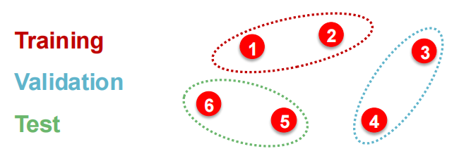

而在Graph dataset中，每个data point都是一个node，从而并不independent，比如node 5会影响对node 1的prediction.

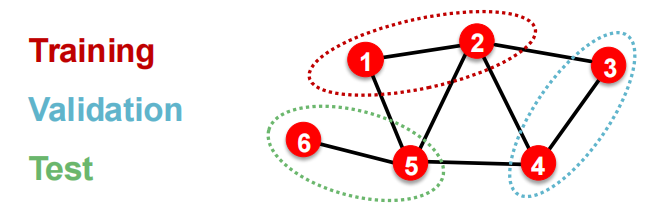

为此，我们有2种解决方法：

* Transductive Split （直导式划分）：全图只有一张（Single large graph）
    - 划分方式：训练集、验证集、测试集全都在这一张图里，我们不删节点和边，而是**给节点贴上不同的面具（Mask）**
        - **Train Mask**：训练时，模型能看到整张图的连通结构，但模型只能根据 Train 节点的标签来算 Loss 并更新参数
        - **Val / Test Mask**：测试时，模型依然在同一张图上跑，但我们只看 Val 或 Test 节点的预测准确率

* Inductive Split（归纳式划分）：数据由多张独立的图组成（Multiple graphs）

    - **划分方式**：跟传统机器学习很像，比如有 100 个分子图：
        - 拿 70 张图当训练集（Train Graphs）
        - 拿 15 张图当验证集（Val Graphs）
        - 拿 15 张图当测试集（Test Graphs）

    - **优势**：验证和测试时，模型面对的是**完全没见过的全新图结构**，非常考验模型的泛化能力

针对不同的预测目标（节点、边、全图），各自在训练（Train）和评估（Evaluation）阶段的固定套路也不同：

1. Node-level Task：

    - **训练阶段**：
        1. 将整张图 $G$ 和节点初始特征输入输入 GNN
        2. GNN 跑完 $L$ 层消息传递，输出所有节点的最终表征：$\mathbf{h}_v^{(L)}$
        3. 将这些表征丢进分类头 $\text{Head}_{\text{node}}(\mathbf{h}_v^{(L)})$，得到预测值 $\widehat{\mathbf{y}}_v$
        4. **关键点**：只计算带有 **Train Mask** 的节点的 Loss，然后反向传播

    - **评估阶段**：流程完全一样，但最后一步**只计算带有 Val Mask 或 Test Mask 的节点的评估指标**（如 Accuracy）

2. Edge-level Task：我们需要把边分为**正样本（Positive edges，真实存在的边）**和**负样本（Negative edges，人为随机挑选的、其实并不存在的虚空边）**

    **流程**：

    1. GNN 照常运行，算出每个节点的表征 $\mathbf{h}_v^{(L)}$
    2. 当我们要预测边 $(u, v)$ 是否存在时，调用 $\text{Head}_{\text{edge}}(\mathbf{h}_u^{(L)}, \mathbf{h}_v^{(L)})$（通常是把两点特征拼接或做内积）
    3. **训练与评估**：让模型去猜正样本边（应该打高分）和负样本边（应该打低分），计算交叉熵损失或 ROC AUC

    而面对Link prediction任务时，设置初始label是一件很tricky的事情，我们呢需要隐藏一些edge，让GNN来判断这条边是否存在.

    
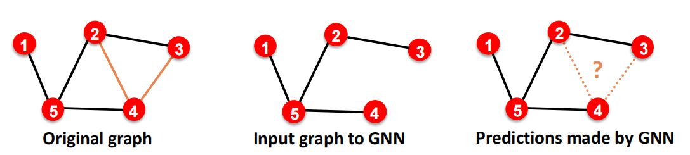

    为了实现Link prediction，我们需要将edge切分2次：

    * 在原图中进行2种边的赋值：Message edges 和 Supervision edges，然后“抹除掉”所有的supervision edge，不作为input使用，而是在训练edge prediction时作为supervision来使用.

        
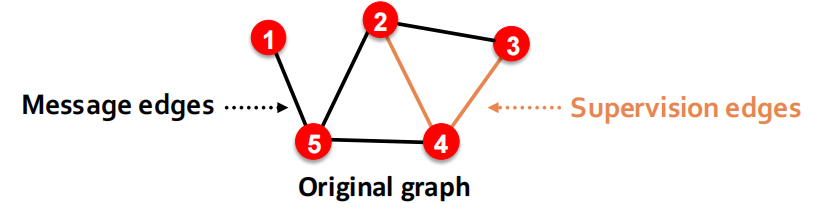

    * 再将edges切分成 train/validation/test三个集合. 同样地，我们有2种处理选择，Inductive link prediction split 和 Transductive link prediction split.

        
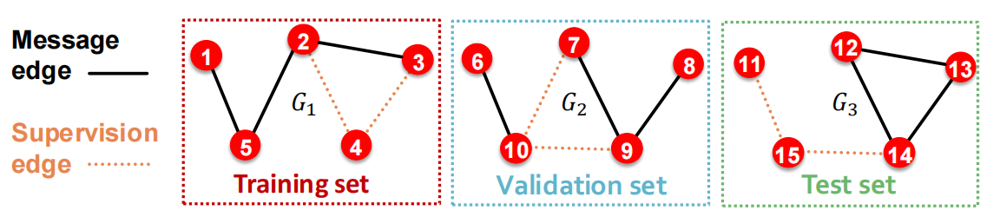

        
Inductive Link Prediction Split

        
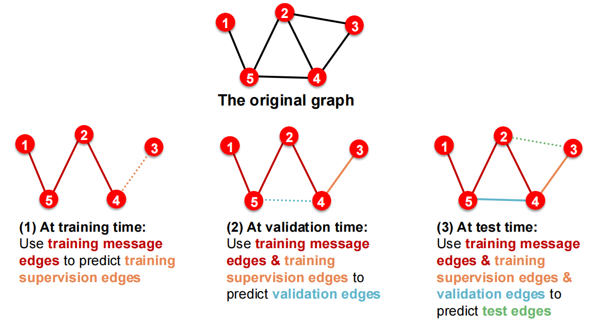

        
Transductive Link Prediction Split

        > **Why do we use growing number of edges?**
        >
        > After training, supervision edges are known to GNN. Therefore, an ideal model should use supervision edges in message passing at validation time. The same applies to the test time.

        这些设置在PyG和GraphGym中均有支持.

3. Graph-level Task：

    **流程**：

    1. GNN 算出图中每个节点的表征
    2. 通过 **池化（Pooling）** 或 **虚拟超级节点（Virtual Node）**，把所有节点的特征聚合成一个代表“整张图”的向量 $\mathbf{h}_G$
    3. 丢进 $\text{Head}_{\text{graph}}(\mathbf{h}_G)$ 预测图的类别或属性
    4. 按照划分好的 Train Graphs 算 Loss，用 Test Graphs 跑测试

总结：GNN Training Pipeline

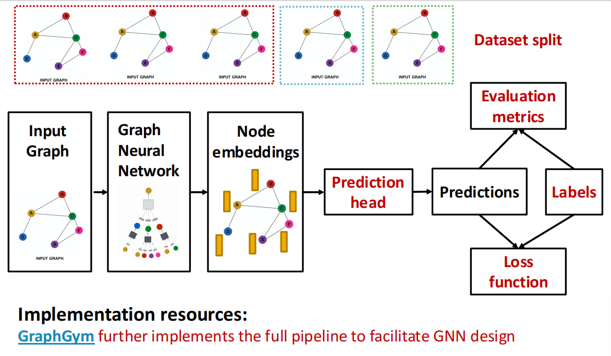

Resources: [GraphGym](https://github.com/snap-stanford/GraphGym)
