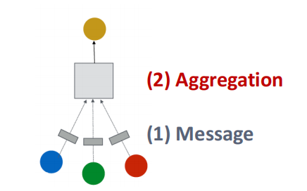
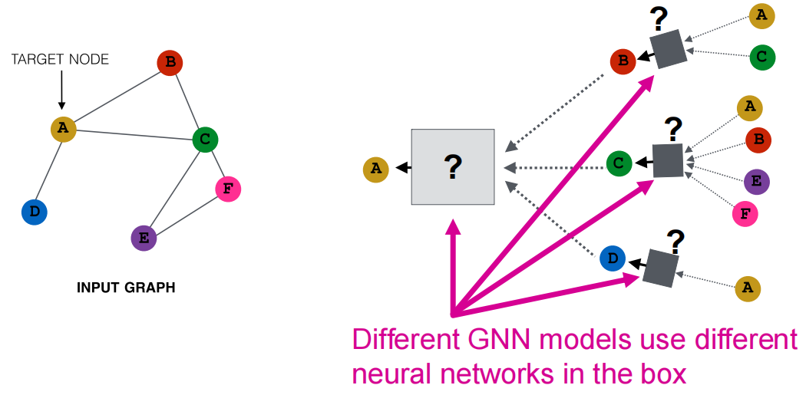
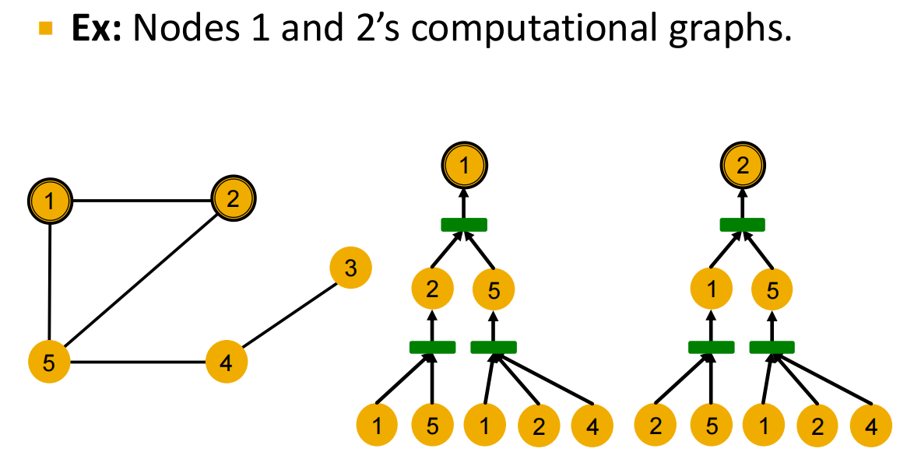
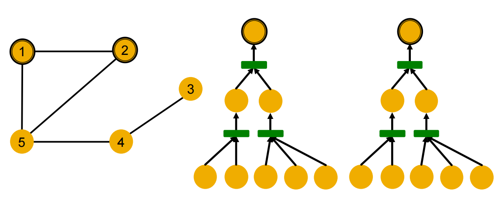
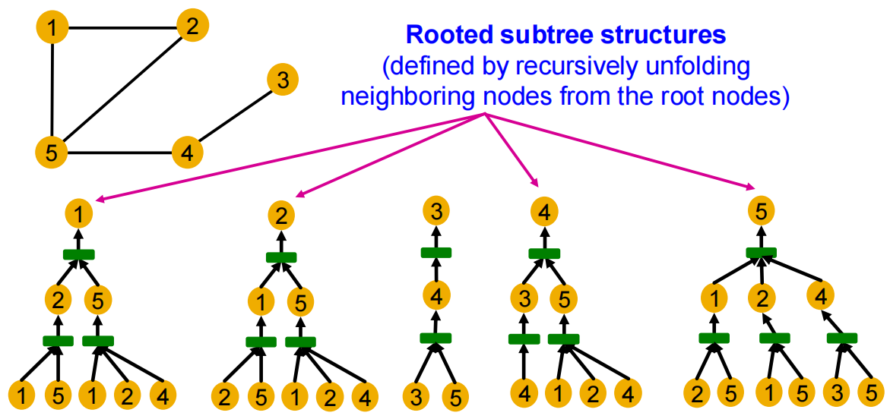

# Lec06-08: GNN Theory and Graph Transformer 1

## GNN Expressiveness

这一章的议题是，如何提升图神经网络表征的表达能力？

一个经典的表达能力测试(**expressivity test**)是，**同构图的判别问题**（给定1 pair of graphs，判断是否isomorphic），不过这个问题仍然停留在open problem的阶段，是一个疑似 $\text{NP-complete}$ 问题.

观察用于信息传递的单层GNN layer：

* Message阶段：对于节点$v$，每个邻居节点生成一条信息 $m_u^{(l)} = \text{MSG}^{(l)}\Big(h_u^{(l-1)}\Big)$，其中$u \in \{N(v) \cup v\}$

* Aggregate阶段：从邻居中聚合信息 

    $$h_v^{(l)} = \text{AGG}\Big(\{m_u^{(l)},u\in N(v)\},m_v^{(l)}\Big)$$

目前有多种不同的GNN模型，如GCN, GraphSAGE, GAT, Design Space等等，不同的GNN模型在处理时采用不同的神经网络（几下图中的问号处）.

举2个例子：

* [GCN, ICLR 2017](https://arxiv.org/abs/1609.02907)，基于图卷积网络的半监督分类，使用的是mean-pool (Element-wise mean pooling + Linear + ReLU non-linearity)
* [GraphSAGE, NeurIPS 2017](https://arxiv.org/abs/1706.02216)，使用的是MLP + element-wise max-pooling

---

### Computational Graph

在判定GNN能多好地区分不同的图结构时，有几个思路可以考虑：

* 节点颜色的含义：我们将相同特征的节点染成相同颜色，这样GNN 就必须依赖图的结构信息来区分节点
* 局部邻居结构（local neighborhood structures）：节点度数、节点邻居的度数、一对节点在图中是否有对称性

而第二个思路的解决就自然地引出了计算图（Computational Graph）的概念.

计算图是根据节点的邻居来建构的，比如：

但是GNN只会考虑节点的特征，而不会考虑ID：

从而可以看出，**节点1,2具有相同的计算图，于是GNN无法将1,2分辨出**.

计算图与每个节点周围的根树结构完全相同.

## Designing Powerful Graph Encoders

## Graph Transformer

