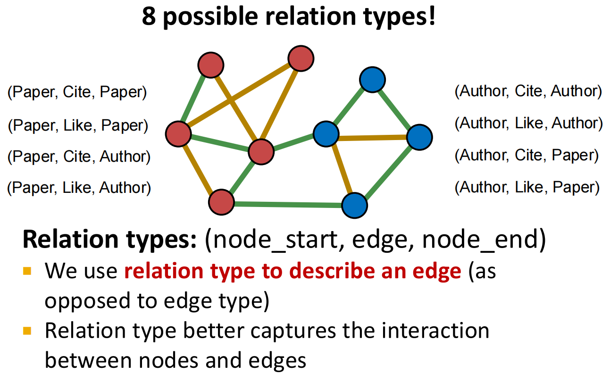
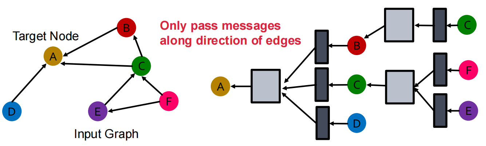

# Lec09-10: Heterogenous graphs & Knowledge graphs

## Heterogenous graphs

### Definition

Heterogenous graphs (异质图)：节点和边存在多种类型的图.

我们定义异质图为
$$
G = (V, E, \tau, \phi)
$$
其中 $v \in V$ 表示节点，$\tau(v)$ 表示节点属性，$(u,v) \in E$ 表示边，$\phi(u,v)$ 表示边属性，关系属性定义为 $r(u, v) = (\tau(u), \phi(u,v), \tau(v))$.

### Relational GCN

经典 GCN：
$$
h_v^{(l)} = \sigma \Big( W^{(l)}\sum_{u \in N(v)}\frac{h_u^{(l-1)}}{|N(v)|} \Big) = \sigma \Big( \underbrace{\sum_{u \in N(v)}}_{Aggregation} \underbrace{W^{(l)}\frac{h_u^{(l-1)}}{|N(v)|}}_{Message} \Big)
$$
添加 self-loop：
$$
h^{(l)}_v = \sigma \Big( \sum_{u \in N(v)} W^{(l)}\frac{h_u^{(l-1)}}{|N(v)|}  + W^{(l)}h_v^{(l-1)} \Big)
$$
Relational GCN (RGCN) 就是在 GCN 的基础上着手解决异质图的处理问题.

RGCN: 
$$
h^{(l+1)}_v = \sigma \Big( \underbrace{\sum_{r\in R}\sum_{u \in N^r_v}}_{Aggregation}\underbrace{\underbrace{\dfrac{1}{c_{v,r}} W_r ^{(l)}h_u^{(l)}}_{neighbors} + \underbrace{W_0^{(l)}h_v^{(l)}}_{self-loop}}_{Message} \Big)
$$

| 符号        | 含义                               |
| ----------- | ---------------------------------- |
| $R$         | 所有关系类型的集合                 |
| $N_v^r$     | 通过关系 $r$ 向 $v$ 传递消息的邻居 |
| $W_r^{(l)}$ | 第 $l$ 层处理关系 $r$ 的矩阵       |
| $c_{v,r}$   | 归一化系数                         |
| $W_0^{(l)}$ | 处理节点自身信息的矩阵             |

例如论文 $P$ 收到两个作者 $A_1,A_2$ 的消息，以及三篇引用它的论文 $P_1,P_2,P_3$ 的消息：
$$
h_P' = \sigma\left( W_{\text{write}}\frac{h_{A_1}+h_{A_2}}{2} + W_{\text{cite}}\frac{h_{P_1}+h_{P_2}+h_{P_3}}{3} + W_0h_P \right)
$$
**平均是在每种关系内部做的**：作者消息除以 2，引用消息除以 3，而不是全部除以 5.

这里会导致关系太多、参数计算复杂的问题：

> 假设输入、输出维度都是 $d$，关系数量是 $|R|$，每层的关系矩阵大约需要 $|R|d^2$ 个参数.

有以下的解决方法：

* 块对角矩阵

    把一个大矩阵限制成：
    $$
    W_r = \begin{bmatrix} B_{r,1} & & & \\ & B_{r,2} & & \\ & & \cdots & \\ & & & B_{r,n}\end{bmatrix}
    $$
    如果均匀分成 $B$ 块，参数量从 $d_{\text{out}}d_{\text{in}}$ 减少为 $B(\dfrac{d_\text{out}}{B}\dfrac{d_\text{in}}{B})$，代价是**这个矩阵不能让不同分组的特征直接交互**，第 1 组输入只能影响第 1 组输出.

* 权重共享

    现在只需要考虑 $B$ 个基矩阵 $\{V_1, \cdots, V_B\}$，用它们来表出每个关系最终的变换矩阵 $W_r$:
    $$
    W_r = \sum_{b = 1}^B a_{rb} V_b
    $$
    $a_{rb}$ 是重要性权重（标量），代表第 $b$ 个基矩阵对于第 $r$ 种关系有多重要.

    这样每个 relation 只需要学习 $\{a_{rb}\}^B_{b=1}$，复杂度降低到了 $B$.

* 

## Knowledge graphs

