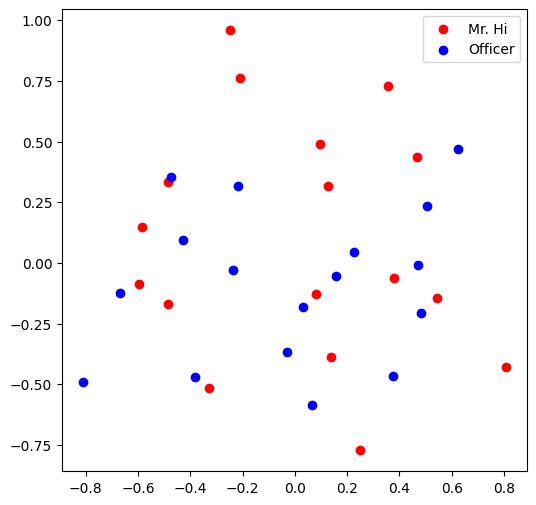
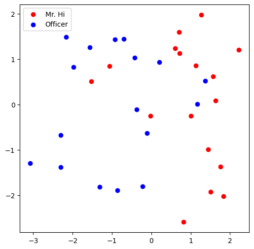

# Colab 1

???+ info "资源"

    [NetworkX](https://networkx.org/documentation/stable/tutorial.html)
    
    检索的时候感觉Bing获得的结果远远弱于Google.

---

这个lab是在搭建一个完整的**learning node embeddings**流水线，包括3个步骤：

* Load [Karate Club Network](https://en.wikipedia.org/wiki/Zachary's_karate_club)
* Transform the graph structure into a PyTorch tensor
* Finish the first learning algorithm on graphs: a node embedding model

## Graph Basics

### Setup

导入和查看信息：

```python
import networkx as nx

G = nx.karate_club_garph()
print(type(G))
```

输出：

```bash
/usr/local/lib/python3.12/dist-packages/networkx/classes/graph.py
Base class for undirected graphs.

A Graph stores nodes and edges with optional data, or attributes.

Graphs hold undirected edges.  Self loops are allowed but multiple
(parallel) edges are not.

Nodes can be arbitrary (hashable) Python objects with optional
key/value attributes, except that `None` is not allowed as a node.

Edges are represented as links between nodes with optional
key/value attributes.

Parameters
----------
incoming_graph_data : input graph (optional, default: None)
    Data to initialize graph. If None (default) an empty
    graph is created.  The data can be any format that is supported
    by the to_networkx_graph() function, currently including edge list,
    dict of dicts, dict of lists, NetworkX graph, 2D NumPy array, SciPy
    sparse matrix, or PyGraphviz graph.

attr : keyword arguments, optional (default= no attributes)
    Attributes to add to graph as key=value pairs.

See Also
--------
DiGraph
MultiGraph
MultiDiGraph

Examples
--------
Create an empty graph structure (a "null graph") with no nodes and
no edges.

>>> G = nx.Graph()

G can be grown in several ways.

**Nodes:**

Add one node at a time:

>>> G.add_node(1)

Add the nodes from any container (a list, dict, set or
even the lines from a file or the nodes from another graph).

>>> G.add_nodes_from([2, 3])
>>> G.add_nodes_from(range(100, 110))
>>> H = nx.path_graph(10)
>>> G.add_nodes_from(H)

In addition to strings and integers any hashable Python object
(except None) can represent a node, e.g. a customized node object,
or even another Graph.

>>> G.add_node(H)

**Edges:**

G can also be grown by adding edges.

Add one edge,

>>> G.add_edge(1, 2)

a list of edges,

>>> G.add_edges_from([(1, 2), (1, 3)])

or a collection of edges,

>>> G.add_edges_from(H.edges)

If some edges connect nodes not yet in the graph, the nodes
are added automatically.  There are no errors when adding
nodes or edges that already exist.

**Attributes:**

Each graph, node, and edge can hold key/value attribute pairs
in an associated attribute dictionary (the keys must be hashable).
By default these are empty, but can be added or changed using
add_edge, add_node or direct manipulation of the attribute
dictionaries named graph, node and edge respectively.

>>> G = nx.Graph(day="Friday")
>>> G.graph
{'day': 'Friday'}

Add node attributes using add_node(), add_nodes_from() or G.nodes

>>> G.add_node(1, time="5pm")
>>> G.add_nodes_from([3], time="2pm")
>>> G.nodes[1]
{'time': '5pm'}
>>> G.nodes[1]["room"] = 714  # node must exist already to use G.nodes
>>> del G.nodes[1]["room"]  # remove attribute
>>> list(G.nodes(data=True))
[(1, {'time': '5pm'}), (3, {'time': '2pm'})]

Add edge attributes using add_edge(), add_edges_from(), subscript
notation, or G.edges.

>>> G.add_edge(1, 2, weight=4.7)
>>> G.add_edges_from([(3, 4), (4, 5)], color="red")
>>> G.add_edges_from([(1, 2, {"color": "blue"}), (2, 3, {"weight": 8})])
>>> G[1][2]["weight"] = 4.7
>>> G.edges[1, 2]["weight"] = 4

Warning: we protect the graph data structure by making `G.edges` a
read-only dict-like structure. However, you can assign to attributes
in e.g. `G.edges[1, 2]`. Thus, use 2 sets of brackets to add/change
data attributes: `G.edges[1, 2]['weight'] = 4`
(For multigraphs: `MG.edges[u, v, key][name] = value`).

**Shortcuts:**

Many common graph features allow python syntax to speed reporting.

>>> 1 in G  # check if node in graph
True
>>> [n for n in G if n < 3]  # iterate through nodes
[1, 2]
>>> len(G)  # number of nodes in graph
5

Often the best way to traverse all edges of a graph is via the neighbors.
The neighbors are reported as an adjacency-dict `G.adj` or `G.adjacency()`

>>> for n, nbrsdict in G.adjacency():
...     for nbr, eattr in nbrsdict.items():
...         if "weight" in eattr:
...             # Do something useful with the edges
...             pass

But the edges() method is often more convenient:

>>> for u, v, weight in G.edges.data("weight"):
...     if weight is not None:
...         # Do something useful with the edges
...         pass

**Reporting:**

Simple graph information is obtained using object-attributes and methods.
Reporting typically provides views instead of containers to reduce memory
usage. The views update as the graph is updated similarly to dict-views.
The objects `nodes`, `edges` and `adj` provide access to data attributes
via lookup (e.g. `nodes[n]`, `edges[u, v]`, `adj[u][v]`) and iteration
(e.g. `nodes.items()`, `nodes.data('color')`,
`nodes.data('color', default='blue')` and similarly for `edges`)
Views exist for `nodes`, `edges`, `neighbors()`/`adj` and `degree`.

For details on these and other miscellaneous methods, see below.

**Subclasses (Advanced):**

The Graph class uses a dict-of-dict-of-dict data structure.
The outer dict (node_dict) holds adjacency information keyed by node.
The next dict (adjlist_dict) represents the adjacency information and holds
edge data keyed by neighbor.  The inner dict (edge_attr_dict) represents
the edge data and holds edge attribute values keyed by attribute names.

Each of these three dicts can be replaced in a subclass by a user defined
dict-like object. In general, the dict-like features should be
maintained but extra features can be added. To replace one of the
dicts create a new graph class by changing the class(!) variable
holding the factory for that dict-like structure.

node_dict_factory : function, (default: dict)
    Factory function to be used to create the dict containing node
    attributes, keyed by node id.
    It should require no arguments and return a dict-like object

node_attr_dict_factory: function, (default: dict)
    Factory function to be used to create the node attribute
    dict which holds attribute values keyed by attribute name.
    It should require no arguments and return a dict-like object

adjlist_outer_dict_factory : function, (default: dict)
    Factory function to be used to create the outer-most dict
    in the data structure that holds adjacency info keyed by node.
    It should require no arguments and return a dict-like object.

adjlist_inner_dict_factory : function, (default: dict)
    Factory function to be used to create the adjacency list
    dict which holds edge data keyed by neighbor.
    It should require no arguments and return a dict-like object

edge_attr_dict_factory : function, (default: dict)
    Factory function to be used to create the edge attribute
    dict which holds attribute values keyed by attribute name.
    It should require no arguments and return a dict-like object.

graph_attr_dict_factory : function, (default: dict)
    Factory function to be used to create the graph attribute
    dict which holds attribute values keyed by attribute name.
    It should require no arguments and return a dict-like object.

Typically, if your extension doesn't impact the data structure all
methods will inherit without issue except: `to_directed/to_undirected`.
By default these methods create a DiGraph/Graph class and you probably
want them to create your extension of a DiGraph/Graph. To facilitate
this we define two class variables that you can set in your subclass.

to_directed_class : callable, (default: DiGraph or MultiDiGraph)
    Class to create a new graph structure in the `to_directed` method.
    If `None`, a NetworkX class (DiGraph or MultiDiGraph) is used.

to_undirected_class : callable, (default: Graph or MultiGraph)
    Class to create a new graph structure in the `to_undirected` method.
    If `None`, a NetworkX class (Graph or MultiGraph) is used.

**Subclassing Example**

Create a low memory graph class that effectively disallows edge
attributes by using a single attribute dict for all edges.
This reduces the memory used, but you lose edge attributes.

>>> class ThinGraph(nx.Graph):
...     all_edge_dict = {"weight": 1}
...
...     def single_edge_dict(self):
...         return self.all_edge_dict
...
...     edge_attr_dict_factory = single_edge_dict
>>> G = ThinGraph()
>>> G.add_edge(2, 1)
>>> G[2][1]
{'weight': 1}
>>> G.add_edge(2, 2)
>>> G[2][1] is G[2][2]
True
```

可视化：

```python
nx.draw(G, with_labels = True)
```

结果：

<center></center>

### Q1: average degree

```python
def average_degree(num_edges, num_nodes):
    avg_degree = round(2 * num_edges / num_nodes) # 不要写漏 2 * ！！！
    return avg_degree

num_edges = G.number_of_edges()
num_nodes = G.number_of_nodes()
avg_degree = average_degree(num_edges, num_nodes)
print("Average degree of karate club network is {}".format(avg_degree))

# 输出：
# Average degree of karate club network is 5
```

### Q2: average clustering coefficient

```python
def average_clustering_coefficient(G):
    avg = round(nx.average_clustering(G), 2)
    return avg

avg_cluster_coef = average_clustering_coefficient(G)
print("Average clustering coefficient of karate club network is {}".format(avg_cluster_coef))

# 输出：
# Average clustering coefficient of karate club network is 0.57
```

### Q3: PageRank

PageRank算法用于衡量图中节点的重要性，核心思想是**重要的页面投的票更值钱**.

如果页面$i$的重要性是$r_i$，且有$d_i$个出链，则它给每一个出链的分配票数是$\dfrac{r_i}{d_i}$，于是节点$j$的重要性是$r_j = \sum\limits_{i \rightarrow j}\dfrac{r_i}{d_i}$，即所有指向$j$的页面分别贡献票数，再加起来.

但是这样是存在问题的：

* Dead Ends: 悬挂节点，即没有出链的Page会具备极高的重要性
* Spider Traps: 爬虫陷阱，即一组页面只互相连接，排名值无法流出

于是Google引入带阻尼系数的PageRank，称“冲浪者模型”，模拟一个用户在网页之间随机浏览，有$\beta$的概率随机点击当前页面的链接（正常跳转），有$1-\beta$的概率随机跳转到网络中的任意一个界面中（传送）. 具体而言，公式是:

$$r_j = \sum\limits_{i \rightarrow j}\beta\dfrac{r_i}{d_i} + (1-\beta)\dfrac1N$$

其中$\beta$是阻尼系数，通常取$0.85$，$N$是图中节点的总数. 

可以这样理解：$\sum\limits_{i \rightarrow j}\beta\dfrac{r_i}{d_i}$是正常跳转的权重，而$(1-\beta)\dfrac1N$是传送的权重.

```python
def one_iter_pagerank(G, beta, r0, node_id):
    r1 = 0
    N = G.number_of_nodes()
    d_i = G.degree(node_id)
    r1 = round(sum([beta * r0 / G.degree(i) for i in G.neighbors(node_id)]) + (1 - beta) / N, 2)
    
    return r1

beta = 0.8
r0 = 1 / G.number_of_nodes()
node = 0
r1 = one_iter_pagerank(G, beta, r0, node)
print("The PageRank value for node 0 after one iteration is {}".format(r1))

# 输出：
# The PageRank value for node 0 after one iteration is 0.13
```

### Q4: Closeness Centrality

Closeness Centrality的定义式：

$$c(v) = \dfrac1{\sum\limits_{u \neq v} \text{shortest path length between } u \text{ and } v}$$

```python
def closeness_centrality(G, node=5):
  	# 错误写法：直接调用，这样得到的是正则化后的结果
    # closeness = round(nx.closeness_centrality(G)[node], 2) 
    connected = len(nx.single_source_shortest_path_length(G, node))
  	closeness = round(nx.algorithms.centrality.closeness_centrality(G, u = node, wf_improved = False) / (connected - 1), 2)
  	return closeness

node = 5
closeness = closeness_centrality(G, node=node)
print("The node 5 has closeness centrality {}".format(closeness))

# 输出：
# The node 5 has closeness centrality 0.01
```

## Graph to Tensor

### Setup

```python
import torch
print(torch.__version__)
```

看到

```python
2.10.0+cpu
```

即可.

### Basics

赋值：

```python
ones = torch.ones(3,4)
print(ones)
print(ones.shape)
'''
tensor([[1., 1., 1., 1.],
        [1., 1., 1., 1.],
        [1., 1., 1., 1.]])
torch.Size([3, 4])
'''

zeros = torch.zeros(3,4)
print(zeros)

'''
tensor([[0., 0., 0., 0.],
        [0., 0., 0., 0.],
        [0., 0., 0., 0.]])
'''

random = torch.rand(3,4)
print(random)

'''
tensor([[0.6108, 0.5118, 0.0881, 0.4799],
        [0.1052, 0.3248, 0.2151, 0.8773],
        [0.6139, 0.4476, 0.5874, 0.1741]])
'''
```

查看类型：

```python
zeros = torch.zeros(3, 4, dtype = torch.float32)
print(zeros.dtype)

zeros = zeros.type(torch.long)
print(zeros.dtype)

'''
torch.float32
torch.int64
'''
```

### Q5: Graph to Edge List to Tensor

```python
def graph_to_edge_list(G):
    edge_list = list(G.edges())
    return edge_list

def edge_list_to_tensor(edge_list):
    edge_index = torch.tensor(edge_list, dtype = torch.long).T # .T表示化成tensor，
    return edge_index

pos_edge_list = graph_to_edge_list(G)
pos_edge_index = edge_list_to_tensor(pos_edge_list)
print("The pos_edge_index tensor has shape {}".format(pos_edge_index.shape))
print("The pos_edge_index tensor has sum value {}".format(torch.sum(pos_edge_index)))

'''
输出：
The pos_edge_index tensor has shape torch.Size([2, 78])
The pos_edge_index tensor has sum value 2535
'''
```

### Q6: Negative Sampling

Sample negative edge是重要的操作.

```python
import random

def sample_negative_edges(G, num_neg_samples):
    neg_edge_list = []
    neg_edge_set = set()
  	while len(neg_edge_set) < num_neg_samples:
    	src = random.randint(0, 33)
    	dst = random.randint(0, 33)
    	if not G.has_edge(src, dst) and not G.has_edge(dst, src) and src != dst:
      		neg_edge_set.add((src, dst))  # set 自动去重
  	neg_edge_list = list(neg_edge_set)
    return neg_edge_list

# Sample 78 negative edges
neg_edge_list = sample_negative_edges(G, len(pos_edge_list))

# Transform the negative edge list to tensor
neg_edge_index = edge_list_to_tensor(neg_edge_list)
print("The neg_edge_index tensor has shape {}".format(neg_edge_index.shape))

# Which of following edges can be negative ones?
edge_1 = (7, 1)
edge_2 = (1, 33)
edge_3 = (33, 22)
edge_4 = (0, 4)
edge_5 = (4, 2)

def can_be_negative(G, edge):
    is_negative = not (G.has_edge(edge[0], edge[1]) or G.has_edge(edge[1], edge[0]))
    
    return is_negative

print(f"Edge 1 can be a negative edge: {can_be_negative(G, edge_1)}")
print(f"Edge 2 can be a negative edge: {can_be_negative(G, edge_2)}")
print(f"Edge 3 can be a negative edge: {can_be_negative(G, edge_3)}")
print(f"Edge 4 can be a negative edge: {can_be_negative(G, edge_4)}")
print(f"Edge 5 can be a negative edge: {can_be_negative(G, edge_5)}")

'''
输出：
The neg_edge_index tensor has shape torch.Size([2, 78])
Edge 1 can be a negative edge: False
Edge 2 can be a negative edge: True
Edge 3 can be a negative edge: False
Edge 4 can be a negative edge: False
Edge 5 can be a negative edge: True
'''
```

## Node Embedding Learning

### Setup

```python
import torch
import torch.nn as nn
import mtplotlib.pyplot as plt
from sklearn.decomposition import PCA

print(torch.__version__)

# 输出：
# 2.10.0+cpu
```

想要书写自己的node embedding learning method，我们将重度使用`nn.Embedding`.

对4个item，embedding成8维的向量：

```python
emb_sample = nn.Embedding(num_embeddings = 4, embedding_dim = 8)
print('Sample embedding layer: {}'.format(emb_sample))

# 输出：
# Sample embedding layer: Embedding(4, 8)
```

从embedding matrix中选择item:

```python
id = torch.LongTensor([1]) # 取出元素1
print(emb_sample(id))

ids = torch.LongTensor([1,3]) # 取出元素1，3
print(emb_sample(ids))

shape = emb_sample.weight.data.shape
print(shape)

emb_sample.weight.date = torch.ones(shape) # 用全1向量overwrite

ids = torch.LongTensor([0,3])
print(emb_sample(ids))
```

输出：

```python
tensor([[-0.4137, -0.3731, -1.4701, -0.6325, -0.8805,  0.6266,  1.8363, -0.0278]],
       grad_fn=<EmbeddingBackward0>)
tensor([[-0.4137, -0.3731, -1.4701, -0.6325, -0.8805,  0.6266,  1.8363, -0.0278],
        [-2.0294, -0.5181,  2.0015,  0.6269, -0.7251, -0.4336, -0.7273, -0.4339]],
       grad_fn=<EmbeddingBackward0>)
torch.Size([4, 8])
tensor([[1., 1., 1., 1., 1., 1., 1., 1.],
        [1., 1., 1., 1., 1., 1., 1., 1.]], grad_fn=<EmbeddingBackward0>)
```

### Q6.5: Create Node Embedding

```python
torch.manual_seed(1)

def create_node_emb(num_node=34, embedding_dim=16):
    emb = nn.Embedding(num_embeddings=num_nodes, embedding_dim=embedding_dim, _weight=torch.rand(num_node, embedding_dim))
  	return emb

emb = create_node_emb()
ids = torch.LongTensor([0,3])

print("Embedding: {}".format(emb))

print(emb(ids))

'''
输出：
Embedding: Embedding(34, 16)
tensor([[0.7576, 0.2793, 0.4031, 0.7347, 0.0293, 0.7999, 0.3971, 0.7544, 0.5695,
         0.4388, 0.6387, 0.5247, 0.6826, 0.3051, 0.4635, 0.4550],
        [0.3556, 0.4452, 0.0193, 0.2616, 0.7713, 0.3785, 0.9980, 0.9008, 0.4766,
         0.1663, 0.8045, 0.6552, 0.1768, 0.8248, 0.8036, 0.9434]],
       grad_fn=<EmbeddingBackward0>)
'''
```

### Visualization

这里给出了一个可视化函数：

```python
def visualize_emb(emb):
    X = emb.weight.data.numpy()
      pca = PCA(n_components=2)
      components = pca.fit_transform(X)
      plt.figure(figsize=(6, 6))
      club1_x = []
      club1_y = []
      club2_x = []
      club2_y = []
      for node in G.nodes(data=True):
      	  if node[1]['club'] == 'Mr. Hi':
              club1_x.append(components[node[0]][0])
              club1_y.append(components[node[0]][1])
          else:
              club2_x.append(components[node[0]][0])
              club2_y.append(components[node[0]][1])
      plt.scatter(club1_x, club1_y, color="red", label="Mr. Hi")
      plt.scatter(club2_x, club2_y, color="blue", label="Officer")
      plt.legend()
      plt.show()

# Visualize the initial random embeddding
visualize_emb(emb)
```

结果：

<center></center>


### Q7: Train the Embedding

```python
from torch.optim import SGD
import torch.nn as nn

def accuracy(pred, label):
    pred = (pred > 0.5).int()
    accu = round(torch.sum(predictions == label).item() / len(label), 4)
  	return accu

def train(emb, loss_fn, train_label, train_edge):
    epochs = 500
    lr = 0.1
    optimizer = SGD(emb.parameters(), lr=lr, momentum=0.9)
    
    for i in range(epochs):
        optimizer.zero_grad()
        embeddings = emb(train_edge)
        dot_products = torch.sum(embeddings[0,:,:] * embeddings[1,:,:], dim = 1)
        sig = sigmoid(dot_products)
        loss = loss_fn(sig, train_label)
        loss.backward()
        optimizer.step()
        
        if (i % 50 == 0):
            print("Epoch: {0}, Acc: {1}".format(i, accuracy(sig, train_label)))
    
	return emb

loss_fn = nn.BCELoss()
sigmoid = nn.Sigmoid()
print(pos_edge_index.shape)

# Generate the positive and negative labels
pos_label = torch.ones(pos_edge_index.shape[1], )
neg_label = torch.zeros(neg_edge_index.shape[1], )

# Concat positive and negative labels into one tensor
train_label = torch.cat([pos_label, neg_label], dim=0)

# Concat positive and negative edges into one tensor
# Since the network is very small, we do not split the edges into val/test sets
train_edge = torch.cat([pos_edge_index, neg_edge_index], dim=1)
print(train_edge.shape)

train(emb, loss_fn, train_label, train_edge)

'''
输出：
torch.Size([2, 78])
torch.Size([2, 156])
Epoch: 0, Acc: 0.5
Epoch: 50, Acc: 0.7949
Epoch: 100, Acc: 0.9679
Epoch: 150, Acc: 1.0
Epoch: 200, Acc: 1.0
Epoch: 250, Acc: 1.0
Epoch: 300, Acc: 1.0
Epoch: 350, Acc: 1.0
Epoch: 400, Acc: 1.0
Epoch: 450, Acc: 1.0
Embedding(34, 16)
'''
```

可以看出收敛很快，大约150 epoch就能收敛.

最后可视化一下：

```python
visualize_emb(emb)
```

<center></center>
