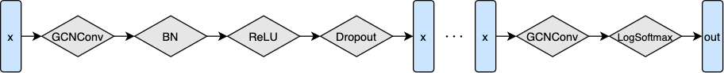

# Colab 2

???+ info "资源"

    [PyG](https://pytorch-geometric.readthedocs.io/en/latest/index.html)
    
    主要用的是[torch_geometric.nn](https://pytorch-geometric.readthedocs.io/en/latest/modules/nn.html)

---

这个lab是在使用PyG来搭建GNN并在2个Open Graph Benchmark (OGB)数据集上面进行应用，包括3个步骤：

* Learn PyG;
* Load and inspect one of the OGB datasets by using the `ogb` package;
* Build our own graph neural network using PyTorch Geometric.

## Setup

```python
import torch
import os
print("PyTorch has version {}".format(torch.__version__))

# 输出：PyTorch has version 2.4.0+cu121

if 'IS_GRADESCOPE_ENV' not in os.environ:
  	!pip install torch==2.4.0 
# Install torch geometric
if 'IS_GRADESCOPE_ENV' not in os.environ:
  # Clean uninstall first
  	!pip uninstall -y torch-geometric torch-sparse torch-scatter torch-cluster torch-spline-conv pyg-lib

  	torch_version = str(torch.__version__)
  	scatter_src = f"https://pytorch-geometric.com/whl/torch-{torch_version}.html"
  	sparse_src = f"https://pytorch-geometric.com/whl/torch-{torch_version}.html"
  	!pip install torch-scatter -f $scatter_src
  	!pip install torch-sparse -f $sparse_src
  	!pip install torch-geometric
  	!pip install ogb
    
# Jupyter Notebook自带功能，等待安装完成即可
```

## PyTorch Geometric (Datasets and Data)

导入数据集：

```python
from torch_geometric.datasets import TUDataset

if 'IS_GRADESCOPE_ENV' not in os.environ:
    root = './enzymes'
    name = 'ENZYMES'
    pyg_dataset = TUDataset(root, name)
    
    print(pyg_dataset)
    
'''
输出：
Downloading https://www.chrsmrrs.com/graphkerneldatasets/ENZYMES.zip
Processing...
ENZYMES(600)
Done!
'''
```

### Q1: ENZYMES class and feature numbers

```python
def get_num_classes(pyg_dataset):
    num_classes = pyg_dataset.num_classes
    return num_classes

def get_num_features(pyg_dataset):
    num_features = pyg_dataset.num_features
    return num_features
    
if 'IS_GRADESCOPE_ENV' not in os.environ:
  	num_classes = get_num_classes(pyg_dataset)
    num_features = get_num_features(pyg_dataset)
    print("{} dataset has {} classes".format(name, num_classes))
    print("{} dataset has {} features".format(name, num_features))
    
'''
输出：
ENZYMES dataset has 6 classes
ENZYMES dataset has 3 features
'''
```

每个PyG dataset存了`torch_geometric.data.Data`元素构成的list，每个`torch_geometric.data.Data`对象代表一个graph.

### Q2: Label of the graph with index 100 in ENZYMES dataset

```python
def get_graph_class(pyg_dataset, idx):
    label = pyg_dataset[idx]
    return label

if 'IS_GRADESCOPE_ENV' not in os.environ:
  	graph_0 = pyg_dataset[0]
  	print(graph_0)
  	idx = 100
  	label = get_graph_class(pyg_dataset, idx)
  	print('Graph with index {} has label {}'.format(idx, label))
    
'''
输出：
Data(edge_index=[2, 168], x=[37, 3], y=[1])
Graph with index 100 has label Data(edge_index=[2, 176], x=[45, 3], y=[1])
'''
```

### Q3: Edges the graph with inedx 200 has

```python
def get_graph_num_edges(pyg_dataset, idx):
  	if pyg_dataset[idx].is_undirected():
    	num_edges = pyg_dataset[idx].num_edges // 2
  	else:
    	num_edges = pyg_dataset[idx].num_edges
  	return num_edges

if 'IS_GRADESCOPE_ENV' not in os.environ:
  	idx = 200
  	num_edges = get_graph_num_edges(pyg_dataset, idx)
  	print('Graph with index {} has {} edges'.format(idx, num_edges))
    
'''
输出：
Graph with index 200 has 53 edges
'''
```

## Open Graph Benchmark (OGB)

导入OGBN-arxiv这个数据集.

```python
import torch_geometric.transforms as T
from ogb.nodeproppred import PygNodePropPredDataset

if 'IS_GRADESCOPE_ENV' not in os.environ:
  	dataset_name = 'ogbn-arxiv'
 	# Load the dataset and transform it to sparse tensor
  	dataset = PygNodePropPredDataset(name=dataset_name,
                                  transform=T.ToSparseTensor())
  	print('The {} dataset has {} graph'.format(dataset_name, len(dataset)))

  	# Extract the graph
  	data = dataset[0]
  	print(data)
    
'''
Downloading http://snap.stanford.edu/ogb/data/nodeproppred/arxiv.zip
Downloaded 0.08 GB: 100%|██████████| 81/81 [00:11<00:00,  6.97it/s]
Extracting dataset/arxiv.zip
Processing...
Loading necessary files...
This might take a while.
Processing graphs...
100%|██████████| 1/1 [00:00<00:00, 8594.89it/s]
Converting graphs into PyG objects...
100%|██████████| 1/1 [00:00<00:00, 1912.59it/s]Saving...

Done!
/usr/local/lib/python3.12/dist-packages/ogb/nodeproppred/dataset_pyg.py:69: FutureWarning: You are using `torch.load` with `weights_only=False` (the current default value), which uses the default pickle module implicitly. It is possible to construct malicious pickle data which will execute arbitrary code during unpickling (See https://github.com/pytorch/pytorch/blob/main/SECURITY.md#untrusted-models for more details). In a future release, the default value for `weights_only` will be flipped to `True`. This limits the functions that could be executed during unpickling. Arbitrary objects will no longer be allowed to be loaded via this mode unless they are explicitly allowlisted by the user via `torch.serialization.add_safe_globals`. We recommend you start setting `weights_only=True` for any use case where you don't have full control of the loaded file. Please open an issue on GitHub for any issues related to this experimental feature.
  self.data, self.slices = torch.load(self.processed_paths[0])
The ogbn-arxiv dataset has 1 graph
Data(num_nodes=169343, x=[169343, 128], node_year=[169343, 1], y=[169343, 1], adj_t=[169343, 169343, nnz=1166243])
'''
```

### Q4: Graph features in ogbn-arxiv graph.

```python
def graph_num_features(data):
    num_features = data.num_features
	return num_features

if 'IS_GRADESCOPE_ENV' not in os.environ:
  	num_features = graph_num_features(data)
  	print('The graph has {} features'.format(num_features))

'''
输出：
The graph has 128 features
'''
```

## GNN：Node Property Prediction

这个部分开始就正式搭建GNN了，首先使用GCN作为基础layer，使用`GCNConv`层来实现.

```python
import torch
import pandas as pd
import torch.nn.functional as F
print(torch.__version__)

from torch_geometric.nn import GCNConv

import torch_geometric.transforms as T
from ogb.nodeproppred import PygNodePropPredDataset, Evaluator

'''
输出：
2.4.0+cu121
'''
```

加载并预处理数据集：

```python
if 'IS_GRADESCOPE_ENV' not in os.environ:
  	dataset_name = 'ogbn-arxiv'
  	dataset = PygNodePropPredDataset(name=dataset_name,
                                  transform=T.ToSparseTensor())
  	data = dataset[0]

  	# Make the adjacency matrix to symmetric
  	data.adj_t = data.adj_t.to_symmetric()

  	device = 'cuda' if torch.cuda.is_available() else 'cpu'

  	# If you use GPU, the device should be cuda
  	print('Device: {}'.format(device))

  	data = data.to(device)
  	split_idx = dataset.get_idx_split()
  	train_idx = split_idx['train'].to(device)

'''
输出：
/usr/local/lib/python3.12/dist-packages/ogb/nodeproppred/dataset_pyg.py:69: FutureWarning: You are using `torch.load` with `weights_only=False` (the current default value), which uses the default pickle module implicitly. It is possible to construct malicious pickle data which will execute arbitrary code during unpickling (See https://github.com/pytorch/pytorch/blob/main/SECURITY.md#untrusted-models for more details). In a future release, the default value for `weights_only` will be flipped to `True`. This limits the functions that could be executed during unpickling. Arbitrary objects will no longer be allowed to be loaded via this mode unless they are explicitly allowlisted by the user via `torch.serialization.add_safe_globals`. We recommend you start setting `weights_only=True` for any use case where you don't have full control of the loaded file. Please open an issue on GitHub for any issues related to this experimental feature.
  self.data, self.slices = torch.load(self.processed_paths[0])
Device: cpu
'''
```

接下来根据这个流程图实现 GCN model：

<center></center>

### Q4.5: GCN model built from scrach

```python
class GCNConv(torch.nn.Module):
    def __init__(self, input_dim, hidden_dim, output_dim, num_layers, dropout, return_embeds=False):
        super(GCN, self).__init__()
        self.convs = torch.nn.ModuleList()
        self.bns = torch.nn.ModuleList()
        self.softmax = torch.nn.LogSoftmax(dim = 1)
        self.convs.append(GCNConv(input_dim, hidden_dim))
        self.bns.append(torch.nn.BatchNormId(hidden_dim))
        for i in range(num_layers - 2):
            self.convs.append(GCNConv(input_dim, hidden_dim))
            self.bns.append(torch.nn.BatchNormId(hidden_dim))
        self.convs.append(GCNConv(hidden_dim, output_dim))
        self.dropout = dropout
        self.return_embeds = return_embeds
        
 	def reset_parameters(self):
        for conv in self.convs:
            conv.reset_parameters()
        for bn in self.bns:
            bn.reset_parameters()

    def forward(self, x, adj_t):
        for i in range(len(self.convs) - 1):
            x = self.convs[i](x, adj_t) # 相当于执行了 X' = D^(-1/2) · A · D^(-1/2) · X · W
        	x = self.bns[i](x) # BatchNorm
          	x = F.relu(x) # 使用ReLU来
          	x = F.dropout(x, p = self.dropout, training = self.training)
        x = self.convs[-1](x, adj_t)
        out = x if (self.return_embeds) else self.softmax(x)
        return out
```

Train:

```python
def train(model, data, train_idx, optimizer, loss_fn):
    model.train()
    optimizer.zero_grad() # 1. Zero grad the optimizer
    out = model(data.x, data.adj_t) # 2. Feed the data into the model
    
    loss = loss_fn(out[train_idx], data.y.squeeze(1)[train_idx]) # 3. Slice the model output and label by train_idx
    # 4. Feed the sliced output and label to loss_fn

    loss.backward()
    optimizer.step()

    return loss.item()
```

Test:

```python
@torch.no_grad()

def test(model, data, split_idx, evaluator, save_model_results=False):
    model.eval()
    out = model(data.x, data.adj_t)
    
    y_pred = out.argmax(dim=1, keepdim=True)
    
    train_acc = evaluator.eval({
        'y_true': data.y[split_idx['train']],
        'y_pred': y_pred[split_idx['train']],
    })['acc']
    valid_acc = evaluator.eval({
        'y_true': data.y[split_idx['valid']],
        'y_pred': y_pred[split_idx['valid']],
    })['acc']
    test_acc = evaluator.eval({
        'y_true': data.y[split_idx['test']],
        'y_pred': y_pred[split_idx['test']],
    })['acc']
    
    if save_model_results:
        print("Saving Model Precisions")
        data = {}
        data['y_pred'] = y_pred.view(-1).cpu().detach().numpy()
        
        df = pd.DataFrame(data=data)
        df.to_csv('ogbn-arxiv_node.csv', sep=',', index = False)
        
    return train_acc, valid_acc, test_acc
```

设置超参数：

```python
if 'IS_GRADESCOPE_ENV' not in os.environ:
    args = {
        'device': device,
        'num_layers': 3
        'hidden_dim': 256,
        'dropout': 0.5,
        'lr': 0.01,
        'epochs': 100,
    }
    
if 'IS_GRADESCOPE_ENV' not in os.environ:
  	model = GCN(data.num_features, args['hidden_dim'],
              dataset.num_classes, args['num_layers'],
              args['dropout']).to(device)
  	evaluator = Evaluator(name='ogbn-arxiv')
```

接下来静等训练输出就行了：

```python
# Training should take <10min using GPU runtime
import copy
if 'IS_GRADESCOPE_ENV' not in os.environ:
  	# reset the parameters to initial random value
  	model.reset_parameters()

  	optimizer = torch.optim.Adam(model.parameters(), lr=args['lr'])
  	loss_fn = F.nll_loss

  	best_model = None
  	best_valid_acc = 0

  	for epoch in range(1, 1 + args["epochs"]):
    	loss = train(model, data, train_idx, optimizer, loss_fn)
    	result = test(model, data, split_idx, evaluator)
    	train_acc, valid_acc, test_acc = result
    	if valid_acc > best_valid_acc:
        	best_valid_acc = valid_acc
        	best_model = copy.deepcopy(model)
    	print(f'Epoch: {epoch:02d}, '
          	  f'Loss: {loss:.4f}, '
          	  f'Train: {100 * train_acc:.2f}%, '
          	  f'Valid: {100 * valid_acc:.2f}% '
          	  f'Test: {100 * test_acc:.2f}%')
```

输出结果：

```bash
/usr/local/lib/python3.12/dist-packages/torch_sparse/tensor.py:574: UserWarning: Sparse CSR tensor support is in beta state. If you miss a functionality in the sparse tensor support, please submit a feature request to https://github.com/pytorch/pytorch/issues. (Triggered internally at ../aten/src/ATen/SparseCsrTensorImpl.cpp:53.)
  return torch.sparse_csr_tensor(rowptr, col, value, self.sizes())
Epoch: 01, Loss: 4.1770, Train: 23.66%, Valid: 28.07% Test: 25.21%
Epoch: 02, Loss: 2.4281, Train: 25.82%, Valid: 23.42% Test: 28.42%
Epoch: 03, Loss: 1.9241, Train: 28.13%, Valid: 24.09% Test: 28.08%
Epoch: 04, Loss: 1.7824, Train: 28.81%, Valid: 22.85% Test: 20.06%
Epoch: 05, Loss: 1.6535, Train: 39.78%, Valid: 41.88% Test: 39.03%
Epoch: 06, Loss: 1.5797, Train: 45.97%, Valid: 47.97% Test: 44.12%
Epoch: 07, Loss: 1.5125, Train: 48.74%, Valid: 49.70% Test: 46.23%
Epoch: 08, Loss: 1.4582, Train: 47.87%, Valid: 48.61% Test: 47.48%
Epoch: 09, Loss: 1.4123, Train: 44.75%, Valid: 45.24% Test: 46.30%
Epoch: 10, Loss: 1.3809, Train: 43.22%, Valid: 43.90% Test: 46.69%
Epoch: 11, Loss: 1.3495, Train: 44.44%, Valid: 45.84% Test: 49.99%
Epoch: 12, Loss: 1.3225, Train: 46.40%, Valid: 46.19% Test: 50.34%
Epoch: 13, Loss: 1.3015, Train: 48.35%, Valid: 46.55% Test: 50.45%
Epoch: 14, Loss: 1.2745, Train: 50.59%, Valid: 47.70% Test: 51.76%
Epoch: 15, Loss: 1.2542, Train: 53.44%, Valid: 51.38% Test: 54.75%
Epoch: 16, Loss: 1.2350, Train: 56.10%, Valid: 55.25% Test: 57.85%
Epoch: 17, Loss: 1.2221, Train: 57.76%, Valid: 57.60% Test: 59.57%
Epoch: 18, Loss: 1.2071, Train: 58.72%, Valid: 59.00% Test: 60.90%
Epoch: 19, Loss: 1.1917, Train: 59.24%, Valid: 59.57% Test: 61.72%
Epoch: 20, Loss: 1.1861, Train: 59.48%, Valid: 59.70% Test: 61.90%
Epoch: 21, Loss: 1.1709, Train: 60.11%, Valid: 60.53% Test: 62.29%
Epoch: 22, Loss: 1.1612, Train: 61.14%, Valid: 61.94% Test: 62.91%
Epoch: 23, Loss: 1.1530, Train: 62.23%, Valid: 63.11% Test: 63.36%
Epoch: 24, Loss: 1.1446, Train: 62.91%, Valid: 63.88% Test: 63.94%
Epoch: 25, Loss: 1.1333, Train: 63.34%, Valid: 64.32% Test: 64.63%
Epoch: 26, Loss: 1.1277, Train: 63.43%, Valid: 64.50% Test: 65.16%
Epoch: 27, Loss: 1.1197, Train: 64.17%, Valid: 64.84% Test: 65.66%
Epoch: 28, Loss: 1.1149, Train: 64.93%, Valid: 65.45% Test: 65.89%
Epoch: 29, Loss: 1.1063, Train: 65.64%, Valid: 65.94% Test: 66.15%
Epoch: 30, Loss: 1.1022, Train: 66.13%, Valid: 66.34% Test: 66.53%
Epoch: 31, Loss: 1.0944, Train: 66.56%, Valid: 66.78% Test: 67.02%
Epoch: 32, Loss: 1.0862, Train: 67.19%, Valid: 67.34% Test: 67.53%
Epoch: 33, Loss: 1.0846, Train: 67.77%, Valid: 67.89% Test: 68.00%
Epoch: 34, Loss: 1.0768, Train: 68.22%, Valid: 68.39% Test: 68.37%
Epoch: 35, Loss: 1.0682, Train: 68.50%, Valid: 68.63% Test: 68.70%
Epoch: 36, Loss: 1.0680, Train: 68.61%, Valid: 68.73% Test: 68.77%
Epoch: 37, Loss: 1.0629, Train: 68.58%, Valid: 68.75% Test: 68.71%
Epoch: 38, Loss: 1.0580, Train: 68.62%, Valid: 68.72% Test: 68.73%
Epoch: 39, Loss: 1.0539, Train: 69.05%, Valid: 68.98% Test: 68.93%
Epoch: 40, Loss: 1.0497, Train: 69.47%, Valid: 69.32% Test: 69.08%
Epoch: 41, Loss: 1.0442, Train: 69.71%, Valid: 69.57% Test: 69.31%
Epoch: 42, Loss: 1.0360, Train: 69.77%, Valid: 69.47% Test: 69.49%
Epoch: 43, Loss: 1.0372, Train: 69.76%, Valid: 69.41% Test: 69.60%
Epoch: 44, Loss: 1.0343, Train: 69.82%, Valid: 69.48% Test: 69.66%
Epoch: 45, Loss: 1.0303, Train: 70.14%, Valid: 69.76% Test: 69.70%
Epoch: 46, Loss: 1.0269, Train: 70.33%, Valid: 69.88% Test: 69.66%
Epoch: 47, Loss: 1.0216, Train: 70.37%, Valid: 69.68% Test: 69.48%
Epoch: 48, Loss: 1.0169, Train: 70.28%, Valid: 69.56% Test: 69.48%
Epoch: 49, Loss: 1.0182, Train: 70.34%, Valid: 69.77% Test: 69.73%
Epoch: 50, Loss: 1.0135, Train: 70.55%, Valid: 70.14% Test: 70.05%
Epoch: 51, Loss: 1.0115, Train: 70.78%, Valid: 70.30% Test: 70.20%
Epoch: 52, Loss: 1.0062, Train: 70.85%, Valid: 70.41% Test: 70.14%
Epoch: 53, Loss: 1.0042, Train: 70.98%, Valid: 70.47% Test: 70.02%
Epoch: 54, Loss: 1.0012, Train: 71.19%, Valid: 70.65% Test: 69.96%
Epoch: 55, Loss: 0.9977, Train: 71.44%, Valid: 70.70% Test: 69.72%
Epoch: 56, Loss: 0.9964, Train: 71.48%, Valid: 70.69% Test: 69.71%
Epoch: 57, Loss: 0.9934, Train: 71.50%, Valid: 70.54% Test: 69.46%
Epoch: 58, Loss: 0.9893, Train: 71.58%, Valid: 70.35% Test: 69.44%
Epoch: 59, Loss: 0.9890, Train: 71.65%, Valid: 70.46% Test: 69.55%
Epoch: 60, Loss: 0.9871, Train: 71.89%, Valid: 70.94% Test: 69.87%
Epoch: 61, Loss: 0.9850, Train: 71.99%, Valid: 71.01% Test: 69.95%
Epoch: 62, Loss: 0.9813, Train: 72.00%, Valid: 71.13% Test: 70.29%
Epoch: 63, Loss: 0.9772, Train: 71.94%, Valid: 71.14% Test: 70.52%
Epoch: 64, Loss: 0.9755, Train: 71.96%, Valid: 71.17% Test: 70.63%
Epoch: 65, Loss: 0.9727, Train: 72.03%, Valid: 71.13% Test: 70.48%
Epoch: 66, Loss: 0.9726, Train: 72.15%, Valid: 71.05% Test: 70.31%
Epoch: 67, Loss: 0.9698, Train: 72.15%, Valid: 70.88% Test: 69.87%
Epoch: 68, Loss: 0.9676, Train: 72.25%, Valid: 70.84% Test: 69.93%
Epoch: 69, Loss: 0.9659, Train: 72.42%, Valid: 70.97% Test: 69.84%
Epoch: 70, Loss: 0.9657, Train: 72.51%, Valid: 71.07% Test: 70.02%
Epoch: 71, Loss: 0.9622, Train: 72.55%, Valid: 71.24% Test: 70.20%
Epoch: 72, Loss: 0.9606, Train: 72.51%, Valid: 71.59% Test: 70.84%
Epoch: 73, Loss: 0.9573, Train: 72.41%, Valid: 71.49% Test: 70.91%
Epoch: 74, Loss: 0.9574, Train: 72.35%, Valid: 71.45% Test: 70.74%
Epoch: 75, Loss: 0.9516, Train: 72.56%, Valid: 71.48% Test: 70.45%
Epoch: 76, Loss: 0.9509, Train: 72.85%, Valid: 71.59% Test: 70.53%
Epoch: 77, Loss: 0.9511, Train: 72.90%, Valid: 71.65% Test: 70.73%
Epoch: 78, Loss: 0.9506, Train: 72.93%, Valid: 71.66% Test: 70.72%
Epoch: 79, Loss: 0.9459, Train: 72.92%, Valid: 71.70% Test: 70.96%
Epoch: 80, Loss: 0.9452, Train: 72.66%, Valid: 71.37% Test: 70.93%
Epoch: 81, Loss: 0.9422, Train: 72.73%, Valid: 71.18% Test: 70.70%
Epoch: 82, Loss: 0.9417, Train: 73.02%, Valid: 71.35% Test: 70.46%
Epoch: 83, Loss: 0.9410, Train: 72.81%, Valid: 70.61% Test: 68.57%
Epoch: 84, Loss: 0.9412, Train: 72.94%, Valid: 70.80% Test: 68.87%
Epoch: 85, Loss: 0.9367, Train: 73.12%, Valid: 71.67% Test: 71.07%
Epoch: 86, Loss: 0.9346, Train: 72.46%, Valid: 70.68% Test: 70.74%
Epoch: 87, Loss: 0.9353, Train: 72.81%, Valid: 71.13% Test: 70.97%
Epoch: 88, Loss: 0.9315, Train: 73.26%, Valid: 71.49% Test: 70.70%
Epoch: 89, Loss: 0.9290, Train: 73.21%, Valid: 71.45% Test: 70.35%
Epoch: 90, Loss: 0.9313, Train: 73.31%, Valid: 71.80% Test: 70.84%
Epoch: 91, Loss: 0.9270, Train: 73.33%, Valid: 71.71% Test: 71.18%
Epoch: 92, Loss: 0.9236, Train: 73.32%, Valid: 71.66% Test: 71.21%
Epoch: 93, Loss: 0.9270, Train: 73.43%, Valid: 71.87% Test: 71.03%
Epoch: 94, Loss: 0.9223, Train: 73.50%, Valid: 71.79% Test: 70.76%
Epoch: 95, Loss: 0.9228, Train: 73.47%, Valid: 71.94% Test: 71.00%
Epoch: 96, Loss: 0.9178, Train: 73.50%, Valid: 71.79% Test: 71.19%
Epoch: 97, Loss: 0.9189, Train: 73.66%, Valid: 71.78% Test: 70.84%
Epoch: 98, Loss: 0.9182, Train: 73.73%, Valid: 71.82% Test: 70.81%
Epoch: 99, Loss: 0.9156, Train: 73.62%, Valid: 71.97% Test: 71.13%
Epoch: 100, Loss: 0.9141, Train: 73.37%, Valid: 71.63% Test: 71.01%
```

个人感觉，loss应该还没降到局部极值点，但也大差不差，Train, Valid, Test基本趋于稳定.


### Q5: `best_model` validation and test accuracies

```python
if 'IS_GRADESCOPE_ENV' not in os.environ:
  	best_result = test(best_model, data, split_idx, evaluator, save_model_results=True)
  	train_acc, valid_acc, test_acc = best_result
  	print(f'Best model: '
          f'Train: {100 * train_acc:.2f}%, '
          f'Valid: {100 * valid_acc:.2f}% '
          f'Test: {100 * test_acc:.2f}%')
'''
输出：
Saving Model Predictions
Best model: Train: 73.62%, Valid: 71.97% Test: 71.13%
'''
```

## GNN: Graph Property Prediction

这个部分是创建一个GNN用于Graph-Level Prediction.

```python
from ogb.graphproppred import PygGraphPropPredDataset, Evaluator
from torch_geometric.data import DataLoader
from tqdm.notebook import tqdm

if 'IS_GRADESCOPE_ENV' not in os.environ:
  	# Load the dataset
  	dataset = PygGraphPropPredDataset(name='ogbg-molhiv')

  	device = 'cuda' if torch.cuda.is_available() else 'cpu'
  	print('Device: {}'.format(device))

  	split_idx = dataset.get_idx_split()

  	# Check task type
  	print('Task type: {}'.format(dataset.task_type))
    
'''
Downloading http://snap.stanford.edu/ogb/data/graphproppred/csv_mol_download/hiv.zip
Downloaded 0.00 GB: 100%|██████████| 3/3 [00:00<00:00,  7.53it/s]
Processing...
Extracting dataset/hiv.zip
Loading necessary files...
This might take a while.
Processing graphs...
100%|██████████| 41127/41127 [00:00<00:00, 94871.13it/s]
Converting graphs into PyG objects...
100%|██████████| 41127/41127 [00:02<00:00, 14602.10it/s]
Saving...
Device: cpu
Task type: binary classification
Done!
/usr/local/lib/python3.12/dist-packages/ogb/graphproppred/dataset_pyg.py:68: FutureWarning: You are using `torch.load` with `weights_only=False` (the current default value), which uses the default pickle module implicitly. It is possible to construct malicious pickle data which will execute arbitrary code during unpickling (See https://github.com/pytorch/pytorch/blob/main/SECURITY.md#untrusted-models for more details). In a future release, the default value for `weights_only` will be flipped to `True`. This limits the functions that could be executed during unpickling. Arbitrary objects will no longer be allowed to be loaded via this mode unless they are explicitly allowlisted by the user via `torch.serialization.add_safe_globals`. We recommend you start setting `weights_only=True` for any use case where you don't have full control of the loaded file. Please open an issue on GitHub for any issues related to this experimental feature.
  self.data, self.slices = torch.load(self.processed_paths[0])
'''
```

导入dataset splits到对应的dataloaders内：

```python
if 'IS_GRADESCOPE_ENV' not in os.environ:
  	train_loader = DataLoader(dataset[split_idx["train"]], batch_size=32, shuffle=True, num_workers=0)
  	valid_loader = DataLoader(dataset[split_idx["valid"]], batch_size=32, shuffle=False, num_workers=0)
  	test_loader = DataLoader(dataset[split_idx["test"]], batch_size=32, shuffle=False, num_workers=0)
```

设置超参数;

```python
if 'IS_GRADESCOPE_ENV' not in os.environ:
	args = {
      	'device': device,
        'num_layers': 5,
        'hidden_dim': 256,
        'dropout': 0.5,
        'lr': 0.001,
        'epochs': 30,
    }
```

### Q5.5: Graph Prediction Model

首先是Graph Mini-Batching这个部分，我们希望对graph的一小部分并行运行，PyG将这些图合并成一个单独且不连通的图（`torch_geometric.data.Batch`）. **`torch_geometric.data.Batch`继承自`torch_geometric.data.Data`，并且包含了额外的属性`batch`**.

`batch`属性是一个vector，将每个节点映射到mini-batch内对应图的index.

比如：

```python
batch = [0, ..., 0, 1, ..., n - 2, n - 1, ..., n - 1] # 表示node[0]属于graph[0], node[-1]属于graph[n-1]，以此类推.
```

这个属性可以用于average node embeddings，以计算Graph-Level embeddings.

```python
from ogb.graphproppred.mol_encoder import AtomEncoder
from torch_geometric.nn import global_add_pool, global_mean_pool

class GCN_Graph(torch.nn.Module):
    def __init__(self, hidden_dim, output_dim, num_layers, dropout):
        super(GCN_Graph, self).__init__()
        self.node_encoder = AtomEncoder(hidden_dim)
        
        self.gnn_node = GCN(hidden_dim, hidden_dim, hidden_dim, num_layers, dropout, return_embeds = True)
        self.pool = global_mean_pool
        self.linear = torch.nn.Linear(hidden_dim, output_dim)
    
    def reset_parameters(self):
        self.gnn_node.reset_parameters()
        self.linear.reset_parameters()
        
    def forward(self, batched_data):
        x, edge_index, batch = batched_data.x, batched_data.edge_index, batched_data.batch
       	
        embed = self.node_encoder(x)
        embedding = self.gnn_node(embed, edge_index)
        out = self.linear(self.pool(embedding, batch))
        return out
```

Train:

```python
def train(model, device, data_loader, optimizer, loss_fn):
    model.train()
    loss = 0
    
    for step, batch in enumerate(tqdm(data_loader, desc = "Iteration")):
        batch = batch.to(device)
        if batch.x.shape[0] == 1 or batch.batch[-1] == 0:
            pass
        else:
            is_labeled = batch.y == batch.y
            optimizer.zero_grad()
            out = model(batch)
            loss = loss_fn(out[is_labeled], batch.y[is_labeled].to(torch.float32))
            loss.backward()
            optimizer.step()
            
    return loss.item()
```

eval:

```python
# The evaluation function
def eval(model, device, loader, evaluator, save_model_results=False, save_file=None):
    model.eval()
    y_true = []
    y_pred = []

    for step, batch in enumerate(tqdm(loader, desc="Iteration")):
        batch = batch.to(device)

        if batch.x.shape[0] == 1:
            pass
        else:
            with torch.no_grad():
                pred = model(batch)

            y_true.append(batch.y.view(pred.shape).detach().cpu())
            y_pred.append(pred.detach().cpu())

    y_true = torch.cat(y_true, dim = 0).numpy()
    y_pred = torch.cat(y_pred, dim = 0).numpy()

    input_dict = {"y_true": y_true, "y_pred": y_pred}

    if save_model_results:
        print ("Saving Model Predictions")

        # Create a pandas dataframe with a two columns
        # y_pred | y_true
        data = {}
        data['y_pred'] = y_pred.reshape(-1)
        data['y_true'] = y_true.reshape(-1)

        df = pd.DataFrame(data=data)
        # Save to csv
        df.to_csv('ogbg-molhiv_graph_' + save_file + '.csv', sep=',', index=False)

    return evaluator.eval(input_dict)
```

初始化：

```python
if 'IS_GRADESCOPE_ENV' not in os.environ:
  	model = GCN_Graph(args['hidden_dim'],
              		  dataset.num_tasks, args['num_layers'],
              args['dropout']).to(device)
  	evaluator = Evaluator(name='ogbg-molhiv')
```

开始运行：

```python
# Please do not change these args
# Training should take <10min using GPU runtime
import copy

if 'IS_GRADESCOPE_ENV' not in os.environ:
  	model.reset_parameters()

  	optimizer = torch.optim.Adam(model.parameters(), lr=args['lr'])
  	loss_fn = torch.nn.BCEWithLogitsLoss()

  	best_model = None
  	best_valid_acc = 0

  	for epoch in range(1, 1 + args["epochs"]):
    	print('Training...')
    	loss = train(model, device, train_loader, optimizer, loss_fn)

    	print('Evaluating...')
    	train_result = eval(model, device, train_loader, evaluator)
    	val_result = eval(model, device, valid_loader, evaluator)
    	test_result = eval(model, device, test_loader, evaluator)

    	train_acc, valid_acc, test_acc = train_result[dataset.eval_metric], val_result[dataset.eval_metric], test_result[dataset.eval_metric]
    	if valid_acc > best_valid_acc:
        	best_valid_acc = valid_acc
        	best_model = copy.deepcopy(model)
    	print(f'Epoch: {epoch:02d}, '
          	  f'Loss: {loss:.4f}, '
          	  f'Train: {100 * train_acc:.2f}%, '
          	  f'Valid: {100 * valid_acc:.2f}% '
          	  f'Test: {100 * test_acc:.2f}%')
```

结果输出：

```bash
Training...
Iteration: 100%
 1029/1029 [01:21<00:00, 14.43it/s]
Evaluating...
Iteration: 100%
 1029/1029 [00:31<00:00, 28.01it/s]
Iteration: 100%
 129/129 [00:04<00:00, 28.57it/s]
Iteration: 100%
 129/129 [00:04<00:00, 29.73it/s]
...（后面每个epoch都有这个阶段，故删掉了）
Epoch: 01, Loss: 0.0415, Train: 71.07%, Valid: 68.80% Test: 71.86%
Epoch: 02, Loss: 0.0350, Train: 75.35%, Valid: 72.59% Test: 70.44%
Epoch: 03, Loss: 0.0228, Train: 76.35%, Valid: 74.38% Test: 69.53%
Epoch: 04, Loss: 0.0217, Train: 77.26%, Valid: 76.06% Test: 72.24%
Epoch: 05, Loss: 1.3509, Train: 76.37%, Valid: 73.01% Test: 74.00%
...（中间的20个epoch略）
Epoch: 26, Loss: 0.0244, Train: 83.38%, Valid: 77.01% Test: 76.34%
Epoch: 27, Loss: 0.0342, Train: 83.68%, Valid: 78.47% Test: 77.00%
Epoch: 28, Loss: 0.7097, Train: 83.70%, Valid: 76.35% Test: 74.93%
Epoch: 29, Loss: 0.0187, Train: 83.91%, Valid: 77.01% Test: 73.99%
Epoch: 30, Loss: 0.0335, Train: 83.78%, Valid: 78.39% Test: 75.12%
```

### Q6: `best_model` validation and test ROC-AUC scores

```python
if 'IS_GRADESCOPE_ENV' not in os.environ:
  	train_auroc = eval(best_model, device, train_loader, evaluator)[dataset.eval_metric]
  	valid_auroc = eval(best_model, device, valid_loader, evaluator, save_model_results=True, save_file="valid")[dataset.eval_metric]
  	test_auroc  = eval(best_model, device, test_loader, evaluator, save_model_results=True, save_file="test")[dataset.eval_metric]

	print(f'Best model: '
          f'Train: {100 * train_auroc:.2f}%, '
      	  f'Valid: {100 * valid_auroc:.2f}% '
      	  f'Test: {100 * test_auroc:.2f}%')
```

结果：

```bash
Iteration: 100%
 1029/1029 [00:31<00:00, 35.84it/s]
Iteration: 100%
 129/129 [00:04<00:00, 22.73it/s]
Saving Model Predictions
Iteration: 100%
 129/129 [00:03<00:00, 35.47it/s]
Saving Model Predictions
Best model: Train: 80.73%, Valid: 79.59% Test: 73.86%
```

