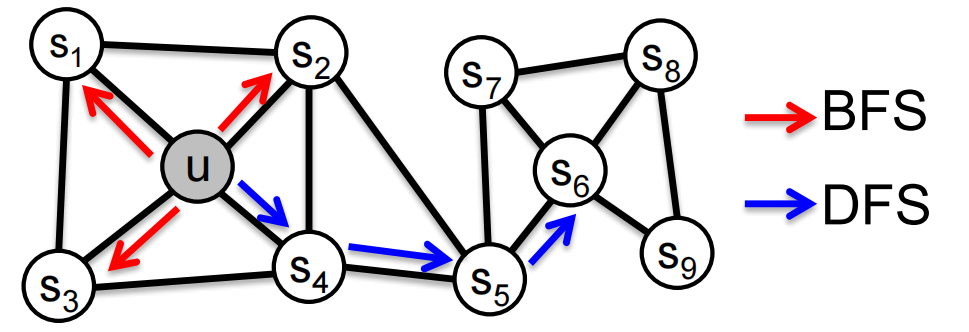
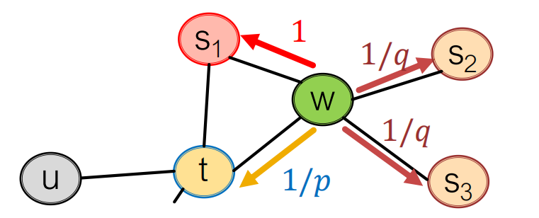
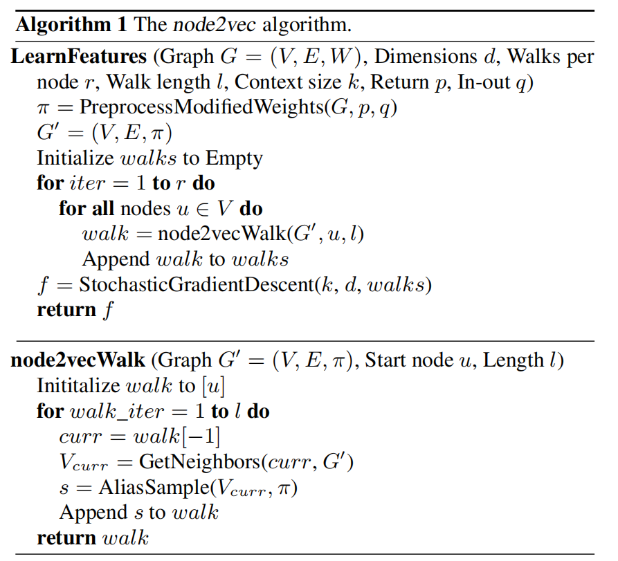

# node2vec

???+ info "论文信息"

    论文地址：[arxiv: 1607.00653](https://arxiv.org/abs/1607.00653)
    
    发表于KDD 2016.

---

## Overview

node2vec核心目标是将具有相似 network neighborhood 的node关系转换成feature space上也接近的关系. 我们将这个目标转化成最大似然目标优化问题 (maximum likelihood optimization problem)，并且不直接针对特定任务训练，而是先做一个通用的无监督表示学习任务.

这个通用的无监督表示学习任务大致是：给定一个节点 $u$，希望它的网络邻域节点 $N_R(u)$ 在向量空间中更容易被预测出来.

论文的核心洞察是，为了丰富结构上下文，节点$u$的邻居节点$N_R(u)$应当被灵活采用. 为此，论文引入有偏二阶随机游走 (Biased $2^{nd}$ Order Random Walks) 来选取$N_R(u)$.

## Biased Walks

Idea: 用biased random walks来实现 local 和 global view 的自由切换. 我们将BFS看成是对整张图的local view, DFS看成是global view.

Biased Walks是BFS和DFS的 Interpolation (插值)，用 Return Parameter $p$ 和 In-out parameter $q$ 来控制，$p$反映了节点下一步返回先前节点的意愿，$q$控制的是随机游走是在局部邻域里转还是往远处探索的意愿.

Random Walks是由single step构成的sequence，因此只需要对每一步做出分类就行.

### One step of the biased random walks

那么，应该如何设置edge transition probabilities? 下面是论文给出的答案：

1/𝑝, 1/𝑞, 1 是未规范化的概率

设起点为$t$，现在走到了$w$，下一步设为$x$. 我们可以看到，$dist(t,x) \in \{0,1,2\}, x \in \{t, S_1, S_2, S_3\}$.

我们令转移概率（规范化以前）

$$\alpha_{pq}(t,x) = \begin{cases} \dfrac1p & (dist(t,x) = 0)\\ 1 & (dist(t,x) = 1) \\ \dfrac1q & (dist(t,x) = 2)\\\end{cases}$$

如果$p$比较小，那么整体来看更像BFS-like walk；如果$q$比较小，那么整体上来看更像DFS-like walk. 

我感觉这里应该这么理解：选择转移到$S_2, S_3$时$dist(t,x) = 2$，深度较大，此时降低$q$可以让转移概率上升，从而增加遍历深度，因而看起来更像是DFS; 选择转移到$S_1$时$dist(t,x) = 1$，选择折返$dist(t,x) = 0$，深度较小，因而减小$q$，增大转移概率看起来更像是BFS.

设计 Biased $2^{nd}$ Order Random Walks 的好处：

* Space Complexity: $O(|E|)$;
* Time Complexity: $O(a^2|V|)$，其中$a$是节点平均的度数（由于真实世界中一般是稀疏图，所以$a$不是很大）
* 如果将 random walk length 设置成$l$，我们对$(l-k)$个node 取$k$个sample ($k < l$) ，实际的复杂度是$O(\dfrac{l}{k(l-k)})$.

下面定义一些算子：

| 算子        | 符号                 | 定义                                                 |
| ----------- | -------------------- | ---------------------------------------------------- |
| Average     | $\boxplus$           | $[f(u)\boxplus f(v)]_i = \dfrac{f_i(u)+f_i(v)}{2}$   |
| Hadamard    | $\boxdot$            | $[f(u)\boxdot f(v)]_i = f_i(u) * f_i(v)$             |
| Weighted-L1 | $\|\cdot\|_{\bar 1}$ | $\|f(u)\cdot f(v)\|_{\bar 1i} = \lvert f_i(u)-f_i(v)\rvert$   |
| Weighted-L2 | $\|\cdot\|_{\bar 2}$ | $\|f(u)\cdot f(v)\|_{\bar 2i} = \lvert f_i(u)-f_i(v)\rvert^2$ |

这些算子用于刻画两个node的feature embedding之间的关系，从结果来分类，做出"存在/不存在"的二分类预测.

## Node2vec算法

???+ info "代码仓库"

    [node2vec](https://github.com/aditya-grover/node2vec)
    
    [snap: node2vec](https://github.com/snap-stanford/snap/tree/master/examples/node2vec)

> 其它的一些random walk ideas：
>
> * 不同种的有偏随机路径：
>     * 基于node attributes: [KDD2017: Metapath2vec](https://ericdongyx.github.io/papers/KDD17-dong-chawla-swami-metapath2vec.pdf)
>     * 基于learned weights: [Watch Your Step: Learning Node Embeddings via Graph Attention](https://arxiv.org/abs/1710.09599)
> * 其它的优化范式：
>     * Directly optimize based on 1-hop and 2-hop random walk probabilities: [WWW2015: LINE](https://arxiv.org/abs/1503.03578)
> * Network预处理的技巧：
>     * Run random walks on modified versions of the original network: [struct2vec: Learning Node Representations from Structural Identity](https://arxiv.org/pdf/1704.03165) & [HARP: Hierarchical Representation Learning for Networks](https://arxiv.org/abs/1706.07845)

核心伪代码：

