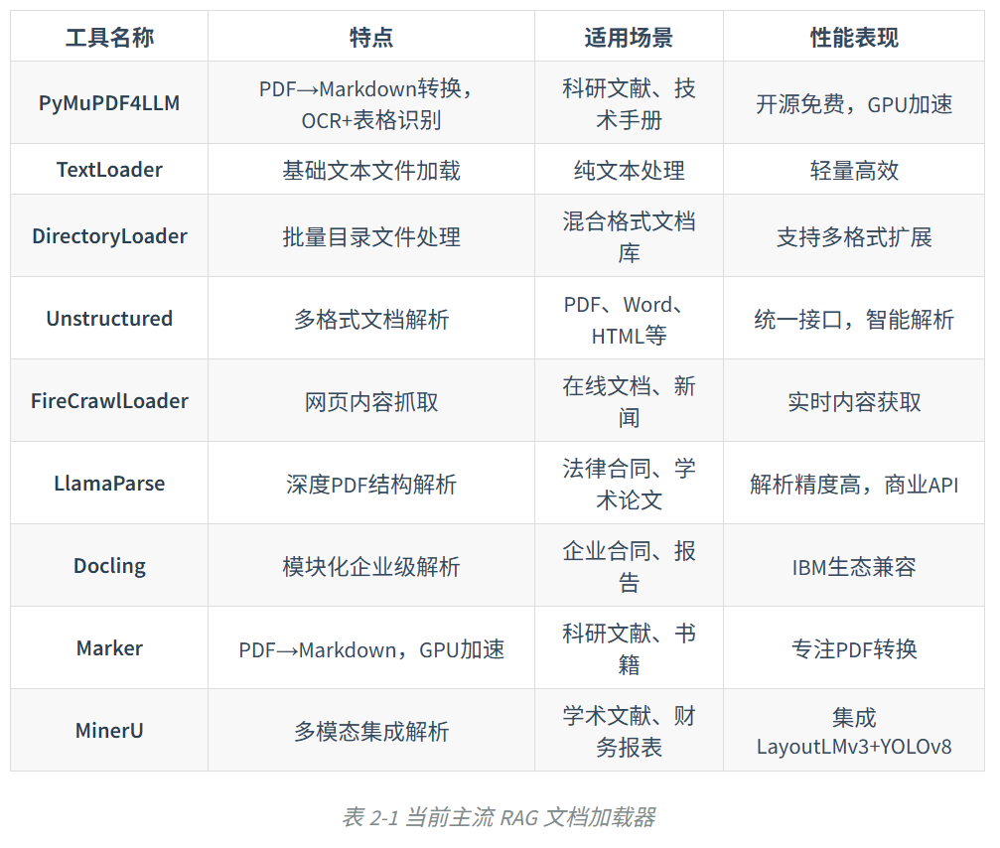
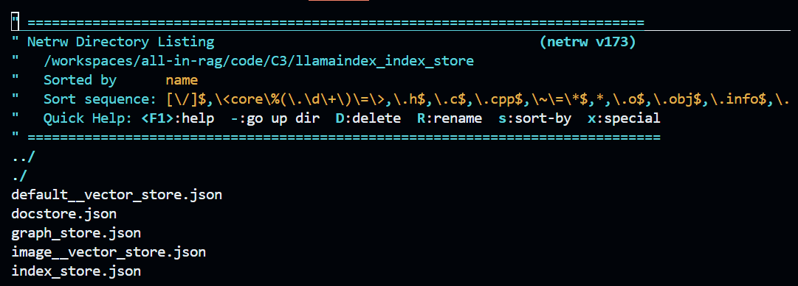

## Chap 1: RAG-basics

RAG = Retrieval-Augmented Generation

`01-langchain-example.py`

输出结果：

```bash
...
content='
文中举了以下例子：

1. **自然界中的羚羊**：刚出生的羚羊通过试错学习站立和奔跑，适应环境. 
2. **股票交易**：通过买卖股票并根据市场反馈调整策略，最大化奖励. 
3. **雅达利游戏（如Breakout和Pong）**：通过不断试错学习如何通关或赢得游戏. 
4. **选择餐馆**：利用（去已知喜欢的餐馆）与探索（尝试新餐馆）的权衡. 
5. **做广告**：利用（采取已知最优广告策略）与探索（尝试新广告策略）. 
6. **挖油**：利用（在已知地点挖油）与探索（在新地点挖油，可能发现大油田）. 
7. **玩游戏（如《街头霸王》）**：利用（固定策略如蹲角落出脚）与探索（尝试新招式如“大招”）. 

这些例子用于说明强化学习中的核心概念（如探索与利用、延迟奖励等）及其在实际场景中的应用. 
'
additional_kwargs={'refusal': None}
response_metadata={
    'token_usage': {
        'completion_tokens': 209,
        'prompt_tokens': 5576,
        'total_tokens': 5785,
        'completion_tokens_details': None,
        'prompt_tokens_details': {'audio_tokens': None, 'cached_tokens': 5568},
        'prompt_cache_hit_tokens': 5568,
        'prompt_cache_miss_tokens': 8
    },
    'model_name': 'deepseek-chat',
    'system_fingerprint': 'fp_8802369eaa_prod0425fp8',
    'id': '67a0580d-78b1-44d6-bccf-f654ae0e9bba',
    'service_tier': None,
    'finish_reason': 'stop',
    'logprobs': None
}
id='run--919cedcd-771e-4aed-8dfd-cf436795792e-0'
usage_metadata={
    'input_tokens': 5576,
    'output_tokens': 209,
    'total_tokens': 5785,
    'input_token_details': {'cache_read': 5568},
    'output_token_details': {}
}

```

参数解读：

* `content`是LLM的回答内容.
* `additional_kwargs`是额外参数，此处的`'refusal': None`表明没有拒绝回答.
* **`response_metadata`**是LLM响应的元数据，包含token消耗，model名称，

读取环境变量：

```python
load_dotenv()
```

加载知识源文档：

```python
markdown_path = "././data/C1/markdown/easy-rl-chapter1.md"
loader = TextLoader(markdown_path)
docs = loader.load()
```

文本分块（chunks）：

```python
text_splitter = RecursiveCharacterTextSplitter()
texts = text_splitter.split_documents(docs)
```

其中的`RecursiveCharacterTextSplitter()`默认使用其基类 `TextSplitter` 中定义的默认参数 `chunk_size=4000`（块大小）和 `chunk_overlap=200`（块重叠）.

初始化中文嵌入模型：

```python
embeddings = HuggingFaceEmbeddings(
	model_name = "BAAI/bge-small-zh-v1.5",
    model_kwargs = {'device': 'cpu'},
    encode_kwargs = {'normalize_embeddings': True} # 嵌入归一化
)
```

构建向量存储：

```python
vectorstore = InMemoryVectorStore(embeddings)
vectorstore.add_documents(texts)
```


## Chap 2: Data Preparations

这一节主要讲的是RAG的数据加载以及文本分块.

### 数据加载

给出了当前主流RAG加载器：



其中本教程用到的是[unstructured](https://pypi.org/project/unstructured/)这个库.


思考题：

切换成`partition_pdf`之后切分和识别精度变高了很多，且过程不可逆；

```bash
解析完成: 279 个元素, 7500 字符
元素类型: {'Header': 22, 'Title': 195, 'UncategorizedText': 41, 'NarrativeText': 3, 'Footer': 15, 'ListItem': 3}
```

设置strategy="hi_res"之后，先要安装拓展包：

```bash
sudo apt-get install -y poppler-utils
```

这是因为`hi_res` 模式的工作原理是先把 PDF 每页渲染成高分辨率图片，再用视觉模型做版面分析，这个图片转换依赖系统级的 `poppler` 工具集（提供 `pdfinfo`、`pdftoppm` 等命令）. 普通的 `fast` 模式直接解析 PDF 文本层，不需要这个工具，所以之前没报错.

结果上，完整段落会放在同一个element中，更加精确.

```bash
解析完成: 224 个元素, 8277 字符
元素类型: {'Image': 21, 'UncategorizedText': 89, 'Header': 4, 'NarrativeText': 68, 'Table': 4, 'FigureCaption': 4, 'Title': 30, 'ListItem': 4}
```

`ocr_only`显得很笨，无法识别中文：

```bash
解析完成: 138 个元素, 8266 字符
元素类型: {'UncategorizedText': 50, 'Title': 61, 'NarrativeText': 26, 'ListItem': 1}
```


### 文本分块

文本分块（Text Chunking）是将加载后的长篇文档，切分成更小、更易于处理的单元，即后续向量检索和模型处理的**基本单元**.

文本分块是为了适应RAG系统中的两个硬性限制：

* **嵌入模型 (Embedding Model)**输入上下文窗口有大小限制，每个chunk必须小于嵌入模型的上下文窗口.（如`bge-base-zh-v1.5`上下文窗口为512个token）
* **大语言模型 (LLM)**同样有上下文窗口限制.

chunk_size并非越大越好，需要降低信息损失；同时，当LLM处理非常长的、充满大量信息的上下文时，它倾向于更好地记住开头和结尾的信息，而忽略中间部分的内容；多个不相关主题被放入时会被稀释，召回可能性降低.


基于langchain Text Splitters的基础分块策略：

* 固定大小分块：

    ```python
    loader = TextLoader("././data/C2/txt/蜂医.txt", encoding="utf-8")
    docs = loader.load()
    
    text_splitter = RecursiveCharacterTextSplitter(
        # 针对中英文混合文本，定义一个更全面的分隔符列表
        separators=["\n\n", "\n", ". ", "，", " ", ""], # 按顺序尝试分割
        chunk_size=200,
        chunk_overlap=10
    )
    
    chunks = text_splitter.split_documents(docs)
    ```

* 递归大小分块

    （1）**寻找有效分隔符**: 从分隔符列表中从前到后遍历，找到第一个在当前文本中**存在**的分隔符. 如果都不存在，使用最后一个分隔符（通常是空字符串 `""`）. 

    （2）**切分与分类处理**: 使用选定的分隔符切分文本，然后遍历所有片段. **如果片段不超过块大小**: 暂存到 `_good_splits` 中，准备合并；如果片段超过块大小，则首先将暂存的合格片段通过 `_merge_splits` 合并成块，然后，检查是否还有剩余分隔符. 有剩余分隔符: 递归调用 `_split_text` 继续分割，无剩余分隔符则直接保留为超长块

    （3）**最终处理**: 将剩余的暂存片段合并成最后的块

    ```python
    # 针对代码文档的优化分隔符
    splitter = RecursiveCharacterTextSplitter.from_language(
        language=Language.PYTHON,  # 支持Python、Java、C++等
        chunk_size=500,
        chunk_overlap=50
    )
    
    ```

    能够针对特定的编程语言（如Python, Java等）使用预设的、更符合代码结构的分隔符

* 语义分块（Semantic Chunking）

    LangChain 提供了 `langchain_experimental.text_splitter.SemanticChunker` 来实现这一功能

    （1）**句子分割 (Sentence Splitting)**：使用标准的句子分割规则（例如，基于句号、问号、感叹号）将输入文本拆分成一个句子列表

    （2）**上下文感知嵌入 (Context-Aware Embedding)**：通过 `buffer_size` 参数（默认为1）来捕捉上下文信息. 对于列表中的每一个句子，将其与前后各 `buffer_size` 个句子组合起来，对这个临时的、更长的组合文本进行嵌入. 每个句子最终得到的嵌入向量融入了其上下文的语义. 

    （3）**计算语义距离 (Distance Calculation)**：计算每对**相邻**句子的嵌入向量之间的余弦距离. 距离值量化了两个句子之间的语义差异——距离越大，表示语义关联越弱，跳跃越明显. 

    （4）**识别断点 (Breakpoint Identification)**：`SemanticChunker` 分析所有计算出的距离值，并根据统计方法（默认为 `percentile`）来确定一个动态阈值. 例如，它可能会将所有距离中第95百分位的值作为切分阈值. 所有距离大于此阈值的点，都被识别为语义上的“断点”. 

    （5）**合并成块 (Merging into Chunks)**：最后，根据识别出的所有断点位置，将原始的句子序列进行切分，并将每个切分后的部分内的所有句子合并起来，形成一个最终的、语义连贯的文本块. 

    ```python
    import os
    ## os.environ["HF_ENDPOINT"] = "https://hf-mirror.com"
    from langchain_experimental.text_splitter import SemanticChunker
    from langchain_community.embeddings import HuggingFaceEmbeddings
    from langchain_community.document_loaders import TextLoader
    
    embeddings = HuggingFaceEmbeddings(
        model_name="BAAI/bge-small-zh-v1.5",
        model_kwargs={'device': 'cpu'},
        encode_kwargs={'normalize_embeddings': True}
    )
    
    # 初始化 SemanticChunker
    text_splitter = SemanticChunker(
        embeddings,
        breakpoint_threshold_type="percentile" # 断点识别方法
    )
    
    loader = TextLoader("././data/C2/txt/蜂医.txt")
    documents = loader.load()
    
    docs = text_splitter.split_documents(documents)
    ```

    

Langchain以及LlamaIndex也有各自的文本分块功能，懒得读了，等用到再回去翻.


## Chap 3: Index Construction

### 向量嵌入（Embedding）

将文本等对象转换成vector: embedding，是对数据**语义**的数学编码

Embedding技术发展：

1. 静态词嵌入：Word2vec（通过 Skip-gram 和 CBOW 架构，利用局部上下文窗口学习词向量，并验证了向量运算的语义能力（如 国王 - 男人 + 女人 ≈ 王后））, GloVe

    但是有弊端：无法处理一词多义问题.

2. 动态上下文嵌入：`Transformer` 架构的自注意力机制（Self-Attention）允许动态考虑句子中其它词语的影响，`Bert`模型就是基于此解决了静态嵌入的一词多义难题.

3. **RAG对embedding技术新要求：**RAG 框架的提出，是为了解决大型语言模型 **知识固化**（内部知识难以更新）和 **幻觉**（生成的内容可能不符合事实且无法溯源）的问题，通过“检索-生成”范式，动态地为 LLM 注入外部知识. 过程的核心是 **语义检索**，极大地依赖高质量的向量嵌入.

现代嵌入模型的核心通常是 Transformer 编码器（Encoder）部分. `Bert`通过堆叠多个 Transformer Encoder层来构建一个深度的双向表示学习网络.

嵌入模型的选择参考这个[链接](https://huggingface.co/spaces/mteb/leaderboard)，在考虑指标的时候也需要构建自己的私有评测集，并迭代优化.

### 多模态嵌入

**多模态嵌入 (Multimodal Embedding)** 是为了解析图像向量产生的，希望将不同类型数据映射到同一向量空间中.

OpenAI有CLIP (Contrastive Language-Image Pre-training)模型，采取了双编码器架构（图像+文本），分别将图像和文本映射到同一个共享的向量空间中.


这个是跑了原先代码的结果：

```python
=== 相似度计算结果 ===
纯图像 vs 纯图像: tensor([[0.8318]])
图文结合1 vs 纯图像: tensor([[0.8291]])
图文结合1 vs 纯文本: tensor([[0.7627]])
图文结合1 vs 图文结合2: tensor([[0.9058]])

=== 嵌入向量信息 ===
多模态向量维度: torch.Size([1, 768])
图像向量维度: torch.Size([1, 768])
多模态向量示例 (前10个元素): tensor([ 0.0360, -0.0032, -0.0377,  0.0240,  0.0140,  0.0340,  0.0148,  0.0292,
         0.0060, -0.0145])
图像向量示例 (前10个元素):   tensor([ 0.0407, -0.0606, -0.0037,  0.0073,  0.0305,  0.0318,  0.0132,  0.0442,
        -0.0380, -0.0270])
```

按思考题的意思改成了`blue whale`，结果是：

```python
=== 相似度计算结果 ===
纯图像 vs 纯图像: tensor([[0.8318]])
图文结合1 vs 纯图像: tensor([[0.9218]])
图文结合1 vs 纯文本: tensor([[0.7572]])
图文结合1 vs 图文结合2: tensor([[0.8719]])

=== 嵌入向量信息 ===
多模态向量维度: torch.Size([1, 768])
图像向量维度: torch.Size([1, 768])
多模态向量示例 (前10个元素): tensor([ 0.0277, -0.0514, -0.0233,  0.0135,  0.0278,  0.0198,  0.0089,  0.0285,
        -0.0357, -0.0242])
图像向量示例 (前10个元素):   tensor([ 0.0407, -0.0606, -0.0037,  0.0073,  0.0305,  0.0318,  0.0132,  0.0442,
        -0.0380, -0.0270])
```

可以看出来差别——图文结合1 vs 纯文本 相似度上升，表明文本对图像的描述很准确，由**补充效应**：当模型同时处理图片和 "blue whale" 文本时，文本信息增强了图像中关于“鲸鱼”的特征权重. 相比于之前“Datawhale组织logo”这种与图片视觉内容（蓝鲸）不符的描述，准确的描述让图文结合向量更向图像原始特征靠拢，甚至通过文本纠偏，让融合后的向量与原图相关性更强

而另外连各个指标都下降，表明模型对“图像差异”的敏感度：

- 当文本是“Datawhale logo”时，文本属于**强语义干扰**（因为图片里其实是鲸鱼而不是文字Logo），模型可能把两张图都强行拉向了“Logo”这个错误的语义点，导致它们看起来更像.
- 当文本换成“blue whale”时，它是**真实现场描述**. 此时模型能更客观地保留两张不同蓝鲸图片（datawhale01 和 02）之间的视觉差异，因此它们之间的相似度反而由于“各有个的样”而略微下降.

这个对比实验解释 Visualized BGE 的特性：不是简单的向量相加，而是一种基于文本引导的视觉增强. 文本越贴近图片内容，图文向量与图片向量的相似度通常越高

如果更换成"a red apple"，就有：

```python
=== 相似度计算结果 ===
纯图像 vs 纯图像: tensor([[0.8318]])
图文结合1 vs 纯图像: tensor([[0.7819]])
图文结合1 vs 纯文本: tensor([[0.7469]])
图文结合1 vs 图文结合2: tensor([[0.9006]])

=== 嵌入向量信息 ===
多模态向量维度: torch.Size([1, 768])
图像向量维度: torch.Size([1, 768])
多模态向量示例 (前10个元素): tensor([-0.0241, -0.0344, -0.0382,  0.0132,  0.0282,  0.0634,  0.0309,  0.0446,
        -0.0496, -0.0122])
图像向量示例 (前10个元素):   tensor([ 0.0407, -0.0606, -0.0037,  0.0073,  0.0305,  0.0318,  0.0132,  0.0442,
        -0.0380, -0.0270])
```

sim_2指标大幅下降，这是因为不相关的文本会“污染”图像特征，导致图文向量与原图的相似度显著下降；而Visualized BGE 在处理图文输入时，文本权重非常高，导致sim_3反而降低得不多；sim_4反而上升，可以看出当文本是准确的 "blue whale" 时，模型更关注两张鲸鱼图之间的**视觉差异**，但当文本是无关的 "a red apple" 时，两组图文对都包含了相同的、强烈的“苹果”语义. 共同的错误标签把两个原本有差异的样本强行拉近了，导致相似度反而变高了.


### 向量数据库

向量数据库能高效处理海量高维数据，核心是高效处理高维向量的相似性搜索.

一堆例子：[第三节 向量数据库](https://datawhalechina.github.io/all-in-rag/#/chapter3/08_vector_db)

```python
from langchain_community.vectorstores import FAISS
from langchain_community.embeddings import HuggingFaceEmbeddings
from langchain_core.documents import Document

# 1. 示例文本和嵌入模型
texts = [
    "张三是法外狂徒",
    "FAISS是一个用于高效相似性搜索和密集向量聚类的库。",
    "LangChain是一个用于开发由语言模型驱动的应用程序的框架。"
]
docs = [Document(page_content=t) for t in texts]
embeddings = HuggingFaceEmbeddings(model_name="BAAI/bge-small-zh-v1.5")

# 2. 创建向量存储并保存到本地
vectorstore = FAISS.from_documents(docs, embeddings)

local_faiss_path = "./faiss_index_store"
vectorstore.save_local(local_faiss_path)

print(f"FAISS index has been saved to {local_faiss_path}")

# 3. 加载索引并执行查询
# 加载时需指定相同的嵌入模型，并允许反序列化
loaded_vectorstore = FAISS.load_local(
    local_faiss_path,
    embeddings,
    allow_dangerous_deserialization=True
)

# 执行相似性搜索
query = "FAISS是做什么的？"
results = loaded_vectorstore.similarity_search(query, k=1)

print(f"\n查询: '{query}'")
print("相似度最高的文档:")
for doc in results:
    print(f"- {doc.page_content}")
```

会得到结果：

```bash
FAISS index has been saved to ./faiss_index_store

查询: 'FAISS是做什么的？'
相似度最高的文档:
- FAISS是一个用于高效相似性搜索和密集向量聚类的库。
```

运行完`03_llamaindex_vector.py`之后：

```bash
vim ./llama_index_store
```

可以看到一堆文件：




### Milvus实践

[Milvus](https://milvus.io) （[Github地址](https://github.com/milvus-io/milvus)）是一个开源的、专为大规模向量相似性搜索和分析而设计的向量数据库.

>  Docker常用指令：
>
> ```bash
> $ docker compose up -d    # 后台启动
> ```
>
> ```bash
> $ docker compose down -v  # 停止服务，加上-v表示彻底清理数据
> ```
>
> ```bash
> $ docker ps 			 # 查看容器
> ```

Milvus的核心组件：

* Collection: 所有数据的顶层容器
* Partition: Collection中的不同区域
* Schema: 定义了数据必须记录的信息
* Entity: 相当于一组具体的数据
* Alias: 动态的数据指向，可以指向具体的Collection.

Schema 定义了 Collection的所有字段 (field) 和属性，通常包含：

* 主键字段（primary key field）
* 向量字段（vector field）
* 标量字段（scalar field）

Partition可以提升查询性能，便于进行数据管理.

Alias 便于安全地更新数据（如果应用代码直接写死 Collection 名称，一旦需要换新 Collection，就必须改代码、重启服务，使得风险极高；使用alias访问可以实现原子性切换，即切换立即完成，也能做到回滚），实现了代码解耦.

**近似最近邻 (Approximate Nearest Neighbor, ANN) 检索**是Milvus核心功能之一，利用预先构建好的索引，能够极速地从海量数据中找到与查询向量最相似的 Top-K 个结果.

在这之上有filtered search, range search, hybrid search, group search（保证返回结果多样性）等增强检索功能.

#### 实践-端到端图文多模态

初始化和工具定义：

```python
import os
from tqdm import tqdm
from glob import glob
import torch
from visual_bge.visual_bge.modeling import Visualized_BGE
from pymilvus import MilvusClient, FieldSchema, CollectionSchema, DataType
import numpy as np
import cv2
from PIL import Image
```

初始化设置：

```python
MODEL_NAME = "BAAI/bge-base-en-v1.5"
MODEL_PATH = "././models/bge/Visualized_base_en_v1.5.pth"
DATA_DIR = "././data/C3"
COLLECTION_NAME = "multimodal_demo"
MILVUS_URI = "http://localhost:19530"
```

编码工具类：

```python
class Encoder:
    def __init__(self, model_name: str, model_path: str):
        self.model = Visualized_BGE(model_name_bge=model_name,model_weight=model_path)
        self.model.eval()
        
    def encode_query(self, image_path: str, text: str) -> list[float]:
        with torch.no_grad():
            query_emb = self.model.encode(image=image_path, text=text)
        return query_emb.tolist()[0]
    
    def encode_image(self, iamge_path: str) -> list[float]:
    	with torch.no_grad():
            query_emb = self.model.encode(image=image_path)
        return query_emb.tolist()[0]
```

创建全景图：

```python
def visualize_results(query_image_path: str, retrieved_images: list, img_height: int = 300, img_width: int = 300, row_count: int = 3) -> np.ndarray:
    """从检索到的图像列表创建一个全景图用于可视化。"""
    panoramic_width = img_width * row_count
    panoramic_height = img_height * row_count
    panoramic_image = np.full((panoramic_height, panoramic_width, 3), 255, dtype=np.uint8)
    query_display_area = np.full((panoramic_height, img_width, 3), 255, dtype=np.uint8)

    # 处理查询图像
    query_pil = Image.open(query_image_path).convert("RGB")
    query_cv = np.array(query_pil)[:, :, ::-1]
    resized_query = cv2.resize(query_cv, (img_width, img_height))
    bordered_query = cv2.copyMakeBorder(resized_query, 10, 10, 10, 10, cv2.BORDER_CONSTANT, value=(255, 0, 0))
    query_display_area[img_height * (row_count - 1):, :] = cv2.resize(bordered_query, (img_width, img_height))
    cv2.putText(query_display_area, "Query", (10, panoramic_height - 20), cv2.FONT_HERSHEY_SIMPLEX, 1, (255, 0, 0), 2)

    # 处理检索到的图像
    for i, img_path in enumerate(retrieved_images):
        row, col = i // row_count, i % row_count
        start_row, start_col = row * img_height, col * img_width
        
        retrieved_pil = Image.open(img_path).convert("RGB")
        retrieved_cv = np.array(retrieved_pil)[:, :, ::-1]
        resized_retrieved = cv2.resize(retrieved_cv, (img_width - 4, img_height - 4))
        bordered_retrieved = cv2.copyMakeBorder(resized_retrieved, 2, 2, 2, 2, cv2.BORDER_CONSTANT, value=(0, 0, 0))
        panoramic_image[start_row:start_row + img_height, start_col:start_col + img_width] = bordered_retrieved
        
        # 添加索引号
        cv2.putText(panoramic_image, str(i), (start_col + 10, start_row + 30), cv2.FONT_HERSHEY_SIMPLEX, 1, (0, 0, 255), 2)

    return np.hstack([query_display_area, panoramic_image])
```

创建collection：

```python
# 3. 初始化客户端
print("--> 正在初始化编码器和Milvus客户端...")
encoder = Encoder(MODEL_NAME, MODEL_PATH)
milvus_client = MilvusClient(uri=MILVUS_URI)

# 4. 创建 Milvus Collection
print(f"\n--> 正在创建 Collection '{COLLECTION_NAME}'")
if milvus_client.has_collection(COLLECTION_NAME):
    milvus_client.drop_collection(COLLECTION_NAME)
    print(f"已删除已存在的 Collection: '{COLLECTION_NAME}'")

image_list = glob(os.path.join(DATA_DIR, "dragon", "*.png"))
if not image_list:
    raise FileNotFoundError(f"在 {DATA_DIR}/dragon/ 中未找到任何 .png 图像。")
dim = len(encoder.encode_image(image_list[0]))

fields = [
    FieldSchema(name="id", dtype=DataType.INT64, is_primary=True, auto_id=True),
    FieldSchema(name="vector", dtype=DataType.FLOAT_VECTOR, dim=dim),
    FieldSchema(name="image_path", dtype=DataType.VARCHAR, max_length=512),
]

# 创建集合 Schema
schema = CollectionSchema(fields, description="多模态图文检索")
print("Schema 结构:")
print(schema)

# 创建集合
milvus_client.create_collection(collection_name=COLLECTION_NAME, schema=schema)
print(f"成功创建 Collection: '{COLLECTION_NAME}'")
print("Collection 结构:")
print(milvus_client.describe_collection(collection_name=COLLECTION_NAME))
```

输出结果：

```python
--> 正在创建 Collection 'multimodal_demo'

Schema 结构:
{
    'auto_id': True, 
    'description': '多模态图文检索', 
    'fields': [
        {'name': 'id', 'description': '', 'type': <DataType.INT64: 5>, 'is_primary': True, 'auto_id': True}, 
        {'name': 'vector', 'description': '', 'type': <DataType.FLOAT_VECTOR: 101>, 'params': {'dim': 768}}, 
        {'name': 'image_path', 'description': '', 'type': <DataType.VARCHAR: 21>, 'params': {'max_length': 512}}
    ], 
    'enable_dynamic_field': False
}

成功创建 Collection: 'multimodal_demo'

Collection 结构:
{
    'collection_name': 'multimodal_demo', 
    'auto_id': True, 
    'num_shards': 1, 
    'description': '多模态图文检索', 
    'fields': [
        {'field_id': 100, 'name': 'id', 'description': '', 'type': <DataType.INT64: 5>, 'params': {}, 'auto_id': True, 'is_primary': True}, 
        {'field_id': 101, 'name': 'vector', 'description': '', 'type': <DataType.FLOAT_VECTOR: 101>, 'params': {'dim': 768}}, 
        {'field_id': 102, 'name': 'image_path', 'description': '', 'type': <DataType.VARCHAR: 21>, 'params': {'max_length': 512}}
    ], 
    'functions': [], 
    'aliases': [], 
    'collection_id': 459243798405253751, 
    'consistency_level': 2, 
    'properties': {}, 
    'num_partitions': 1, 
    'enable_dynamic_field': False, 
    'created_timestamp': 459249546649403396, 
    'update_timestamp': 459249546649403396
}
```


### 索引优化

#### 上下文拓展：句子窗口检索（Sentence Window Retrieval）

加载文档：

```python
documents = SimpleDirectoryReader(
	input_files=[""]
).load_data()
```

创建节点和构建索引：

```python
node_parser = SentenceWindowNodeParser.from_defaults(
	window_size=3,
    window_metadata_key="window",
    original_text_metadata_key="original_text",
)

sentence_nodes = node_parser.get_nodes_from_documents(documents)
sentence_index = VectorStoreIndex(sentence_nodes)
```

其中`SentenceWindowNodeParser`核心逻辑在`build_window_nodes_from_documents`方法中.

实现过程：

* 句子切分（`sentence_splitter`）解析器需要接受一个文档`text`，
* 创建基础节点（`build_nodes_from_splits`）切分出的`text_splits`被传递给

#### 结构化索引

