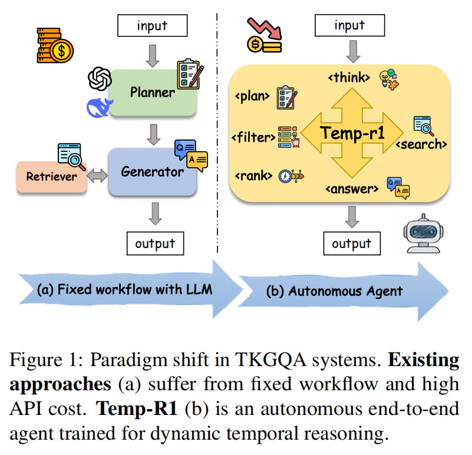
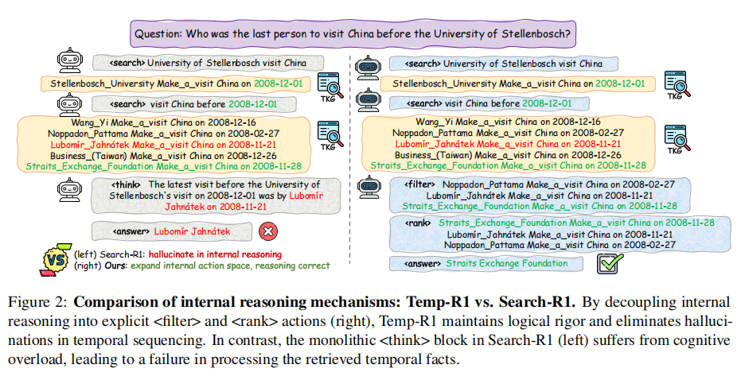
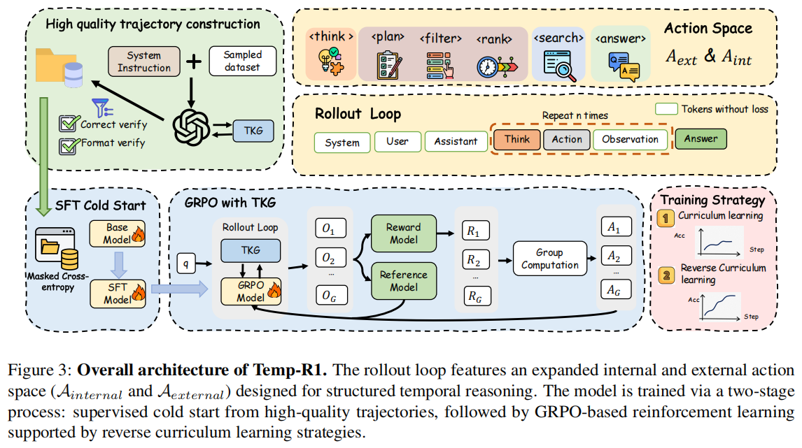

# [ACL 2026] Temp-R1: A Unified Autonomous Agent for Complex Temporal KGQA via Reverse Curriculum Reinforcement Learning

> * 论文地址: https://arxiv.org/abs/2601.18296
>
> * Github仓库: https://github.com/zjukg/Temp-R1
> * Connected Papers: [Connected Papers | Find and explore academic papers](https://www.connectedpapers.com/main/e03ec55dfd5fe4ecc9a3d4766652d154601e6368/Connected-Papers-|-Find-and-explore-academic-papers/graph)

原先工作（如 Search-R1 等）的Problem: 

1. 内部思考过载（Overloaded Internal Reasoning）：仅一个 $\textcolor{blue}{\langle think \rangle}$ 标签包含了过多的信息和工具调用，会导致不充分的强化学习与推理；
2. 强化学习中的捷径陷阱（The Shortcut Trap in Reinforcement Learning）：

---

Temp-R1 是一个基于强化学习的能自主探索多种求解策略的智能体，在时序知识图谱问答（Temporal Knowledge Graph Question Answering, TKGQA）相关问题中能提供较好的结果.

