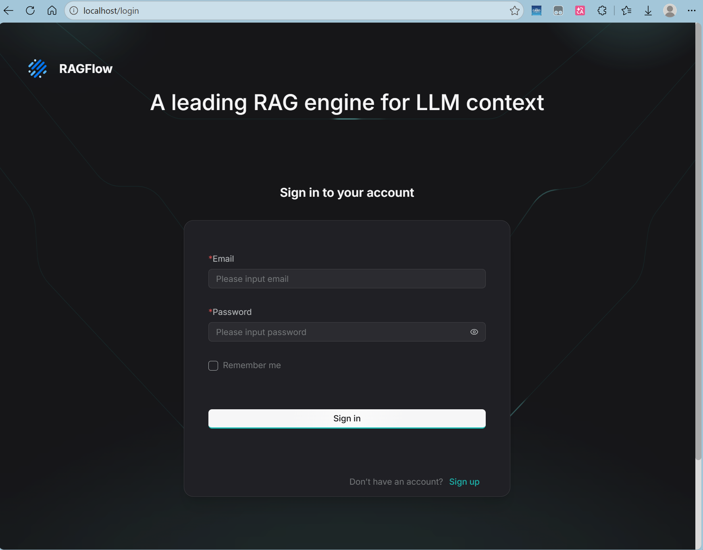

# RAGflow

## Setup

> [快速入门 | RAGFlow 引擎](https://ragflow.com.cn/docs)

我采用的是在自己的Windows电脑中，Docker Desktop + WSL2 配置该项目（文件放置在WSL文件系统中）.

启动容器和服务器：

```bash
$ docker compose -f docker-compose.yml up -d
```

检查状态：

```bash
$ docker logs -f docker-ragflow-cpu-1
```

首先是docker很吃显存和内存，费了很多时间清理C盘文件.

其次是WSL2和Windows的映射很麻烦.

需要注意一点，如果WSL重启过了，IP地址会变化，体现在

```bash
$ hostname -I
```

输出结果需要每次重新获取，然后PowerShell管理员模式执行：

```bash
netsh interface portproxy add v4tov4 listenport=9380 listenaddress=127.0.0.1 connectport=9380 connectaddress=172.x.x.x
```

然后浏览器输入`localhost:80`即可.

注意：后端端口是9380，前端端口是80，映射关系如下：

| Port     | Service        | Purpose                    |
| -------- | -------------- | -------------------------- |
| **80**   | Nginx          | Web UI (default HTTP)      |
| **443**  | Nginx          | Web UI (HTTPS)             |
| **9380** | API Server     | REST API endpoints         |
| **9381** | Admin Server   | Administration API         |
| **9382** | MCP Server     | Model Context Protocol     |
| **9384** | Go HTTP Server | Go-based API (hybrid mode) |

跳转到这个就胜利了：

