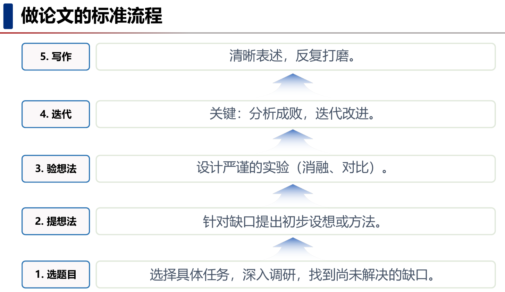
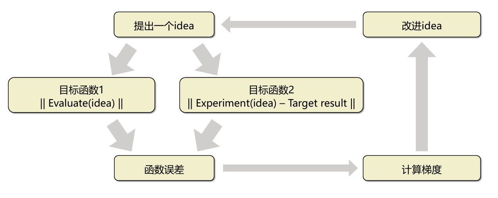
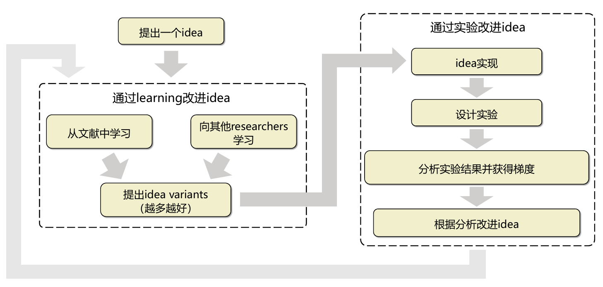
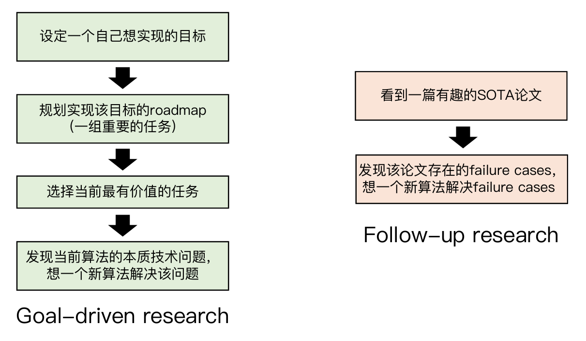
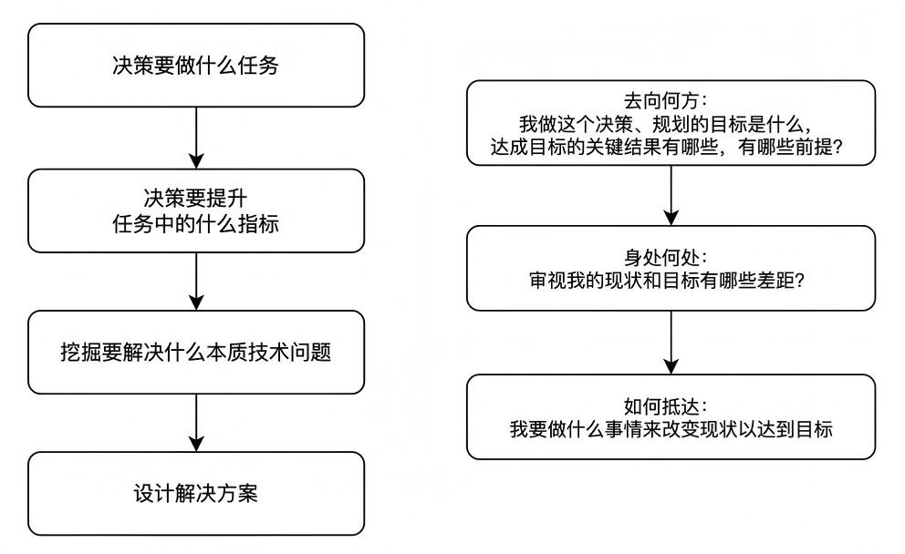
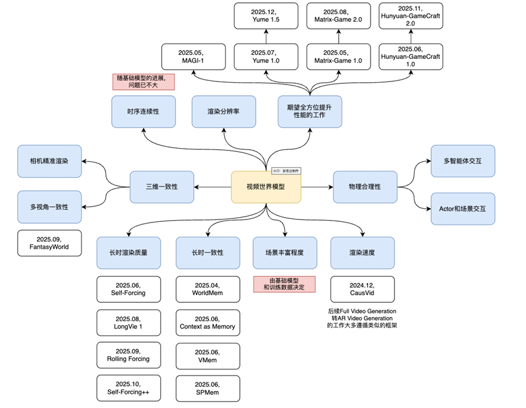
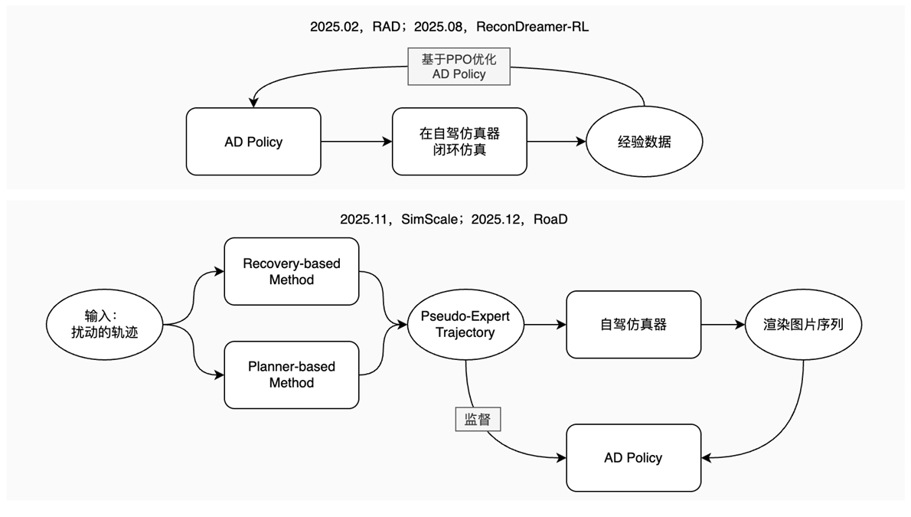

# 科研沉思录

> <table>
> <thead>
>     <tr>
>         <th>笔记列表</th>
>         <th>内容概要</th>
>     </tr>
> </thead>
> <tbody>
>     <tr>
>         <td><a href="cs70/">UCB-CS70（√）</a></td>
>         <td>CS70 UC Berkley: Discrete Math, 2025 Summer</td>
>     </tr>
>     <tr>
>         <td><a href="cs188/">UCB-CS188（√）</a></td>
>         <td>CS188 UC Berkley: Introduction to Artificial Intelligence, 2025 Spring</td>
>     </tr>
>     <tr>
>         <td><a href="cs106l/">Stanford-CS106L（√）</a></td>
>         <td>CS106L Stanford: Standard C++ Programming, 2022/2025 </td>
>     </tr>
>     <tr>
>         <td><a href="../lab/cs224n/">Stanford-CS224N（+）</a></td>
>         <td>Stanford CS224N: NLP with Deep Learning, 2026 Winter</td>
>     </tr>
>     <tr>
>         <td><a href="../lab/cs224w/">Stanford-CS224W（+）</a></td>
>         <td>Stanford CS224W: Machine Learning with Graphs, 2025 Fall</td>
>     </tr>
>     <tr>
>         <td><a href="../lab/cs336/">Stanford-CS336（+）</a></td>
>         <td>Stanford CS336: LLM from Scratch, 2026 Spring</td>
>     </tr>
>     <tr>
>         <td><a href="csapp/">CMU15-213: CSAPP（＋）</a></td>
>         <td>CMU15-213: CSAPP</td>
>     </tr>
>     <tr>
>         <td><a href="cmu15-445/">CMU 15-445（＋）</a></td>
>         <td>CMU 15-445: CMU, 2025Fall, 数据库系统</td>
>     </tr>
>     <tr>
>         <td><a href="MIT6.S081/">MIT 6.S081, 2021Fall（#）</a></td>
>         <td>MIT 6.S081: 2021 Fall, 操作系统</td>
>     </tr>
>     <tr>
>         <td><a href="cmu15-445/">UCB-CS168（#）</a></td>
>         <td>UCB CS168: 2025 Spring, 计算机网络</td>
>     </tr>
>     <tr>
>         <td><a href="sicp-NJU/">NJU-SICP（√）</a></td>
>         <td>NJU-SICP: 2025 Fall, 程序的构造与解释</td>
>     </tr>
>     <tr>
>         <td><a href="icspa-NJU/">NJU-ICSPA（-）</a></td>
>         <td>NJU-ICSPA: 2025 Spring，计算机系统概论</td>
>     </tr>
>     <tr>
>         <td><a href="cs61b/">UCB-CS61B（+）</a></td>
>         <td>UCB CS61B: Data Structure and Algorithms</td>
>     </tr>
>     <tr>
>         <td><a href="cs61c/">UCB-CS61C（-）</a></td>
>         <td>UCB CS61C: Great Ideas in Computer Architecture (Machine Structures) 2026 Spring</td>
>     </tr>
>     <tr>
>         <td><a href="datawhale_hello_agent/">Datawhale Hello-agent（#）</a></td>
>         <td>Datawhale Hello-agent开源课程</td>
>     </tr>
>     <tr>
>         <td><a href="datawhale_m4ai/">Datawhale Mathematics for Artificial Intelligence（×）</a></td>
>         <td>Datawhale 人工智能数学基础开源课程</td>
>     </tr>
>     <tr>
>         <td><a href="fish-dl/">深度学习-鱼书（√）</a></td>
>         <td>深度学习基础教材</td>
>     </tr>
>     <tr>
>         <td><a href="d2l/">动手学深度学习：李沐（+）</a></td>
>         <td>李沐老师2021年深度学习开源课程</td>
>     </tr>
>     <tr>
>         <td><a href="ml-lhy/">李宏毅:通用AI模型時代下的機器學習, 2025（+）</a></td>
>         <td>台湾大学李宏毅老师2025年LLM开源课程</td>
>     </tr>
>     <tr>
>         <td><a href="math_founda_rein_learn/">强化学习的数学原理（√）</a></td>
>         <td>西湖大学赵世钰老师开源课程</td>
>     </tr>
>     <tr>
>         <td><a href="hpc101/">HPC101, ZJU2026短学期课程综合实践（√）</a></td>
>         <td>超算入门：ZJU2026短学期课程综合实践</td>
>     </tr>
> </tbody>
> </table>

## 彭思达老师的talk

> 阅读时间：2026.9.8
>
> 地址：[Talk：CCF优博是怎么炼成的——一次苏格拉底式的复盘](https://pengsida.net/files/CCF_Talk.pdf)

这份talk聚焦的问题是，如何从保研小白成长为CCF优博，以及推动这个变化的具体行动方针.

由于我并不是做CV的，因此有些词汇和表述会在我的贫瘠理解下“等效”更改成自己研究的方向.

### 问题1：如何入门自己的研究领域

刚入门的时候，遇到的最大困难是**学习新知识的低效**. 此阶段常见的问题是：

* 一周死磕1篇论文：面对满篇术语、公式和架构图，逐字逐句地"啃"
* 脑中一片混沌： 读完抓不住核心思想，更不懂创新点和局限性，看完就忘

（太真实了，我读论文左脑进右脑出，根本记不住idea和方法）

对此，彭老师给出的建议入门流程是：

1. 选定方向：选择一个具体的方向，Feature Learning（√）
2. 仔细精读：找1篇最近的代表性论文，仔细学习技术流程（？）
3. 跑通代码：调试开源代码，建立具体的感性认识（pending）
4. 微小改动：修改代码看变化，探索因果关系（完全没做到这步）

在这之中，几乎是必然会遇到很多困难的（AI时代也许确实减少了不少困难，但也无形中对我的出产预期周期做了大幅下调）。因此彭老师也给了建议：

* 从过程中收获快乐，而不是只从结果中寻求快乐：将自己的正反馈阈值下调，即使是搞懂一个数学符号含义、复现一小段代码、用自己的话讲清楚原理，都可以算作一个微笑的正反馈；**不要把只有完全读懂论文或做出漂亮结果，甚至是发表论文才当作正反馈，这样的阈值过于高了**
* 从本科思维转成科研思维：科研的反馈周期远远长于本科，周期半年甚至一年。长期处于"无最终结果”的过程中。如果没有“微快乐”的思维，就非常考验毅力

### 问题2：如何做出第一篇论文

这个阶段的问题是，不知道如何系统地、标准地做出论文。此时虽然经历了入门，对基本算法知识比较熟悉，但依然没有自己的论文：就像一个学徒，熟悉各种食材（基础知识）和基本刀工（编程），但不知道如何烹饪出一道"菜"（Paper）.

对此彭老师给出了他的流程图：

科研项目中第一个最大的障碍是害怕失败，常见的思维误区是：

* “实验失败 = 这段时间白费了” 不敢尝试新方案

* 觉得没有好的结果就是浪费时间，导致精神内耗严重
* 总是想一次就设计出完美的实验

对此的解决方法是，循环往复，不断深化。要将失败看作是路标.

失败的实验并不是浪费时间，而是认知的提升. 实验的失败相当于排除了一个错误路径（“在当前条件下，这个方法不Work”）；同时也要产生思考：为什么不Work？是假设不对？数据问题？还是实现瑕疵？

这里彭老师提出了一个思路：在实验中迭代提升方法，**把改进方法的过程当作SGD优化过程**

总的来说就是建构好类似于SGD的反馈机制，让idea的效益以及实验和目标的误差趋近于期望情况，否则继续迭代.

（该阶段彭老师发了两篇CVPR oral，太强了）

### 问题3：如何在一个方向持续深耕？

这个阶段遇到的困难大概会是，“学术游击队”. （先看着吧，我自己本科肯定到不了这个阶段了）

* 现状： 虽然发了两篇论文，但属于不同的研究方向
* 疲惫： 打一枪换一个地方，每开新题都要重新调研
* 无根据地： 无法深耕，无法成为专家
* 迷茫： 缺乏长远主线，做完一个不知道下一个做什么

彭老师给出的建议是，建立科研“根据地”，具体方法是 Goal-Driven Research.

Goal-Driven Research 指的是**在这个领域，我最终想实现什么样的“终极目标”？**（老实说，这个太宏大了）

该阶段的认识是，掌握主动权，避免被动跟随他人的节奏，而是以我为主，发挥自身优势， 选择有利于自己的研究方向进行研究. 这带来了2个切实的好处：

* 系统性的创新
* 鲜明的科研标签

### 问题4：如何找到实际意义？

有时会遇到的困难是，做论文具有空虚感，没有看到实际落地：

* 缺乏真实的社会反馈：除了增加引用，我的工作对现实世界有价值吗？
* 似乎在为了发论文而发论文

彭老师谈到自己最初做科研的目的是，希望自己做出一些创造和发现， 能够推动社会产业的技术进步，能有实际的落地应用.

因此，解决问题的方法是，“从行业中来，到行业中去”：

* 从行业中来：研究问题要源于真实的应用场景和工业界痛点
* 没有调查就没有发言权：不做闭门造车的研究，先去一线了解情况

这样就把 Goal-Driven 进一步变成了 Problem-Driven Research，即选择**行业**认为有价值的任务，而不是**自己**认为有价值的任务.

### 问题5：如何教育传承？

尝试写科研教学文档：[pengsida/learning_research: 本人的科研经验](https://github.com/pengsida/learning_research)

这种方法的局限性是，同学熟读了文档，知道每一步怎么做，但不懂“全局联系”. （还真是，我现在脑子里一片浆糊）

这就是文字的局限性了，文字是线性的、局部的，难以瞬间呈现复杂研究课题的“全景”和“内在逻辑链条”. 因此，需要采用的解决方式自然是，视觉思维方式，即画图.

这里的画图是将思考过程化成草图，强迫自己将模糊思维清晰化、建立结构化逻辑，在纸上或白板上，所见即所得.

以下是3种常见的图：自顶向下的思考流程图、领域技术布局图、技术范式图

## 如何找研究想法

> 李沐老师的b站系列视频：
>
> * [如何找研究想法 1【论文精读】](https://www.bilibili.com/video/BV1qq4y1z7F2/)
>
> * 

