# Lec06-08: GNN Theory and Graph Transformer 1

## GNN Expressiveness

这一章的议题是，如何提升图神经网络表征的表达能力？

一个经典的表达能力测试(**expressivity test**)是，**同构图的判别问题**（给定1 pair of graphs，判断是否isomorphic），不过这个问题仍然停留在open problem的阶段，是一个疑似 $\text{NP-complete}$ 问题.

观察用于信息传递的单层GNN layer：

* Message阶段：对于节点$v$，每个邻居节点生成一条信息 $m_u^{(l)} = \text{MSG}^{(l)}\Big(h_u^{(l-1)}\Big)$，其中$u \in \{N(v) \cup v\}$

* Aggregate阶段：从邻居中聚合信息 

    $$h_v^{(l)} = \text{AGG}\Big(\{m_u^{(l)},u\in N(v)\},m_v^{(l)}\Big)$$

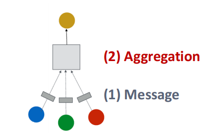

目前有多种不同的GNN模型，如GCN, GraphSAGE, GAT, Design Space等等，不同的GNN模型在处理时采用不同的神经网络（几下图中的问号处）.

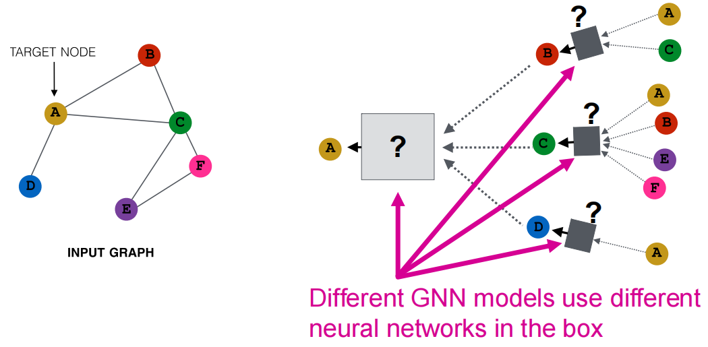

举2个例子：

* [GCN, ICLR 2017](https://arxiv.org/abs/1609.02907)，基于图卷积网络的半监督分类，使用的是mean-pool (Element-wise mean pooling + Linear + ReLU non-linearity)
* [GraphSAGE, NeurIPS 2017](https://arxiv.org/abs/1706.02216)，使用的是MLP + element-wise max-pooling

---

### Computational Graph

在判定GNN能多好地区分不同的图结构时，有几个思路可以考虑：

* 节点颜色的含义：我们将相同特征的节点染成相同颜色，这样GNN 就必须依赖图的结构信息来区分节点
* 局部邻居结构（local neighborhood structures）：节点度数、节点邻居的度数、一对节点在图中是否有对称性

而第二个思路的解决就自然地引出了计算图（Computational Graph）的概念.

计算图是根据节点的邻居来建构的，比如：

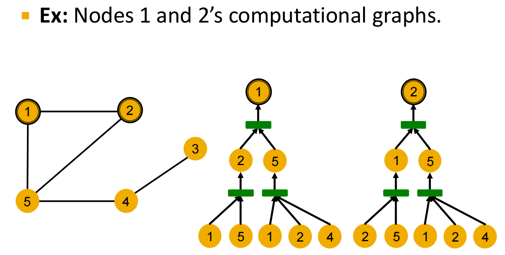

但是GNN只会考虑节点的特征，而不会考虑ID：

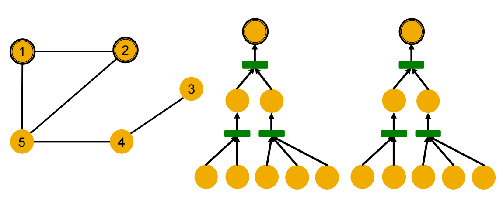

从而可以看出，**节点1,2具有相同的计算图，于是GNN无法将1,2分辨出**.

计算图与每个节点周围的根树结构完全相同.

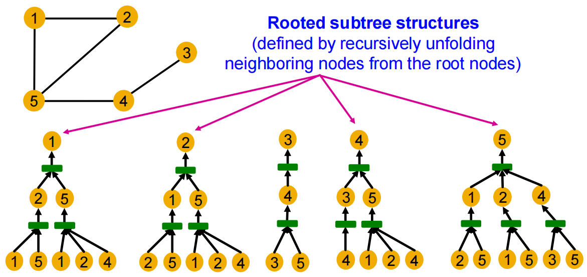

GNN 的节点嵌入是基于生成的计算图，因此为了提升表达能力，需要将嵌入映射看成injective function，

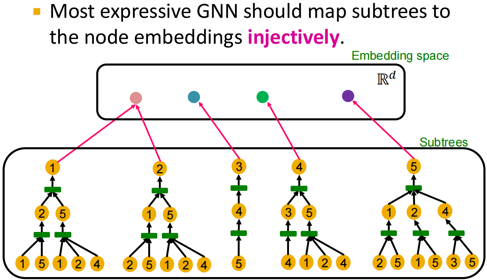

总结：

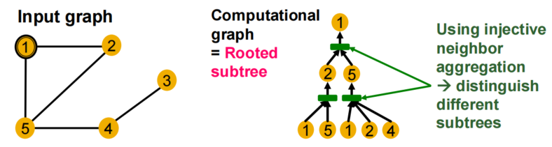

## Designing Powerful Graph Encoders

### Expressivity of GNN

首先要明确本小节的核心观点：**GNN的表达能力是由邻居节点聚合函数（neighborhood aggregation function）决定的，其中较好的聚合函数是 injective 的**

邻居节点的表示本质上构成一个 multi-set（多重集合），可以将neighbor aggregation直接看做一个multi-set function.

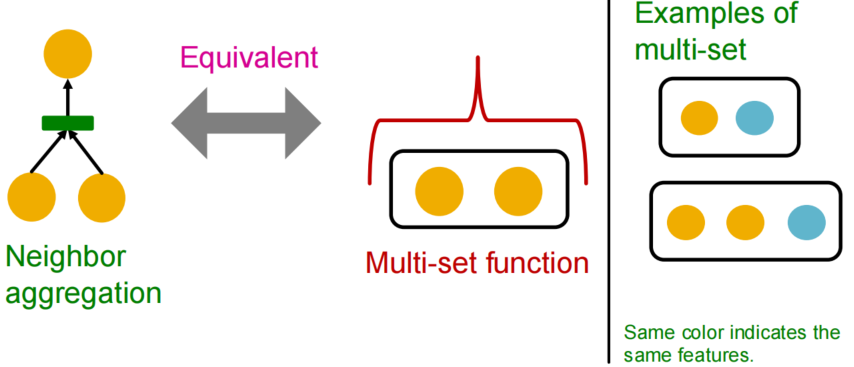

我们已经学过两个经典模型的聚合函数：

$$
\text{GCN: }\text{Mean}(\{x_u\}_{u \in N(v)})
$$

$$
\text{GraphSAGE: }\text{Max}(\{x_u\}_{u \in N(v)})
$$

已有文献 [[1]](#1) 的重要结论是，GCN’s aggregation function **cannot distinguish different multi-sets with the same color proportion (GCN无法区分具有相同颜色比例、但节点数量不同的多重集合)**. 这是容易理解的，因为平均函数会模糊掉数目信息，无法分辨 $\{A,B\}, \, \{A,A,B,B\}$这两组 multi-set.

类似地，GraphSAGE 同样无法分辨 $\{A,B\}, \, \{A,A,B,B\}$这两组 multi-set，因为 max 会丢失重复次数信息.

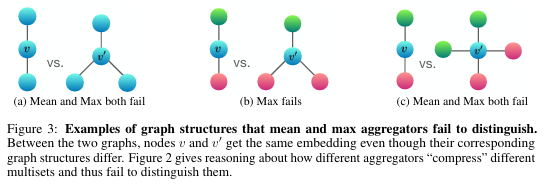

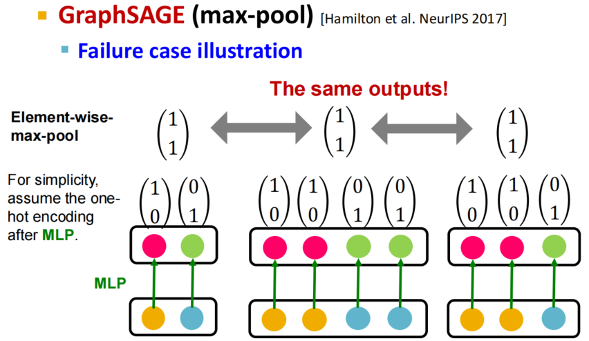

因此，**GCN 和 GraphSAGE are not maximally powerful GNNs**.

---

那么，应该如何设计一个 powerful 的 multi-set function 呢？已有文献 [[1]](#1) 给出的结论是：

> 任意一个 injective function 都可以被表示成以下形式：
>
> $$
> \Phi\Big( \sum\limits_{x \in S} f(x)\Big)
> $$
>
> 其中 $\Phi, f$ 分别是某个特定的非线性函数，$S$ 是某个 multi-set.

举个例子：

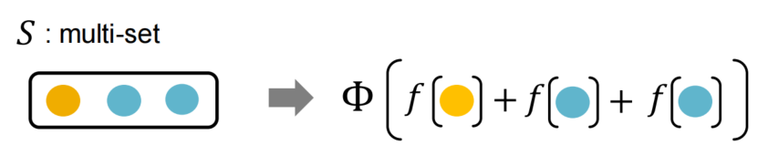

可以使用以下视角来理解：假设不同节点特征经过 $f$ 后变成类似 one-hot 的表示，那么求和结果可以同时保留有哪些类型的节点、每种类型出现了多少次 这两个信息.

在更早的文献中，Hornik 提出了 Universal Approximation Theorem [[2]](#2)，其内容是**一个具备足够大隐藏层维度的单隐藏层MLP，配上合适的非线性函数 $\sigma(\cdot)$，可以在任意精度下拟合出任意连续函数**，也就是说，在上面的函数中取$\Phi= f = \text{MLP}$，有：

$$
\text{MLP}_{\Phi}\Big( \sum\limits_{x\in S} \text{MLP}_f(x) \Big)
$$

实践中，MLP hidden dimensionality of 100 to 500 is sufficient.

论文作者把这个称作 **GIN** (Graph Isomorphism Network)，其运算过程就是 Apply an MLP,element-wise sum, followed by another MLP. 激动人心的是，这是一个没有 failure cases的满足 GNN expressivity 的 injective function.

---

### WL Graph Kernel and GIN

以上是 neighbor aggregation 的阶段，接下来考虑在 WL 图核视角下的 GIN (Graph Isomorphism Network) 完整模型.

WL 图核（Weisfeiler-Lehman Graph Kernel）是一种经典的图结构判别方法，而 **GIN 可以看作 WL 算法的可微神经网络版本**.

引入 Color Refinement Algorithm in WL Kernel：

> 在图$G$, 节点集合为$V = \{v_0, v_1, \cdots, v_n\}$中：
>
> * 对每个节点赋初始颜色值：$C^{(0)} =\{c_0^{(0)}, c_1^{(0)}, \cdots, c_n^{(0)}\}$.
>
> * 迭代式对节点颜色赋值：
>
>     $$
>     c^{(k+1)}(v) = \text{HASH} \Big( c^{(k)}(v), \{c^{(k)}(u)\}_{u \in N(v)} \Big)
>     $$
>
>     其中的哈希函数选择的是双射函数.
>
> * 在 $K$ 轮赋值之后，得到用于描述 $K-hop$ neighbor 的 $c^{(K)}(v)$ 集合.

举个例子：

> [!NOTE] +算法举例
>
> 
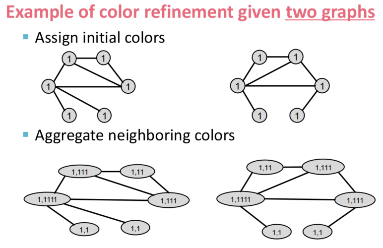

>
> 
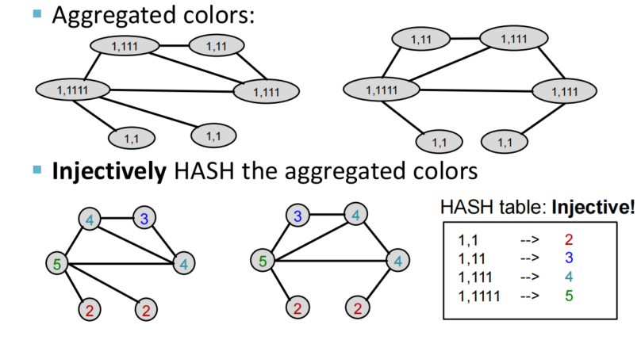

>
> 
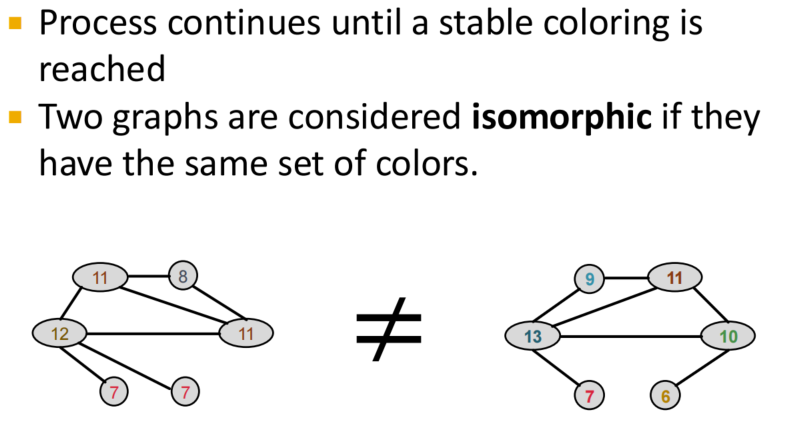

可以证明，作用在 $\Big( c^{(k)}(v), \{c^{(k)}(u)\}_{u \in N(v)} \Big)$上的所有 injective function 都可以被看作是：

$$
\text{MLP} \Big( (1 + \epsilon)\cdot\text{MLP}_f(c^{(k)}(v)) + \sum\limits_{u \in N(v)}\text{MLP}_f(c^{(k)}(u)) \Big)
$$

其中 $\epsilon$ 是一个可学习到的参数.

这个函数记作 $\text{GINConv}$，原理同样可以使用one-hot来证明，所以整个 GIN Model 可以如下看待：

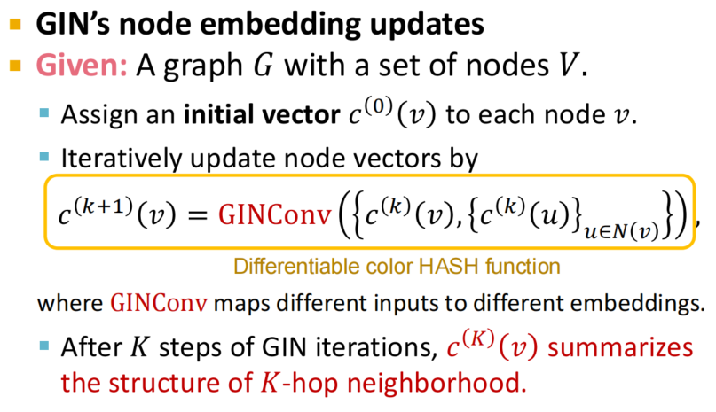

 这个时候回过头看这句话“**GIN 可以看作 WL 算法的可微神经网络版本**”就比较好理解了，只需要列出对比：

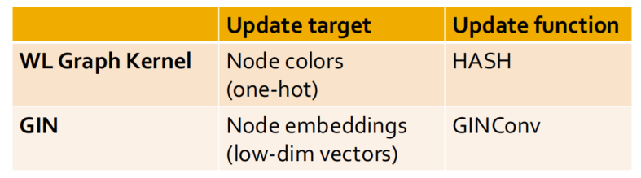

WL kernel has been both theoretically and empirically shown to distinguish most of the realworld graphs [Cai et al.1992] Because of the relation between GIN and the WL graph kernel, their expressive is exactly the same.

但是还是有一些坏消息的，比如：

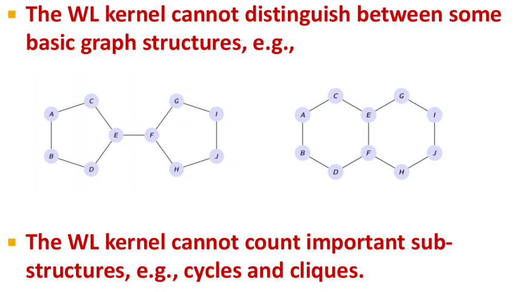

我们关注这个主要是因为，有机化学的结构式会大量使用环. 

表达能力的提升还有一定的空间，比如计算图目前仍然不能处理这个问题：

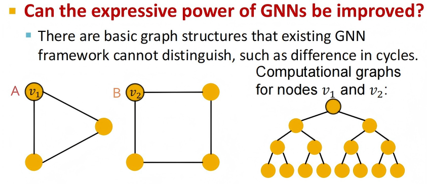

解决这个问题也有一定的方法[[3]](#3)[[4]](#4)[[5]](#5)，目前似乎也是一个前沿的方向.

---

### 现有GNN的不足

理想中完美的 GNN 模型应该满足：

* 局部邻域结构相同的节点，得到相同嵌入；

  - 局部邻域结构不同的节点，得到不同嵌入.

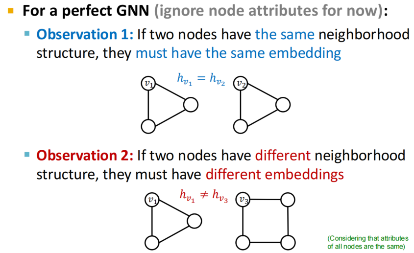

第2点经常是不满足的，看上面的反例就知道了. 在上一小节中能看出，已有GNN（到GIN为止）的表示能力被 WL锁死了.

第1点也存在一些问题，有时候我们不想让两个节点拥有一样的 embedding，即使它们有着相同的邻居结构. 这种情况常见于地图，我们称为  Position-Aware Task，如：

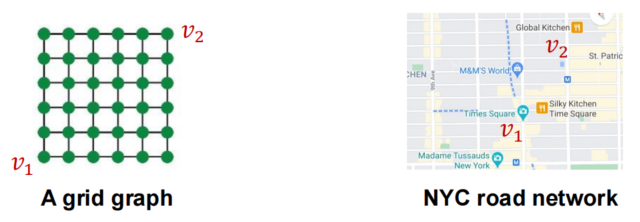

针对以上问题，解决方案有：

* Fix issues in Observation 2:

    * Build message passing GNNs that are more expressive than WL test

    * 示例方法：Structural-aware GNNs

* Fix issues in Observation 1:

    * Create node embeddings based on their positions in the graph

    * 示例方法：Position-aware GNNs

#### Structure-aware failures

这个层级的 failure 可以分成3种：

* Node Level

  
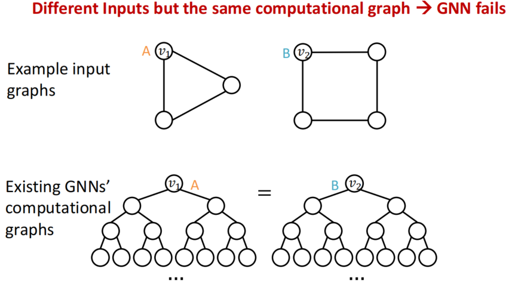

* Edge Level

    
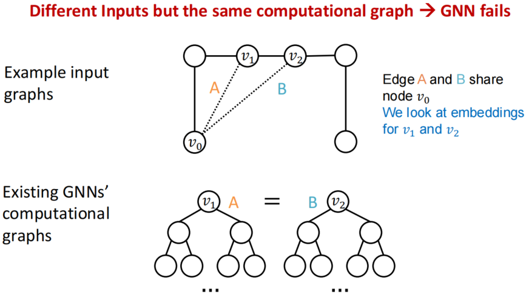

* Graph Level

    
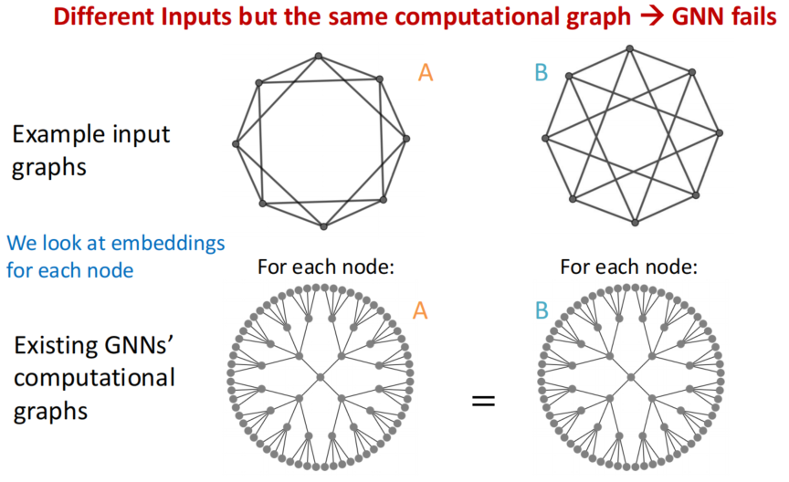

在这个层级上，WL kernel 的局限性体现在**节点最终体现出的颜色会继承图的对称性**.

考虑 GIN 的更新公式：

$$
c_v^{(l+1)} = \text{MLP}\Big( (1+\epsilon)c_v^{(l)} + \sum\limits_{u \in N(v)}\text{MLP}_f(c^{(l)}_u)\Big)
$$

接下来简化地考虑 MLP，认为它只有一层：

$$
c_v^{(l+1)} = \sigma\Big( \underbrace{{W^{(l)}(1+\epsilon)}}_{W^{(l)}_0} c_v^{(l)} + W^{(l)}\sum\limits_{u \in N(v)}\text{MLP}_f(c^{(l)}_u)\Big)
$$

其中 $\sigma$ 是逐元素的激活函数.

可以看出，这样的处理非常像 GraphSAGE 的sum聚合函数版本.

假设图中有 $n$ 个节点，将所有节点的特征按行堆叠成矩阵：

$$
C^{(l)}
=
\begin{bmatrix}
(\mathbf{c}_1^{(l)})^\top \\
(\mathbf{c}_2^{(l)})^\top \\
\vdots \\
(\mathbf{c}_n^{(l)})^\top
\end{bmatrix}
\in \mathbb{R}^{n \times d_l}
$$

其中 $d_l$ 表示第 $l$ 层节点特征的维度.

设图的邻接矩阵为 $A \in \mathbb{R}^{n \times n}$，邻接矩阵中的元素定义为 $A_{vu}=\begin{cases}1, & u \in \mathcal{N}(v), \\0, & \text{其他}.\end{cases}$，矩阵乘法 $AC^{(l)}$ 的第 $v$ 行为 $\left(AC^{(l)}\right)_v = \sum\limits_{u \in \mathcal{N}(v)}\mathbf{c}_u^{(l)}$，因此，$AC^{(l)}$ 可以一次性计算所有节点的邻居特征之和，整层图神经网络可以写成：

$$
C^{(l+1)}
=
\sigma
\left(
C^{(l)}W_0^{(l)}
+
AC^{(l)}W_1^{(l)}
\right)
$$

其中 $C^{(l)}W_0^{(l)}$ 表示节点自身信息，$AC^{(l)}W_1^{(l)}$ 表示聚合后的邻居信息，$\sigma$ 表示逐元素激活函数.

如果严格按照单层 GIN 的形式，则可以写成：

$$
C^{(l+1)}
=
\sigma
\left(
\left((1+\epsilon)I+A\right)
C^{(l)}W^{(l)}
\right)
$$

其中 $I$ 是单位矩阵，用来保留节点自身的信息.

---

真实图中的每个节点通常只与少量节点相连，因此邻接矩阵 \(A\) 中绝大多数元素都是 $0$. 如果直接保存完整的邻接矩阵，需要的存储空间为 $O(n^2)$，但图中实际存在的边可能只有 $|E|$ 条. 使用稀疏矩阵格式后，存储空间可以降低到 $O(|E|)$.

设 $A$ 是稀疏邻接矩阵，$C^{(l)}$ 是稠密的节点特征矩阵，结果中的第 $v$ 行是节点 $v$ 的所有邻居特征之和，则邻居信息的聚合可以通过 $AC^{(l)}$ 计算.

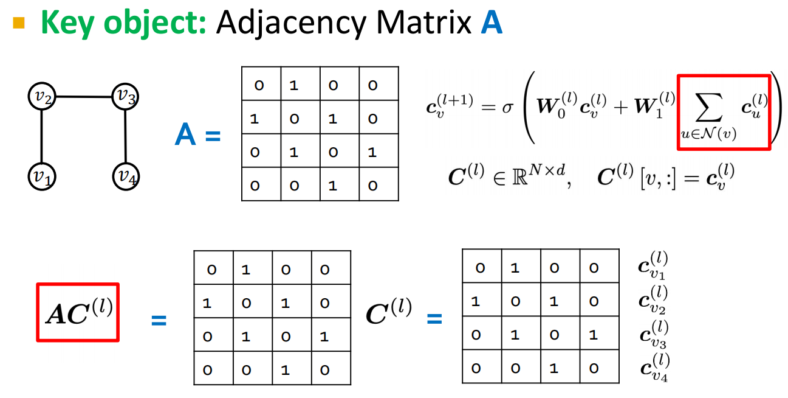

这类运算通常称为稀疏矩阵与稠密矩阵乘法：

$$
\mathrm{SpMM}
=
\text{Sparse Matrix--Dense Matrix Multiplication}
$$

因此，GIN 的计算过程可以概括为：

$$
\boxed{
\text{邻居特征求和}
\longrightarrow
\text{邻接矩阵乘特征矩阵}
\longrightarrow
\text{并行更新所有节点}
}
$$

使用稀疏矩阵计算的主要优点包括：

1. 不需要存储邻接矩阵中的大量零元素；
2. 可以同时完成所有节点的邻居聚合；
3. 能够利用 GPU 或专门的稀疏计算库进行加速；
4. 更适合处理节点和边数量较大的图.

为了化简上面的计算过程，考虑使用特征值分解：

$$
A = V \Lambda V^T
$$

$V = [v_1, v_2, \cdots, v_n]$是特征向量构成的正交矩阵，$\Lambda = \text{diag}(\lambda_1, \lambda_2, \cdots, \lambda_n)$ 是特征值矩阵. 由线性代数的知识可知：$\# \text{triangles} = \text{diag}(A^3) = \sum\limits_{n = 1}^N \lambda_n^3 |v_n|^2$.

于是带入得到：

$$
C^{(l+1)} = \sigma \Big( C^{(l)}W_0^{(l)} + AC^{(l)}W_1^{(l)} \Big )= \sigma \Big( \sum\limits_{k=0}^1 A^kC^{(l)}W_k^{(l)} \Big) = \sigma \Big( \sum\limits_{k=0}^1 V\Lambda^k \textcolor{red}{V^T C^{(l)}}W_k^{(l)} \Big)
$$

观察红色部分，$V^TC^{(0)} = V^T \bold{1}$，那么新的节点颜色只取决于不与 $\bold{1}$ 正交的特征向量；同时可以发现，具有对称性的图存在与向量 $\bold{1}$ 正交的特征向量，因为某个维度上会相抵消.

总结：The limitations of the WL kernel are limitations of the initial node color.

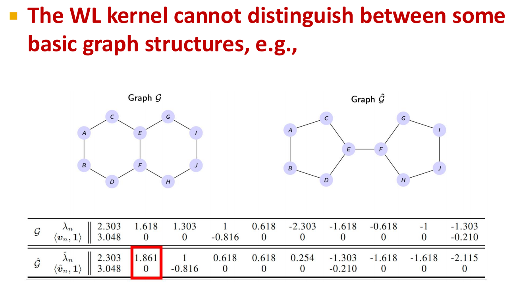

#### Feature Augmentation: Eigen-vector-based GNNs

##### 特征向量编码

首先定义图的 Laplacian Matrix $L = D - A$，其中 $D$ 是节点度数构成的对角矩阵，$A$ 是邻接矩阵.

举例：

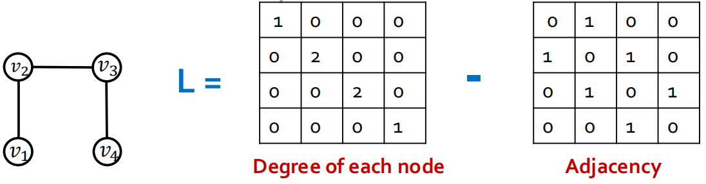

这个矩阵衡量的是单个节点与邻居之间的差异：

$$
(Lx)_i = \deg(i)x_i - \sum_{j \in N(i)} x_j = \sum_{j \in N(i)} (x_i-x_j)
$$

需要注意的是 特征值 $\lambda$ 衡量的是特征向量在图的边上变化得有多剧烈（Eigenvectors with small eigenvalue = global structure, large eigenvalue = local symmetries，解释也可以见[3.2.2](#Laplacian-Eigenvector-Positional-Encodings)）：

* 如果特征值小：对应相邻节点的特征向量值通常比较接近，跨越社区边界时才会大幅变动，所以刻画了连通分量、社区结构、图的主要分区、长距离/低频/整体变化、图中的全局几何形状等；
* 如果特征值大：许多相邻节点的特征向量值差异较大，甚至符号相反，刻画了局部边界、局部差异和部分对称信息.

##### 结构特征

One-hot 存在一定的局限

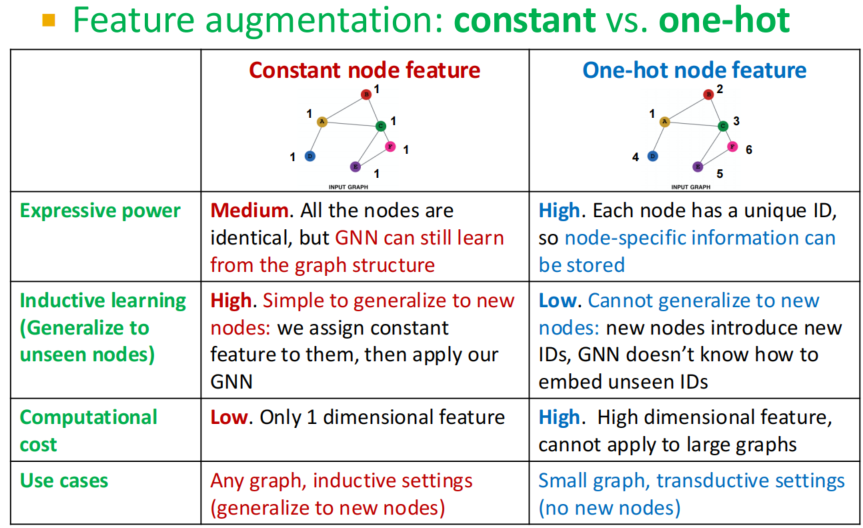

### Position-aware GNNs

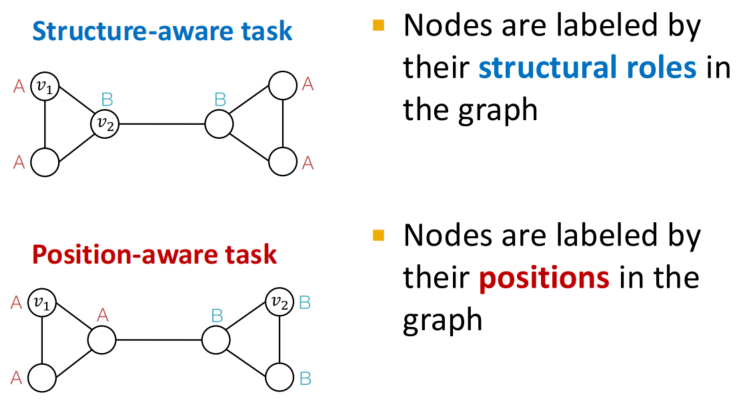

很遗憾的是，先前讲的 GNNs 在 Position-aware task 上面会失败，结构对称性导致对称节点获得一样的计算图和 embedding，无法做区分. 

对此，解决方法是设置一个 anchor node，随机挑选一个节点，计算其余节点相对它的距离：

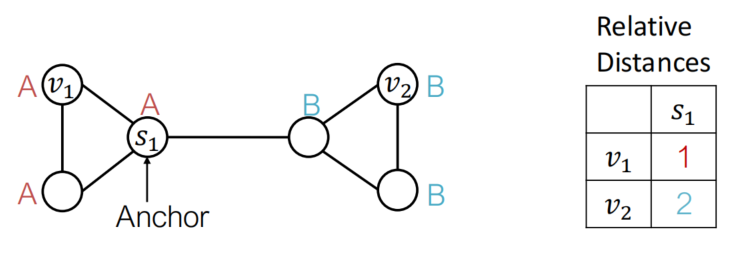

容易想到，更多的 anchor nodes 可以更好地描述结构，相当于引入了更多的参考系. 于是可以引入 anchor-sets 这个概念：

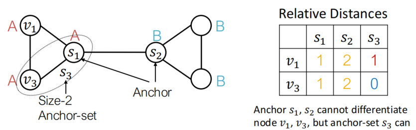

anchor-sets 看起来很合理，但似乎不够严谨. 因此目标是找到可以依赖的理论依据，希望将度量空间设置成欧氏空间 $\mathbb{R}^k$，并保留原有的距离度量. 此时就引入了 Bourgain Theorem:

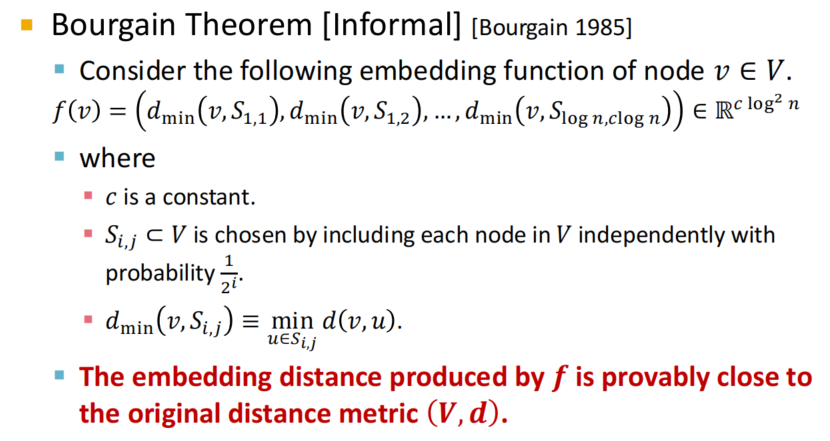

P-GNN[[6]](#6) 就借鉴了这一思想：训练时不断重新采样锚点集合，测试新图时也重新采样. 这样模型学习的是利用相对距离的方法，而不是记住训练图中的固定节点编号. 实际 P-GNN 还包含可学习的信息处理，并不只是输出原始距离向量.

为了利用位置信息，需要设计能正确处理锚点顺序的网络. 

* 若输出也保留锚点坐标，可以要求**置换等变性(Permutation Invariant)**：

    $$
    F(P\mathbf p)=PF(\mathbf p)
    $$

    其中 $P$ 是排列矩阵.

* 若最终输出是一个分类结果或相似度分数，则通常希望该结果对锚点的共同重排保持**不变性**. 例如，所有节点采用同样的坐标排列时：

    $$
    \|P\mathbf z_u-P\mathbf z_v\|_2 = \|\mathbf z_u-\mathbf z_v\|_2
    $$

    所以，模型内部可以让坐标跟随锚点顺序变化，最终预测则不应取决于锚点被列在第几位

## Graph Transformer

### Transformers and Relation to message passing GNNs

Transformer 的 self-attention update 机制是：（将 token $x_i$ 按行向量竖着堆起来，形成 $X$）

$$
\text{Attention}(X) = \text{softmax}(QK^T)V, \quad Q = XW_Q, K = XW_K, V = XW_V
$$

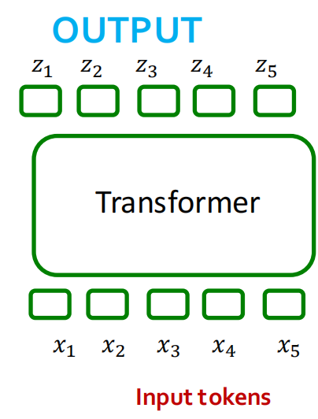

如果只考虑 token $x_1$，那么：

$$
z_1 = \sum_{j=1}^5 \text{softmax}_j(q_1^Tk_j)v_j
$$

如果用 GNN 的 message passing 视角来看 self attention：

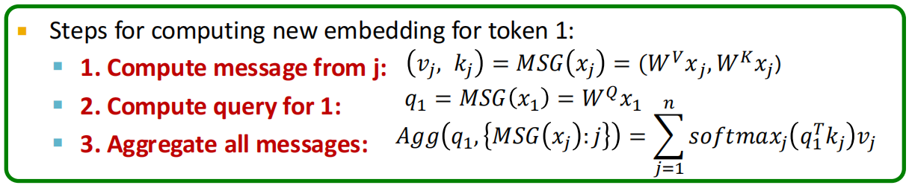

所以实际上，**Self-attention 可以被写作 message + aggregation 的形式，也就是说，就是一个 GNN!**

提炼一下发现：

* self-attention 是 message passing 的特例；
* self-attention 是 作用在 fully-connected graph 上的 message passing；
* 把 self-attention 中“关注所有节点”改成“只关注图中的邻居”就得到与 GAT 类似的图注意力机制，也就是在上一点的假设的基础上.

### A new design landscape for graph Transformers

接下来我们需要思考，如何将一个 graph 处理后输入给 transformer. 我们需要考虑三件事情：

* tokenizing
* self-attention
* **token ordering**

从上面的 message passing 公式来看，token order 似乎并不重要，因为只是求和. 然而这是很有问题的，考虑以下情形：

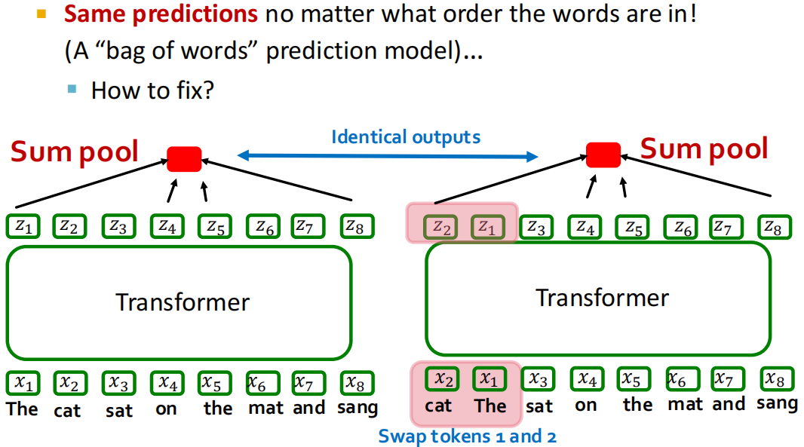

因此我们需要增加 positional encodings，即添加一层位置信息：

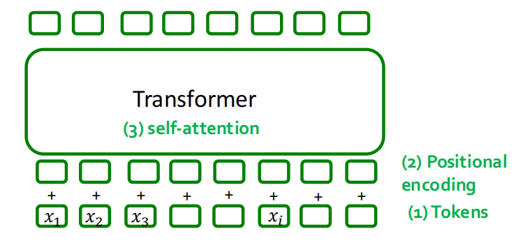

在这一步里面，同样可以将 adjacency info 添加进去，于是目标变成了：如何设计一个好的 positional encodinig？

#### Relative Distance

类似上面提到的 Anchor-sets，到特定锚点的距离很好地描述了相对位置，缺点是不一定直接反映结构角色.

#### Laplacian Eigenvector Positional Encodings

特征向量满足：

$$
Lu = \lambda u, u \in \mathbb{R}^n
$$

所以可以把 **一个特征向量** 理解成 **在整张图上分布的一种数值模式**.

对于无向图而言：

$$
u^T Lu = \sum_{\{i,j\} \in E}(u(i) - u(j))^2
$$

取 $u$ 是单位长度的特征向量，则：

$$
\lambda = \sum_{\{i,j\} \in E}(u(i) - u(j))^2
$$

所以可以看出：

* **小特征值**：相邻节点的数值变化较缓，反映大尺度结构

* **大特征值**：沿边变化更剧烈，反映更高频的结构变化

一列描述整张图的一种模式，一行才是一个节点的坐标.

#### Edge Features in Self-attention

考虑标准注意力分数：
$$
s_{ij} = \frac{q_i^Tk_j}{\sqrt{d_k}} \Longleftrightarrow S = \frac{QK^T}{\sqrt{d_k}}
$$

如果加入了边信息，那么：

$$
s_{ij} = \frac{q_i^Tk_j}{\sqrt{d_k}} + c_{ij}
$$

在计算 $c_{ij}$ 时，需要考虑以下情况：

* 如果节点 $i,j$ 之间有边，特征为 $e_{ij}$，则定义 $c_{ij} = w^T_1e_{ij}$
* 如果节点 $i,j$ 之间无边，那么找到 $i,j$ 之间的最短路 $(e^1, e^2, \cdots, e^N)$，计算 $c_{ij} = \sum\limits_n w_n^Te^n$

再计算：
$$
\alpha_{ij} = \frac{\exp(s_{ij})}{\sum_{t}\exp(s_it)}, \quad h_i'=\sum_j \alpha_{ij}v_j
$$

#### Positional Encoding for Graph Transformer

Laplacian Encoding 存在符号不唯一的隐藏问题，这是因为：
$$
Lu=\lambda u \Longleftrightarrow L(-u) = \lambda (-u)
$$
所以 $u$ 和 $−u$ 都是合法特征向量，但这样会在呈现位置编码的时候出现问题，因为普通神经网络并不自动满足$f(X,u)=f(X,−u)$.

对此有两种方法解决：

* 数据增强：训练时随机翻转整列特征向量的符号。这样可以鼓励模型忽略符号，但不保证严格不变

* 从网络结构上保证符号不变性

    考虑构造：$g(u)=\phi(u)+\phi(−u)$

## 参考文献

> * <a id = '1'>[1]</a>：[ICLR 2019] How Powerful are Graph Neural Networks?，[论文地址](https://arxiv.org/abs/1810.00826)
>
> * <a id = '2'>[2]</a>：Kurt Hornik, Maxwell Stinchcombe, and Halbert White. Multilayer feedforward networks are universal approximators. Neural networks, 2(5):359–366, 1989.
>
> * <a id = '3'>[3]</a>：[NIPS 2020] Distance Encoding: Design Provably More Powerful Neural Networks for Graph Representation Learning，[论文地址](https://arxiv.org/abs/2009.00142)
>
> * <a id = '4'>[4]</a>：[AAAI 2021] Identity-aware Graph Neural Networks，[论文地址](https://arxiv.org/abs/2101.10320)
>
> * <a id = "5">[5]</a>：[ICLR 2024] Counting Graph Substructures with Graph Neural Networks，[论文地址](https://proceedings.iclr.cc/paper_files/paper/2024/file/b7b4a06644d0747c9482c4e25646a43f-Paper-Conference.pdf)
>
> * <a id = "6">[6]</a>：[ICLR 2019] Position-aware Graph Neural Networks，[论文地址](https://arxiv.org/pdf/1906.04817)

