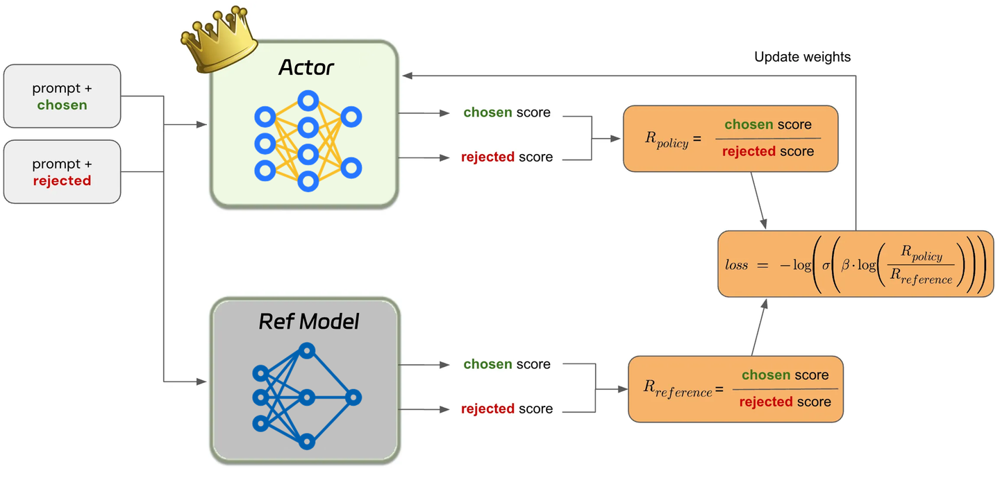

# [NeurIPS 2023] Direct Preference Optimization: Your Language Model is Secretly a Reward Model

> - 论文地址：https://arxiv.org/abs/2305.18290

原先工作的 Problem:

1. **RLHF pipeline 复杂，训练成本高。**
    传统流程需要先做 SFT，再用偏好数据训练 reward model，最后通过 PPO 优化 policy。最后一个阶段还需要反复生成回答、计算 reward 和更新策略，涉及多个模型与相互关联的训练组件。
2. **PPO 的策略优化存在稳定性问题。**
    训练既要提升 reward，又要限制模型偏离 reference policy。论文指出，actor-critic 方法中的 value estimation 不准确可能增加梯度方差，影响优化稳定性。
3. **偏好学习本身是比较问题，却被转换成了更复杂的 RL 问题。**
    数据通常只告诉我们“同一个问题下，回答 A 比回答 B 好”，并不直接提供绝对 reward。作者的切入点是：能否直接用这种比较信号训练最终 policy？

**Motivation：找到 reward function 与其最优 policy 之间的解析映射，把 reward model 的最大似然训练改写为 policy 的最大似然训练。**

---

## 构建方法论（Methodology）

### Overview

DPO 是一个**直接使用离线偏好数据进行语言模型对齐**的方法，其核心分为三步：

1. 从传统 RLHF 的 KL 正则化目标出发，写出给定 reward 对应的最优 policy。
2. 反过来，用 policy 与 reference policy 的概率比表示 reward。
3. 将这个表达式代入 Bradley-Terry preference model，利用同一 prompt 下公共项的抵消，得到可直接训练语言模型的分类损失。

模型仍然学习“什么回答更值得生成”，但这个偏好被编码在 **policy 相对 reference policy 的概率变化**中。因此，policy 同时承担最终生成模型与 implicit reward model 的角色。

### 1. Fine-tuning & Alignment：从 RLHF 推导 DPO

1. 偏好数据与 Bradley-Terry model

    训练数据为 $\mathcal D=\{(x,y_w,y_l)\}$，其中：

    | 符号                 | 含义                    |
    | -------------------- | ----------------------- |
    | $x$                  | prompt                  |
    | $y_w$                | preferred completion    |
    | $y_l$                | dispreferred completion |
    | $r(x,y)$             | 回答的潜在 reward       |
    | $\pi_\theta$         | 待训练 policy           |
    | $\pi_{\mathrm{ref}}$ | 固定 reference policy   |

    Bradley-Terry model 用 reward 差值描述偏好概率：

    $$
    p(y_w\succ y_l\mid x) = \frac{\exp r(x,y_w)} {\exp r(x,y_w)+\exp r(x,y_l)} = \sigma\big(r(x,y_w)-r(x,y_l)\big)
    $$
    这里 $\sigma(z)=1/(1+e^{-z})$.

    **reward 差越大，模型认为 $y_w$ 获胜的概率越高。**传统 reward modeling 就是在拟合这个概率。

2. 用最优 policy 表示 reward，进而推出 loss 函数：

    最优 policy的计算：

    $$
    \pi_r(y\mid x) = \frac{1}{Z(x)} \pi_{\mathrm{ref}}(y\mid x) \exp\left(\frac{r(x,y)}{\beta}\right)
    $$
    其中 $Z(x) = \sum_y \pi_{\mathrm{ref}}(y\mid x) \exp\left(\dfrac{r(x,y)}{\beta}\right)$，表示在 reference policy 的基础上，按照 reward 对回答概率重新加权.

    直接计算 $Z(x)$ 很困难，因为需要遍历所有可能回答。但 DPO 不需要实际计算它. 对上式取对数并整理：
    $$
    r(x,y) = \beta\log\frac{\pi_r(y\mid x)} {\pi_{\mathrm{ref}}(y\mid x)} + \beta\log Z(x).
    $$
    同一个 prompt 的两条回答相减时：

    $$
     r(x,y_w)-r(x,y_l) = \beta\log\frac{\pi_r(y_w\mid x)} {\pi_{\mathrm{ref}}(y_w\mid x)} - \beta\log\frac{\pi_r(y_l\mid x)} {\pi_{\mathrm{ref}}(y_l\mid x)}. 
    $$
    **难以计算的 $\beta\log Z(x)$ 抵消，**这就是整篇论文的关键：偏好模型只依赖 reward difference，因此不需要恢复 reward 的绝对值. 

    用可训练的 $\pi_\theta$ 替代上述 policy，得到
    $$
    \boxed{ \mathcal L_{\mathrm{DPO}} = -\mathbb E_{(x,y_w,y_l)\sim\mathcal D} \log\sigma \left( \beta\log\frac{\pi_\theta(y_w\mid x)} {\pi_{\mathrm{ref}}(y_w\mid x)} - \beta\log\frac{\pi_\theta(y_l\mid x)} {\pi_{\mathrm{ref}}(y_l\mid x)} \right) }
    $$
    定义 implicit reward $\hat r_\theta(x,y) = \beta\log \dfrac{\pi_\theta(y\mid x)} {\pi_{\mathrm{ref}}(y\mid x)}$，则损失可以简写为 $\mathcal L_{\mathrm{DPO}} = -\mathbb E_{\mathcal D} \log\sigma \big( \hat r_\theta(x,y_w)-\hat r_\theta(x,y_l) \big). $

    **它比较的是两条回答相对 reference policy 的概率变化，而不只是两条回答的原始概率。**

    

2. DPO 更新模型，只要令：
    $$
    \Delta_\theta = \hat r_\theta(x,y_w)-\hat r_\theta(x,y_l),
    $$
    单个偏好对的梯度为：

    $$
    \nabla_\theta\ell = -\beta\sigma(-\Delta_\theta) \left[ \nabla_\theta\log\pi_\theta(y_w\mid x) - \nabla_\theta\log\pi_\theta(y_l\mid x) \right]
    $$
    它提供两个更新方向：

    - 提升 preferred completion 的 log probability。
    - 降低 dispreferred completion 的 log probability。

    同时通过 $\sigma(-\Delta_\theta)$ 调整权重：

    | 当前排序情况     | 更新权重 |
    | ---------------- | -------- |
    | 错误地偏向 $y_l$ | 较大     |
    | 两者难以区分     | 中等     |
    | 已明显偏向 $y_w$ | 较小     |

    这种动态权重十分关键；简单地不断提高 preferred probability、压低 rejected probability，可能导致生成退化。

3. “语言模型本身就是 reward model”的理论含义

    若两个 reward function 只相差一个与回答无关的函数 $r'(x,y)=r(x,y)+f(x)$, 它们会产生相同的偏好概率和相同的 KL 正则化最优 policy. DPO 选择的是每个 reward equivalence class 中形如 $r(x,y)=\beta\log\dfrac{\pi(y\mid x)}{\pi_{\mathrm{ref}}(y\mid x)}$的代表.

    **在论文定理的假设下，这种重参数化不会损失可表示的 reward equivalence classes。**但这不意味着有限数据、有限模型容量和实际优化下，DPO 一定恢复真实最优 policy。

---

System & Infrastructure Co-design：简化训练流程

| 对比项                             | PPO-based RLHF             | DPO          |
| ---------------------------------- | -------------------------- | ------------ |
| 偏好阶段训练独立 reward model      | 需要                       | 不需要       |
| policy optimization 时在线生成回答 | 需要                       | 不需要       |
| value estimation                   | 常见 actor-critic 实现需要 | 不需要       |
| reference policy                   | 用于 KL regularization     | 用于概率比   |
| 主要优化形式                       | RL policy update           | 偏好分类损失 |
| 推理阶段                           | policy 生成                | policy 生成  |

DPO 的成本优势来自**省去 RL optimization loop**。它仍需要成对回答及其偏好标签；如果这些数据需要自行生成和标注，数据准备阶段仍有成本。

> PPO 考验的是你的显卡财力，而 DPO 考验的是你的数据清洗能力.
