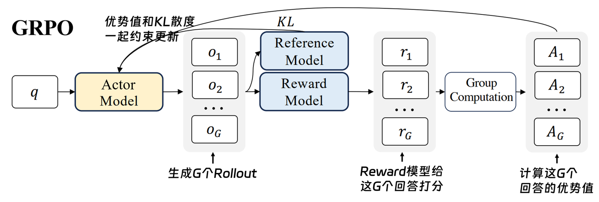
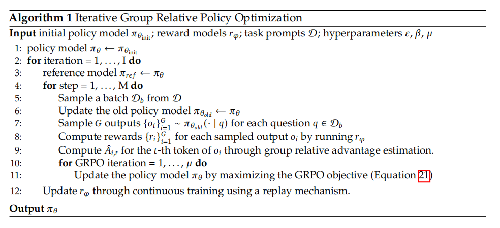

# DeepSeekMath: Pushing the Limits of Mathematical Reasoning in Open Language Models

> - 论文地址：[arXiv:2402.03300](https://arxiv.org/abs/2402.03300)
> - Github仓库：[deepseek-ai/DeepSeek-Math](https://github.com/deepseek-ai/DeepSeek-Math)
> - **更简洁的摘要：** 通过高质量大规模数学继续预训练、数学 SFT 与 GRPO 三阶段提升 7B 模型数学推理能力；其中 GRPO 用**同一问题多条采样答案的组内相对 reward**替代 PPO 的 Critic/Value Model，在降低训练资源的同时实现有效 RL. **保留 PPO 的 clipped policy optimization 框架，同时重新设计 Advantage Estimation，利用同一 prompt 的多次 rollout 直接构造 baseline，从而移除 Critic**

原先工作的 Problem：

1. **开源数学模型与闭源模型存在明显性能差距。** GPT-4、Gemini-Ultra 等数学推理能力较强，但不可开放获取；当时的开源模型在复杂数学推理上仍显著落后
2. **高质量数学预训练数据仍不足。** 公开 Web 中包含大量数学知识，但已有数学 corpus 规模有限、英语偏置明显，且如何从 Common Crawl 中系统性挖掘高质量数学网页仍未充分解决
3. **PPO 用于 LLM reasoning 的资源成本较高。** PPO 需要额外训练与 policy 大小相近的 Value Model，并利用它估计 advantage；而 LLM reasoning 往往只在完整回答末端得到 reward，使 token-level value estimation 本身也较困难.

------

DeepSeekMath 是一个针对**数学推理能力训练**的完整 pipeline，可以概括为三个阶段：

1. **Math Pre-Training**：从 Common Crawl 构造 120B-token DeepSeekMath Corpus，并在 DeepSeek-Coder-Base-v1.5 7B 上继续预训练；
2. **Mathematical SFT**：使用 CoT、PoT、Tool-Integrated Reasoning 等数学指令数据得到 DeepSeekMath-Instruct 7B；
3. **GRPO Reinforcement Learning**：取消 PPO 的 Value Model，通过同题多响应之间的相对 reward 估计 advantage，得到 DeepSeekMath-RL 7B.

<center></center>

------

## 构建方法论（Methodology）

1. Math Pre-Training：从 Common Crawl 挖掘 120B 高质量数学数据，设计了一个**迭代式 Data Engine** 以构造数据

    首先使用 OpenWebMath 作为 seed corpus：

    - 随机选择 500K 数学网页作为 positive；
    - 从 Common Crawl 中选择 500K 普通网页作为 negative；
    - 训练 fastText classifier，对经过 URL 去重和 near-deduplication 后的约 **40B HTML pages** 进行数学内容召回

    第一轮之后，由于 seed corpus 的分布有限，classifier 会漏掉大量数学网站，因此进一步执行：

    **Recall → Domain Discovery → URL Annotation → Expand Seed → Retrain Classifier**

    当某个 domain 中超过 10% 页面被第一轮分类器召回时，将其视为 math-related domain；人工进一步标注其中数学相关 URL path，将漏召回页面加入新的 seed corpus。经过四轮迭代，最终获得 $35.5\text{M webpages},\,120\text{B tokens}$ （第四轮中约 98% 数据已经在第三轮被发现，因此停止继续迭代）

    为降低 benchmark contamination，若训练文本中存在与 GSM8K、MATH、CMATH、AGIEval 等 benchmark 的 **10-gram exact match**，对应文本会被过滤. 最终 DeepSeekMath-Base 7B 从 **DeepSeek-Coder-Base-v1.5 7B** 初始化，并继续训练 500B tokens：

    $$ \begin{aligned} 56\% &: \text{DeepSeekMath Corpus}\\ 4\% &: \text{AlgebraicStack}\\ 10\% &: \text{arXiv}\\ 20\% &: \text{GitHub Code}\\ 10\% &: \text{General Natural Language} \end{aligned} $$

    这里一个重要发现是：**Code → Math 的两阶段训练明显优于 General → Math**. 实验显示 code training 不仅增强 Python-assisted reasoning，还能提升不使用工具时的数学推理；作者据此认为 code training 至少在数学领域能够促进 reasoning capability.


------

2. Mathematical SFT：统一 CoT / PoT / Tool-Integrated Reasoning

    在 DeepSeekMath-Base 之上构造约 **776K** 数学 instruction examples，覆盖英语和中文数学问题，并混合三类 reasoning format：

    - **Chain-of-Thought (CoT)**：自然语言逐步推理；
    - **Program-of-Thought (PoT)**：使用程序完成计算；
    - **Tool-Integrated Reasoning**：自然语言推理与 Python/tool interaction 结合。

    英文数据包括 GSM8K、MATH、MathInstruct、Lila-OOD 等；中文部分覆盖 K-12 数学中的 76 个 sub-topics

    训练设置：

    $$
    \text{context length}=4K,\qquad \text{batch size}=256, \text{steps}=500,\qquad \text{learning rate}=5\times10^{-5}.
    $$

    得到 **DeepSeekMath-Instruct 7B**，作为后续 RL 的 initial policy.

------

3. GRPO：用 Group Relative Reward 替代 PPO Critic

    GRPO 最核心的改变是：**不再训练 Value/Critic Model，而是让同一道题采样出的多个答案互相充当 baseline**

    **Value Model**：GRPO 对每个问题 $q$ ，从旧策略采样一个 group

    $$
    \{o_1,o_2,\ldots,o_G\} \sim \pi_{\theta_{\mathrm{old}}}(\cdot|q)
    $$

    Reward Model 分别得到 $\mathbf r=\{r_1,r_2,\ldots,r_G\}$.

    **Outcome Supervision**：直接进行组内标准化：

    $$
        \hat A_{i,t} = \tilde r_i = \frac{r_i-\operatorname{mean}(\mathbf r)} {\operatorname{std}(\mathbf r)}.
    $$

    同一个 response 内所有 token 使用相同 relative advantage.
    GRPO 询问 Critic “在**同一道题的这组回答里**，这个回答比平均水平好还是差”，根据结果做 Group Relative 处理：

    - 高于组平均值 → positive advantage → 增大概率；
    - 低于组平均值 → negative advantage → 降低概率

    GRPO objective 仍继承 PPO 的 probability ratio clipping，同时直接在 loss 中加入 policy 与 reference policy 的 KL regularization：

    $$
    L_{\text{GRPO}} = \frac{1}{G} \sum_{i=1}^G \left( \underbrace{\min \left( \frac{\pi_{\theta}(o_i)}{\pi_{\theta_{\text{old}}}(o_i)} A_i, \ \text{clip}(\dots) A_i \right)}_{\text{PPO同款：限制更新幅度}} - \underbrace{\beta \text{KL}(\pi_{\theta} || \pi_{\text{ref}})}_{\text{DPO同款：不忘初心}} \right)
    $$

    $$
        J_{\mathrm{GRPO}}(\theta) = \mathbb E \left[ \frac1G \sum_{i=1}^G \frac1{|o_i|} \sum_t \left\{ \min \left[ r_{i,t}(\theta)\hat A_{i,t}, \operatorname{clip} (r_{i,t}(\theta),1-\epsilon,1+\epsilon) \hat A_{i,t} \right] -\beta D_{\mathrm{KL}} (\pi_\theta\|\pi_{\mathrm{ref}}) \right\} \right].
    $$

    <center></center>

    GRPO 将 KL divergence **直接加入 optimization objective**，避免其影响 group-relative advantage 的计算.

    GRPO 还研究了 **Process Supervision**：在每个 reasoning step 末端产生 reward，并令某 token 的 advantage 为其之后所有 step reward 的累计：

    $$
        \hat A_{i,t} = \sum_{\operatorname{index}(j)\ge t} \tilde r^{\,\operatorname{index}(j)}_i
    $$

    因此相比只判断最终答案正确与否的 Outcome Supervision，Process Supervision 可以提供更细粒度的 reasoning signal.

## GRPO Training Pipeline

DeepSeekMath-RL 从 **DeepSeekMath-Instruct 7B** 开始训练。

训练数据只采用 SFT 中与 GSM8K、MATH 相关的 CoT questions，共约 $144K\text{ questions}$.

关键配置：

- Policy learning rate：$1\times10^{-6}$
- KL coefficient：$\beta=0.04$
- 每道问题采样：**64 outputs**
- Maximum generation length：1024
- Batch size：1024
- 每轮 exploration 后 Policy 只进行一次更新

------

## GRPO 为什么优于一些更简单的 Alignment 方法？

作者将 SFT、RFT、DPO、Online RFT、PPO、GRPO 放进统一范式：

$$
\nabla_\theta J_A(\theta) = \mathbb E_{(q,o)\sim D} \left[ \frac1{|o|} \sum_t GC_A(q,o,t,\pi_{rf}) \nabla_\theta\log\pi_\theta(o_t|q,o_{<t}) \right].
$$

核心可以拆成三个因素：

1. **Data Source**
2. **Reward Function**
3. **Algorithm / Gradient Coefficient**

分析：

1. Online sampling 比 Offline sampling 更有效

    RFT / DPO 的 outputs 来源于固定 SFT Model，因此属于 **offline sampling**。

    Online RFT / PPO / GRPO 则不断从当前 Policy Model 重新 rollout，属于 **online sampling**。

    实验中 Online RFT 后期明显优于 RFT，因为随着 Policy 更新，当前模型生成的数据分布逐渐偏离初始 SFT model；持续使用当前 policy 的探索结果能更准确覆盖模型当前的失败模式

2. GRPO 比 Online RFT 多了“负反馈”

    Online RFT：

    - 正确回答 → reinforce；
    - 错误回答 → 不训练。

    GRPO：

    - 高 reward → positive gradient；
    - 低 reward → negative gradient；
    - reward 越好/越差，reinforcement / punishment 强度也不同。

    因此 reward 不再只是一个 **filter**，而真正决定 gradient coefficient。GRPO+Process Supervision 进一步优于 Outcome Supervision，表明 step-level training signal 更有效.

------

## 本文架构优势

1. GRPO 大幅降低 PPO 的训练资源需求

    * 传统 PPO：Policy Model + Reference Model + Reward Model + Value Model

    * GRPO：Policy Model + Reference Model + Reward Model + Group Relative Advantage

    最关键是移除了与 Policy 大小接近的 **Value Model**，直接缓解 LLM RL 的显存与计算负担

2. 将 reasoning RL 从“绝对价值估计”转换为“同题相对比较”

    数学任务天然容易产生：

    ```
    Question
     ├── Solution 1
     ├── Solution 2
     ├── Solution 3
     └── Solution 4
    ```

    Reward Model 本身往往也是根据同题多个回答之间的 preference / correctness 学习的，因此 group-relative advantage 与 reward model 的 comparative nature 更一致.

3. Data Engine + SFT + RL 构成完整数学 reasoning training pipeline

    DeepSeekMath 的贡献并不只有 GRPO：

    ```
    Code Base Model
          ↓
    Large-scale Math Continual Pre-training
          ↓
    DeepSeekMath-Base
          ↓
    CoT / PoT / Tool SFT
          ↓
    DeepSeekMath-Instruct
          ↓
    GRPO
          ↓
    DeepSeekMath-RL
    ```

    它同时说明：**高质量 domain data、reasoning-formatted SFT 与 online RL 是相互叠加，而不是互相替代的**.


------

## Limitations & Future Work

1. GRPO 当前的数据探索仍较弱

    RL questions 仍来自 instruction tuning data，且只使用较简单的 nucleus sampling。

    作者认为这可能正是 **Maj@K 提升而 Pass@K 不提升**的原因之一，并提出未来探索：

    - Out-of-Distribution questions；
    - Tree-search based decoding；
    - 更高效的 inference / exploration mechanism

2. Reward Model reliability 是 RL 的核心瓶颈

    当前 RL algorithm 基本完全相信 reward signal：

    $$ \text{Reward}\rightarrow \text{Gradient Coefficient}. $$

    但复杂 reasoning 中 reward 本身可能存在噪声，因此未来方向包括：

    - 对 noisy reward 更 robust 的 RL algorithm；
    - Weak-to-Strong alignment；
    - Reward uncertainty modeling

3. Process Reward Model 仍需要进一步发展

    Fine-grained reasoning supervision 的实验效果优于 outcome-only reward，但高质量 PRM 的构建本身困难。

    未来需要解决：

    - Reward Model 的 OOD generalization；
    - Reward uncertainty；
    - 高质量、低成本 Process Reward Model

4. DeepSeekMath 自身能力仍存在明显短板

    主要包括：

    - geometry 与 theorem proving 相比闭源模型较弱；
    - triangle、ellipse 等问题表现差，可能反映 data selection bias；
    - 受限于 7B model scale，few-shot learning 能力明显弱于 GPT-4
